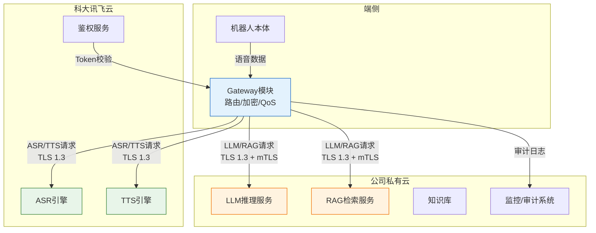

---

## 九、混合云部署需求

### 9.1 背景说明

本公司机器人采用**混合云架构**：
- **科大讯飞云**：负责ASR（语音识别）、TTS（语音合成）、基础音频前端算法
- **公司私有云**：负责LLM大模型推理、RAG知识库检索、多模态云端服务、业务数据存储

所有云端通信统一通过端侧 **Gateway模块** 进行路由、安全加密和带宽管理。

### 9.2 需求清单

| 序号 | 需求大类 | 需求子类 | 需求项 | 规格要求/详细描述 | 优先级 | 验收标准 | 备注 |
| --- | --- | --- | --- | --- | --- | --- | --- |
| 71 | 混合云部署 | 路由配置 | 多Endpoint支持 | SDK/API需支持配置至少2个独立云端Endpoint（科大讯飞云 + 公司云），支持按能力域路由 | P0 | 配置文件中可分别设置asr_endpoint、tts_endpoint、llm_endpoint、rag_endpoint | Gateway层实现路由分发 |
| 72 | 混合云部署 | 路由配置 | 能力域固定路由 | ASR/TTS请求固定路由至科大讯飞云；LLM/RAG/知识库请求固定路由至公司云；不允许混用 | P0 | 抓包验证各请求到达正确目标地址 | 防止数据误路由 |
| 73 | 混合云部署 | 网络隔离 | 带宽隔离与QoS | Gateway需为不同云端通道分配独立带宽配额：ASR/TTS通道≥200kbps，LLM通道≥500kbps，互不影响 | P0 | 高并发LLM请求不阻塞ASR/TTS实时流 | 参考Gateway带宽隔离设计 |
| 74 | 混合云部署 | 安全 | 数据分类与出域控制 | 明确分类：语音原始音频可出域至科大讯飞；访客画像/交互日志/业务数据禁止出域，仅允许在公司云内处理 | P0 | 安全审计通过，无业务数据泄露至第三方云 | 需签署数据安全协议 |
| 75 | 混合云部署 | 安全 | 传输加密 | 所有云端通信必须TLS 1.3，科大讯飞云侧支持mTLS双向认证优先 | P0 | 通过渗透测试，无明文传输 | Gateway默认启用TLS |
| 76 | 混合云部署 | 安全 | 密钥与Token管理 | 支持动态Token刷新（科大讯飞AIUI Token + 公司云API Key），Token过期前自动续期，不中断服务 | P1 | Token过期时服务无感知切换 | 避免硬编码密钥 |
| 77 | 混合云部署 | 可靠性 | 多云故障降级 | 科大讯飞云服务异常时，ASR/TTS自动降级至端侧（已有需求24）；公司云服务异常时，LLM降级至本地模板回复 | P0 | 单云故障不影响另一云能力，机器人仍可基础交互 | 见需求24 fallback机制 |
| 78 | 混合云部署 | 可靠性 | 健康探测与熔断 | Gateway对各云端Endpoint进行周期性健康探测（周期≤10s），连续3次失败触发熔断，停止向故障云发送请求 | P1 | 故障云恢复后自动解除熔断 | HDS集成告警 |
| 79 | 混合云部署 | 可观测性 | 多云链路追踪 | 每次跨云请求需携带统一trace_id，Gateway记录各云响应延迟、状态码、错误码，上报至公司云监控系统 | P1 | 可端到端追踪一次语音交互经过的所有云端节点 | 便于定位是科大讯飞云慢还是公司云慢 |
| 80 | 混合云部署 | 可观测性 | 审计日志 | Gateway记录所有出域请求（目标地址、能力类型、数据大小、时间戳），日志留存≥90天，支持合规审计 | P1 | 提供结构化日志接口，对接公司日志系统 | 满足等保/数据合规要求 |
| 81 | 混合云部署 | 商务 | 科大讯飞私有化备选 | 供应商需提供AIUI私有化引擎报价（Docker/K8s部署），作为公有云高并发/数据敏感场景的备选方案 | P1 | 提供私有化部署方案白皮书及报价单 | 量产阶段评估 |
| 82 | 混合云部署 | 商务 | 公司云对接支持 | 科大讯飞需提供SDK源码或gRPC/HTTP接口规范，便于公司云侧Gateway进行协议封装和适配 | P1 | 接口文档覆盖所有ASR/TTS/鉴权接口 | 降低集成成本 |

### 9.3 混合云架构示意

### 9.4 关键设计约束

1. **Gateway是唯一出口**：所有云端通信必须经过Gateway，禁止HAL_Audio/Agent/Interaction等模块直连任何云端服务。
2. **数据最小化原则**：上传至科大讯飞云的音频数据仅用于ASR/TTS，不包含访客身份信息、位置信息、业务上下文。
3. **Token分离管理**：科大讯飞Token和公司云API Key分别存储、分别刷新、分别失效处理。
4. **弱网优先保语音**：当总出口带宽不足时，Gateway优先保障ASR/TTS通道，LLM请求可排队或降级。
