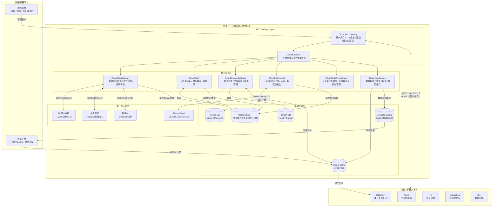
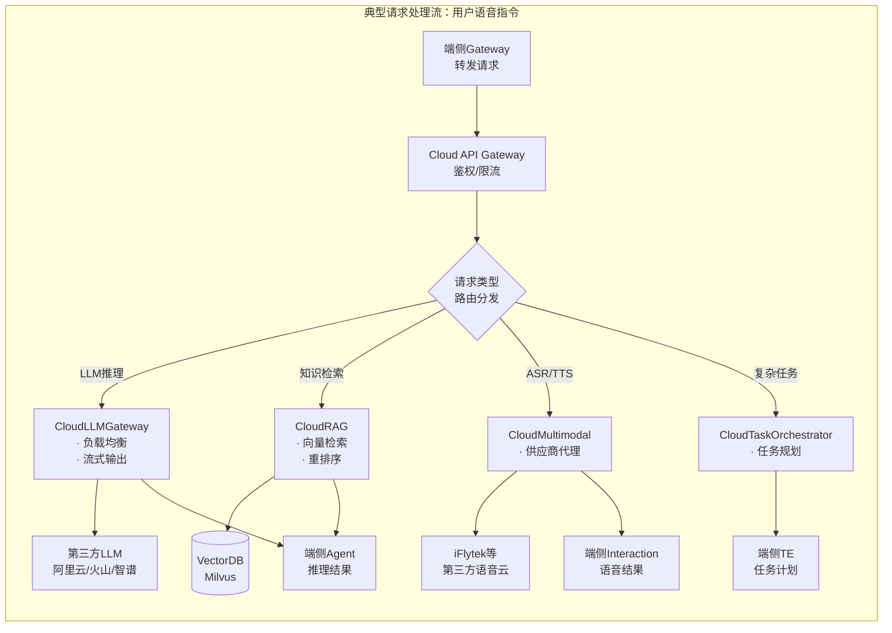
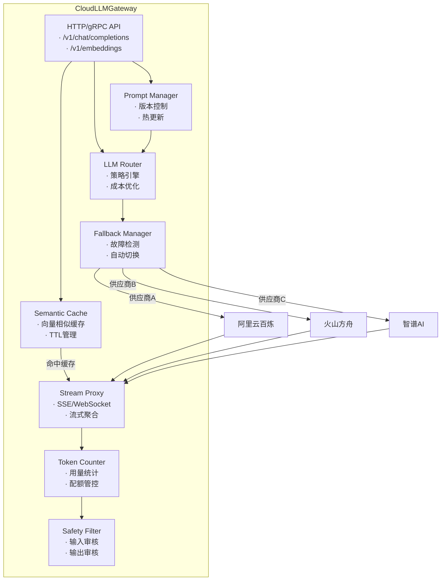
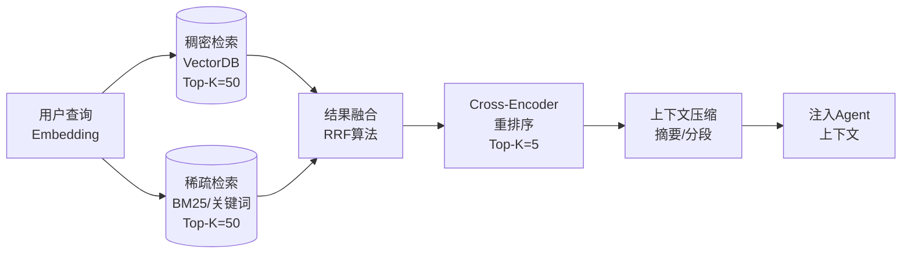
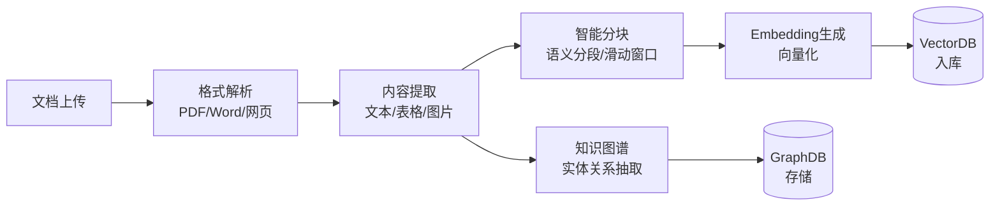
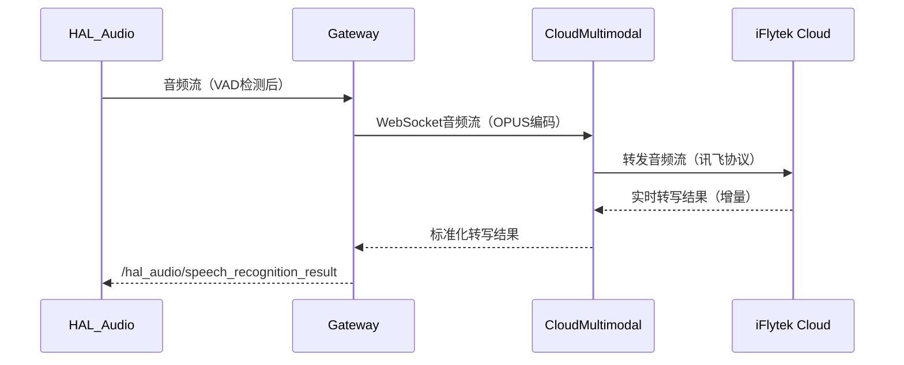
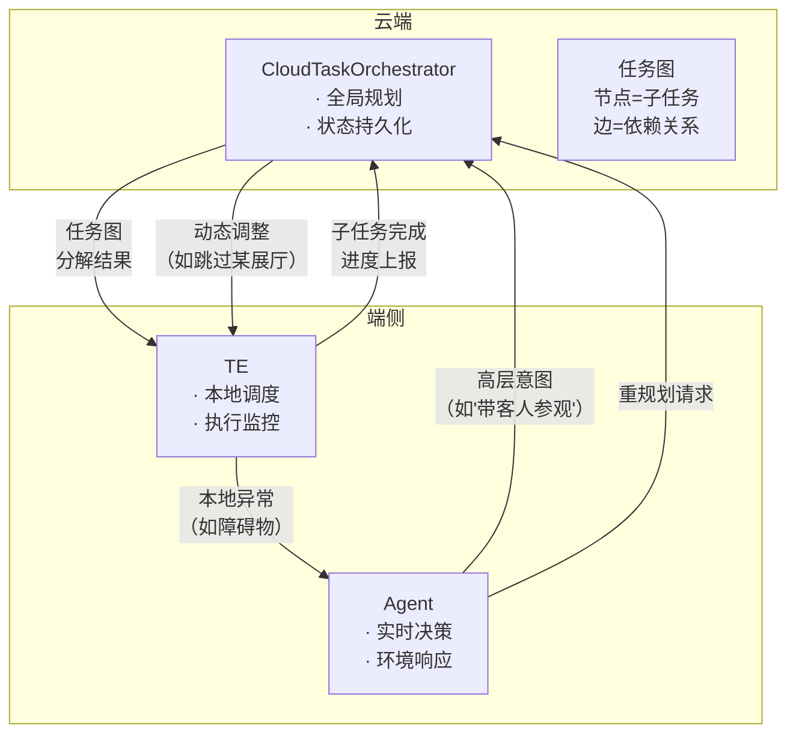
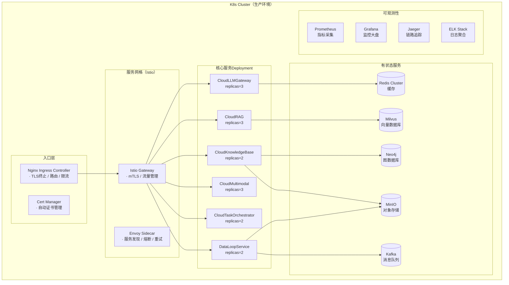

# 交互云详细方案设计

## 1. 模块概述与定位

**模块名称**：Interaction Cloud（交互云）

**定位**：交互云是端侧软件系统的**云端智能中枢**，位于公司私有云/混合云基础设施之上，是机器人"大脑"的云端延伸。它负责承载端侧无法部署或不宜部署的大模型推理、向量检索、知识库管理、多模态理解等高算力需求能力，并通过标准化协议与端侧 Gateway 协同工作，形成"端云一体"的混合智能架构。

**核心职责**：

1. **云LLM推理服务**：统一管理多供应商LLM API（阿里云/火山方舟/智谱/自研等），提供负载均衡、灰度发布、故障自动切换、流式输出能力
2. **云RAG检索服务**：基于向量数据库（Milvus/Pinecone）实现多路检索（文档检索、FAQ检索、场景知识检索），支持混合检索（向量+关键词）
3. **云知识库服务**：知识图谱管理、文档解析 Pipeline（PDF/Word/网页）、知识自更新、版本管理
4. **云多模态服务**：云端ASR/TTS代理（对接科大讯飞等供应商）、云端视觉理解（VLM图像描述/视觉问答）、多模态融合推理
5. **云端任务编排**：复杂任务的云端规划与分解，与端侧TE协同执行长周期任务
6. **数据闭环服务**：接收端侧DR上传的VLA训练数据，数据清洗、标注、质量评估，驱动模型迭代
7. **端云协同协议**：定义gRPC over TLS 1.3的标准通信协议，管理会话、流式传输、弱网降级
8. **模型管理与下发**：端侧本地模型的版本管理、OTA式模型更新、A/B测试

**与相邻系统的边界**：

| 边界 | 交互云负责 | 对方负责 |
|------|-----------|---------|
| 交互云 ↔ 端侧Gateway | LLM/RAG/多模态推理API；数据接收；模型下发 | 连接管理、TLS、带宽隔离、命令路由 |
| 交互云 ↔ 第三方云（科大讯飞） | 协议封装、负载均衡、降级策略、结果缓存 | ASR/TTS/NLU底层模型推理 |
| 交互云 ↔ 第三方云（阿里云/火山等） | API统一封装、Key轮换、用量监控、成本控制 | LLM Base Model推理 |
| 交互云 ↔ 数据平台 | VLA训练数据接收、清洗、标注状态同步 | 数据存储、训练Pipeline、模型训练 |
| 交互云 ↔ APP/运维后台 | 对话历史查询、知识库管理、模型配置、监控大盘 | UI/UX、业务逻辑 |

---

## 2. 职责边界

### 2.1 端云职责划分原则

| 维度 | 端侧负责 | 云端负责 |
|------|---------|---------|
| **实时性** | < 100ms 响应（状态机、运动控制、本地ASR唤醒） | > 100ms 可接受（LLM推理、RAG检索、复杂规划） |
| **算力需求** | NPU/GPU可承载的轻量模型（≤8GB） | 大参数模型（>13B）、多模态大模型、知识库 |
| **网络依赖** | 弱网/断网可用（本地LLM fallback、本地命令词） | 强网可用（复杂推理、知识库查询、数据同步） |
| **数据隐私** | 敏感数据不出端（本地对话、家庭环境视频） | 脱敏后数据可上传（遥测、训练数据、匿名化日志） |
| **状态管理** | 机器人实时状态、任务执行状态 | 对话历史、用户画像、知识库状态 |

### 2.2 与端侧模块的协作边界

| 端侧模块 | 交互云协作内容 | 边界说明 |
|----------|---------------|---------|
| **Gateway** | 所有云端通信的统一出入口 | Gateway **不做**意图理解与LLM推理；交互云 **不做**连接管理与TLS |
| **Agent** | LLM推理请求、RAG上下文增强、技能查询 | Agent **不做**向量检索与知识库管理；交互云 **不做**任务调度与执行 |
| **TE** | 云端复杂任务规划、云端任务状态同步 | TE **不做**云端资源调度；交互云 **不做**运动指令下发 |
| **Interaction** | 云端ASR/TTS代理、多模态融合请求 | Interaction **不做**供应商协议适配；交互云 **不做**本地音频前端 |
| **DR** | VLA训练数据上传、数据质量标签接收 | DR **不做**数据清洗与模型训练；交互云 **不做**端侧数据录制 |
| **HAL_Audio** | 云端ASR/TTS流式传输 | HAL_Audio **不做**供应商API对接；交互云 **不做**音频编解码 |

### 2.3 交互云不做的事情（红线）

- **不直接控制机器人硬件** — 所有物理操作通过端侧TE调度，交互云只输出决策/规划/内容
- **不做端侧状态机决策** — SM是唯一状态机权威，交互云可建议但不可强制状态转换
- **不绕过Gateway直连端侧模块** — 所有端云通信必须经过Gateway，禁止与端侧模块建立旁路连接
- **不做故障定级** — 只提供诊断辅助信息，HDS负责端侧故障定级
- **不存储原始敏感数据** — 家庭环境视频、原始语音等敏感数据端侧处理或脱敏后上传

---

## 3. 整体架构

### 3.1 交互云服务拓扑



### 3.2 核心服务交互关系



---

## 4. 核心服务组件设计

### 4.1 云LLM网关服务（CloudLLMGateway）

#### 4.1.1 职责

CloudLLMGateway 是交互云对LLM推理能力的统一封装层，对端侧Agent屏蔽底层多供应商差异，提供高可用、可观测、成本可控的LLM推理服务。

#### 4.1.2 核心功能

| 功能 | 说明 |
|------|------|
| **多供应商管理** | 同时接入阿里云百炼、火山方舟、智谱AI等多个LLM供应商，支持动态增删 |
| **负载均衡** | 按延迟、成本、可用率加权轮询；支持基于模型能力的智能路由（如代码任务→DeepSeek，对话任务→Qwen） |
| **故障自动切换** | 单供应商API失败（5xx/超时）时，自动failover到备用供应商，端侧无感知 |
| **流式输出** | 支持SSE/WebSocket流式返回，降低首token延迟感知 |
| **Token用量监控** | 按机器人ID/会话ID/模型维度统计input/output token，对接成本中心 |
| **结果缓存** | 对高频查询（如FAQ类问题）启用语义缓存，降低API调用成本 |
| **Prompt管理** | 系统提示词版本管理、A/B测试、热更新 |
| **内容安全过滤** | 输入/输出层接入内容安全审核（敏感信息、有害内容） |

#### 4.1.3 架构



#### 4.1.4 端侧调用协议

端侧Agent通过Gateway调用CloudLLMGateway，采用统一的OpenAI-compatible API格式：

**请求（Agent → Gateway → CloudLLMGateway）**：
```json
{
  "model": "qwen-max",           // 可指定模型，或留空由云端路由
  "messages": [
    {"role": "system", "content": "..."},
    {"role": "user", "content": "去厨房帮我拿个苹果"}
  ],
  "stream": true,                // 是否流式返回
  "temperature": 0.7,
  "max_tokens": 4096,
  "tools": [...],                // 可用技能定义
  "robot_id": "RBT-001",         // 机器人标识（用于路由/计费）
  "session_id": "sess-xxx"       // 会话标识（用于上下文关联）
}
```

**响应（流式）**：
```json
{"id":"chat-xxx","object":"chat.completion.chunk","choices":[{"delta":{"content":"好的"}}]}
{"id":"chat-xxx","object":"chat.completion.chunk","choices":[{"delta":{"tool_calls":[{"function":{"name":"dispatch_task","arguments":"{\\"task_type\\":\\"NAVIGATION\\"...}"}}]}}]}
```

### 4.2 云RAG服务（CloudRAG）

#### 4.2.1 职责

CloudRAG 提供基于向量数据库的检索增强生成能力，为端侧Agent提供外部知识上下文，解决LLM幻觉问题和知识时效性问题。

#### 4.2.2 核心功能

| 功能 | 说明 |
|------|------|
| **多路检索** | 同时检索文档库、FAQ库、场景知识库，多路召回 |
| **混合检索** | 稠密向量检索（语义匹配）+ 稀疏向量检索（关键词匹配/BM25），结果融合 |
| **重排序（Rerank）** | 使用Cross-Encoder对召回结果精排，提升Top-K准确率 |
| **上下文压缩** | 对长文档进行摘要/分段，控制注入LLM的上下文长度 |
| **知识溯源** | 返回结果附带来源文档ID、段落位置，便于可信度评估 |
| **实时更新** | 支持知识库增量更新，新增文档实时入库，无需全量重建 |

#### 4.2.3 检索Pipeline



#### 4.2.4 向量数据库设计

| Collection | 维度 | 索引类型 | 说明 |
|------------|------|---------|------|
| `doc_chunks` | 1024 | HNSW + IVF | 文档分块向量，主知识库 |
| `faq_pairs` | 1024 | HNSW | FAQ问答对向量 |
| `scene_knowledge` | 1024 | HNSW | 场景化知识（如"博物馆导览知识"） |
| `skill_docs` | 1024 | HNSW | 技能使用说明文档 |

### 4.3 云知识库服务（CloudKnowledgeBase）

#### 4.3.1 职责

CloudKnowledgeBase 管理机器人可访问的全部结构化与非结构化知识，提供知识入库、更新、版本管理、权限控制等能力。

#### 4.3.2 核心功能

| 功能 | 说明 |
|------|------|
| **文档解析Pipeline** | 支持PDF/Word/Excel/网页/Markdown解析，提取文本、表格、图片描述 |
| **知识图谱构建** | 从文档中抽取实体关系，构建知识图谱（Neo4j），支持复杂关系查询 |
| **知识版本管理** | 知识库支持版本发布、灰度更新、快速回滚 |
| **权限控制** | 按机器人型号/客户/场景维度控制知识可见性 |
| **知识自更新** | 对接外部数据源（官网、API），定时同步更新 |

#### 4.3.3 文档解析Pipeline



### 4.4 云多模态服务（CloudMultimodal）

#### 4.4.1 职责

CloudMultimodal 是端侧Interaction模块的云端代理，负责对接第三方语音云（科大讯飞等）和视觉大模型，实现ASR/TTS/视觉理解等能力的云端化。

#### 4.4.2 核心功能

| 功能 | 说明 |
|------|------|
| **云端ASR代理** | 对接科大讯飞云ASR，支持流式音频上传、实时转写、方言识别、长文本ASR |
| **云端TTS代理** | 对接科大讯飞云TTS，支持多音色、情感TTS、流式音频返回 |
| **视觉理解（VLM）** | 对接云端视觉大模型，实现图像描述、视觉问答、场景理解 |
| **多模态融合** | 融合语音、视觉、文本多模态输入，进行联合推理 |
| **供应商降级** | 主供应商故障时自动切换备用供应商（如科大讯飞→百度→阿里） |

#### 4.4.3 ASR流式传输架构



### 4.5 云端任务编排服务（CloudTaskOrchestrator）

#### 4.5.1 职责

CloudTaskOrchestrator 处理端侧TE无法独立完成的复杂长周期任务，提供云端视角的全局规划、跨机器人协同、云端资源调度等能力。

#### 4.5.2 核心功能

| 功能 | 说明 |
|------|------|
| **复杂任务分解** | 将高层意图（如"带客人参观博物馆"）分解为多阶段任务图 |
| **云端任务状态持久化** | 长周期任务状态云端持久化，机器人重启后可恢复 |
| **跨机器人协同** | 多机器人场景下的任务分配与协同 |
| **云端资源预约** | 预约电梯、门禁、会议室等云端可控资源 |
| **任务模板管理** | 预定义任务模板（如"导览流程""迎宾流程"），支持参数化 |

#### 4.5.3 与端侧TE的协作模式



### 4.6 数据闭环服务（DataLoopService）

#### 4.6.1 职责

DataLoopService 是VLA（Vision-Language-Action）数据闭环的核心云端组件，负责接收端侧DR上传的训练数据，完成清洗、标注、质量评估，最终驱动模型迭代。

#### 4.6.2 核心功能

| 功能 | 说明 |
|------|------|
| **训练数据接收** | 接收端侧DR上传的多模态同步帧（图像+语音+动作+任务标签） |
| **数据清洗** | 去重、格式校验、异常值过滤、隐私脱敏 |
| **质量评估** | 基于Agent的DecisionQuality标签、任务执行成功率评估数据价值 |
| **自动标注** | 利用VLM进行伪标注，人工审核后确认 |
| **数据集管理** | 训练/验证/测试集划分，版本管理，数据分布监控 |
| **模型迭代触发** | 数据量达到阈值或数据质量达标时，触发训练Pipeline |

#### 4.6.3 数据闭环流程

```mermaid
flowchart LR
    DR["端侧DR<br/>数据采集"] --> Upload["Gateway<br/>带宽隔离上传"]
    Upload --> DLS["DataLoopService<br/>接收&解析"]
    DLS --> Clean["数据清洗<br/>去重/校验/脱敏"]
    Clean --> Quality["质量评估<br/>决策标签/成功率"]
    Quality --> Filter["质量过滤<br/>阈值筛选"]
    Filter --> Dataset["数据集构建<br/>训练/验证/测试"]
    Dataset --> Train["训练Pipeline<br/>模型微调"]
    Train --> Eval["模型评估<br/>基准测试"]
    Eval --> Deploy["模型部署<br/>OTA下发端侧"]
    Deploy --> Agent["端侧Agent<br/>新模型生效"]
```



---

## 5. 端云协同协议

### 5.1 通信协议栈

| 层级 | 协议 | 说明 |
|------|------|------|
| **应用层** | gRPC / HTTP/2 REST | 业务API（LLM/RAG/多模态） |
| **传输层** | TLS 1.3 | 强制加密，mTLS双向认证 |
| **消息层** | Protocol Buffers | 结构化消息序列化 |
| **流式层** | gRPC Streaming / WebSocket | 流式推理/音频传输 |
| **遥测层** | MQTT over TLS | 状态上报/命令下发 |

### 5.2 会话管理

交互云与端侧Gateway之间维护**长连接会话**：

| 属性 | 说明 |
|------|------|
| **Session ID** | UUID格式，机器人首次认证时生成，重启后保留（从持久化存储恢复） |
| **Token机制** | JWT Token，有效期24小时，支持自动刷新（refresh token有效期7天） |
| **心跳机制** | 端侧每30秒发送心跳，云端90秒未收到视为断开 |
| **会话恢复** | 断线重连后，云端根据Session ID恢复上下文（对话历史、任务状态） |
| **并发限制** | 单机器人同时只能有一个活跃会话 |

### 5.3 流式传输协议

#### 5.3.1 LLM流式推理

```protobuf
// interaction_cloud.proto
service CloudLLMService {
  rpc ChatStream(ChatRequest) returns (stream ChatChunk);
  rpc Embed(EmbedRequest) returns (EmbedResponse);
}

message ChatRequest {
  string robot_id = 1;
  string session_id = 2;
  string model = 3;           // 可选，留空由云端路由
  repeated Message messages = 4;
  bool stream = 5;
  float temperature = 6;
  int32 max_tokens = 7;
  repeated Tool tools = 8;
}

message ChatChunk {
  string chunk_id = 1;
  int32 index = 2;
  oneof content {
    string text_delta = 3;    // 文本增量
    ToolCall tool_call = 4;   // 工具调用
  }
  bool finish = 5;            // 是否为最后一块
  Usage usage = 6;            // Token用量
}
```

#### 5.3.2 音频流式传输

```protobuf
service CloudMultimodalService {
  rpc SpeechToText(stream AudioChunk) returns (stream TextDelta);
  rpc TextToSpeech(TTSRequest) returns (stream AudioChunk);
}

message AudioChunk {
  string stream_id = 1;
  int32 seq_num = 2;
  bytes opus_data = 3;        // OPUS编码音频
  bool is_final = 4;          // 是否为最后一块
}

message TextDelta {
  string stream_id = 1;
  string text = 2;
  bool is_final = 3;
  float confidence = 4;
}
```

### 5.4 弱网降级策略

| 场景 | 策略 | 端侧行为 |
|------|------|---------|
| **高延迟**（RTT > 500ms）| LLM推理切换为本地模型；云端仅用于RAG | Agent使用本地LLM，知识检索走云端 |
| **高丢包**（丢包率 > 5%）| 降低遥测频率；启用请求重试（指数退避）| Gateway降低telemetry_batch_interval |
| **带宽受限**（< 1Mbps）| 数据上传暂停；控制指令优先 | DataUploader暂停，控制预留30%带宽 |
| **间歇断网**（< 30s）| 请求队列缓存，恢复后批量发送 | Gateway缓存未完成的LLM请求 |
| **长时断网**（> 30s）| 完全降级为本地模式；云端任务挂起 | Agent切本地LLM，TE拒绝云端依赖任务 |
| **云端服务故障**（5xx）| CloudLLMGateway自动failover到备用供应商 | 端侧无感知（Gateway层屏蔽） |

### 5.5 带宽隔离与QoS

交互云与端侧的通信遵循Gateway已有的带宽隔离策略：

| 优先级 | 流量类型 | 带宽占比 | 说明 |
|--------|---------|---------|------|
| P0 | 控制指令（急停、状态切换） | 固定预留30% | 绝对优先，可抢占 |
| P1 | LLM推理请求/响应 | 动态分配 | 低延迟要求 |
| P2 | RAG检索请求 | 动态分配 | 中等延迟可接受 |
| P3 | ASR/TTS音频流 | 动态分配 | 流式QoS保障 |
| P4 | 遥测数据上报 | 闲时传输 | 允许降采样/丢弃 |
| P5 | 训练数据上传 | 最低优先级 | 可暂停、断点续传 |

---

## 6. 部署架构

### 6.1 Kubernetes部署拓扑



### 6.2 弹性伸缩策略

| 服务 | 最小副本 | 最大副本 | HPA指标 | 说明 |
|------|---------|---------|---------|------|
| CloudLLMGateway | 3 | 20 | CPU > 70% 或 请求延迟P99 > 2s | LLM推理高峰期扩容 |
| CloudRAG | 3 | 15 | CPU > 60% 或 检索延迟 > 500ms | 知识库查询高峰期扩容 |
| CloudMultimodal | 3 | 15 | 并发音频流 > 100 | 语音交互高峰期扩容 |
| CloudKnowledgeBase | 2 | 5 | 文档解析队列深度 > 50 | 入库高峰期扩容 |
| CloudTaskOrchestrator | 2 | 5 | 活跃任务数 > 200 | 多机器人场景扩容 |
| DataLoopService | 2 | 5 | 消息队列积压 > 1000 | 数据高峰期扩容 |

### 6.3 多环境隔离

| 环境 | 用途 | 数据隔离 | 供应商配额 |
|------|------|---------|-----------|
| **dev** | 开发调试 | 模拟数据/脱敏数据 | 独立低配额 |
| **staging** | 集成测试 | 脱敏真实数据 | 独立中等配额 |
| **prod** | 生产服务 | 真实数据 | 高配额+备用供应商 |
| **sandbox** | 客户POC | 客户专用数据 | 按客户隔离 |

---

## 7. 安全与合规

### 7.1 传输安全

1. **强制TLS 1.3**：所有端云通信必须使用TLS 1.3，禁止TLS 1.2及以下版本
2. **mTLS双向认证**：端侧Gateway到交互云使用客户端证书认证，证书由内部CA签发
3. **证书轮换**：服务端证书有效期≤90天，自动轮换；客户端证书有效期≤1年
4. **Perfect Forward Secrecy**：仅使用支持PFS的密码套件（ECDHE）

### 7.2 数据隐私

1. **敏感数据不出端**：家庭环境视频、原始语音波形等敏感数据端侧处理或本地销毁
2. **上传数据脱敏**：遥测数据中的PII（姓名、地址、人脸）必须脱敏后上传
3. **数据分类分级**：
   - **L1-公开**：产品说明书、通用FAQ
   - **L2-内部**：技术文档、运维数据
   - **L3-敏感**：用户对话历史、行为数据
   - **L4-机密**：模型权重、算法参数
4. **数据保留策略**：
   - 对话历史：保留90天，到期自动删除
   - 训练数据：保留至模型迭代完成+30天
   - 日志：保留30天，聚合指标保留1年

### 7.3 租户隔离

1. **多租户架构**：按客户/场景维度隔离知识库、模型配置、数据存储
2. **Namespace隔离**：K8s层面按租户划分Namespace，NetworkPolicy限制跨租户通信
3. **数据库隔离**：敏感数据按租户分Collection/Schema，禁止跨租户查询
4. **资源配额**：按租户限制CPU/内存/存储/LLM API调用量

### 7.4 审计与合规

1. **操作审计日志**：所有管理操作（知识库修改、配置变更、模型下发）记录审计日志
2. **访问日志**：记录所有API调用（时间、来源IP、机器人ID、操作类型、结果）
3. **合规认证**：满足等保2.0三级要求，支持GDPR数据导出/删除请求
4. **安全扫描**：容器镜像每日CVE扫描，代码提交SAST扫描

---

## 8. 接口定义

### 8.1 RESTful API 汇总

交互云对外提供统一的RESTful API（OpenAI-compatible + 扩展），由Cloud API Gateway统一暴露。

#### 8.1.1 LLM推理API

| 端点 | 方法 | 说明 | 调用方 |
|------|------|------|--------|
| `/v1/chat/completions` | POST | LLM对话（支持流式） | 端侧Agent |
| `/v1/embeddings` | POST | 文本Embedding | CloudRAG |
| `/v1/models` | GET | 查询可用模型列表 | 运维后台 |
| `/v1/usage` | GET | 查询Token用量统计 | 运维后台 |

#### 8.1.2 RAG检索API

| 端点 | 方法 | 说明 | 调用方 |
|------|------|------|--------|
| `/v1/rag/search` | POST | 知识检索 | 端侧Agent |
| `/v1/rag/ingest` | POST | 文档入库 | 运维后台 |
| `/v1/rag/collections` | GET/POST | 知识库管理 | 运维后台 |

#### 8.1.3 多模态API

| 端点 | 方法 | 说明 | 调用方 |
|------|------|------|--------|
| `/v1/audio/transcriptions` | POST | ASR（支持流式WebSocket） | 端侧Interaction |
| `/v1/audio/speech` | POST | TTS（支持流式返回） | 端侧Interaction |
| `/v1/vision/describe` | POST | 图像描述 | 端侧Agent |
| `/v1/vision/qa` | POST | 视觉问答 | 端侧Agent |

#### 8.1.4 任务编排API

| 端点 | 方法 | 说明 | 调用方 |
|------|------|------|--------|
| `/v1/tasks/plan` | POST | 提交任务规划请求 | 端侧Agent |
| `/v1/tasks/{id}` | GET/PUT/DELETE | 任务状态查询/更新/取消 | 端侧TE |
| `/v1/tasks/templates` | GET | 查询任务模板 | 端侧Agent |

#### 8.1.5 数据闭环API

| 端点 | 方法 | 说明 | 调用方 |
|------|------|------|--------|
| `/v1/data/upload` | POST | 上传训练数据 | 端侧DR/Gateway |
| `/v1/data/batch` | POST | 批量数据上传 | 端侧DR/Gateway |
| `/v1/data/status/{batch_id}` | GET | 查询数据处理状态 | 运维后台 |

### 8.2 gRPC Service 定义

```protobuf
syntax = "proto3";
package interaction.cloud.v1;

// ==================== CloudLLMService ====================
service CloudLLMService {
  rpc ChatStream(ChatRequest) returns (stream ChatChunk);
  rpc Embed(EmbedRequest) returns (EmbedResponse);
  rpc GetAvailableModels(Empty) returns (ModelList);
}

message ChatRequest {
  string robot_id = 1;
  string session_id = 2;
  string model = 3;
  repeated Message messages = 4;
  bool stream = 5;
  float temperature = 6;
  int32 max_tokens = 7;
  repeated Tool tools = 8;
}

message Message {
  string role = 1;    // system / user / assistant / tool
  string content = 2;
  repeated ToolCall tool_calls = 3;
}

message Tool {
  string type = 1;
  string name = 2;
  string description = 3;
  string parameters_json = 4;
}

message ToolCall {
  string id = 1;
  string type = 2;
  string name = 3;
  string arguments_json = 4;
}

message ChatChunk {
  string chunk_id = 1;
  int32 index = 2;
  string text_delta = 3;
  ToolCall tool_call = 4;
  bool finish = 5;
  Usage usage = 6;
}

message Usage {
  int32 prompt_tokens = 1;
  int32 completion_tokens = 2;
  int32 total_tokens = 3;
}

message EmbedRequest {
  string robot_id = 1;
  repeated string texts = 2;
  string model = 3;
}

message EmbedResponse {
  repeated Embedding embeddings = 1;
  Usage usage = 2;
}

message Embedding {
  repeated float vector = 1;
  int32 index = 2;
}

message ModelList {
  repeated ModelInfo models = 1;
}

message ModelInfo {
  string id = 1;
  string name = 2;
  int32 context_length = 3;
  bool supports_tools = 4;
  bool supports_vision = 5;
}

// ==================== CloudRAGService ====================
service CloudRAGService {
  rpc Search(SearchRequest) returns (SearchResponse);
  rpc IngestDocument(IngestRequest) returns (IngestResponse);
}

message SearchRequest {
  string robot_id = 1;
  string query = 2;
  repeated string collections = 3;
  int32 top_k = 4;
  bool hybrid = 5;       // 是否启用混合检索
  bool rerank = 6;       // 是否启用重排序
}

message SearchResponse {
  repeated SearchResult results = 1;
  float latency_ms = 2;
}

message SearchResult {
  string doc_id = 1;
  string content = 2;
  string source = 3;
  float score = 4;
  map<string, string> metadata = 5;
}

message IngestRequest {
  string collection = 1;
  string doc_id = 2;
  string content = 3;
  map<string, string> metadata = 4;
}

message IngestResponse {
  bool success = 1;
  string message = 2;
}

// ==================== CloudMultimodalService ====================
service CloudMultimodalService {
  rpc SpeechToText(stream AudioChunk) returns (stream TextDelta);
  rpc TextToSpeech(TTSRequest) returns (stream AudioChunk);
  rpc VisionDescribe(VisionRequest) returns (VisionResponse);
}

message AudioChunk {
  string stream_id = 1;
  int32 seq_num = 2;
  bytes opus_data = 3;
  bool is_final = 4;
}

message TextDelta {
  string stream_id = 1;
  string text = 2;
  bool is_final = 3;
  float confidence = 4;
}

message TTSRequest {
  string robot_id = 1;
  string text = 2;
  string voice_id = 3;
  float speed = 4;
  string emotion = 5;
}

message VisionRequest {
  string robot_id = 1;
  bytes image_jpeg = 2;
  string question = 3;   // 可选，视觉问答时填写
}

message VisionResponse {
  string description = 1;
  repeated BoundingBox objects = 2;
}

message BoundingBox {
  string label = 1;
  float x = 2;
  float y = 3;
  float width = 4;
  float height = 5;
  float confidence = 6;
}

// ==================== CloudTaskService ====================
service CloudTaskService {
  rpc PlanTask(PlanRequest) returns (PlanResponse);
  rpc GetTaskStatus(TaskQuery) returns (TaskStatus);
  rpc UpdateTaskProgress(stream ProgressUpdate) returns (Empty);
}

message PlanRequest {
  string robot_id = 1;
  string session_id = 2;
  string intent = 3;
  map<string, string> context = 4;
}

message PlanResponse {
  string task_id = 1;
  repeated SubTask subtasks = 2;
}

message SubTask {
  string id = 1;
  string type = 2;
  string description = 3;
  map<string, string> parameters = 4;
  repeated string depends_on = 5;
}

message TaskQuery {
  string robot_id = 1;
  string task_id = 2;
}

message TaskStatus {
  string task_id = 1;
  string state = 2;       // PENDING / RUNNING / COMPLETED / FAILED / CANCELLED
  float progress = 3;
  string current_subtask = 4;
  string error_message = 5;
}

message ProgressUpdate {
  string robot_id = 1;
  string task_id = 2;
  string subtask_id = 3;
  string state = 4;
  float progress = 5;
}

// ==================== DataLoopService ====================
service DataLoopService {
  rpc UploadTrainingData(stream DataChunk) returns (UploadStatus);
  rpc GetBatchStatus(BatchQuery) returns (BatchStatus);
}

message DataChunk {
  string robot_id = 1;
  string batch_id = 2;
  int32 seq_num = 3;
  bytes data = 4;         // protobuf-serialized TrainingFrame
  bool is_final = 5;
}

message UploadStatus {
  string batch_id = 1;
  bool accepted = 2;
  int32 received_chunks = 3;
  string message = 4;
}

message BatchQuery {
  string batch_id = 1;
}

message BatchStatus {
  string batch_id = 1;
  string state = 2;       // RECEIVED / CLEANING / QUALITY_CHECK / DATASET_BUILD / READY
  int32 total_frames = 3;
  int32 valid_frames = 4;
  float quality_score = 5;
}

message Empty {}
```

---

## 9. 关键参数与配置

### 9.1 CloudLLMGateway 配置

| 参数名 | 类型 | 默认值 | 说明 |
|--------|------|--------|------|
| `providers` | list | `["aliyun", "volcengine", "zhipu"]` | 启用的LLM供应商列表 |
| `default_model` | string | `"qwen-max"` | 默认使用模型 |
| `fallback_enabled` | bool | `true` | 是否启用故障自动切换 |
| `fallback_threshold_ms` | int | `5000` | 单供应商超时阈值（ms） |
| `fallback_max_retries` | int | `2` | 单供应商最大重试次数 |
| `stream_buffer_size` | int | `1024` | 流式输出缓冲区大小（byte） |
| `semantic_cache_enabled` | bool | `true` | 是否启用语义缓存 |
| `semantic_cache_ttl_sec` | int | `3600` | 语义缓存TTL（秒） |
| `semantic_cache_similarity_threshold` | float | `0.95` | 语义缓存相似度阈值 |
| `token_quota_per_robot_per_day` | int | `100000` | 单机器人每日Token配额 |
| `cost_budget_alert_threshold` | float | `0.8` | 成本预算告警阈值（占比） |

### 9.2 CloudRAG 配置

| 参数名 | 类型 | 默认值 | 说明 |
|--------|------|--------|------|
| `vector_db_endpoint` | string | `"milvus:19530"` | 向量数据库地址 |
| `embedding_model` | string | `"bge-large-zh"` | Embedding模型 |
| `dense_top_k` | int | `50` | 稠密检索Top-K |
| `sparse_top_k` | int | `50` | 稀疏检索Top-K |
| `rerank_enabled` | bool | `true` | 是否启用重排序 |
| `rerank_model` | string | `"bge-reranker-large"` | 重排序模型 |
| `rerank_top_k` | int | `5` | 重排序后Top-K |
| `chunk_size` | int | `512` | 文档分块大小（token） |
| `chunk_overlap` | int | `64` | 分块重叠大小（token） |

### 9.3 CloudMultimodal 配置

| 参数名 | 类型 | 默认值 | 说明 |
|--------|------|--------|------|
| `asr_provider` | string | `"iflytek"` | 默认ASR供应商 |
| `asr_fallback_providers` | list | `["baidu", "aliyun"]` | ASR备用供应商 |
| `tts_provider` | string | `"iflytek"` | 默认TTS供应商 |
| `tts_fallback_providers` | list | `["aliyun", "baidu"]` | TTS备用供应商 |
| `vlm_provider` | string | `"aliyun"` | 默认VLM供应商 |
| `audio_codec` | string | `"opus"` | 音频编码格式 |
| `audio_sample_rate` | int | `16000` | 音频采样率 |
| `tts_streaming_enabled` | bool | `true` | TTS是否启用流式 |

### 9.4 全局服务配置

```yaml
# interaction-cloud-config.yaml
cloud_api_gateway:
  port: 443
  tls:
    enabled: true
    min_version: "1.3"
    cert_path: "/etc/ssl/certs/cloud.crt"
    key_path: "/etc/ssl/private/cloud.key"
    client_ca_path: "/etc/ssl/certs/ca.crt"
  rate_limit:
    requests_per_second: 1000
    burst_size: 2000
  auth:
    jwt_secret: ""           # 从环境变量或Vault注入
    token_ttl_minutes: 1440  # 24小时
    refresh_ttl_days: 7

session:
  timeout_sec: 90
  heartbeat_interval_sec: 30
  max_concurrent_per_robot: 1

observability:
  metrics_enabled: true
  tracing_enabled: true
  log_level: "INFO"
  slow_query_threshold_ms: 500
```

---

## 10. 错误码定义

### 10.1 交互云错误码

```protobuf
// interaction_cloud/v1/error.proto
enum ErrorCode {
  // 通用错误 (0-999)
  OK = 0;
  UNKNOWN_ERROR = 1;
  INVALID_REQUEST = 2;
  UNAUTHORIZED = 3;
  FORBIDDEN = 4;
  NOT_FOUND = 5;
  INTERNAL_ERROR = 6;
  SERVICE_UNAVAILABLE = 7;
  TIMEOUT = 8;
  RATE_LIMITED = 9;

  // CloudLLMGateway 错误 (1000-1999)
  LLM_PROVIDER_UNAVAILABLE = 1001;      // LLM供应商服务不可用
  LLM_ALL_PROVIDERS_FAILED = 1002;      // 所有供应商均失败
  LLM_QUOTA_EXCEEDED = 1003;            // Token配额超限
  LLM_CONTEXT_TOO_LONG = 1004;          // 上下文超长
  LLM_INVALID_MODEL = 1005;             // 无效模型ID
  LLM_CONTENT_FILTERED = 1006;          // 内容被安全过滤
  LLM_STREAM_INTERRUPTED = 1007;        // 流式输出中断
  LLM_COST_BUDGET_EXCEEDED = 1008;      // 成本预算超限

  // CloudRAG 错误 (2000-2999)
  RAG_COLLECTION_NOT_FOUND = 2001;      // 知识库不存在
  RAG_EMPTY_RESULT = 2002;              // 检索结果为空
  RAG_VECTOR_DB_ERROR = 2003;           // 向量数据库错误
  RAG_INGEST_FAILED = 2004;             // 文档入库失败
  RAG_INVALID_DOCUMENT = 2005;          // 无效文档格式

  // CloudKnowledgeBase 错误 (3000-3999)
  KB_DOCUMENT_NOT_FOUND = 3001;         // 文档不存在
  KB_PARSE_FAILED = 3002;               // 文档解析失败
  KB_VERSION_CONFLICT = 3003;           // 版本冲突
  KB_PERMISSION_DENIED = 3004;          // 权限不足

  // CloudMultimodal 错误 (4000-4999)
  MM_ASR_FAILED = 4001;                 // ASR识别失败
  MM_TTS_FAILED = 4002;                 // TTS合成失败
  MM_AUDIO_CODEC_ERROR = 4003;          // 音频编解码错误
  MM_VISION_FAILED = 4004;              // 视觉理解失败
  MM_PROVIDER_ALL_FAILED = 4005;        // 所有多媒体供应商失败
  MM_STREAM_TIMEOUT = 4006;             // 流式传输超时

  // CloudTaskOrchestrator 错误 (5000-5999)
  TASK_PLAN_FAILED = 5001;              // 任务规划失败
  TASK_NOT_FOUND = 5002;                // 任务不存在
  TASK_INVALID_DEPENDENCY = 5003;       // 任务依赖无效
  TASK_ROBOT_OFFLINE = 5004;            // 机器人离线
  TASK_CONCURRENT_LIMIT = 5005;         // 并发任务超限

  // DataLoopService 错误 (6000-6999)
  DATA_UPLOAD_FAILED = 6001;            // 数据上传失败
  DATA_INVALID_FORMAT = 6002;           // 数据格式无效
  DATA_BATCH_NOT_FOUND = 6003;          // 数据批次不存在
  DATA_STORAGE_FULL = 6004;             // 存储空间不足
  DATA_PRIVACY_CHECK_FAILED = 6005;     // 隐私检查失败
}
```

### 10.2 错误码汇总表

| 错误码 | 常量名 | 说明 | 严重级别 | HTTP状态码 |
|--------|--------|------|----------|-----------|
| 0 | `OK` | 成功 | — | 200 |
| 1 | `UNKNOWN_ERROR` | 未知错误 | HIGH | 500 |
| 2 | `INVALID_REQUEST` | 请求参数无效 | MEDIUM | 400 |
| 3 | `UNAUTHORIZED` | 未授权 | HIGH | 401 |
| 4 | `FORBIDDEN` | 禁止访问 | MEDIUM | 403 |
| 5 | `NOT_FOUND` | 资源不存在 | LOW | 404 |
| 6 | `INTERNAL_ERROR` | 内部错误 | HIGH | 500 |
| 7 | `SERVICE_UNAVAILABLE` | 服务不可用 | HIGH | 503 |
| 8 | `TIMEOUT` | 请求超时 | MEDIUM | 504 |
| 9 | `RATE_LIMITED` | 速率限制 | LOW | 429 |
| 1001 | `LLM_PROVIDER_UNAVAILABLE` | LLM供应商不可用 | HIGH | 503 |
| 1002 | `LLM_ALL_PROVIDERS_FAILED` | 所有供应商失败 | HIGH | 503 |
| 1003 | `LLM_QUOTA_EXCEEDED` | Token配额超限 | MEDIUM | 429 |
| 1004 | `LLM_CONTEXT_TOO_LONG` | 上下文超长 | MEDIUM | 400 |
| 1005 | `LLM_INVALID_MODEL` | 无效模型 | LOW | 400 |
| 1006 | `LLM_CONTENT_FILTERED` | 内容被过滤 | MEDIUM | 400 |
| 1007 | `LLM_STREAM_INTERRUPTED` | 流式中断 | MEDIUM | 500 |
| 1008 | `LLM_COST_BUDGET_EXCEEDED` | 成本预算超限 | MEDIUM | 429 |
| 2001 | `RAG_COLLECTION_NOT_FOUND` | 知识库不存在 | LOW | 404 |
| 2002 | `RAG_EMPTY_RESULT` | 检索结果为空 | LOW | 200 |
| 2003 | `RAG_VECTOR_DB_ERROR` | 向量数据库错误 | HIGH | 500 |
| 2004 | `RAG_INGEST_FAILED` | 入库失败 | MEDIUM | 500 |
| 2005 | `RAG_INVALID_DOCUMENT` | 无效文档 | LOW | 400 |
| 3001 | `KB_DOCUMENT_NOT_FOUND` | 文档不存在 | LOW | 404 |
| 3002 | `KB_PARSE_FAILED` | 解析失败 | MEDIUM | 422 |
| 3003 | `KB_VERSION_CONFLICT` | 版本冲突 | MEDIUM | 409 |
| 3004 | `KB_PERMISSION_DENIED` | 权限不足 | MEDIUM | 403 |
| 4001 | `MM_ASR_FAILED` | ASR失败 | MEDIUM | 500 |
| 4002 | `MM_TTS_FAILED` | TTS失败 | MEDIUM | 500 |
| 4003 | `MM_AUDIO_CODEC_ERROR` | 音频编解码错误 | MEDIUM | 400 |
| 4004 | `MM_VISION_FAILED` | 视觉理解失败 | MEDIUM | 500 |
| 4005 | `MM_PROVIDER_ALL_FAILED` | 所有供应商失败 | HIGH | 503 |
| 4006 | `MM_STREAM_TIMEOUT` | 流式超时 | MEDIUM | 504 |
| 5001 | `TASK_PLAN_FAILED` | 任务规划失败 | MEDIUM | 500 |
| 5002 | `TASK_NOT_FOUND` | 任务不存在 | LOW | 404 |
| 5003 | `TASK_INVALID_DEPENDENCY` | 无效依赖 | LOW | 400 |
| 5004 | `TASK_ROBOT_OFFLINE` | 机器人离线 | MEDIUM | 503 |
| 5005 | `TASK_CONCURRENT_LIMIT` | 并发超限 | LOW | 429 |
| 6001 | `DATA_UPLOAD_FAILED` | 上传失败 | MEDIUM | 500 |
| 6002 | `DATA_INVALID_FORMAT` | 格式无效 | LOW | 400 |
| 6003 | `DATA_BATCH_NOT_FOUND` | 批次不存在 | LOW | 404 |
| 6004 | `DATA_STORAGE_FULL` | 存储已满 | HIGH | 507 |
| 6005 | `DATA_PRIVACY_CHECK_FAILED` | 隐私检查失败 | HIGH | 403 |

---

## 11. 服务目录结构

```
interaction-cloud/
├── api-gateway/                    # Cloud API Gateway
│   ├── src/
│   │   ├── main.py
│   │   ├── router.py               # 请求路由
│   │   ├── auth.py                 # JWT鉴权
│   │   ├── ratelimit.py            # 限流
│   │   └── middleware/
│   │       ├── tls.py
│   │       ├── logging.py
│   │       └── cors.py
│   ├── Dockerfile
│   └── k8s/
│       ├── deployment.yaml
│       ├── service.yaml
│       └── hpa.yaml
│
├── cloud-llm-gateway/              # CloudLLMGateway
│   ├── src/
│   │   ├── main.py
│   │   ├── providers/              # 供应商适配器
│   │   │   ├── aliyun.py
│   │   │   ├── volcengine.py
│   │   │   ├── zhipu.py
│   │   │   └── base.py
│   │   ├── router.py               # LLM路由策略
│   │   ├── fallback.py             # 故障切换
│   │   ├── stream_proxy.py         # 流式代理
│   │   ├── semantic_cache.py       # 语义缓存
│   │   ├── token_counter.py        # Token统计
│   │   ├── prompt_manager.py       # Prompt管理
│   │   └── safety_filter.py        # 安全过滤
│   ├── prompts/                    # 系统提示词
│   │   ├── system_v1.txt
│   │   └── system_v2.txt
│   ├── proto/
│   │   └── llm_service.proto
│   ├── Dockerfile
│   └── k8s/
│       ├── deployment.yaml
│       ├── service.yaml
│       └── hpa.yaml
│
├── cloud-rag/                      # CloudRAG
│   ├── src/
│   │   ├── main.py
│   │   ├── retrieval/
│   │   │   ├── dense_retriever.py
│   │   │   ├── sparse_retriever.py
│   │   │   ├── hybrid_fusion.py
│   │   │   └── reranker.py
│   │   ├── ingest/
│   │   │   ├── chunker.py
│   │   │   ├── embedder.py
│   │   │   └── indexer.py
│   │   └── models/
│   ├── proto/
│   │   └── rag_service.proto
│   ├── Dockerfile
│   └── k8s/
│       ├── deployment.yaml
│       ├── service.yaml
│       └── hpa.yaml
│
├── cloud-knowledge-base/           # CloudKnowledgeBase
│   ├── src/
│   │   ├── main.py
│   │   ├── parser/
│   │   │   ├── pdf_parser.py
│   │   │   ├── word_parser.py
│   │   │   ├── web_parser.py
│   │   │   └── markdown_parser.py
│   │   ├── kg/                     # 知识图谱
│   │   │   ├── extractor.py
│   │   │   └── builder.py
│   │   ├── version.py              # 版本管理
│   │   └── permission.py           # 权限控制
│   ├── proto/
│   │   └── kb_service.proto
│   ├── Dockerfile
│   └── k8s/
│       ├── deployment.yaml
│       ├── service.yaml
│       └── hpa.yaml
│
├── cloud-multimodal/               # CloudMultimodal
│   ├── src/
│   │   ├── main.py
│   │   ├── asr/
│   │   │   ├── iflytek_asr.py
│   │   │   ├── baidu_asr.py
│   │   │   ├── aliyun_asr.py
│   │   │   └── base.py
│   │   ├── tts/
│   │   │   ├── iflytek_tts.py
│   │   │   ├── aliyun_tts.py
│   │   │   └── base.py
│   │   ├── vision/
│   │   │   ├── vlm_client.py
│   │   │   └── object_detector.py
│   │   └── codec/
│   │       ├── opus_codec.py
│   │       └── wav_codec.py
│   ├── proto/
│   │   └── multimodal_service.proto
│   ├── Dockerfile
│   └── k8s/
│       ├── deployment.yaml
│       ├── service.yaml
│       └── hpa.yaml
│
├── cloud-task-orchestrator/        # CloudTaskOrchestrator
│   ├── src/
│   │   ├── main.py
│   │   ├── planner.py              # 任务规划器
│   │   ├── state_manager.py        # 状态持久化
│   │   ├── template_manager.py     # 任务模板
│   │   └── multi_robot.py          # 多机器人协同
│   ├── proto/
│   │   └── task_service.proto
│   ├── templates/                  # 预定义任务模板
│   │   ├── museum_tour.yaml
│   │   ├── reception.yaml
│   │   └── patrol.yaml
│   ├── Dockerfile
│   └── k8s/
│       ├── deployment.yaml
│       ├── service.yaml
│       └── hpa.yaml
│
├── data-loop-service/              # DataLoopService
│   ├── src/
│   │   ├── main.py
│   │   ├── receiver.py             # 数据接收
│   │   ├── cleaner.py              # 数据清洗
│   │   ├── quality.py              # 质量评估
│   │   ├── auto_label.py           # 自动标注
│   │   ├── dataset_manager.py      # 数据集管理
│   │   └── model_trigger.py        # 模型迭代触发
│   ├── proto/
│   │   └── data_service.proto
│   ├── Dockerfile
│   └── k8s/
│       ├── deployment.yaml
│       ├── service.yaml
│       └── hpa.yaml
│
├── proto/                          # 公共protobuf定义
│   ├── interaction_cloud.proto
│   └── error.proto
│
├── infra/                          # 基础设施配置
│   ├── k8s/
│   │   ├── namespace.yaml
│   │   ├── network-policy.yaml
│   │   ├── istio/
│   │   │   ├── gateway.yaml
│   │   │   ├── virtual-service.yaml
│   │   │   └── destination-rule.yaml
│   │   └── monitoring/
│   │       ├── servicemonitor.yaml
│   │       └── alert-rules.yaml
│   ├── helm/
│   │   └── interaction-cloud/
│   │       ├── Chart.yaml
│   │       ├── values.yaml
│   │       └── templates/
│   └── terraform/
│       └── main.tf
│
├── tests/                          # 集成测试
│   ├── conftest.py
│   ├── test_llm_gateway.py
│   ├── test_rag.py
│   ├── test_multimodal.py
│   └── test_e2e.py
│
├── Makefile
├── docker-compose.yml              # 本地开发环境
└── README.md
```

---

## 12. 关键性能指标（KPI）

| 指标 | 目标值 | 说明 |
|------|--------|------|
| LLM首Token延迟 | < 500ms (P99) | 从请求到首token返回 |
| LLM完整推理延迟 | < 3s (P99) | 标准对话请求（4k tokens） |
| RAG检索延迟 | < 200ms (P99) | 从查询到返回Top-5结果 |
| 向量检索召回率 | > 90% | Top-5命中正确答案比例 |
| ASR实时率 | < 1x | 音频时长/处理时长 < 1 |
| TTS首包延迟 | < 200ms | 从文本到首段音频 |
| 云端任务规划延迟 | < 2s | 复杂任务分解完成时间 |
| 数据上传吞吐 | > 10MB/s | 训练数据批量上传 |
| 服务可用性 | > 99.95% | 年度可用性目标 |
| 供应商切换时间 | < 1s | 主供应商故障到备用接管 |
| 语义缓存命中率 | > 30% | 降低LLM API调用成本 |
| 多租户隔离延迟影响 | < 5% | 单租户流量突增对其他租户的影响 |
| 证书轮换无感知 | 100% | TLS证书自动轮换不中断服务 |
| 端到端加密合规 | 100% | 所有传输数据TLS 1.3加密 |

---

## 附录A：与端侧现有模块的对照表

| 交互云服务 | 对应端侧模块 | 协作接口 | 数据流方向 |
|-----------|-------------|---------|-----------|
| CloudLLMGateway | Agent | `/gateway/forward_command` -> gRPC `ChatStream` | 双向 |
| CloudRAG | Agent | `/gateway/forward_command` -> gRPC `Search` | 请求-响应 |
| CloudKnowledgeBase | Agent | `/gateway/forward_command` -> gRPC `Search` | 请求-响应 |
| CloudMultimodal | Interaction / HAL_Audio | `/gateway/forward_command` -> gRPC `SpeechToText` / `TextToSpeech` | 双向流式 |
| CloudTaskOrchestrator | TE / Agent | `/gateway/forward_command` -> gRPC `PlanTask` / `UpdateTaskProgress` | 双向 |
| DataLoopService | DR / Gateway | Gateway DataUploader -> gRPC `UploadTrainingData` | 端->云 |

## 附录B：端云混合部署决策矩阵

| 能力 | 端侧部署条件 | 云端部署条件 | 当前策略 |
|------|------------|------------|---------|
| LLM推理 | 模型<=8B，延迟<500ms | 模型>13B，复杂推理 | 端侧本地小模型 + 云端大模型混合 |
| RAG检索 | 知识库<1GB，查询低频 | 知识库>10GB，实时更新 | 云端RAG，端侧缓存热点 |
| ASR | 唤醒词/命令词 | 长文本/方言/噪声环境 | 端侧KWS唤醒 + 云端长文本ASR |
| TTS | 短句/预合成 | 长文本/情感/多音色 | 端侧VITS短句 + 云端TTS长文本 |
| 视觉理解 | 简单目标检测 | 场景理解/VQA | 端侧YOLO + 云端VLM |
| 知识库 | 静态FAQ | 动态文档/知识图谱 | 云端知识库，端侧缓存常用 |
| 任务规划 | 单步/确定性任务 | 多步/复杂/长周期任务 | 端侧TE本地调度 + 云端复杂规划 |
