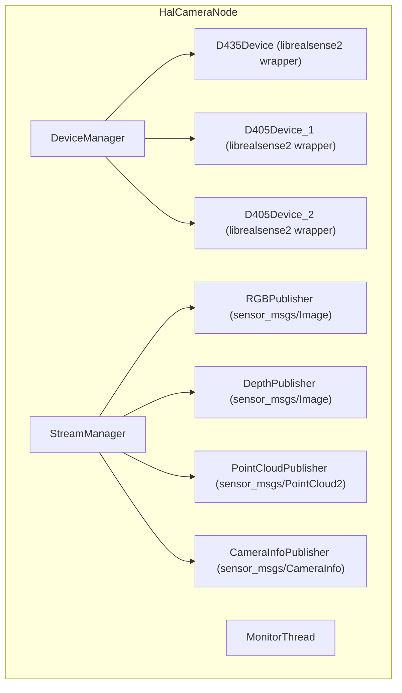

# HAL Camera 模块详细设计

## 1. 模块概述与定位

HAL Camera 是机器人视觉传感器的硬件抽象层，负责管理所有 RealSense 相机的生命周期、数据采集和参数配置。

**所处层次**：HAL & Infra 层

**核心职责**：
- 管理 3 路 RealSense 相机：D435（头部，RGB+深度）×1、D405（夹爪/胸前，近距离 RGB+深度）×2
- 统一相机初始化、启动/停止数据流、曝光控制
- 发布标准 ROS2 传感器消息（Image、CameraInfo、PointCloud2）
- 设备热插拔检测与自动恢复
- 温度监控与过热保护

## 2. 职责边界

| 边界 | HAL Camera 负责 | 对方负责 |
|------|----------------|---------|
| HAL Camera ↔ VSLAM | 发布原始图像/深度图 | 视觉特征提取、位姿估计 |
| HAL Camera ↔ Perception | 发布原始图像/深度图/点云 | 目标检测、语义分割、障碍物识别 |
| HAL Camera ↔ PnC | 发布深度图/点云（地形感知用） | 路径规划、避障决策 |
| HAL Camera ↔ HAL_Sensor | 相机设备状态上报 | IMU/Touch 等其他传感器管理 |
| HAL Camera ↔ EM | 进程心跳、故障上报 | 进程生命周期管理 |

## 3. 状态机设计

```
[IDLE] --初始化--> [INITIALIZING] --成功--> [READY]
                                    --失败--> [FAULT]

[READY] --开始流式传输--> [STREAMING] --停止--> [READY]
                                      --故障--> [FAULT]

[FAULT] --恢复成功--> [READY]
        --恢复失败--> [FAULT]
```

| 状态 | 值 | 说明 |
|------|-----|------|
| IDLE | 0 | 初始状态 |
| INITIALIZING | 1 | 正在枚举/初始化设备 |
| READY | 2 | 设备就绪，等待流式传输 |
| STREAMING | 3 | 正在采集并发布数据 |
| FAULT | 4 | 设备故障 |

## 4. ROS2 接口定义

### 4.1 消息定义（msg）

```
# hal_camera_msgs/msg/CameraDeviceState.msg
# 相机设备状态

uint8 CAMERA_IDLE       = 0
uint8 CAMERA_INITIALIZING = 1
uint8 CAMERA_READY        = 2
uint8 CAMERA_STREAMING    = 3
uint8 CAMERA_FAULT        = 4

string device_name           # 设备标识（"d435_head", "d405_left", "d405_right"）
uint8 state
string serial_number
float32 temperature_c        # 设备温度
uint32 frame_counter         # 累计帧数
builtin_interfaces/Time stamp
```

```
# hal_camera_msgs/msg/CameraInfoArray.msg
# 多相机信息汇总

sensor_msgs/CameraInfo[] cameras
builtin_interfaces/Time stamp
```

```
# hal_camera_msgs/msg/Heartbeat.msg
# HAL Camera 心跳

builtin_interfaces/Time stamp
string node_name
uint8 state
bool healthy
string status_message
uint32 active_cameras
float32 avg_fps
```

```
# hal_camera_msgs/msg/ErrorCode.msg
# 错误码定义（原名 HalCameraErrorCode.msg，应改为 ErrorCode.msg）

uint16 OK                              = 0
uint16 ERR_CAMERA_DEVICE_NOT_FOUND     = 20001   # 设备未找到
uint16 ERR_CAMERA_OPEN_FAILED          = 20002   # 设备打开失败
uint16 ERR_CAMERA_STREAM_START_FAILED  = 20003   # 流启动失败
uint16 ERR_CAMERA_FRAME_DROP           = 20004   # 帧丢失过多
uint16 ERR_CAMERA_OVERHEATING          = 20005   # 设备过热
uint16 ERR_CAMERA_FIRMWARE_MISMATCH    = 20006   # 固件版本不匹配
uint16 ERR_CAMERA_USB_BANDWIDTH        = 20007   # USB带宽不足

uint16 error_code
string message
```

### 4.2 服务定义（srv）

```
# hal_camera_msgs/srv/GetHealthStatus.srv

---
bool success
string node_name
builtin_interfaces/Time uptime_since
uint8 state
bool healthy
string message
uint32 active_cameras
float32 avg_fps
```

```
# hal_camera_msgs/srv/StartStreaming.srv
# 启动指定相机流式传输

string device_name           # 空字符串表示所有相机
uint8 stream_type            # 0=RGB, 1=DEPTH, 2=BOTH
uint16 width
uint16 height
uint16 fps
---
bool success
uint16 error_code
string message
```

```
# hal_camera_msgs/srv/StopStreaming.srv
# 停止流式传输

string device_name
---
bool success
uint16 error_code
string message
```

```
# hal_camera_msgs/srv/SetExposure.srv
# 设置曝光参数

string device_name
bool auto_exposure
float32 exposure_ms           # auto=false时有效
float32 gain                  # auto=false时有效
---
bool success
uint16 error_code
string message
```

### 4.3 接口汇总表

#### Topics（发布）

| 名称 | 类型 | 方向 | QoS | 频率 | 说明 |
|------|------|------|-----|------|------|
| `/camera/d435_head/color/image_raw` | `sensor_msgs/Image` | Camera → VSLAM/Perception | Best Effort + Volatile + Depth 1 | 30Hz | D435 RGB图像 |
| `/camera/d435_head/depth/image_rect_raw` | `sensor_msgs/Image` | Camera → VSLAM/Perception | Best Effort + Volatile + Depth 1 | 30Hz | D435深度图 |
| `/camera/d435_head/color/camera_info` | `sensor_msgs/CameraInfo` | Camera → VSLAM/Perception | Reliable + Transient Local + Depth 1 | 事件 | D435标定参数 |
| `/camera/d435_head/depth/color/points` | `sensor_msgs/PointCloud2` | Camera → Perception/PnC | Best Effort + Volatile + Depth 1 | 10Hz | D435点云（降频发布） |
| `/camera/d405_left/...` | `sensor_msgs/Image` | Camera → Perception | Best Effort + Volatile + Depth 1 | 30Hz | D405左相机 |
| `/camera/d405_right/...` | `sensor_msgs/Image` | Camera → Perception | Best Effort + Volatile + Depth 1 | 30Hz | D405右相机 |
| `/camera/device_state` | `hal_camera_msgs/CameraDeviceState` | Camera → ALL | Reliable + Transient Local + Depth 1 | 1Hz | 设备状态广播 |
| `/camera/heartbeat` | `hal_camera_msgs/Heartbeat` | Camera → HDS/EM | Reliable + Volatile + Depth 1 | 1Hz | 心跳 |

#### Services

| 名称 | 类型 | 说明 |
|------|------|------|
| `/camera/get_health_status` | `GetHealthStatus` | 健康状态查询 |
| `/camera/start_streaming` | `StartStreaming` | 启动流式传输 |
| `/camera/stop_streaming` | `StopStreaming` | 停止流式传输 |
| `/camera/set_exposure` | `SetExposure` | 设置曝光参数 |

## 5. 内部设计

### 5.1 节点架构



### 5.2 关键设计决策

1. **每路相机独立采集线程**：避免某路相机帧处理阻塞其他相机
2. **点云降频发布**：深度图 30Hz，但点云计算耗时，按 10Hz 发布
3. **USB 带宽管理**：D435 和 D405 共享 USB 带宽，需配置分辨率/帧率避免溢出
4. **D405 近距离优化**：D405 用于夹爪操作，默认启用近距离模式（0.1m-0.5m）

### 5.3 关键流程

#### 5.3.1 系统启动流程

1. 枚举所有 RealSense 设备（通过 serial_number 匹配配置）
2. 加载各设备的标定参数（CameraInfo）
3. 按配置启动默认流式传输
4. 发布设备状态 + 心跳

#### 5.3.2 故障恢复流程

1. 检测到帧丢失率 > 10%
2. 停止该设备流式传输
3. 尝试重新打开设备（最多 3 次）
4. 成功则恢复，失败则转入 FAULT 状态并上报 HDS

## 6. 与其他模块的交互

### 6.1 交互矩阵

| 模块 | 交互内容 | 接口类型 |
|------|----------|----------|
| VSLAM | 订阅 `/camera/d435_head/color/image_raw` + `/camera/d435_head/depth/image_rect_raw` | Topic |
| Perception | 订阅所有相机 Topic | Topic |
| PnC | 订阅 `/camera/d435_head/depth/color/points`（地形感知） | Topic |
| HDS | 订阅 `/camera/heartbeat` + `/camera/device_state` | Topic |
| EM | 接收进程状态、重启指令 | Service |
| HAL_Sensor | 独立运行，无直接交互 | - |

### 6.2 关键交互时序

```
[HalCameraNode] --发布Image--> [VSLAM]
[HalCameraNode] --发布Image/PointCloud2--> [Perception]
[HDS] --订阅heartbeat--> [HalCameraNode]
```

## 7. 关键参数与配置

| 参数名 | 类型 | 默认值 | 说明 |
|--------|------|--------|------|
| `d435_head.enabled` | bool | true | 是否启用 D435 |
| `d435_head.serial_number` | string | "" | 设备序列号 |
| `d435_head.color.width` | int | 1280 | RGB分辨率宽 |
| `d435_head.color.height` | int | 720 | RGB分辨率高 |
| `d435_head.color.fps` | int | 30 | RGB帧率 |
| `d435_head.depth.width` | int | 848 | 深度分辨率宽 |
| `d435_head.depth.height` | int | 480 | 深度分辨率高 |
| `d435_head.depth.fps` | int | 30 | 深度帧率 |
| `d405_left.enabled` | bool | true | 是否启用 D405 左 |
| `d405_right.enabled` | bool | true | 是否启用 D405 右 |
| `pointcloud.decimation` | int | 3 | 点云降采样因子 |
| `auto_recovery.enabled` | bool | true | 是否启用自动恢复 |
| `auto_recovery.max_attempts` | int | 3 | 最大恢复尝试次数 |
| `heartbeat_rate_hz` | double | 1.0 | 心跳频率 |

## 8. 错误码定义

| 错误码 | 值 | 说明 | 严重程度 |
|--------|-----|------|----------|
| OK | 0 | 正常 | - |
| ERR_CAMERA_DEVICE_NOT_FOUND | 20001 | 设备未找到 | Critical |
| ERR_CAMERA_OPEN_FAILED | 20002 | 设备打开失败 | Critical |
| ERR_CAMERA_STREAM_START_FAILED | 20003 | 流启动失败 | Major |
| ERR_CAMERA_FRAME_DROP | 20004 | 帧丢失过多 | Minor |
| ERR_CAMERA_OVERHEATING | 20005 | 设备过热 | Major |
| ERR_CAMERA_FIRMWARE_MISMATCH | 20006 | 固件版本不匹配 | Major |
| ERR_CAMERA_USB_BANDWIDTH | 20007 | USB带宽不足 | Major |

## 9. 安全约束

1. **过热保护**：温度 > 70°C 时自动降低帧率，> 85°C 时停止流式传输
2. **USB 带宽保护**：启动前校验总带宽需求，超出时拒绝启动并上报
3. **帧丢失监控**：连续 3 秒帧丢失率 > 10% 触发故障恢复
4. **不阻塞运动路径**：HAL Camera 故障不影响 HAL_EtherCAT 的运动控制

## 10. 包结构

```
hal_camera_msgs/
    msg/
        CameraDeviceState.msg
        CameraInfoArray.msg
        Heartbeat.msg
        ErrorCode.msg               # 错误码（原名 HalCameraErrorCode.msg）
    srv/
        GetHealthStatus.srv
        StartStreaming.srv
        StopStreaming.srv
        SetExposure.srv
    CMakeLists.txt
    package.xml

hal_camera/
    include/hal_camera/
        hal_camera_node.hpp
    src/
        hal_camera_node.cpp
    config/
        hal_camera_params.yaml
    launch/
        hal_camera.launch.py
    CMakeLists.txt
    package.xml
```

## 11. 关键性能指标（KPI）

| 指标 | 目标值 | 说明 |
|------|--------|------|
| RGB 发布延迟 | < 33ms (30Hz) | 从采集到发布 |
| 深度发布延迟 | < 50ms | 对齐后的深度图 |
| 点云发布延迟 | < 100ms | 10Hz 降频 |
| 帧丢失率 | < 1% | 正常运行时 |
| 故障恢复时间 | < 5s | 自动重连 |
| CPU 占用 | < 15% (RK3588) | 3路相机同时运行 |
| 内存占用 | < 500MB | 含 librealsense 缓冲 |
