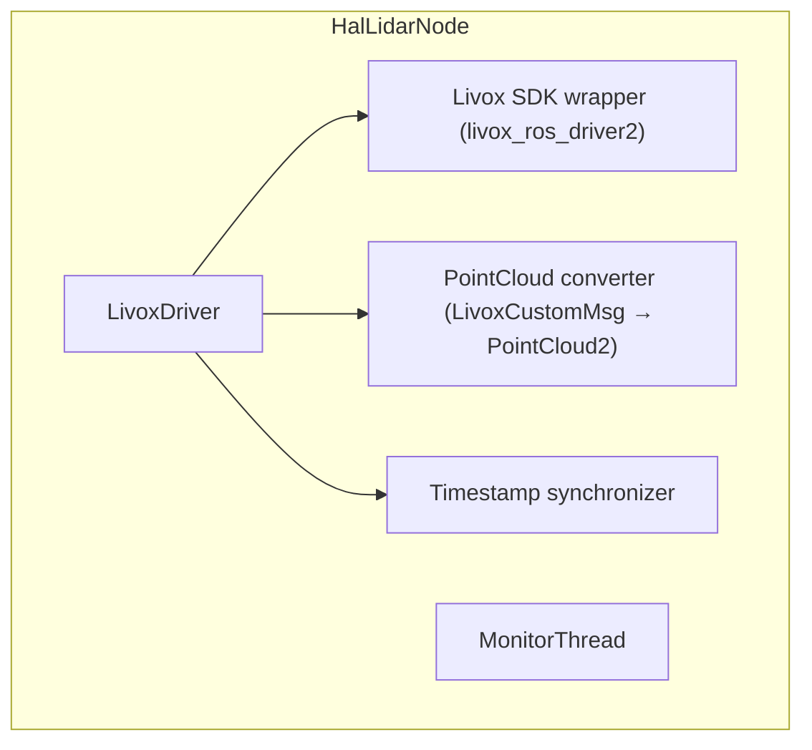

# HAL Lidar 模块详细设计

## 1. 模块概述与定位

HAL Lidar 是机器人激光雷达的硬件抽象层，负责 Livox Mid-360s 固态激光雷达的生命周期管理、数据采集和状态监控。

**所处层次**：HAL & Infra 层

**核心职责**：
- 管理 Livox Mid-360s 的初始化、启动/停止扫描
- 发布标准 ROS2 点云消息（PointCloud2）
- 扫描模式配置（标准/高精度/快速）
- 设备状态监控与故障恢复

## 2. 职责边界

| 边界 | HAL Lidar 负责 | 对方负责 |
|------|---------------|---------|
| HAL Lidar ↔ Lidar-SLAM | 发布原始点云 | 扫描匹配、位姿估计、建图 |
| HAL Lidar ↔ Perception | 发布原始点云 | 障碍物检测、地面分割 |
| HAL Lidar ↔ PnC | 发布点云（避障用） | 路径规划、局部避障 |
| HAL Lidar ↔ EM | 进程心跳、故障上报 | 进程生命周期管理 |

## 3. 状态机设计

```
[IDLE] --初始化--> [INITIALIZING] --成功--> [READY]
                                    --失败--> [FAULT]

[READY] --开始扫描--> [SCANNING] --停止--> [READY]
                                 --故障--> [FAULT]

[FAULT] --恢复成功--> [READY]
        --恢复失败--> [FAULT]
```

| 状态 | 值 | 说明 |
|------|-----|------|
| IDLE | 0 | 初始状态 |
| INITIALIZING | 1 | 正在连接 Livox SDK |
| READY | 2 | 设备就绪，等待扫描 |
| SCANNING | 3 | 正在采集点云 |
| FAULT | 4 | 设备故障 |

## 4. ROS2 接口定义

### 4.1 消息定义（msg）

```
# hal_lidar_msgs/msg/LidarDeviceState.msg
# Lidar 设备状态

uint8 LIDAR_IDLE       = 0
uint8 LIDAR_INITIALIZING = 1
uint8 LIDAR_READY        = 2
uint8 LIDAR_SCANNING     = 3
uint8 LIDAR_FAULT        = 4

uint8 state
string model_name            # "livox_mid_360s"
string serial_number
float32 temperature_c
uint32 scan_counter          # 累计扫描帧数
builtin_interfaces/Time stamp
```

```
# hal_lidar_msgs/msg/Heartbeat.msg
# HAL Lidar 心跳

builtin_interfaces/Time stamp
string node_name
uint8 state
bool healthy
string status_message
float32 avg_scan_rate_hz
```

```
# hal_lidar_msgs/msg/ErrorCode.msg
# 错误码定义（原名 HalLidarErrorCode.msg，应改为 ErrorCode.msg）

uint16 OK                              = 0
uint16 ERR_LIDAR_DEVICE_NOT_FOUND      = 20021   # 设备未找到
uint16 ERR_LIDAR_OPEN_FAILED           = 20022   # 设备连接失败
uint16 ERR_LIDAR_SCAN_START_FAILED     = 20023   # 扫描启动失败
uint16 ERR_LIDAR_FRAME_DROP            = 20024   # 帧丢失过多
uint16 ERR_LIDAR_OVERHEATING           = 20025   # 设备过热
uint16 ERR_LIDAR_LIVOX_SDK_ERROR       = 20026   # Livox SDK 内部错误
uint16 ERR_LIDAR_ETH_DISCONNECTED      = 20027   # 以太网断开

uint16 error_code
string message
```

### 4.2 服务定义（srv）

```
# hal_lidar_msgs/srv/GetHealthStatus.srv

---
bool success
string node_name
builtin_interfaces/Time uptime_since
uint8 state
bool healthy
string message
float32 avg_scan_rate_hz
```

```
# hal_lidar_msgs/srv/StartScanning.srv

---
bool success
uint16 error_code
string message
```

```
# hal_lidar_msgs/srv/StopScanning.srv

---
bool success
uint16 error_code
string message
```

```
# hal_lidar_msgs/srv/SetScanMode.srv

uint8 mode
uint8 MODE_STANDARD   = 0
uint8 MODE_HIGH_RES   = 1
uint8 MODE_FAST       = 2
---
bool success
uint16 error_code
string message
```

### 4.3 接口汇总表

#### Topics（发布）

| 名称 | 类型 | 方向 | QoS | 频率 | 说明 |
|------|------|------|-----|------|------|
| `/lidar/pointcloud` | `sensor_msgs/PointCloud2` | Lidar → ALL | Best Effort + Volatile + Depth 1 | 10Hz | 原始点云 |
| `/lidar/device_state` | `hal_lidar_msgs/LidarDeviceState` | Lidar → ALL | Reliable + Transient Local + Depth 1 | 1Hz | 设备状态 |
| `/lidar/heartbeat` | `hal_lidar_msgs/Heartbeat` | Lidar → HDS/EM | Reliable + Volatile + Depth 1 | 1Hz | 心跳 |

#### Services

| 名称 | 类型 | 说明 |
|------|------|------|
| `/lidar/get_health_status` | `GetHealthStatus` | 健康状态查询 |
| `/lidar/start_scanning` | `StartScanning` | 开始扫描 |
| `/lidar/stop_scanning` | `StopScanning` | 停止扫描 |
| `/lidar/set_scan_mode` | `SetScanMode` | 设置扫描模式 |

## 5. 内部设计

### 5.1 节点架构



### 5.2 关键设计决策

1. **Mid-360s 以太网直连**：通过 UDP 与 Livox SDK 通信，不经过 ROS2 中间件
2. **点云坐标系**：发布在 `lidar_frame` 坐标系下，由 TF 提供到 `base_link` 的变换
3. **非重复扫描模式**：Mid-360s 默认非重复扫描，有利于 SLAM 建图质量
4. **盲区和噪声过滤**：在 HAL 层不做复杂滤波，只去除明显噪声点（距离 < 0.1m 或反射强度异常）

### 5.3 关键流程

#### 5.3.1 系统启动流程

1. 初始化 Livox SDK
2. 通过广播码（broadcast_code）发现设备
3. 建立 UDP 数据连接
4. 启动数据回调，转换为 PointCloud2 并发布

#### 5.3.2 故障恢复流程

1. 检测到以太网断开或帧丢失
2. 停止当前连接
3. 重新尝试设备发现（最多 5 次）
4. 成功则恢复扫描，失败则转入 FAULT 状态

## 6. 与其他模块的交互

### 6.1 交互矩阵

| 模块 | 交互内容 | 接口类型 |
|------|----------|----------|
| Lidar-SLAM | 订阅 `/lidar/pointcloud` | Topic |
| Perception | 订阅 `/lidar/pointcloud` | Topic |
| PnC | 订阅 `/lidar/pointcloud` | Topic |
| HDS | 订阅 `/lidar/heartbeat` + `/lidar/device_state` | Topic |
| EM | 接收进程状态、重启指令 | Service |

## 7. 关键参数与配置

| 参数名 | 类型 | 默认值 | 说明 |
|--------|------|--------|------|
| `broadcast_code` | string | "" | Livox 设备广播码 |
| `host_ip` | string | "192.168.1.50" | 本机 IP |
| `lidar_ip` | string | "192.168.1.100" | Lidar IP |
| `publish_freq_hz` | int | 10 | 点云发布频率 |
| `frame_id` | string | "lidar_frame" | 点云坐标系 |
| `scan_mode` | int | 0 | 0=标准, 1=高精度, 2=快速 |
| `heartbeat_rate_hz` | double | 1.0 | 心跳频率 |

## 8. 错误码定义

| 错误码 | 值 | 说明 | 严重程度 |
|--------|-----|------|----------|
| OK | 0 | 正常 | - |
| ERR_LIDAR_DEVICE_NOT_FOUND | 20021 | 设备未找到 | Critical |
| ERR_LIDAR_OPEN_FAILED | 20022 | 连接失败 | Critical |
| ERR_LIDAR_SCAN_START_FAILED | 20023 | 扫描启动失败 | Major |
| ERR_LIDAR_FRAME_DROP | 20024 | 帧丢失过多 | Minor |
| ERR_LIDAR_OVERHEATING | 20025 | 设备过热 | Major |
| ERR_LIDAR_LIVOX_SDK_ERROR | 20026 | SDK 内部错误 | Major |
| ERR_LIDAR_ETH_DISCONNECTED | 20027 | 以太网断开 | Critical |

## 9. 安全约束

1. **过热保护**：温度 > 75°C 时降低扫描频率，> 90°C 时停止扫描
2. **帧丢失监控**：连续 5 秒无有效点云触发故障恢复
3. **网络隔离**：Lidar 使用独立网段，避免与其他网络流量冲突
4. **不阻塞运动路径**：Lidar 故障不影响 HAL_EtherCAT 的运动控制

## 10. 包结构

```
hal_lidar_msgs/
    msg/
        LidarDeviceState.msg
        Heartbeat.msg
        ErrorCode.msg               # 错误码（原名 HalLidarErrorCode.msg）
    srv/
        GetHealthStatus.srv
        StartScanning.srv
        StopScanning.srv
        SetScanMode.srv
    CMakeLists.txt
    package.xml

hal_lidar/
    include/hal_lidar/
        hal_lidar_node.hpp
    src/
        hal_lidar_node.cpp
    config/
        hal_lidar_params.yaml
    launch/
        hal_lidar.launch.py
    CMakeLists.txt
    package.xml
```

## 11. 关键性能指标（KPI）

| 指标 | 目标值 | 说明 |
|------|--------|------|
| 点云发布延迟 | < 15ms | 从采集到发布 |
| 扫描覆盖率 | 360° | Mid-360s 全向覆盖 |
| 测距范围 | 0.1m - 40m | 有效测量距离 |
| 帧丢失率 | < 0.5% | 正常运行时 |
| 故障恢复时间 | < 10s | 自动重连 |
| CPU 占用 | < 8% (RK3588) | 点云转换 + 发布 |
| 内存占用 | < 200MB | 含 Livox SDK 缓冲 |
