# Executive Manager 模块设计（修订版 v2）

> **修订日期**：2026-04-29
> **修订原因**：架构审查 + 安全审查（第一轮）
> **主要变更**：删除内部状态机（回归无状态执行器）、策略由 SM 持有并下发、L3/L4 上报 HDS 定级、修复 7 项安全漏洞

---

## 1. 模块概述与定位

**模块名称**：Executive Manager（EM）

**定位**：EM 是端侧软件系统中的**无状态执行器**，位于中间件层之下、硬件抽象层之上。它接收来自 SM 的进程编排指令，对端侧所有 ROS2 节点与非 ROS 进程执行启动/停止/监控/恢复操作，本身不做业务状态决策。

EM 填补了三个治理空白：
- systemd 只管 OS 级进程死活，不懂机器人业务语义
- SM 只管状态机决策，不直接操作进程
- HDS 只管诊断定级，不执行恢复动作

EM 将这三者串联：**SM 决策状态 → EM 执行进程操作 → HDS 定级故障**。

**核心职责**：
1. 按 SM 下发的进程集合指令，有序启动/停止进程组
2. 实时监控进程健康状态（心跳、退出码、资源水位）
3. 分级故障恢复（L1/L2 自主执行；L3/L4 上报 HDS 定级）
4. 对外提供统一的进程控制 API，供 SM、TE 调用

**改名后的定位变化**（PS → EM）：

| 维度 | Process Supervisor（原设计） | Executive Manager（修订后） |
|------|---------------------------|----------------------------|
| **核心隐喻** | "看护进程"（进程挂了重启） | "无状态执行器"（SM 决策，EM 执行） |
| **SM 联动** | 被动接收启动/停止指令 | **主动订阅 SM 状态**，按指令执行进程编排 |
| **状态机** | 无 | **无**（删除 v1 中的 9 状态内部状态机） |
| **策略映射** | 固定进程组配置 | **由 SM 持有策略**，EM 接收进程集合指令 |
| **故障响应** | L3/L4 自主请求 SM 状态转换 | **L3/L4 上报 HDS**，由 HDS 定级后请求 SM |

**关键结论**：EM 是**纯执行器**，不做状态决策、不做策略映射、不做故障定级。所有业务语义由 SM（状态）和 HDS（故障）持有。

---

## 2. 职责边界

EM 在端侧架构中的位置：

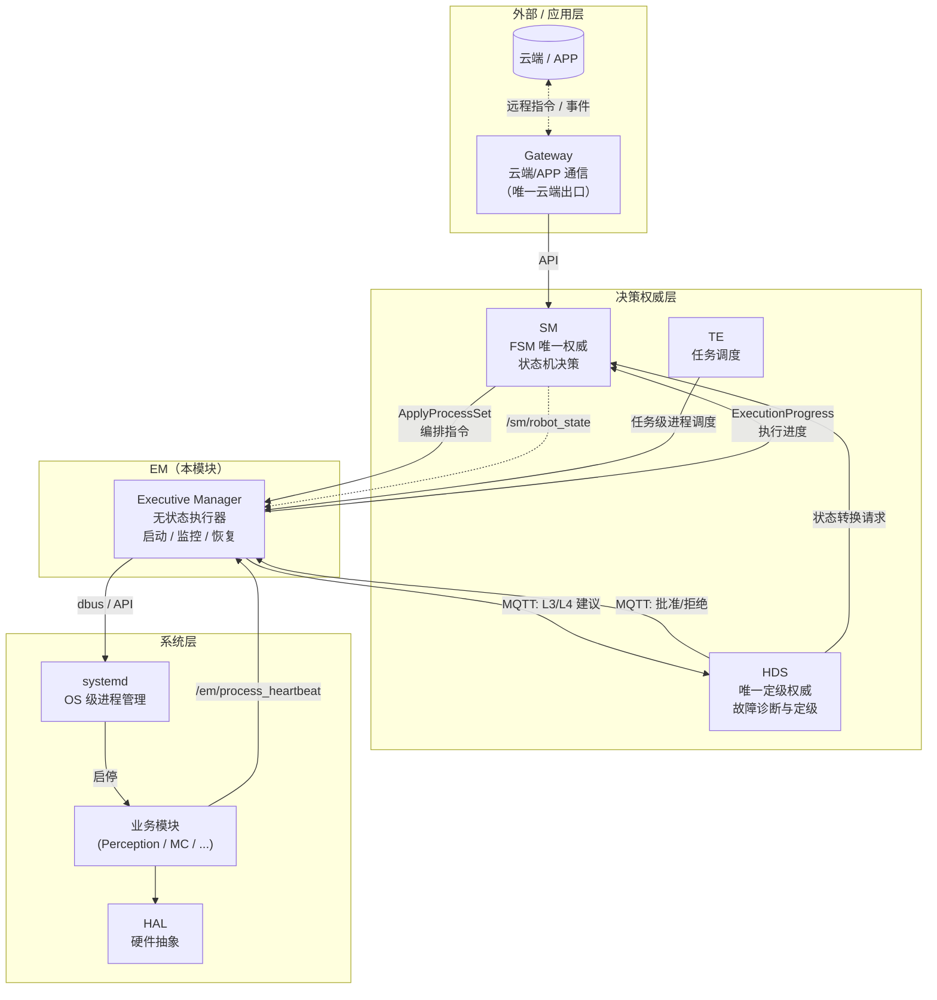

| 边界 | EM 负责 | 对方负责 | 红线 |
|------|---------|---------|------|
| EM ↔ SM | 订阅 SM 状态；接收进程编排指令并执行；上报执行进度 | 状态机决策；定义状态→进程集合映射 | EM **不**决定什么状态下该运行什么进程 |
| EM ↔ HDS | 上报进程状态变更、恢复动作记录、L3/L4 建议 | 故障诊断与定级；决定是否请求 SM 状态转换 | EM **不**做故障定级；**不**直接请求 SM 状态转换 |
| EM ↔ systemd | 通过 dbus/API 启动/停止/查询进程 | 内核态守护、开机自启、cgroup | — |
| EM ↔ TE | 接收 TE 的任务级进程调度请求 | 任务编排 | TE **不**直接操作进程 |
| EM ↔ 各模块 | 监控进程心跳，执行重启/停止 | 业务逻辑，上报自身心跳 | 各模块 **不**自行启停其他进程 |

**三大红线**（不可违反）：
1. EM **不做**业务状态决策（SM 是唯一状态权威）
2. EM **不做**故障定级（HDS 是唯一定级权威）
3. EM **不**直接操作硬件（HAL 负责）

---

## 3. 执行上下文感知

### 3.1 设计原则

EM 本身**没有内部状态机**，但具备**执行上下文感知**能力：
- 订阅 `/sm/robot_state` Topic，了解当前机器人 FSM 状态
- 根据 SM 下发的进程集合指令，执行启动/停止编排
- 维护**执行阶段**（ExecutionPhase）—— 这是操作进度，不是业务状态

### 3.2 ExecutionPhase（执行阶段，非状态机）

| 阶段 | 说明 |
|------|------|
| `IDLE` | 无正在执行的编排动作 |
| `STARTING` | 正在执行启动编排 |
| `STOPPING` | 正在执行停止编排 |
| `RECOVERING` | 正在执行 L1/L2 恢复 |

> **注意**：ExecutionPhase 只表达"EM 当前在做什么操作"，不表达"机器人处于什么业务状态"。业务状态由 SM FSM 唯一持有。

### 3.3 SM 状态 → 进程集合映射

**该映射由 SM 持有并维护**，EM 不硬编码。SM 在状态转换时，通过 Service 调用 EM 的 `ApplyProcessSet`，传入目标进程组列表：

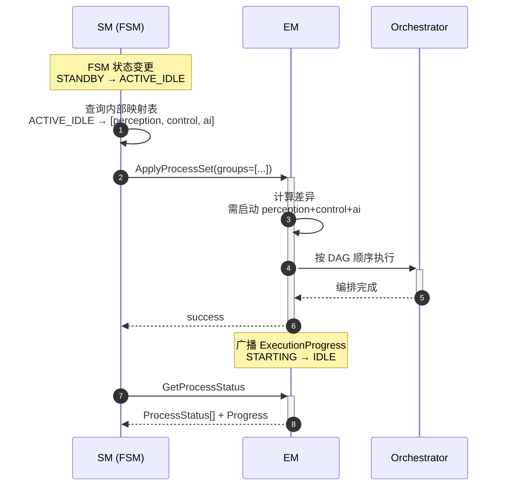

---

## 4. ROS2 接口定义

### 4.1 消息定义（msg）

```
# em_msgs/msg/ProcessStatus.msg
# 单个进程状态

uint8 UNKNOWN     = 0
uint8 STARTING    = 1
uint8 RUNNING     = 2
uint8 DEGRADED    = 3
uint8 STOPPED     = 4
uint8 FAILED      = 5
uint8 RESTARTING  = 6

string process_name        # 进程名（唯一标识）
string process_group       # 所属进程组
uint8 state                # 进程状态
int32 pid                  # OS 进程 ID（整数类型）
builtin_interfaces/Time last_heartbeat  # 最后心跳时间
float32 cpu_percent        # CPU 使用率
float32 memory_mb          # 内存使用（MB）
uint32 restart_count       # 累计重启次数
int32 exit_code            # 上次退出码（整数类型）
```

```
# em_msgs/msg/ProcessGroupConfig.msg
# 进程组配置

string group_name          # 组名（infra/middleware/ops/perception/control/ai）
uint8 priority             # 优先级（P0=0, P1=1, P2=2, P3=3）
string[] process_names     # 组内进程列表
string[] depends_on        # 依赖的进程组（DAG 边）
bool auto_restart          # 是否自动重启
uint8 max_restarts         # 最大重启次数（默认 3）
uint32 restart_window_sec  # 重启窗口（默认 300s）
string readiness_probe     # 就绪探针类型（tcp/port/topic/custom）
```

```
# em_msgs/msg/ExecutionProgress.msg
# 执行进度（替代原 EmState）

uint8 IDLE       = 0
uint8 STARTING   = 1
uint8 STOPPING   = 2
uint8 RECOVERING = 3

uint8 phase                # 当前执行阶段
string current_action      # 当前动作描述（如"启动 motion_control"）
uint8 progress_percent     # 进度百分比
string[] running_processes         # 当前运行中的进程列表
string[] failed_processes          # 当前失败进程列表
uint32 restart_count_this_session  # 本次开机累计重启次数
```

### 4.2 服务定义（srv）

统一为 SM 风格的动宾命名：

```
# em_msgs/srv/ControlProcess.srv
# 控制单个进程或进程组

--- 请求 ---
uint8 START   = 0
uint8 STOP    = 1
uint8 RESTART = 2

string target              # 进程名或进程组名
uint8 action               # START / STOP / RESTART
bool force                 # 是否强制操作（仅 SM/HDS Master 可设为 true）
string requester_node      # 请求者节点名（审计用）
--- 响应 ---
bool success
uint16 error_code          # 扁平错误码（与 SM 风格一致）
string message             # 可读错误描述
ProcessStatus[] affected_processes
```

```
# em_msgs/srv/GetHealthStatus.srv
# EM 模块健康状态查询

---
bool success
string node_name
builtin_interfaces/Time uptime_since
uint8 state
bool healthy
string message
ProcessStatus[] processes
ExecutionProgress progress  # EM 执行进度
```

```
# em_msgs/srv/GetProcessStatus.srv
# 查询进程或 EM 执行进度

--- 请求 ---
string target              # 进程名、进程组名，或空字符串表示查询 EM 自身进度
--- 响应 ---
bool success
uint16 error_code
string message
ProcessStatus[] processes
ExecutionProgress progress  # EM 执行进度（target 为空时有效）
```

```
# em_msgs/srv/ApplyProcessSet.srv
# 应用进程集合（由 SM 调用，替代原 ApplyStrategy）

--- 请求 ---
string[] groups_to_start   # 需要启动的进程组列表
string[] groups_to_stop    # 需要停止的进程组列表
string reason              # 切换原因
string requester_node      # 请求者节点名
--- 响应 ---
bool success
uint16 error_code
string message
string[] started_groups    # 实际启动的组
string[] stopped_groups    # 实际停止的组
```

```
# em_msgs/srv/ReloadConfiguration.srv
# 运行时热重载配置

--- 请求 ---
string config_path         # 配置文件路径（必须在白名单 /opt/striding/em/ 下）
string requester_node      # 请求者节点名（审计用）
--- 响应 ---
bool success
uint16 error_code
string message
string[] changed_processes
```

```
# em_msgs/srv/AcknowledgeEstopRelease.srv
# E-Stop 解除确认（EM 向 SM 查询人工确认状态）

--- 请求 ---
string operator_id         # 操作者 ID（由 SM 提供）
--- 响应 ---
bool confirmed             # SM 是否确认该 operator_id 有效
uint16 error_code
string message
```

### 4.3 Action 定义（action）

```
# em_msgs/action/SystemRestart.action
# 全系统有序重启

--- 目标 ---
string reason              # 重启原因
bool preserve_state        # 是否保留当前 SM 状态
--- 反馈 ---
uint8 phase                # 当前阶段（0=停止中, 1=等待中, 2=启动中）
uint8 progress_percent     # 进度百分比
string current_action      # 当前执行的动作描述
--- 结果 ---
bool success
uint16 error_code
string message
builtin_interfaces/Duration duration
```

### 4.4 Topic 定义

#### ROS2 Topic

| Topic | 类型 | 方向 | 说明 |
|-------|------|------|------|
| `/em/execution_progress` | `ExecutionProgress` | EM → 所有 | EM 执行进度广播（1Hz） |
| `/em/process_status` | `ProcessStatus[]` | EM → 所有 | 所有进程状态快照（1Hz） |
| `/em/events` | `TransitionEvent` | EM → 所有 | 状态变更/崩溃/恢复事件 |
| `/sm/robot_state` | `RobotState` | SM → EM | 订阅 SM 全局状态 |
| `/hds/diagnosis_result` | `DiagnosisResult` | HDS → EM | 订阅 HDS 诊断结果 |
| `/em/process_heartbeat` | `Heartbeat` | 各模块 → EM | 各模块向 EM 上报心跳 |
| `/em/estop_immediate` | `Empty` | EM → 所有 | E-Stop 紧急广播（0 延迟） |
| `/em/control_events` | `ControlProcess` | EM → 所有 | 控制操作审计广播 |

#### MQTT 事件（EM ↔ HDS 跨语言通信）

| Topic | 方向 | 说明 |
|-------|------|------|
| `em/event/process_state` | EM → HDS | 进程状态变更事件 |
| `em/event/recovery` | EM → HDS | 恢复动作执行记录 |
| `em/event/l3_suggestion` | EM → HDS | L3 降级建议（HDS 定级后决定是否请求 SM） |
| `em/event/l4_suggestion` | EM → HDS | L4 紧急停止建议（HDS 定级后决定是否请求 SM） |
| `hds/command/recovery_ack` | HDS → EM | HDS 批准/拒绝恢复建议 |

---

## 5. 内部设计

### 5.1 节点结构

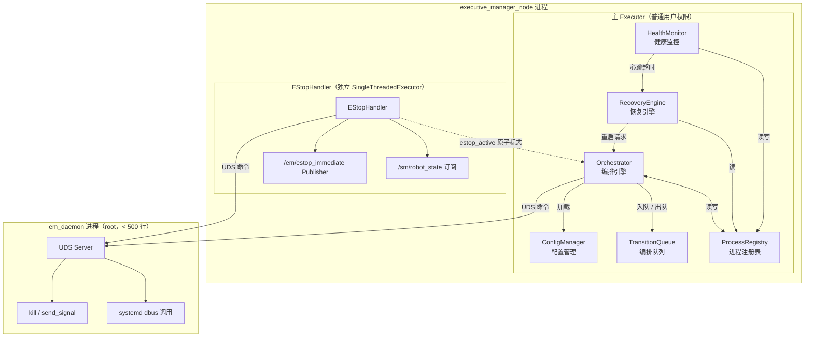

### 5.2 关键组件

#### 5.2.1 Orchestrator（编排引擎）

Orchestrator 是 EM 的**核心编排引擎**，负责将 SM 下发的进程集合指令转化为有序的启动/停止操作。其核心数据结构是有向无环图（DAG），用于建模进程组间的依赖关系。

##### 5.2.1.1 DAG 图模型

**图定义**：
- **节点（V）**：进程组（group）。编排以组为单位执行，组内进程共享同层启动/停止边界。
- **有向边（E）**：若进程组 A `depends_on` 进程组 B，则存在有向边 **B → A**，语义为"B 必须先启动并就绪，A 才能开始启动"。
- **权重**：DAG 边本身无权重。优先级（P0-P3）用于资源抢占和故障响应，不用于拓扑排序。

**启动 DAG 与停止 DAG**：
- 启动时：沿边的**正向拓扑序**（Kahn 算法，从入度为 0 的节点开始）
- 停止时：沿边的**反向拓扑序**（从出度为 0 的节点开始，逐层向上）

**示例 DAG**（基于实际项目配置推断的 6 层结构）：

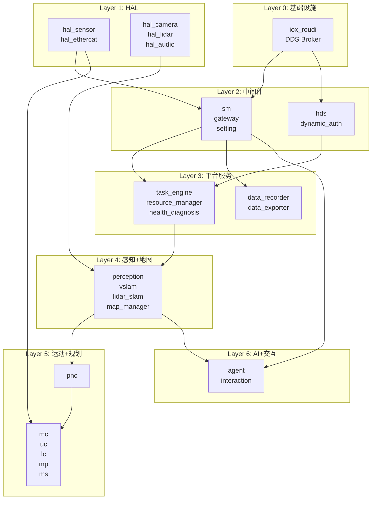

> **参考依据**：`run_agibot.yaml` 的 `default_apps` 有序列表反映了实际项目的启动顺序，其中 `iox_roudi`（DDS 中间件）最先启动，`sm` 作为中间件层核心随后启动，`perception`/`vslam` 等感知模块在 HAL 就绪后启动，运动控制模块在感知就绪后启动。

##### 5.2.1.2 拓扑排序算法（Kahn 算法）

Orchestrator 使用 Kahn 算法进行拓扑排序，核心目标是生成**层级化的并行启动序列**。

**算法伪代码**：

```
function topological_sort_with_layers(groups):
    // 1. 构建邻接表和入度表
    adj = {}    // 邻接表：group -> [下游 groups]
    indeg = {}  // 入度表：group -> 入度
    for g in groups:
        indeg[g.name] = len(g.depends_on)
        for dep in g.depends_on:
            adj[dep].append(g.name)

    // 2. 初始化 Layer 0（所有入度为 0 的节点）
    layers = []
    current = [g for g in groups if indeg[g.name] == 0]

    // 3. 逐层剥离
    while current not empty:
        layers.append(current)
        next_layer = []
        for g in current:
            for downstream in adj[g.name]:
                indeg[downstream] -= 1
                if indeg[downstream] == 0:
                    next_layer.append(downstream)
        current = next_layer

    // 4. 循环检测
    if total_processed != len(groups):
        raise DAG_CYCLE_DETECTED

    return layers
```

**层级（Layer）定义**：

```
level(v) = 0                         if indegree(v) = 0
level(v) = max(level(u)) + 1         for all u where edge u→v exists
```

**关键特性**：
- 同一 Layer 内的所有进程组**无相互依赖**，可以**完全并行启动**
- Layer N 的所有进程必须在 Layer N-1 **全部就绪**后才能启动
- 拓扑排序结果不唯一，但**层级计算结果是确定性的**（基于最长路径）
- 最大并行度受 `parallel_max` 配置限制（默认 8），超出时按优先级排队

**停止时的逆拓扑序**：

```
stop_level(v) = 0                    if outdegree(v) = 0
stop_level(v) = max(stop_level(u)) + 1  for all u where edge v→u exists
```

停止时从 `stop_level = 0` 的节点开始，逐层向上停止，确保下游先停、上游后停，避免依赖进程提前消失导致下游崩溃。

##### 5.2.1.3 循环检测

配置加载时，ConfigManager 调用 `DAGValidator` 进行循环检测。

**检测机制**：拓扑排序过程中，如果处理完所有当前入度为 0 的节点后，仍有节点未被处理，则图中存在环。

**错误处理**：
- 检测到环时，返回 `ERR_CONFIG_INVALID`（错误码 2002）
- 错误消息包含**环上的节点列表**（如 `"cycle detected: middleware → ops → perception → middleware"`），便于快速定位
- EM 拒绝加载该配置，保持当前有效配置不变
- 循环检测在**热重载时同样执行**，防止运行时引入环状依赖

**增量检测**：热重载时只检测变更部分涉及的子图，而非全量重算，降低加载延迟。

##### 5.2.1.4 编排执行状态机

Orchestrator 内部维护一个**编排执行状态机**（注意：这是执行进度状态机，不是业务状态机）：

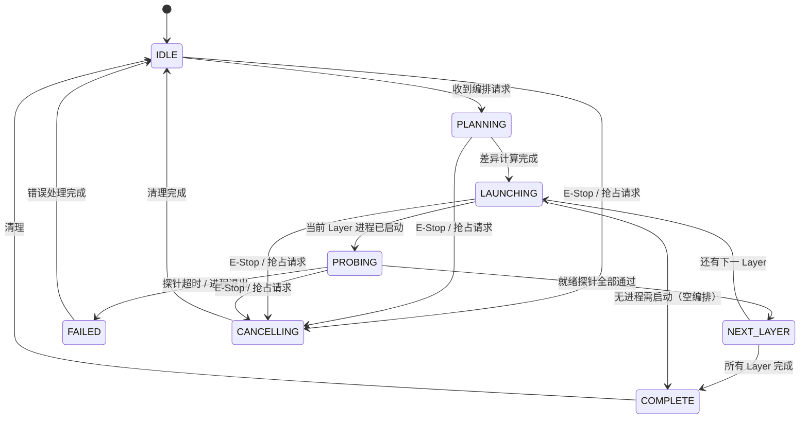

**状态说明**：

| 状态 | 说明 |
|------|------|
| `IDLE` | 无正在执行的编排 |
| `PLANNING` | 计算目标进程集合与当前运行集合的差异 |
| `LAUNCHING` | 正在启动当前 Layer 的进程 |
| `PROBING` | 等待当前 Layer 的就绪探针通过 |
| `NEXT_LAYER` | 当前 Layer 就绪，准备进入下一 Layer |
| `COMPLETE` | 编排正常完成 |
| `FAILED` | 编排失败（探针超时、进程退出、循环检测失败等）|
| `CANCELLING` | 编排被取消（E-Stop 或高优先级请求抢占）|

**编排取消机制**：
- E-Stop 到达时，Orchestrator **立即从任何状态迁移到 `CANCELLED`**
- 已启动的进程：按**逆拓扑序**停止
- 正在启动的进程：发送 **SIGKILL** 强制终止（不等待 SIGTERM 超时）
- 未启动的进程：直接从计划中移除
- 取消操作记录到审计日志，包含取消原因、已启动进程列表、未启动进程列表

##### 5.2.1.5 层内并行与超时控制

**层内并行启动**：
- 同一 Layer 内的所有进程同时发出启动请求
- em_daemon 并行执行 fork/exec（受 `parallel_max` 限制）
- 每个进程独立进行就绪探针检测
- 单个进程失败**不阻塞**同层其他进程（除非 `fail_fast=true`）

**超时策略**：

| 超时类型 | 默认值 | 说明 |
|----------|--------|------|
| `startup_timeout_sec` | 30s | 单个进程启动超时 |
| `layer_timeout_sec` | 30s | 单层启动超时（从发出启动请求到全部就绪） |
| `orchestration_timeout_sec` | 120s | 整编排超时（从收到 ApplyProcessSet 到 COMPLETE） |
| `probe_interval_sec` | 1s | 就绪探针轮询间隔 |
| `probe_timeout_sec` | 5s | 单个探针请求超时 |

**超时后行为**：
- 单个进程启动超时 → 标记 FAILED，触发 RecoveryEngine（L1/L2）
- 单层超时 → 根据 `fail_fast` 策略决定
- 整编排超时 → 标记 `ERR_ORCHESTRATION_TIMEOUT`（2012），中止编排

**部分失败处理**：
- `fail_fast=true`（默认）：单层内任一进程启动失败时，立即停止整层，标记编排失败
- `fail_fast=false`：继续启动同层其他进程，记录失败进程列表，编排完成后返回部分成功

##### 5.2.1.6 编排差异计算（Diff Engine）

收到 `ApplyProcessSet` 请求时，Orchestrator **不直接全量启停**，而是计算最小差异：

```
current_set = ProcessRegistry.get_running_groups()
target_set = ApplyProcessSet.groups_to_start

to_stop  = current_set - target_set    // 需要停止的组（不在目标中）
to_start = target_set - current_set    // 需要启动的组（当前未运行）
unchanged = current_set ∩ target_set   // 保持运行的组

// 停止顺序：to_stop 的逆拓扑序
stop_order = reverse_topological_sort(to_stop)

// 启动顺序：to_start 的正拓扑序
start_order = topological_sort(to_start)

// 配置变更检测（热重载场景）
config_changed = unchanged 中配置哈希发生变化的组
if config_changed not empty:
    // 按逆拓扑序停止，再按正拓扑序启动（重启）
    restart_order_stop = reverse_topological_sort(config_changed)
    restart_order_start = topological_sort(config_changed)
```

**示例**：从 STANDBY 进入 ACTIVE_IDLE
- STANDBY 运行组：`[infra, middleware, ops]`
- ACTIVE_IDLE 目标组：`[infra, middleware, ops, perception, control, ai]`
- 差异：`to_stop = []`，`to_start = [perception, control, ai]`
- 启动顺序（拓扑序）：`perception → control → ai`

**示例**：从 ACTIVE_IDLE 退回到 STANDBY
- 差异：`to_stop = [perception, control, ai]`，`to_start = []`
- 停止顺序（逆拓扑序）：`ai → control → perception`

##### 5.2.1.7 就绪探针详细设计

就绪探针用于确认进程**不仅已启动，而且已准备好对外提供服务**。

**探针类型**：

| 类型 | 机制 | 适用场景 |
|------|------|----------|
| `tcp` | 连接指定 TCP 端口，成功即就绪 | 网络服务（broker, gateway） |
| `port` | 检测 UDP 端口是否监听 | UDP 服务 |
| `topic` | 订阅 ROS2 Topic，收到首帧即就绪 | ROS2 节点（motion_control, perception） |
| `pid` | 检测到进程 PID 存在（最弱探针） | 简单进程、无网络/ROS 接口的进程 |
| `custom` | 调用自定义健康检查接口（HTTP/UnixSocket） | 复杂服务（SM, HDS） |

**探针执行流程**：

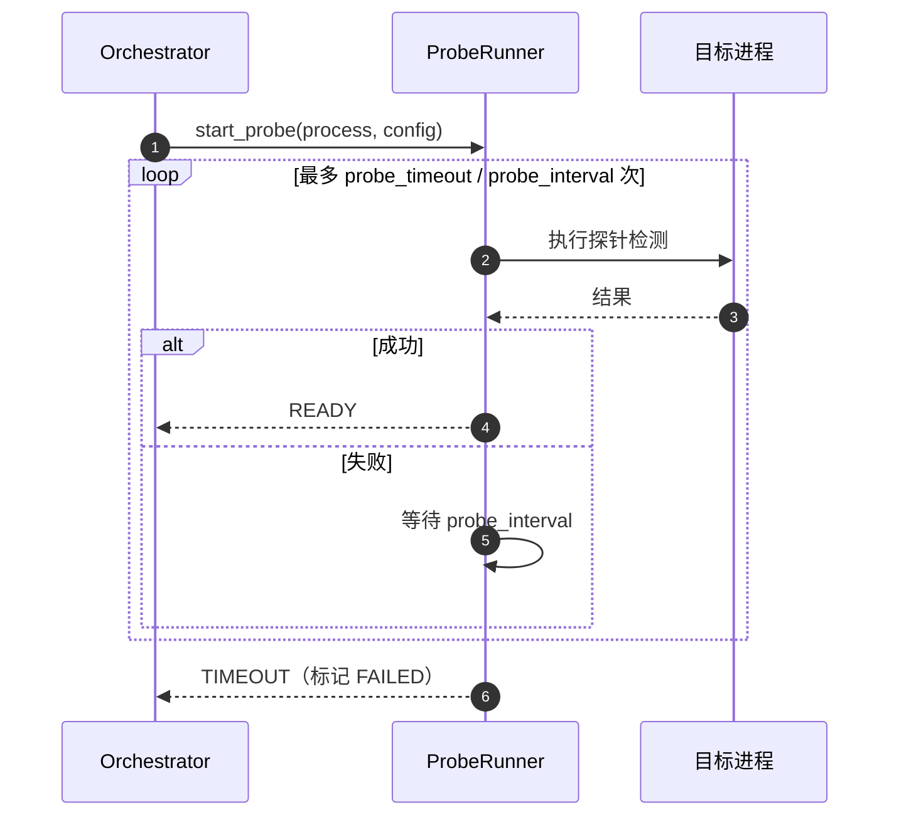

**探针配置**：

```yaml
readiness_probe:
  type: "tcp"           # tcp / port / topic / pid / custom
  port: 1883            # tcp/port 类型必填
  topic: "/mc/joint_states"  # topic 类型必填
  timeout: 15           # 探针总超时（秒）
  interval: 1           # 探针轮询间隔（秒）
  retries: 3            # 连续失败次数才判定为未就绪
  custom_endpoint: "/health"  # custom 类型必填
```

**特殊处理**：
- `simple=true` 的进程**不执行就绪探针**，启动后即视为就绪
- control 组进程（如 MC）探针超时缩短为 15s（普通进程 30s），因为运动控制延迟直接影响系统响应
- 探针检测失败**不直接触发 RecoveryEngine**，先标记为 `DEGRADED`，连续 3 次探针失败后（间隔 1s × 3 = 3s）才触发恢复

##### 5.2.1.8 编排前安全检查

每次编排前，Orchestrator 执行以下**不可绕过**的检查：

1. **`estop_active` 原子标志位**：若为 `true`，立即取消编排，返回 `ERR_ESTOP_ACTIVE`（2014）
2. **SM 状态校验**：若当前 SM 状态为 `FAULT` 或 `ACTIVE_E_STOP`，拒绝启动运动相关进程组（control、motion_domain 相关），返回 `ERR_FAULT_HALT`（2020）
3. **配置一致性校验**：检查 ProcessRegistry 中的进程配置哈希与 ConfigManager 中的配置是否一致，不一致时拒绝编排（防止配置变更与编排并发冲突）
4. **资源预检**：检查目标进程组的资源限制配置（cpuset、mem_limit）是否与系统当前可用资源冲突

**编排取消后恢复**：
- E-Stop 解除后，SM 重新下发 `ApplyProcessSet`
- Orchestrator 从 IDLE 重新开始编排
- 已部分启动的进程在取消时已被逆拓扑序停止，无需额外清理

#### 5.2.2 HealthMonitor（健康监控）

- 心跳收集：各模块通过 `/em/process_heartbeat` Topic 上报
- **差异化心跳策略**：
  - 常规进程：1Hz，连续 3 次超时视为故障
  - **control 组进程**：10Hz，1 次超时即告警，2 次即触发恢复
  - MC 进程崩溃：通过 `waitpid` 立即检测（< 100ms）
- 监控维度：进程存活、心跳超时、资源水位（CPU > 90% 持续 10s）、退出码异常、ROS2 节点活跃

#### 5.2.3 RecoveryEngine（恢复引擎）

| 级别 | 策略 | 触发条件 | 限制 | EM 行为 |
|------|------|---------|------|---------|
| **L1** | 快速重启 | 单个进程心跳超时/崩溃 | 5min 内最多 3 次 | EM 自主执行，上报 HDS Slave |
| **L2** | 进程组重启 | L1 达到上限 | 10min 内最多 2 次 | EM 自主执行，上报 HDS Slave + SM |
| **L3** | 系统降级建议 | L2 达到上限或多组故障 | — | EM **停止 P2/P3 进程**，通过 MQTT 上报 HDS Master "建议降级"，**等待 HDS 决定是否请求 SM 进入 DEGRADED** |
| **L4** | 紧急停止建议 | P0-Critical 进程失败且不可恢复 | — | EM **立即停止运动进程**，通过 MQTT 上报 HDS Master "建议 E-Stop"，**等待 HDS 决定是否请求 SM 触发 ACTIVE_E_STOP** |

**P0-Critical 定义**（L4 触发范围）：
- `hal_ethercat`（运动控制硬件接口）
- `HAL_Sensor` 中涉及安全监控的部分（如 IMU 异常检测）
- **不包括**：`HAL_AUDIO`（仅触发 DEGRADED）

#### 5.2.4 ProcessRegistry（进程注册表）

- 内存中的进程元数据存储
- 记录：配置信息、当前状态、历史重启记录、依赖关系
- Orchestrator 和 HealthMonitor 的共享数据中心

#### 5.2.5 ConfigManager（配置管理）

- 读取 YAML 配置文件（`/opt/striding/em/config.yaml`）
- **配置校验**：加载时检查 DAG 无环、所有进程路径存在、依赖满足
- **配置签名**：配置文件必须附带 SHA256 签名，ConfigManager 校验签名有效后才加载
- **热重载限制**：
  - 禁止在 E-Stop 或 FAULT 状态下热重载
  - 配置路径必须在白名单 `/opt/striding/em/` 下
  - 仅允许增加/修改，不允许删除运行中的进程
  - 热重载操作记录安全审计日志

#### 5.2.6 TransitionQueue（编排队列）

- 同一时刻只允许一个编排动作执行
- 新请求按优先级排队或抢占
- **E-Stop 必须能抢占任何正在执行的编排**（最高优先级）
- 排队中的请求可通过 `/em/execution_progress` 查询

#### 5.2.7 EStopHandler（急停处理器）

- **独立 SingleThreadedExecutor**，与主节点完全隔离
- 订阅 `/sm/robot_state`，监听 `ACTIVE_E_STOP`
- 检测到 E-Stop 后：
  1. 立即设置 `estop_active = true`（原子标志位）
  2. 向 Orchestrator 发送"取消所有编排"指令
  3. 广播 `/em/estop_immediate` Topic（0 延迟）
  4. 等待 MC 进入硬件级安全模式（500ms 超时）
  5. 通过 UDS 通知 `em_daemon` 停止运动相关进程
- **E-Stop 解除**：EM 通过 `AcknowledgeEstopRelease` Service 向 SM 查询 `operator_id` 有效性，确认后才恢复

#### 5.2.8 ResourceGovernor（资源治理器）

ResourceGovernor 负责在进程启动时应用 `resource_limits` 配置，通过 `em_daemon` 与 Linux cgroup / sched_setscheduler 交互，实现进程级资源隔离。

**设计原则**：
- **配置即策略**：`resource_limits` 在 `config.yaml` 中声明，随进程配置一起加载和校验
- **启动时绑定**：资源限制在进程启动瞬间生效，不支持运行时动态调整（避免实时线程抖动）
- **特权操作下沉**：所有涉及 root 权限的操作（cgroup 写入、sched_setscheduler）由 `em_daemon` 执行，EM 主节点仅传递参数

**资源限制项**：

| 字段 | 内核机制 | 说明 |
|------|---------|------|
| `cpuset` | cgroup v2 `cpuset.cpus` | CPU 核心绑定，如 `[2,3]` 表示仅使用 CPU2 和 CPU3 |
| `scheduler` | `sched_setscheduler()` | `fifo` / `rr` / `other`，实时线程必须显式声明 |
| `priority` | `sched_param.sched_priority` | 实时优先级 1-99，`fifo`/`rr` 时有效 |
| `mem_limit` | cgroup v2 `memory.max` | 内存硬上限，如 `"512m"` |
| `gpu_limit` | 自定义 GPU 调度器 | GPU 算力百分比限制（0=禁用 GPU）|

**执行流程**：

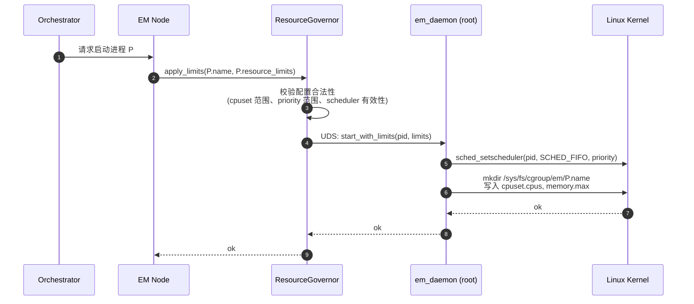

**关键约束**：
- `cpuset` 必须与系统实际 CPU 拓扑匹配，ConfigManager 加载时校验
- `fifo`/`rr` 调度策略的进程必须绑定到隔离的 CPU 核心（避免与普通进程竞争），否则启动失败
- `mem_limit` 写入失败（如 cgroup 未挂载）时记录 WARNING，但允许进程继续运行（避免关键进程无法启动）
- 所有资源限制操作记录到审计日志（`/var/log/striding/em_resources.log`）

**cgroup 层级设计**：

```
sys/fs/cgroup/
└── em/
    ├── motion_control/          # MC 进程 cgroup
    │   ├── cpuset.cpus = 2,3
    │   └── memory.max = 512M
    ├── hal_ethercat/            # EtherCAT HAL cgroup
    │   ├── cpuset.cpus = 2
    │   └── memory.max = 128M
    └── ...
```

**错误码**：

| 错误码 | 说明 |
|--------|------|
| `2022` | `ERR_RESOURCE_LIMIT_INVALID` — 资源限制配置非法 |
| `2023` | `ERR_CPUSET_OUT_OF_RANGE` — cpuset 超出系统 CPU 范围 |
| `2024` | `ERR_SCHEDULER_SET_FAILED` — 调度策略设置失败 |
| `2025` | `ERR_CGROUP_WRITE_FAILED` — cgroup 写入失败 |
| `2026` | `ERR_PROCESS_STDOUT_REDIRECT_FAILED` — stdout/stderror 重定向失败 |
| `2027` | `ERR_PROCESS_SETUID_FAILED` — 设置进程运行用户失败 |
| `2028` | `ERR_LAYER_TIMEOUT` — 单层启动超时 |

#### 5.2.9 ProcessLauncher（进程启动器）

ProcessLauncher 封装进程启动的具体操作系统调用，与 `em_daemon` 配合完成从配置到运行进程的转换。参考 `run_agibot.yaml` 的实际配置结构，ProcessLauncher 支持丰富的启动参数。

**启动流程**：

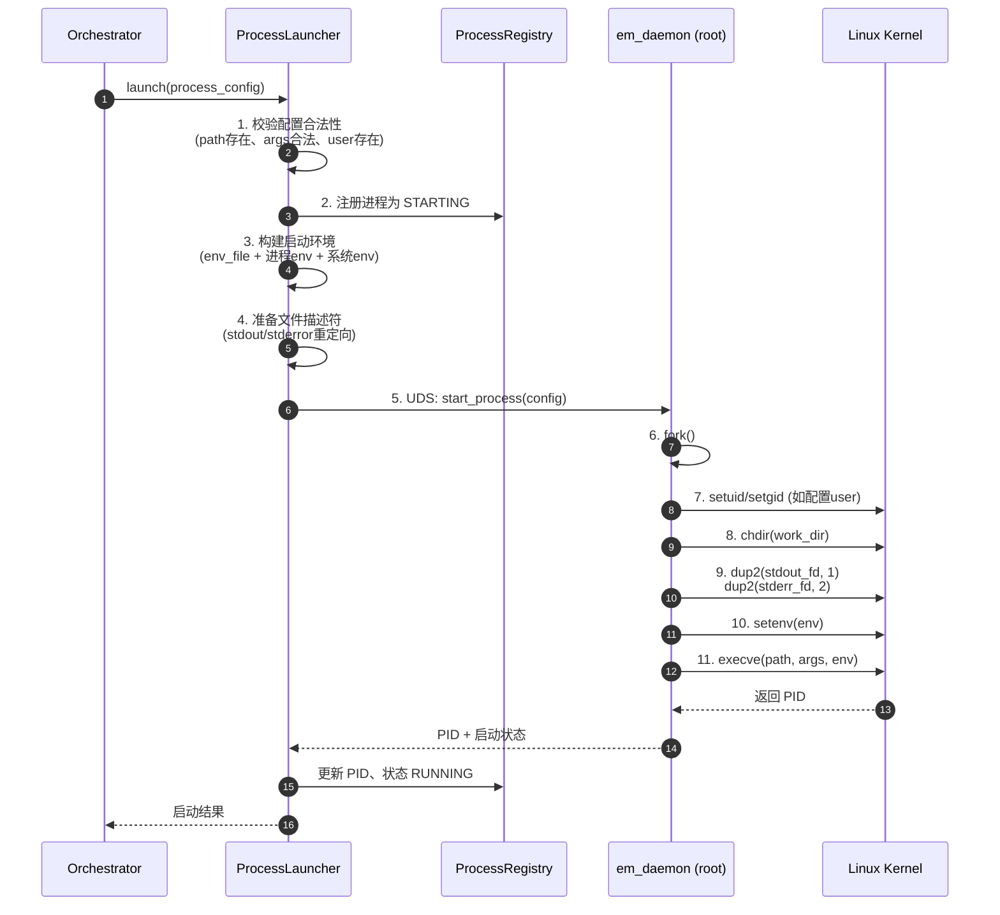

**配置字段映射**（参考 `run_agibot.yaml` 结构对齐）：

| 配置字段 | 说明 | 默认值 | 对应参考配置字段 |
|----------|------|--------|-----------------|
| `path` | 可执行文件路径 | 必填 | `path` |
| `args` | 命令行参数数组 | `[]` | `args` |
| `env` | 进程级环境变量映射 | `{}` | `env` |
| `env_file` | 全局环境变量文件路径（YAML 格式） | 可选 | `env_file` |
| `work_dir` | 进程工作目录 | `config.work_dir` | `work_dir` |
| `user` | 运行用户（UID 或用户名） | `agi_user_uid` | `agi_user_uid` |
| `sudo` | 是否需要 root 权限启动 | `false` | `sudo` |
| `stdout` | stdout 重定向文件路径 | `/dev/null` | `stdout` |
| `stderror` | stderr 重定向文件路径 | `stdout`（合并输出） | `stderror` |
| `simple` | 简单进程标记 | `false` | `simple` |

**环境变量注入顺序**（后覆盖前，优先级递增）：

```
1. 继承 em_daemon 当前环境变量（如 PATH、LD_LIBRARY_PATH）
2. 加载 env_file 中的全局变量
3. 应用进程配置中的 env 字段
4. 注入 EM 自动变量（只读）：
   - EM_PROCESS_NAME=<name>
   - EM_GROUP_NAME=<group>
   - EM_START_TIME=<unix_timestamp>
   - EM_LOG_HOME=/opt/striding/log/<name>/
```

**日志重定向**：
- 如果配置了 `stdout`/`stderror`，`em_daemon` 在 `exec` 前通过 `dup2` 重定向标准输出/错误到指定文件
- 文件不存在时自动创建（目录递归创建，权限 755；文件权限 644）
- 支持变量替换：`${AGIBOT_HOME}`、`${LOG_HOME}`、`${EM_LOG_HOME}` 等
- 如果未配置，继承 systemd 的 journal 输出（`em_daemon` 以 systemd 服务运行时）
- **日志轮转**：EM 不负责日志轮转，依赖外部工具（如 `logrotate`）

**simple 进程**：
- `simple=true` 的进程不参与心跳监控（不订阅 `/em/process_heartbeat`）
- 不执行就绪探针（启动后即标记为 RUNNING）
- 不自动重启（`restart_policy` 配置对其无效）
- EM 不追踪其退出码，进程退出仅记录日志
- 适用场景：一次性工具进程、调试脚本、校准程序（如 `calibration`、`dynamic_auth`）

**权限模型**：
- `sudo=false` + `user` 未指定：以 `agi_user_uid`/`agi_user_gid` 运行
- `sudo=false` + `user` 指定：以指定用户运行
- `sudo=true`：以 root 运行（`em_daemon` 校验调用者权限后执行）
- 如果 `sudo=true` 且同时指定 `user`，`user` 优先（`sudo` 视为降级为普通用户）

**启动失败回滚**：
- 如果 Layer N 中某个进程启动失败（`fork`/`exec` 失败），ProcessLauncher 立即终止同 Layer 中**已启动**的其他进程（按逆启动顺序 SIGTERM）
- 回滚行为受 `fail_fast` 配置控制：`fail_fast=false` 时不回滚，仅记录失败

---

## 6. 与其他模块的交互

### 6.1 系统冷启动流程

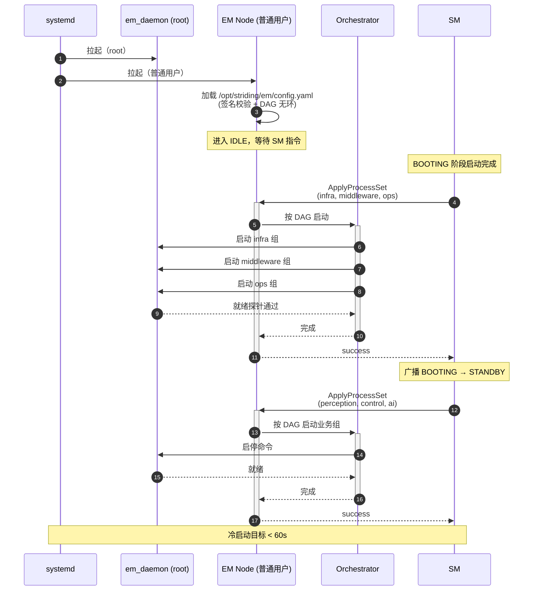

### 6.2 SM 状态变更 → EM 执行流程

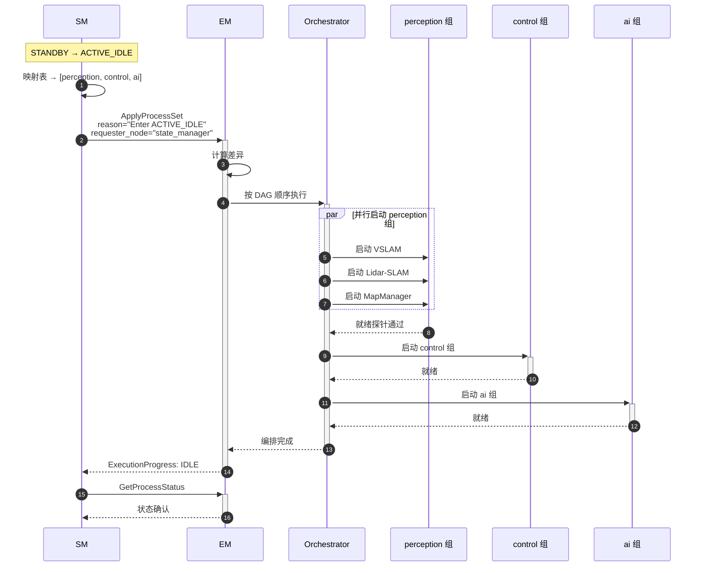

### 6.3 故障恢复流程（L1→L2→L3/L4 上报）

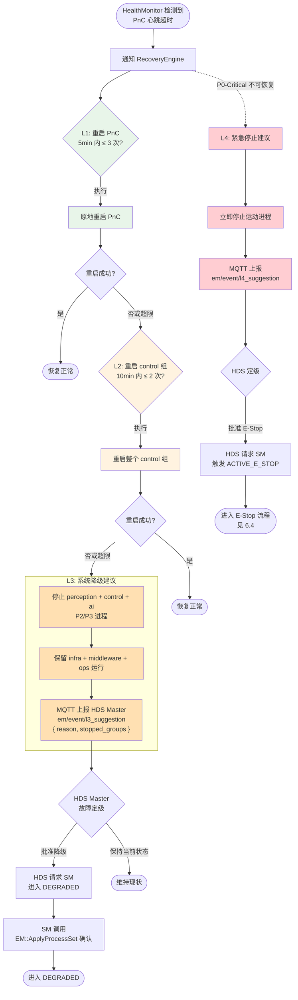

### 6.4 E-Stop 触发流程（安全关键路径）

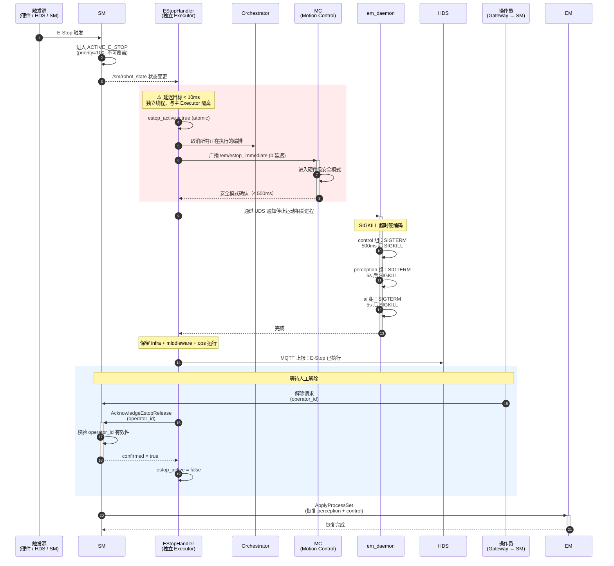

---

## 7. 关键参数与配置

### 7.1 运行时参数

| 参数 | 默认值 | 说明 |
|------|--------|------|
| `heartbeat_period_sec` | 1.0 | 常规进程心跳上报周期 |
| `heartbeat_period_control_sec` | 0.1 | control 组进程心跳周期（10Hz） |
| `heartbeat_timeout_count` | 3 | 常规进程连续超时次数 |
| `heartbeat_timeout_count_control` | 2 | control 组连续超时次数 |
| `startup_timeout_sec` | 30.0 | 进程启动超时时间 |
| `l1_max_restarts` | 3 | L1 快速重启最大次数 |
| `l1_restart_window_sec` | 300 | L1 重启窗口（秒） |
| `l2_max_restarts` | 2 | L2 进程组重启最大次数 |
| `l2_restart_window_sec` | 600 | L2 重启窗口（秒） |
| `cpu_threshold_percent` | 90.0 | CPU 使用率告警阈值 |
| `cpu_threshold_duration_sec` | 10.0 | CPU 持续超阈值时间 |
| `config_path` | `/opt/striding/em/config.yaml` | 配置文件路径 |
| `config_signature_required` | true | 是否强制要求配置签名 |
| `estop_immediate_timeout_ms` | 500 | E-Stop 等待 MC 安全模式超时（ms，硬编码最小值） |

### 7.2 配置文件结构

配置文件参考 `run_agibot.yaml` 的结构，分为**全局配置**、**进程定义**、**进程组定义**、**编排策略**四部分。

```yaml
# /opt/striding/em/config.yaml

signature: "sha256:abc123..."      # 配置文件 SHA256 签名
version: "1.0.0"

# ─── 全局配置 ───
env_file: "/opt/striding/em/env.yaml"   # 全局环境变量文件（YAML 格式，所有进程继承）
agi_user_uid: 1000                       # 默认运行用户 UID
agi_user_gid: 1000                       # 默认运行用户 GID
work_dir: "/opt/striding/sys/proc"      # 进程默认工作目录根路径

# ─── 进程定义 ───
processes:
  # 示例：DDS Broker（中间件基础设施）
  - name: "iox_roudi"
    group: "infra"
    path: "/opt/striding/bin/iox_roudi"      # 可执行文件路径
    args: ["--config", "/opt/striding/config/roudi.toml"]  # 命令行参数
    env:                                        # 进程级环境变量（覆盖全局）
      ROS_DOMAIN_ID: "0"
      FASTRTPS_DEFAULT_PROFILES_FILE: "/opt/striding/config/fastrtps.xml"
    work_dir: "/opt/striding/sys/proc/iox_roudi"  # 进程工作目录（覆盖全局）
    user: "striding"                           # 运行用户（覆盖全局 agi_user_uid）
    sudo: false                                # 是否需要 root 权限
    stdout: "/opt/striding/log/iox_roudi/stdout.log"   # stdout 重定向
    stderror: "/opt/striding/log/iox_roudi/stderr.log"  # stderr 重定向
    simple: false                              # 是否简单进程（不参与心跳/探针）
    readiness_probe:
      type: "tcp"
      port: 1883
      timeout: 5
      interval: 1
      retries: 3
    restart_policy:
      auto_restart: true
      max_restarts: 3
      window_sec: 300
    safety_class: "base"                       # base / critical（L4 触发依据）

  # 示例：运动控制（P0-Critical）
  - name: "motion_control"
    group: "control"
    path: "/opt/striding/bin/motion_control"
    args: ["--config", "/opt/striding/config/mc.yaml"]
    env:
      ROS_LOG_DIR: "/opt/striding/log/mc/ros/"
      LOG_PATH: "/opt/striding/log/mc/"
    work_dir: "/opt/striding/sys/proc/motion_control"
    user: "striding"
    sudo: false
    stdout: "/opt/striding/log/mc/stdout.log"
    stderror: "/opt/striding/log/mc/stderr.log"
    simple: false
    readiness_probe:
      type: "topic"
      topic: "/mc/joint_states"
      timeout: 15
      interval: 1
      retries: 3
    restart_policy:
      auto_restart: true
      max_restarts: 3
      window_sec: 300
    safety_class: "critical"                   # P0-Critical，故障时可能触发 L4
    resource_limits:
      cpuset: [2, 3]              # CPU 核心绑定（空=不限制）
      scheduler: "fifo"           # 调度策略：fifo / rr / other
      priority: 99                # 实时优先级（fifo/rr 时有效，1-99）
      mem_limit: "512m"           # 内存上限（cgroup memory.max）
      gpu_limit: 0                # GPU 算力限制百分比（0=不使用GPU）

  # 示例：HAL EtherCAT（P0-Critical，特权进程）
  - name: "hal_ethercat"
    group: "infra"
    path: "/opt/striding/bin/hal_ethercat"
    env:
      LD_LIBRARY_PATH: "/opt/ros/humble/lib"
    work_dir: "/opt/striding/sys/proc/hal_ethercat"
    user: "root"
    sudo: true
    stdout: "/opt/striding/log/hal_ethercat/stdout.log"
    stderror: "/opt/striding/log/hal_ethercat/stderr.log"
    simple: false
    readiness_probe:
      type: "tcp"
      port: 502
      timeout: 5
    safety_class: "critical"

  # 示例：动态认证（simple 进程，一次性任务）
  - name: "dynamic_auth"
    group: "middleware"
    path: "/opt/striding/bin/dynamic_auth"
    env:
      ROS_DOMAIN_ID: "0"
    work_dir: "/opt/striding/sys/proc/dynamic_auth"
    user: "striding"
    sudo: false
    simple: true                               # 简单进程：无心跳、无探针、不自动重启
    safety_class: "base"

  # 示例：校准工具（simple 进程）
  - name: "calibration"
    group: "ops"
    path: "bash"
    args: ["/opt/striding/scripts/calibration/start_calibration.sh"]
    env:
      AMENT_PREFIX_PATH: "/opt/ros/humble"
      LD_LIBRARY_PATH: "/opt/ros/humble/lib"
    work_dir: "/opt/striding/sys/proc/calibration"
    user: "striding"
    sudo: false
    simple: true
    safety_class: "base"

  # ... 其他进程定义（对齐 run_agibot.yaml 的 23 个模块）

# ─── 进程组定义（含 DAG 依赖）───
groups:
  - name: "infra"
    priority: 0
    processes: ["hal_sensor", "hal_camera", "hal_lidar", "hal_audio", "hal_ethercat", "iox_roudi"]
    depends_on: []             # 无依赖，Layer 0

  - name: "middleware"
    priority: 1
    processes: ["broker", "gateway", "state_manager", "executive_manager", "setting", "dynamic_auth"]
    depends_on: ["infra"]

  - name: "ops"
    priority: 1
    processes: ["task_engine", "health_diagnosis", "resource_collection", "data_recorder", "fota", "calibration"]
    depends_on: ["middleware"]

  - name: "perception"
    priority: 2
    processes: ["perception", "vslam", "lidar_slam", "map_manager"]
    depends_on: ["middleware", "infra"]   # 感知依赖中间件和 HAL

  - name: "control"
    priority: 2
    processes: ["pnc", "motion_control", "motion_player", "motion_streamer"]
    depends_on: ["perception", "infra"]   # 运动控制依赖感知和 HAL

  - name: "ai"
    priority: 3
    processes: ["agent", "interaction"]
    depends_on: ["middleware", "perception"]

# ─── DAG 校验配置 ───
dag_validation:
  strict: true                 # 严格模式：有环时拒绝加载
  max_depth: 10                # 最大 DAG 深度限制（防止过深层级）

# ─── 编排策略 ───
orchestration:
  fail_fast: true              # 单层失败是否停止整编排
  layer_timeout_sec: 30        # 单层启动超时
  orchestration_timeout_sec: 120  # 整编排超时
  parallel_max: 8              # 最大并行启动数（限制 fork 风暴）
  probe_interval_sec: 1        # 就绪探针轮询间隔
  probe_timeout_sec: 5         # 单个探针请求超时
```

---

## 8. 错误码定义

统一为扁平风格（与 SM 一致）：

| 错误码 | 名称 | 说明 |
|--------|------|------|
| 0 | OK | 成功 |
| 2001 | ERR_CONFIG_LOAD_FAILED | 配置文件加载失败 |
| 2002 | ERR_CONFIG_INVALID | 配置格式错误或 DAG 有环 |
| 2003 | ERR_CONFIG_SIGNATURE_INVALID | 配置签名校验失败 |
| 2004 | ERR_PROCESS_START_FAILED | 进程启动失败 |
| 2005 | ERR_PROCESS_NOT_FOUND | 指定进程不存在 |
| 2006 | ERR_PROCESS_ALREADY_RUNNING | 进程已在运行 |
| 2007 | ERR_PROCESS_STOP_FAILED | 进程停止失败 |
| 2008 | ERR_HEARTBEAT_TIMEOUT | 进程心跳超时 |
| 2009 | ERR_RESTART_EXHAUSTED | 重启次数耗尽 |
| 2010 | ERR_RECOVERY_FAILED | 故障恢复失败 |
| 2011 | ERR_INVALID_PROCESS_SET | 无效的进程集合 |
| 2012 | ERR_ORCHESTRATION_TIMEOUT | 编排超时 |
| 2013 | ERR_ORCHESTRATION_CANCELLED | 编排被 E-Stop 取消 |
| 2014 | ERR_ESTOP_ACTIVE | 急停状态下拒绝启动运动进程 |
| 2015 | ERR_ESTOP_RELEASE_UNCONFIRMED | E-Stop 解除未经过人工确认 |
| 2016 | ERR_ESTOP_RELEASE_INVALID_OPERATOR | E-Stop 解除的操作者 ID 无效 |
| 2017 | ERR_RELOAD_NOT_ALLOWED | 当前状态下不允许热重载 |
| 2018 | ERR_RELOAD_PATH_NOT_IN_WHITELIST | 配置路径不在白名单中 |
| 2019 | ERR_FORCE_NOT_AUTHORIZED | 请求者无权使用 force 操作 |
| 2020 | ERR_FAULT_HALT | FAULT 状态下拒绝启动非恢复进程 |
| 2021 | ERR_RECOVERY_PRECHECK_FAILED | FAULT 恢复前本地检查失败 |
| 2022 | ERR_RESOURCE_LIMIT_INVALID | 资源限制配置非法 |
| 2023 | ERR_CPUSET_OUT_OF_RANGE | cpuset 超出系统 CPU 范围 |
| 2024 | ERR_SCHEDULER_SET_FAILED | 调度策略设置失败 |
| 2025 | ERR_CGROUP_WRITE_FAILED | cgroup 写入失败 |

---

## 9. 包结构

```
em_msgs/                      # 消息定义包（纯接口）
    msg/
        ProcessStatus.msg
        ProcessGroupConfig.msg
        ExecutionProgress.msg
        ErrorCode.msg          # 错误码定义（原名 EmErrorCode.msg）
    srv/
        ControlProcess.srv
        GetProcessStatus.srv
        ApplyProcessSet.srv
        ReloadConfiguration.srv
        AcknowledgeEstopRelease.srv
    action/
        SystemRestart.action
    CMakeLists.txt

executive_manager/            # 节点实现包
    include/executive_manager/
        orchestrator.hpp
        health_monitor.hpp
        recovery_engine.hpp
        process_registry.hpp
        config_manager.hpp
        transition_queue.hpp
        estop_handler.hpp
    src/
        main.cpp
        orchestrator.cpp
        health_monitor.cpp
        recovery_engine.cpp
        process_registry.cpp
        config_manager.cpp
        transition_queue.cpp
        estop_handler.cpp
    em_daemon/                # root 特权代理（最小化）
        src/
            em_daemon.cpp
        CMakeLists.txt
    config/
        em_params.yaml
        config.yaml.template
    launch/
        executive_manager.launch.py
    CMakeLists.txt
```

---

## 10. 安全设计

### 10.1 E-Stop 路径（最高优先级）

- **独立 Executor**：EStopHandler 使用独立的 `SingleThreadedExecutor`，与主节点完全隔离
- **延迟目标**：SM 发布 ACTIVE_E_STOP 到 EM 开始执行 < 10ms
- **原子标志位**：`estop_active` 原子变量，Orchestrator 每次操作前检查
- **零延迟广播**：`/em/estop_immediate` Topic 广播，MC 先进入硬件级安全模式再停止进程
- **SIGKILL 硬编码**：运动进程 SIGTERM 超时 500ms 后强制 SIGKILL，不可通过参数调大
- **人工确认校验**：E-Stop 解除前，EM 通过 `AcknowledgeEstopRelease` Service 向 SM 校验 `operator_id` 有效性
- **审计日志**：所有 E-Stop 触发/解除/操作记录到独立的安全审计日志（`/var/log/striding/em_security.log`），包含时间戳、触发者、原因、operator_id

### 10.2 FAULT 状态下的行为

- FAULT 状态下，EM **拒绝**所有进程启动请求（除人工确认的恢复流程）
- EM **保持** infra + middleware 运行（维持基本通信和诊断能力）
- 从 FAULT 恢复必须经过：
  1. 人工确认（Gateway → SM）
  2. SM 调用 EM::GetProcessStatus 查询
  3. EM 执行本地检查：所有 P0/P1 进程状态为 RUNNING、配置无变更、无待处理恢复任务
  4. EM 本地检查通过后，方可执行恢复编排

### 10.3 权限最小化

- **拆分架构**：
  - `executive_manager_node`：以普通用户运行，ROS2 节点，接收所有 ROS2 请求
  - `em_daemon`：以 root 运行，最小化代码（< 500 行），只暴露 Unix Domain Socket 接口，负责 systemd 调用和信号发送
- **Capabilities 替代方案**（如拆分不可行）：使用 `CAP_KILL` + `CAP_SYS_ADMIN` 子集替代完整 root
- **配置文件权限**：600（仅 root 可读写），防止敏感信息泄露
- **审计日志权限**：640（仅 root 和审计组可读）

### 10.4 Force 操作约束

- `force=true` 仅允许以下节点使用：SM、HDS Master
- EM 维护 `force` 操作白名单，非白名单节点设置 `force=true` 时返回 `ERR_FORCE_NOT_AUTHORIZED`
- `force=true` **不能绕过**安全状态约束：E-Stop 激活和 FAULT 状态下，即使 `force=true` 也拒绝启动运动相关进程
- 所有 `force=true` 的操作记录到安全审计日志

### 10.5 热重载安全

- 禁止在 E-Stop 激活和 FAULT 状态下执行 ReloadConfiguration
- 配置路径必须在白名单 `/opt/striding/em/` 下
- 配置文件必须附带 SHA256 签名，ConfigManager 校验通过后才加载
- 热重载前执行完整校验：DAG 无环、所有进程路径存在、依赖满足
- 热重载操作记录安全审计日志（requester_node、reason、变更内容）

---

## 11. 设计审查修订记录

### v1 → v2 主要变更

| 审查问题 | 严重程度 | v1 设计 | v2 修订 |
|---------|---------|---------|---------|
| EM 内部状态机构成双重状态权威 | P0 | 9 状态内部状态机 | **删除状态机**，改为 ExecutionPhase（操作进度，非业务状态） |
| 策略模板隐式做状态映射 | P0 | EM 内部硬编码策略映射 | **策略由 SM 持有**，EM 接收 `ApplyProcessSet` 指令 |
| EM 自主请求 SM 状态转换 | P1 | L3/L4 直接请求 SM | **L3/L4 上报 HDS**，由 HDS 定级后请求 SM |
| MQTT 通道被移除 | P1 | 纯 ROS2 接口 | **保留 MQTT** 作为 EM ↔ HDS 跨语言通道 |
| Service 命名风格不一致 | P2 | `/em/control`、`/em/get_status` | 统一为动宾命名：`/em/control_process`、`/em/get_process_status` |
| 错误码风格不一致 | P2 | `EmErrorCode` 嵌套消息 | **扁平化**：每个 srv 响应中直接使用 `uint16 error_code` + `string message` |
| E-Stop 解除未校验人工确认 | 安全 | E-Stop 解除后直接恢复 | **新增 `AcknowledgeEstopRelease` Service**，校验 `operator_id` |
| L4 触发条件过于粗糙 | 安全 | "P0 进程失败即触发 L4" | **细分 P0-Critical**（hal_ethercat 等）和 P0-Base（HAL_AUDIO 等） |
| `force` 字段缺乏权限约束 | 安全 | 任何节点可设置 `force=true` | **白名单限制**（仅 SM/HDS Master），不能绕过安全状态 |
| ReloadConfig 缺乏安全校验 | 安全 | 任意路径可热重载 | **路径白名单 + 签名校验 + 状态限制** |
| root 权限未最小化 | 安全 | EM 以 root 运行 | **拆分架构**：`executive_manager_node`（普通用户）+ `em_daemon`（root，最小化） |
| E-Stop 时序未考虑硬件安全 | 安全 | 直接 SIGTERM 停止 MC | **先广播 `estop_immediate`**，MC 进入硬件安全模式后再停止 |
| FAULT 恢复缺少本地检查 | 安全 | SM 检查后直接恢复 | **EM 本地检查**：P0/P1 全部 RUNNING、配置无变更 |
| EStopCallbackGroup 实现不明确 | 条件 | "独立 CallbackGroup" | **明确为独立 SingleThreadedExecutor**，延迟目标 < 10ms |
| 缺少 TransitionQueue | 条件 | 无并发控制 | **新增 TransitionQueue**，E-Stop 可抢占任何编排 |
| 心跳对运动进程不够敏感 | 条件 | 统一 1Hz + 3 次超时 | **control 组 10Hz + 2 次超时**，MC 崩溃 `waitpid` 立即检测 |
| `/em/control` Topic 语义混乱 | 建议 | 混合控制输入和事件广播 | **删除 Topic**，改为 `/em/control_events` 专用于审计广播 |
| `pid` 字段类型 | 建议 | `string pid` | **`int32 pid`** |
| 策略模板过度工程化 | 建议 | 独立 `ExecutionStrategy` 消息类型 | **删除**，进程集合由 SM 直接下发 |
| 心跳 Topic 命名歧义 | 建议 | `/em/heartbeat` | **`/em/process_heartbeat`**（输入）+ `/em/heartbeat`（EM 自身心跳） |

---

## 附录：PS → EM 改名对照表

| 原 PS 术语 | 新 EM 术语（v2） | 说明 |
|-----------|----------------|------|
| Process Supervisor | Executive Manager | 模块名 |
| PS 状态机（无） | 无状态机 | 删除 v1 中的 9 状态内部状态机 |
| 启动编排 | Orchestrator | 功能保留 |
| 健康监控 | HealthMonitor | 新增差异化心跳策略 |
| 恢复引擎 | RecoveryEngine | L3/L4 改为上报 HDS，不直接请求 SM |
| 进程注册表 | ProcessRegistry | 功能保留 |
| 配置管理 | ConfigManager | 新增签名校验 + 热重载安全限制 |
| StateMachine（新增） | 删除 | 回归无状态执行器 |
| ExecutionStrategy（新增） | 删除 | 策略由 SM 持有并下发 |
| Control API（gRPC） | ROS2 Service | 统一接口风格 |
| EStopCallbackGroup | EStopHandler + 独立 Executor | 更明确的实现 |
| 无 | TransitionQueue | 新增编排队列 |
| 无 | em_daemon | 新增 root 特权代理 |
| 无 | `/em/estop_immediate` | 新增 E-Stop 紧急广播 Topic |
| 无 | `AcknowledgeEstopRelease` | 新增 E-Stop 解除确认 Service |
| MQTT（保留） | MQTT（保留） | PS ↔ HDS 通道，EM 继续使用 |
