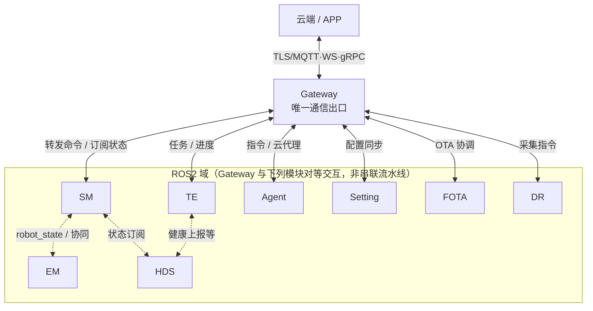
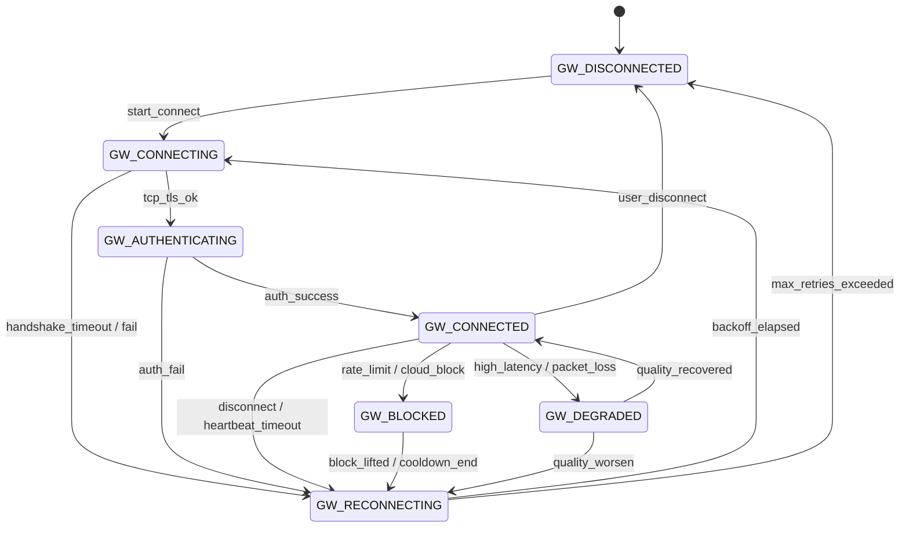
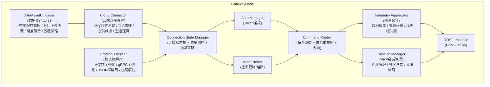
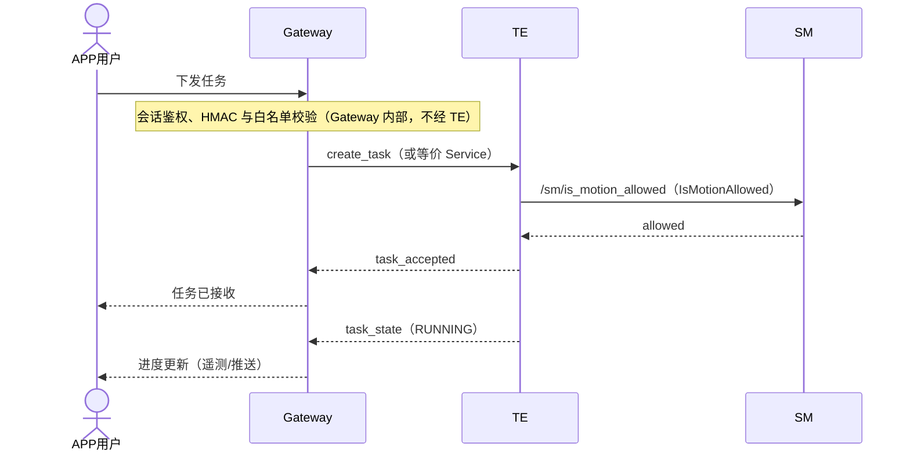
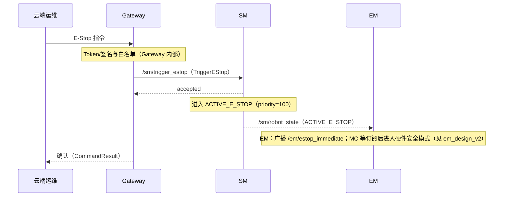

# Gateway 模块设计

## 1. 模块概述与定位

**模块名称**：Gateway

**定位**：Gateway 是端侧软件系统中的**云端/APP通信唯一出口**，位于中间件层。它是机器人与外部世界（云端平台、移动APP、Web控制台）之间的唯一桥梁，负责建立和维护安全连接、转发所有内外通信、实施访问控制和流量管理。

**核心职责**：

1. **连接管理**：建立并维护与云端平台的安全长连接（MQTT over TLS / WebSocket / gRPC）
2. **命令转发**：接收并鉴权来自云端/APP的用户指令，转发至内部相应模块（SM、TE、Setting等）
3. **状态上报**：聚合机器人全局状态、任务进度、健康数据，按策略上报云端
4. **会话管理**：管理APP客户端连接会话，支持多客户端并发
5. **数据资产上传管理**：Gateway 内部集成 DataUploader 子模块，统一管理数据资产上传的带宽配额、压缩加密、断点续传
6. **OTA协调**：接收云端OTA指令，转发至FOTA模块执行
7. **流量管控**：实施速率限制、熔断降级、重连退避策略
8. **带宽隔离**：控制指令与数据上传带宽隔离，确保控制指令绝对优先
9. **安全隔离**：TLS加密、Token鉴权、命令白名单、防重放攻击、数据脱敏

**与相邻模块的边界**：

| 边界 | Gateway 负责 | 对方负责 |
|------|-------------|---------|
| Gateway ↔ 云端/APP | 建立安全连接，协议转换，数据序列化 | 云端平台逻辑，APP UI/UX |
| Gateway ↔ SM | 转发用户状态控制指令；订阅状态广播 | 状态机决策，转换仲裁 |
| Gateway ↔ TE | 转发任务指令；上报任务进度 | 任务调度与执行生命周期 |
| Gateway ↔ HDS | 上报健康/诊断数据至云端 | 故障诊断与定级 |
| Gateway ↔ FOTA | 转发OTA下载指令；上报OTA进度 | 固件下载、验证、安装 |
| Gateway ↔ Agent | 转发语音/LLM指令；上报Agent状态 | VLA决策、技能执行 |
| Gateway ↔ Setting | 转发配置修改请求；同步配置状态 | 参数持久化与验证 |
| Gateway ↔ DR | 转发数据采集启停指令 | 数据记录与存储 |
| Gateway ↔ Data Uploader | DataUploader 为 Gateway 内部子模块，不独立对外通信 | 带宽配额管理、上传调度 |
| Gateway ↔ Data Rule Engine | 转发云端下发的采集规则 | 规则解析与触发执行 |

---

## 2. 职责边界

Gateway 在端侧架构中的位置：



**与 Interaction 的边界**：Gateway 负责**链路与会话**（TLS、Token、APP 物理连接、云端 MQTT 等）；**交互层意图仲裁与多模态融合**由 Interaction 完成。APP 侧既有「控制面」命令可走 Gateway 直达 TE/SM，也有「交互内容」经 Interaction 标准化后再送 Agent——二者职责不重复：Gateway **不做**意图理解与对话状态机；Interaction **不做**公网出口与证书栈。

**Gateway 不做的事情**（红线）：

- **不做状态机决策** — 只转发用户指令到SM，不做状态转换判断
- **不做故障定级** — 只上报原始数据，HDS负责定级
- **不做运动控制** — 不直接下发关节指令，通过TE/SM转发
- **不做业务逻辑执行** — 只负责通信转发，不执行具体任务
- **不做配置类持久化** — 配置持久化是 Setting 的职责；断网遥测等仅允许**定长、加密、有上限的缓存队列**（见 §5.3.2），不等同于配置存储
- **不绕过安全校验** — 所有命令必须经过鉴权和白名单检查

---

## 3. 状态机设计

### 3.1 连接状态枚举

| 状态 | 值 | 说明 |
|------|-----|------|
| `GW_DISCONNECTED` | 0 | 未连接云端，仅本地可用 |
| `GW_CONNECTING` | 1 | 正在建立连接（TCP握手 → TLS → 认证） |
| `GW_AUTHENTICATING` | 2 | TLS已建立，正在进行Token认证 |
| `GW_CONNECTED` | 3 | 认证通过，正常通信中 |
| `GW_DEGRADED` | 4 | 连接可用但质量下降（高延迟/丢包） |
| `GW_RECONNECTING` | 5 | 连接断开，正在自动重连 |
| `GW_BLOCKED` | 6 | 被云端限流或封禁，暂停通信 |

### 3.2 状态转换图

（状态名与 §3.1 枚举一致；进入 `GW_BLOCKED` 后须先回到 `GW_RECONNECTING` 再走握手，与 §3.3 表一致——不在封禁解除后「无握手」直接等价于长期在线会话。）



### 3.3 状态转换表

| 当前状态 | 目标状态 | 触发条件 | 优先级 | 说明 |
|----------|----------|----------|--------|------|
| DISCONNECTED | CONNECTING | 启动/用户触发连接 | 60 | 正常启动流程 |
| CONNECTING | AUTHENTICATING | TCP+TLS握手成功 | — | 网络层就绪 |
| CONNECTING | RECONNECTING | 握手超时/失败 | 60 | 退避重试 |
| AUTHENTICATING | CONNECTED | Token验证通过 | — | 认证成功 |
| AUTHENTICATING | RECONNECTING | Token过期/无效 | 60 | 尝试刷新Token |
| CONNECTED | DEGRADED | 延迟>阈值或丢包率>阈值 | 40 | 质量监控触发 |
| DEGRADED | CONNECTED | 质量恢复 | 40 | 自动恢复 |
| DEGRADED | RECONNECTING | 质量持续恶化 | 60 | 主动重建连接 |
| CONNECTED | RECONNECTING | 网络断开/心跳超时 | 80 | 连接异常 |
| CONNECTED | BLOCKED | 收到云端限流/封禁指令 | 70 | 服务端控制 |
| BLOCKED | RECONNECTING | 封禁解除、冷却结束或需重新握手 | 60 | 与 §3.2 一致：不直连 CONNECTED |
| RECONNECTING | CONNECTING | 退避结束，开始重连 | 60 | 重连流程 |
| RECONNECTING | DISCONNECTED | 重连尝试耗尽 | 80 | 与 §3.2、§5.3.5 一致 |
| * | DISCONNECTED | 用户主动断开 | 100 | 最高优先级 |

### 3.4 状态转换约束

1. **认证失败3次** → 进入DISCONNECTED并告警（避免暴力尝试）
2. **重连退避策略**：首次1s，之后指数退避至最大60s，随机抖动±20%
3. **BLOCKED状态**必须等待云端显式解除或最长冷却时间（默认5分钟）
4. **DISCONNECTED状态下**，Gateway仍提供本地回环功能（APP本地连接可用）
5. **状态变更时**必须发布 `/gateway/connection_state` Topic

---

## 4. ROS2 接口定义

以下 `Heartbeat.msg`、`GetHealthStatus.srv` 的**固定前缀字段**（顺序与类型）须符合仓库 **`design/interface_standards.md`**；Gateway 仅在标准字段后追加扩展字段。

### 4.1 消息定义 (msg)

```
# gateway_msgs/msg/ConnectionState.msg
# Gateway 云端连接状态广播

uint8 state                 # 当前连接状态 (GW_DISCONNECTED=0 ... GW_BLOCKED=6)
uint8 prev_state            # 上一个状态
builtin_interfaces/Time state_changed_at  # 状态变更时间
string reason               # 状态变更原因（如 "auth_success", "heartbeat_timeout"）
uint32 reconnect_attempts   # 当前重连尝试次数
float32 latency_ms          # 当前连接延迟（ms，DISCONNECTED时为-1）
```

```
# gateway_msgs/msg/CommandEnvelope.msg
# 封装来自云端/APP的命令

string command_id           # 命令唯一ID（UUID，用于去重和追踪）
string source               # 来源标识（"cloud", "app", "local"）
string target_module        # 目标模块（"sm", "te", "setting", "fota", "dr", "agent"）
string command_type         # 命令类型（由目标模块定义）
string payload_json         # 命令参数（JSON格式）
builtin_interfaces/Time stamp       # 命令产生时间
string auth_token           # 鉴权Token（仅入口解码使用；校验后不得进入对外 Topic）
```

**`CommandEnvelope` 使用约束**：仅允许出现在 **Gateway 内部队列**或**指向 Gateway 的 Service 请求载荷**中；**禁止**将含 `auth_token` 的完整 `CommandEnvelope` 发布到任意可订阅 Topic。对外仅发布脱敏后的 `CommandResult` 或不含凭证的控制摘要。

```
# gateway_msgs/msg/CommandResult.msg
# 命令执行结果上报

string command_id           # 对应CommandEnvelope的command_id
bool success                # 是否成功
uint16 error_code           # 错误码（目标模块的错误码或Gateway错误码）
string message              # 结果描述
string target_module        # 执行模块
builtin_interfaces/Time completed_at  # 完成时间
```

```
# gateway_msgs/msg/TelemetryBatch.msg
# 批量遥测数据上报

builtin_interfaces/Time batch_time      # 批次时间戳
uint32 sequence_num                     # 序列号（用于检测丢包）
gateway_msgs/TelemetryItem[] items  # 遥测项列表
```

```
# gateway_msgs/msg/TelemetryItem.msg
# 单条遥测项（TelemetryBatch.items 元素类型）

string category             # 类别（"state", "health", "task", "motion", "sensor"）
string item_name            # 项名称
string value_json           # 值（JSON）
builtin_interfaces/Time sampled_at
```

```
# gateway_msgs/msg/Heartbeat.msg
# Gateway 心跳

builtin_interfaces/Time stamp
string node_name            # "gateway_node"
uint8 state                 # 当前连接状态
bool healthy                # 整体健康
string status_message       # 状态描述
uint32 commands_forwarded   # 已转发命令计数
uint32 telemetry_uploaded   # 已上传遥测计数
float32 avg_latency_ms      # 平均延迟
```

```
# gateway_msgs/msg/SessionInfo.msg
# APP会话信息

string session_id           # 会话ID
string client_type          # 客户端类型（"ios", "android", "web", "internal"）
string client_version       # 客户端版本
builtin_interfaces/Time connected_at
builtin_interfaces/Time last_active_at
bool authenticated          # 是否已认证
```

### 4.2 服务定义 (srv)

```
# gateway_msgs/srv/DeployRules.srv
# 转发云端下发的数据采集规则至 Data Rule Engine。
# 若 DRE 独立为 data_rule_engine_msgs 包，可将本定义迁移至该包；Gateway 仅作为客户端调用 /data_rule_engine/deploy_rules。

string ruleset_id           # 规则集 ID
string payload_json         # 规则体（JSON）
string schema_version       # 规则 Schema 版本
---
bool success
string message
uint16 error_code
```

```
# gateway_msgs/srv/GetHealthStatus.srv
# Gateway 健康状态查询

---
bool success
string node_name
builtin_interfaces/Time uptime_since
uint8 state
bool healthy
string message
uint8 current_connection_state
uint32 total_commands_forwarded
uint32 total_telemetry_uploaded
uint32 failed_auth_attempts
```

```
# gateway_msgs/srv/AuthenticateSession.srv
# 会话认证（APP连接时调用）

string session_id
string auth_token
string client_type
string client_version
---
# Response
bool accepted
uint16 error_code
string message
string new_token            # 刷新后的Token（如支持）
builtin_interfaces/Time expires_at
```

```
# gateway_msgs/srv/ForwardCommand.srv
# 内部模块请求Gateway转发命令到云端（如Agent需要LLM服务）

string command_id
string target_cloud_service # 目标云服务（"llm", "tts", "stt", "log_upload"）
string payload_json
uint32 timeout_ms           # 超时时间
---
# Response
bool success
uint16 error_code
string message
string response_json        # 云端响应
```

```
# gateway_msgs/srv/RequestOtaDownload.srv
# FOTA请求Gateway启动固件下载

string package_url
string package_checksum
uint64 package_size
string version
---
# Response
bool accepted
uint16 error_code
string message
string download_task_id
```

```
# gateway_msgs/srv/GetConnectionStatus.srv
# 查询当前连接状态详情

# Request（空）
---
# Response
uint8 state
float32 latency_ms
uint32 reconnect_attempts
builtin_interfaces/Time connected_since
uint32 bytes_sent
uint32 bytes_received
```

### 4.3 接口汇总表

#### Topics

| 名称 | 类型 | 方向 | QoS | 频率 | 说明 |
|------|------|------|-----|------|------|
| `/gateway/connection_state` | `gateway_msgs/msg/ConnectionState` | Gateway → ALL | Reliable + Transient Local + Depth 1 | 事件驱动 | 连接状态广播 |
| `/gateway/command_result` | `gateway_msgs/msg/CommandResult` | Gateway → ALL | Reliable + Volatile + Depth 100 | 事件驱动 | 命令执行结果 |
| `/gateway/telemetry_batch` | `gateway_msgs/msg/TelemetryBatch` | Gateway → Cloud | Reliable + Volatile + Depth 10 | 1-10 Hz | 遥测数据上传 |
| `/gateway/heartbeat` | `gateway_msgs/msg/Heartbeat` | Gateway → EM/HDS | Reliable + Volatile + Depth 1 | 1 Hz | 心跳 |
| `/gateway/session_event` | `gateway_msgs/msg/SessionInfo` | Gateway → ALL | Reliable + Volatile + Depth 10 | 事件驱动 | 会话事件 |

#### Services

| 名称 | 类型 | 调用方 | 说明 |
|------|------|--------|------|
| `/gateway/get_health_status` | `gateway_msgs/srv/GetHealthStatus` | EM, HDS | 健康查询 |
| `/gateway/authenticate_session` | `gateway_msgs/srv/AuthenticateSession` | APP客户端 | 会话认证 |
| `/gateway/forward_command` | `gateway_msgs/srv/ForwardCommand` | Agent, TE | 请求转发到云端 |
| `/gateway/request_ota_download` | `gateway_msgs/srv/RequestOtaDownload` | FOTA | 固件下载请求 |
| `/gateway/get_connection_status` | `gateway_msgs/srv/GetConnectionStatus` | SM, EM | 连接状态查询 |
| `/data_rule_engine/deploy_rules` | `gateway_msgs/srv/DeployRules` | Gateway（客户端）→ DRE（服务端） | 云端规则下发；srv 可迁至 `data_rule_engine_msgs`（§4.2） |

#### QoS 与跨协议语义

- **ROS2 侧**：发往云端前的聚合 Topic（如 `/gateway/telemetry_batch`）使用 **Reliable**，避免节点进程内丢批次。
- **广域网侧**：MQTT/WebSocket 上可对非关键遥测采用**允许丢弃/降采样**策略；即「ROS Reliable」保证进程内不丢批，**不保证**广域网每一条遥测必达（与 §5.2 一致）。

#### 内部订阅的Topics（用于收集上报数据）

| 名称 | 类型 | 来源 | 说明 |
|------|------|------|------|
| `/sm/robot_state` | `sm_msgs/msg/RobotState` | SM | 机器人状态 |
| `/te/task_state` | `te_msgs/msg/TaskState` | TE | 任务状态 |
| `/hds/health_report` | `hds_msgs/msg/HealthReport` | HDS | 健康报告 |
| `/mc/motion_state` | `mc_msgs/msg/MotionState` | MC | 运动状态 |
| `/pnc/navigation_state` | `pnc_msgs/msg/NavigationState` | PnC | 导航状态 |

---

## 5. 内部设计

### 5.1 节点架构



### 5.2 关键设计决策

1. **单一出口原则**：Gateway是唯一的云端通信出口，所有模块通过ROS2 Service/Topic与Gateway交互，禁止任何模块直连云端
2. **命令去重**：基于`command_id`的幂等性保证，相同command_id的命令在10秒内重复到达将被丢弃
3. **遥测分级上报**：
   - **实时级**（1Hz）：机器人状态、连接状态
   - **常规级**（0.2Hz）：健康数据、运动数据
   - **批量级**（按需）：日志、诊断数据
4. **TLS双向认证**：Gateway到云端使用mTLS，APP到Gateway使用Token+签名
5. **QoS分层**：
   - **ROS2 域内**：转发命令与聚合后的遥测批次 Topic 使用 **Reliable**，避免进程内无故丢命令/丢批。
   - **广域网出口**：在 MQTT/WS 层可对遥测做**降采样、合并、Best Effort**以节省带宽；「允许部分丢失」指**跨网策略**，与 ROS Topic 的 Reliable 配置分层理解（见 §4.3）。
6. **带宽隔离**：上行带宽分为控制指令预留（固定30%）和数据上传动态配额（剩余70%），Data Uploader 每次上传前申请配额
7. **数据脱敏**：Gateway 在转发数据资产上传前执行脱敏策略检查（人脸/车牌模糊标记验证）

### 5.3 关键流程

#### 5.3.1 云端命令转发流程

```
云端/APP发送命令
  → Cloud Connector 接收
  → Protocol Handler 解码
  → Auth Manager 验证Token
  → Rate Limiter 检查配额
  → Command Router 解析target_module
    → 白名单校验（非法模块 → 拒绝，ERR_INVALID_COMMAND）
    → 去重检查（重复command_id → 丢弃）
  → 封装为 CommandEnvelope
  → ROS2 Service 调用目标模块接口
    → target_module执行命令
    → 返回执行结果
  → 封装为 CommandResult
  → Protocol Handler 编码
  → Cloud Connector 发送回云端/APP
```

#### 5.3.2 遥测上报流程

```
Telemetry Aggregator 订阅内部Topics
  → 收集 /sm/robot_state
  → 收集 /te/task_state
  → 收集 /hds/health_report
  → 收集 /mc/motion_state
  → 收集 /pnc/navigation_state
  → 按类别放入优先级队列
  → 定时器触发批量打包（1s窗口）
  → 压缩（gzip）
  → 检查连接状态
    → CONNECTED → 通过Cloud Connector发送
    → 其他 → 存入本地队列（最多1000条），恢复后补发
```

上述本地队列为**有界加密缓存**（见 §9.4），用于断网补发，**不是** Setting 类配置持久化。

#### 5.3.3 OTA下载协调流程

```
FOTA调用 /gateway/request_ota_download
  → Gateway验证URL和校验值格式
  → 检查当前网络状态和带宽
  → 创建下载任务
  → 通过HTTP/HTTPS下载固件包
  → 边下载边计算校验和
  → 下载完成后验证校验和
    → 校验失败 → 删除文件，返回ERR_VERIFY_FAILED
    → 校验通过 → 通知FOTA取文件
  → FOTA通过本地文件路径读取
```

#### 5.3.4 带宽隔离与数据资产上传流程（新增）

```
Data Uploader 申请上传带宽配额
  → Gateway 的 DataAssetUploader 评估当前带宽使用
    → 计算控制指令当前占用带宽
    → 可用带宽 = 总上行带宽 × 70% - 控制指令占用
    → 按优先级分配：
        → CRITICAL（故障数据）：立即分配，可抢占低优先级
        → HIGH（训练数据）：正常分配
        → NORMAL/LOW（日志/诊断）：闲时分配或拒绝
  → 返回带宽配额给 Data Uploader
    → Data Uploader 按配额速率上传
    → 上传过程中 Gateway 持续监测控制指令带宽
      → 控制指令带宽突增 → 通知 Data Uploader 降速/暂停
      → 控制指令带宽下降 → 通知 Data Uploader 恢复/加速
  → 上传完成后释放配额
```

#### 5.3.5 连接断开自动恢复流程

```
心跳超时 detected
  → Connection State Manager 标记为 RECONNECTING
  → 发布 /gateway/connection_state
  → 启动退避定时器
    → 第1次：1s
    → 第2次：2s
    → 第3次：4s
    → ...最大60s
  → 退避结束 → 尝试CONNECTING
    → 成功 → 进入AUTHENTICATING
    → 失败 → 增加计数，继续退避
  → 重连10次失败后 → 进入DISCONNECTED并上报HDS
```

---

## 6. 与其他模块的交互

### 6.1 交互矩阵

| 模块 | 方向 | 接口 | 说明 |
|------|------|------|------|
| SM | Gateway → SM | `/sm/request_transition` (Service) | 转发用户状态控制指令 |
| SM | Gateway → SM | `/sm/trigger_estop` (Service) | 转发云端/APP 急停（`TriggerEStop`，优先级由 SM 仲裁） |
| SM | SM → Gateway | `/sm/robot_state` (Topic) | Gateway订阅并上报云端 |
| TE | Gateway → TE | `/te/create_task` (Service) | 转发任务指令 |
| TE | TE → Gateway | `/te/task_state` (Topic) | Gateway订阅并上报任务进度 |
| HDS | HDS → Gateway | `/hds/health_report` (Topic) | Gateway订阅并上报健康数据 |
| FOTA | FOTA → Gateway | `/gateway/request_ota_download` (Service) | FOTA请求下载固件 |
| FOTA | Gateway → FOTA | `/fota/start_upgrade` (Service) | 转发OTA启动指令 |
| Agent | Gateway → Agent | `/agent/process_command` (Service) | 转发语音/LLM指令 |
| Agent | Agent → Gateway | `/gateway/forward_command` (Service) | Agent请求云端LLM服务 |
| Setting | Gateway → Setting | `/setting/set_parameter` (Service) | 转发配置修改 |
| Setting | Setting → Gateway | `/setting/parameter_change_event` (Topic) | 上报配置变更 |
| DR | Gateway → DR | `/dr/start_recording` (Service) | 转发数据采集指令 |
| Data Uploader (内部子模块) | Gateway ↔ DU | 内部 Service 调用 | 带宽配额申请/通知、上传调度 |
| Data Rule Engine | Gateway → DRE | `/data_rule_engine/deploy_rules` (`DeployRules`) | 转发云端采集规则（srv 定义见 §4.2，可迁至 `data_rule_engine_msgs`） |
| EM | EM → Gateway | `/gateway/get_health_status` (Service) | EM健康检查 |
| 云端 | 云端 → Gateway | MQTT/WS/gRPC | 接收云端命令 |
| 云端 | Gateway → 云端 | MQTT/WS/gRPC | 上报状态和遥测 |
| Interaction | Gateway ↔ Interaction | 依产品实现（Topic/Service） | 交互意图与连接会话分工见 §2；Gateway 不经 Interaction 做意图推理 |

### 6.2 关键交互时序

#### 时序1：用户通过APP下发任务



#### 时序2：云端急停指令

与 `sm_design.md`、`em_design_v2.md` 一致：**急停状态转换由 SM 权威完成**；EM 在订阅 `/sm/robot_state` 后广播 `/em/estop_immediate`，MC 等进入硬件安全模式。Gateway **不**直接调用 EM 触发急停。



---

## 7. 关键参数与配置

### 7.1 运行时参数

| 参数名 | 类型 | 默认值 | 说明 |
|--------|------|--------|------|
| `cloud_host` | string | "" | 云端平台地址 |
| `cloud_port` | int | 8883 | 云端MQTT端口 |
| `protocol_type` | string | "mqtt" | 协议类型（mqtt/websocket/grpc） |
| `tls_enabled` | bool | true | 是否启用TLS |
| `tls_ca_cert_path` | string | "/etc/gateway/ca.crt" | CA证书路径 |
| `tls_client_cert_path` | string | "/etc/gateway/client.crt" | 客户端证书路径 |
| `tls_client_key_path` | string | "/etc/gateway/client.key" | 客户端私钥路径 |
| `auth_token` | string | "" | 认证Token |
| `token_refresh_interval_sec` | int | 3600 | Token刷新间隔（秒） |
| `heartbeat_interval_sec` | int | 30 | 云端心跳间隔（秒） |
| `heartbeat_timeout_sec` | int | 90 | 心跳超时时间（秒） |
| `reconnect_initial_delay_ms` | int | 1000 | 重连初始延迟（ms） |
| `reconnect_max_delay_ms` | int | 60000 | 重连最大延迟（ms） |
| `reconnect_max_attempts` | int | 10 | 最大重连尝试次数 |
| `telemetry_batch_interval_ms` | int | 1000 | 遥测批量间隔（ms） |
| `telemetry_queue_size` | int | 1000 | 遥测队列最大长度 |
| `command_dedup_window_sec` | int | 10 | 命令去重窗口（秒） |
| `rate_limit_commands_per_sec` | int | 100 | 每秒最大命令数 |
| `rate_limit_telemetry_bytes_per_sec` | int | 1048576 | 每秒最大遥测字节数 |
| `local_app_port` | int | 8080 | 本地APP服务端口号 |
| `command_whitelist` | string[] | ["sm.*", "te.*", "setting.*", "fota.*", "dr.*", "agent.*"] | 允许转发的命令前缀 |

### 7.2 配置文件结构

```yaml
# gateway_params.yaml
gateway_node:
  ros__parameters:
    cloud:
      host: "robot-cloud.example.com"
      port: 8883
      protocol: "mqtt"
      tls:
        enabled: true
        ca_cert: "/etc/gateway/ca.crt"
        client_cert: "/etc/gateway/client.crt"
        client_key: "/etc/gateway/client.key"
      auth:
        token: ""  # 启动时由EM注入或从安全存储读取
        refresh_interval_sec: 3600

    connection:
      heartbeat_interval_sec: 30
      heartbeat_timeout_sec: 90
      reconnect_initial_delay_ms: 1000
      reconnect_max_delay_ms: 60000
      reconnect_max_attempts: 10

    telemetry:
      batch_interval_ms: 1000
      queue_size: 1000
      categories:
        - name: "state"
          priority: 10
          interval_sec: 1.0
        - name: "health"
          priority: 5
          interval_sec: 5.0
        - name: "motion"
          priority: 3
          interval_sec: 5.0

    rate_limit:
      commands_per_sec: 100
      telemetry_bytes_per_sec: 1048576

    security:
      command_whitelist:
        - "sm.*"
        - "te.*"
        - "setting.*"
        - "fota.*"
        - "dr.*"
        - "agent.*"
      dedup_window_sec: 10

    data_upload:
      enabled: true
      control_reserved_percent: 30
      upload_max_rate_mbps: 10.0
      quota_check_interval_ms: 500
      support_formats:
        - "mifeng_v1"
        - "coscene_v1"
      anonymization:
        enabled: true
        blur_faces: true
        blur_license_plates: true

    local_app:
      enabled: true
      port: 8080
```

---

## 8. 错误码定义

### 8.1 消息内错误码

```
# gateway_msgs/msg/ErrorCode.msg
# Gateway 错误码定义

uint16 OK                              = 0
uint16 ERR_GW_CLOUD_UNREACHABLE           = 6001   # 无法连接云端
uint16 ERR_GW_AUTHENTICATION_FAILED       = 6002   # 认证失败
uint16 ERR_GW_RATE_LIMIT_EXCEEDED         = 6003   # 速率超限
uint16 ERR_GW_INVALID_COMMAND             = 6004   # 非法命令
uint16 ERR_GW_SESSION_EXPIRED             = 6005   # 会话过期
uint16 ERR_GW_FORWARD_FAILED              = 6006   # 转发目标模块失败
uint16 ERR_GW_TLS_HANDSHAKE_FAILED        = 6007   # TLS握手失败
uint16 ERR_GW_COMMAND_TIMEOUT             = 6008   # 命令执行超时
uint16 ERR_GW_UNSUPPORTED_COMMAND_TYPE    = 6009   # 不支持的命令类型
uint16 ERR_GW_CLOUD_DISCONNECTED          = 6010   # 云端未连接
uint16 ERR_GW_INVALID_TOKEN               = 6011   # 无效Token
uint16 ERR_GW_TELEMETRY_QUEUE_FULL        = 6012   # 遥测队列满
uint16 ERR_GW_FIRMWARE_DOWNLOAD_FAILED    = 6013   # 固件下载失败
uint16 ERR_GW_DOWNLOAD_VERIFY_FAILED      = 6014   # 下载文件校验失败
uint16 ERR_GW_INVALID_SESSION             = 6015   # 无效会话
uint16 ERR_GW_BANDWIDTH_QUOTA_EXCEEDED    = 6016   # 带宽配额超限
uint16 ERR_GW_DATA_UPLOAD_FAILED          = 6017   # 数据资产上传失败
uint16 ERR_GW_UPLOAD_RESUME_FAILED        = 6018   # 断点续传失败
uint16 ERR_GW_ANONYMIZATION_FAILED        = 6019   # 数据脱敏失败
```

### 8.2 错误码汇总表

| 错误码 | 常量名 | 说明 | 严重级别 |
|--------|--------|------|----------|
| 0 | OK | 成功 | — |
| 6001 | ERR_GW_CLOUD_UNREACHABLE | 无法连接云端 | HIGH |
| 6002 | ERR_GW_AUTHENTICATION_FAILED | 认证失败 | HIGH |
| 6003 | ERR_GW_RATE_LIMIT_EXCEEDED | 速率超限 | MEDIUM |
| 6004 | ERR_GW_INVALID_COMMAND | 非法命令 | MEDIUM |
| 6005 | ERR_GW_SESSION_EXPIRED | 会话过期 | MEDIUM |
| 6006 | ERR_GW_FORWARD_FAILED | 转发失败 | HIGH |
| 6007 | ERR_GW_TLS_HANDSHAKE_FAILED | TLS握手失败 | HIGH |
| 6008 | ERR_GW_COMMAND_TIMEOUT | 命令超时 | MEDIUM |
| 6009 | ERR_GW_UNSUPPORTED_COMMAND_TYPE | 不支持的命令类型 | LOW |
| 6010 | ERR_GW_CLOUD_DISCONNECTED | 云端未连接 | MEDIUM |
| 6011 | ERR_GW_INVALID_TOKEN | 无效Token | HIGH |
| 6012 | ERR_GW_TELEMETRY_QUEUE_FULL | 遥测队列满 | LOW |
| 6013 | ERR_GW_FIRMWARE_DOWNLOAD_FAILED | 固件下载失败 | HIGH |
| 6014 | ERR_GW_DOWNLOAD_VERIFY_FAILED | 下载文件校验失败 | HIGH |
| 6015 | ERR_GW_INVALID_SESSION | 无效会话 | MEDIUM |
| 6016 | ERR_GW_BANDWIDTH_QUOTA_EXCEEDED | 带宽配额超限 | LOW |
| 6017 | ERR_GW_DATA_UPLOAD_FAILED | 数据资产上传失败 | MEDIUM |
| 6018 | ERR_GW_UPLOAD_RESUME_FAILED | 断点续传失败 | MEDIUM |
| 6019 | ERR_GW_ANONYMIZATION_FAILED | 数据脱敏失败 | HIGH |

---

## 9. 安全约束

### 9.1 通信安全

1. **强制TLS**：所有云端通信必须使用TLS 1.3，禁止明文传输
2. **mTLS双向认证**：Gateway到云端使用客户端证书认证
3. **Token轮换**：认证Token定期自动刷新，旧Token在宽限期后失效
4. **证书校验**：严格校验服务器证书CN和有效期，不接受自签名证书（开发模式除外）

### 9.2 命令安全

1. **白名单机制**：所有转发命令必须匹配白名单前缀，否则直接拒绝（ERR_INVALID_COMMAND）
2. **命令签名**：来自APP的命令必须携带HMAC签名，Gateway验证签名完整性
3. **防重放攻击**：基于command_id和时间戳的去重机制，过期命令（>60s）拒绝执行
4. **敏感命令二次确认**：E-Stop解除、故障恢复等命令需要操作者身份确认

### 9.3 会话安全

1. **Token绑定**：每个APP会话绑定独立Token，会话结束立即吊销
2. **权限分级**：支持管理员/操作员/观察者三级权限，不同级别可操作不同命令
3. **会话超时**：无活动会话30分钟后自动断开
4. **并发限制**：同一账户最多3个并发APP连接

### 9.4 数据安全

1. **遥测脱敏**：日志和遥测数据中自动脱敏敏感信息（Token、密码字段替换为***）
2. **本地缓存加密**：断网期间缓存的遥测数据使用AES-256-GCM加密存储
3. **传输压缩**：遥测数据使用gzip压缩后再加密传输

---

## 10. 包结构

```
gateway_msgs/           # 消息定义包（纯接口）
    msg/
        ConnectionState.msg
        CommandEnvelope.msg
        CommandResult.msg
        TelemetryBatch.msg
        TelemetryItem.msg
        Heartbeat.msg
        SessionInfo.msg
    srv/
        GetHealthStatus.srv
        AuthenticateSession.srv
        ForwardCommand.srv
        RequestOtaDownload.srv
        GetConnectionStatus.srv
        DeployRules.srv
    CMakeLists.txt
    package.xml

gateway/                # 节点实现包
    include/gateway/
        gateway_node.hpp
        cloud_connector.hpp
        protocol_handler.hpp
        connection_state_manager.hpp
        auth_manager.hpp
        rate_limiter.hpp
        command_router.hpp
        telemetry_aggregator.hpp
        session_manager.hpp
        data_asset_uploader.hpp
    src/
        gateway_node.cpp
        cloud_connector.cpp
        protocol_handler.cpp
        connection_state_manager.cpp
        auth_manager.cpp
        rate_limiter.cpp
        command_router.cpp
        telemetry_aggregator.cpp
        session_manager.cpp
        data_asset_uploader.cpp
        main.cpp
    test/
        test_command_router.cpp
        test_rate_limiter.cpp
        test_auth_manager.cpp
        test_integration.cpp
    config/
        gateway_params.yaml
    launch/
        gateway.launch.py
    CMakeLists.txt
    package.xml
```

---

## 11. 关键性能指标 (KPI)

| 指标 | 目标值 | 说明 |
|------|--------|------|
| 命令转发延迟 | < 50ms (P99) | 从接收到Gateway到转发给目标模块 |
| 遥测上报延迟 | < 2s | 从数据产生到送达云端 |
| 连接建立时间 | < 5s | 从启动到CONNECTED状态 |
| 重连成功率 | > 99% | 网络抖动后的自动恢复 |
| 心跳超时检测 | < 3个心跳周期 | 90s内检测到连接断开 |
| 命令去重准确率 | 100% | 相同command_id不重复执行 |
| 最大并发APP连接 | 10 | 同时连接的APP客户端数 |
| 遥测丢包率 | < 0.1% | 网络正常时的遥测丢失率 |
| Token刷新无感知 | 100% | 刷新过程不中断通信 |
| 带宽配额响应延迟 | < 10ms | Data Uploader申请配额到响应 |
| 控制指令带宽保证 | 30% | 固定预留比例 |
| 数据上传带宽利用率 | > 80% | 空闲带宽利用率 |
| CPU占用 | < 5% | 单核，正常负载下 |
| 内存占用 | < 256MB | 稳态运行时 |
