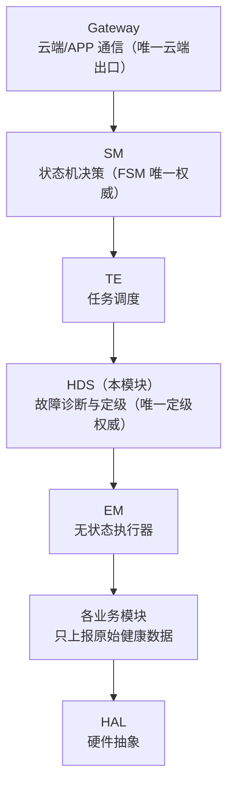
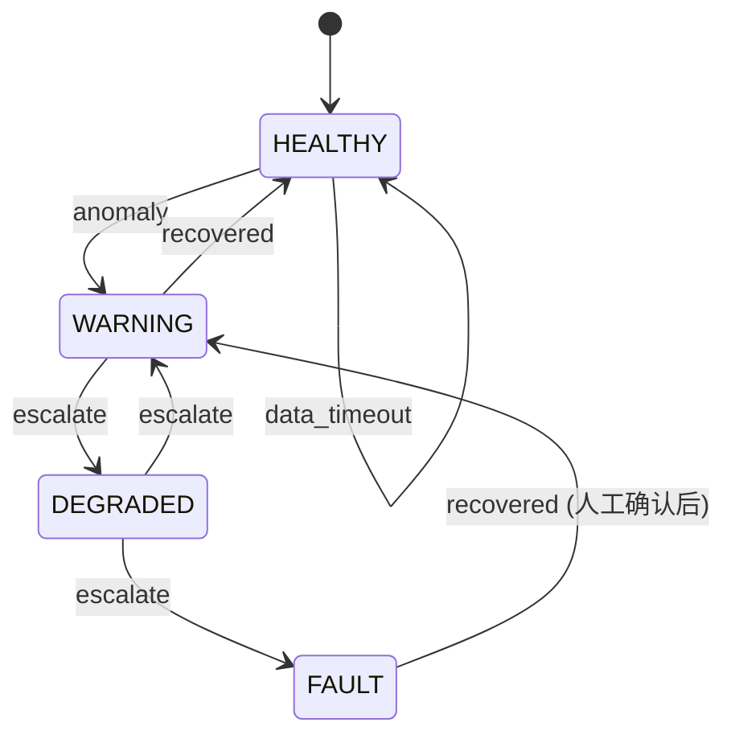
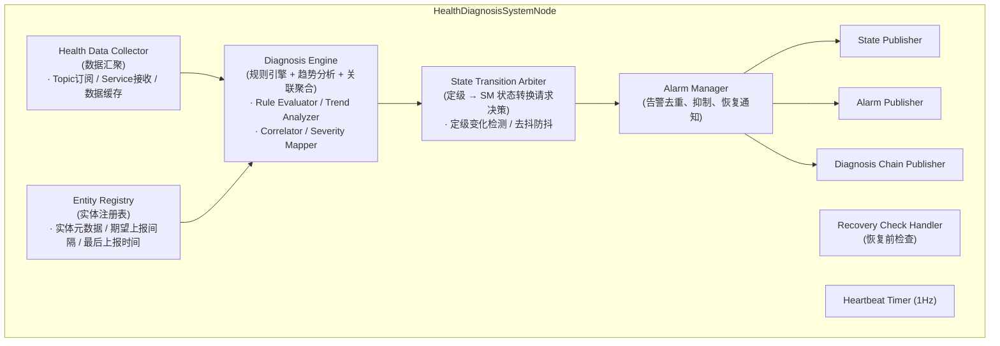
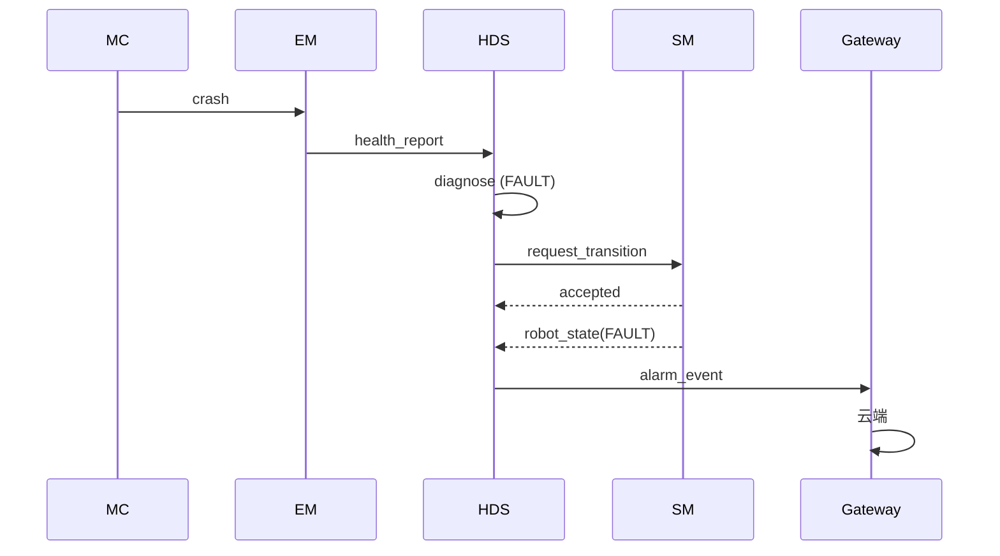

# Health Diagnosis System 模块设计

## 1. 模块概述与定位

**模块名称**：Health Diagnosis System（HDS）

**定位**：HDS 是端侧软件系统中的**故障诊断与定级权威**，位于中间件层。它汇聚全系统各模块上报的原始健康数据，执行多维诊断分析，做出故障定级决策，并通过 SM 接口请求相应的状态转换。HDS 是系统中**唯一有权决定故障等级**的模块，其他任何模块只上报原始数据，不做业务级故障判断。

**核心职责**：

1. **健康数据汇聚**：接收并缓存来自 EM（进程状态）、各模块（心跳/自定义诊断）、SM（状态转换历史）的原始健康数据
2. **多维诊断分析**：对采集数据进行规则匹配、趋势分析、关联聚合，识别异常模式
3. **故障定级决策**：将诊断结果定级为 `HEALTHY` / `WARNING` / `DEGRADED` / `FAULT`，并决定是否请求 SM 状态转换
4. **告警管理**：向 Gateway 上报故障告警信息，支持告警去重、抑制、恢复通知
5. **恢复前检查**：响应 SM 的 `AcknowledgeFault` / `ReleaseEStop` 恢复前检查请求，评估系统是否具备恢复条件
6. **诊断日志持久化**：记录完整诊断链路和定级决策依据，供事后追溯

**与相邻模块的边界**：

| 边界 | HDS 负责 | 对方负责 |
|------|---------|---------|
| HDS ↔ SM | 请求状态转换（DEGRADED/FAULT）；响应恢复前检查 | 全局状态机决策与仲裁；执行状态转换 |
| HDS ↔ EM | 接收进程状态、恢复动作记录；接收 L3/L4 建议 | 进程生命周期治理；L1/L2 自主恢复执行 |
| HDS ↔ Gateway | 上报故障告警、定级结果 | 云端/APP 通信；告警展示与人工确认转发 |
| HDS ↔ 各模块 | 接收各模块原始健康数据 | 业务逻辑；只上报原始数据不做定级 |

---

## 2. 职责边界

HDS 在端侧架构中的位置：



| 层次 | 模块 | 职责范围 |
|------|------|---------|
| 状态决策层 | SM | 全局状态机，执行状态转换仲裁 |
| **故障定级层** | **HDS** | **多维诊断分析，故障定级决策** |
| 进程治理层 | EM | 进程监控、L1/L2 恢复执行 |
| 数据上报层 | 各业务模块 | 心跳、传感器状态、资源使用等原始数据 |

**HDS 不做的事情**（红线）：

- **不直接修改 SM 状态** — 通过 `/sm/request_transition` Service 请求转换，由 SM 仲裁后执行
- **不直接控制运动** — 不下发任何关节/运动指令
- **不启停进程** — 进程控制由 EM 负责
- **不直连云端** — 告警通过 Gateway 转发
- **不做业务决策** — 不决定任务如何执行、不决定进程编排策略

---

## 3. 状态机设计

### 3.1 诊断状态枚举

HDS 维护每个被监控实体（模块/进程/硬件）的**诊断状态**（DiagnosisState），与 SM 的机器人全局状态解耦：

| 状态 | 值 | 说明 |
|------|-----|------|
| `HEALTHY` | 0 | 健康，无异常 |
| `WARNING` | 1 | 警告，存在轻微异常但可继续运行 |
| `DEGRADED` | 2 | 降级，功能受限但仍可控 |
| `FAULT` | 3 | 严重故障，需人工介入 |
| `UNKNOWN` | 4 | 数据缺失，无法判定 |

### 3.2 诊断状态流转



### 3.3 状态转换规则

| 当前状态 | 目标状态 | 触发条件 | 自动/人工 |
|----------|----------|----------|-----------|
| `HEALTHY` | `WARNING` | 规则引擎检测到轻微异常 | 自动 |
| `WARNING` | `HEALTHY` | 异常指标恢复正常，持续 3 个周期 | 自动 |
| `WARNING` | `DEGRADED` | 异常升级，或多维度异常叠加 | 自动 |
| `DEGRADED` | `HEALTHY` | 全部异常恢复，持续 5 个周期 | 自动 |
| `DEGRADED` | `FAULT` | 安全关键异常（如运动控制失联、急停硬件故障） | 自动 |
| `FAULT` | `HEALTHY` | 人工确认（AcknowledgeFault）+ 恢复前检查通过 | 人工 |
| 任意 | `UNKNOWN` | 超过 `data_timeout` 未收到该实体健康数据 | 自动 |
| `UNKNOWN` | `HEALTHY` | 数据恢复且指标正常 | 自动 |

### 3.4 定级 → SM 状态映射

| HDS 定级结果 | 当前 SM 状态 | 建议 SM 转换 | priority | 说明 |
|-------------|-------------|-------------|----------|------|
| `DEGRADED` | `ACTIVE_IDLE` / `ACTIVE_BUSY` / `STANDBY` | `→ DEGRADED` | 80 | 非关键模块故障 |
| `FAULT` | `ACTIVE_IDLE` / `ACTIVE_BUSY` | `→ FAULT` | 80 | 关键模块故障 |
| `FAULT` | `BOOTING` | `→ FAULT` | 80 | 启动阶段关键故障 |
| `HEALTHY` | `DEGRADED` | `→ STANDBY` | 60 | 故障恢复（需 SM 确认） |

> **注意**：HDS 只负责**建议**和**定级**，SM 是状态转换的唯一仲裁者。SM 可能拒绝 HDS 的请求（如当前正在执行更高优先级的 E-Stop）。

---

## 4. ROS2 接口定义

### 4.1 消息定义（msg）

```
# hds_msgs/msg/DiagnosisState.msg
# 诊断状态枚举

uint8 HEALTHY    = 0
uint8 WARNING    = 1
uint8 DEGRADED   = 2
uint8 FAULT      = 3
uint8 UNKNOWN    = 4

uint8 state                        # 当前诊断状态
string entity_id                   # 被监控实体 ID（如 "mc_node", "ethercat_bus"）
string entity_type                 # 实体类型：module | process | hardware | sensor
string entity_name                 # 实体可读名称
builtin_interfaces/Time timestamp  # 状态判定时间戳
string reason                      # 状态判定原因摘要
uint32 rule_id                     # 触发的规则 ID
float32 confidence                 # 诊断置信度 [0.0, 1.0]
```

```
# hds_msgs/msg/HealthReport.msg
# 各模块上报的原始健康数据

string reporter_node               # 上报节点名称
builtin_interfaces/Time timestamp  # 上报时间戳
string entity_id                   # 被监控实体 ID
string entity_type                 # 实体类型

# 健康指标列表
HealthMetric[] metrics

# 可选：模块自定义诊断信息
string custom_diagnosis            # JSON 格式的自定义诊断数据
```

```
# hds_msgs/msg/HealthMetric.msg
# 单个健康指标

string name                        # 指标名称（如 "cpu_percent", "memory_mb", "heartbeat_latency_ms"）
float64 value                      # 指标值
string unit                        # 单位
uint8 severity                     # 指标严重程度：0=info, 1=warning, 2=critical
string threshold_info              # 阈值说明（如 "> 90% for 10s"）
```

```
# hds_msgs/msg/AlarmEvent.msg
# 告警事件

uint8 ALARM_RAISED    = 0
uint8 ALARM_CLEARED   = 1
uint8 ALARM_UPDATED   = 2

uint8 event_type                   # 告警事件类型
string alarm_id                    # 告警唯一 ID（去重用）
uint8 diagnosis_state              # 关联的诊断状态
string entity_id                   # 关联实体 ID
string summary                     # 告警摘要
string detail                      # 告警详细信息
builtin_interfaces/Time timestamp  # 事件时间戳
string[] affected_modules          # 受影响的模块列表
```

```
# hds_msgs/msg/DiagnosisChain.msg
# 诊断链路记录（用于追溯定级决策依据）

string chain_id                    # 链路唯一 ID
builtin_interfaces/Time start_time # 诊断开始时间
builtin_interfaces/Time end_time   # 诊断结束时间
string entity_id                   # 被诊断实体
uint8 final_state                  # 最终诊断状态

# 诊断步骤
DiagnosisStep[] steps
```

```
# hds_msgs/msg/DiagnosisStep.msg
# 单个诊断步骤

uint8 step_index                   # 步骤序号
string step_name                   # 步骤名称
string input_data                  # 输入数据摘要
string rule_description            # 应用的规则描述
bool triggered                     # 是否触发
string output                      # 输出结果
builtin_interfaces/Time timestamp  # 执行时间戳
```

```
# hds_msgs/msg/Heartbeat.msg
# HDS 模块心跳（原名 HdsHeartbeat.msg，应改为 Heartbeat.msg）

builtin_interfaces/Time stamp
string node_name                   # 节点名称（固定 "health_diagnosis_system"）
uint8 state                        # 当前诊断引擎状态
bool healthy                       # 诊断引擎是否健康
string status_message              # 状态描述
uint32 monitored_entities          # 当前监控实体数量
uint32 active_alarms               # 当前活跃告警数量
```

```
# hds_msgs/msg/ErrorCode.msg
# HDS 模块错误码（原名 HdsErrorCode.msg，应改为 ErrorCode.msg）

uint16 OK                           = 0
uint16 ERR_HDS_INVALID_ENTITY           = 2001   # 未知监控实体
uint16 ERR_HDS_DIAGNOSIS_TIMEOUT        = 2002   # 诊断处理超时
uint16 ERR_HDS_SM_REQUEST_FAILED        = 2003   # 向 SM 请求状态转换失败
uint16 ERR_HDS_RECOVERY_CHECK_FAILED    = 2004   # 恢复前检查未通过
uint16 ERR_HDS_DATA_STALE               = 2005   # 数据过旧，诊断不可靠
uint16 ERR_HDS_RULE_ENGINE_ERROR        = 2006   # 规则引擎内部错误
uint16 ERR_HDS_ENTITY_NOT_FOUND         = 2007   # 查询的实体不存在

uint16 error_code                   # 错误码
string message                      # 可读错误描述
```

### 4.2 服务定义（srv）

```
# hds_msgs/srv/QueryDiagnosis.srv
# 查询指定实体的诊断状态

# Request
string entity_id                     # 实体 ID（空字符串表示查询全局汇总）
---
# Response
bool found                           # 是否找到该实体
DiagnosisState diagnosis             # 诊断状态
HealthMetric[] latest_metrics        # 最新健康指标
builtin_interfaces/Time last_update  # 最后更新时间
uint16 error_code                    # 错误码
```

```
# hds_msgs/srv/ReportHealth.srv
# 各模块向 HDS 上报健康数据（可选 Service 方式，也可用 Topic）

# Request
HealthReport report                  # 健康报告
---
# Response
bool accepted                        # 是否被接受
uint16 error_code                    # 错误码
string message                       # 结果描述
```

```
# hds_msgs/srv/RecoveryCheck.srv
# SM 调用：恢复前检查（AcknowledgeFault / ReleaseEStop 前）

# Request
uint8 target_state                   # 目标恢复状态（STANDBY / ACTIVE_IDLE）
string operator_id                   # 操作者 ID
---
# Response
bool success
string message
bool allowed                         # 是否允许恢复
uint16 error_code                    # 不允许时的错误码
DiagnosisState[] failing_entities    # 仍未恢复的实体列表
```

```
# hds_msgs/srv/GetSystemHealth.srv
# 查询全系统健康汇总

# Request（空）
---
# Response
uint8 overall_state                  # 全局诊断状态（取所有实体中最严重的）
DiagnosisState[] entity_diagnoses    # 各实体诊断状态列表
uint32 healthy_count                 # 健康实体数量
uint32 warning_count                 # 警告实体数量
uint32 degraded_count                # 降级实体数量
uint32 fault_count                   # 故障实体数量
uint32 unknown_count                 # 未知实体数量
```

```
# hds_msgs/srv/RegisterHealthEntity.srv
# 模块注册为被监控实体

# Request
string entity_id                     # 实体唯一 ID
string entity_type                   # 实体类型
string entity_name                   # 实体可读名称
builtin_interfaces/Duration expected_report_interval  # 期望上报间隔
---
# Response
bool accepted                        # 是否注册成功
uint16 error_code                    # 错误码
```

### 4.3 接口汇总表

#### Topics

| 名称 | 类型 | 方向 | QoS | 频率 | 说明 |
|------|------|------|-----|------|------|
| `/hds/health_report` | `hds_msgs/msg/HealthReport` | ALL → HDS | Reliable + Volatile + Depth 100 | 各模块自定义 | 原始健康数据上报（推荐方式） |
| `/hds/diagnosis_state` | `hds_msgs/msg/DiagnosisState` | HDS → ALL | Reliable + Transient Local + Depth 50 | 事件驱动（状态变更时） | 诊断状态广播 |
| `/hds/alarm_event` | `hds_msgs/msg/AlarmEvent` | HDS → Gateway | Reliable + Volatile + Depth 100 | 事件驱动 | 告警事件 |
| `/hds/diagnosis_chain` | `hds_msgs/msg/DiagnosisChain` | HDS → DR | Reliable + Volatile + Depth 100 | 事件驱动 | 诊断链路记录 |
| `/hds/heartbeat` | `hds_msgs/msg/Heartbeat` | HDS → ALL | Reliable + Volatile + Depth 1 | 1 Hz | HDS 心跳 |

#### Services

| 名称 | 类型 | 调用方 | 说明 |
|------|------|--------|------|
| `/hds/query_diagnosis` | `hds_msgs/srv/QueryDiagnosis` | 任意模块 | 查询指定实体诊断状态 |
| `/hds/report_health` | `hds_msgs/srv/ReportHealth` | 任意模块 | Service 方式上报健康数据 |
| `/hds/recovery_check` | `hds_msgs/srv/RecoveryCheck` | SM | 恢复前检查 |
| `/hds/get_system_health` | `hds_msgs/srv/GetSystemHealth` | Gateway / 调试工具 | 全系统健康汇总 |
| `/hds/register_entity` | `hds_msgs/srv/RegisterHealthEntity` | 各模块启动时 | 注册被监控实体 |

---

## 5. 内部设计

### 5.1 节点架构



### 5.2 关键组件说明

#### 5.2.1 Health Data Collector

- 订阅 `/hds/health_report` Topic，缓存最近 N 条报告
- 提供 `/hds/report_health` Service 接收同步上报
- 数据超时检测：超过 `expected_report_interval * timeout_multiplier` 未收到数据，标记为 `UNKNOWN`
- 数据存储：内存环形缓冲区，按 entity_id 分桶

#### 5.2.2 Diagnosis Engine

**Rule Evaluator**：基于配置的诊断规则进行匹配

| 规则类型 | 说明 | 示例 |
|---------|------|------|
| 阈值规则 | 单指标超过阈值 | `cpu_percent > 90% for 10s` |
| 时序规则 | 指标变化趋势 | `memory_growth_rate > 10MB/s for 30s` |
| 心跳规则 | 心跳超时 | `heartbeat_missing > 3 cycles` |
| 组合规则 | 多指标同时异常 | `cpu > 80% AND memory > 80%` |
| 关联规则 | 多实体关联异常 | `ethercat_bus_fault AND mc_node_exit` |

**Trend Analyzer**：
- 滑动窗口（默认 60s）计算指标均值、方差、变化率
- 检测异常模式：突增、突降、周期性异常、持续偏离

**Severity Mapper**：
- 根据规则触发结果映射到诊断状态
- 支持规则优先级覆盖（高优先级规则可直接定级为 FAULT）

#### 5.2.3 State Transition Arbiter

- 监听诊断状态变化
- 应用去抖策略：
  - `WARNING` → `DEGRADED`：需持续 2 个诊断周期（默认 5s）
  - `DEGRADED` → `FAULT`：需持续 1 个诊断周期（立即升级）
  - `FAULT` → `DEGRADED`：**不允许自动降级**，需人工确认
- 决定是否向 SM 请求状态转换：
  - 只有 `DEGRADED` 或 `FAULT` 定级时才请求转换
  - 请求前检查当前 SM 状态，避免重复请求
  - SM 拒绝时记录日志，N 秒后重试（最多 3 次）

#### 5.2.4 Alarm Manager

- 告警去重：相同 entity_id + 相同 diagnosis_state 不重复生成 alarm_id
- 告警抑制：父级实体已告警时，子级实体告警抑制（如 EM 已报 ethercat_fault，则不报 ethercat 下属 sensor 的告警）
- 告警恢复：状态恢复为 HEALTHY 时，发送 `ALARM_CLEARED` 事件
- 告警升级：同一告警持续未恢复，按配置周期（如 5min/15min/30min）发送升级通知

### 5.3 关键流程

#### 5.3.1 健康数据采集与诊断流程

```
业务模块（如 MC）
  → 周期上报 /hds/health_report
    → HDS Health Data Collector 接收并缓存
      → Diagnosis Engine 执行规则评估
        → Rule Evaluator 匹配阈值/时序/组合规则
        → Severity Mapper 映射到诊断状态
          → 状态变化？
            → 是：State Transition Arbiter 决策
              → 需请求 SM 转换？
                → 是：调用 /sm/request_transition (priority=80)
                → 否：仅发布 /hds/diagnosis_state
            → 否：更新内部状态，无输出
```

#### 5.3.2 EM L3/L4 故障上报与定级流程

```
EM 检测到 L3/L4 级异常（如 hal_ethercat 崩溃超上限）
  → EM 上报 /hds/health_report (entity="em", severity=critical)
    → HDS Diagnosis Engine 评估
      → 关联规则触发：ethercat_bus_fault + mc_node_exit
        → Severity Mapper 定级为 FAULT
          → State Transition Arbiter 决策
            → 当前 SM 状态为 ACTIVE_IDLE / ACTIVE_BUSY
              → 调用 /sm/request_transition (target=FAULT, priority=80)
                → SM 接受 → 状态转为 FAULT
                  → HDS 收到 /sm/robot_state (FAULT)
                    → Alarm Manager 生成告警
                      → 发布 /hds/alarm_event
                        → Gateway 接收并上报云端
```

#### 5.3.3 恢复前检查流程

```
SM 收到 AcknowledgeFault / ReleaseEStop 请求
  → SM 调用 /hds/recovery_check (target_state=STANDBY/ACTIVE_IDLE)
    → HDS Recovery Check Handler
      → 检查所有关键实体（P0/P1 模块、EM 核心进程、SM 自身）
        → 任一实体为 FAULT / UNKNOWN？
          → 是：返回 allowed=false, ERR_RECOVERY_CHECK_FAILED
            → 附带 failing_entities 列表
          → 否：返回 allowed=true
    → SM 收到 allowed=true
      → 执行 FAULT → STANDBY / ACTIVE_E_STOP → ACTIVE_IDLE 转换
```

#### 5.3.4 数据超时检测流程

```
Entity Registry 定时扫描（1Hz）
  → 检查每个实体的 last_report_time
    → 当前时间 - last_report_time > expected_interval * timeout_multiplier
      → 标记该实体为 UNKNOWN
        → 发布 /hds/diagnosis_state (UNKNOWN)
          → 若该实体为关键实体（P0/P1）
            → 定级为 FAULT（数据缺失 = 无法确认安全）
              → 请求 SM 状态转换
```

---

## 6. 与其他模块的交互

### 6.1 交互矩阵

| 模块 | 方向 | 接口 | 说明 |
|------|------|------|------|
| SM | HDS → SM | `/sm/request_transition` (Service) | HDS 请求降级/故障状态转换，priority=80 |
| SM | SM → HDS | `/hds/recovery_check` (Service) | SM 恢复前检查 |
| SM | SM → HDS | `/sm/robot_state` (Topic) | HDS 订阅状态用于定级决策参考 |
| EM | EM → HDS | `/hds/health_report` (Topic) | EM 上报进程状态、恢复动作记录 |
| EM | EM → HDS | MQTT `em/event/l3_l4_suggestion` | EM L3/L4 故障建议上报 |
| Gateway | HDS → Gateway | `/hds/alarm_event` (Topic) | 故障告警上报云端/APP |
| Gateway | Gateway → HDS | `/hds/get_system_health` (Service) | APP 查询系统健康状态 |
| TE | TE → HDS | `/hds/health_report` (Topic) | 任务执行异常上报 |
| MC | MC → HDS | `/hds/health_report` (Topic) | 运动控制健康数据 |
| MS | MS → HDS | `/hds/health_report` (Topic) | 运动流健康数据 |
| MP | MP → HDS | `/hds/health_report` (Topic) | 动作播放健康数据 |
| PnC | PnC → HDS | `/hds/health_report` (Topic) | 导航规划健康数据 |
| Perception | Perception → HDS | `/hds/health_report` (Topic) | 感知融合健康数据 |
| DR | HDS → DR | `/hds/diagnosis_chain` (Topic) | 诊断链路记录用于回放分析 |
| 任意模块 | 任意 → HDS | `/hds/register_entity` (Service) | 启动时注册为被监控实体 |

### 6.2 关键交互时序

#### 故障检测与定级时序



---

## 7. 关键参数与配置

```yaml
# hds/config/hds_params.yaml

health_diagnosis_system:
  ros__parameters:
    # 诊断引擎周期（Hz）
    diagnosis_rate_hz: 1.0

    # 数据超时倍数：expected_interval * multiplier = 超时阈值
    data_timeout_multiplier: 3.0

    # 状态转换去抖周期数
    warning_to_degraded_cycles: 2      # WARNING → DEGRADED 需持续周期数
    degraded_to_fault_cycles: 1        # DEGRADED → FAULT 需持续周期数
    recovery_confirmation_cycles: 5    # 恢复确认需持续 HEALTHY 周期数

    # 趋势分析滑动窗口（秒）
    trend_window_sec: 60.0

    # 告警管理
    alarm_suppression_enabled: true
    alarm_escalation_intervals_sec: [300, 900, 1800]  # 5min, 15min, 30min
    max_alarms_retained: 1000

    # SM 请求重试
    sm_request_retry_count: 3
    sm_request_retry_interval_sec: 5.0

    # 诊断日志
    diagnosis_history_size: 500
    verbose_diagnosis_log: true

    # 关键实体列表（数据超时直接定级为 FAULT）
    critical_entities:
      - "em"
      - "sm"
      - "mc"
      - "hal_ethercat"

    # 规则配置文件路径
    rule_config_path: "config/hds_rules.yaml"
```

```yaml
# hds/config/hds_rules.yaml

# 诊断规则配置示例
diagnosis_rules:
  - rule_id: 1001
    name: "mc_heartbeat_timeout"
    entity_id: "mc"
    entity_type: "module"
    condition:
      type: "heartbeat_timeout"
      threshold_cycles: 3
    severity: "FAULT"
    description: "运动控制模块心跳超时"

  - rule_id: 1002
    name: "cpu_high_usage"
    entity_id: "*"
    entity_type: "module"
    condition:
      type: "threshold"
      metric: "cpu_percent"
      operator: ">"
      value: 90.0
      duration_sec: 10.0
    severity: "WARNING"
    description: "CPU 使用率超过 90% 持续 10 秒"

  - rule_id: 1003
    name: "ethercat_bus_fault"
    entity_id: "hal_ethercat"
    entity_type: "hardware"
    condition:
      type: "threshold"
      metric: "bus_error_count"
      operator: ">"
      value: 0
    severity: "FAULT"
    description: "EtherCAT 总线错误"

  - rule_id: 1004
    name: "memory_leak"
    entity_id: "*"
    entity_type: "module"
    condition:
      type: "trend"
      metric: "memory_mb"
      operator: "growth_rate >"
      value: 10.0
      duration_sec: 30.0
    severity: "DEGRADED"
    description: "内存泄漏：30 秒内增长超过 10MB/s"

  - rule_id: 1005
    name: "em_critical_process_crash"
    entity_id: "em"
    entity_type: "module"
    condition:
      type: "custom"
      expression: "l3_or_l4_event AND process_priority == 'P0'"
    severity: "FAULT"
    description: "EM 报告 P0 级进程 L3/L4 故障"
```

---

## 8. 错误码定义

| 错误码 | 常量名 | 说明 |
|--------|--------|------|
| 0 | `OK` | 成功 |
| 2001 | `ERR_HDS_INVALID_ENTITY` | 未知监控实体 |
| 2002 | `ERR_HDS_DIAGNOSIS_TIMEOUT` | 诊断处理超时 |
| 2003 | `ERR_HDS_SM_REQUEST_FAILED` | 向 SM 请求状态转换失败 |
| 2004 | `ERR_HDS_RECOVERY_CHECK_FAILED` | 恢复前检查未通过 |
| 2005 | `ERR_HDS_DATA_STALE` | 数据过旧，诊断不可靠 |
| 2006 | `ERR_HDS_RULE_ENGINE_ERROR` | 规则引擎内部错误 |
| 2007 | `ERR_HDS_ENTITY_NOT_FOUND` | 查询的实体不存在 |

---

## 9. 安全约束

### 9.1 故障定级权威

- HDS 是系统中**唯一有权决定故障等级**的模块
- 任何其他模块（包括 EM）只上报原始数据，不得自行定级为 DEGRADED/FAULT 并请求 SM 状态转换
- EM 的 L3/L4 建议仅作为输入参考，最终定级由 HDS 决策

### 9.2 状态转换安全

- HDS 通过 `/sm/request_transition` 请求状态转换，**不直接修改 SM 状态**
- SM 拒绝时（如当前正在执行更高优先级的 E-Stop），HDS 必须尊重 SM 的仲裁结果
- FAULT 定级后不允许自动降级为 DEGRADED/HEALTHY，必须通过人工确认（AcknowledgeFault）

### 9.3 数据缺失 = 不安全

- 关键实体（P0/P1 模块、EM、SM、MC、hal_ethercat）数据超时，默认定级为 FAULT
- 非关键实体数据超时，定级为 UNKNOWN，不自动请求 SM 状态转换
- 数据超时后的首次恢复数据不立即信任，需连续 3 个周期正常才恢复为 HEALTHY

### 9.4 恢复前检查

- `/hds/recovery_check` 必须检查所有关键实体的当前状态
- 任一关键实体为 FAULT/UNKNOWN 时，返回 `allowed=false`
- 恢复前检查必须在 2 秒内完成，超时视为检查失败

### 9.5 诊断引擎自身健康

- HDS 定期自检：规则引擎是否正常、数据缓冲区是否溢出、SM 连接是否可用
- HDS 自身故障时，通过 `/hds/heartbeat` 的 `diagnosis_engine_healthy=false` 广播
- EM 检测到 HDS 心跳超时，按 HDS 进程故障处理（L1/L2 重启，L3 上报给……自身不可用时的备用方案：EM 直接请求 SM 进入 DEGRADED）

---

## 10. 包结构

```
hds_msgs/
    msg/
        DiagnosisState.msg          # 诊断状态
        HealthReport.msg            # 健康报告
        HealthMetric.msg            # 健康指标
        AlarmEvent.msg              # 告警事件
        DiagnosisChain.msg          # 诊断链路
        DiagnosisStep.msg           # 诊断步骤
        Heartbeat.msg               # HDS 心跳（原名 HdsHeartbeat.msg）
        ErrorCode.msg               # 错误码（原名 HdsErrorCode.msg）
    srv/
        QueryDiagnosis.srv          # 查询诊断状态
        ReportHealth.srv            # 上报健康数据
        RecoveryCheck.srv           # 恢复前检查
        GetSystemHealth.srv         # 全系统健康查询
        RegisterHealthEntity.srv    # 注册监控实体
    CMakeLists.txt
    package.xml

hds/
    include/hds/
        health_diagnosis_node.hpp   # 主节点类
        health_data_collector.hpp   # 健康数据汇聚器
        entity_registry.hpp         # 实体注册表
        diagnosis_engine.hpp        # 诊断引擎
        rule_evaluator.hpp          # 规则评估器
        trend_analyzer.hpp          # 趋势分析器
        severity_mapper.hpp         # 严重度映射器
        state_transition_arbiter.hpp # 状态转换仲裁器
        alarm_manager.hpp           # 告警管理器
        recovery_check_handler.hpp  # 恢复前检查处理器
    src/
        health_diagnosis_node.cpp
        health_data_collector.cpp
        entity_registry.cpp
        diagnosis_engine.cpp
        rule_evaluator.cpp
        trend_analyzer.cpp
        severity_mapper.cpp
        state_transition_arbiter.cpp
        alarm_manager.cpp
        recovery_check_handler.cpp
    test/
        test_rule_evaluator.cpp     # 规则引擎单元测试
        test_diagnosis_engine.cpp   # 诊断引擎测试
        test_alarm_manager.cpp      # 告警管理器测试
        test_recovery_check.cpp     # 恢复前检查测试
        test_integration.cpp        # 集成测试（HDS-SM 交互）
    config/
        hds_params.yaml             # 参数配置
        hds_rules.yaml              # 诊断规则配置
    launch/
        hds.launch.py               # Launch 文件
    CMakeLists.txt
    package.xml
```

---

## 11. 关键性能指标（KPI）

| 指标 | 目标值 |
|------|--------|
| 健康数据采集延迟 | < 100ms（Topic 接收 → 入缓存） |
| 单实体诊断处理延迟 | < 50ms |
| 全系统诊断周期 | < 1s（1Hz） |
| 定级到 SM 请求发出延迟 | < 200ms |
| 恢复前检查响应延迟 | < 2s |
| 告警生成延迟（状态变更 → 告警发出） | < 500ms |
| HDS 心跳抖动 | < 50ms |
| HDS 自身 CPU 占用 | < 1% |
| HDS 自身内存占用 | < 100MB |
| 数据缓存容量 | 支持 1000 个实体 × 1000 条历史记录 |

---

## 12. 设计审查报告

**审查日期**：2026-04-29
**审查模块**：Health Diagnosis System（HDS）
**总体判决**：APPROVED_WITH_CONDITIONS

### 12.1 安全审查结果

**判决**：APPROVED_WITH_CONDITIONS

| 约束项 | 状态 | 说明 |
|--------|------|------|
| HDS 是唯一故障定级权威 | 已落实 | 设计明确，与 EM v2 一致 |
| HDS 不直接修改 SM 状态 | 已落实 | 通过 `/sm/request_transition` 请求 |
| HDS 不直接控制运动 | 已落实 | 设计红线明确 |
| HDS 不启停进程 | 已落实 | EM 负责进程控制 |
| HDS 不直连云端 | 已落实 | 通过 Gateway 转发 |
| FAULT 不可自动恢复 | 已落实 | FAULT → 任意状态需人工确认 |
| 数据缺失 = 不安全 | 已落实 | 关键实体超时定级 FAULT |
| 恢复前检查严格 | 已落实 | 任一关键实体异常即拒绝 |

**条件通过项**（必须在实现阶段修复）：

#### [1] E-Stop 触发路径不完整 — HDS 缺少直接触发急停的接口

**问题**：HDS 定级为 FAULT 时通过 `/sm/request_transition` (priority=80) 请求进入 FAULT 状态。但对于安全关键异常（如运动控制失联、急停硬件故障），HDS 应当能够直接触发 E-Stop（priority=100）。

**修复建议**：
- 在 `State Transition Arbiter` 中增加规则：安全关键异常触发时，调用 `/sm/trigger_estop` (priority=100)
- 在 `hds_rules.yaml` 中增加 `trigger_estop` 标志字段

#### [2] HDS 自身故障的备用方案与 EM v2 红线冲突

**问题**：9.5 节提到"EM 直接请求 SM 进入 DEGRADED"，与 EM v2 "EM 不做故障定级、不直接请求 SM 状态转换"冲突。

**修复建议**：
- 删除该表述
- HDS 故障时：EM 上报 L3 建议给 HDS Slave，或 SM 内部检测到 HDS 心跳超时后自主决定保守行为

#### [3] 告警抑制可能导致关键告警丢失

**问题**：父级实体已告警时子级告警被抑制，若父级配置错误可能丢失关键安全告警。

**修复建议**：
- 安全关键告警（severity=FAULT 且涉及运动安全）不受抑制
- 被抑制的告警仍记录到 `/hds/diagnosis_chain`

#### [4] SM 请求重试缺乏指数退避

**问题**：`sm_request_retry_interval_sec: 5.0` 为固定间隔，E-Stop 期间可能持续冲击 SM。

**修复建议**：
- 重试间隔改为指数退避：5s → 10s → 20s
- 对 `ERR_ESTOP_ACTIVE` 拒绝延长重试间隔

### 12.2 架构审查结果

**判决**：APPROVED_WITH_CONDITIONS

**Critical 问题**（必须修订后才能实现）：

#### [C1] 恢复前检查职责冲突

**问题**：HDS 的 `RecoveryCheck` 检查"所有关键实体（P0/P1 模块、EM 核心进程、SM 自身）"，但 EM 进程状态应由 SM 直接调用 EM 检查。形成 SM → HDS → (检查 EM) 的间接循环。

**修复建议**：
- HDS 的 `RecoveryCheck` **只检查 HDS 自身管辖范围内的实体**（各模块上报的健康数据、诊断状态）
- **不检查 EM 进程状态** — EM 进程状态由 SM 直接调用 EM 的 `GetProcessStatus` 检查
- 明确分工：SM 恢复前检查 = EM 进程检查 + HDS 健康检查 + SM 自身状态校验

#### [C2] HDS 自身故障备用方案违反架构原则

**问题**：同安全审查 [2]，EM 在 HDS 不可用时不得擅自定级。

**修复建议**：
- 删除 EM 直接请求 SM 的描述
- 明确 HDS 高可用设计：HDS Master + HDS Slave 热备，或 SM 对 HDS 心跳超时的默认保守行为

**High 问题**（实现前需解决）：

| # | 问题 | 修复建议 |
|---|------|---------|
| H1 | MQTT Topic 名称与 EM v2 不一致：`em/event/l3_l4_suggestion` vs `em/event/l3_suggestion` + `em/event/l4_suggestion` | 拆分或订阅通配符，文档对齐 |
| H2 | `/hds/diagnosis_state` QoS 不当：`Transient Local + Depth 50` 可能丢失实体中间状态 | 改为 `Volatile + Depth 1`，新订阅者通过 `QueryDiagnosis` Service 查询 |
| H3 | HDS 向 SM 请求优先级与 SM 设计不一致：FAULT 和 DEGRADED 同为 80 | FAULT=85, DEGRADED=75，与 SM 文档同步 |
| H4 | `RegisterHealthEntity` 时序缺陷：HDS 后启动时模块注册失败 | 模块周期性重试注册，或 HDS 广播 `/hds/ready` |

**Medium/Low 问题**：

| # | 问题 | 级别 | 修复建议 |
|---|------|------|---------|
| M1 | `ErrorCode.msg` 已统一命名（原名 HdsErrorCode.msg） | Medium | 已修复，保留统一风格 |
| M2 | `/hds/health_report` QoS `Reliable + Depth 100` 可能反压 Publisher | Medium | 改为 `Best Effort + Depth 10` |
| M3 | `custom_diagnosis` 为自由 JSON，无 schema | Medium | 定义 `KeyValue[]` 替代或增加 schema 校验 |
| M4 | `AlarmEvent` 缺少告警级别字段 | Medium | 增加 `uint8 alarm_priority` |
| L1 | 第 11 节 KPI 超出标准 10 节结构 | Low | 合并到第 1 节或第 7 节 |
| L2 | `builtin_interfaces/Duration` 使用不一致 | Low | 全系统统一时间类型 |

### 12.3 综合建议（按优先级排序）

1. **【Critical】修订恢复前检查职责**：HDS 不检查 EM 进程状态，只检查自身管辖的健康数据
2. **【Critical】重写 HDS 自身故障备用方案**：EM 不得擅自定级，明确 HDS 高可用或 SM 保守默认行为
3. **【High】补充 E-Stop 触发路径**：安全关键异常直接调用 `/sm/trigger_estop`
4. **【High】对齐 MQTT Topic 名称和 SM 优先级**：与 EM v2 / SM 文档保持一致
5. **【High】修复 `RegisterHealthEntity` 时序**：增加重试或就绪通知机制
6. **【Medium】优化 QoS 设置**：`diagnosis_state` 和 `health_report` 的 QoS 调整
7. **【Medium】统一错误码风格**：已统一为 `ErrorCode.msg`，常量加 `ERR_HDS_` 前缀
8. **【Low】调整文档结构**：KPI 合并到标准 10 节内

### 12.4 审查结论

HDS 设计文档整体架构合理，故障定级权威、状态转换边界、模块权限划分等核心约束均已落实。存在 **2 个 Critical 问题** 需在实现前修订（恢复前检查职责、自身故障备用方案），**4 个 High 问题** 建议同步修复。建议在完成 Critical 修订后，可进入 ROS2 接口生成阶段（`/ros2-interface HDS`）。
