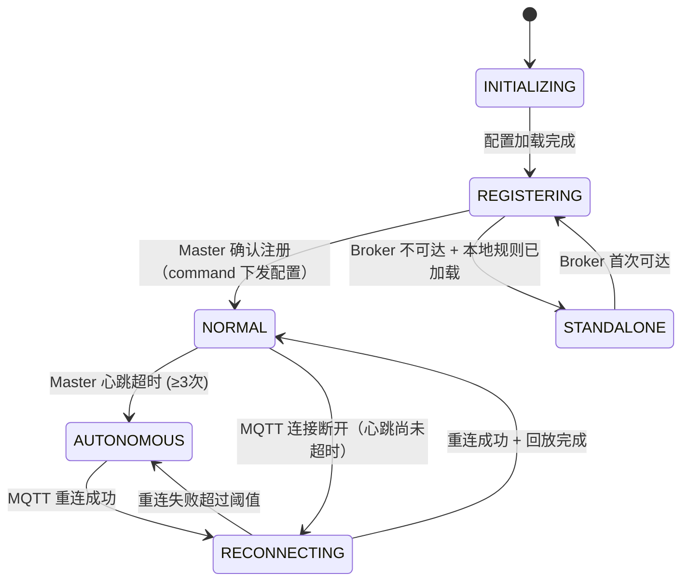
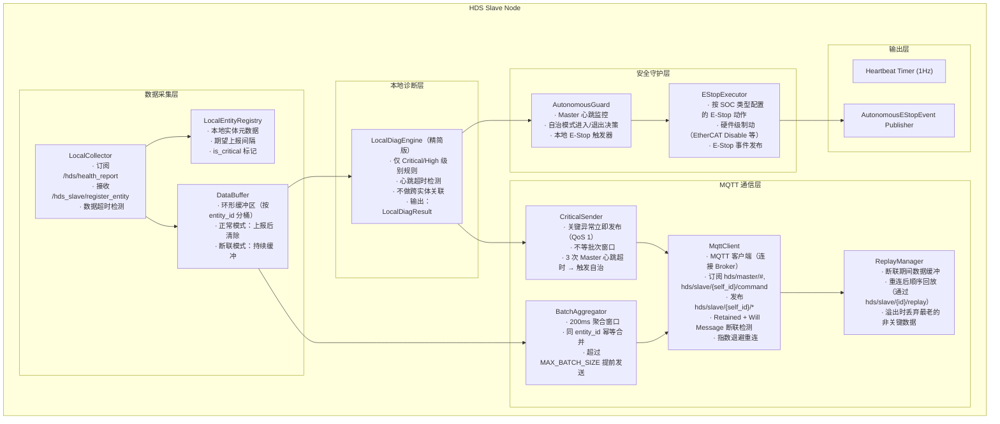
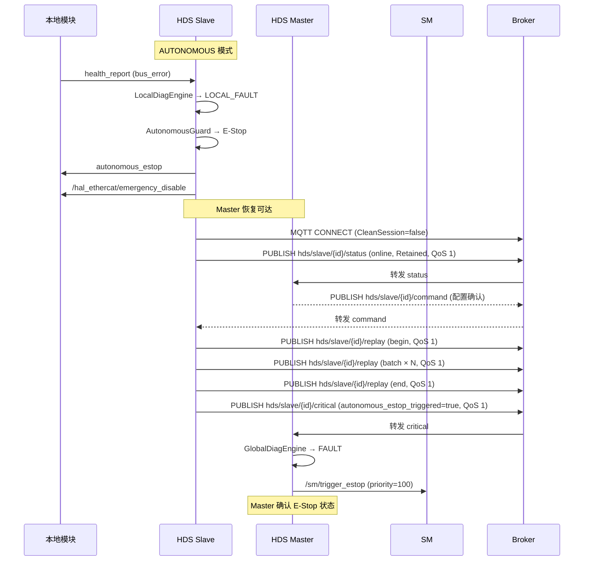

# HDS Slave 模块设计

> **创建日期**：2026-05-27
> **前置文档**：hds_design.md（单 SOC 原始设计）
> **关联文档**：hds_master_design.md（Master 侧设计，含 MQTT 通信协议完整定义）

---

## 1. 模块概述与定位

**模块名称**：HDS Slave（Health Diagnosis System — Slave）

**定位**：HDS Slave 是部署在远端 SOC 上的**轻量级健康数据采集与本地安全守护代理**。它负责采集本 SOC 所有模块的健康数据，通过 MQTT Broker 批量转发给 HDS Master 进行全局定级。当 Master 不可达时，Slave 进入自治模式，独立处理本地安全关键故障。

**核心职责**：

1. **本地健康数据采集**：接收本 SOC 各模块上报的原始健康数据，缓存最近 N 条记录
2. **本地预过滤诊断**：运行精简版诊断引擎，仅评估 Critical/High 级别规则，用于自治模式决策
3. **MQTT Bridge**：通过 MQTT Broker 将健康数据批量上报 Master，接收 Master 的心跳和命令（复用系统现有 MQTT 基础设施）
4. **自治安全守护**（AutonomousGuard）：Master 断联时独立触发本地 E-Stop，保障安全
5. **数据缓冲与回放**：Master 断联期间缓冲健康数据，重连后批量回放

**核心设计约束**：

- Slave **不做全局故障定级** — 全局定级权归 Master
- Slave **不与 SM 直接通信** — 所有 SM 交互经 Master
- Slave **不管理告警** — 告警生命周期归 Master
- Slave **不做跨 SOC 关联分析** — 无跨 SOC 数据视野
- Slave **自治模式仅限安全保护动作** — 只能 E-Stop，不能恢复运动

**适用场景**：

| SOC 类型 | 部署示例 | Slave 管辖模块 | 自治 E-Stop 路径 |
|---------|---------|---------------|-----------------|
| 运动 SOC | SOC-1 | MC, UC, LC, HAL_EtherCAT, MS, MP | EtherCAT 伺服 Disable + 本地制动 |
| 感知 SOC | SOC-2 | Perception, VSLAM, Lidar-SLAM, HAL_Camera, HAL_Lidar | 停发导航路径点 + 感知降级通知 |
| 扩展 SOC | SOC-N | 按需部署的功能模块 | 按 SOC 配置的安全动作 |

> **SOC-0（主控 SOC）不部署 Slave**。SOC-0 的本地模块由 HDS Master 的 LocalCollector 直接采集。

---

## 2. 职责边界

### 2.1 Slave 能做 vs. 不能做

| 动作 | 正常模式 | 自治模式 | 说明 |
|------|---------|---------|------|
| 采集本地健康数据 | ✅ | ✅ | 始终运行 |
| 本地预过滤（Critical/High 规则） | ✅ | ✅ | 始终运行 |
| 批量上报 Master | ✅ | ❌（排队缓冲） | Master 可达时上报 |
| 即时上报 Critical 异常 | ✅ | ❌（触发本地 E-Stop） | Master 可达时即时上报 |
| 触发本地硬件 E-Stop | ❌（由 Master 决策） | ✅ | 自治模式下的安全兜底 |
| 全局故障定级 | ❌ | ❌ | 始终归 Master |
| 请求 SM 状态转换 | ❌ | ❌ | 始终归 Master |
| 管理告警 | ❌ | ❌ | 始终归 Master |
| 恢复运动 | ❌ | ❌ | 必须等 Master 恢复 |
| 更新诊断规则 | ❌（接收 Master 下发） | ❌ | 规则只读 |
| 缓冲数据并回放 | ❌（无需缓冲） | ✅ | 断联期间缓冲 |

### 2.2 Slave 红线

- **不做全局定级** — 本地预过滤仅供 AutonomousGuard 使用，不对外发布
- **不与 SM 通信** — 无 SM 相关的 Topic 订阅或 Service 调用
- **不直连云端** — 不与 Gateway 交互
- **不启停其他进程** — 进程控制由本地 EM 负责
- **自治模式下不尝试恢复运动** — 只能停止运动（E-Stop），恢复必须等 Master

---

## 3. 状态机设计

### 3.1 Slave 运行模式



| 模式 | 值 | 说明 |
|------|-----|------|
| `INITIALIZING` | 0 | 启动中，加载配置和规则 |
| `REGISTERING` | 1 | 向 MQTT Broker 发布 Retained status，等待 Master 确认 |
| `NORMAL` | 2 | 正常运行，MQTT 连接正常，Master 心跳正常 |
| `RECONNECTING` | 3 | MQTT 连接断开但心跳尚未完全超时，尝试重连 |
| `AUTONOMOUS` | 4 | Master 不可达，启用本地安全守护 |
| `STANDALONE` | 5 | Broker 首次不可达（启动时），使用预配置规则独立运行 |

### 3.2 模式转换规则

| 当前模式 | 目标模式 | 触发条件 | 动作 |
|---------|---------|---------|------|
| `INITIALIZING` | `REGISTERING` | 配置/规则加载完成 | 连接 MQTT Broker，发布 Retained status |
| `INITIALIZING` | `STANDALONE` | 配置加载完成但 Broker 地址未配置 | 仅运行本地规则 |
| `REGISTERING` | `NORMAL` | Master 通过 command topic 下发配置确认 | 开始正常上报 |
| `REGISTERING` | `STANDALONE` | Broker 连接超时（30s 内未收到 Master 确认） | 启用本地安全守护 |
| `NORMAL` | `RECONNECTING` | MQTT 连接断开 | 开始缓冲数据，指数退避重连 |
| `NORMAL` | `AUTONOMOUS` | Master 心跳连续 ≥3 次超时 | 发布 autonomous 通告，启用 AutonomousGuard |
| `RECONNECTING` | `NORMAL` | 重连成功 + Master 确认 + 回放完成 | 恢复正常上报 |
| `RECONNECTING` | `AUTONOMOUS` | 重连 ≥5 次失败或累计超时 30s | 启用 AutonomousGuard |
| `AUTONOMOUS` | `RECONNECTING` | MQTT Broker 重连成功 | 开始回放缓冲数据 |
| `STANDALONE` | `REGISTERING` | Broker 首次可达 | 发布 Retained status |

### 3.3 本地实体诊断状态（仅用于 AutonomousGuard 决策）

Slave 内部维护本地实体的预诊断状态，**仅供自治模式下的 E-Stop 决策使用**，不对外发布为正式诊断结果。

| 状态 | 值 | Autonomous 动作 |
|------|-----|----------------|
| `LOCAL_HEALTHY` | 0 | 无动作 |
| `LOCAL_WARNING` | 1 | 无动作 |
| `LOCAL_FAULT` | 2 | 若实体为关键实体 → 触发本地 E-Stop |
| `LOCAL_TIMEOUT` | 3 | 若实体为关键实体 → 触发本地 E-Stop |

---

## 4. ROS2 接口定义

### 4.1 消息定义（msg）

Slave 复用 `hds_msgs` 包中的消息定义（与 Master 共享），新增以下 Slave 专用消息：

```
# hds_msgs/msg/SlaveHeartbeatLocal.msg
# HDS Slave 本地心跳（发布在本 SOC 的 ROS2 域）

builtin_interfaces/Time stamp
string node_name                   # 如 "hds_slave_soc1"
string slave_id                    # Slave 唯一 ID
string soc_id                      # SOC ID

uint8 MODE_INITIALIZING  = 0
uint8 MODE_REGISTERING   = 1
uint8 MODE_NORMAL        = 2
uint8 MODE_RECONNECTING  = 3
uint8 MODE_AUTONOMOUS    = 4
uint8 MODE_STANDALONE    = 5

uint8 mode                         # 当前运行模式
bool diagnosis_engine_healthy      # 本地诊断引擎是否正常
bool master_connected              # Master 是否连接
uint32 monitored_entities          # 本地监控实体数量
uint32 buffered_reports            # 缓冲中待发报告数
uint32 local_fault_count           # 本地 FAULT 实体数
```

```
# hds_msgs/msg/AutonomousEStopEvent.msg
# 自治模式下的 E-Stop 事件通知

builtin_interfaces/Time stamp
string slave_id
string soc_id
string reason                      # 触发原因（如 "master_unreachable + ethercat_fault"）
string[] faulted_entities          # 触发 E-Stop 的实体列表
string estop_action                # 执行的 E-Stop 动作描述
bool estop_executed                # E-Stop 是否成功执行
```

### 4.2 服务定义（srv）

```
# hds_msgs/srv/GetLocalHealth.srv
# 查询 Slave 本地健康状态（调试用）

# Request
string entity_id                     # 空字符串=全部
---
# Response
uint8 slave_mode                     # 当前 Slave 运行模式
bool master_connected
uint32 total_entities
uint32 fault_count
hds_msgs/HealthReport[] latest_reports  # 各实体最新健康报告
uint16 error_code
```

```
# hds_msgs/srv/RegisterHealthEntityLocal.srv
# 本地模块注册为被监控实体（Slave 专用命名空间）

# Request
string entity_id
string entity_type
string entity_name
builtin_interfaces/Duration expected_report_interval
bool is_critical                     # 是否为关键实体
---
# Response
bool accepted
uint16 error_code
```

### 4.3 接口汇总表

#### Topics（本 SOC ROS2 域）

| 名称 | 类型 | 方向 | QoS | 频率 | 说明 |
|------|------|------|-----|------|------|
| `/hds/health_report` | `HealthReport` | 本地模块 → Slave | BestEffort + Volatile + Depth 10 | 各模块自定义 | 健康数据采集入口 |
| `/hds_slave/heartbeat` | `SlaveHeartbeatLocal` | Slave → 本地 | Reliable + Volatile + Depth 1 | 1 Hz | Slave 本地心跳 |
| `/hds_slave/autonomous_estop` | `AutonomousEStopEvent` | Slave → 本地 | Reliable + Volatile + Depth 10 | 事件驱动 | 自治 E-Stop 通知 |

#### Services（本 SOC ROS2 域）

| 名称 | 类型 | 调用方 | 说明 |
|------|------|--------|------|
| `/hds_slave/register_entity` | `RegisterHealthEntityLocal` | 本地模块 | 注册被监控实体 |
| `/hds_slave/get_local_health` | `GetLocalHealth` | 本地调试工具 | 查询本地健康状态 |

#### MQTT（跨 SOC 通信）

| Topic | 方向 | QoS | Retain | 说明 |
|-------|------|-----|--------|------|
| `hds/slave/{slave_id}/status` | S → M | 1 | **是** | Slave 注册信息（Retained + Will Message） |
| `hds/slave/{slave_id}/heartbeat` | S → M | 0 | 否 | Slave 心跳（1Hz） |
| `hds/slave/{slave_id}/health_batch` | S → M | 0 | 否 | 批量健康数据（200ms 窗口聚合） |
| `hds/slave/{slave_id}/critical` | S → M | 1 | 否 | 关键异常立即上报 |
| `hds/slave/{slave_id}/autonomous` | S → M | 1 | 否 | 自治模式通告 |
| `hds/slave/{slave_id}/replay` | S → M | 1 | 否 | 缓冲数据回放（begin/batch/end） |
| `hds/slave/{slave_id}/command_result` | S → M | 1 | 否 | 命令执行结果 |
| `hds/master/heartbeat` | M → ALL | 0 | 否 | Master 心跳（1Hz） |
| `hds/master/global_state` | M → ALL | 0 | 否 | 全局诊断状态推送 |
| `hds/slave/{slave_id}/command` | M → S | 1 | 否 | 配置/查询命令下发 |

> MQTT 消息负载 JSON 格式和通信协议详见 `hds_master_design.md` 第 5 节。

---

## 5. 内部设计

### 5.1 节点架构



### 5.2 Callback Group 隔离

| Callback Group | 类型 | 包含的回调 | 理由 |
|---------------|------|-----------|------|
| `default_cbg` | MutuallyExclusive | LocalCollector 订阅、注册 Service、心跳定时器 | 主数据采集循环 |
| `mqtt_cbg` | MutuallyExclusive | MqttClient 回调、BatchAggregator 定时器 | MQTT I/O 与本地采集解耦 |
| `safety_cbg` | MutuallyExclusive | AutonomousGuard 心跳检查、EStopExecutor | **独立 Callback Group**，安全路径不可阻塞 |

### 5.3 关键组件设计

#### 5.3.1 LocalCollector

- 订阅本 SOC ROS2 域的 `/hds/health_report` Topic
- 提供 `/hds_slave/register_entity` Service
- 按 entity_id 将数据分桶存入 DataBuffer
- 心跳超时检测：`expected_interval × timeout_multiplier` 内无上报 → 标记 `LOCAL_TIMEOUT`
- **不检测 SOC-0 模块的心跳**（SOC-0 由 Master 直接管理）

#### 5.3.2 LocalDiagEngine（精简版）

**与 Master 的 GlobalDiagEngine 的关键区别**：

| 维度 | Master GlobalDiagEngine | Slave LocalDiagEngine |
|------|------------------------|----------------------|
| 规则范围 | 全部规则 + 跨 SOC 关联 | 仅 Critical/High 级别 |
| 趋势分析 | 60s 滑动窗口 | 无（减少计算开销） |
| 定级产出 | 正式全局定级，对外发布 | 本地预诊断，仅供 AutonomousGuard |
| 规则来源 | `hds_master_rules.yaml` + `hds_cross_soc_rules.yaml` | `hds_slave_rules.yaml`（预配置）+ Master 动态下发 |
| 更新方式 | 直接读取配置文件 | Master 通过 command topic (`UPDATE_RULES`) 下发 |

**预配置规则示例**（`hds_slave_rules.yaml`）：

```yaml
# 运动 SOC (soc1) 的本地关键规则
local_rules:
  - rule_id: 9001
    name: "ethercat_bus_fault"
    entity_id: "hal_ethercat"
    condition:
      type: "threshold"
      metric: "bus_error_count"
      operator: ">"
      value: 0
    local_severity: "LOCAL_FAULT"
    trigger_autonomous_estop: true

  - rule_id: 9002
    name: "mc_heartbeat_timeout"
    entity_id: "mc"
    condition:
      type: "heartbeat_timeout"
      threshold_cycles: 3
    local_severity: "LOCAL_FAULT"
    trigger_autonomous_estop: true

  - rule_id: 9003
    name: "joint_position_limit"
    entity_id: "uc"
    condition:
      type: "threshold"
      metric: "joint_position_error_deg"
      operator: ">"
      value: 5.0
    local_severity: "LOCAL_FAULT"
    trigger_autonomous_estop: true
```

#### 5.3.3 BatchAggregator

- 200ms 聚合窗口（可由 Master 通过 command topic 配置）
- 同一 entity_id 在窗口内只保留最新上报（幂等合并）
- 窗口到期或达到 `MAX_BATCH_SIZE`（100 条）时，打包发布到 `hds/slave/{slave_id}/health_batch`（QoS 0）
- MQTT QoS 0 不保证送达，允许偶发丢失，下一窗口覆盖

#### 5.3.4 CriticalSender

- LocalDiagEngine 判定 `local_severity ≥ LOCAL_FAULT` 时触发
- 立即发布到 `hds/slave/{slave_id}/critical`（QoS 1，不等批次窗口）
- 同时写入 BatchAggregator（确保批次完整性）
- 3 次 Master 心跳超时（3s × 3 = 9s）未收到 Master 心跳 → 通知 AutonomousGuard 进入自治模式

#### 5.3.5 ReplayManager

- Master 断联期间持续缓冲 `HealthReport`
- 缓冲区容量：`max_replay_buffer_size`（默认 10000 条）
- 溢出策略：丢弃最老的非关键实体数据，关键实体数据优先保留
- 重连后回放流程（通过 MQTT `hds/slave/{slave_id}/replay`，QoS 1）：
  1. 发送 `replay_begin`（含断联时间段、缓冲条数）
  2. 分批发送 `replay_batch`（每批最多 100 条，标记 `is_replay=true`）
  3. 发送 `replay_end`（含总回放数、丢弃数）
- 回放期间新数据继续走正常 Batch Channel（`hds/slave/{slave_id}/health_batch`）

### 5.4 关键流程

#### 5.4.1 正常模式健康数据上报流程

```
本地模块（如 MC）
  → 发布 /hds/health_report（本 SOC ROS2 域）
    → Slave LocalCollector 接收
      → 写入 DataBuffer
      → LocalDiagEngine 评估
        → severity < LOCAL_FAULT？
          → 是：BatchAggregator 聚合
            → 200ms 窗口到期
              → MQTT QoS 0 → hds/slave/{id}/health_batch → Broker → Master
          → 否（severity ≥ LOCAL_FAULT）：
            → CriticalSender 立即发布 hds/slave/{id}/critical（QoS 1）
              → 同时写入 BatchAggregator（确保批次完整性）
```

#### 5.4.2 Master 断联 → 自治模式进入流程

```
AutonomousGuard 定时检查（1Hz，safety_cbg）
  → 检查最后收到的 hds/master/heartbeat 时间
    → 当前时间 - last_master_heartbeat > heartbeat_timeout（3s）
      → 连续超时计数++
        → 超时计数 ≥ slave_heartbeat_miss_threshold (3)
          → 进入 AUTONOMOUS 模式
            → Step 1：通知 ReplayManager 开始缓冲
            → Step 2：MqttClient 尝试发布 hds/slave/{id}/autonomous（QoS 1，可能失败）
            → Step 3：检查当前本地诊断状态
              → 任一关键实体为 LOCAL_FAULT / LOCAL_TIMEOUT？
                → 是：触发 EStopExecutor
                → 否：保持监控，等待新异常或 Master 恢复
            → Step 4：发布 /hds_slave/autonomous_estop（如已触发）
```

#### 5.4.3 自治模式 E-Stop 执行流程

```
AUTONOMOUS 模式下的 LocalDiagEngine
  → 检测到关键实体 LOCAL_FAULT（如 ethercat_bus_fault）
    → 通知 AutonomousGuard
      → AutonomousGuard 触发 EStopExecutor（safety_cbg）
        → 按 SOC 类型执行 E-Stop 动作
          ┌─────────────────────────────────────────────────┐
          │ 运动 SOC (soc1)：                                │
          │   1. 发布 /hds_slave/autonomous_estop 事件       │
          │   2. 通过本地 HAL_EtherCAT 发送伺服 Disable     │
          │      (直接调用 /hal_ethercat/emergency_disable)  │
          │   3. 通知本地 MC 进入安全停止                    │
          │      (发布 /mc/safety_stop topic)                │
          └─────────────────────────────────────────────────┘
          ┌─────────────────────────────────────────────────┐
          │ 感知 SOC (soc2)：                                │
          │   1. 发布 /hds_slave/autonomous_estop 事件       │
          │   2. 停止发布导航目标点                          │
          │      (发布空的 /pnc/navigation_cancel)           │
          │   3. 感知模块自行进入降级模式（订阅 estop 事件） │
          └─────────────────────────────────────────────────┘
        → 记录 E-Stop 执行结果
        → 缓冲 E-Stop 事件等待 Master 恢复后上报
```

#### 5.4.4 重连与数据回放流程

```
AUTONOMOUS / RECONNECTING 模式
  → MqttClient 指数退避重连 Broker（1s → 2s → 4s → 8s → ... → max 30s）
    → MQTT 连接建立成功（CleanSession=false）
      → 发布 Retained status="online" 到 hds/slave/{id}/status（QoS 1）
        → 订阅 hds/master/# 和 hds/slave/{id}/command
          → 收到 Master 通过 command topic 下发的配置确认
            → 模式切换为 RECONNECTING
              → ReplayManager 开始回放
                → 发布 hds/slave/{id}/replay (type=begin, QoS 1)
                  → 分批发布 replay_batch（每批 100 条，标记 is_replay=true）
                    → 按时间戳顺序回放
                    → 回放过程中新数据走正常 health_batch Channel
                  → 发布 hds/slave/{id}/replay (type=end)
                    → 模式切换为 NORMAL
                      → 恢复正常 200ms 批量上报
                      → AutonomousGuard 退出自治
                        → 若之前触发过 E-Stop
                          → 发布 hds/slave/{id}/critical (autonomous_estop_triggered=true)
                            → 等待 Master 决策恢复
```

---

## 6. 与其他模块的交互

### 6.1 交互矩阵

| 模块 | 方向 | 接口 | 说明 |
|------|------|------|------|
| HDS Master | Slave → Master | MQTT `hds/slave/{id}/*` | 注册、心跳、健康数据批量/即时上报、自治通告 |
| HDS Master | Master → Slave | MQTT `hds/master/*`, `hds/slave/{id}/command` | 心跳、全局状态推送、命令 |
| MC（本地） | MC → Slave | `/hds/health_report` (Topic) | 运动控制健康数据 |
| UC（本地） | UC → Slave | `/hds/health_report` (Topic) | 上肢控制健康数据 |
| LC（本地） | LC → Slave | `/hds/health_report` (Topic) | 下肢控制健康数据 |
| MS（本地） | MS → Slave | `/hds/health_report` (Topic) | 运动流健康数据 |
| MP（本地） | MP → Slave | `/hds/health_report` (Topic) | 动作播放健康数据 |
| HAL_EtherCAT（本地） | HAL → Slave | `/hds/health_report` (Topic) | EtherCAT 总线状态 |
| HAL_EtherCAT（本地） | Slave → HAL | `/hal_ethercat/emergency_disable` (Service) | 自治模式 E-Stop |
| Perception（本地） | Perc → Slave | `/hds/health_report` (Topic) | 感知融合健康数据 |
| VSLAM（本地） | VSLAM → Slave | `/hds/health_report` (Topic) | 视觉 SLAM 健康数据 |
| 本地任意模块 | 模块 → Slave | `/hds_slave/register_entity` (Service) | 注册被监控实体 |

### 6.2 交互时序：自治 E-Stop 后 Master 恢复



---

## 7. 关键参数与配置

```yaml
# hds_slave/config/hds_slave_params.yaml

hds_slave:
  ros__parameters:
    # === 身份 ===
    slave_id: "soc1_motion"          # Slave 唯一 ID
    soc_id: "soc1"                   # SOC ID
    soc_type: "motion"               # SOC 类型：motion | perception | extension

    # === MQTT Broker 连接 ===
    mqtt_broker_address: "192.168.10.10"  # MQTT Broker 地址（SOC-0 本地）
    mqtt_broker_port: 1883               # MQTT Broker 端口
    mqtt_client_id: "hds_slave_soc1"     # MQTT Client ID（唯一）
    mqtt_keepalive_sec: 2                # MQTT keepalive（断联检测 ≤ 3s）

    # === 心跳 ===
    heartbeat_interval_ms: 1000      # Slave 心跳发送周期
    master_heartbeat_timeout_sec: 3.0  # Master 心跳超时阈值
    master_heartbeat_miss_threshold: 3  # 连续丢失 N 次进入 AUTONOMOUS

    # === 数据采集 ===
    data_timeout_multiplier: 3.0     # 心跳超时倍数
    local_diagnosis_rate_hz: 1.0     # 本地诊断引擎频率

    # === 批量上报 ===
    batch_interval_ms: 200           # 批量上报聚合窗口
    max_batch_size: 100              # 单批最大条数

    # === Critical 上报 ===
    critical_qos: 1                  # Critical 上报 MQTT QoS

    # === MQTT 重连 ===
    reconnect_backoff_base_sec: 1.0  # 指数退避基数
    reconnect_backoff_max_sec: 30.0  # 最大退避时间
    # 自治模式由 Master 心跳超时触发（而非重连失败次数）

    # === 数据缓冲（断联期间） ===
    max_replay_buffer_size: 10000    # 最大缓冲条数
    replay_batch_size: 100           # 回放每批条数
    replay_timeout_sec: 30.0         # 回放总超时
    replay_overflow_policy: "drop_oldest_non_critical"  # 溢出策略

    # === 本地关键实体 ===
    local_critical_entities:
      - "mc"
      - "hal_ethercat"

    # === 本地规则 ===
    local_rule_config_path: "config/hds_slave_rules.yaml"

    # === 自治 E-Stop 配置 ===
    autonomous_estop:
      enabled: true
      # 运动 SOC 的 E-Stop 动作
      motion_soc:
        ethercat_disable_service: "/hal_ethercat/emergency_disable"
        mc_safety_stop_topic: "/mc/safety_stop"
      # 感知 SOC 的 E-Stop 动作
      perception_soc:
        navigation_cancel_topic: "/pnc/navigation_cancel"
```

---

## 8. 错误码定义

| 错误码 | 常量名 | 说明 |
|--------|--------|------|
| 0 | `OK` | 成功 |
| 3001 | `ERR_SLAVE_MASTER_UNREACHABLE` | Master 不可达 |
| 3002 | `ERR_SLAVE_REGISTER_REJECTED` | Master 拒绝注册 |
| 3003 | `ERR_SLAVE_MQTT_PUBLISH_FAILED` | MQTT 消息发布失败（Broker 不可达） |
| 3004 | `ERR_SLAVE_MASTER_HEARTBEAT_TIMEOUT` | Master 心跳超时（连续 ≥3 次） |
| 3005 | `ERR_SLAVE_REPLAY_FAILED` | 数据回放失败 |
| 3006 | `ERR_SLAVE_REPLAY_OVERFLOW` | 缓冲区溢出，部分数据丢失 |
| 3007 | `ERR_SLAVE_ESTOP_EXECUTE_FAILED` | 本地 E-Stop 执行失败 |
| 3008 | `ERR_SLAVE_LOCAL_ENGINE_ERROR` | 本地诊断引擎内部错误 |
| 3009 | `ERR_SLAVE_ENTITY_NOT_FOUND` | 查询的本地实体不存在 |
| 3010 | `ERR_SLAVE_CONFIG_INVALID` | Slave 配置无效（缺少 soc_id 等） |

---

## 9. 安全约束

### 9.1 自治模式是安全兜底，不是正常路径

- 自治模式**仅在 Master 不可达时**激活，不是常态运行模式
- 自治模式下 Slave 只能执行**保护性动作**（E-Stop），不能执行恢复性动作
- 自治 E-Stop 后的运动恢复**必须等待 Master 恢复且 SM 确认**

### 9.2 本地 E-Stop 路径独立性

- AutonomousGuard 和 EStopExecutor 运行在**独立 Callback Group**（`safety_cbg`）
- E-Stop 路径不依赖 MQTT 通信（Master 已不可达时仍能执行）
- E-Stop 路径不依赖 LocalDiagEngine 的完整性（仅需关键实体心跳超时检测）
- EStopExecutor 使用**异步 Service 调用**（`/hal_ethercat/emergency_disable`），超时 100ms 内完成

### 9.3 数据缓冲安全

- 缓冲区溢出时**优先保留关键实体数据**，丢弃非关键实体的旧数据
- 缓冲数据回放时标记 `is_replay=true`，Master 可区分实时数据和回放数据
- 回放数据的时间戳使用**原始采集时间**，不替换为回放时间

### 9.4 MQTT 连接安全

- Slave 只连接配置中指定的 MQTT Broker 地址（不接受广播发现）
- 使用 CleanSession=false，确保重连后接收到断联期间的 QoS 1 命令消息
- 连接时配置 Will Message：Topic = `hds/slave/{slave_id}/status`，Payload = `{"status":"offline"}`，QoS=1，Retain=true。Broker 在 Slave 异常断联时自动发布此消息
- 连接断开后使用指数退避重连，避免网络风暴
- 未收到 Master 配置确认前不发送 health_batch（仅发送 status + heartbeat）
- JSON 负载大小限制：单条消息最大 64KB，超过则丢弃并记录告警

### 9.5 本地诊断引擎边界

- LocalDiagEngine 的诊断结果**不对外发布为 `/hds/diagnosis_state`**
- 本地诊断仅用于 AutonomousGuard 的 E-Stop 决策和 CriticalSender 的即时上报判断
- 规则更新只能通过 Master 的 command topic (`UPDATE_RULES`) 下发，Slave 不能自行修改

### 9.6 Slave 自身健康

- Slave 通过 `/hds_slave/heartbeat` 广播自身健康状态
- 本地 EM 监控 Slave 心跳，Slave 进程崩溃时按进程故障处理（EM L1/L2 重启）
- Slave 重启后自动重新连接 MQTT Broker 并重新注册

### 9.7 关键时序约束

| 路径 | 延迟要求 | 说明 |
|------|---------|------|
| 本地模块上报 → Slave 收到 | < 10ms | 本地 ROS2 域内 Topic |
| Slave 收到 → 写入 DataBuffer | < 5ms | 内存操作 |
| Critical 检测 → critical MQTT 发布 | < 20ms | 不等批次窗口，QoS 1 |
| 自治模式进入 → E-Stop 执行完成 | < 100ms | 安全关键路径 |
| 断线检测 → 进入 AUTONOMOUS | ≤ 3s | 3 次心跳超时 |
| 重连 → 回放完成 → NORMAL | < 30s | replay_timeout_sec |

---

## 10. 包结构

```
hds_slave/
    include/hds_slave/
        hds_slave_node.hpp            # 主节点类
        local_collector.hpp           # 本地健康数据采集
        local_entity_registry.hpp     # 本地实体注册表
        data_buffer.hpp               # 数据缓冲区（环形，分桶）
        local_diag_engine.hpp         # 精简版本地诊断引擎
        mqtt_client.hpp               # MQTT 客户端（连接 Broker）
        batch_aggregator.hpp          # 批量聚合器
        critical_sender.hpp           # Critical 即时发布器
        replay_manager.hpp            # 数据缓冲与回放管理
        autonomous_guard.hpp          # 自治安全守护
        estop_executor.hpp            # 本地 E-Stop 执行器
    src/
        hds_slave_node.cpp
        local_collector.cpp
        local_entity_registry.cpp
        data_buffer.cpp
        local_diag_engine.cpp
        mqtt_client.cpp
        batch_aggregator.cpp
        critical_sender.cpp
        replay_manager.cpp
        autonomous_guard.cpp
        estop_executor.cpp
    test/
        test_local_collector.cpp
        test_local_diag_engine.cpp
        test_mqtt_client.cpp
        test_batch_aggregator.cpp
        test_replay_manager.cpp
        test_autonomous_guard.cpp
        test_estop_executor.cpp
        test_integration.cpp          # Slave 端到端测试（模拟 Broker + Master）
    config/
        hds_slave_params.yaml         # 参数配置
        hds_slave_rules.yaml          # 本地诊断规则
    launch/
        hds_slave.launch.py           # Launch 文件（需配置 soc_id 参数）
    CMakeLists.txt
    package.xml
```

---

## 11. 部署指南

### 11.1 Launch 参数

```python
# hds_slave.launch.py 关键参数
LaunchConfiguration('slave_id', default='soc1_motion')
LaunchConfiguration('soc_id', default='soc1')
LaunchConfiguration('soc_type', default='motion')
LaunchConfiguration('mqtt_broker_address', default='192.168.10.10')
LaunchConfiguration('mqtt_broker_port', default='1883')
```

### 11.2 多 SOC 部署示例

```
SOC-0 (192.168.10.10) — 主控 SOC
  └─ hds_master（单独部署，无 Slave）

SOC-1 (192.168.10.11) — 运动 SOC
  └─ hds_slave (slave_id=soc1_motion, soc_id=soc1, soc_type=motion)
     管辖：MC, UC, LC, HAL_EtherCAT, MS, MP

SOC-2 (192.168.10.12) — 感知 SOC
  └─ hds_slave (slave_id=soc2_perception, soc_id=soc2, soc_type=perception)
     管辖：Perception, VSLAM, Lidar-SLAM, HAL_Camera, HAL_Lidar
```

### 11.3 单 SOC 部署

单 SOC 场景不需要部署 Slave，仅部署 HDS Master（`multi_soc.enabled: false`）即可。Master 自动退化为等效单 SOC HDS，所有接口行为不变。
