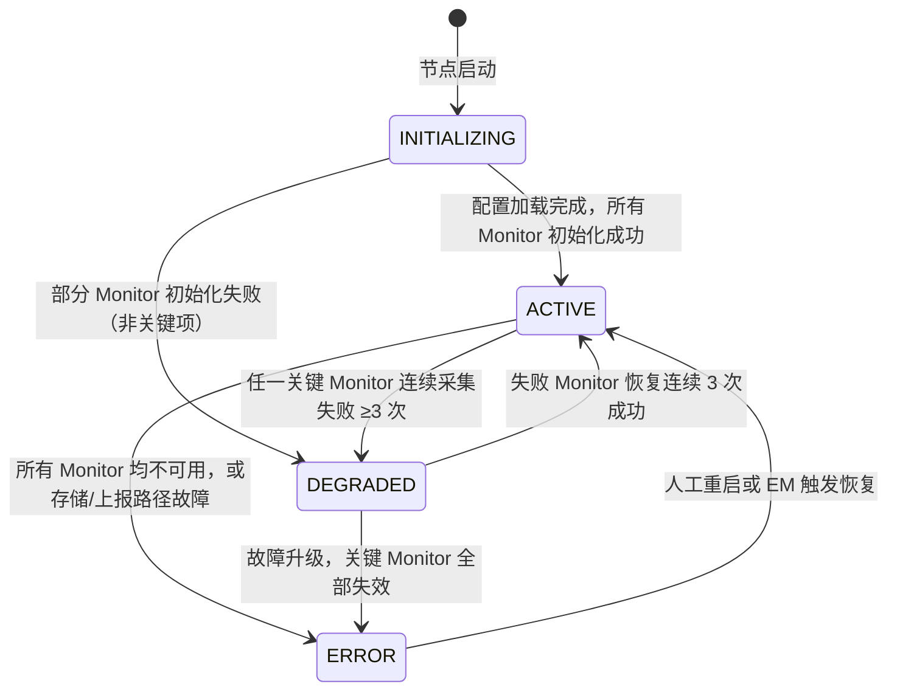
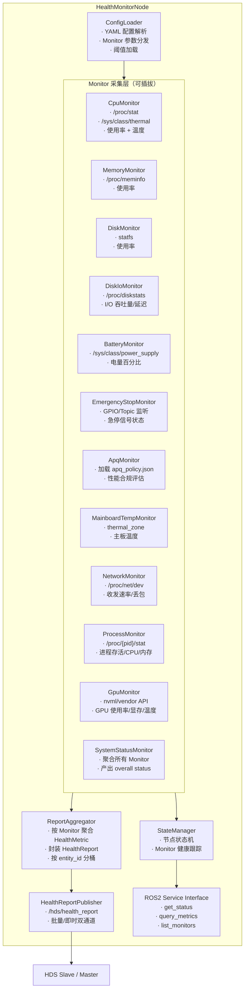
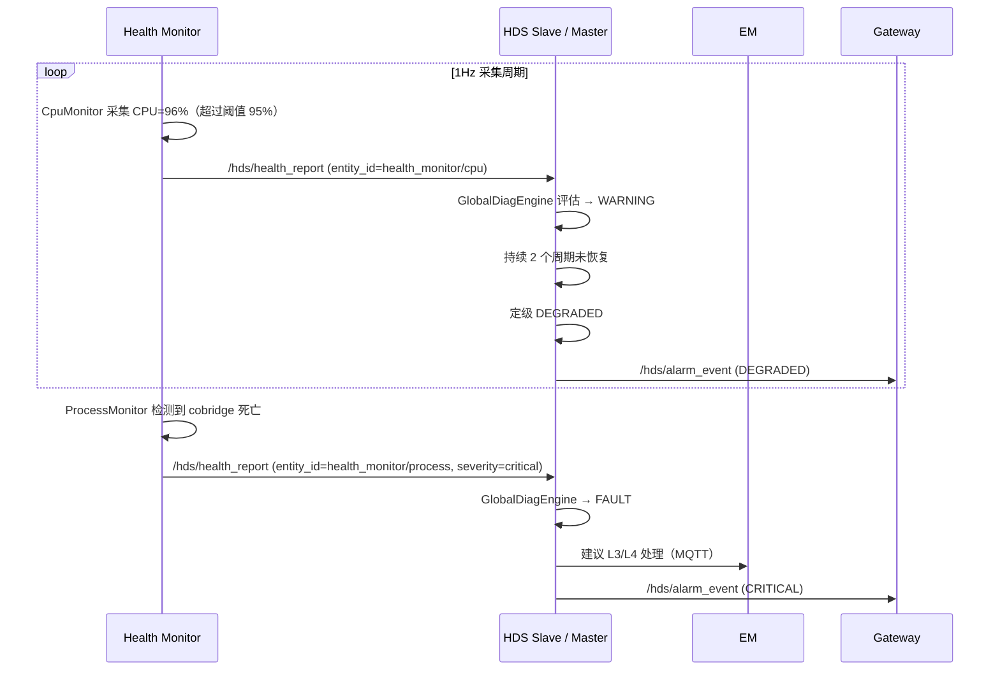

# Health Monitor 模块设计

> **创建日期**：2026-05-27
> **前置文档**：hds_master_design.md, hds_slave_design.md
> **参考配置**：/mnt/c/Users/admin/striding/zhiyuan/orin/v0/config/health_monitor/health_monitor.yaml

---

## 1. 模块概述与定位

**模块名称**：Health Monitor（健康监控）

**定位**：Health Monitor 是端侧软件系统中的**系统级健康数据采集代理**，位于中间件层。它负责持续采集所在计算节点（SOC）的系统资源、硬件状态、进程存活、急停信号等底层健康数据，标准化为 `HealthReport` 格式后上报给 HDS（Slave 或 Master），作为 HDS 故障诊断引擎的原始输入。Health Monitor 替代了原 RC（Resource Collection）模块中系统级指标采集的职责。

**核心职责**：

1. **系统资源监控**：CPU 使用率/温度、内存使用率、磁盘使用率、磁盘 I/O 统计、网络状态、GPU 使用率/显存
2. **硬件状态监控**：电池电量、主板温度、急停（EmergencyStop）信号
3. **进程健康监控**：监控关键进程存活状态（如 iox-roudi、cobridge、colistener 等）
4. **APQ 策略合规检查**：加载并执行 APQ（Adaptive Performance Qualification）策略，评估系统性能合规性
5. **系统整体状态聚合**：综合所有监控项产出 `system_status` 总览
6. **标准化上报**：将原始采集数据封装为 `hds_msgs/HealthReport`，通过 `/hds/health_report` Topic 上报 HDS

**与相邻模块的边界**：

| 边界 | Health Monitor 负责 | 对方负责 |
|------|-------------------|---------|
| HM ↔ HDS | 采集并上报系统级健康数据 | 故障诊断、定级、告警决策 |
| HM ↔ EM | 上报进程存活状态；被 EM 监控自身心跳 | 进程生命周期管理、启动/停止 |
| HM ↔ Gateway | 不上报原始数据（通过 HDS 聚合后上报） | 云端通信、远程监控 |
| HM ↔ Setting | 读取监控策略、阈值配置 | 参数持久化 |
| HM ↔ HAL_Sensor | 读取温度传感器数据（可选） | 传感器硬件抽象、数据校准 |

---

## 2. 职责边界

### 2.1 Health Monitor 能做 vs. 不能做

| 动作 | 是否可做 | 说明 |
|------|---------|------|
| 采集系统资源指标（CPU/内存/磁盘/网络/GPU） | ✅ | 核心职责 |
| 采集硬件状态（电池/温度/急停） | ✅ | 核心职责 |
| 监控关键进程存活 | ✅ | 通过进程名/PID 检查 |
| 执行 APQ 策略检查 | ✅ | 加载 JSON 策略文件并评估 |
| 上报 `HealthReport` 给 HDS | ✅ | 通过 ROS2 Topic |
| 提供本地健康状态查询 | ✅ | 通过 ROS2 Service |
| 做故障定级决策 | ❌ | 只上报原始数据，HDS 负责定级 |
| 请求 SM 状态转换 | ❌ | 禁止直接与 SM 通信 |
| 触发 E-Stop | ❌ | 急停信号只采集上报，不执行动作 |
| 启停进程 | ❌ | EM 专属权限 |
| 直连云端 API | ❌ | 通过 Gateway/HDS 上报 |
| 日志聚合 | ❌ | 不订阅 `/rosout`，不替代日志系统 |

### 2.2 Health Monitor 红线

- **不做故障诊断** — 只采集原始指标，不做阈值判断后定级（阈值仅用于本地自检）
- **不请求状态转换** — 无 SM 相关接口
- **不直连云端** — 数据经 HDS 定级后由 Gateway 转发
- **不启停进程** — 检测到进程死亡只上报 HDS，由 EM 决策处理
- **不影响系统性能** — 单次全量采集耗时 < 10ms，总 CPU 占用 < 0.5%

---

## 3. 状态机设计

Health Monitor 本身不维护复杂业务状态机，只维护采集任务的运行状态：

### 3.1 采集器运行状态



| 状态 | 值 | 说明 |
|------|-----|------|
| `INITIALIZING` | 0 | 启动中，加载配置，初始化各 Monitor |
| `ACTIVE` | 1 | 正常运行，所有启用的 Monitor 按配置频率采集 |
| `DEGRADED` | 2 | 降级运行，部分 Monitor 不可用，其余继续采集 |
| `ERROR` | 3 | 严重故障，采集停止，需人工介入 |

### 3.2 状态转换规则

| 当前状态 | 目标状态 | 触发条件 |
|---------|---------|---------|
| `INITIALIZING` | `ACTIVE` | 配置解析成功，至少一个关键 Monitor 初始化成功 |
| `INITIALIZING` | `DEGRADED` | 非关键 Monitor（如 gpu_stats）初始化失败，关键 Monitor 正常 |
| `INITIALIZING` | `ERROR` | 所有关键 Monitor 初始化失败 |
| `ACTIVE` | `DEGRADED` | 任一关键 Monitor 连续 3 次采集异常 |
| `DEGRADED` | `ACTIVE` | 失败 Monitor 连续 3 次采集恢复正常 |
| `ACTIVE` | `ERROR` | `/hds/health_report` 发布失败且 ROS2 节点状态异常 |
| `DEGRADED` | `ERROR` | 关键 Monitor 全部失效 |

### 3.3 单个 Monitor 健康状态

每个 Monitor 内部维护自身健康状态：

| 状态 | 说明 |
|------|------|
| `MONITOR_IDLE` | 未启用或初始化中 |
| `MONITOR_HEALTHY` | 采集正常 |
| `MONITOR_DEGRADED` | 最近 1 次采集异常（允许容错） |
| `MONITOR_FAULT` | 连续 3 次采集异常 |

---

## 4. ROS2 接口定义

### 4.1 消息定义（msg）

Health Monitor 复用 `hds_msgs` 包中的 `HealthReport`、`HealthMetric` 消息上报数据，新增以下专用消息：

```
# health_monitor_msgs/msg/MonitorStatus.msg
# 单个 Monitor 的状态

string monitor_name              # Monitor 名称（如 "cpu", "battery"）
uint8 state
uint8 MONITOR_IDLE      = 0
uint8 MONITOR_HEALTHY   = 1
uint8 MONITOR_DEGRADED  = 2
uint8 MONITOR_FAULT     = 3

builtin_interfaces/Time last_success_time   # 最后一次成功采集时间
uint32 consecutive_failures    # 连续失败次数
string last_error_message      # 最后一次错误信息
```

```
# health_monitor_msgs/msg/HealthMonitorState.msg
# Health Monitor 节点整体状态

builtin_interfaces/Time stamp
string node_name
uint8 state
uint8 STATE_INITIALIZING = 0
uint8 STATE_ACTIVE       = 1
uint8 STATE_DEGRADED     = 2
uint8 STATE_ERROR        = 3

bool healthy
string status_message
MonitorStatus[] monitors    # 各 Monitor 状态列表
uint32 total_monitors       # 总 Monitor 数量
uint32 healthy_monitors     # 健康的 Monitor 数量
```

```
# health_monitor_msgs/msg/SystemStatus.msg
# 系统整体状态聚合

builtin_interfaces/Time stamp
bool overall_healthy
string overall_status       # 整体状态描述

bool cpu_healthy
bool memory_healthy
bool disk_healthy
bool battery_healthy
bool network_healthy
bool process_healthy
bool temperature_healthy
bool emergency_stop_active   # true = 急停被触发
bool apq_compliant           # true = APQ 策略合规
```

```
# health_monitor_msgs/msg/Heartbeat.msg
# Health Monitor 心跳

builtin_interfaces/Time stamp
string node_name
uint8 state
bool healthy
string status_message
uint32 total_monitors
uint32 healthy_monitors
```

### 4.2 服务定义（srv）

```
# health_monitor_msgs/srv/GetMonitorStatus.srv
# 查询 Health Monitor 状态

# Request（空）
---
# Response
HealthMonitorState state
uint16 error_code
```

```
# health_monitor_msgs/srv/QuerySystemMetrics.srv
# 查询当前系统指标（瞬时快照）

# Request（空）
---
# Response
builtin_interfaces/Time stamp
float32 cpu_percent
float32 cpu_temp_celsius
float32 memory_percent
float32 disk_percent
float32 gpu_percent
float32 network_rx_mbps
float32 network_tx_mbps
float32 battery_percent
float32 mainboard_temp_celsius
bool emergency_stop_active
uint16 error_code
```

```
# health_monitor_msgs/srv/ListMonitors.srv
# 列出所有已配置的 Monitor

# Request（空）
---
# Response
string[] monitor_names
bool[] enabled
float32[] rates_hz
uint16 error_code
```

### 4.3 接口汇总表

#### Topics（发布）

| 名称 | 类型 | 方向 | QoS | 频率 | 说明 |
|------|------|------|-----|------|------|
| `/hds/health_report` | `hds_msgs/HealthReport` | HM → HDS | BestEffort + Volatile + Depth 10 | 各 Monitor 自定义 | 健康数据上报（复用 HDS 接口） |
| `/health_monitor/state` | `health_monitor_msgs/HealthMonitorState` | HM → ALL | Reliable + Volatile + Depth 1 | 1 Hz | 节点自身状态广播 |
| `/health_monitor/system_status` | `health_monitor_msgs/SystemStatus` | HM → ALL | Reliable + Volatile + Depth 1 | 1 Hz | 系统整体状态聚合 |
| `/health_monitor/heartbeat` | `health_monitor_msgs/Heartbeat` | HM → EM/HDS | Reliable + Volatile + Depth 1 | 1 Hz | 心跳 |

#### Services

| 名称 | 类型 | 调用方 | 说明 |
|------|------|--------|------|
| `/health_monitor/get_status` | `GetMonitorStatus` | EM, HDS, 调试工具 | 查询 Health Monitor 状态 |
| `/health_monitor/query_metrics` | `QuerySystemMetrics` | Gateway, 调试工具 | 查询瞬时系统指标 |
| `/health_monitor/list_monitors` | `ListMonitors` | 调试工具 | 列出 Monitor 配置 |

---

## 5. 内部设计

### 5.1 节点架构



### 5.2 Callback Group 隔离

| Callback Group | 类型 | 包含的回调 | 理由 |
|---------------|------|-----------|------|
| `default_cbg` | MutuallyExclusive | Monitor 定时采集、ReportAggregator、StateManager | 主采集循环，避免并发竞争 |
| `publisher_cbg` | MutuallyExclusive | HealthReport 发布、心跳定时器 | 发布与采集解耦，避免 DDS 阻塞影响采集 |
| `service_cbg` | MutuallyExclusive | Service 接口回调 | 查询请求不阻塞采集循环 |

### 5.3 关键组件设计

#### 5.3.1 Monitor 抽象基类

所有 Monitor 继承统一基类，实现可插拔架构：

```cpp
class BaseMonitor {
public:
  virtual ~BaseMonitor() = default;
  virtual bool Initialize(const MonitorConfig& config) = 0;
  virtual HealthReport Collect() = 0;           // 执行一次采集
  virtual std::string GetName() const = 0;
  virtual float GetRateHz() const = 0;
  virtual bool IsEnabled() const = 0;
  virtual bool IsHealthy() const;               // 连续失败次数 < 3

protected:
  uint32_t consecutive_failures_ = 0;
  uint32_t max_consecutive_failures_ = 3;
};
```

**各 Monitor 采集数据源**：

| Monitor | 数据源 | 采集方式 | 单次耗时目标 |
|---------|--------|---------|------------|
| `CpuMonitor` | `/proc/stat`, `/sys/class/thermal/zone*/temp` | 文件读取 | < 2ms |
| `MemoryMonitor` | `/proc/meminfo` | 文件读取 | < 1ms |
| `DiskMonitor` | `statfs()` | 系统调用 | < 1ms |
| `DiskIoMonitor` | `/proc/diskstats` | 文件读取 | < 1ms |
| `BatteryMonitor` | `/sys/class/power_supply/BAT*/uevent` | 文件读取 | < 1ms |
| `EmergencyStopMonitor` | GPIO 读取或订阅 `/emergency_stop` Topic | 中断/Topic | < 1ms |
| `ApqMonitor` | `apq_policy.json` + 实时指标 | 内存计算 | < 3ms |
| `MainboardTempMonitor` | `/sys/class/thermal/zone*/type` 匹配 + `temp` | 文件读取 | < 1ms |
| `NetworkMonitor` | `/proc/net/dev` | 文件读取 + 差分计算 | < 1ms |
| `ProcessMonitor` | `/proc/{pid}/stat`, `pidof` | 文件读取/命令 | < 2ms |
| `GpuMonitor` | NVML / vendor API | 库调用 | < 3ms |
| `SystemStatusMonitor` | 聚合其他 Monitor 结果 | 内存读取 | < 1ms |

#### 5.3.2 ReportAggregator

- 每个 Monitor 的 `Collect()` 返回一个 `HealthReport`
- ReportAggregator 按 `entity_id` 分桶，每个 Monitor 对应一个 entity
- 默认采集周期 1s，各 Monitor 按各自 `rate` 独立触发
- 所有 Monitor 数据统一封装后通过 `/hds/health_report` 发布
- `entity_id` 命名：`health_monitor/{monitor_name}`（如 `health_monitor/cpu`）

#### 5.3.3 EmergencyStopMonitor 特殊设计

急停信号是安全关键数据：
- 频率最高（10Hz），优先保障实时性
- 使用独立采集线程或 GPIO 中断（非轮询）
- 急停触发时**立即发布**（不等聚合周期），通过 `publisher_cbg` 发布
- `HealthMetric` 中 `severity = 2`（critical），HDS 定级后可能触发 E-Stop

#### 5.3.4 ApqMonitor 设计

APQ（Adaptive Performance Qualification）策略检查：
- 启动时加载 `apq_policy.json`
- 定期评估系统当前指标是否满足策略要求
- 产出合规性评分和不合规项列表
- 通过 `HealthReport.custom_diagnosis` 字段上报 JSON 格式诊断数据

#### 5.3.5 ProcessMonitor 设计

- 配置中指定进程名列表（如 `["iox-roudi", "cobridge", "coencoder", "colistener", "cos"]`）
- 每次采集通过 `pidof {name}` 或遍历 `/proc` 检查进程存活
- 存活进程额外采集其 CPU/内存占用
- 进程死亡时 `severity = 2`（critical），HDS 定级后通知 EM 处理

### 5.4 关键流程

#### 5.4.1 正常采集与上报流程

```
1Hz 定时器触发（各 Monitor 按自身 rate 独立触发）
  → CpuMonitor::Collect()
      → 读取 /proc/stat 计算 CPU 使用率
      → 读取 thermal_zone 获取温度
      → 封装 HealthReport (entity_id="health_monitor/cpu")
        → metrics: [{name:"usage", value:45.2, unit:"%", severity:0}, {name:"temp", value:55, unit:"C", severity:0}]
  → ReportAggregator 收集所有 Monitor 的 HealthReport
    → 统一发布 /hds/health_report (QoS BestEffort)
      → HDS Slave/Master 接收并注入诊断引擎
```

#### 5.4.2 急停信号采集流程

```
EmergencyStopMonitor
  → GPIO 中断触发 或 10Hz 轮询
    → 读取急停信号状态
      → 状态变化？
        → 是：立即发布 /hds/health_report
          → entity_id="health_monitor/emergency_stop"
          → metrics: [{name:"activated", value:1, unit:"bool", severity:2}]
        → 否：按正常周期发布（severity=0）
```

#### 5.4.3 Monitor 故障降级流程

```
CpuMonitor 采集失败（如 /proc/stat 不可读）
  → consecutive_failures_++
    → consecutive_failures_ < 3？
      → 是：标记 MONITOR_DEGRADED，继续下次采集
      → 否：标记 MONITOR_FAULT
        → 上报 HealthReport (entity_id="health_monitor/cpu")
          → metrics: [{name:"collect_failed", value:1, unit:"bool", severity:2}]
        → StateManager 评估是否触发节点状态变化
```

---

## 6. 与其他模块的交互

### 6.1 交互矩阵

| 模块 | 方向 | 接口 | 说明 |
|------|------|------|------|
| HDS Slave / Master | HM → HDS | `/hds/health_report` (Topic) | 系统级健康数据上报 |
| HDS Slave / Master | HM → HDS | `/health_monitor/state` (Topic) | HM 自身状态广播 |
| EM | HM → EM | `/health_monitor/heartbeat` (Topic) | 心跳上报，EM 监控 HM 存活 |
| EM | EM → HM | `/health_monitor/get_status` (Service) | EM 查询 HM 状态 |
| Gateway | Gateway → HM | `/health_monitor/query_metrics` (Service) | 云端请求瞬时系统指标 |
| Setting | HM → Setting | `/setting/get_parameter` (Service) | 读取监控阈值配置 |
| HAL_Sensor | HM → HAL_Sensor | 可选：订阅温度 Topic | 若 thermal_zone 不可用，从 HAL_Sensor 获取温度 |

### 6.2 交互时序：系统资源告警上报



---

## 7. 关键参数与配置

```yaml
# health_monitor/config/health_monitor_params.yaml

health_monitor:
  ros__parameters:
    # === 节点身份 ===
    node_id: "health_monitor_soc0"     # 节点 ID（多 SOC 时区分）
    soc_id: "soc0"                     # SOC ID

    # === 通用采集配置 ===
    default_collection_rate_hz: 1.0    # 默认采集频率
    report_publish_rate_hz: 1.0        # HealthReport 聚合发布频率
    heartbeat_rate_hz: 1.0             # 心跳频率

    # === Monitor 配置（与参考 YAML 一一对应）===
    monitors:
      cpu:
        enabled: true
        rate_hz: 1.0
        params:
          max_usage_percent: 95.0
          max_temp_celsius: 80.0
          max_temp_last_seconds: 10
          thermal_zone_path: "/sys/class/thermal"

      memory:
        enabled: true
        rate_hz: 1.0
        params:
          max_usage_percent: 95.0

      disk:
        enabled: true
        rate_hz: 1.0
        params:
          max_usage_percent: 95.0
          mount_points: ["/", "/opt/robot/data"]

      disk_stats:
        enabled: true
        rate_hz: 1.0
        params:
          disk_names: ["/dev/nvme0n1", "/dev/mmcblk0"]

      battery:
        enabled: true
        rate_hz: 0.2                     # 5s 周期
        params:
          battery_low_percent: 30.0
          battery_low_2_percent: 15.0
          battery_low_limit_percent: 5.0
          power_supply_path: "/sys/class/power_supply"

      emergency_stop:
        enabled: true
        rate_hz: 10.0                    # 100ms 周期，安全关键
        params:
          gpio_chip: "gpiochip0"
          gpio_line: 15
          active_low: false
          # 或订阅 Topic:
          # topic_source: "/hardware/emergency_stop"

      apq:
        enabled: true
        rate_hz: 0.2                     # 5s 周期
        params:
          policy_path: "config/apq_policy.json"

      mainboard_temp:
        enabled: true
        rate_hz: 0.05                    # 20s 周期
        params:
          thermal_zone_path: "/sys/class/thermal"
          zone_type_filter: ["x86_pkg_temp", "arm_thermal", "soc_thermal"]

      network:
        enabled: true
        rate_hz: 1.0
        params:
          interfaces: ["eth0", "wlan0", "docker0"]

      process:
        enabled: true
        rate_hz: 1.0
        params:
          process_names: ["iox-roudi", "cobridge", "coencoder", "colistener", "cos"]
          collect_resource_usage: true     # 是否采集进程的 CPU/内存占用

      gpu_stats:
        enabled: true
        rate_hz: 1.0
        params:
          vendor: "nvidia"                # nvidia / arm_mali / 其他
          collect_temperature: true

      system_status:
        enabled: true
        rate_hz: 1.0
        params:
          # system_status 聚合所有其他 Monitor 结果，无额外参数

    # === 上报配置 ===
    reporting:
      entity_id_prefix: "health_monitor"  # entity_id 前缀
      publish_on_change: false            # true: 仅变化时发布；false: 按频率发布
      critical_immediate_publish: true    # critical severity 时立即发布

    # === 降级阈值 ===
    degradation:
      max_consecutive_failures: 3         # Monitor 连续失败次数上限
      critical_monitors:                  # 关键 Monitor，失败触发节点降级
        - "emergency_stop"
        - "cpu"
        - "memory"
```

---

## 8. 错误码定义

```
# health_monitor_msgs/msg/ErrorCode.msg

uint16 OK                           = 0
uint16 ERR_MONITOR_INIT_FAILED      = 17001   # Monitor 初始化失败
uint16 ERR_MONITOR_COLLECT_FAILED   = 17002   # Monitor 采集失败
uint16 ERR_CONFIG_INVALID           = 17003   # 配置无效
uint16 ERR_CONFIG_LOAD_FAILED       = 17004   # 配置文件加载失败
uint16 ERR_APQ_POLICY_INVALID       = 17005   # APQ 策略文件无效
uint16 ERR_APQ_POLICY_LOAD_FAILED   = 17006   # APQ 策略文件加载失败
uint16 ERR_PROCESS_NOT_FOUND        = 17007   # 配置的进程不存在
uint16 ERR_GPU_API_UNAVAILABLE      = 17008   # GPU API 不可用
uint16 ERR_BATTERY_PATH_INVALID     = 17009   # 电池信息路径无效
uint16 ERR_THERMAL_ZONE_INVALID     = 17010   # 温度传感器路径无效
uint16 ERR_GPIO_ACCESS_DENIED       = 17011   # GPIO 访问权限不足
uint16 ERR_PUBLISH_FAILED           = 17012   # HealthReport 发布失败
uint16 ERR_UNKNOWN_MONITOR          = 17013   # 查询了不存在的 Monitor
```

| 错误码 | 常量名 | 说明 | 严重级别 |
|--------|--------|------|----------|
| 0 | `OK` | 成功 | — |
| 17001 | `ERR_MONITOR_INIT_FAILED` | Monitor 初始化失败 | MEDIUM |
| 17002 | `ERR_MONITOR_COLLECT_FAILED` | Monitor 采集失败 | MEDIUM |
| 17003 | `ERR_CONFIG_INVALID` | 配置参数无效 | HIGH |
| 17004 | `ERR_CONFIG_LOAD_FAILED` | 配置文件加载失败 | HIGH |
| 17005 | `ERR_APQ_POLICY_INVALID` | APQ 策略格式错误 | MEDIUM |
| 17006 | `ERR_APQ_POLICY_LOAD_FAILED` | APQ 策略文件无法读取 | MEDIUM |
| 17007 | `ERR_PROCESS_NOT_FOUND` | 配置的监控进程不存在 | HIGH |
| 17008 | `ERR_GPU_API_UNAVAILABLE` | GPU 监控 API 不可用 | LOW |
| 17009 | `ERR_BATTERY_PATH_INVALID` | 电池信息路径不存在 | LOW |
| 17010 | `ERR_THERMAL_ZONE_INVALID` | 温度传感器不可用 | LOW |
| 17011 | `ERR_GPIO_ACCESS_DENIED` | GPIO 访问被拒绝（急停监控失败） | HIGH |
| 17012 | `ERR_PUBLISH_FAILED` | ROS2 Topic 发布失败 | HIGH |
| 17013 | `ERR_UNKNOWN_MONITOR` | 查询了未配置的 Monitor | LOW |

---

## 9. 安全约束

### 9.1 急停信号不可丢失

- `EmergencyStopMonitor` 运行在最高采集频率（10Hz）
- 使用独立采集线程或 GPIO 中断，不依赖主采集循环
- 急停状态变化时**立即发布**（不等 1s 聚合周期）
- 急停信号 `severity` 固定为 `critical`（2），确保 HDS 优先处理

### 9.2 采集开销上限

- 单次全量采集（所有 Monitor）耗时 **< 10ms**
- 进程自身 CPU 占用 **< 0.5%**
- 进程自身内存占用 **< 32MB**
- 若某 Monitor 采集耗时超过阈值（如 5ms），标记 DEGRADED 并记录日志

### 9.3 不阻塞 ROS2 执行器

- Monitor 采集使用独立线程（非 ROS2 Executor 线程）
- 采集结果通过线程安全队列传递给 Publisher 线程
- Publisher 使用独立 Callback Group，避免 DDS 阻塞影响采集

### 9.4 采集失败容错

- 单个 Monitor 故障不影响其他 Monitor 运行
- 连续 3 次失败后标记该 Monitor 为 FAULT，上报 HDS
- 文件读取类 Monitor（如 CPU、内存）在路径不可用时尝试备用路径

### 9.5 数据可信度

- `HealthReport.timestamp` 使用采集完成时刻的时间戳（非发布时刻）
- CPU 使用率通过两次采样差分计算，时间戳差用于校准
- 网络速率通过 `/proc/net/dev` 差分计算，确保时间基准一致

### 9.6 权限安全

- GPIO 访问需配置 udev 规则，Health Monitor 进程以特定用户运行
- `/proc` 读取不需要特权，但部分 thermal_zone 可能需要
- 不执行任何写入操作（除 ROS2 Topic 发布外）

---

## 10. 包结构

```
health_monitor_msgs/            # 消息定义包
    msg/
        MonitorStatus.msg
        HealthMonitorState.msg
        SystemStatus.msg
        Heartbeat.msg
        ErrorCode.msg
    srv/
        GetMonitorStatus.srv
        QuerySystemMetrics.srv
        ListMonitors.srv
    CMakeLists.txt
    package.xml

health_monitor/                 # 节点实现包
    include/health_monitor/
        health_monitor_node.hpp       # 主节点类
        config_loader.hpp             # 配置加载器
        base_monitor.hpp              # Monitor 抽象基类
        cpu_monitor.hpp               # CPU 监控
        memory_monitor.hpp            # 内存监控
        disk_monitor.hpp              # 磁盘使用率监控
        disk_io_monitor.hpp           # 磁盘 I/O 监控
        battery_monitor.hpp           # 电池监控
        emergency_stop_monitor.hpp    # 急停监控
        apq_monitor.hpp               # APQ 策略监控
        mainboard_temp_monitor.hpp    # 主板温度监控
        network_monitor.hpp           # 网络监控
        process_monitor.hpp           # 进程监控
        gpu_monitor.hpp               # GPU 监控
        system_status_monitor.hpp     # 系统状态聚合
        report_aggregator.hpp         # 报告聚合器
        state_manager.hpp             # 节点状态管理
    src/
        health_monitor_node.cpp
        config_loader.cpp
        cpu_monitor.cpp
        memory_monitor.cpp
        disk_monitor.cpp
        disk_io_monitor.cpp
        battery_monitor.cpp
        emergency_stop_monitor.cpp
        apq_monitor.cpp
        mainboard_temp_monitor.cpp
        network_monitor.cpp
        process_monitor.cpp
        gpu_monitor.cpp
        system_status_monitor.cpp
        report_aggregator.cpp
        state_manager.cpp
        main.cpp
    test/
        test_cpu_monitor.cpp
        test_memory_monitor.cpp
        test_process_monitor.cpp
        test_emergency_stop_monitor.cpp
        test_apq_monitor.cpp
        test_report_aggregator.cpp
        test_integration.cpp          # 端到端测试（模拟 HDS 接收）
    config/
        health_monitor_params.yaml    # 参数配置
        apq_policy.json               # APQ 策略文件（示例）
    launch/
        health_monitor.launch.py      # Launch 文件
    CMakeLists.txt
    package.xml
```

---

## 11. 部署指南

### 11.1 Launch 参数

```python
# health_monitor.launch.py 关键参数
LaunchConfiguration('node_id', default='health_monitor_soc0')
LaunchConfiguration('soc_id', default='soc0')
LaunchConfiguration('params_file', default='config/health_monitor_params.yaml')
```

### 11.2 多 SOC 部署

每个 SOC 独立部署一个 Health Monitor 实例：

```
SOC-0 (主控)
  └─ health_monitor (node_id=health_monitor_soc0)
     → 上报 HDS Master (本地)

SOC-1 (运动)
  └─ health_monitor (node_id=health_monitor_soc1)
     → 上报 HDS Slave-1 → HDS Master

SOC-2 (感知)
  └─ health_monitor (node_id=health_monitor_soc2)
     → 上报 HDS Slave-2 → HDS Master
```

多 SOC 场景下，Health Monitor 上报的 `entity_id` 在 HDS 中自动映射为 `soc_id/health_monitor/{monitor_name}`。

### 11.3 单 SOC 部署

单 SOC 场景下 Health Monitor 直接上报给 HDS Master（无 Slave 中转），所有接口行为不变。

---

## 附录 A：设计审查综合报告

> **审查日期**：2026-05-27
> **审查模块**：Health Monitor
> **审查类型**：架构审查 + 安全审查（并行）

---

### 总体判决：NEEDS_REVISION

Health Monitor 的设计在职责边界和架构原则上总体合理，但在**急停路径实时性保障**、**QoS 与安全关键数据匹配**、**状态机完整性**和**RC 职责转移**方面存在必须修改的问题。

---

### 安全审查结果（safety-validator）

**判决**：NEEDS_REVISION

#### CRITICAL（必须修改）

| 编号 | 问题 | 风险分析 | 修改建议 |
|------|------|---------|---------|
| C1 | `EmergencyStopMonitor` 缺乏独立的 Callback Group 隔离 | 急停回调与其他 Monitor 采集共享 `default_cbg`，`GpuMonitor` 等阻塞调用可能延迟急停处理 | 新增 `estop_cbg`（`MutuallyExclusive`），专门承载急停相关回调 |
| C2 | 急停"立即发布"路径存在实现歧义 | 架构图中急停信号走 `Monitors → Aggregator → Publisher`，若实现时经过 `ReportAggregator` 则无法保证即时性 | 明确急停信号**绕过 `ReportAggregator`**，直接通过 `publisher_cbg` 发布 `/hds/health_report` |
| C3 | `SystemStatus.emergency_stop_active` 命名易被误用为系统权威状态 | 下游模块可能误将此字段作为急停状态唯一来源，绕过 SM 的权威状态 | 重命名为 `hardware_estop_signal_raw`，并注释说明系统急停状态以 `/sm/robot_state` 为准 |

#### HIGH（必须修改）

| 编号 | 问题 | 风险分析 | 修改建议 |
|------|------|---------|---------|
| H1 | 状态机缺少 `ERROR → DEGRADED` 恢复路径 | 非关键 Monitor 全部失效但关键 Monitor 正常时，强制回到 `ACTIVE` 过于严格 | 增加 `ERROR → DEGRADED` 转换：关键 Monitor 恢复且非关键 Monitor 仍有故障时进入 `DEGRADED` |
| H2 | GPIO 访问失败后的系统行为未定义 | 急停监控完全失效时系统无法感知硬件急停，安全漏洞 | GPIO 失败时自动降级到 `topic_source`；若两者均不可用，HM 进入 `ERROR` 并上报 `severity=critical` |
| H3 | 关键进程死亡检测延迟未明确 | `ProcessMonitor` 1Hz 频率意味着最坏 1s 延迟，对于 P0 进程过长 | 关键进程监控频率提升至 10Hz，或补充订阅 EM 的进程状态 Topic |

#### MEDIUM（建议在实现阶段修复）

| 编号 | 问题 | 修改建议 |
|------|------|---------|
| M1 | `QuerySystemMetrics` 可能被用于绕过 HDS 定级 | 在交互矩阵中约束：Gateway 仅用于状态面板展示，告警决策必须经过 HDS |
| M2 | `default_cbg` 包含过多回调，可能产生阻塞级联 | 拆分 `collection_cbg` 与 `ReportAggregator`，或增加 Monitor 触发相位偏移 |
| M3 | `HealthReport` 发布失败缺少容错策略 | 连续 3 次发布失败才触发降级；发布失败期间采集继续运行 |

#### LOW（建议项）

| 编号 | 问题 | 修改建议 |
|------|------|---------|
| L1 | `MonitorStatus` 缺少 `is_critical` 字段 | 增加 `bool is_critical`，便于外部诊断 |
| L2 | `critical_monitors` 列表缺少 `process` | 将 `process` 或至少 `iox-roudi` 加入关键监控项 |
| L3 | `SystemStatus.overall_healthy` 存在定级歧义 | 重命名为 `collection_healthy`，注释说明不代表 HDS 全局诊断结果 |

---

### 架构审查结果

**判决**：NEEDS_REVISION

#### CRITICAL（必须修改）

| 编号 | 问题 | 风险分析 | 修改建议 |
|------|------|---------|---------|
| A-C1 | 急停信号使用 `BestEffort` QoS，与安全关键性不匹配 | `/hds/health_report` 全局配置为 `BestEffort + Volatile + Depth 10`，急停信号若走此 Topic 可能丢失 | 急停信号使用独立 Topic `/health_monitor/emergency_stop_critical`（`Reliable + Volatile + Depth 10`），HDS 订阅两个 Topic；或在 `HealthReport` 中急停指标标记 `severity=2` 时，HM 额外发布到 Reliable 通道 |

#### HIGH（必须修改）

| 编号 | 问题 | 风险分析 | 修改建议 |
|------|------|---------|---------|
| A-H1 | RC 替代后"日志聚合"和"事件收集"职责去向未明确 | 原 RC 负责 rosout 订阅、状态转换事件收集、任务事件收集。HM 明确不做这些，但未说明由谁承接 | 在 2.1 节"Health Monitor 红线"中增加说明：日志聚合由 rcl_logging /rosbag2 负责；系统事件收集由各模块直接上报 HDS 或通过 `/rosout` 由外部日志系统处理。HM 仅负责系统级指标采集 |
| A-H2 | `apq_policy.json` 使用相对路径 | `../config/health_monitor/apq_policy.json` 在 ROS2 安装空间中不可靠 | 使用 `ament` 资源路径解析（`ament_index_cpp::get_package_share_directory`）或参数化绝对路径 |
| A-H3 | 急停 `entity_id` 归属语义不清 | `health_monitor/emergency_stop` 将硬件急停信号归为 HM 的监控实体，但急停本质上是全局硬件状态 | 与 HDS 团队确认：急停是否应作为独立实体（如 `hardware/emergency_stop`）被诊断，而非 HM 的子实体 |

#### MEDIUM（建议在实现阶段修复）

| 编号 | 问题 | 修改建议 |
|------|------|---------|
| A-M1 | `severity=critical` 的 `HealthReport` 仍使用 `BestEffort` | 进程死亡、急停等 critical 数据使用 BestEffort 有丢失风险 | 定义 critical 报告的 Reliable 重发策略：critical 指标单独打包，使用 `Reliable` QoS 发布 |
| A-M2 | `SystemStatus` 局部定级与 HDS 全局定级语义冲突 | `overall_healthy` 是 HM 本地阈值判断，易与 HDS 全局定级混淆 | 同安全审查 L3 |
| A-M3 | 多 SOC `entity_id` 映射规则需 HDS 侧确认 | `soc_id/health_monitor/{monitor_name}` 的映射需要 HDS Master/Slave 支持 | 与 HDS 设计文档对齐，确认 `entity_id` 命名规范和前缀规则 |

#### LOW（建议项）

| 编号 | 问题 | 修改建议 |
|------|------|---------|
| A-L1 | `node_id` 与 `soc_id` 存在冗余 | ROS2 节点名已可唯一标识 | 简化配置，或保留 `soc_id` 用于上报数据中的 `soc_id` 字段 |
| A-L2 | `GpuMonitor.vendor` 使用字符串而非枚举 | 增加类型安全性 | 使用枚举：`NVIDIA`, `ARM_MALI`, `UNKNOWN` |

---

### 综合建议（按优先级排序）

#### 阻塞项（设计通过前必须修改）

1. **新增 `estop_cbg` Callback Group**（C1）— 急停路径物理隔离
2. **明确急停绕过 ReportAggregator 的直接发布路径**（C2）— 避免聚合延迟
3. **重命名 `emergency_stop_active` → `hardware_estop_signal_raw`**（C3）— 防止状态混淆
4. **急停信号 QoS 升级**（A-C1）— BestEffort 不适合安全关键数据
5. **增加 `ERROR → DEGRADED` 恢复路径**（H1）— 状态机完整性
6. **定义 GPIO 失败后的备用行为**（H2）— 急停监控失效的安全兜底
7. **明确 RC 职责转移去向**（A-H1）— 架构完整性
8. **修正 `apq_policy.json` 路径为 ament 资源路径**（A-H2）— 部署可靠性

#### 实现阶段必须修复

9. 关键进程检测延迟优化（H3）
10. `QuerySystemMetrics` 使用边界约束（M1）
11. `default_cbg` 拆分或相位偏移（M2）
12. `HealthReport` 发布失败容错策略（M3）
13. Critical 报告 Reliable 重发策略（A-M1）

#### 建议项

14. `MonitorStatus` 增加 `is_critical`（L1）
15. `critical_monitors` 增加 `process`（L2）
16. `SystemStatus.overall_healthy` 重命名（L3 / A-M2）
17. `GpuMonitor.vendor` 改为枚举（A-L2）

---

### 审查结论

Health Monitor 的设计在**职责边界**上表现优秀：明确遵守了"只采集不上报决策"的红线，不越权请求 SM、不触发 E-Stop、不启停进程、不直连云端。Monitor 可插拔架构为后续扩展提供了良好的基础。

但在**安全关键路径的实时性保障**和**架构完整性**方面存在明显缺陷，主要集中在：

1. **急停信号路径**：Callback Group 未隔离 + QoS 不匹配 + 发布路径存在歧义，三者叠加可能导致急停信号延迟或丢失。
2. **状态机完整性**：缺少降级恢复路径，急停监控失效后的行为未定义。
3. **RC 替代完整性**：日志聚合和事件收集职责去向未说明。

**以上 8 项阻塞项修改完成后，设计可进入 APPROVED_WITH_CONDITIONS 状态；全部 17 项问题解决后可进入 APPROVED。**
