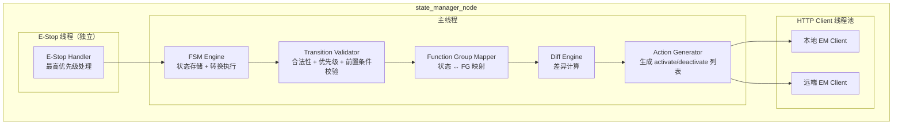

# State Manager 模块设计（v2）

> **修订日期**：2026-05-21
> **修订原因**：参考实际部署配置重新设计状态机，从"姿态导向"状态切换为"业务场景导向"状态
> **主要变更**：状态机从 17 状态精简为 16 状态 + 子状态机制；引入 Function Group State；标准化动作语义（DIFF/activate/deactivate/close/fallback）

---

## 1. 模块概述

**模块名称**：State Manager（SM）

**定位**：SM 是端侧软件系统中的**全局状态权威**，位于中间件层。它维护机器人唯一的生命周期有限状态机（FSM），对外广播当前系统状态，对内校验所有状态转换请求的合法性。SM 通过 HTTP API 向 EM 下发进程编排指令。

**核心职责**：
1. 维护机器人全局生命周期 FSM（唯一状态源）
2. 管理系统状态 ↔ Function Group 的映射关系
3. 接收并校验状态转换请求，按优先级仲裁冲突
4. 广播状态变更事件（`/sm/robot_state`），供所有模块订阅
5. 提供急停（E-Stop）快速路径，优先级最高（priority=100）
6. 为运动类模块提供状态查询接口（`/sm/is_motion_allowed`），阻断非法运动指令
7. 支持子状态（child_modes）和故障回退（fallback）机制

**与相邻模块的边界**：

| 边界 | SM 负责 | 对方负责 |
|------|--------|---------|
| SM ↔ EM | 状态转换决策，通过 HTTP API 下发进程编排指令 | 进程生命周期管理 |
| SM ↔ HDS | 接受 HDS 的降级/故障转换请求 | 故障诊断与定级 |
| SM ↔ MC/MS/MP | 提供状态查询，拒绝非法状态下的运动 | 运动执行，调用前校验状态 |
| SM ↔ Gateway | 接受用户侧操作指令（解除急停等） | 云端通信，转发用户操作 |
| SM ↔ TE | 接受任务引擎的状态转换请求 | 任务调度与编排 |

**部署说明**：

SM 是**全局唯一**的状态机实例。在单 SOC 部署中，SM 与 EM 运行在同一计算单元上；在多 SOC 部署中，SM 运行在主控 SOC 上，通过 HTTP API 向各 SOC 上的 EM 下发进程编排指令。各 SOC 上的进程启停由同一个状态机决策。

---

## 2. 状态机设计

### 2.1 设计原则

状态机采用**分层结构**，区别于 v1 的"姿态导向"（ACTIVE_STAND/ACTIVE_SQUAT/ACTIVE_SIT），v2 采用**"业务场景导向"**：

```
生命周期层：Startup → Ready → {Poweroff, Reboot}
              ↓
业务层：Manual ↔ Auto ↔ Mapping ↔ Exploration ↔ Manipulator
              ↓
专用层：MotionStream, Calibration, DataCollection
              ↓
维护层：OTA, Reset
              ↓
安全层（可叠加）：EStop
```

**为什么改为业务场景导向？**
- 实际部署中，MC 插件负责具体的姿态控制（站立/下蹲/坐下），SM 不应越界管理姿态细节
- 任务编排（TE）需要的是"进入手动模式"、"进入自动模式"等业务语义，而非"进入站立姿态"
- Function Group State 机制已经承载了"哪些模块运行"的语义，状态机应聚焦于"机器人在做什么"

### 2.2 状态枚举

| 状态 | 值 | 层级 | 说明 |
|------|-----|------|------|
| `STARTUP` | 0 | 生命周期 | 系统启动中，加载关键基础设施（System FG + HAL FG + EStop FG） |
| `READY` | 1 | 生命周期 | 系统就绪，所有基础设施和感知模块已启动，可接受业务请求 |
| `MANUAL` | 2 | 业务 | 手动/遥控模式，操作员通过 RC 控制机器人运动和操作 |
| `AUTO` | 3 | 业务 | 自动模式，Task Engine 调度任务，Agent 自主决策 |
| `MAPPING` | 4 | 业务 | 建图模式，SLAM 主导，Perception 关闭（避免干扰） |
| `EXPLORATION` | 5 | 业务 | 自由探索模式，机器人在未知环境中自主探索 |
| `MANIPULATOR` | 6 | 业务 | 具身操作模式，专注于上肢精细操作 |
| `FREE_EXPLORATION` | 7 | 业务 | 自由探索（扩展模式），支持任务引擎调度 |
| `MOTION_STREAM` | 8 | 专用 | 实时遥操作模式，Motion Streamer 控制机器人动作 |
| `CALIBRATION` | 9 | 专用 | 标定模式，用于传感器/关节标定 |
| `DATA_COLLECTION` | 10 | 专用 | 数据采集模式，用于 VLA 训练数据录制 |
| `OTA` | 11 | 维护 | 固件升级模式，禁止运动，仅保留升级相关模块 |
| `RESET` | 12 | 维护 | 恢复出厂设置，清理用户数据 |
| `POWEROFF` | 13 | 生命周期 | 关机流程中，逐步停止所有模块 |
| `REBOOT` | 14 | 生命周期 | 重启流程中，有序停止后重新启动 |
| `ESTOP` | 15 | 安全（叠加） | 急停激活，运动锁定，需人工解除 |

> **EStop 的叠加语义**：`ESTOP` 不是一个独立的状态节点，而是可以叠加在任何状态之上的**安全标志**。当 EStop 触发时，当前业务状态保持不变（如仍标记为 MANUAL），但系统行为受 EStop 约束（禁止运动）。E-Stop 解除后，恢复到触发前的业务状态。

### 2.3 状态转换图

```mermaid
stateDiagram-v2
    [*] --> STARTUP
    STARTUP --> READY : boot_complete
    STARTUP --> OTA : ota_request
    STARTUP --> POWEROFF : poweroff_request

    READY --> MANUAL : enter_manual
    READY --> ESTOP : estop_triggered
    READY --> POWEROFF : poweroff_request

    MANUAL --> AUTO : enter_auto
    MANUAL --> MAPPING : enter_mapping
    MANUAL --> EXPLORATION : enter_exploration
    MANUAL --> MANIPULATOR : enter_manipulator
    MANUAL --> MOTION_STREAM : enter_motion_stream
    MANUAL --> CALIBRATION : enter_calibration
    MANUAL --> DATA_COLLECTION : enter_data_collection
    MANUAL --> FREE_EXPLORATION : enter_free_exploration
    MANUAL --> OTA : enter_ota
    MANUAL --> ESTOP : estop_triggered
    MANUAL --> POWEROFF : poweroff_request
    MANUAL --> RESET : enter_reset

    AUTO --> MANUAL : enter_manual
    AUTO --> FREE_EXPLORATION : enter_free_exploration
    AUTO --> ESTOP : estop_triggered
    AUTO --> POWEROFF : poweroff_request

    MAPPING --> MANUAL : enter_manual
    MAPPING --> EXPLORATION : enter_exploration
    MAPPING --> ESTOP : estop_triggered

    EXPLORATION --> MANUAL : enter_manual
    EXPLORATION --> MAPPING : enter_mapping
    EXPLORATION --> ESTOP : estop_triggered

    MANIPULATOR --> MANUAL : enter_manual
    MANIPULATOR --> FREE_EXPLORATION : enter_free_exploration
    MANIPULATOR --> OTA : enter_ota
    MANIPULATOR --> ESTOP : estop_triggered
    MANIPULATOR --> POWEROFF : poweroff_request
    MANIPULATOR --> RESET : enter_reset

    FREE_EXPLORATION --> MANUAL : enter_manual
    FREE_EXPLORATION --> AUTO : enter_auto
    FREE_EXPLORATION --> ESTOP : estop_triggered
    FREE_EXPLORATION --> POWEROFF : poweroff_request

    MOTION_STREAM --> MANUAL : enter_manual
    MOTION_STREAM --> DATA_COLLECTION : enter_data_collection
    MOTION_STREAM --> ESTOP : estop_triggered
    MOTION_STREAM --> POWEROFF : poweroff_request

    CALIBRATION --> READY : calibration_complete
    CALIBRATION --> ESTOP : estop_triggered

    DATA_COLLECTION --> MANUAL : enter_manual
    DATA_COLLECTION --> MOTION_STREAM : enter_motion_stream
    DATA_COLLECTION --> ESTOP : estop_triggered
    DATA_COLLECTION --> POWEROFF : poweroff_request

    OTA --> REBOOT : ota_reboot
    OTA --> READY : ota_cancel
    OTA --> POWEROFF : poweroff_request

    RESET --> REBOOT : reset_complete
    RESET --> POWEROFF : poweroff_request

    ESTOP --> READY : estop_release (from READY)
    ESTOP --> OTA : estop_release (from OTA)
    ESTOP --> POWEROFF : poweroff_request

    POWEROFF --> [*]
    REBOOT --> STARTUP : reboot_complete
```



### 2.4 状态转换表

#### 2.4.1 生命周期层转换

| 当前状态 | 目标状态 | 触发条件 | 触发者 | 优先级 |
|----------|----------|----------|--------|--------|
| STARTUP | READY | 所有 P0/P1 模块就绪（infra + middleware + HAL） | SM 内部 / EM | 60 |
| STARTUP | OTA | 开机即收到 OTA 请求（固件待更新） | FOTA | 70 |
| STARTUP | POWEROFF | 启动失败或收到关机指令 | Gateway / HDS | 100 |
| READY | MANUAL | 用户请求进入手动模式 | Gateway / TE | 40 |
| READY | ESTOP | 急停触发 | MC / EM / HDS / Gateway / hardware_estop | 100 |
| READY | POWEROFF | 关机指令 | Gateway | 60 |

#### 2.4.2 业务层转换

| 当前状态 | 目标状态 | 触发条件 | 触发者 | 优先级 |
|----------|----------|----------|--------|--------|
| MANUAL | AUTO | 用户请求自动模式 / TE 调度任务 | TE / Gateway | 40 |
| MANUAL | MAPPING | 用户请求开始建图 | Gateway | 40 |
| MANUAL | EXPLORATION | 用户请求自由探索 | Gateway / TE | 40 |
| MANUAL | MANIPULATOR | 用户请求具身操作模式 | Gateway / TE | 40 |
| MANUAL | MOTION_STREAM | 用户请求实时遥操作 | Gateway / TE | 40 |
| MANUAL | CALIBRATION | 用户请求标定 | Gateway | 30 |
| MANUAL | DATA_COLLECTION | 用户请求数据采集 | Gateway / TE | 40 |
| MANUAL | FREE_EXPLORATION | 用户请求自由探索（扩展） | Gateway / TE | 40 |
| MANUAL | OTA | 用户请求固件升级 | FOTA / Gateway | 60 |
| MANUAL | RESET | 用户请求恢复出厂 | Gateway（operator） | 80 |
| AUTO | MANUAL | 任务完成 / 用户接管 | TE / Gateway | 40 |
| AUTO | FREE_EXPLORATION | TE 调度自由探索任务 | TE | 40 |
| MAPPING | MANUAL | 建图完成 / 用户停止 | Gateway | 40 |
| MAPPING | EXPLORATION | 建图后进入探索 | TE / Gateway | 40 |
| EXPLORATION | MANUAL | 探索完成 / 用户停止 | Gateway | 40 |
| EXPLORATION | MAPPING | 探索中发现新区域需建图 | TE / Gateway | 40 |
| MANIPULATOR | MANUAL | 操作完成 / 用户停止 | Gateway / TE | 40 |
| FREE_EXPLORATION | MANUAL | 探索完成 | Gateway | 40 |
| FREE_EXPLORATION | AUTO | TE 调度自动任务 | TE | 40 |
| MOTION_STREAM | MANUAL | 遥操作停止 | Gateway / TE | 40 |
| CALIBRATION | READY | 标定完成 | SM 内部 / calibration module | 50 |
| DATA_COLLECTION | MANUAL | 采集完成 | Gateway / TE | 40 |
| DATA_COLLECTION | MOTION_STREAM | 切换到遥操作采集 | Gateway / TE | 40 |

#### 2.4.3 维护层转换

| 当前状态 | 目标状态 | 触发条件 | 触发者 | 优先级 |
|----------|----------|----------|--------|--------|
| OTA | REBOOT | OTA 成功，请求重启 | FOTA | 60 |
| OTA | READY | OTA 取消 / 失败回退 | FOTA / Gateway | 60 |
| OTA | POWEROFF | 升级中强制关机 | Gateway | 60 |
| RESET | REBOOT | 重置完成 | SM 内部 | 60 |
| RESET | POWEROFF | 重置后关机 | Gateway | 60 |

#### 2.4.4 安全层（E-Stop）转换

| 当前状态 | 目标状态 | 触发条件 | 触发者 | 优先级 |
|----------|----------|----------|--------|--------|
| 任意（非 ESTOP） | ESTOP | 急停触发 | MC / EM / HDS / Gateway / hardware_estop | 100 |
| ESTOP | READY | E-Stop 解除（原状态为 READY） | Gateway（operator） | 100 |
| ESTOP | MANUAL | E-Stop 解除（原状态为 MANUAL） | Gateway（operator） | 100 |
| ESTOP | OTA | E-Stop 解除（原状态为 OTA） | Gateway（operator） | 100 |
| ESTOP | POWEROFF | E-Stop 状态下关机 | Gateway | 100 |

> **E-Stop 恢复规则**：解除 E-Stop 时，SM 恢复到触发前的业务状态（通过 `previous_mode` 字段记录）。若触发前状态已不可用（如模块故障导致），则回退到 READY。

### 2.5 状态转换约束

1. **E-Stop 不可覆盖**：任何状态下收到 E-Stop 请求，立即进入 ESTOP 叠加态，优先级=100，不可被其他请求抢占
2. **状态转换互斥**：同一时刻只允许一个状态转换在进行中，新请求排队或按优先级抢占
3. **子状态继承**：进入子状态（如 MANUAL → Safety）不改变父状态的 `previous_mode` 记录
4. **多节点一致性**：状态转换时，SM 向各计算节点上的 EM 发送编排指令，任一节点失败则回滚
5. **模块依赖校验**：状态转换前校验模块依赖关系（如 `mc` 依赖 `hal_ethercat`），依赖未满足时拒绝转换

---

## 3. Function Group State 设计

### 3.1 功能组定义

Function Group（功能组）是跨模块的逻辑分组，用于在状态切换时批量启停相关模块。每个系统状态激活一组功能组，功能组内的模块由 EM 统一管理。

| 功能组 | 包含模块 | 说明 |
|--------|---------|------|
| **System** | hds, fota_master, fota_slave0/1, recordbag0/1, health_monitor0/1 | 系统基础设施，始终活跃 |
| **HAL** | tz_camera, hal_d415, hal_dcw2, hal_d405, hal_lidar | 硬件抽象层，提供传感器数据 |
| **EStop** | hal_ethercat | 急停硬件接口（EtherCAT 紧急帧） |
| **Motion** | agent, mc, pnc, pnc_arm | 运动控制链（感知-规划-控制） |
| **SLAM** | slam | 建图定位 |
| **Perception** | perception, perception_object, perception_qr | 感知融合 |
| **RC** | rc | 遥控模块 |
| **MoCap** | motion_player | 动作播放 |
| **MoStream** | motion_streamer | 动作流（遥操作） |
| **Manager** | mm, task_engine, tf | 任务管理与坐标变换 |
| **Gateway** | gateway, setting0/1 | 网关与设置 |
| **Calibration** | calibration, hal_d405 | 标定专用 |
| **Data_Collector** | data_collector, hal_d405 | 数据采集专用 |
| **RTC** | rtc | 实时时钟 |
| **Poweroff** | poweroff0/1 | 关机处理 |
| **Reboot** | reboot0/1 | 重启处理 |
| **OTA** | fota_slave0/1 | 固件升级 |

### 3.2 系统状态 ↔ 功能组映射表

| 系统状态 | 活跃功能组 | 说明 |
|----------|-----------|------|
| STARTUP | System, HAL, EStop, Manager, RC, MoCap, Gateway, Perception, OTA | 启动基础设施 + 感知预加载 |
| READY | System, HAL, EStop, Manager, SLAM, RC, MoCap, Gateway, Perception, Motion, OTA | 全模块就绪，可接受任意业务请求 |
| MANUAL | System, HAL, EStop, Manager, SLAM, RC, MoCap, Gateway, Perception, Motion, OTA | 手动模式，RC 活跃 |
| AUTO | System, HAL, EStop, Manager, SLAM, RC, MoCap, Gateway, Perception, Motion, OTA | 自动模式，Task Engine 活跃 |
| MAPPING | System, HAL, EStop, Manager, SLAM, RC, MoCap, Gateway, Perception, Motion, OTA | 建图模式（Perception 关闭） |
| EXPLORATION | System, HAL, EStop, Manager, SLAM, RC, MoCap, Gateway, Perception, Motion, OTA | 自由探索 |
| MANIPULATOR | System, HAL, EStop, Manager, SLAM, RC, MoCap, Gateway, Perception, Motion, OTA | 具身操作（MoCap 关闭） |
| FREE_EXPLORATION | System, HAL, EStop, Manager, SLAM, RC, MoCap, Gateway, Perception, Motion, OTA | 自由探索（扩展） |
| MOTION_STREAM | System, HAL, EStop, Manager, SLAM, RC, MoStream, Gateway, Motion, Perception, OTA | 遥操作模式（MoCap→MoStream） |
| CALIBRATION | System, HAL, EStop, Manager, SLAM, RC, Gateway, Motion, Perception, OTA, Calibration | 标定模式（Agent/PnC/SLAM/Perception 关闭） |
| DATA_COLLECTION | System, HAL, EStop, Manager, SLAM, RC, MoStream, Gateway, Motion, Perception, OTA, Data_Collector | 数据采集（Perception/MM 关闭） |
| OTA | System, HAL, Manager, SLAM, RC, MoCap, Gateway, Perception, Motion, OTA | 固件升级（Motion 相关模块关闭） |
| RESET | System, OTA, Gateway | 恢复出厂（仅保留最基础模块） |
| POWEROFF | （空） | 关机，所有模块停止 |
| REBOOT | （空） | 重启，所有模块停止 |
| ESTOP | System, HAL, EStop, Manager, SLAM, RC, MoCap, Gateway, Perception, Motion, OTA | 急停（MC 关闭，其他保持） |

> **注意**：各状态下的具体模块激活/停用通过 `action_list` 中的 DIFF 机制和显式 activate/deactivate 操作实现。

### 3.3 动作语义

状态转换时，SM 通过 `action_list` 向 EM 下发具体的进程编排指令：

| 动作 | 语义 | 示例 |
|------|------|------|
| `DIFF` | 计算差异：对比当前活跃模块与目标状态所需模块，仅启动/停止变化的模块 | `[DIFF]` |
| `activate <module>` | 激活指定模块 | `[activate mc]` |
| `activate <module> <args>` | 激活模块并传递参数 | `[activate hal_d415 d415 Calibration]` |
| `deactivate <module>` | 停用指定模块 | `[deactivate agent]` |
| `deactivate <module> <args>` | 停用模块并传递参数 | `[deactivate task_engine TaskMaster cancel]` |
| `close <FG>` | 关闭整个功能组 | `[close Motion]` |
| `fallback <module>` | 故障回退：将指定模块回退到安全状态 | `[fallback mc]` |
| `move <state>` | 状态迁移（post_process 中使用） | `[move Manual]` |

### 3.4 DIFF 机制

`DIFF` 是状态切换的核心优化动作，避免每次状态切换都全量启停所有模块：

```
当前活跃模块集合：{A, B, C, D}
目标状态所需模块：{B, C, D, E}
DIFF 结果：
  - 停止：A（不再需要的模块）
  - 保持：B, C, D（已活跃且仍需的模块）
  - 启动：E（新需要的模块）
```

**DIFF 执行流程**：
1. SM 计算当前活跃功能组中包含的所有模块
2. 计算目标状态活跃功能组中包含的所有模块
3. 取差集，确定需要启动/停止的模块列表
4. 按 DAG 依赖顺序（`module_depends`）排序
5. 通过 HTTP API 向各节点上的 EM 下发编排指令
6. 等待各 EM 返回成功，状态转换完成

---

## 4. 子状态 (Child Modes) 设计

### 4.1 子状态机制

部分业务状态支持**子状态**，用于在业务状态内部处理安全异常，而不改变顶层业务状态。子状态切换不改变 `previous_mode` 记录。

当前支持子状态的业务状态：
- MANUAL → Safety
- AUTO → Safety
- FREE_EXPLORATION → Safety

### 4.2 Safety 子状态

| 父状态 | 子状态 | 触发条件 | 动作 |
|--------|--------|----------|------|
| MANUAL | Safety | 通过 tools 下使能脚本调用 | `deactivate rc`, `close Motion`, `close EStop` |
| AUTO | Safety | 安全异常 / 用户触发 | `deactivate task_engine`, `close Motion`, `close EStop` |
| FREE_EXPLORATION | Safety | 安全异常 / 用户触发 | `deactivate task_engine`, `close Motion`, `close EStop` |

**Safety 子状态恢复**：
- 从 Safety 子状态可额外转换到 OTA 或 RESET（通过 `extra_next_modes`）
- 从 Safety 子状态恢复父状态时，重新激活被关闭的功能组

### 4.3 子状态与 E-Stop 的区别

| 维度 | Safety 子状态 | E-Stop |
|------|--------------|--------|
| 触发源 | 软件安全检测 / 用户手动 | 硬件急停 / 严重故障 |
| 动作范围 | 关闭 Motion/EStop FG，保留感知 | 关闭 MC，保留其他模块 |
| 恢复方式 | 自动或用户确认 | 必须人工确认 |
| 状态记录 | 不改变 previous_mode | 记录 previous_mode |
| 优先级 | 80 | 100 |

---

## 5. 故障回退 (Fallback) 机制

### 5.1 Post-Process Fallback

部分状态配置 `post_process` 字段，定义 level-based 的故障回退策略。当状态内的模块发生故障时，按 level 优先级执行回退动作。

**示例配置**：

```yaml
MANUAL:
  post_process:
    - level: 47
      action_list: [ [ fallback mc ], [ fallback pnc_arm ] ]

AUTO:
  # post_process 已注释，表示不启用自动回退
```

**Fallback 语义**：
- `fallback <module>`：请求指定模块进入安全状态，但不改变系统状态
- `move <state>`：迁移到指定状态
- `forbid <state>`：禁止进入指定状态

### 5.2 Fallback 与状态转换的区别

| 维度 | Fallback | 状态转换 |
|------|----------|----------|
| 触发时机 | 模块运行时故障 | 用户/TE 主动请求 |
| SM 行为 | 只影响故障模块，不改变系统状态 | 改变系统状态，重新编排模块 |
| EM 指令 | 单独控制故障模块 | 全量 DIFF 编排 |
| 恢复 | 模块自行恢复或人工干预 | 新状态转换请求 |

---

## 6. ROS2 接口定义

### 6.1 消息定义 (msg)

```
# sm_msgs/msg/RobotState.msg
# 机器人全局状态广播（更新 v2）

uint8 STARTUP          = 0
uint8 READY            = 1
uint8 MANUAL           = 2
uint8 AUTO             = 3
uint8 MAPPING          = 4
uint8 EXPLORATION      = 5
uint8 MANIPULATOR      = 6
uint8 FREE_EXPLORATION = 7
uint8 MOTION_STREAM    = 8
uint8 CALIBRATION      = 9
uint8 DATA_COLLECTION  = 10
uint8 OTA              = 11
uint8 RESET            = 12
uint8 POWEROFF         = 13
uint8 REBOOT           = 14
uint8 ESTOP            = 15

uint8 state                # 当前系统状态
uint8 previous_state       # 上一个状态（E-Stop 恢复用）
uint8 sub_state            # 子状态（0=无子状态）
bool estop_active          # E-Stop 是否激活（叠加标志）
string[] active_function_groups  # 当前活跃的功能组列表
string active_modules_summary    # 活跃模块摘要（逗号分隔，调试用）
builtin_interfaces/Time stamp
```

```
# sm_msgs/msg/TransitionEvent.msg
# 状态转换事件

uint8 state                # 新状态
uint8 previous_state
string trigger_source      # 触发源："gateway", "te", "hds", "mc", "em", "hardware_estop"
string requester_node
uint8 priority
builtin_interfaces/Time timestamp
string reason              # 转换原因
```

```
# sm_msgs/msg/FunctionGroupState.msg
# 功能组状态广播

string group_name
bool active
string[] active_modules
builtin_interfaces/Time changed_at
```

### 6.2 服务定义 (srv)

```
# sm_msgs/srv/RequestTransition.srv
# 请求状态转换（统一入口）

uint8 target_state         # 目标状态
string requester_node      # 请求者节点名
string reason              # 转换原因
uint8 priority             # 优先级（0-100，E-Stop=100）
---
bool success
uint16 error_code
string message
uint8 current_state
string[] pending_actions   # 本次转换涉及的模块操作列表
```

```
# sm_msgs/srv/GetState.srv
# 查询当前状态

---
uint8 state
uint8 previous_state
uint8 sub_state
bool estop_active
string[] active_function_groups
```

```
# sm_msgs/srv/TriggerEStop.srv
# 触发急停

string source              # 触发源
string reason
---
bool accepted
uint16 error_code
string message
```

```
# sm_msgs/srv/ReleaseEStop.srv
# 解除急停

string operator_id         # 操作者 ID
---
bool success
uint16 error_code
string message
uint8 restored_state       # 恢复到的状态
```

```
# sm_msgs/srv/IsMotionAllowed.srv
# 运动前校验

---
bool allowed
uint8 current_state
uint16 error_code
string message
```

```
# sm_msgs/srv/GetHealthStatus.srv
# 健康状态查询

---
bool success
string node_name
builtin_interfaces/Time uptime_since
uint8 state
bool healthy
string message
```

### 6.3 接口汇总表

#### Topics（发布）

| 名称 | 类型 | 方向 | QoS | 频率 | 说明 |
|------|------|------|-----|------|------|
| `/sm/robot_state` | `sm_msgs/RobotState` | SM → ALL | Reliable + Transient Local, Depth 1 | 事件驱动 | 全局状态广播（含功能组状态） |
| `/sm/transition_event` | `sm_msgs/TransitionEvent` | SM → ALL | Reliable + Volatile, Depth 50 | 事件驱动 | 状态转换事件日志 |
| `/sm/function_group_state` | `sm_msgs/FunctionGroupState` | SM → ALL | Reliable + Transient Local, Depth 1 | 事件驱动 | 功能组状态变更 |
| `/sm/heartbeat` | `sm_msgs/Heartbeat` | SM → EM/HDS | Reliable + Volatile, Depth 1 | 1Hz | SM 心跳 |

#### Services

| 名称 | 类型 | 调用方 | 说明 |
|------|------|--------|------|
| `/sm/request_transition` | `RequestTransition` | TE / Gateway / HDS | 请求状态转换（统一入口） |
| `/sm/get_state` | `GetState` | 任意模块 | 查询当前状态和功能组 |
| `/sm/trigger_estop` | `TriggerEStop` | MC / EM / HDS / Gateway | 触发急停 |
| `/sm/release_estop` | `ReleaseEStop` | Gateway（operator） | 解除急停 |
| `/sm/is_motion_allowed` | `IsMotionAllowed` | MC / MS / MP / PnC | 运动前校验 |
| `/sm/get_health_status` | `GetHealthStatus` | EM / HDS | 健康查询 |

---

## 7. 内部设计

### 7.1 节点架构



### 7.2 关键组件

#### 7.2.1 FSM Engine

- 维护当前状态、previous_state、sub_state、estop_active
- 状态转换是**原子操作**：校验 → 执行 action_list → 更新状态 → 广播
- 转换失败时回滚已执行的模块操作

#### 7.2.2 Function Group Mapper

- 加载配置文件中的 `function_groups` 和 `system_modes` 配置
- 将系统状态映射为模块列表
- 缓存当前活跃模块集合，供 Diff Engine 使用

#### 7.2.3 Diff Engine

- 输入：当前活跃模块集合、目标状态所需模块集合
- 输出：需要启动的模块列表、需要停止的模块列表
- 考虑 `module_depends` 依赖关系，确保依赖模块先于被依赖模块启动
- 考虑多节点分布，将操作分别打包给各节点上的 EM

#### 7.2.4 EM 通信客户端

- 单节点部署：通过 HTTP 向本地 EM 发送编排请求
- 多节点部署：通过 HTTP 向各节点上的 EM 分别发送编排请求
- 地址通过配置注入（如环境变量或配置文件）
- **一致性策略**：所有节点都成功才算转换成功；任一节点失败则回滚（向已成功节点发送反向操作）

#### 7.2.5 E-Stop Handler

- 独立线程，与主 FSM 线程隔离
- 接收到 E-Stop 请求后立即设置 `estop_active=true`
- 通过 HTTP 向各节点 EM 发送 MC 停止指令（优先级最高）
- 记录 E-Stop 触发源和 `previous_state`

### 7.3 状态转换执行流程

```
RequestTransition(target_state=MANUAL)
  → Transition Validator 校验：
      1. 当前状态是否允许转换到目标状态？（查转换表）
      2. 触发者是否有权限？（Gateway/TE/HDS 白名单）
      3. 是否存在更高优先级的待处理请求？
      4. estop_active 是否已解除？（ESTOP 状态下拒绝非 release 请求）
  → Function Group Mapper：
      当前活跃 FG: [System, HAL, EStop, Manager, SLAM, RC, MoCap, Gateway, Perception, Motion, OTA]
      目标 FG:     [System, HAL, EStop, Manager, SLAM, RC, MoCap, Gateway, Perception, Motion, OTA]（相同）
  → Diff Engine：
      当前活跃模块: [...]
      目标模块:     [...]
      DIFF 结果: 需启动/停止的模块列表
  → Action Generator：
      生成 action_list（含 DIFF + 显式 activate/deactivate）
  → HTTP Client：
      向各节点 EM 发送 ApplyProcessSet 请求
      等待返回（超时 30s）
  → 所有节点成功：
      更新 FSM 状态：state=MANUAL, previous_state=READY
      广播 /sm/robot_state
      广播 /sm/transition_event
      返回 success
  → 任一节点失败：
      向已成功节点发送回滚请求
      返回 error_code=ERR_TRANSITION_FAILED
```

---

## 8. 安全设计

### 8.1 E-Stop 路径

**触发源**（按优先级排序）：
1. `hardware_estop` — 硬件急停按钮（GPIO 中断）
2. `mc` — MC 检测到硬件异常（EMCY 帧）
3. `em` — EM 检测到 P0-Critical 进程崩溃
4. `hds` — HDS 定级为 L4 紧急停止
5. `gateway` — 用户通过 APP 触发急停

**E-Stop 处理流程**：
```
触发源 → SM E-Stop Handler
  → estop_active = true（原子操作）
  → previous_state = current_state
  → 通过 HTTP 向各节点 EM 发送：停止 MC 进程
  → 广播 /sm/robot_state（estop_active=true, state=previous_state）
  → 记录审计日志
```

**E-Stop 解除**：
- 仅允许 Gateway（operator）调用 `/sm/release_estop`
- 校验 operator_id 有效性
- 若 E-Stop 触发源包含 `hardware_estop`，需现场确认硬件按钮已复位
- 解除后恢复 `previous_state`

### 8.2 状态转换安全约束

1. **ESTOP 状态下拒绝非 release 请求**：任何 `target_state != ESTOP` 且不是 `release_estop` 的请求，在 `estop_active=true` 时拒绝
2. **POWEROFF/REBOOT 不可中断**：一旦进入 POWEROFF 或 REBOOT，不再接受任何新请求
3. **OTA 期间禁止运动**：OTA 状态下 `is_motion_allowed` 始终返回 false
4. **CALIBRATION 期间限制运动**：仅允许 MC 运行（用于关节运动标定），禁止 PnC/Agent 运动指令
5. **多节点一致性**：状态转换涉及多节点 EM，任一节点失败必须回滚，禁止"半转换"状态

### 8.3 权限控制

| 操作 | 允许调用方 | 说明 |
|------|-----------|------|
| RequestTransition（到 MANUAL/AUTO/等） | Gateway, TE | 用户/任务调度发起的业务状态切换 |
| RequestTransition（到 OTA/RESET） | Gateway（operator） | 需要操作者身份确认 |
| RequestTransition（到 ESTOP） | MC, EM, HDS, Gateway, hardware | 任何模块都可触发 |
| ReleaseEStop | Gateway（operator） | 必须人工确认 |
| IsMotionAllowed | MC, MS, MP, PnC | 运动前校验 |

---

## 9. 错误码定义

| 错误码 | 常量名 | 说明 | 严重级别 |
|--------|--------|------|----------|
| 0 | OK | 成功 | — |
| 1001 | ERR_INVALID_TRANSITION | 非法状态转换 | MEDIUM |
| 1002 | ERR_PERMISSION_DENIED | 请求者无权限执行此转换 | HIGH |
| 1003 | ERR_ESTOP_ACTIVE | E-Stop 激活中，拒绝非 release 请求 | HIGH |
| 1004 | ERR_TRANSITION_IN_PROGRESS | 状态转换进行中，新请求被拒绝或排队 | MEDIUM |
| 1005 | ERR_EM_LOCAL_ORCHESTRATION_FAILED | 本地 EM 编排失败 | CRITICAL |
| 1006 | ERR_EM_REMOTE_ORCHESTRATION_FAILED | 远端 EM 编排失败 | CRITICAL |
| 1007 | ERR_MODULE_DEPENDENCY_UNMET | 模块依赖未满足（如 mc 依赖 hal_ethercat） | HIGH |
| 1008 | ERR_ESTOP_RELEASE_UNCONFIRMED | E-Stop 解除未经过人工确认 | HIGH |
| 1009 | ERR_ESTOP_RELEASE_INVALID_OPERATOR | E-Stop 解除的操作者 ID 无效 | HIGH |
| 1010 | ERR_SUB_STATE_INVALID | 子状态转换非法 | MEDIUM |
| 1011 | ERR_FALLBACK_FAILED | 故障回退执行失败 | HIGH |
| 1012 | ERR_FUNCTION_GROUP_MISMATCH | 功能组配置与模块映射不匹配 | MEDIUM |
| 1013 | ERR_HTTP_TIMEOUT | 向 EM 发送 HTTP 请求超时 | HIGH |
| 1014 | ERR_ROLLBACK_FAILED | 状态转换失败后回滚失败 | CRITICAL |

---

## 10. 包结构

```
sm_msgs/                      # 消息定义包
    msg/
        RobotState.msg              # 机器人全局状态（v2，含功能组）
        TransitionEvent.msg         # 状态转换事件
        FunctionGroupState.msg      # 功能组状态
        Heartbeat.msg               # SM 心跳
        ErrorCode.msg               # 错误码定义
    srv/
        RequestTransition.srv       # 请求状态转换（v2，统一入口）
        GetState.srv                # 查询当前状态
        TriggerEStop.srv            # 触发急停
        ReleaseEStop.srv            # 解除急停
        IsMotionAllowed.srv         # 运动前校验
        GetHealthStatus.srv         # 健康查询
    CMakeLists.txt
    package.xml

sm/                           # 节点实现包
    include/sm/
        state_manager_node.hpp      # 主节点类
        fsm_engine.hpp              # FSM 引擎
        transition_validator.hpp    # 转换校验器
        function_group_mapper.hpp   # 功能组映射器
        diff_engine.hpp             # 差异计算引擎
        estop_handler.hpp           # 急停处理器
        http_client.hpp             # EM HTTP 通信客户端
    src/
        state_manager_node.cpp
        fsm_engine.cpp
        transition_validator.cpp
        function_group_mapper.cpp
        diff_engine.cpp
        estop_handler.cpp
        http_client.cpp
    config/
        sm_params.yaml              # 参数配置
        sm_config.yaml              # 状态/功能组/模块映射配置
    launch/
        sm.launch.py
    CMakeLists.txt
    package.xml
```

---

## 11. 关键性能指标（KPI）

| 指标 | 目标值 | 说明 |
|------|--------|------|
| E-Stop 请求处理延迟 | < 5ms | 从收到请求到 estop_active=true |
| 普通状态转换处理延迟 | < 500ms | 含 EM 编排确认 |
| 单节点 EM 编排延迟 | < 200ms | 单个 EM 节点编排 |
| `/sm/is_motion_allowed` 响应延迟 | < 1ms | 本地原子变量读取 |
| `/sm/robot_state` 发布延迟 | < 1ms | 转换完成后广播 |
| 跨节点 EM HTTP 请求往返延迟 | < 50ms | 局域网内跨节点通信 |
| HTTP 超时 | 30s | 向 EM 发送编排请求的超时时间 |
| SM 心跳抖动 | < 50ms | — |
| SM 自身 CPU 占用 | < 0.5% | — |
| SM 自身内存占用 | < 50MB | 含配置缓存和模块状态 |
| 系统启动到 READY 状态 | < 60s | 含各节点模块编排 |

---

## 附录 A：v1 → v2 状态映射对照表

| v1 状态 | v2 状态 | 迁移说明 |
|---------|---------|---------|
| BOOTING | STARTUP | 重命名，语义一致 |
| STANDBY | READY | 重命名，语义一致 |
| ACTIVE_STAND | MANUAL | 站立姿态由 MC 插件管理，SM 只管理业务状态 |
| ACTIVE_READY | — | 删除，"预备"是 MC 内部运动模式，非 SM 业务状态 |
| ACTIVE_SQUAT | — | 删除，下蹲是 MC 运动模式 |
| ACTIVE_SIT | — | 删除，落座是 MC 运动模式 |
| ACTIVE_MOTION | AUTO / MANUAL | 动作执行归入 AUTO（TE 调度）或 MANUAL（手动触发） |
| ACTIVE_WALKING | AUTO / MANUAL | 行走归入业务状态，由 MC 内部管理步态 |
| ACTIVE_OPERATING | MANIPULATOR | 重命名，更明确的业务语义 |
| ACTIVE_ZERO_TORQUE | — | 删除，零力矩是 MC 控制模式 |
| ACTIVE_DAMPING | — | 删除，阻尼是 MC 控制模式 |
| CHARGING | — | 删除，充电检测由 HDS/Setting 管理，不作为一个独立系统状态 |
| UPDATING | OTA | 重命名 |
| DEBUG | — | 删除，调试模式由 EM 的进程编排实现，不通过 SM 状态管理 |
| FAULT | — | 删除，故障处理通过子状态（Safety）和 fallback 机制实现 |
| DEGRADED | — | 删除，降级通过功能组级别控制实现 |
| ACTIVE_E_STOP | ESTOP | 重命名，改为叠加语义 |
| SHUTTING_DOWN | POWEROFF | 重命名 |

> **v2 新增状态**：MAPPING, EXPLORATION, MANIPULATOR, FREE_EXPLORATION, MOTION_STREAM, CALIBRATION, DATA_COLLECTION, RESET, REBOOT
