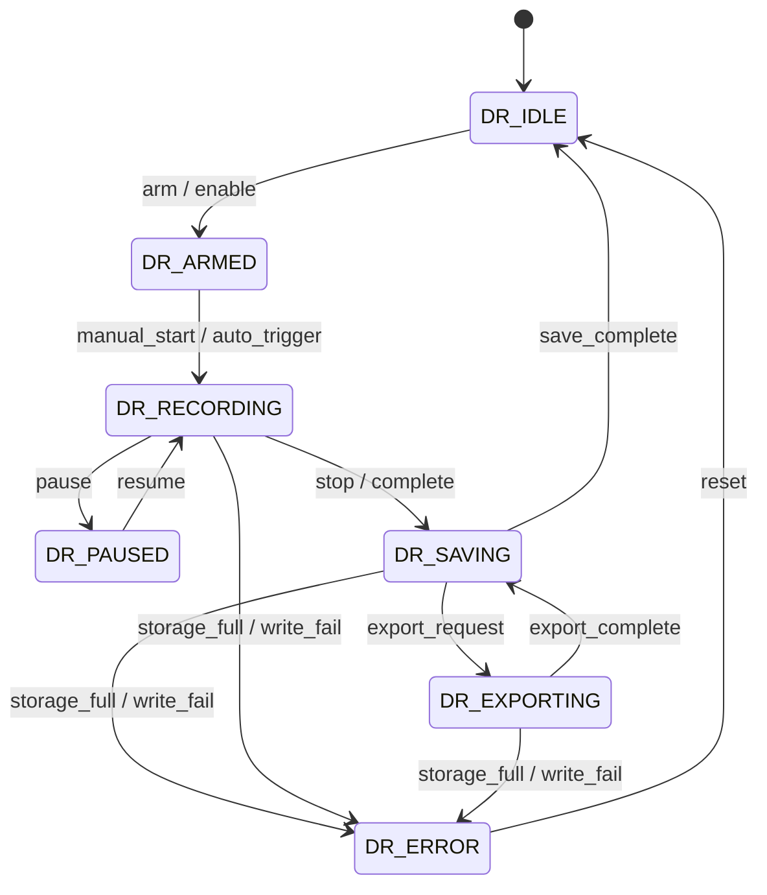
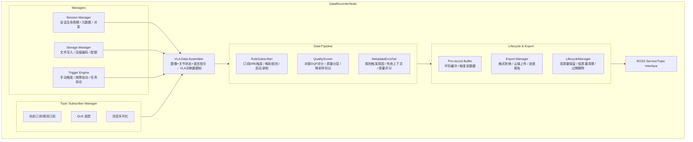
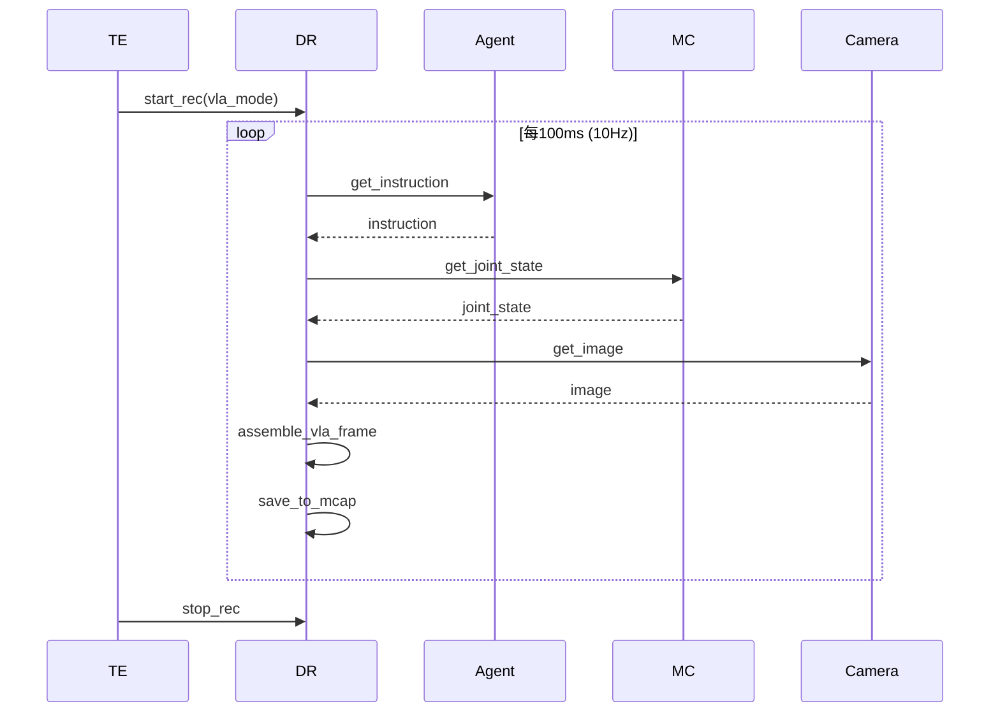

# Data Recorder 模块设计

## 1. 模块概述与定位

**模块名称**：Data Recorder（数据采集）

**定位**：DR 是端侧软件系统中的**数据采集与记录中心**，位于应用层。它负责在机器人运行过程中按需或按策略记录各类数据（传感器原始数据、感知结果、运动指令、状态转换事件、任务执行日志等），支持 VLA 训练数据管理、故障复现分析、性能评估等场景。DR 是机器人"黑匣子"和"训练数据工厂"的结合体。

**核心职责**：

1. **按需录制**：接收来自 TE/Gateway 的录制启动/停止指令，记录指定 Topic 数据
2. **规则引擎驱动采集**：订阅 Data Rule Engine 的触发信号，实现规则驱动的自动采集
3. **自动录制策略**：基于事件触发自动录制（如故障发生前后 30s 自动保存）
4. **VLA 训练数据管理**：按 VLA 格式组织录制数据（图像 + 动作标签 + 语言指令）
5. **数据压缩与存储**：实时压缩（H.264/gzip）并写入磁盘，支持循环录制
6. **数据质量分层存储**：对接 Data Quality Filter 评分，按质量等级分层存储
7. **智能生命周期管理**：高质量数据长期保留，低质量数据自动清理
8. **自动语义标注**：自动附加规则触发原因、失效上下文、数据质量评分
9. **数据检索与导出**：按时间、事件、任务 ID、质量等级检索录制片段，支持导出
10. **存储管理**：监控存储空间，自动清理过期数据
11. **数据标注**：支持录制时附加元数据标注（任务类型、场景标签、操作者注释）

**与相邻模块的边界**：

| 边界 | DR 负责 | 对方负责 |
|------|--------|---------|
| DR ↔ ALL | 订阅并记录各模块的 Topic 数据 | 各模块产生数据 |
| DR ↔ TE | 接收录制启停指令；按任务组织数据 | 任务调度 |
| DR ↔ Gateway | 接收云端录制请求；上传数据到云端 | 云端通信 |
| DR ↔ SM | 订阅状态转换事件用于自动触发 | 状态机决策 |
| DR ↔ HDS | 接收故障事件用于自动保存黑匣子 | 故障诊断 |
| DR ↔ Data Rule Engine | 接收规则触发信号；按规则参数录制 | 规则解析与触发判断 |
| DR ↔ Data Quality Filter | 接收逐帧质量评分；按质量分层存储 | 数据质量评估 |
| DR ↔ Data Uploader | 提供数据资产元数据；通知可清理的本地副本 | 数据上传调度 |
| DR ↔ MC | 接收失效上下文（FailureCaptureBuffer） | 失效状态冻结与捕获 |
| DR ↔ Setting | 读取录制策略、存储路径配置 | 参数持久化 |
| DR ↔ Agent | 接收语言指令用于 VLA 数据标注 | VLA 决策 |

---

## 2. 职责边界

**DR 不做的事情**（红线）：

- **不做实时业务逻辑** — 只记录数据，不基于记录数据做决策
- **不做数据训练** — 数据仅存储和传输，模型训练在云端完成
- **不做数据修改** — 录制数据只读，不提供编辑修改功能
- **不直接连接云端** — 数据上传通过 Gateway
- **不做故障诊断** — 只记录原始数据供 HDS 分析
- **不影响系统性能** — 录制过程不能阻塞被记录模块的正常运行

---

## 3. 状态机设计

### 3.1 录制状态枚举

| 状态 | 值 | 说明 |
|------|-----|------|
| `DR_IDLE` | 0 | 空闲，未录制 |
| `DR_ARMED` | 1 | 已就绪，等待触发条件 |
| `DR_RECORDING` | 2 | 正在录制 |
| `DR_PAUSED` | 3 | 已暂停（可恢复） |
| `DR_SAVING` | 4 | 正在保存/压缩录制文件 |
| `DR_EXPORTING` | 5 | 正在导出数据 |
| `DR_ERROR` | 6 | 录制出错（存储满/写入失败） |

### 3.2 状态转换图



### 3.3 状态转换表

| 当前状态 | 目标状态 | 触发条件 | 优先级 | 说明 |
|----------|----------|----------|--------|------|
| IDLE | ARMED | 收到 arm 指令 | 60 | 准备录制 |
| IDLE | RECORDING | 直接收到 start 指令 | 60 | 立即录制 |
| ARMED | RECORDING | 手动开始或自动触发 | 60 | 开始录制 |
| ARMED | IDLE | disarm 指令 | 50 | 解除就绪 |
| RECORDING | PAUSED | pause 指令 | 70 | 暂停录制 |
| PAUSED | RECORDING | resume 指令 | 70 | 恢复录制 |
| PAUSED | IDLE | stop 指令 | 70 | 停止（丢弃） |
| RECORDING | SAVING | stop 指令或录制完成 | 60 | 开始保存 |
| SAVING | IDLE | 保存完成 | 60 | 回到空闲 |
| SAVING | EXPORTING | 导出请求 | 60 | 导出数据 |
| EXPORTING | IDLE | 导出完成 | 60 | 回到空闲 |
| * | ERROR | 存储满或写入失败 | 80 | 录制错误 |
| ERROR | IDLE | 错误处理完成/人工复位 | 60 | 错误恢复 |

### 3.4 状态转换约束

1. **存储阈值**：磁盘使用率 > 85% → 自动停止新录制，标记 ERROR
2. **循环录制**：支持循环缓冲区模式， oldest 数据自动覆盖
3. **预录缓冲**：ARMED 状态下维护 30s 环形缓冲，触发时可保存触发前数据
4. **并发限制**：最多同时录制 3 个独立会话（不同任务/场景）
5. **状态变更时**发布 `/dr/recorder_state` Topic

---

## 4. ROS2 接口定义

### 4.1 消息定义 (msg)

```
# dr_msgs/msg/RecorderState.msg
# 录制状态广播

uint8 state
uint8 prev_state
builtin_interfaces/Time state_changed_at
string session_id           # 当前录制会话ID
float32 record_duration_sec # 已录制时长（秒）
uint64 bytes_recorded       # 已录制字节数
float32 storage_usage_percent  # 存储使用率
```

```
# dr_msgs/msg/RecordingSession.msg
# 录制会话信息

string session_id
string name
string description
builtin_interfaces/Time started_at
builtin_interfaces/Time stopped_at
float32 duration_sec
uint64 size_bytes
string[] topics_recorded    # 录制的Topic列表
string trigger_type         # 触发类型（"manual", "auto_fault", "auto_task", "scheduled"）
string task_id              # 关联的任务ID
string[] tags               # 标签（用于检索）
bool is_vla_data            # 是否为VLA训练数据
```

```
# dr_msgs/msg/VlaDataFrame.msg
# VLA训练数据帧

builtin_interfaces/Time stamp
sensor_msgs/CompressedImage rgb_image      # RGB图像
sensor_msgs/CompressedImage depth_image    # 深度图像（可选）
float64[] joint_positions   # 当前关节角度（作为动作标签）
float64[] joint_velocities  # 当前关节速度
string language_instruction # 语言指令（如"走到桌子前面"）
string task_phase           # 任务阶段（"start", "middle", "end"）
bool is_keyframe            # 是否关键帧
```

```
# dr_msgs/msg/Heartbeat.msg
# DR 心跳

builtin_interfaces/Time stamp
string node_name
uint8 state
bool healthy
string status_message
float32 storage_usage_percent
```

> **注**：DR 不复用定义 `DataQualityScore.msg`，直接订阅 Data Quality Filter 发布的 `data_quality_msgs/msg/DataQualityScore`（Topic: `/data_quality/score`）。

```
# dr_msgs/msg/FailureContext.msg
# 失效上下文（来自 MC）

string failure_id
builtin_interfaces/Time failure_time
string failure_type
string[] failure_reasons
float64[] joint_positions_before
float64[] joint_velocities_before
float64[] control_commands_before
float64[] sensor_readings_before
string hds_diagnosis_result
builtin_interfaces/Time stamp
```

```
# dr_msgs/msg/DataAssetMetadata.msg
# 数据资产元数据（用于云端导入）

string asset_id
string asset_type
string source_module
string[] tags
float32 quality_score
string rule_trigger_reason
string failure_context_id
string session_id
builtin_interfaces/Time created_at
uint64 size_bytes
string checksum_sha256
string cloud_format_version  # "mifeng_v1" / "coscene_v1"
```

### 4.2 服务定义 (srv)

```
# dr_msgs/srv/GetHealthStatus.srv

# Request（空）
---
# Response
bool success
string node_name
builtin_interfaces/Time uptime_since
uint8 state
bool healthy
string message
float32 storage_usage_percent
```

```
# dr_msgs/srv/StartRecording.srv
# 开始录制

string name                 # 录制名称
string description
string[] topics             # 要录制的Topic列表（空=录制全部）
string trigger_type         # "manual", "auto_fault", "auto_task"
string task_id              # 关联任务ID
string[] tags               # 标签
bool is_vla_mode            # 是否VLA模式
float32 max_duration_sec    # 最大录制时长（0=无限制）
---
# Response
bool success
uint16 error_code
string message
string session_id
```

```
# dr_msgs/srv/StopRecording.srv
# 停止录制

string session_id
---
# Response
bool success
uint16 error_code
string message
RecordingSession session_info
```

```
# dr_msgs/srv/GetRecordingList.srv
# 列出录制会话

string tag_filter           # 标签过滤（空=全部）
builtin_interfaces/Time start_time  # 时间范围开始
builtin_interfaces/Time end_time    # 时间范围结束
---
# Response
bool success
RecordingSession[] sessions
uint32 count
```

```
# dr_msgs/srv/ExportRecording.srv
# 导出录制数据

string session_id
string export_path          # 导出路径
string format               # "rosbag2", "mcap", "hdf5"
---
# Response
bool success
uint16 error_code
string message
uint64 bytes_exported
```

```
# dr_msgs/srv/DeleteRecording.srv
# 删除录制

string session_id
bool confirm
---
# Response
bool success
uint16 error_code
string message
```

```
# dr_msgs/srv/TagRecording.srv
# 为录制添加标签

string session_id
string[] tags_to_add
---
# Response
bool success
uint16 error_code
string message
```

### 4.3 接口汇总表

#### Topics（DR 订阅的内部 Topics——示例）

| 名称 | 类型 | 来源 | 说明 |
|------|------|------|------|
| `/camera/image_raw` | `sensor_msgs/msg/Image` | HAL_Sensor | 原始图像 |
| `/lidar/point_cloud` | `sensor_msgs/msg/PointCloud2` | HAL_Sensor | 原始点云 |
| `/sm/robot_state` | `sm_msgs/msg/RobotState` | SM | 机器人状态 |
| `/sm/transition_event` | `sm_msgs/msg/TransitionEvent` | SM | 状态转换事件 |
| `/te/task_state` | `te_msgs/msg/TaskState` | TE | 任务状态 |
| `/mc/mc_state` | `mc_msgs/msg/McState` | MC | 运动状态 |
| `/pnc/navigation_state` | `pnc_msgs/msg/NavigationState` | PnC | 导航状态 |
| `/perception/result` | `perception_msgs/msg/PerceptionResult` | Perception | 感知结果 |
| `/hds/health_report` | `hds_msgs/msg/HealthReport` | HDS | 健康报告 |

#### Topics（DR 发布）

| 名称 | 类型 | 方向 | QoS | 频率 | 说明 |
|------|------|------|-----|------|------|
| `/dr/recorder_state` | `dr_msgs/msg/RecorderState` | DR → ALL | Reliable + Transient Local + Depth 1 | 事件驱动 | 录制状态广播 |
| `/dr/vla_data_frame` | `dr_msgs/msg/VlaDataFrame` | DR → ALL | Reliable + Volatile + Depth 10 | 10 Hz | VLA数据帧（VLA模式时） |
| `/dr/heartbeat` | `dr_msgs/msg/Heartbeat` | DR → EM/HDS | Reliable + Volatile + Depth 1 | 1 Hz | 心跳 |
| `/data_quality/score` | `data_quality_msgs/msg/DataQualityScore` | DQF → DR | Reliable + Volatile | 1kHz | 逐帧质量评分（DR 复用 DQF 消息定义） |
| `/dr/failure_context` | `dr_msgs/msg/FailureContext` | MC → DR | Reliable + Volatile | 事件驱动 | 失效上下文 |
| `/data_rule_engine/rule_trigger_event` | `data_rule_msgs/msg/RuleTriggerEvent` | DRE → DR | Reliable + Volatile | 事件驱动 | 规则触发信号 |
| `/data_uploader/upload_status` | `data_uploader_msgs/msg/UploadStatus` | DU → DR | Reliable + Volatile | 事件驱动 | 上传完成通知 |

#### Services

| 名称 | 类型 | 调用方 | 说明 |
|------|------|--------|------|
| `/dr/get_health_status` | `dr_msgs/srv/GetHealthStatus` | EM, HDS | 健康查询 |
| `/dr/start_recording` | `dr_msgs/srv/StartRecording` | TE, Gateway | 开始录制 |
| `/dr/stop_recording` | `dr_msgs/srv/StopRecording` | TE, Gateway | 停止录制 |
| `/dr/get_recording_list` | `dr_msgs/srv/GetRecordingList` | Gateway | 列出录制 |
| `/dr/export_recording` | `dr_msgs/srv/ExportRecording` | Gateway | 导出录制 |
| `/dr/delete_recording` | `dr_msgs/srv/DeleteRecording` | Gateway | 删除录制 |
| `/dr/tag_recording` | `dr_msgs/srv/TagRecording` | TE, Gateway | 添加标签 |

---

## 5. 内部设计

### 5.1 节点架构



### 5.2 关键设计决策

1. **零拷贝录制**：使用 ROS2 的 loaned message 机制，避免消息序列化时的内存拷贝
2. **mcap 格式**：使用 mcap 作为默认录制格式（高性能、跨语言、支持索引）
3. **压缩策略**：图像使用 H.264 硬件编码，点云使用 LZ4 压缩，其他数据 gzip
4. **异步写入**：录制数据先写入内存缓冲，后台线程异步刷盘，避免阻塞订阅回调
5. **VLA 帧对齐**：VLA 模式下按固定 10Hz 对齐图像和关节状态，语言指令通过 Service 注入
6. **规则驱动采集**：RuleSubscriber 接收 Data Rule Engine 触发信号，自动启动带标签和时长的录制
7. **质量分层存储**：QualityScorer 对接 Data Quality Filter，按 overall_score 将数据分为高质量(≥0.8)/中质量/低质量(<0.5)三级目录
8. **自动语义标注**：MetadataEnricher 在录制完成后自动附加规则触发原因、失效上下文、质量评分到数据资产元数据
9. **智能生命周期**：LifecycleManager 按质量等级设置不同的保留策略，高质量数据保留90天，低质量数据7天后自动清理
10. **云端标准格式**：导出时支持觅蜂(mifeng_v1)和刻行(coScene_v1)标准格式，支持直接导入云端数据平台

### 5.3 关键流程

#### 5.3.1 录制启动流程

```
TE/Gateway 调用 /dr/start_recording
  → Session Manager 创建新会话
  → Storage Manager 检查存储空间
    → 空间不足 → 返回 ERR_STORAGE_FULL
  → Topic Subscriber Manager 订阅指定 Topics
    → 动态创建订阅者，QoS 与源 Topic 匹配
  → Trigger Engine 设置触发条件（如自动停止时间）
  → 状态变为 RECORDING
  → 发布 /dr/recorder_state
  → 开始接收并缓存消息
```

#### 5.3.2 故障自动触发流程

```
HDS 发布故障事件
  → Trigger Engine 收到故障信号
  → 若当前为 ARMED 状态：
      → 自动启动录制
      → 保存预录缓冲区中触发前 30s 的数据
      → 继续录制触发后 60s
      → 自动停止并保存
      → 标记 trigger_type = "auto_fault"
      → 上报 Gateway 有黑匣子数据待查看
```

#### 5.3.3 VLA 数据录制流程

```
TE 启动 VLA 任务
  → 调用 /dr/start_recording (is_vla_mode=true)
  → VLA Data Assembler 启动 10Hz 定时器
  → 每 100ms：
      → 获取最新图像帧
      → 获取最新关节状态（从 /mc/mc_state）
      → 获取最新语言指令（从 Agent）
      → 对齐时间戳
      → 封装为 VlaDataFrame
      → 发布 /dr/vla_data_frame
      → 写入 mcap 文件
  → 任务结束：
      → 停止录制
      → 生成 VLA 数据集元数据（JSON）
      → 保存到 /opt/robot/data/vla/
```

#### 5.3.4 规则驱动录制流程（新增）

```
Data Rule Engine 发布 RuleTriggerEvent
  → RuleSubscriber 接收触发信号
    → 解析规则参数（duration_before, duration_after, tags, priority）
    → 若当前有冲突录制：
        → 高优先级规则中断低优先级录制
        → 低优先级规则排队等待
    → 启动录制会话
      → session_name = "rule_{rule_id}_{timestamp}"
      → tags 附加规则名称和触发原因
      → trigger_type = "rule_engine"
    → 若规则指定 auto_upload=true：
        → 录制完成后自动通知 Data Uploader
```

#### 5.3.5 质量分层存储流程（新增）

```
录制过程中接收 DataQualityFilter 的 DataQualityScore
  → QualityScorer 按 overall_score 分级：
    → score ≥ 0.8：高质量 → 存入 /data/high_quality/
    → 0.5 ≤ score < 0.8：中等质量 → 存入 /data/medium_quality/
    → score < 0.5：低质量 → 存入 /data/low_quality/（或丢弃）
  → is_dirty == true：强制丢弃该帧
  → is_redundant == true：降采样保留（每5帧保留1帧）
  → 每帧的质量评分写入 mcap 附件或 sidecar JSON
```

#### 5.3.6 失效上下文录制流程（新增）

```
MC 检测到异常 → 触发 E-Stop
  → MC 将 FailureCaptureBuffer 写入 /dr/failure_context Topic
  → DR 接收 FailureContext 消息
    → MetadataEnricher 将失效上下文附加到当前录制会话
    → 自动标记 tag: ["failure", "auto_capture", "high_value"]
    → quality_score = 1.0（失效数据为最高价值）
    → 通知 Data Rule Engine 触发 failure_capture 规则
    → 若当前未录制：启动紧急录制（前后各30秒）
    → 标记为 priority=CRITICAL，通知 Data Uploader 优先上传
```

---

## 6. 与其他模块的交互

### 6.1 交互矩阵

| 模块 | 方向 | 接口 | 说明 |
|------|------|------|------|
| ALL | ALL → DR | 各模块 Topic（动态订阅） | 被录制数据 |
| TE | TE → DR | `/dr/start_recording` (Service) | 启动录制 |
| TE | TE → DR | `/dr/stop_recording` (Service) | 停止录制 |
| Gateway | Gateway → DR | `/dr/start_recording` (Service) | 云端触发录制 |
| Gateway | Gateway → DR | `/dr/export_recording` (Service) | 导出数据 |
| Gateway | DR → Gateway | `/dr/recorder_state` (Topic) | 录制状态同步 |
| SM | SM → DR | `/sm/transition_event` (Topic) | 状态转换事件记录 |
| HDS | HDS → DR | `/hds/health_report` (Topic) | 故障自动触发录制 |
| Agent | Agent → DR | `/dr/vla_data_frame` 注入 | VLA 语言指令 |
| Data Rule Engine | DRE → DR | `/data_rule_engine/rule_trigger_event` (Topic) | 规则驱动录制触发 |
| Data Quality Filter | DQF → DR | `/data_quality/score` (Topic) | 逐帧质量评分 |
| Data Uploader | DU → DR | `/data_uploader/upload_status` (Topic) | 上传完成通知（可清理本地副本） |
| MC | MC → DR | `/dr/failure_context` (Topic) | 失效上下文数据 |
| Setting | DR → Setting | `/setting/get_parameter` (Service) | 读取录制配置 |
| EM | EM → DR | `/dr/get_health_status` (Service) | 健康检查 |

### 6.2 关键交互时序

#### 时序：VLA 数据录制



---

## 7. 关键参数与配置

| 参数名 | 类型 | 默认值 | 说明 |
|--------|------|--------|------|
| `data_directory` | string | "/opt/robot/data/recordings/" | 录制数据根目录 |
| `max_storage_bytes` | int64 | 107374182400 | 最大存储配额（100GB） |
| `default_record_duration_sec` | float | 300.0 | 默认录制时长（秒） |
| `pre_record_buffer_sec` | float | 30.0 | 预录缓冲区时长（秒） |
| `auto_record_on_fault` | bool | true | 故障时自动录制 |
| `auto_record_duration_sec` | float | 90.0 | 自动录制时长（故障前后） |
| `compression_codec` | string | "lz4" | 压缩编码（lz4/zstd/none） |
| `image_compression` | string | "h264" | 图像压缩（h264/mjpeg/none） |
| `vla_frame_rate` | float | 10.0 | VLA 数据帧率 |
| `max_concurrent_sessions` | int | 3 | 最大并发录制会话数 |
| `retention_days` | int | 30 | 数据保留天数（默认） |
| `high_quality_retention_days` | int | 90 | 高质量数据保留天数 |
| `low_quality_retention_days` | int | 7 | 低质量数据保留天数 |
| `quality_score_threshold_high` | float | 0.8 | 高质量阈值 |
| `quality_score_threshold_low` | float | 0.5 | 低质量阈值 |
| `enable_rule_driven_recording` | bool | true | 是否启用规则驱动采集 |
| `enable_metadata_enrichment` | bool | true | 是否启用自动语义标注 |
| `cloud_format_support` | string[] | ["mifeng_v1", "coscene_v1"] | 支持的云端导出格式 |
| `lifecycle_scan_interval_min` | int | 60 | 生命周期扫描间隔（分钟） |

---

## 8. 错误码定义

```
# dr_msgs/msg/ErrorCode.msg
uint16 OK                        = 0
uint16 ERR_STORAGE_FULL          = 13001   # 存储空间已满
uint16 ERR_WRITE_FAILED          = 13002   # 文件写入失败
uint16 ERR_INVALID_TOPIC         = 13003   # 非法Topic名
uint16 ERR_SESSION_NOT_FOUND     = 13004   # 会话不存在
uint16 ERR_EXPORT_FAILED         = 13005   # 导出失败
uint16 ERR_COMPRESSION_FAILED    = 13006   # 压缩失败
uint16 ERR_TOO_MANY_SESSIONS     = 13007   # 并发会话过多
uint16 ERR_INVALID_FORMAT        = 13008   # 非法导出格式
uint16 ERR_DELETE_FAILED         = 13009   # 删除失败
uint16 ERR_VLA_ASSEMBLE_FAILED   = 13010   # VLA数据组装失败
uint16 ERR_ALREADY_RECORDING     = 13011   # 已在录制中
uint16 ERR_NOT_RECORDING         = 13012   # 未在录制中
```

| 错误码 | 常量名 | 说明 | 严重级别 |
|--------|--------|------|----------|
| 0 | OK | 成功 | — |
| 13001 | ERR_STORAGE_FULL | 存储空间已满 | HIGH |
| 13002 | ERR_WRITE_FAILED | 文件写入失败 | HIGH |
| 13003 | ERR_INVALID_TOPIC | 非法Topic名 | LOW |
| 13004 | ERR_SESSION_NOT_FOUND | 会话不存在 | MEDIUM |
| 13005 | ERR_EXPORT_FAILED | 导出失败 | MEDIUM |
| 13006 | ERR_COMPRESSION_FAILED | 压缩失败 | MEDIUM |
| 13007 | ERR_TOO_MANY_SESSIONS | 并发会话过多 | MEDIUM |
| 13008 | ERR_INVALID_FORMAT | 非法导出格式 | LOW |
| 13009 | ERR_DELETE_FAILED | 删除失败 | LOW |
| 13010 | ERR_VLA_ASSEMBLE_FAILED | VLA数据组装失败 | MEDIUM |
| 13011 | ERR_ALREADY_RECORDING | 已在录制中 | LOW |
| 13012 | ERR_NOT_RECORDING | 未在录制中 | LOW |
| 13013 | ERR_RULE_TRIGGER_INVALID | 规则触发参数非法 | MEDIUM |
| 13014 | ERR_QUALITY_SCORE_MISSING | 质量评分数据缺失 | LOW |
| 13015 | ERR_LIFECYCLE_CLEAN_FAILED | 生命周期清理失败 | MEDIUM |
| 13016 | ERR_METADATA_ENRICH_FAILED | 元数据增强失败 | LOW |
| 13017 | ERR_CLOUD_FORMAT_EXPORT_FAILED | 云端标准格式导出失败 | MEDIUM |

---

## 9. 安全约束

1. **零干扰原则**：录制过程不能增加被记录 Topic 的发布延迟（使用独立线程和零拷贝）
2. **存储隔离**：录制数据目录与其他系统目录隔离，避免写满根分区
3. **数据完整性**：mcap 文件写入时计算 CRC，损坏文件自动标记并跳过
4. **隐私保护**：录制图像时自动模糊人脸（如配置启用），隐私区域不记录
5. **访问控制**：录制数据文件权限设为只读（644），防止运行时意外修改
6. **循环录制保护**：循环模式保留至少 10% 存储空间作为安全余量

---

## 10. 包结构

```
dr_msgs/                # 消息定义包
    msg/
        RecorderState.msg
        RecordingSession.msg
        VlaDataFrame.msg
        FailureContext.msg
        DataAssetMetadata.msg
        Heartbeat.msg
    srv/
        GetHealthStatus.srv
        StartRecording.srv
        StopRecording.srv
        GetRecordingList.srv
        ExportRecording.srv
        DeleteRecording.srv
        TagRecording.srv
    CMakeLists.txt
    package.xml

dr/                     # 节点实现包
    include/dr/
        dr_node.hpp
        topic_subscriber_manager.hpp
        session_manager.hpp
        storage_manager.hpp
        trigger_engine.hpp
        vla_data_assembler.hpp
        pre_record_buffer.hpp
        export_manager.hpp
        rule_subscriber.hpp
        quality_scorer.hpp
        metadata_enricher.hpp
        lifecycle_manager.hpp
    src/
        dr_node.cpp
        topic_subscriber_manager.cpp
        session_manager.cpp
        storage_manager.cpp
        trigger_engine.cpp
        vla_data_assembler.cpp
        pre_record_buffer.cpp
        export_manager.cpp
        rule_subscriber.cpp
        quality_scorer.cpp
        metadata_enricher.cpp
        lifecycle_manager.cpp
        main.cpp
    test/
        test_storage_manager.cpp
        test_vla_assembler.cpp
        test_trigger_engine.cpp
        test_integration.cpp
    config/
        dr_params.yaml
    launch/
        dr.launch.py
    CMakeLists.txt
    package.xml
```

---

## 11. 关键性能指标 (KPI)

| 指标 | 目标值 | 说明 |
|------|--------|------|
| 录制零延迟增加 | < 1ms | 对被记录 Topic 的延迟影响 |
| 写入吞吐量 | > 500MB/s | 持续写入磁盘速度 |
| 压缩率 | > 3x | 压缩后/压缩前大小比 |
| 存储配额告警 | > 85% | 触发告警的阈值 |
| VLA 帧对齐精度 | < 20ms | 图像与关节状态时间差 |
| 预录触发响应 | < 100ms | 从触发到开始保存预录数据 |
| 并发录制会话 | >= 3 | 同时进行的录制数 |
| 数据保留完整性 | > 99.9% | 正常录制数据不损坏 |
| 故障自动录制成功率 | > 95% | 故障触发自动录制的成功率 |
| 规则触发响应延迟 | < 50ms | 从规则触发到开始录制 |
| 质量评分处理延迟 | < 1ms | 单帧质量评分处理 |
| 元数据增强成功率 | > 99% | 录制后自动附加元数据 |
| CPU 占用 | < 10% | 全速录制时 |
| 内存占用 | < 512MB | 含预录缓冲区 |

---

## 12. 数据生命周期管理（新增）

### 12.1 分层存储策略

DR 根据 Data Quality Filter 的 `overall_score` 将录制数据分为三层存储：

```
/opt/robot/data/
    high_quality/        # score >= 0.8
        vla_training/
        failure_blackbox/
        operation_log/
    medium_quality/      # 0.5 <= score < 0.8
        ...
    low_quality/         # score < 0.5
        ...
```

### 12.2 保留策略

| 质量等级 | 保留天数 | 存储空间紧张时 |
|---------|---------|---------------|
| 高质量（failure_blackbox） | 180天 | 永不自动删除 |
| 高质量（vla_training） | 90天 | 上传云端后可删除 |
| 中等质量 | 30天 | 优先删除 |
| 低质量 | 7天 | 立即删除 |

### 12.3 清理流程

```
LifecycleManager 每小时扫描一次存储目录
    ↓
按质量等级和创建时间排序
    ↓
超出保留期的数据 → 标记为待清理
    ↓
已上传云端的数据 → 优先清理
    ↓
存储使用率 > 90% → 紧急清理低质量数据
    ↓
存储使用率 > 95% → 暂停新录制，清理中等质量数据
    ↓
记录清理日志（清理了哪些数据、释放了多少空间）
```

### 12.4 云端格式导出

DR 支持将录制数据导出为云端数据平台的标准格式：

**觅蜂格式（mifeng_v1）**：
- 视频：H.265 MP4，1080p
- 点云：LAS 格式
- 关节状态：CSV
- 元数据：JSON（含规则触发原因、质量评分、失效上下文）

**刻行格式（coscene_v1）**：
- 统一 MCAP 容器
- 附加 coScene 标签规范
- 支持场景切片和事件标记
