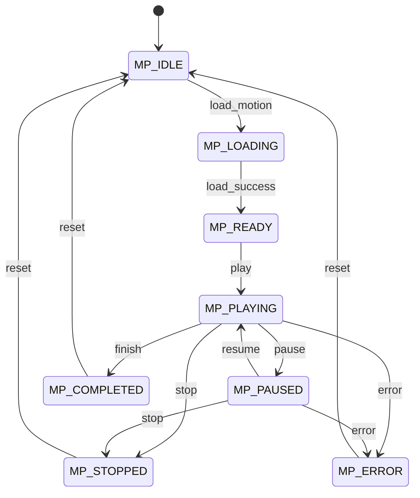
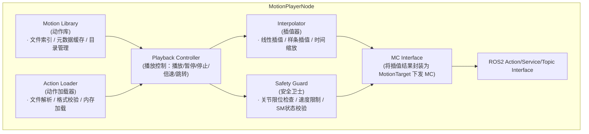

# Motion Player 模块设计

## 1. 模块概述与定位

**模块名称**：Motion Player（动作播放器）

**定位**：MP 是端侧软件系统中的**预录动作序列执行器**，位于运动层。它接收来自 TE（任务引擎）的动作播放请求，从动作库中读取预录制的关节角度/力矩序列（如挥手、鞠躬、舞蹈、起身等），按时间戳逐帧执行，将运动指令下发给 MC（Motion Control）。MP 是"播放预录视频"的概念在运动控制中的体现，强调动作的精确复现而非实时生成。

**核心职责**：

1. **动作库管理**：维护预录动作文件（JSON/Binary），支持按名称/ID索引
2. **动作加载**：从磁盘加载动作序列到内存，解析关键帧和时间戳
3. **动作播放**：按时间戳逐帧插值，生成平滑的运动轨迹
4. **播放控制**：支持播放、暂停、停止、倍速、跳转、循环
5. **与 MC 协同**：将插值后的关节目标下发给 MC，由 MC 执行底层控制
6. **进度反馈**：向 TE 上报播放进度和完成状态
7. **混合动作**：支持上下半身动作分离和混合（如上半身挥手 + 下半身站立）

**与相邻模块的边界**：

| 边界 | MP 负责 | 对方负责 |
|------|--------|---------|
| MP ↔ TE | 接收动作播放请求；上报进度/完成 | 任务调度、动作选择 |
| MP ↔ MC | 下发插值后的关节目标轨迹 | 底层关节控制、力矩伺服 |
| MP ↔ SM | 播放前查询 is_motion_allowed | 全局状态机、运动许可 |
| MP ↔ HDS | 上报动作执行异常 | 故障诊断与定级 |
| MP ↔ Setting | 读取动作库路径、播放参数 | 参数持久化 |

---

## 2. 职责边界

**MP 不做的事情**（红线）：

- **不做实时运动生成** — 不生成实时步态或平衡控制，那是 MC/MS 的职责
- **不做路径规划** — 不计算导航路径，那是 PnC 的职责
- **不做感知识别** — 不根据环境感知调整动作，动作序列是预录的
- **不直接操作硬件** — 不直接发送 EtherCAT 指令，通过 MC 下发
- **不做状态机决策** — 播放前查询 SM，但不决定状态转换
- **跳过 SM 校验** — 任何动作下发前必须调用 `/sm/is_motion_allowed`

---

## 3. 状态机设计

### 3.1 播放状态枚举

| 状态 | 值 | 说明 |
|------|-----|------|
| `MP_IDLE` | 0 | 空闲，无播放任务 |
| `MP_LOADING` | 1 | 正在加载动作文件 |
| `MP_READY` | 2 | 动作已加载，等待播放指令 |
| `MP_PLAYING` | 3 | 正在播放 |
| `MP_PAUSED` | 4 | 已暂停（可恢复） |
| `MP_COMPLETED` | 5 | 播放正常完成 |
| `MP_STOPPED` | 6 | 被主动停止 |
| `MP_ERROR` | 7 | 播放出错（文件损坏/插值失败等） |

### 3.2 状态转换图



### 3.3 状态转换表

| 当前状态 | 目标状态 | 触发条件 | 优先级 | 说明 |
|----------|----------|----------|--------|------|
| IDLE | LOADING | TE 请求播放动作 | 60 | 开始加载 |
| LOADING | READY | 动作文件解析成功 | 60 | 准备播放 |
| LOADING | ERROR | 文件损坏或解析失败 | 70 | 加载失败 |
| READY | PLAYING | TE 发送 Play 指令 | 60 | 开始播放 |
| READY | IDLE | TE 取消 / 超时 | 50 | 取消任务 |
| PLAYING | PAUSED | TE 发送 Pause 指令 | 80 | 暂停 |
| PLAYING | COMPLETED | 播放到最后一帧 | 60 | 正常完成 |
| PLAYING | STOPPED | TE 发送 Stop 指令 | 90 | 主动停止 |
| PLAYING | ERROR | 插值异常或关节超限 | 80 | 播放出错 |
| PAUSED | PLAYING | TE 发送 Resume 指令 | 80 | 恢复播放 |
| PAUSED | STOPPED | TE 发送 Stop 指令 | 90 | 从暂停停止 |
| COMPLETED | IDLE | 自动返回（1s 后） | 50 | 完成复位 |
| STOPPED | IDLE | 自动返回（1s 后） | 50 | 停止复位 |
| ERROR | IDLE | 错误处理后复位 | 60 | 错误复位 |
| * | STOPPED | SM 状态变为非运动允许 / E-Stop | 100 | 最高优先级急停 |

### 3.4 状态转换约束

1. **E-Stop 立即响应**：收到 `/sm/robot_state` 变为非运动允许状态时，立即转入 STOPPED，无论当前状态
2. **加载超时**：LOADING 状态超过 5s 未就绪 → 自动转入 ERROR
3. **关节限位保护**：插值结果超出关节物理限位 → 该帧裁剪到限位并上报 WARNING
4. **速度限制**：插值生成的关节角速度不得超过 Setting 中配置的 `max_joint_velocity`
5. **状态变更时**发布 `/mp/motion_player_state` Topic

---

## 4. ROS2 接口定义

### 4.1 消息定义 (msg)

```
# mp_msgs/msg/MotionPlayerState.msg
# 播放器状态广播

uint8 state                 # 当前状态
uint8 prev_state
builtin_interfaces/Time state_changed_at
string current_motion_id    # 当前播放的动作ID
string current_motion_name  # 当前播放的动作名称
float32 progress_percent    # 播放进度（0.0-100.0）
float32 playback_speed      # 当前播放倍速
uint32 current_frame        # 当前帧号
uint32 total_frames         # 总帧数
```

```
# mp_msgs/msg/MotionFrame.msg
# 单帧动作数据

builtin_interfaces/Time stamp          # 该帧的时间戳（相对动作开始）
float64[] joint_positions   # 关节角度（rad）
float64[] joint_velocities  # 关节角速度（rad/s），可选
float64[] joint_efforts     # 关节力矩（Nm），可选
string[] joint_names        # 关节名称，与数组对应
bool[] active_joints        # 哪些关节在此帧激活
```

```
# mp_msgs/msg/MotionCatalog.msg
# 动作目录项

string motion_id            # 动作唯一ID
string name                 # 动作名称
string description
float32 duration_sec        # 动作时长（秒）
uint32 frame_count          # 帧数
string[] required_states    # 执行需要的SM状态列表
float32 complexity_score    # 复杂度评分
bool is_loopable            # 是否可循环
```

```
# mp_msgs/msg/Heartbeat.msg
# MP 心跳

builtin_interfaces/Time stamp
string node_name
uint8 state
bool healthy
string status_message
```

### 4.2 Action 定义 (action)

MP 使用 ROS2 Action 与 TE 交互，支持长耗时操作和进度反馈：

```
# mp_msgs/action/PlayMotion.action
# 播放动作（长耗时操作）

# Goal
string motion_id            # 要播放的动作ID
string motion_name          # 动作名称（motion_id为空时按名称查找）
float32 playback_speed      # 播放倍速（1.0=正常，2.0=二倍速，0.5=半速）
bool loop                   # 是否循环播放
uint32 loop_count           # 循环次数（0=无限循环）
uint8 priority              # 优先级（用于冲突仲裁）

---
# Result
bool success
uint16 error_code
string message
uint32 frames_played
builtin_interfaces/Time actual_duration

---
# Feedback
uint8 state                 # 当前播放状态
float32 progress_percent
uint32 current_frame
uint32 total_frames
string current_phase        # 当前阶段描述
```

### 4.3 服务定义 (srv)

```
# mp_msgs/srv/GetHealthStatus.srv

# Request（空）
---
# Response
bool success
string node_name
builtin_interfaces/Time uptime_since
uint8 state
bool healthy
string message
```

```
# mp_msgs/srv/GetMotionCatalog.srv
# 查询动作目录

# Request（空）
---
# Response
bool success
MotionCatalog[] motions
uint32 count
```

```
# mp_msgs/srv/GetMotionInfo.srv
# 查询动作详情

string motion_id
---
# Response
bool success
MotionCatalog info
MotionFrame preview_frame   # 预览首帧
```

```
# mp_msgs/srv/StopMotion.srv
# 立即停止当前播放

bool emergency              # 是否急停（true=立即停止，false=减速停止）
---
# Response
bool stopped
uint16 error_code
string message
```

### 4.4 接口汇总表

#### Topics

| 名称 | 类型 | 方向 | QoS | 频率 | 说明 |
|------|------|------|-----|------|------|
| `/mp/motion_player_state` | `mp_msgs/msg/MotionPlayerState` | MP → ALL | Reliable + Transient Local + Depth 1 | 事件驱动 | 播放状态广播 |
| `/mp/heartbeat` | `mp_msgs/msg/Heartbeat` | MP → EM/HDS | Reliable + Volatile + Depth 1 | 1 Hz | 心跳 |

#### Actions

| 名称 | 类型 | 调用方 | 说明 |
|------|------|--------|------|
| `/mp/play_motion` | `mp_msgs/action/PlayMotion` | TE | 播放动作（长耗时） |

#### Services

| 名称 | 类型 | 调用方 | 说明 |
|------|------|--------|------|
| `/mp/get_health_status` | `mp_msgs/srv/GetHealthStatus` | EM, HDS | 健康查询 |
| `/mp/get_motion_catalog` | `mp_msgs/srv/GetMotionCatalog` | TE, Gateway | 查询动作目录 |
| `/mp/get_motion_info` | `mp_msgs/srv/GetMotionInfo` | TE, Gateway | 查询动作详情 |
| `/mp/stop_motion` | `mp_msgs/srv/StopMotion` | TE, SM(E-Stop) | 停止播放 |

#### 下发给 MC 的 Topics

| 名称 | 类型 | 说明 |
|------|------|------|
| `/mc/motion_target` | `mc_msgs/msg/MotionTarget` | 插值后的关节目标（逐帧） |

---

## 5. 内部设计

### 5.1 节点架构



### 5.2 关键设计决策

1. **动作文件格式**：采用自定义二进制格式（紧凑、快速解析），支持 JSON 导出/导入用于编辑
2. **插值策略**：关节角度使用三次样条插值保证平滑；支持时间缩放（倍速播放）
3. **部分身体播放**：动作文件可标记 `lower_body` / `upper_body` 标志，支持只播上半身或下半身
4. **优先级仲裁**：多个播放请求同时到达时，按 priority 排序，高优先级可抢占低优先级
5. **播放缓冲**：预加载后 1s 的动作帧到内存，避免磁盘 I/O 抖动

### 5.3 关键流程

#### 5.3.1 动作播放流程

```
TE 发送 PlayMotion Action Goal
  → MP 接收 Goal
  → Safety Guard:
      1. 调用 /sm/is_motion_allowed 查询当前状态
         → 不允许 → 拒绝 Goal，返回 ERR_MOTION_NOT_ALLOWED
      2. 检查 motion_id 是否存在
         → 不存在 → 返回 ERR_MOTION_NOT_FOUND
      3. 检查当前SM状态是否在动作 required_states 列表中
         → 不在 → 返回 ERR_INVALID_STATE
  → Action Loader 加载动作文件到内存
    → 解析失败 → 返回 ERR_LOAD_FAILED
  → 状态变为 READY
  → Interpolator 开始逐帧插值
    → 每帧插值结果经 Safety Guard 检查（限位、速度）
    → 封装为 MotionTarget 发布到 /mc/motion_target
    → 发送 Feedback 给 TE（progress_percent）
  → 播放到最后一帧
    → 状态变为 COMPLETED
    → 发送 Result 给 TE
    → 1s 后自动返回 IDLE
```

#### 5.3.2 E-Stop 响应流程

```
SM 发布 /sm/robot_state (ACTIVE_E_STOP)
  → MP 订阅收到（独立回调组，不阻塞）
  → 无论当前状态（PLAYING/PAUSED/READY），立即转入 STOPPED
  → 发送 Stop 指令给 MC（紧急停止当前动作）
  → 取消当前 PlayMotion Action（发送取消信号给 TE）
  → 清空插值缓冲区
  → 1s 后自动返回 IDLE
```

#### 5.3.3 动作混合流程

```
TE 请求同时播放两个动作（上半身 + 下半身）
  → MP 解析两个动作文件
  → 检查两个动作的 active_joints 是否有重叠
    → 有重叠 → 拒绝，返回 ERR_JOINT_CONFLICT
    → 无重叠 → 合并两个动作帧
  → Interpolator 对两个动作分别插值
  → 合并为单帧 MotionTarget（取并集的关节目标）
  → 下发给 MC
```

---

## 6. 与其他模块的交互

### 6.1 交互矩阵

| 模块 | 方向 | 接口 | 说明 |
|------|------|------|------|
| TE | TE → MP | `/mp/play_motion` (Action) | 播放动作请求 |
| TE | MP → TE | Action Feedback/Result | 进度和结果上报 |
| TE | TE → MP | `/mp/stop_motion` (Service) | 停止播放 |
| MC | MP → MC | `/mc/motion_target` (Topic) | 插值后的关节目标 |
| SM | MP → SM | `/sm/is_motion_allowed` (Service) | 运动前状态校验 |
| SM | SM → MP | `/sm/robot_state` (Topic) | 订阅状态，E-Stop响应 |
| HDS | MP → HDS | `/hds/report_diagnosis` (Service) | 上报执行异常 |
| Setting | MP → Setting | `/setting/get_parameter` (Service) | 读取动作库路径、速度限制 |
| Gateway | Gateway → MP | `/mp/get_motion_catalog` (Service) | APP查询动作目录 |
| EM | EM → MP | `/mp/get_health_status` (Service) | 健康检查 |

### 6.2 关键交互时序

#### 时序：动作播放与急停

```mermaid
sequenceDiagram
    participant TE
    participant MP
    participant SM
    participant MC
    TE->>MP: PlayMotion
    MP->>SM: is_motion_allowed
    SM-->>MP: allowed
    MP->>MP: load_motion
    MP-->>TE: Feedback (progress)
    MP->>MC: motion_target
    MP-->>TE: Feedback (progress)
    SM-->>MP: robot_state (E_STOP)
    MP->>MC: STOP
    MP-->>TE: Cancelled
``````

---

## 7. 关键参数与配置

| 参数名 | 类型 | 默认值 | 说明 |
|--------|------|--------|------|
| `motion_library_path` | string | "/opt/robot/motions/" | 动作库目录 |
| `default_playback_speed` | float | 1.0 | 默认播放倍速 |
| `max_playback_speed` | float | 3.0 | 最大播放倍速 |
| `min_playback_speed` | float | 0.1 | 最小播放倍速 |
| `interpolation_type` | string | "cubic_spline" | 插值类型（linear/cubic_spline） |
| `max_joint_velocity` | float | 3.0 | 最大关节角速度（rad/s） |
| `max_joint_acceleration` | float | 10.0 | 最大关节角加速度（rad/s²） |
| `preload_buffer_frames` | int | 30 | 预加载缓冲帧数 |
| `motion_file_extension` | string | ".motion" | 动作文件扩展名 |
| `priority_preempt_enabled` | bool | true | 是否启用高优先级抢占 |

---

## 8. 错误码定义

```
# mp_msgs/msg/ErrorCode.msg
uint16 OK                        = 0
uint16 ERR_MOTION_NOT_FOUND      = 7001   # 动作不存在
uint16 ERR_LOAD_FAILED           = 7002   # 动作加载失败
uint16 ERR_MOTION_NOT_ALLOWED    = 7003   # SM不允许运动
uint16 ERR_INVALID_STATE         = 7004   # 当前SM状态不允许此动作
uint16 ERR_PLAYBACK_ERROR        = 7005   # 播放过程出错
uint16 ERR_INTERPOLATION_FAILED  = 7006   # 插值失败
uint16 ERR_JOINT_LIMIT_EXCEEDED  = 7007   # 超出关节限位
uint16 ERR_VELOCITY_EXCEEDED     = 7008   # 超出速度限制
uint16 ERR_JOINT_CONFLICT        = 7009   # 动作关节冲突
uint16 ERR_ALREADY_PLAYING       = 7010   # 已有动作正在播放
uint16 ERR_INVALID_SPEED         = 7011   # 非法播放倍速
uint16 ERR_FILE_CORRUPTED        = 7012   # 动作文件损坏
```

| 错误码 | 常量名 | 说明 | 严重级别 |
|--------|--------|------|----------|
| 0 | OK | 成功 | — |
| 7001 | ERR_MOTION_NOT_FOUND | 动作不存在 | MEDIUM |
| 7002 | ERR_LOAD_FAILED | 动作加载失败 | MEDIUM |
| 7003 | ERR_MOTION_NOT_ALLOWED | SM不允许运动 | HIGH |
| 7004 | ERR_INVALID_STATE | 当前状态不允许此动作 | MEDIUM |
| 7005 | ERR_PLAYBACK_ERROR | 播放过程出错 | HIGH |
| 7006 | ERR_INTERPOLATION_FAILED | 插值失败 | HIGH |
| 7007 | ERR_JOINT_LIMIT_EXCEEDED | 超出关节限位 | HIGH |
| 7008 | ERR_VELOCITY_EXCEEDED | 超出速度限制 | HIGH |
| 7009 | ERR_JOINT_CONFLICT | 动作关节冲突 | MEDIUM |
| 7010 | ERR_ALREADY_PLAYING | 已有动作正在播放 | LOW |
| 7011 | ERR_INVALID_SPEED | 非法播放倍速 | LOW |
| 7012 | ERR_FILE_CORRUPTED | 动作文件损坏 | MEDIUM |

---

## 9. 安全约束

1. **SM 校验强制**：每一帧下发前必须确认当前 SM 状态允许运动，不允许缓存状态
2. **关节限位硬保护**：任何插值结果超出关节物理限位 → 裁剪到限位并上报 WARNING
3. **速度限制**：插值生成的关节速度不得超过 `max_joint_velocity`，超过则降低插值密度
4. **E-Stop 独立回调组**：订阅 `/sm/robot_state` 使用独立 CallbackGroup，确保 E-Stop 不被播放循环阻塞
5. **急停后复位**：E-Stop 触发后，MP 必须清空所有插值缓冲，返回 IDLE 后才可接受新任务
6. **动作签名验证**：动作文件必须携带校验和，加载前验证完整性

---

## 10. 包结构

```
mp_msgs/                # 消息定义包
- msg/
    - MotionPlayerState.msg
    - MotionFrame.msg
    - MotionCatalog.msg
    - Heartbeat.msg
- srv/
    - GetHealthStatus.srv
    - GetMotionCatalog.srv
    - GetMotionInfo.srv
    - StopMotion.srv
- action/
    - PlayMotion.action
- CMakeLists.txt
- package.xml

mp/                     # 节点实现包
- include/mp/
    - mp_node.hpp
    - motion_library.hpp
    - action_loader.hpp
    - playback_controller.hpp
    - interpolator.hpp
    - safety_guard.hpp
- src/
    - mp_node.cpp
    - motion_library.cpp
    - action_loader.cpp
    - playback_controller.cpp
    - interpolator.cpp
    - safety_guard.cpp
    - main.cpp
- test/
    - test_interpolator.cpp
    - test_safety_guard.cpp
    - test_playback_controller.cpp
    - test_integration.cpp
- config/
    - mp_params.yaml
- launch/
    - mp.launch.py
- motions/                   # 预置动作文件（示例）
    - wave.motion
    - bow.motion
    - stand_up.motion
- CMakeLists.txt
- package.xml
```

---

## 11. 关键性能指标 (KPI)

| 指标 | 目标值 | 说明 |
|------|--------|------|
| 动作加载时间 | < 1s | 从接收到请求到 READY |
| 插值帧率 | > 100 Hz | 插值生成帧率 |
| 播放延迟抖动 | < 5ms | 帧间时间误差 |
| E-Stop 响应时间 | < 10ms | 收到 E-Stop 到停止下发 |
| 关节限位命中率 | 100% | 所有下发帧必须在限位内 |
| 速度超限检测率 | 100% | 所有超限帧必须被拦截 |
| 动作库容量 | > 1000 | 支持的动作数量 |
| 内存占用 | < 256MB | 含动作缓存 |
| 插值精度 | < 0.001 rad | 与原始轨迹的最大偏差 |
| 动作混合成功率 | > 99% | 无关节冲突的混合请求 |
