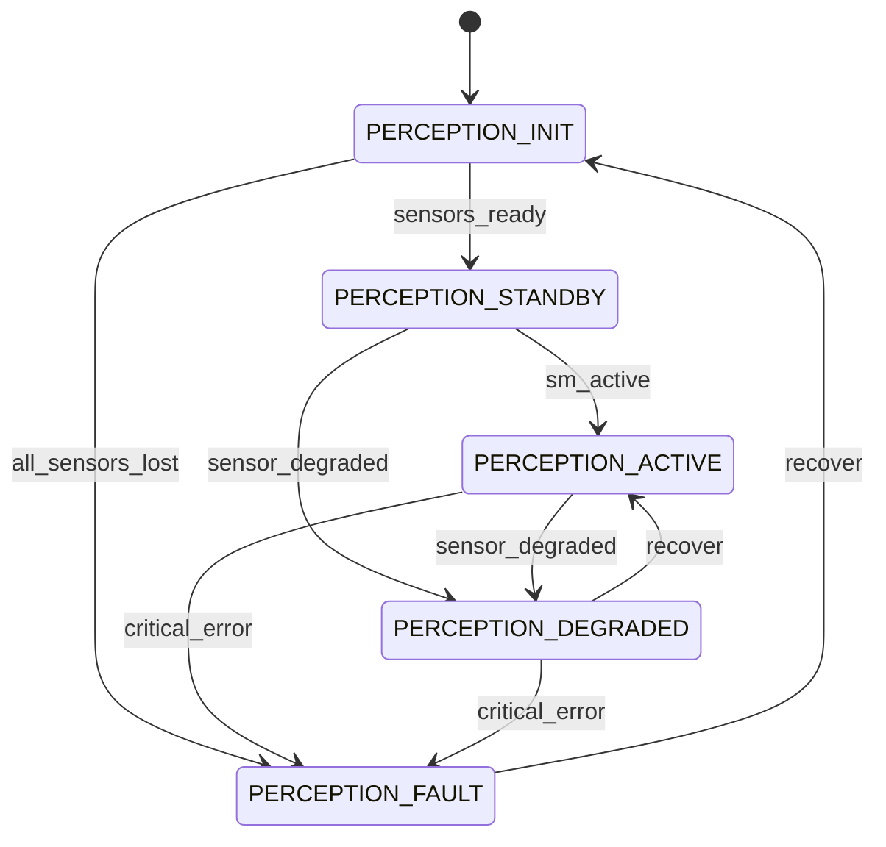
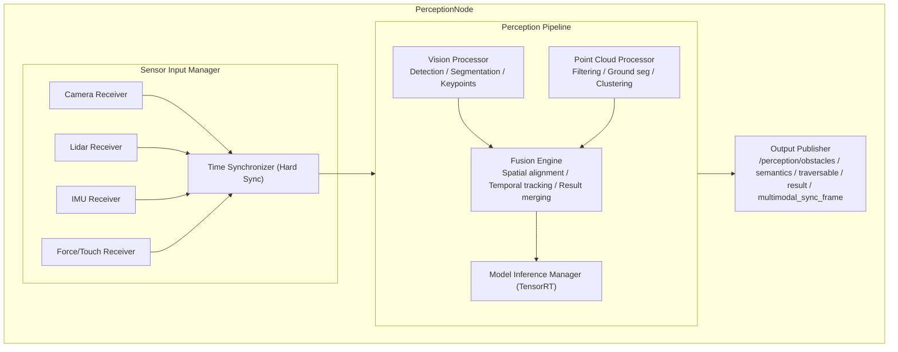
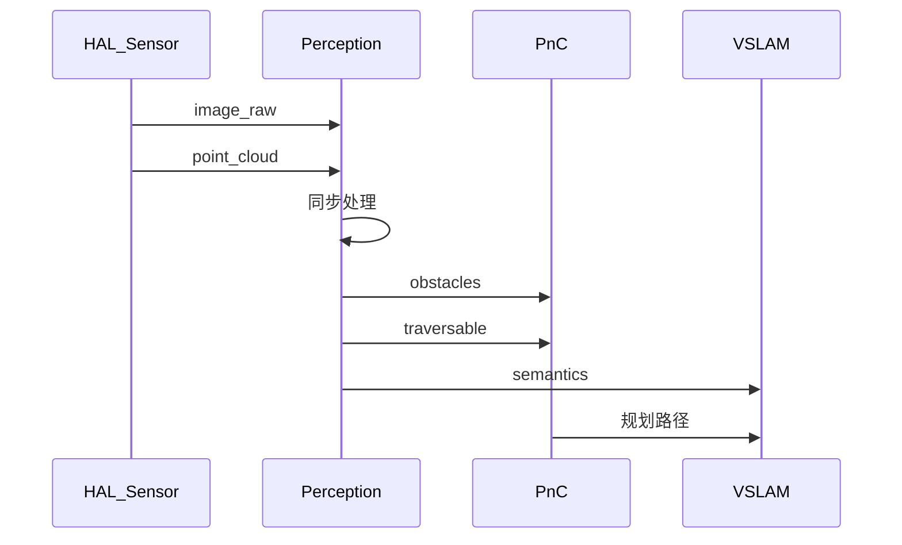

# Perception 模块设计

## 1. 模块概述与定位

**模块名称**：Perception（感知融合）

**定位**：Perception 是端侧软件系统中的**多传感器感知融合中心**，位于感知/规划层。它接收来自HAL_Sensor的原始传感器数据（Camera、Lidar、IMU、力觉等），执行目标检测、语义分割、障碍物识别、点云处理，并输出统一的感知结果供PnC、VSLAM、Lidar-SLAM、Agent等上层模块使用。

**核心职责**：

1. **传感器数据接收**：订阅Camera、Lidar、IMU、力觉等原始数据Topic
2. **视觉感知**：执行目标检测、语义分割、人体关键点检测、场景理解
3. **点云处理**：点云滤波、地面分割、聚类、障碍物提取
4. **多传感器融合**：时间同步、空间配准、融合视觉与Lidar结果
5. **感知结果发布**：输出统一的感知结果（障碍物列表、场景语义、可通行区域）
6. **感知健康监控**：监控各传感器数据质量，上报异常
7. **模型推理管理**：加载和调度AI推理模型（ONNX/TensorRT）

**与相邻模块的边界**：

| 边界 | Perception 负责 | 对方负责 |
|------|----------------|---------|
| Perception ↔ HAL_Sensor | 订阅原始传感器数据 | 硬件抽象、数据采集 |
| Perception ↔ PnC | 提供障碍物、可通行区域、地形信息 | 路径规划与导航 |
| Perception ↔ VSLAM | 提供视觉特征点、语义标签 | 视觉定位与建图 |
| Perception ↔ Lidar-SLAM | 提供处理后的点云、障碍物 | 激光定位与建图 |
| Perception ↔ Agent | 提供场景语义、目标检测结果 | VLA决策与交互 |
| Perception ↔ HDS | 上报传感器异常、推理异常 | 故障诊断与定级 |
| Perception ↔ TF | 查询传感器坐标变换 | 坐标系管理 |

---

## 2. 职责边界

**Perception 不做的事情**（红线）：

- **不做定位建图** — 视觉/Lidar定位建图由VSLAM/Lidar-SLAM负责，Perception只输出特征
- **不做路径规划** — 不输出导航路径或速度指令，那是PnC的职责
- **不做运动控制** — 不直接控制关节或下发运动指令
- **不做云端通信** — 所有云端交互通过Gateway
- **不做模型训练** — 只负责推理，模型训练在云端完成，通过FOTA更新

---

## 3. 状态机设计

### 3.1 感知状态枚举

| 状态 | 值 | 说明 |
|------|-----|------|
| `PERCEPTION_INIT` | 0 | 初始化中，加载模型和配置 |
| `PERCEPTION_STANDBY` | 1 | 就绪，等待传感器数据 |
| `PERCEPTION_ACTIVE` | 2 | 正常运行，持续输出感知结果 |
| `PERCEPTION_DEGRADED` | 3 | 降级运行（部分传感器失效或模型降速） |
| `PERCEPTION_FAULT` | 4 | 严重故障（核心模型加载失败或全部传感器失效） |

### 3.2 状态转换图



### 3.3 状态转换表

| 当前状态 | 目标状态 | 触发条件 | 优先级 | 说明 |
|----------|----------|----------|--------|------|
| INIT | STANDBY | 模型加载完成，传感器就绪 | 60 | 正常启动 |
| INIT | FAULT | 核心模型加载失败 | 80 | 启动失败 |
| STANDBY | ACTIVE | SM进入ACTIVE状态（机器人激活） | 60 | 开始推理 |
| STANDBY | DEGRADED | 部分传感器缺失 | 50 | 降级启动 |
| ACTIVE | DEGRADED | 传感器丢失或推理降速 | 50 | 动态降级 |
| DEGRADED | ACTIVE | 传感器恢复 | 50 | 恢复全功能 |
| ACTIVE | FAULT | 全部传感器失效或核心模型崩溃 | 80 | 严重故障 |
| DEGRADED | FAULT | 剩余传感器也失效 | 80 | 故障升级 |
| FAULT | INIT | 人工重启或自动恢复尝试 | 60 | 故障恢复 |

### 3.4 状态转换约束

1. **INIT超时**：模型加载超过60s未就绪 → 自动进入FAULT
2. **传感器阈值**：Camera+Lidar同时失效 → 进入FAULT；单个失效 → DEGRADED
3. **推理FPS保护**：推理帧率低于5FPS持续5s → 进入DEGRADED
4. **状态变更时**发布 `/perception/perception_state` Topic

---

## 4. ROS2 接口定义

### 4.1 消息定义 (msg)

```
# perception_msgs/msg/PerceptionState.msg
# 感知模块状态

uint8 state                 # 当前状态
uint8 prev_state
builtin_interfaces/Time state_changed_at
string active_models        # 当前加载的模型列表（逗号分隔）
float32 inference_fps       # 推理帧率
```

```
# perception_msgs/msg/Obstacle.msg
# 障碍物信息

uint32 id                   # 障碍物ID（跟踪ID）
uint8 type                  # 类型
uint8 TYPE_UNKNOWN    = 0
uint8 TYPE_PEDESTRIAN = 1
uint8 TYPE_VEHICLE    = 2
uint8 TYPE_CYCLIST    = 3
uint8 TYPE_STATIC     = 4
uint8 TYPE_STAIRS     = 5
uint8 TYPE_RAMP       = 6
string type_confidence    # JSON: {type: confidence_score}

geometry_msgs/Pose pose     # 位置（base_link坐标系）
geometry_msgs/Vector3 velocity  # 速度（m/s）
geometry_msgs/Vector3 size      # 尺寸（长x宽x高，m）

sensor_msgs/PointCloud2 points  # 障碍物点云（可选）
float32 confidence          # 检测置信度
builtin_interfaces/Time detected_at
```

```
# perception_msgs/msg/ObstacleList.msg
# 障碍物列表

builtin_interfaces/Time stamp
string frame_id
Obstacle[] obstacles
float32 ground_height       # 地面高度估计
```

```
# perception_msgs/msg/SemanticSegment.msg
# 语义分割结果

builtin_interfaces/Time stamp
string frame_id
uint32 height
uint32 width
uint8[] class_ids           # 逐像素类别ID
float32[] class_confidences # 逐像素置信度
# 类别定义：0=背景, 1=可通行地面, 2=障碍物, 3=楼梯, 4=斜坡, 5=草地, 6=水面...
```

```
# perception_msgs/msg/TraversableRegion.msg
# 可通行区域

builtin_interfaces/Time stamp
string frame_id
geometry_msgs/Polygon[] regions     # 可通行多边形区域
float32[] region_costs              # 每个区域的通行代价
geometry_msgs/Pose[] footholds      # 推荐落足点（人形机器人专用）
```

```
# perception_msgs/msg/PerceptionResult.msg
# 统一感知结果（聚合）

builtin_interfaces/Time stamp
string frame_id
uint8 state
ObstacleList obstacles
SemanticSegment semantics
TraversableRegion traversable
sensor_msgs/PointCloud2 filtered_cloud  # 滤波后的点云
bool has_ground_plane           # 是否检测到地面
geometry_msgs/Vector3 ground_plane_normal # 地面法向量
float32 ground_plane_offset     # 平面方程偏移 d：normal dot p + d = 0
```

```
# perception_msgs/msg/Heartbeat.msg
# Perception 心跳

builtin_interfaces/Time stamp
string node_name
uint8 state
bool healthy
string status_message
float32 inference_fps
uint32 model_count
```

### 4.2 服务定义 (srv)

```
# perception_msgs/srv/GetHealthStatus.srv

# Request（空）
---
# Response
bool success
string node_name
builtin_interfaces/Time uptime_since
uint8 state
bool healthy
string message
float32 avg_inference_fps
string[] loaded_models
```

```
# perception_msgs/srv/SetInferenceMode.srv
# 切换推理模式（精度 vs 速度）

uint8 mode
uint8 MODE_BALANCED   = 0
uint8 MODE_ACCURACY   = 1
uint8 MODE_SPEED      = 2
uint8 MODE_LOW_POWER  = 3
---
# Response
bool success
uint16 error_code
string message
float32 expected_fps
```

```
# perception_msgs/srv/GetObstacles.srv
# 查询当前障碍物（Service方式）

# Request（空）
---
# Response
bool success
string message
ObstacleList obstacles
```

### 4.3 接口汇总表

#### Topics

| 名称 | 类型 | 方向 | QoS | 频率 | 说明 |
|------|------|------|-----|------|------|
| `/perception/perception_state` | `perception_msgs/msg/PerceptionState` | Perception → ALL | Reliable + Transient Local + Depth 1 | 事件驱动 | 感知状态广播 |
| `/perception/obstacles` | `perception_msgs/msg/ObstacleList` | Perception → PnC/Agent | Reliable + Volatile + Depth 1 | 10 Hz | 障碍物列表 |
| `/perception/semantics` | `perception_msgs/msg/SemanticSegment` | Perception → PnC/VSLAM | Best Effort + Volatile + Depth 1 | 5 Hz | 语义分割 |
| `/perception/traversable` | `perception_msgs/msg/TraversableRegion` | Perception → PnC | Reliable + Volatile + Depth 1 | 5 Hz | 可通行区域 |
| `/perception/result` | `perception_msgs/msg/PerceptionResult` | Perception → ALL | Reliable + Volatile + Depth 1 | 10 Hz | 统一感知结果 |
| `/perception/heartbeat` | `perception_msgs/msg/Heartbeat` | Perception → EM/HDS | Reliable + Volatile + Depth 1 | 1 Hz | 心跳 |

#### Subscribed Topics

| 名称 | 类型 | 来源 | 说明 |
|------|------|------|------|
| `/camera/image_raw` | `sensor_msgs/msg/Image` | HAL_Sensor | 原始图像 |
| `/camera/camera_info` | `sensor_msgs/msg/CameraInfo` | HAL_Sensor | 相机内参 |
| `/lidar/point_cloud` | `sensor_msgs/msg/PointCloud2` | HAL_Sensor | 原始点云 |
| `/imu/data` | `sensor_msgs/msg/Imu` | HAL_Sensor | IMU数据 |
| `/tf` | `tf2_msgs/msg/TFMessage` | TF | 坐标变换 |
| `/tf_static` | `tf2_msgs/msg/TFMessage` | TF | 静态坐标变换 |

#### Services

| 名称 | 类型 | 调用方 | 说明 |
|------|------|--------|------|
| `/perception/get_health_status` | `perception_msgs/srv/GetHealthStatus` | EM, HDS | 健康查询 |
| `/perception/set_inference_mode` | `perception_msgs/srv/SetInferenceMode` | TE, Agent | 切换推理模式 |
| `/perception/get_obstacles` | `perception_msgs/srv/GetObstacles` | PnC, Agent | 查询障碍物 |

---

## 5. 内部设计

### 5.1 节点架构



### 5.2 关键设计决策

1. **时间同步**：采用消息头时间戳进行软同步，允许50ms时间窗口内的数据配对；硬同步由HAL_Sensor触发
2. **推理隔离**：模型推理在独立线程/CUDA流中执行，避免阻塞ROS2回调
3. **QoS分级**：障碍物使用Reliable（安全关键），语义分割使用Best Effort（可容忍丢帧）
4. **模型热切换**：支持运行中切换轻量/高精度模型，切换期间保持旧模型输出不断流
5. **GPU内存池**：预分配GPU内存池，避免推理过程中动态分配导致的延迟抖动

### 5.3 关键流程

#### 5.3.1 感知流水线流程

```
Camera Image + Lidar PointCloud + IMU (同步后)
  → Vision Processor:
      → 图像预处理（resize, normalize）
      → Detection模型推理 → 2D bbox + class
      → Segmentation模型推理 → 逐像素类别
      → 投影到3D（使用深度/Lidar点云）
  → Point Cloud Processor:
      → 点云滤波（voxel downsample, outlier removal）
      → 地面分割（RANSAC平面拟合）
      → 障碍物聚类（Euclidean clustering）
      → 点云特征提取
  → Fusion Engine:
      → 时间同步帧配对
      → 2D-3D关联（IoU匹配）
      → 卡尔曼滤波跟踪
      → 多传感器结果融合（置信度加权）
  → Output Publisher:
      → 发布 /perception/obstacles
      → 发布 /perception/semantics
      → 发布 /perception/traversable
      → 发布 /perception/result
```

#### 5.3.2 传感器异常降级流程

```
Camera数据超时（>200ms未收到）
  → Sensor Input Manager 标记Camera为DEGRADED
  → 通知 Fusion Engine 仅用Lidar数据进行障碍物检测
  → 语义分割暂停输出
  → 发布 /perception/perception_state (DEGRADED)
  → 上报HDS传感器异常
  → Camera恢复后自动恢复ACTIVE
```

---

## 6. 与其他模块的交互

### 6.1 交互矩阵

| 模块 | 方向 | 接口 | 说明 |
|------|------|------|------|
| HAL_Sensor | HAL → Perception | `/camera/image_raw` (Topic) | 原始图像 |
| HAL_Sensor | HAL → Perception | `/lidar/point_cloud` (Topic) | 原始点云 |
| HAL_Sensor | HAL → Perception | `/imu/data` (Topic) | IMU数据 |
| TF | TF → Perception | `/tf`, `/tf_static` (Topic) | 坐标变换查询 |
| PnC | Perception → PnC | `/perception/obstacles` (Topic) | 障碍物信息 |
| PnC | Perception → PnC | `/perception/traversable` (Topic) | 可通行区域 |
| VSLAM | Perception → VSLAM | `/perception/semantics` (Topic) | 语义标签 |
| Lidar-SLAM | Perception → Lidar-SLAM | `/perception/result` (Topic) | 处理后点云 |
| Agent | Perception → Agent | `/perception/result` (Topic) | 场景理解 |
| HDS | Perception → HDS | `/hds/report_diagnosis` (Service) | 传感器异常上报 |
| EM | EM → Perception | `/perception/get_health_status` (Service) | 健康检查 |

### 6.2 关键交互时序

#### 时序：感知数据流

```
HAL_Sensor       Perception       PnC       VSLAM
  │                │              │          │
  │─image_raw─────►│              │          │
  │─point_cloud───►│              │          │
  │                │              │          │
  │                │─同步处理─────│          │
  │                │              │          │
  │                │─obstacles───►│          │
  │                │─traversable─►│          │
  │                │─semantics────────────────►│
  │                │              │          │
  │                │              │─规划路径──►

| `ground_segmentation_distance_threshold` | float | 0.05 | 地面分割距离阈值（m） |
| `cluster_tolerance` | float | 0.2 | 点云聚类容差（m） |
| `min_cluster_size` | int | 50 | 最小聚类点数 |
| `gpu_memory_pool_mb` | int | 512 | GPU内存池大小（MB） |

---

## 8. 错误码定义

```
# perception_msgs/msg/ErrorCode.msg
uint16 OK                              = 0
uint16 ERR_MODEL_LOAD_FAILED           = 9001   # 模型加载失败
uint16 ERR_INFERENCE_FAILED            = 9002   # 推理失败
uint16 ERR_CAMERA_TIMEOUT              = 9003   # 相机数据超时
uint16 ERR_LIDAR_TIMEOUT               = 9004   # 激光雷达数据超时
uint16 ERR_TF_LOOKUP_FAILED            = 9005   # 坐标变换查询失败
uint16 ERR_INVALID_INFERENCE_MODE      = 9006   # 非法推理模式
uint16 ERR_GPU_MEMORY_EXHAUSTED        = 9007   # GPU内存不足
uint16 ERR_SENSOR_CALIBRATION_INVALID  = 9008   # 传感器标定无效
uint16 ERR_FUSION_FAILED               = 9009   # 融合失败
uint16 ERR_MODEL_NOT_FOUND             = 9010   # 模型文件不存在
uint16 ERR_INFERENCE_TIMEOUT           = 9011   # 推理超时
uint16 ERR_INVALID_SENSOR_CONFIG       = 9012   # 传感器配置错误
uint16 ERR_SYNC_FAILED                 = 9013   # 时间同步失败
uint16 ERR_POINT_CLOUD_EMPTY           = 9014   # 点云为空
uint16 ERR_INVALID_IMAGE_FORMAT        = 9015   # 图像格式不支持
```

| 错误码 | 常量名 | 说明 | 严重级别 |
|--------|--------|------|----------|
| 0 | OK | 成功 | — |
| 9001 | ERR_MODEL_LOAD_FAILED | 模型加载失败 | HIGH |
| 9002 | ERR_INFERENCE_FAILED | 推理失败 | HIGH |
| 9003 | ERR_CAMERA_TIMEOUT | 相机数据超时 | MEDIUM |
| 9004 | ERR_LIDAR_TIMEOUT | 激光雷达数据超时 | MEDIUM |
| 9005 | ERR_TF_LOOKUP_FAILED | 坐标变换查询失败 | MEDIUM |
| 9006 | ERR_INVALID_INFERENCE_MODE | 非法推理模式 | LOW |
| 9007 | ERR_GPU_MEMORY_EXHAUSTED | GPU内存不足 | HIGH |
| 9008 | ERR_SENSOR_CALIBRATION_INVALID | 传感器标定无效 | HIGH |
| 9009 | ERR_FUSION_FAILED | 融合失败 | MEDIUM |
| 9010 | ERR_MODEL_NOT_FOUND | 模型文件不存在 | HIGH |
| 9011 | ERR_INFERENCE_TIMEOUT | 推理超时 | MEDIUM |
| 9012 | ERR_INVALID_SENSOR_CONFIG | 传感器配置错误 | MEDIUM |
| 9013 | ERR_SYNC_FAILED | 时间同步失败 | MEDIUM |
| 9014 | ERR_POINT_CLOUD_EMPTY | 点云为空 | LOW |
| 9015 | ERR_INVALID_IMAGE_FORMAT | 图像格式不支持 | LOW |

---

## 9. 安全约束

1. **推理隔离**：模型推理必须在独立线程进行，任何推理崩溃不能影响ROS2节点主循环
2. **输出校验**：所有3D位置输出必须在合理范围内（如距离机器人 < 50m），异常值过滤后输出
3. **传感器超时保护**：任一传感器超时超过500ms，该传感器数据标记为无效，不纳入融合
4. **GPU内存保护**：推理前检查GPU剩余内存，不足时降级到CPU推理或跳过帧
5. **模型签名验证**：加载模型前验证模型文件数字签名，防止加载被篡改的模型

---

## 10. 包结构

```
perception_msgs/        # 消息定义包
├── msg/
│   ├── PerceptionState.msg
│   ├── Obstacle.msg
│   ├── ObstacleList.msg
│   ├── SemanticSegment.msg
│   ├── TraversableRegion.msg
│   ├── PerceptionResult.msg
│   └── Heartbeat.msg
├── srv/
│   ├── GetHealthStatus.srv
```
perception_msgs/        # 消息定义包
    msg/
        PerceptionState.msg
        Obstacle.msg
        ObstacleList.msg
        SemanticSegment.msg
        TraversableRegion.msg
        PerceptionResult.msg
        Heartbeat.msg
    srv/
        GetHealthStatus.srv
        SetInferenceMode.srv
        GetObstacles.srv
    CMakeLists.txt
    package.xml

perception/             # 节点实现包
    include/perception/
        perception_node.hpp
        sensor_input_manager.hpp
        time_synchronizer.hpp
        vision_processor.hpp
        point_cloud_processor.hpp
        fusion_engine.hpp
        model_inference_manager.hpp
        output_publisher.hpp
    src/
        perception_node.cpp
        sensor_input_manager.cpp
        time_synchronizer.cpp
        vision_processor.cpp
        point_cloud_processor.cpp
        fusion_engine.cpp
        model_inference_manager.cpp
        output_publisher.cpp
        main.cpp
    test/
        test_fusion_engine.cpp
        test_vision_processor.cpp
        test_point_cloud.cpp
        test_integration.cpp
    config/
        perception_params.yaml
    launch/
        perception.launch.py
    CMakeLists.txt
    package.xml
```
| 检测精度 (mAP) | > 0.85 | COCO标准 |
| GPU利用率 | < 80% | 单帧推理时 |
| GPU内存占用 | < 2GB | 稳态运行时 |
| 传感器同步精度 | < 50ms | 多传感器时间对齐 |
| 内存占用 | < 4GB | 含模型加载 |
