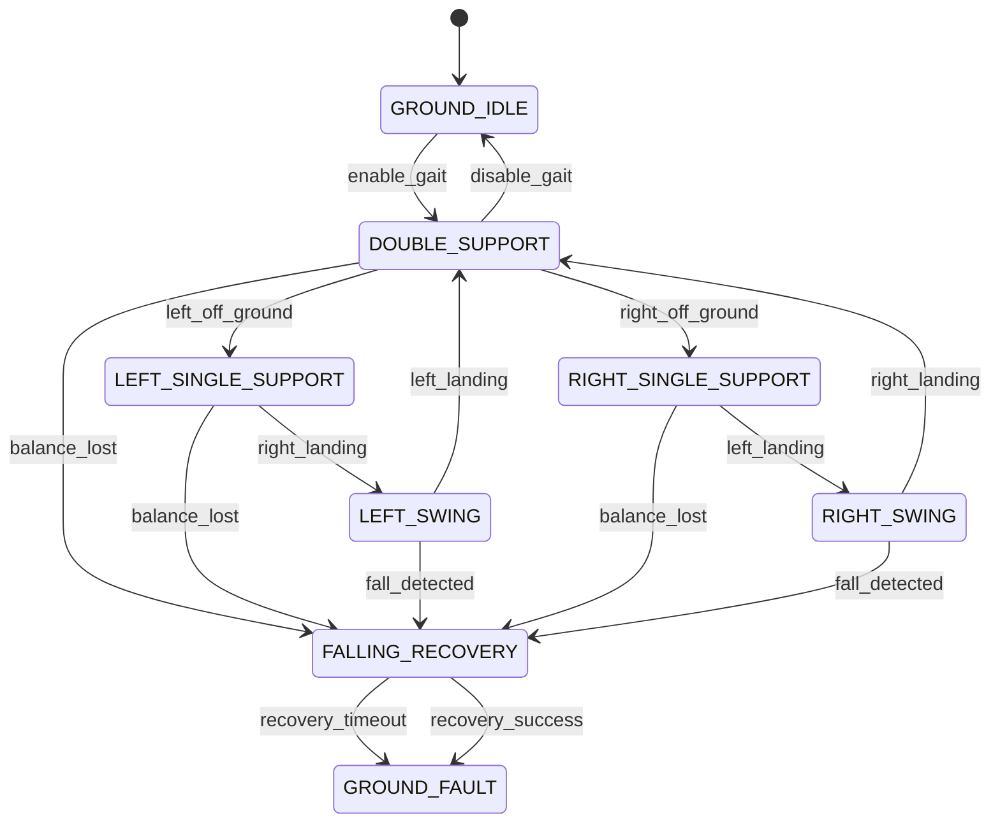
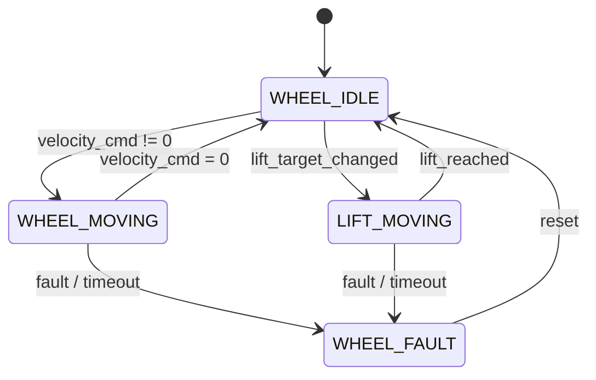
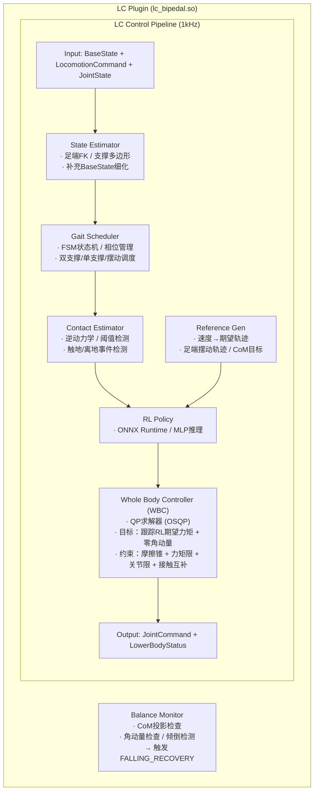
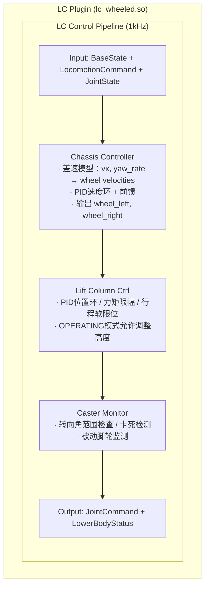

# Lower Body Control 模块设计

## 1. 模块概述与定位

**模块名称**：Lower Body Control（LC）

**定位**：LC 是端侧软件系统中**下肢运动控制插件**，作为 MC（Motion Control）的 Upper Body Controller 对等组件运行。它负责将上层模块（PnC）的行走/移动速度指令转换为下肢关节指令，通过 MC 的插件接口输出。LC 是**形态专属组件**，足式和轮式分别由独立的插件实现（`lc_bipedal.so` / `lc_wheeled.so`），MC 通过统一的 C++ 插件接口加载。

**核心职责**：
1. **足式 — 双足行走控制**：
   - RL Policy 推理：将高层速度指令映射为期望关节力矩
   - 全身控制器（WBC）：在接触约束下求解最优关节力矩
   - 接触估计：基于关节力矩和逆动力学估计足底接触力
   - 步态调度：管理双足支撑/单足支撑/摆动相的切换序列
   - 平衡监测：实时检测倾倒/跌倒风险

2. **轮式 — 底盘移动+升降柱控制**：
   - 底盘速度伺服：将 Twist 指令映射为左右轮速度
   - 升降柱位置控制：根据操作模式调整躯干高度
   - 脚轮状态监测：被动脚轮的转向角和锁止状态

**与相邻模块的边界**：

| 边界 | LC 负责 | 对方负责 |
|------|---------|---------|
| LC ↔ MC | 接收 BaseState/LocomotionCommand，输出 JointCommand/LowerBodyStatus | 协调层、状态估计、安全校验、EtherCAT 下发 |
| LC ↔ PnC（间接） | 通过 MC 接收速度指令 | 路径规划、导航决策 |
| LC ↔ UC（间接） | 提供 LowerBodyStatus（步态相位/升降柱高度） | 基座扰动补偿、IK 参考系调整 |
| LC ↔ HDS（间接） | 通过 MC 上报 RL 失败、WBC 无解、跌倒检测 | 故障诊断与定级 |

**形态适配说明**：

| 形态 | 实现库 | LC 行为 |
|------|--------|---------|
| 足式 | `lc_bipedal.so` | RL+WBC 双足行走，步态 FSM，接触估计 |
| 轮式 | `lc_wheeled.so` | 差速底盘控制，升降柱位置伺服 |

---

## 2. 职责边界

**LC 做的事情**：
- 下肢关节的实时控制（足式：力矩/阻抗；轮式：位置/速度）
- 足式：RL 策略推理、WBC 求解、接触估计、步态调度
- 轮式：底盘速度映射、升降柱位置控制
- 平衡/稳定状态监测（倾倒检测、跌倒检测）
- 形态相关的运动模式实现（SQUAT/SIT 足式专属）

**LC 不做的事情**（红线）：
- **不做上肢控制** — 上肢关节由 UC 插件控制
- **不做状态估计** — 基座姿态和质心状态由 MC 状态估计器提供
- **不直接操作 EtherCAT** — 所有关节指令通过 MC 插件接口输出
- **不做全局路径规划** — 速度指令由 PnC 提供
- **不做故障定级** — 只上报原始异常数据，由 HDS 定级
- **不跳过安全校验** — LC 输出指令经过 MC 的 Safety Guardian 后才下发
- **不做形态决策** — MC 根据 `robot_type` 决定加载哪个 LC 插件

---

## 3. 状态机设计

### 3.1 足式状态机（内部步态 FSM）

足式 LC 维护独立的步态状态机，与 MC 的运动模式解耦。MC 运动模式变化通过 `on_motion_mode_changed()` 通知 LC，LC 自主决定内部步态响应。

| 状态 | 值 | 说明 |
|------|-----|------|
| `GROUND_IDLE` | 0 | 静止站立，双足支撑，无主动步态 |
| `DOUBLE_SUPPORT` | 1 | 双足支撑相（步态周期中的稳定期）|
| `LEFT_SINGLE_SUPPORT` | 2 | 左足单支撑，右足摆动准备 |
| `RIGHT_SINGLE_SUPPORT` | 3 | 右足单支撑，左足摆动准备 |
| `LEFT_SWING` | 4 | 左足摆动相（离地→前移→触地）|
| `RIGHT_SWING` | 5 | 右足摆动相（离地→前移→触地）|
| `FALLING_RECOVERY` | 6 | 跌倒恢复中（检测到失衡后的保护动作）|
| `GROUND_FAULT` | 7 | 故障（WBC 无解/接触估计发散/跌倒）|

### 3.2 足式状态转换图



### 3.3 足式状态转换表

| 当前状态 | 目标状态 | 触发条件 | 优先级 | 说明 |
|----------|----------|----------|--------|------|
| GROUND_IDLE | DOUBLE_SUPPORT | MC 模式=WALKING，收到有效 LocomotionCommand | 60 | 开始步态 |
| DOUBLE_SUPPORT | LEFT_SINGLE_SUPPORT | 右足离地检测（接触力 < 阈值） | 50 | 进入右摆动期 |
| DOUBLE_SUPPORT | RIGHT_SINGLE_SUPPORT | 左足离地检测 | 50 | 进入左摆动期 |
| LEFT_SINGLE_SUPPORT | LEFT_SWING | 右足完全离地 | 50 | 右足摆动 |
| LEFT_SWING | DOUBLE_SUPPORT | 右足触地检测 | 50 | 回到双支撑 |
| RIGHT_SINGLE_SUPPORT | RIGHT_SWING | 左足完全离地 | 50 | 左足摆动 |
| RIGHT_SWING | DOUBLE_SUPPORT | 左足触地检测 | 50 | 回到双支撑 |
| * | FALLING_RECOVERY | balance_lost（CoM 投影出支撑多边形）| 90 | 失衡保护 |
| * | GROUND_FAULT | recovery_timeout / recovery_fail | 80 | 恢复失败 |
| * | GROUND_IDLE | MC 模式=IDLE/STAND，或 E-Stop | 100 | 最高优先级停止 |

> **关键设计**：步态切换由**接触估计器**驱动，而非固定周期计时器。触地/离地事件通过关节力矩估计的接触力阈值判断。

### 3.4 轮式状态机

轮式 LC 状态机相对简单，主要管理底盘运动和升降柱动作。

| 状态 | 值 | 说明 |
|------|-----|------|
| `WHEEL_IDLE` | 0 | 底盘静止，升降柱保持当前位置 |
| `WHEEL_MOVING` | 1 | 底盘正在移动（收到非零速度指令）|
| `LIFT_MOVING` | 2 | 升降柱正在调整高度 |
| `WHEEL_FAULT` | 3 | 故障（底盘通信失败/升降柱超限）|

### 3.5 轮式状态转换图



### 3.6 轮式状态转换表

| 当前状态 | 目标状态 | 触发条件 | 优先级 | 说明 |
|----------|----------|----------|--------|------|
| WHEEL_IDLE | WHEEL_MOVING | 收到非零 LocomotionCommand | 60 | 开始移动 |
| WHEEL_MOVING | WHEEL_IDLE | 收到零速度 / 速度跟踪到位 | 60 | 停止 |
| WHEEL_IDLE | LIFT_MOVING | 收到升降柱目标高度变更 | 50 | 调整高度 |
| LIFT_MOVING | WHEEL_IDLE | 升降柱到达目标位置 | 50 | 高度调整完成 |
| * | WHEEL_FAULT | 底盘通信失败 / 升降柱超限 | 80 | 故障 |
| WHEEL_FAULT | WHEEL_IDLE | MC 调用 `reset()` 或 SM 状态转换确认 | 60 | 故障恢复（禁止自动恢复）|
| * | WHEEL_IDLE | E-Stop | 100 | 急停 |

---

## 4. ROS2 接口定义

LC 作为 MC 内部插件，**没有独立的 ROS2 节点**。所有 ROS2 通信通过 MC 节点代理。下肢相关的消息类型定义在 `mc_msgs` 包中，MC 负责订阅/发布，通过插件接口与 LC 交换数据。

### 4.1 消息定义（msg，存于 mc_msgs）

```
# mc_msgs/msg/LocomotionCommand.msg
# 行走/移动控制信号（PnC → MC → LC）

builtin_interfaces/Time stamp
float64 vx                   # 前进速度 [m/s]（前为正）
float64 vy                   # 侧向速度 [m/s]（左为正）
float64 yaw_rate             # 偏航角速度 [rad/s]（逆时针为正）
float64 max_linear_accel     # 最大线加速度 [m/s^2]
float64 max_angular_accel    # 最大角加速度 [rad/s^2]
```

```
# mc_msgs/msg/LowerBodyStatus.msg
# 下肢状态（LC → MC → 上层）

builtin_interfaces/Time stamp

# 形态无关字段
uint8 robot_type             # 0=bipedal, 1=wheeled
bool is_ground_contact       # 是否有地面接触（足式：任一脚；轮式：底盘着地）
float32 ground_clearance     # 离地间隙 [m]

# 足式专用字段
uint8 gait_phase             # 步态相位（见下方枚举）
float32 gait_progress        # 步态周期进度 0.0~1.0
bool left_foot_contact       # 左足触地
bool right_foot_contact      # 右足触地
float32[] left_contact_force # 左足接触力 [N] (fx, fy, fz)
float32[] right_contact_force# 右足接触力 [N] (fx, fy, fz)
float32 balance_score        # 平衡评分 0.0~1.0（1.0=最稳定）

# 轮式专用字段
float32 chassis_velocity     # 底盘实际线速度 [m/s]
float32 chassis_yaw_rate     # 底盘实际偏航角速度 [rad/s]
float32 lift_column_height   # 升降柱当前高度 [m]
float32 lift_column_target   # 升降柱目标高度 [m]
bool lift_column_in_position # 升降柱是否到位

# 步态相位枚举（足式）
uint8 GAIT_PHASE_DOUBLE_SUPPORT = 0
uint8 GAIT_PHASE_LEFT_SINGLE    = 1
uint8 GAIT_PHASE_RIGHT_SINGLE   = 2
uint8 GAIT_PHASE_LEFT_SWING     = 3
uint8 GAIT_PHASE_RIGHT_SWING    = 4
uint8 GAIT_PHASE_FALLING        = 5
uint8 GAIT_PHASE_FAULT          = 6  # 足式 GROUND_FAULT 或轮式 WHEEL_FAULT
```

```
# mc_msgs/msg/GaitPhase.msg
# 步态相位广播（MC → UC，供摆臂补偿）

builtin_interfaces/Time stamp
uint8 phase                  # 当前步态相位（同 LowerBodyStatus.gait_phase）
float32 progress             # 步态周期进度 0.0~1.0
bool left_contact            # 左足触地
bool right_contact           # 右足触地
float32 expected_duration    # 当前相位预期持续时间 [s]（供 PnC 预测触地时刻，优化路径规划中的步态同步）
```

### 4.2 插件接口（C++，共享内存）

LC 插件继承 `mc::LowerBodyController` 接口，已在 `mc_design.md` 中定义。此处引用并补充形态专属约束：

```cpp
// mc/include/mc/plugin_interface/lower_body_controller.hpp

struct LocomotionCommand {
  float vx = 0.0f;                 // 前进速度 [m/s]
  float vy = 0.0f;                 // 侧向速度 [m/s]
  float yaw_rate = 0.0f;           // 偏航角速度 [rad/s]
  float max_linear_accel = 1.0f;   // 最大线加速度 [m/s^2]
  float max_angular_accel = 2.0f;  // 最大角加速度 [rad/s^2]
};

struct LowerBodyStatus {
  // 形态无关
  uint8_t robot_type = 0;
  bool is_ground_contact = false;
  float ground_clearance = 0.0f;

  // 足式专用
  uint8_t gait_phase = 0;
  float gait_progress = 0.0f;
  bool left_foot_contact = false;
  bool right_foot_contact = false;
  float left_contact_force[3] = {0};
  float right_contact_force[3] = {0};
  float balance_score = 1.0f;

  // 轮式专用
  float chassis_velocity = 0.0f;
  float chassis_yaw_rate = 0.0f;
  float lift_column_height = 0.0f;
  float lift_column_target = 0.0f;
  bool lift_column_in_position = true;
};

class LowerBodyController {
public:
  virtual ~LowerBodyController() = default;

  // 初始化：传入形态配置和该插件控制的关节列表
  // robot_type: "bipedal" 或 "wheeled"
  // joint_names: 根据 mc_params.yaml 中 joint_assignment.lc_joints 传入
  virtual bool init(
    const std::string& robot_type,
    const std::vector<std::string>& joint_names,
    const rclcpp::Node::SharedPtr& node
  ) = 0;

  // 主控制周期更新（1kHz，实时线程中调用）
  // 足式实现：必须在 500us 内完成（含 RL 推理/WBC/接触估计）
  // 轮式实现：必须在 200us 内完成
  virtual bool update(
    const BaseState& base_state,
    const LocomotionCommand& cmd,
    const JointState& current_joints,
    JointCommand& output,
    LowerBodyStatus& status
  ) = 0;

  // 运动模式变化通知（ROS2 回调线程调用）
  virtual void on_motion_mode_changed(uint8_t new_mode, uint8_t old_mode) = 0;

  virtual void reset() = 0;
  virtual void emergency_stop() = 0;

  virtual std::string get_name() const = 0;
  virtual std::string get_version() const = 0;
};
```

### 4.3 接口汇总表

#### 插件接口（C++，共享内存）

| 方向 | 数据 | 说明 |
|------|------|------|
| MC → LC | `BaseState` | 基座姿态、质心状态 |
| MC → LC | `LocomotionCommand` | 行走/移动速度指令（经 MC 缓存）|
| MC → LC | `JointState` | 当前下肢关节状态 |
| LC → MC | `JointCommand` | 下肢关节指令（位置/速度/力矩）|
| LC → MC | `LowerBodyStatus` | 下肢状态反馈（步态/接触/底盘）|

#### Topics（通过 MC 节点代理）

| 名称 | 类型 | 方向 | QoS | 频率 | 说明 |
|------|------|------|-----|------|------|
| `/lc/locomotion_command` | `mc_msgs/msg/LocomotionCommand` | PnC → MC → LC | Best Effort, Depth 1 | 100Hz | 行走/移动控制信号 |
| `/lc/gait_phase` | `mc_msgs/msg/GaitPhase` | MC → UC/ALL | Best Effort, Depth 1 | 1kHz | 步态相位广播（足式时有效）|
| `/lc/lower_body_status` | `mc_msgs/msg/LowerBodyStatus` | LC → MC → ALL | Best Effort, Depth 1 | 1kHz | 下肢状态反馈 |

> **注意**：上述 Topic 实际由 MC 节点代理发布/订阅，LC 插件内部不直接操作 ROS2。MC 将 LocomotionCommand 缓存到无锁队列供实时线程读取，将 LowerBodyStatus 从无锁队列取出后通过 ROS2 发布。

---

## 5. 内部设计

### 5.1 节点/插件架构

#### 5.1.1 足式实现（lc_bipedal.so）架构



#### 5.1.2 轮式实现（lc_wheeled.so）架构



### 5.2 关键组件设计

#### 5.2.1 RL Policy（足式）

**算法选择**：PPO（Proximal Policy Optimization）
- 训练环境：Isaac Gym / MuJoCo
- 策略网络：MLP（多层感知机）
- 价值网络：独立 MLP（仅训练时使用）

**观测向量（Observation，dim ≈ 45-60）**：
```
obs = [
  # 基座状态（来自 BaseState）
  roll, pitch, yaw_rate,              # 3
  com_x, com_y, com_vx, com_vy,       # 4

  # 指令（来自 LocomotionCommand）
  cmd_vx, cmd_vy, cmd_yaw_rate,       # 3

  # 关节状态（来自 JointState，仅下肢）
  q_left_hip_yaw ... q_left_ankle_roll,  # 6
  q_right_hip_yaw ... q_right_ankle_roll, # 6
  dq_left_hip_yaw ... dq_left_ankle_roll, # 6
  dq_right_hip_yaw ... dq_right_ankle_roll,# 6

  # 历史（上一周期关节角度）
  q_prev[12],                         # 12

  # 步态相位（来自 Gait Scheduler）
  sin(phase), cos(phase),             # 2
]
```

**动作输出（Action，dim = 12 + 6）**：
```
action = [
  # 期望关节位置偏移（相对默认站立位）
  delta_q_left_hip_yaw ... delta_q_left_ankle_roll,   # 6
  delta_q_right_hip_yaw ... delta_q_right_ankle_roll, # 6

  # 期望足端接触力（用于 WBC 参考）
  f_left_x, f_left_y, f_left_z,     # 3
  f_right_x, f_right_y, f_right_z,  # 3
]
```

**网络结构**：
```
Input(48) → Linear(256) → ReLU → Linear(256) → ReLU → Linear(128) → ReLU
  → Linear(12)  [位置偏移输出头]
  → Linear(6)   [接触力输出头]
```

**部署**：ONNX Runtime
- 训练后导出为 ONNX 格式
- LC 启动时加载 `model/policy.onnx`
- 推理时间目标：< 2ms（异步执行，详见 §5.3）

**异常安全**：
- 每周期检测 Policy 输出 NaN / Inf
- 缓存策略：保存上一周期经关节限幅后的动作为 `cached_safe_action`
- 连续 1 周期异常 → 使用 `cached_safe_action`
- 连续 2 周期异常 → 暂停 RL 推理，进入阻尼模式，触发 `LC_ERR_RL_POLICY_FAIL`
- 恢复条件：连续 10 周期输出正常后恢复 RL 推理

**Sim-to-Real**：
- **域随机化**：训练时随机化质量、摩擦、电机延迟、传感器噪声
- **系统辨识**：在真机上辨识关节动力学参数，更新仿真模型
- **动作平滑**：输出经低通滤波（截止频率 5Hz）消除高频抖动

#### 5.2.2 Whole Body Controller（WBC，足式）

**求解器**：OSQP（Operator Splitting QP Solver）
- 稀疏 QP，适合实时求解
-  warm-start：上一周期解作为初始值，加速收敛

**QP 问题形式**：

决策变量：`x = [q̈; f_contact]`
- `q̈`：广义加速度（dim = n_q，约 18-24）
- `f_contact`：接触力（dim = 3*n_contact，每接触点 3 维力）

目标函数：
```
min  ||w_1 * (τ - τ_RL)||² + ||w_2 * L̇||² + ||w_3 * q̈||² + ||w_4 * (f - f_RL)||²
```
- `τ`：关节力矩
- `τ_RL`：RL Policy 输出的期望力矩
- `L̇`：角动量变化率（目标为零角动量）
- `f`：接触力
- `f_RL`：RL Policy 输出的期望接触力

约束：
1. **动力学方程**：`M(q)q̈ + C(q,q̇) + G(q) = τ + Jᵀf`
2. **摩擦锥**：`√(fx² + fy²) ≤ μ * fz`，`fz ≥ 0`
3. **力矩限**：`τ_min ≤ τ ≤ τ_max`
4. **关节限**：`q̈_min ≤ q̈ ≤ q̈_max`
5. **接触互补**：摆动相脚接触力 = 0

**求解时间目标**：< 3ms（单次求解，warm-start 后通常 < 1ms）

#### 5.2.3 Contact Estimator（接触估计器，足式）

**无足底力传感器方案**：基于逆动力学估计接触力

**算法**：
```
# 单腿动力学模型（6DOF 腿）
M_leg(q) * q̈_leg + C_leg(q, q̇) + G_leg(q) = τ_leg + J_legᵀ * F_foot

# 解算足底接触力
F_foot = (J_legᵀ)⁺ * (M_leg * q̈_leg + C_leg + G_leg - τ_leg)

# 触地/离地判断
if F_foot.z > CONTACT_THRESHOLD_FORCE:  # 默认 20N
    contact = true
else:
    contact = false
```

**滤波**：
- 接触力经 10Hz 低通滤波消除噪声
- 触地/离地事件经施密特触发器防抖（上阈值 30N，下阈值 10N）

**故障检测**（结合步态周期，避免摆动相误报）：
- 仅在支撑相（DOUBLE_SUPPORT / LEFT_SINGLE_SUPPORT / RIGHT_SINGLE_SUPPORT）检测：若支撑腿报告 `contact = false` 超过 30ms，触发 `LC_ERR_CONTACT_EST_FAIL`
- 摆动相（LEFT_SWING / RIGHT_SWING）期间跳过接触发散检测，但保留 NaN/Inf 检查
- 若接触力估计值异常（支撑相 > 1000N 或 NaN/Inf），触发同一错误
- `gait_scheduler` 通过共享状态向 `contact_estimator` 提供当前相态，避免跨模块查询

#### 5.2.4 Gait Scheduler（步态调度器，足式）

**调度策略**：基于事件的有限状态机

**步态周期参数**：
- `gait_period`：步态周期 [s]（默认 0.6-1.0s，可调）
- `duty_factor`：支撑相占空比（默认 0.6，即双支撑占 20%，单支撑占 40%×2）
- `swing_height`：摆动足抬升高度 [m]（默认 0.05-0.1m）

**相位管理**：
```
phase ∈ [0, 1)

0.0 - 0.1:  DOUBLE_SUPPORT（双支撑）
0.1 - 0.5:  LEFT_SINGLE_SUPPORT + RIGHT_SWING（左支撑，右摆动）
0.5 - 0.6:  DOUBLE_SUPPORT
0.6 - 1.0:  RIGHT_SINGLE_SUPPORT + LEFT_SWING（右支撑，左摆动）
```

**事件驱动切换**：
- 正常情况下按相位计时切换
- 触地事件可提前结束摆动相（提前触地保护）
- 离地延迟时，若超过预期时间 20% 仍未离地，触发 warning

#### 5.2.5 Chassis Controller（轮式）

**差速底盘模型**：
```
# 轮速计算
v_left  = vx - yaw_rate * wheelbase / 2
v_right = vx + yaw_rate * wheelbase / 2

# 轮式底盘 vy 处理
# 若为差速底盘：vy 由轮速差间接实现（yaw_rate 控制）
# 若为全向底盘（麦克纳姆轮/全向轮）：vy 直接映射到各轮
```

**速度环**：
- 外环：Twist 指令 → 轮速目标（前馈）
- 内环：轮速 PID（Kp, Ki, Kd 可配置）
- 输出：wheel_left, wheel_right 目标速度 [rad/s]

**限速保护**：
- 最大线速度：1.0 m/s
- 最大角速度：1.0 rad/s
- 最大线加速度：0.5 m/s²
- 最大角加速度：1.0 rad/s²

#### 5.2.6 Lift Column Controller（升降柱控制，轮式）

**控制模式**：位置控制 + 力矩限幅

**目标高度来源**：
- `STAND` 模式：默认中位高度
- `OPERATING` 模式：允许通过 Service/Topic 调整（TE/Gateway 下发）
- `WALKING` 模式（轮式持续移动）：保持当前高度

**PID 参数**：
- Kp = 1000.0（位置误差 → 力矩）
- Ki = 50.0
- Kd = 100.0
- 力矩上限：50 Nm（保护升降柱机构）

**安全约束**：
- 软限位：高度范围 [0.3m, 1.2m]（可配置）
- 硬限位：超出范围时立即停止并上报 `LC_ERR_LIFT_COLUMN_FAIL`
- 速度限幅：升降速度 < 0.05 m/s

### 5.3 关键设计决策

1. **RL Policy 异步推理**：
   - **单线程模式**（推理 < 2ms）：`update()` 直接调用 ONNX Runtime 推理，结果立即用于 WBC
   - **异步模式**（推理 ≥ 2ms）：单独推理线程（SCHED_FIFO，优先级低于 1kHz 线程但高于 ROS2 回调线程）执行 ONNX 推理，`update()` 读取缓存结果
   - **双缓冲同步**：推理线程与实时线程通过 `std::atomic<uint64_t>` 序列号 + 双缓冲交换数据：
     ```cpp
     struct RLInferenceBuffer {
       std::array<float, 18> action;      // 12 关节偏移 + 6 接触力
       std::atomic<uint64_t> seq{0};       // 序列号，奇数=写入中，偶数=可读
     };
     RLInferenceBuffer buffers[2];         // 双缓冲
     ```
     - 推理线程：写入 buffer[write_idx]，完成后 `seq += 1`，切换 `write_idx`
     - 实时线程：读取 `buffer[1-write_idx]`，若 `seq` 自上次读取后已变化 → 使用新数据；否则复用上一周期缓存
   - **超时回退**：若推理线程 2 周期（2ms）未产出新结果，实时线程自动复用上一周期动作
2. **WBC warm-start**：上一周期 QP 解作为当前周期初始值，OSQP 通常 1-3 次迭代收敛
3. **接触估计无传感器**：通过逆动力学估计接触力，降低成本；精度依赖动力学模型准确性，需定期系统辨识
4. **轮式 vy 处理**：差速底盘不支持直接侧向移动，`vy` 通过 `yaw_rate` 间接实现；若未来升级全向底盘，直接映射
5. **升降柱与操作模式绑定**：OPERATING 模式允许调整升降柱高度，其他模式锁定，防止运动中调整导致不稳定

### 5.4 关键流程

#### 5.4.1 足式系统启动流程

```
MC 加载 lc_bipedal.so
  → 调用 init("bipedal", joint_names, node)
  → LC 读取 lc_bipedal_params.yaml
  → 加载 ONNX 模型（policy.onnx）
  → 初始化 OSQP 求解器（预分配内存）
  → 初始化步态 FSM（GROUND_IDLE）
  → 初始化接触估计器（加载腿部动力学参数）
  → 返回 true

MC 进入实时控制循环
  → 每 1ms 调用 lc.update(base_state, cmd, joints, output, status)
```

#### 5.4.2 足式正常控制循环流程

```
实时线程每 1ms：
  1. 接收 BaseState + LocomotionCommand + JointState
  2. 【输入校验】LocomotionCommand 预处理：
     - 值域裁剪：vx ∈ [-1.0, 1.0] m/s, vy ∈ [-0.5, 0.5] m/s, yaw_rate ∈ [-2.0, 2.0] rad/s
     - NaN / Inf 检测：任一字段异常 → 丢弃本周期命令，复用上一帧安全值（经同样限幅后的缓存值）
     - 速率限制：命令变化量 ≤ max_linear_accel * 1ms, max_angular_accel * 1ms
  3. 足端正运动学（FK）→ 足端位置/速度
  4. Gait Scheduler 更新 → 当前步态相位 + 接触调度
  5. Contact Estimator 更新 → 左右足接触力 + 触地状态
  6. Reference Generator → 期望 CoM 轨迹 + 足端摆动轨迹
  7. RL Policy 推理（ONNX）→ 期望关节位置偏移 + 期望接触力
     - 【异常处理】检测 Policy 输出 NaN / Inf：
       · 第 1 周期异常 → 使用上一周期经关节限幅后的安全动作（cached_safe_action）
       · 连续 2 周期异常 → 暂停 RL 推理，进入阻尼模式（τ = -k_d * q̇），触发 LC_ERR_RL_POLICY_FAIL
       · 恢复条件：连续 10 周期输出正常后恢复 RL 推理
  8. WBC（OSQP）求解 → 最优关节力矩
     - 【求解失败回退】见 §9.1 WBC 求解失败三级策略
  9. 输出 JointCommand（力矩控制模式）
  10. Balance Monitor 检查 → balance_score
  11. 填充 LowerBodyStatus → 步态相位/接触力/balance_score
```

#### 5.4.3 轮式正常控制循环流程

```
实时线程每 1ms：
  1. 接收 BaseState + LocomotionCommand + JointState
  2. 【输入校验】LocomotionCommand 预处理：
     - 值域裁剪：vx ∈ [-1.0, 1.0] m/s, vy ∈ [-0.5, 0.5] m/s, yaw_rate ∈ [-2.0, 2.0] rad/s
     - NaN / Inf 检测：任一字段异常 → 丢弃本周期命令，复用上一帧安全值
     - 速率限制：命令变化量 ≤ max_linear_accel * 1ms, max_angular_accel * 1ms
     - 互锁检查：若当前 LIFT_MOVING 且收到非零速度 → 忽略速度指令
  3. Chassis Controller：
     - vx, yaw_rate → wheel_left_vel, wheel_right_vel（差速模型）
     - PID 速度环 → 轮电机力矩指令
  4. Lift Column Controller：
     - 检查目标高度变更
     - 【互锁检查】若底盘速度 > 0.05 m/s → 拒绝高度变更，保持当前目标
     - PID 位置环 → 升降柱力矩指令
  5. Caster Monitor：
     - 检查脚轮转向角范围
     - 卡死检测
  6. 输出 JointCommand（轮：力矩/速度，升降柱：力矩）
  7. 填充 LowerBodyStatus → 底盘速度/升降柱高度
```

#### 5.4.4 足式跌倒检测与恢复流程

```
Balance Monitor 检测到 CoM 投影出支撑多边形
  → balance_score < 0.3
  → 连续 3 周期（3ms）确认
  → 触发 FALLING_RECOVERY

FALLING_RECOVERY（跌倒恢复期间控制策略）：
  → **MC 运动模式**：保持当前模式（WALKING / STAND 等），由 MC 决定是否降级；LC 通过 `LowerBodyStatus.gait_phase = GAIT_PHASE_FALLING` 上报 FSM 状态
  → **力矩输出策略**：
      - 暂停 RL Policy 推理（不再读取 ONNX 输出）
      - WBC 切换为 impact-minimization mode：目标函数改为最小化足端触地冲击力 ||f_contact||² + 最小化关节加速度 ||q̈||²
      - 关节保持力矩控制（不切换至位置控制，避免刚性碰撞）
  → **恢复动作**：
      - 立即增大支撑面（双腿尽量外展）
      - 降低质心（髋关节屈曲）
      - 手臂摆动补偿角动量（通过 MC 通知 UC）
  → **状态同步机制**：
      - LC 每周期上报 `LowerBodyStatus.gait_phase = GAIT_PHASE_FALLING`
      - MC 监测到 `GAIT_PHASE_FALLING` 后，可选择切换至 `MC_MODE_DAMPING`（视 SM 状态而定）
      - 进入 `GROUND_FAULT` 必须由 MC 确认后执行，LC 不得擅自切换运动模式
  → 若在 500ms 内恢复稳定（CoM 回支撑多边形）：
      - 返回原步态状态
      - 恢复 RL Policy 推理
      - WBC 恢复标准目标函数
  → 若超过 500ms 仍未恢复：
      - 进入 GROUND_FAULT
      - LC 持续上报 `GAIT_PHASE_FAULT`
      - MC 统一切换至 DAMPING 模式
      - 上报 HDS（CRITICAL：跌倒）
```

#### 5.4.5 插件异常降级流程

```
实时线程检测到 LC update() 返回 false
  → 记录错误码（见第 8 节）
  → 连续失败 N 周期（默认 10）后：
      - 若足式 LC 失败：
          → MC 进入 IDLE
          → 上肢保持当前位置（UC 仍可用）
          → 所有下肢关节 effort = 0（重力由关节锁或刹车承担）
      - 若轮式 LC 失败：
          → MC 进入 IDLE
          → 底盘刹车（wheel effort = 0，依赖机械刹车）
          → 升降柱保持当前位置
  → 上报 HDS
  → 尝试 reset() 恢复（最多 3 次）
  → 不可恢复时保持降级状态
```

---

## 6. 与其他模块的交互

### 6.1 交互矩阵

| 模块 | 方向 | 接口 | 说明 |
|------|------|------|------|
| MC | MC ↔ LC | 插件接口（共享内存） | BaseState、LocomotionCommand、JointState、JointCommand、LowerBodyStatus |
| PnC | PnC → MC → LC | `/pnc/velocity_command` (Topic) | 行走/移动控制信号（geometry_msgs/Twist）|
| UC | LC → MC → UC | `/lc/gait_phase` (Topic) | 步态相位广播（足式时有效，供 UC 摆臂补偿）|
| UC | LC → MC → UC | LowerBodyStatus (插件接口) | 升降柱高度（轮式时供 UC 调整 IK 基座）|
| HDS | LC → MC → HDS | `/hds/health_report` (Topic) | 下肢健康数据、RL/WBC 异常上报 |
| SM | SM → MC → LC | `/sm/robot_state` (Topic) | 全局状态变化通过 MC 通知 LC |
| HAL_EtherCAT | LC → MC → HAL | `/hal_ethercat/joint_commands` (Topic) | 下肢关节指令（MC 聚合后统一出口）|

### 6.2 MC 运动模式 → LC 行为映射

#### 足式行为映射

| MC 运动模式 | LC 行为 |
|-------------|---------|
| `MC_MODE_IDLE` | 关节锁止或阻尼，无主动控制 |
| `MC_MODE_STAND` | 双足站立平衡（WBC 维持零角动量）|
| `MC_MODE_READY` | 低刚度阻抗，准备响应 |
| `MC_MODE_SQUAT` | 下蹲轨迹跟踪（位置控制+WBC辅助）|
| `MC_MODE_SIT` | 坐下后低刚度支撑 |
| `MC_MODE_MOTION` | 配合 MP/MS 执行动作（可能涉及姿态变化）|
| `MC_MODE_WALKING` | 连续步态行走（RL+WBC 主循环）|
| `MC_MODE_OPERATING` | 站立中，上肢操作时保持平衡 |
| `MC_MODE_ZERO_TORQUE` | 下肢 effort = 0 |
| `MC_MODE_DAMPING` | 高阻尼系数阻抗控制 |

#### 轮式行为映射

| MC 运动模式 | LC 行为 |
|-------------|---------|
| `MC_MODE_IDLE` | 底盘刹车，升降柱保持 |
| `MC_MODE_STAND` | 底盘锁定，升降柱中位 |
| `MC_MODE_READY` | 底盘解锁待命，升降柱保持 |
| `MC_MODE_SQUAT` | **不支持** → 返回 `LC_ERR_INVALID_MOTION_MODE` |
| `MC_MODE_SIT` | **不支持** → 返回 `LC_ERR_INVALID_MOTION_MODE` |
| `MC_MODE_MOTION` | 配合 MP/MS 执行动作 |
| `MC_MODE_WALKING` | 底盘持续移动（速度跟踪）|
| `MC_MODE_OPERATING` | 底盘锁定，允许调整升降柱高度 |
| `MC_MODE_ZERO_TORQUE` | 轮 effort = 0，升降柱保持 |
| `MC_MODE_DAMPING` | 高阻尼 |

---

## 7. 关键参数与配置

### 7.1 足式参数（`lc_bipedal_params.yaml`）

```yaml
lc_bipedal:
  # RL Policy
  policy_model_path: "$(find lc_bipedal)/model/policy.onnx"
  observation_filter_cutoff_hz: 5.0   # 观测低通滤波截止频率
  action_filter_cutoff_hz: 5.0        # 动作低通滤波截止频率

  # WBC
  wbc_solver: "osqp"
  wbc_max_iter: 30                    # OSQP最大迭代次数
  wbc_eps_abs: 1e-3                   # 绝对收敛容差
  wbc_eps_rel: 1e-3                   # 相对收敛容差
  wbc_warm_start: true                # 启用warm-start

  # WBC权重
  wbc_weight_torque_tracking: 1.0     # 力矩跟踪权重
  wbc_weight_angular_momentum: 0.5    # 角动量权重
  wbc_weight_acceleration: 0.01       # 加速度最小化权重
  wbc_weight_force_tracking: 0.5      # 接触力跟踪权重

  # 摩擦锥
  friction_coefficient: 0.8           # 地面摩擦系数
  friction_pyramid: true              # 用摩擦锥近似（true=锥，false=棱锥）

  # 步态
  gait_period_sec: 0.8                # 步态周期 [s]
  gait_duty_factor: 0.6               # 支撑相占空比
  swing_height_m: 0.08                # 摆动足抬升高度 [m]

  # 接触估计
  contact_threshold_force_n: 20.0     # 触地力阈值 [N]
  contact_hysteresis_high_n: 30.0     # 施密特触发器上阈值
  contact_hysteresis_low_n: 10.0      # 施密特触发器下阈值
  contact_filter_cutoff_hz: 10.0      # 接触力滤波截止频率

  # 平衡监测
  balance_score_threshold: 0.3        # 失衡阈值
  falling_recovery_timeout_ms: 500    # 恢复超时 [ms]

  # 动力学模型
  leg_dynamics_model_path: "$(find lc_bipedal)/model/leg_dynamics.yaml"

  # 安全
  max_joint_torque_nm: 80.0           # 单关节最大力矩 [Nm]
  max_joint_velocity_rads: 10.0       # 单关节最大速度 [rad/s]
```

### 7.2 轮式参数（`lc_wheeled_params.yaml`）

```yaml
lc_wheeled:
  # 底盘几何
  wheelbase_m: 0.5                    # 轮距 [m]
  wheel_radius_m: 0.1                 # 轮子半径 [m]
  track_width_m: 0.4                  # 轮距（左右轮间距）[m]

  # 速度环 PID
  wheel_kp: 2.0
  wheel_ki: 0.1
  wheel_kd: 0.05
  wheel_max_effort_nm: 10.0           # 轮电机最大力矩

  # 速度限幅
  max_linear_velocity_ms: 1.0
  max_angular_velocity_rads: 1.0
  max_linear_accel_ms2: 0.5
  max_angular_accel_rads2: 1.0

  # 升降柱
  lift_column_kp: 1000.0
  lift_column_ki: 50.0
  lift_column_kd: 100.0
  lift_column_max_effort_nm: 50.0
  lift_column_min_height_m: 0.3
  lift_column_max_height_m: 1.2
  lift_column_max_velocity_ms: 0.05
  lift_column_default_height_m: 0.8   # STAND模式默认高度

  # 脚轮
  caster_max_steer_angle_rad: 1.57    # 最大转向角
  caster_stuck_threshold_rad: 0.05    # 卡死检测阈值（连续50ms无变化）

  # 安全
  chassis_brake_response_ms: 30       # 机械刹车响应时间：电机失能 → 刹车完全抱死 [ms]
                                      # PnC 停止预算（100ms）= 通信延迟 + 刹车响应 + 控制周期抖动
                                      # LC 保证刹车响应 < 50ms，其余由 PnC/Motion Streamer 预留
```

---

## 8. 错误码定义

LC 错误码范围：**6001–6013**（与 MC 3000 段、PnC 4000 段、UC 5000 段不重叠）

| 错误码 | 常量名 | 说明 | 严重级别 |
|--------|--------|------|----------|
| 0 | `LC_OK` | 成功 | — |
| 6001 | `LC_ERR_RL_POLICY_FAIL` | RL 策略推理失败（ONNX 输出 NaN/Inf 或推理超时）| CRITICAL |
| 6002 | `LC_ERR_WBC_SOLVE_FAIL` | WBC 求解失败（QP 不可行或 OSQP 未收敛）| HIGH |
| 6003 | `LC_ERR_CONTACT_EST_FAIL` | 接触估计发散（双腿同时离地或力估计异常）| HIGH |
| 6004 | `LC_ERR_GAIT_SCHEDULE_FAIL` | 步态调度异常（相位错乱或切换超时）| HIGH |
| 6005 | `LC_ERR_BALANCE_LOST` | 平衡丢失（CoM 投影持续出支撑多边形）| CRITICAL |
| 6006 | `LC_ERR_FALL_DETECTED` | 跌倒检测触发（机体姿态角超过安全阈值）| CRITICAL |
| 6007 | `LC_ERR_CHASSIS_COMM_FAIL` | 轮式底盘通信失败（轮子编码器丢失）| HIGH |
| 6008 | `LC_ERR_LIFT_COLUMN_FAIL` | 升降柱控制失败（超限/卡死/力矩饱和）| MEDIUM |
| 6009 | `LC_ERR_JOINT_LIMIT_VIOLATION` | 下肢关节位置/速度/力矩超限 | HIGH |
| 6010 | `LC_ERR_TORQUE_SATURATION` | 下肢力矩持续饱和（> 阈值 100ms）| HIGH |
| 6011 | `LC_ERR_INVALID_MOTION_MODE` | 不支持的运动模式（如轮式请求 SQUAT/SIT）| MEDIUM |
| 6012 | `LC_ERR_VELOCITY_TRACK_FAIL` | 速度跟踪失败（实际速度偏离指令 > 阈值 500ms）| MEDIUM |
| 6013 | `LC_ERR_FRICTION_CONE_VIOLATION` | WBC 输出接触力超出摩擦锥约束 | HIGH |

---

## 9. 安全约束

### 9.1 足式安全层

- **跌倒检测**：机体 roll/pitch 角超过 ±30° 连续 10ms → 触发 `LC_ERR_FALL_DETECTED`，MC 进入 DAMPING
- **平衡监测**：CoM 投影距离支撑多边形边界 < 2cm → `balance_score` 下降，< 0.3 触发恢复
- **零力矩模式保护**：`MC_MODE_ZERO_TORQUE` 下，若机体倾斜角 > 5° 持续超过 500ms，LC 上报 `LC_ERR_BALANCE_LOST` 至 MC，由 MC 协调切换至 STAND 模式（LC 插件不得擅自切换运动模式）
- **接触力异常**：单足接触力 > 500N 或 < -50N（拉力）→ 触发 `LC_ERR_CONTACT_EST_FAIL`
- **WBC 求解失败回退（三级策略）**：
  - 第 1 周期：OSQP 未收敛 → 复用上一周期可行解（warm-start 失效时）
  - 第 2 周期：仍未收敛 → 切换至**重力补偿模式**（仅输出对抗重力的关节力矩，τ = G(q)），同时触发 `LC_ERR_WBC_SOLVE_FAIL` 上报
  - 第 3 周期及以后：仍未收敛 → 切换至**阻尼模式**（关节输出与速度成正比的阻尼力，τ = -k_d * q̇），直至求解恢复或 MC 介入

### 9.2 轮式安全层

- **升降柱行程限位**：软限位 [min_height, max_height]，超出时裁剪并上报；硬限位触发故障
- **底盘速度限幅**：指令速度经斜坡限速（最大加速度约束）后执行
- **急停刹车**：E-Stop 时轮子电机立即失能（effort = 0），机械刹车在 `chassis_brake_response_ms`（< 50ms）内自动抱死；总停止时间取决于当前速度和地面摩擦，不由 LC 保证
- **PnC 停止预算层级说明**：PnC 要求的 100ms 停止预算 = 通信/调度延迟（~50ms）+ 刹车物理响应（< 50ms）。LC 负责保证后者，前者由上层（PnC/MS/MC）的指令时序控制保证
- **脚轮卡死检测**：转向角连续 50ms 无变化且底盘在移动 → 上报 warning，限速运行
- **升降柱与移动双向互锁**：
  - 升降柱调整期间（LIFT_MOVING）：底盘速度指令被忽略（强制 zero）
  - 底盘移动期间（WHEEL_MOVING，速度 > 0.05 m/s）：升降柱目标高度变更请求被拒绝，保持当前高度
  - 升降柱运动前检查底盘速度 < 0.05 m/s，否则延迟至底盘停稳后启动

---

## 10. 包结构

```
lc_bipedal/
- include/lc_bipedal/
    - lc_plugin.hpp              # LowerBodyController 实现类
    - rl_policy.hpp              # RL 策略推理器（ONNX Runtime 封装）
    - wbc_controller.hpp         # QP-based 全身控制器
    - contact_estimator.hpp      # 逆动力学接触估计器
    - gait_scheduler.hpp         # 步态 FSM 调度器
    - reference_generator.hpp    # 参考轨迹生成器
    - state_estimator.hpp        # 下肢状态估计（足端 FK、支撑多边形）
    - balance_monitor.hpp        # 平衡/倾倒监测器
    - utils.hpp                  # 工具函数（逆动力学、摩擦锥投影等）
- src/
    - lc_plugin.cpp
    - rl_policy.cpp
    - wbc_controller.cpp
    - contact_estimator.cpp
    - gait_scheduler.cpp
    - reference_generator.cpp
    - state_estimator.cpp
    - balance_monitor.cpp
    - utils.cpp
- config/
    - lc_bipedal_params.yaml
- test/
    - test_rl_policy.cpp         # RL 推理单元测试
    - test_wbc_controller.cpp    # WBC 求解单元测试
    - test_contact_estimator.cpp # 接触估计单元测试
    - test_gait_scheduler.cpp    # 步态调度单元测试
    - test_balance_monitor.cpp   # 平衡监测单元测试
    - test_integration.cpp       # 集成测试（含 mock MC）
- model/
    - policy.onnx                # RL 策略 ONNX 模型
    - leg_dynamics.yaml          # 腿部动力学参数（URDF 导出）
- CMakeLists.txt
- package.xml

lc_wheeled/
- include/lc_wheeled/
    - lc_plugin.hpp              # LowerBodyController 实现类
    - chassis_controller.hpp     # 差速底盘控制器
    - lift_controller.hpp        # 升降柱位置控制器
    - caster_monitor.hpp         # 脚轮状态监测器
    - utils.hpp                  # 工具函数
- src/
    - lc_plugin.cpp
    - chassis_controller.cpp
    - lift_controller.cpp
    - caster_monitor.cpp
    - utils.cpp
- config/
    - lc_wheeled_params.yaml
- test/
    - test_chassis_controller.cpp
    - test_lift_controller.cpp
    - test_caster_monitor.cpp
    - test_integration.cpp
- CMakeLists.txt
- package.xml
```

> **编译输出**：
> - `lc_bipedal` → `liblc_bipedal_plugin.so`
> - `lc_wheeled` → `liblc_wheeled_plugin.so`
> 安装到系统 lib 目录，MC 通过 `library_path` 参数加载。

---

## 11. 关键性能指标（KPI）

| 指标 | 足式目标 | 轮式目标 | 验证方式 |
|------|---------|---------|----------|
| `update()` 执行时间 | < 500μs | < 200μs | 周期内计时统计 |
| RL Policy 推理时间 | < 2ms（异步，每周期复用）| N/A | ONNX Runtime profiling |
| WBC 求解时间 | < 3ms（warm-start 后 < 1ms）| N/A | OSQP 迭代统计 |
| 接触估计时间 | < 500μs | N/A | 周期内计时 |
| 步态调度周期精度 | ±5% | N/A | 与预期周期对比 |
| 速度跟踪精度 | ±0.05 m/s | ±0.02 m/s | 实际 vs 指令速度 RMSE |
| 升降柱定位精度 | N/A | ±1mm | 实际 vs 目标高度 |
| 站立平衡 CoM 偏移 | < 2cm | N/A | CoM 轨迹标准差 |
| 跌倒检测响应时间 | < 10ms | N/A | 倾斜事件发生到检测 |
| 插件内存占用 | < 200MB（含 ONNX 模型）| < 50MB | 进程内存监控 |

---

## 附录 A：RL Policy 详细设计

### A.1 训练框架

**环境**：Isaac Gym（GPU 并行仿真，推荐）或 MuJoCo
**算法**：PPO（Proximal Policy Optimization）
- 裁剪系数 ε = 0.2
- 广义优势估计 GAE(λ=0.95)
- 学习率：策略 3e-4，价值函数 1e-3
- 批次大小：4096 步 × 4096 并行环境

**奖励函数设计**（关键项）：
```
r = w1 * r_tracking    # 速度跟踪奖励（vx, vy, yaw_rate 跟踪精度）
  + w2 * r_balance     # 平衡奖励（CoM 在支撑多边形内）
  + w3 * r_smooth      # 平滑奖励（关节加速度惩罚）
  + w4 * r_energy      # 能量效率奖励（力矩平方和）
  + w5 * r_survival    # 存活奖励（每步固定正值）
```

### A.2 网络结构详情

**策略网络（Policy）**：
```
Input: obs (dim=48)
  → LayerNorm
  → Linear(48, 256) → ReLU
  → Linear(256, 256) → ReLU
  → Linear(256, 128) → ReLU
  → Split:
      - Linear(128, 12)  → tanh → action_mean (位置偏移)
      - Linear(128, 12)  → softplus → action_std (对角协方差)
```

**部署推理**（推理时只需 `action_mean`）：
```cpp
// ONNX 输入：float obs[48]
// ONNX 输出：float action[12]（位置偏移）
// 接触力通过独立头输出（dim=6）
```

### A.3 Sim-to-Real 策略

1. **域随机化**（训练时随机化）：
   - 机体质量：±20%
   - 关节阻尼：±30%
   - 地面摩擦：0.5–1.2
   - 传感器延迟：0–20ms
   - 电机延迟：0–10ms
   - 观测噪声：关节角度 ±0.02rad，角速度 ±0.1rad/s

2. **系统辨识**（真机标定）：
   - 质量矩阵 M(q) 辨识（通过已知力矩激励）
   - 摩擦模型辨识（Stribeck 曲线拟合）
   - 电机动力学辨识（一阶延迟模型）

3. **动作域适配**：
   - 仿真输出动作经缩放系数映射到真机（补偿 sim-to-real gap）
   - 一阶低通滤波（5Hz）消除高频噪声

---

## 附录 B：WBC QP 问题形式

### B.1 决策变量

```
x = [q̈; f_1; f_2; ...; f_n]
  q̈     ∈ R^n_q      : 广义加速度（所有自由度）
  f_i   ∈ R^3        : 第 i 个接触点的接触力（只考虑法向+切向）
```

### B.2 目标函数

```
min  0.5 * xᵀ * P * x + qᵀ * x

P = diag(w_acc * I, w_force * I, ...)
q = [-w_torque * τ_RL; -w_force * f_RL; 0; ...]
```

具体展开：
```
min  w_torque * ||τ - τ_RL||²
   + w_ang_mom * ||L̇||²
   + w_acc * ||q̈||²
   + w_force * ||f - f_RL||²
```

### B.3 约束

**等式约束（动力学方程）**：
```
M(q) * q̈ + h(q, q̇) = Sᵀ * τ + J_cᵀ * f
```
- `M(q)`：质量矩阵
- `h(q, q̇) = C(q, q̇) + G(q)`：科氏力+重力
- `S`：选择矩阵（驱动关节为 1，被动关节为 0）
- `J_c`：接触点雅可比矩阵

**不等式约束（摩擦锥）**：
```
for each contact i:
  √(f_x² + f_y²) ≤ μ * f_z
  f_z ≥ 0
```

线性化（摩擦锥近似为四棱锥）：
```
|f_x| ≤ μ * f_z / √2
|f_y| ≤ μ * f_z / √2
f_z ≥ 0
```

**不等式约束（力矩限）**：
```
τ_min ≤ τ ≤ τ_max
```

**不等式约束（关节限）**：
```
q̈_min ≤ q̈ ≤ q̈_max
```

**接触互补约束**：
```
if foot_i in swing phase:
  f_i = 0
```

### B.4 OSQP 求解配置

```cpp
OSQPSettings settings;
settings.max_iter = 30;
settings.eps_abs = 1e-3;
settings.eps_rel = 1e-3;
settings.warm_start = true;
settings.polish = true;       // 改善解的精度
settings.verbose = false;     // 生产环境关闭日志
```

### B.5 求解失败回退策略

WBC QP 求解失败时，采用**三级回退策略**（见 §9.1）：

| 失败周期 | 策略 | 力矩输出 | 上报行为 |
|----------|------|----------|----------|
| 第 1 周期 | 复用上一周期可行解 | 上一周期 τ | 无 |
| 第 2 周期 | 重力补偿模式 | τ = G(q)（仅对抗重力） | 触发 `LC_ERR_WBC_SOLVE_FAIL` |
| 第 3+ 周期 | 阻尼模式 | τ = -k_d * q̇ | 持续上报，等待恢复或 MC 介入 |

**重力补偿模式**：忽略所有任务跟踪目标，仅计算使关节保持当前位置的静态重力力矩。此模式下机器人会缓慢下蹲/倾倒，但不会因非法力矩导致关节过载。

**阻尼模式**：所有关节输出与速度成正比的阻尼力（k_d 为阻尼系数，默认 5-10 Nm·s/rad）。此模式下关节被动耗能，适合紧急停止后的过渡状态。

---

## 附录 C：与 MC 的插件接口详细说明

### C.1 `init()` 调用时机

MC 启动时，Plugin Manager 加载 `.so` 后，在 ROS2 回调线程中调用 `init()`。此时：
- ROS2 节点已初始化，LC 可以通过 `node` 参数访问参数服务器
- EtherCAT 尚未就绪，LC 不应发送关节指令
- `init()` 成功返回后，MC 进入待命状态
- **足式**：此时加载 ONNX 模型、初始化 OSQP、加载动力学参数
- **轮式**：此时加载底盘参数、初始化 PID 控制器

### C.2 `update()` 调用约束

- **调用频率**：1kHz（由 MC 实时线程驱动）
- **执行时间**：足式 < 500μs，轮式 < 200μs
- **线程安全**：`update()` 在实时线程中执行，不得：
  - 调用 ROS2 Service（阻塞）
  - 申请动态内存（malloc/new）
  - 持有锁超过 10μs
  - 执行文件 I/O
  - 调用 ONNX Runtime 推理（若推理 > 2ms，改为异步模式：单独线程推理，update() 读取缓存结果）
- **异常处理**：`update()` 返回 false 表示本周期失败，MC 累计 N 周期后降级

### C.3 `emergency_stop()` 调用约束

- **调用时机**：E-Stop 触发时，MC 在 ROS2 回调线程中调用
- **执行时间**：必须 < 1ms
- **足式职责**：
  - 停止 RL 推理线程（设置 `inference_thread_running = false`）
  - 清空 RL 缓存动作（`cached_safe_action` 置零，`consecutive_nan_count = 0`）
  - 重置 WBC 求解器（清除 warm-start 矩阵，避免恢复后首次求解异常）
  - 清空步态 FSM（回到 GROUND_IDLE）
  - 清空 LocomotionCommand 缓存（`last_safe_cmd` 置零）
  - 不直接操作关节（MC 协调层已切断 EtherCAT）
- **轮式职责**：
  - 停止底盘速度指令（`target_wheel_vel = 0`）
  - 锁定升降柱目标位置（冻结当前目标高度）
  - 清空 LocomotionCommand 缓存（`last_safe_cmd` 置零）
  - 不直接操作硬件
- **禁止**：执行阻塞操作、发送 ROS2 消息、访问硬件
- **完整清理清单**（供实现参考）：
  ```cpp
  void emergency_stop() override {
    // 1. 停止推理线程
    inference_thread_running_ = false;
    // 2. 清空动作缓存
    cached_safe_action_.setZero();
    consecutive_nan_count_ = 0;
    // 3. 清空命令缓存
    last_safe_cmd_ = {0, 0, 0, 0, 0};
    // 4. 重置 WBC warm-start（足式）
    osqp_warm_start_x_.setZero();
    osqp_warm_start_y_.setZero();
    // 5. 重置 FSM 状态（足式）
    gait_fsm_.reset();
    // 6. 重置底盘控制器（轮式）
    chassis_pid_.reset();
    lift_pid_.reset();
  }
  ```

---

## 附录 D：设计审查综合报告

**模块**：Lower Body Controller（LC）
**审查日期**：2026-05-04
**总体判决**：APPROVED_WITH_CONDITIONS（2026-05-05 修复版）

> 本报告由 `safety-validator` 与 `architecture-advisor` 并行审查后综合生成。
> **2026-05-05 更新**：以下 CRITICAL 和 HIGH 问题已在本版本中修复，详见各条目末尾的 `[已修复]` 标记。

---

### D.1 架构审查结果

**判决**：NEEDS_REVISION

#### CRITICAL — 必须修复

| # | 问题 | 位置 | 说明 |
|---|------|------|------|
| A-CR1 | LowerBodyStatus C++ struct 字段不一致 | lc_design.md §4.4 / mc_design.md §4.4.5 | `lc_design.md` 中定义的 C++ struct 包含 `ground_clearance`、`gait_phase`、`gait_progress` 等字段，但 `mc_design.md` 中 `LowerBodyStatus.msg` 的字段定义不同。同一消息类型在两个文档中定义冲突，将导致编译/运行时失败。**必须统一为一个定义，并在两个文档中交叉引用。** `[已修复：lc_design.md 和 mc_design.md 的 C++ struct 已统一为完整字段集，与 msg 定义一致]` |
| A-CR2 | LocomotionCommand 字段缺失 | lc_design.md §4.3 | `lc_design.md` 中 `LocomotionCommand` 的 C++ struct 缺少 `max_linear_accel` 和 `max_angular_accel` 字段，但正文中提到 LC 应使用这些值进行命令平滑。struct 定义与文字描述不一致。**必须补全字段或删除相关文字描述。** `[已修复：lc_design.md 和 mc_design.md 的 LocomotionCommand C++ struct 已补全 max_linear_accel / max_angular_accel]` |

#### HIGH — 强烈建议修复

| # | 问题 | 位置 | 说明 |
|---|------|------|------|
| A-HI1 | PnC 100ms 停止语义模糊 | lc_design.md §7.2 / §9.2 | PnC 要求底盘在 100ms 内停止；轮式 LC 中急停刹车响应时间也是 100ms。两者语义不同（PnC 指从指令到静止的总时间，LC 指刹车激活延迟），但数字相同易引起误解。**建议明确区分：PnC 级 "停止时间预算" vs LC 级 "刹车执行延迟"，并在交互文档中说明层级关系。** `[已修复：参数改名为 chassis_brake_response_ms: 30（机械刹车物理响应），§9.2 已明确 PnC 100ms = 通信/调度延迟（~50ms）+ 刹车响应（< 50ms），LC 仅保证后者]` |
| A-HI2 | RL 异步推理线程同步机制未细化 | lc_design.md §5.1.2 / 附录 A | 文档提到 RL 推理在独立线程执行、实时线程读取缓存，但未描述：
1. 缓存更新的原子性机制（double-buffer / mutex / lock-free queue）；
2. 推理线程与实时线程的同步原语；
3. 推理超时（>2ms）时的回退策略。
**建议补充：使用 `std::atomic` 双缓冲 + 序列号校验，推理线程写入后递增 seq，实时线程检查 seq 变化判断是否为新鲜数据。** `[已修复：§5.3 关键设计决策 #1 已补充双缓冲 + 序列号同步机制、超时回退策略、线程优先级建议]` |
| A-HI3 | GaitPhase.msg 的 expected_duration 字段用途不明 | lc_design.md §4.4 | `GaitPhase.msg` 定义了 `expected_duration` 字段，但正文中未说明其用途（是给 PnC 做步态预测？还是给 MC 做超时监控？）。**建议明确该字段的消费者和使用场景，或删除该字段。** `[已修复：§4.1 GaitPhase.msg 已注释说明 expected_duration 供 PnC 预测触地时刻、优化路径规划中的步态同步]` |

#### MEDIUM / LOW

- A-MD1: `MotionTarget` 消息与 MP/MS 的 Topic 命名一致性建议（已在 mc_design.md 中修正，lc_design.md 可引用）。
- A-MD2: 足式/轮式错误码共用同一命名空间，但部分错误码（如 6001 RL_POLICY_FAIL）在轮式中永不触发，建议文档中标注形态适用性。
- A-LO1: 附录 A 中 PPO 训练超参数表格缺少学习率调度策略描述。
- A-LO2: 附录 B WBC 权重矩阵取值缺乏调参指导（建议补充经验值范围）。

---

### D.2 安全审查结果

**判决**：NEEDS_REVISION

#### CRITICAL — 必须修复

| # | 问题 | 位置 | 说明 |
|---|------|------|------|
| S-CR1 | LocomotionCommand 缺少输入校验 | lc_design.md §5.1.1 / §5.2.1 | `update()` 直接消费 `LocomotionCommand`，文档未描述输入校验：
- 速度/角速度值域裁剪（如 vx ∈ [-1.0, 1.0] m/s）；
- NaN / Inf 检测；
- 命令变化率限制（防止阶跃冲击）。
**必须在足式和轮式的 `update()` 流程中增加输入校验环节，明确校验规则与失败行为（拒绝本周期命令，保持上一帧安全值）。** `[已修复：§5.4.2 和 §5.4.3 已补充输入校验流程（值域裁剪、NaN/Inf 检测、速率限制、互锁检查）]` |
| S-CR2 | WBC QP 求解失败回退策略不安全 | lc_design.md §5.1.1 / 附录 B | 当前设计提到 QP 求解失败后复用旧解最多 5 周期，但旧解在新状态下可能违反动力学约束或力矩限，导致机器人失衡。**建议改为：第 1 周期复用旧解 → 第 2 周期切换至重力补偿（仅对抗重力）→ 第 3 周期及以后切换至阻尼模式。同时在第 2 周期触发 `LC_ERR_WBC_SOLVE_FAIL` 上报。** `[已修复：§9.1 和附录 B 已改为三级回退策略，明确重力补偿和阻尼模式的输出定义]` |
| S-CR3 | FALLING_RECOVERY → GROUND_FAULT 状态同步未明确 | lc_design.md §3.1 / §5.1.1 | 足式步态 FSM 中的 `FALLING_RECOVERY` 状态最终可能进入 `GROUND_FAULT`，但未说明：
1. `FALLING_RECOVERY` 期间 MC 的运动模式是什么（是否保持 `MC_MODE_WALKING`？）；
2. 进入 `GROUND_FAULT` 后，是由 LC 主动通知 MC 切换模式，还是 MC 通过心跳/状态发现后切换；
3. `FALLING_RECOVERY` 期间的关节力矩输出策略（暂停 RL？WBC 切换为 recovery mode？）。
**必须明确状态同步机制，建议 LC 通过 `LowerBodyStatus.gait_phase` 上报 FSM 状态，MC 监测到 `GROUND_FAULT` 后统一切换运动模式。** `[已修复：§5.4.4 已明确 FALLING_RECOVERY 的 MC 模式保持、力矩输出策略（暂停 RL + WBC impact-minimization）、状态上报机制和 GROUND_FAULT 同步路径]` |
| S-CR4 | WHEEL_FAULT 自动恢复机制存在安全风险 | lc_design.md §3.2 | 轮式状态机中 `WHEEL_FAULT` 可通过 "故障清除" 自动回到 `WHEEL_IDLE`，但未定义 "故障清除" 的触发条件。若故障根因未消除（如 EtherCAT 通信间歇性丢包），自动恢复可能导致重复进入故障。**建议：WHEEL_FAULT 必须通过外部手动确认（MC 调用 `reset()` 或 SM 状态转换）才能退出，禁止无条件自动恢复。** `[已修复：§3.6 状态转换表已将 WHEEL_FAULT→WHEEL_IDLE 触发条件改为 "MC 调用 reset() 或 SM 状态转换确认"，并标注禁止自动恢复]` |
| S-CR5 | RL Policy NaN/Inf 处理不完整 | lc_design.md §5.1.1 / 附录 A | 文档提到检测 NaN/Inf 但未描述完整处理链路：
1. 检测到 Policy 输出 NaN/Inf 后，缓存的 "上一个安全动作" 如何定义（是否经过限幅？）；
2. 连续检测到异常的处理（1 周期用缓存动作 → 2 周期切换至阻尼模式？）；
3. 上报时机和错误码。
**建议明确：缓存动作为上一周期经过关节限幅后的输出；连续 2 周期异常后进入阻尼模式并上报 `LC_ERR_RL_POLICY_FAIL`。** `[已修复：§5.2.1 已补充 RL 异常安全策略；§5.4.2 控制循环已明确 NaN/Inf 检测和回退流程]` |
| S-CR6 | ZERO_TORQUE 自动切换至 STAND 机制缺失 | lc_design.md §3.1 | 文档提到 "长时间零力矩可能导致关节失稳，LC 应自动切换至站立模式"，但未定义：
1. "长时间" 阈值（如 500ms？）；
2. 自动切换是否绕过 MC 协调（红线：插件不得擅自切换运动模式）；
3. 失稳检测标准（关节编码器漂移？IMU 倾角？）。
**建议：删除 "LC 自动切换" 表述，改为 LC 检测到失稳风险后上报 MC，由 MC 协调切换至 STAND。阈值和检测标准在此记录。** `[已修复：§9.1 已将 "自动切换回 STAND" 改为 "LC 上报 LC_ERR_BALANCE_LOST 至 MC，由 MC 协调切换"，明确插件不越权]` |

#### HIGH — 强烈建议修复

| # | 问题 | 位置 | 说明 |
|---|------|------|------|
| S-HI1 | 升降柱-运动互锁单向，需双向强化 | lc_design.md §5.2.1 | 当前互锁：升降柱运动时禁止底盘运动，但底盘运动时未明确禁止升降柱运动。底盘高速移动中升降柱动作会产生惯性冲击。**建议改为双向互锁：任何一方运动时另一方禁止启动，且升降柱运动前检查底盘速度 < 阈值（如 0.05 m/s）。** |
| S-HI2 | emergency_stop() 状态清理不完整 | lc_design.md §5.1.1 / §5.2.1 / 附录 C | `emergency_stop()` 未明确要求：
1. 清空 `LocomotionCommand` 缓存（防止恢复后立即执行旧命令）；
2. 重置 WBC warm-start 矩阵（旧 warm-start 可能在恢复后导致首次 QP 求解异常）；
3. RL 推理线程的缓存动作清零。
**建议在附录 C 中补充 emergency_stop() 的完整清理清单。** `[已修复：附录 C 已补充完整清理清单，含 RL 缓存清零、WBC warm-start 重置、命令缓存置零、代码示例]` |
| S-HI3 | 接触估计故障阈值过于严格 | lc_design.md §5.1.1 | 当前接触估计发散即报 `LC_ERR_CONTACT_EST_FAIL`（HIGH 级），但摆动相初期由于足端未触地，估计力自然为零，可能被误判为发散。**建议：故障阈值应结合步态周期（仅在支撑相检测发散，摆动相放宽或跳过），并在 `gait_scheduler` 中提供当前相态给 `contact_estimator`。** `[已修复：§5.2.3 已改为支撑相检测 + 摆动相跳过 + gait_scheduler 共享相态]` |
| S-HI4 | FALLING_RECOVERY 力矩输出策略未定义 | lc_design.md §3.1 | 跌倒恢复过程中，足式 LC 的力矩输出策略缺失：
1. RL Policy 是否暂停？
2. WBC 目标函数是否切换（如改为最小化触地冲击力）？
3. 关节是否切换至位置控制以保护结构？
**建议在 §5.1.1 中补充 FALLING_RECOVERY 的专用控制策略，如：暂停 RL → WBC 切换为 impact-minimization mode → 触地后切换至阻尼。** |

#### MEDIUM / LOW

- S-MD1: `FALLING_RECOVERY` 的角速度阈值（>3.0 rad/s）建议与 SM 的 `ACTIVE_FALLING` 阈值对齐，避免两个模块对同一物理事件使用不同判定标准。
- S-MD2: 轮式 `WHEEL_MOVING` 中未定义最大允许速度（建议补充底盘限速参数）。
- S-LO1: 建议为 RL 推理线程设置实时优先级（低于 1kHz 线程，但高于普通 ROS2 回调）。
- S-LO2: 建议在 `balance_monitor` 中增加 IMU 数据超时检测（IMU 失效时及时上报）。

---

### D.3 综合建议（按优先级排序）

1. **立即修复两个 CRITICAL 架构问题**（A-CR1/A-CR2）：统一 LowerBodyStatus 和 LocomotionCommand 的字段定义，确保 lc_design.md 与 mc_design.md 完全一致。
2. **立即修复 WBC 回退策略**（S-CR2）：旧解复用 → 重力补偿 → 阻尼的三级回退，不能直接使用旧解超过 1 周期。
3. **立即修复 WHEEL_FAULT 自动恢复**（S-CR4）：改为手动确认退出，消除无条件自动恢复的安全隐患。
4. **补全输入校验与异常处理链路**（S-CR1/S-CR5）：在 §5.1.1 和 §5.2.1 中增加明确的校验流程图。
5. **明确 FALLING_RECOVERY 的跨模块状态同步**（S-CR3/S-HI4）：定义 FSM 状态上报路径、MC 模式切换响应、以及恢复期间的专用控制策略。
6. **删除 ZERO_TORQUE 自动切换表述**（S-CR6）：改为上报-MC协调机制，符合插件不越权原则。
7. **补全 RL 异步推理同步机制**（A-HI2）：在 §5.1.2 或附录 A 中描述双缓冲与序列号校验。
8. **强化轮式安全互锁**（S-HI1/S-HI2）：双向互锁 + emergency_stop() 清理清单。

---

> **审查后行动**：以上问题修复后，建议重新触发 `/design-review` 进行验证审查，重点检查 CRITICAL 项的闭环和文档一致性。

---

### D.4 重新审查验证报告（2026-05-05）

**执行**：`safety-validator` + `architecture-advisor` 并行审查验证

#### 安全审查验证（safety-validator）

**判决**：APPROVED_WITH_CONDITIONS

| 问题 | 验证状态 | 验证结论 |
|------|----------|----------|
| S-CR1 输入校验 | 已修复 | §5.4.2 / §5.4.3 已完整定义值域裁剪、NaN/Inf 检测、速率限制、互锁检查 |
| S-CR2 WBC 三级回退 | 已修复 | §9.1 / 附录 B.5 已定义旧解→重力补偿→阻尼的降级路径和上报行为 |
| S-CR3 FALLING_RECOVERY 同步 | 已修复 | §5.4.4 已明确 MC 模式保持、上报机制、力矩策略、GROUND_FAULT 同步路径 |
| S-CR4 WHEEL_FAULT 自动恢复 | 已修复 | §3.6 已改为 reset() / SM 确认退出，标注禁止自动恢复 |
| S-CR5 RL NaN/Inf 处理 | 已修复 | §5.2.1 / §5.4.2 已明确缓存策略、连续异常回退、恢复条件 |
| S-CR6 ZERO_TORQUE 自动切换 | 已修复 | §9.1 已改为上报-MC协调，符合插件不越权 |
| S-HI1 升降柱双向互锁 | 已修复 | §5.4.3 / §9.2 已补充双向互锁 + 0.05 m/s 阈值 |
| S-HI2 emergency_stop 清理 | 已修复 | 附录 C 已补充完整清理清单 + 代码示例 |
| S-HI3 接触估计 gait-aware | 已修复 | §5.2.3 已改为支撑相检测 + 摆动相跳过 |
| S-HI4 FALLING_RECOVERY 力矩策略 | 已修复 | §5.4.4 已明确暂停 RL + impact-minimization WBC + 保持力矩控制 |

**新增发现（实现阶段条件项，非阻塞）**：
- IMP-1: 重力补偿模式输出建议也经过力矩限幅
- IMP-2: impact-minimization mode 具体 QP 权重参数实现阶段补充
- IMP-3: RL 恢复时建议增加渐进过渡（避免边界抖动频繁切换）
- IMP-4: 确认 MC ↔ SM 在 FALLING_RECOVERY → GROUND_FAULT 路径上的状态联动逻辑

#### 架构审查验证（architecture-advisor）

**判决**：APPROVED_WITH_CONDITIONS

| 问题 | 验证状态 | 验证结论 |
|------|----------|----------|
| A-CR1 LowerBodyStatus 一致性 | 已修复 | 两文档 C++ struct / msg 定义完全一致 |
| A-CR2 LocomotionCommand 字段 | 已修复 | 两文档 struct 已补全 max_linear_accel / max_angular_accel |
| A-HI1 PnC 100ms 停止语义 | 已修复 | 参数改名为 chassis_brake_response_ms: 30，§9.2 已明确 PnC 100ms = 通信延迟 (~50ms) + 刹车响应 (< 50ms) 的层级关系 |
| A-HI2 RL 异步推理同步 | 已修复 | §5.3 已补充 std::atomic 双缓冲 + 序列号校验 + 超时回退 |
| A-HI3 GaitPhase expected_duration | 已修复 | §4.1 已注释用途（PnC 预测触地时刻） |

#### 综合结论

**总体判决**：APPROVED_WITH_CONDITIONS

- 所有 2 个 CRITICAL 架构问题、6 个 CRITICAL 安全问题、4 个 HIGH 安全问题均已在设计文档层面闭环修复
- 修复内容未引入新的架构冲突或安全隐患
- 残留 4 个实现阶段条件项（IMP-1~IMP-4），需在编码实现时关注，不影响设计定稿
- **建议**：LC 设计文档可进入定稿状态，后续实现阶段按条件项清单跟踪
