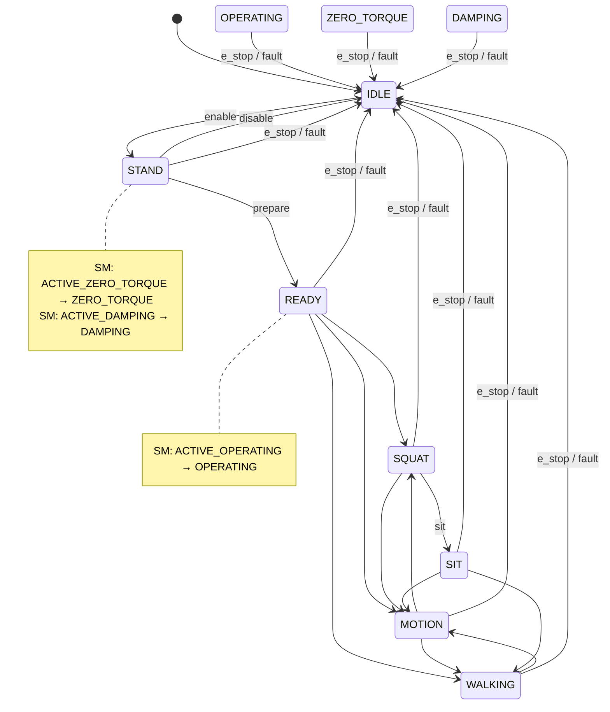
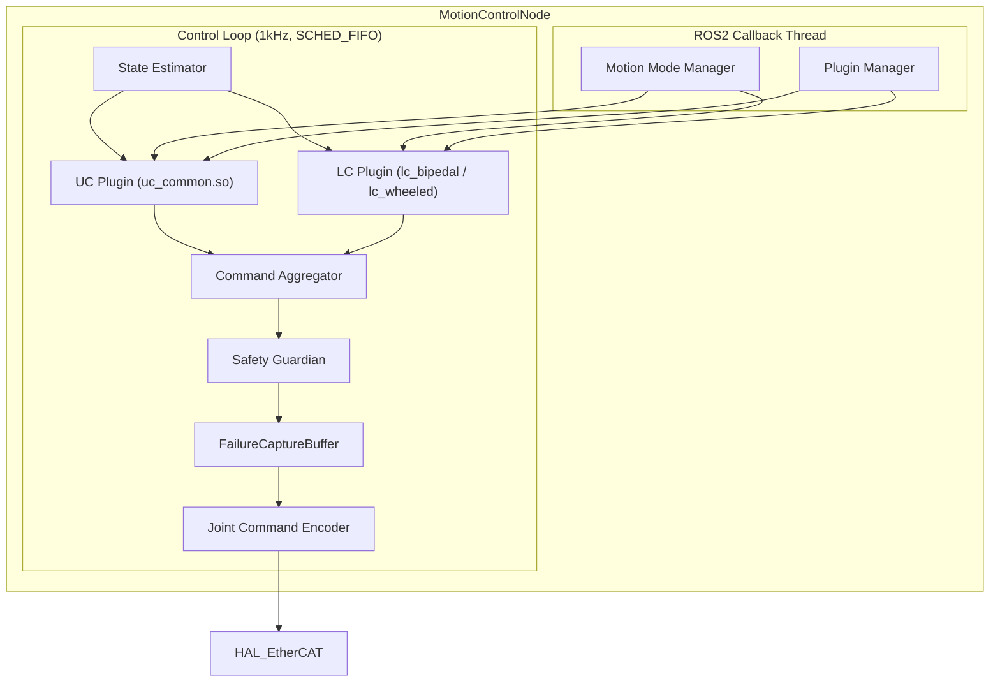

# Motion Control 模块设计

## 1. 模块概述与定位

**模块名称**：Motion Control（MC）

**定位**：MC 是端侧软件系统中**运动控制协调器**，位于运动层。它是运动控制链的**中枢协调节点**，负责将上层模块（PnC/MS/MP/TE）的运动意图分发给下层插件控制器（UC/LC），聚合插件输出的关节指令，并通过 HAL_EtherCAT 统一下发到硬件。MC 自身不实现具体控制算法，而是通过**插件机制**同时适配足式和轮式两种形态。

**核心职责**：
1. **插件管理**：加载、初始化和监控 Upper Body Controller（UC）和 Lower Body Controller（LC）插件
2. **运动模式管理**：维护形态无关的运动模式状态机，协调 UC/LC 的模式切换
3. **指令仲裁与聚合**：接收多来源运动指令，仲裁冲突，聚合 UC/LC 关节指令后统一下发
4. **全身状态估计**：融合 IMU + 关节状态，估计基座姿态和质心状态，供插件使用
5. **安全校验**：运动指令前检查 SM 状态缓存，关节限位，E-Stop 时冻结状态、捕获失效数据、再切断 UC/LC
6. **EtherCAT 统一出口**：作为唯一向 HAL_EtherCAT 下发关节指令的模块

**与相邻模块的边界**：

| 边界 | MC 负责 | 对方负责 |
|------|---------|---------|
| MC ↔ SM | 订阅状态缓存、运动前校验、触发 E-Stop | 全局状态机决策、状态转换仲裁 |
| MC ↔ HAL_EtherCAT | 聚合 UC/LC 指令后统一输出、接收关节原始状态 | EtherCAT 通信、从站管理 |
| MC ↔ UC | 提供基座/质心状态、下发上肢运动指令、接收上肢关节输出 | IK/轨迹规划/末端力控/夹爪/避自碰 |
| MC ↔ LC | 提供基座/质心状态、下发下肢运动指令、接收下肢关节输出 | 足式: RL/WBC/步态; 轮式: 底盘+升降柱 |
| MC ↔ PnC | 接收行走/移动控制信号 | 路径规划、导航决策 |
| MC ↔ MS | 接收流式运动意图 | 运动指令流式整形 |
| MC ↔ MP | 接收预录动作序列 | 动作序列管理、插值 |
| MC ↔ TE | 接收任务级运动指令（通过 Action） | 任务调度、生命周期管理 |
| MC ↔ HDS | 上报关节健康数据、插件健康状态、失效诊断 | 故障诊断与定级 |
| MC ↔ DR | 发送 FailureCaptureBuffer 数据、失效上下文 | 数据录制与存储 |
| MC ↔ Data Rule Engine | 失效事件触发规则引擎采集 | 规则解析与触发执行 |

**形态适配说明**：

MC 通过配置参数 `robot_type` 选择形态，启动时加载对应的 LC 插件：

| 形态 | robot_type | LC 插件 | UC 插件 | 说明 |
|------|-----------|---------|---------|------|
| 足式人形 | `bipedal` | `lc_bipedal` | `uc_common` | 双足行走，RL+WBC |
| 轮式人形 | `wheeled` | `lc_wheeled` | `uc_common` | 底盘移动+升降柱 |

> **关键原则**：UC 插件（上肢控制）是两种形态的**公共组件**，LC 插件（下肢/底盘控制）是**形态专属组件**。MC 通过统一的 C++ 插件接口与 UC/LC 交互，自身代码完全形态无关。

---

## 2. 状态机设计

### 2.1 运动模式状态机（MC 内部）

MC 维护独立的运动模式状态机，与 SM 的全局状态解耦。SM 状态变化**触发** MC 切换运动模式，但具体切换逻辑由 MC 协调 UC/LC 插件执行。

| 运动模式 | 值 | 通用语义 | 足式行为（LC 实现） | 轮式行为（LC 实现） |
|----------|-----|---------|-------------------|-------------------|
| `MC_MODE_IDLE` | 0 | 空闲，关节使能但未激活运动 | 保持当前位置 | 保持当前位置 |
| `MC_MODE_STAND` | 1 | 稳定站立/固定姿态 | 双足站立平衡 | 底盘锁定，升降柱中位 |
| `MC_MODE_READY` | 2 | 预备模式，关节上电预紧 | 关节预紧，低刚度 | 关节预紧 |
| `MC_MODE_SQUAT` | 3 | 下蹲模式，降低重心 | 下蹲过程 | **轮式不支持**（返回错误）|
| `MC_MODE_SIT` | 4 | 落座模式，重心最低 | 坐下/蹲下 | **轮式不支持**（返回错误）|
| `MC_MODE_MOTION` | 5 | 运动模式，执行特定动作/任务 | 执行动作（与 MP 协同） | 执行动作 |
| `MC_MODE_WALKING` | 6 | 持续移动模式 | 连续步态行走 | 底盘持续移动 |
| `MC_MODE_OPERATING` | 7 | 操作模式，上肢专注工作 | 站立中手臂操作 | 底盘锁定，升降柱可调 |
| `MC_MODE_ZERO_TORQUE` | 8 | 零力矩模式，关节零力矩输出 | effort = 0 | effort = 0 |
| `MC_MODE_DAMPING` | 9 | 阻尼模式，关节提供阻尼力 | 高阻尼 | 高阻尼 |

> **设计说明**：`MC_MODE_SQUAT` 和 `MC_MODE_SIT` 是足式专属模式，轮式形态下请求这些模式会返回 `ERR_INVALID_MOTION_MODE`。这保持了与 SM 全局状态机（`ACTIVE_SQUAT`/`ACTIVE_SIT`）的兼容性，同时不破坏形态无关性——MC 状态机包含所有可能模式，但 LC 插件决定具体形态下哪些模式可用。

### 2.2 运动模式状态转换图



### 2.3 控制模式枚举

| 控制模式 | 值 | 说明 |
|----------|-----|------|
| `CTRL_POSITION` | 0 | 位置控制，跟踪目标关节角度 |
| `CTRL_VELOCITY` | 1 | 速度控制，跟踪目标关节速度 |
| `CTRL_TORQUE` | 2 | 力矩控制，输出目标关节力矩 |
| `CTRL_IMPEDANCE` | 3 | 阻抗控制，力位混合（弹簧-阻尼模型）|
| `CTRL_HYBRID` | 4 | 力位混合控制，不同关节不同模式 |

### 2.4 运动模式 → 控制模式映射（默认）

| 运动模式 | 默认控制模式 | 说明 |
|----------|-------------|------|
| IDLE | POSITION | 保持当前位置 |
| STAND | IMPEDANCE | 稳定姿态，弹簧-阻尼支撑 |
| READY | IMPEDANCE | 预紧，低刚度阻抗 |
| SQUAT | IMPEDANCE | 下蹲过程，可变刚度（足式专属）|
| SIT | POSITION | 落座后位置保持（足式专属）|
| MOTION | HYBRID | 动作执行，部分关节位控+部分力控 |
| WALKING | TORQUE / HYBRID | 移动模式，LC 插件决定 |
| OPERATING | HYBRID | 操作模式，上肢力控+下肢固定 |
| ZERO_TORQUE | TORQUE | effort = 0 |
| DAMPING | IMPEDANCE | 高阻尼系数阻抗控制 |

> **注意**：上述映射是默认值，MC 可根据具体任务动态调整。

---

## 3. ROS2 接口定义

### 3.1 消息定义（msg）

```
# mc_msgs/msg/McState.msg
# MC 模块状态广播

# 运动模式枚举
uint8 MC_MODE_IDLE          = 0
uint8 MC_MODE_STAND         = 1
uint8 MC_MODE_READY         = 2
uint8 MC_MODE_SQUAT         = 3
uint8 MC_MODE_SIT           = 4
uint8 MC_MODE_MOTION        = 5
uint8 MC_MODE_WALKING       = 6
uint8 MC_MODE_OPERATING     = 7
uint8 MC_MODE_ZERO_TORQUE   = 8
uint8 MC_MODE_DAMPING       = 9

# 控制模式枚举
uint8 CTRL_POSITION   = 0
uint8 CTRL_VELOCITY   = 1
uint8 CTRL_TORQUE     = 2
uint8 CTRL_IMPEDANCE  = 3
uint8 CTRL_HYBRID     = 4

# 形态类型
uint8 ROBOT_TYPE_BIPEDAL = 0
uint8 ROBOT_TYPE_WHEELED = 1

uint8 motion_mode              # 当前运动模式
uint8 control_mode             # 当前控制模式
uint8 previous_motion_mode     # 上一个运动模式
uint8 robot_type               # 当前形态

# 辅助字段
bool is_walking                # 是否在移动模式（WALKING）
bool is_active_control         # 是否有主动控制输出
bool is_balanced               # 平衡/稳定状态

# 步态信息（足式 WALKING 模式时有效，由 LC 插件提供）
uint8 gait_phase               # 步态相位：0=双支撑, 1=左摆动, 2=右摆动
float32 gait_progress          # 步态周期进度 0.0~1.0
string stance_foot             # 当前支撑脚："left" / "right" / "both" / "none"

# 插件状态
bool uc_healthy                # UC 插件健康
bool lc_healthy                # LC 插件健康
string lc_plugin_name          # 当前加载的 LC 插件名称

builtin_interfaces/Time stamp
```

```
# mc_msgs/msg/WholeBodyState.msg
# 全身状态（用于上层模块订阅）

# 基座/质心状态
geometry_msgs/Point com_position          # 质心位置 [m]
geometry_msgs/Vector3 com_velocity        # 质心速度 [m/s]
geometry_msgs/Quaternion base_orientation # 基座姿态
geometry_msgs/Vector3 base_angular_vel    # 基座角速度 [rad/s]

# 足端/底盘状态（由 LC 插件填充，形态相关）
geometry_msgs/Point left_foot_position    # 左脚位置（足式时有效）
geometry_msgs/Point right_foot_position   # 右脚位置（足式时有效）
bool left_foot_contact                    # 左脚触地（足式时有效）
bool right_foot_contact                   # 右脚触地（足式时有效）
float32[] contact_forces                  # 各接触点力 [N]

# 轮式底盘状态（轮式时有效）
float32 chassis_velocity                  # 底盘线速度 [m/s]
float32 chassis_steering                  # 底盘转向角 [rad]
float32 lift_column_height                # 升降柱高度 [m]

# 上肢状态（由 UC 插件提供）
geometry_msgs/Pose left_end_effector      # 左末端执行器位姿
geometry_msgs/Pose right_end_effector     # 右末端执行器位姿
bool left_gripper_closed                  # 左夹爪闭合状态
bool right_gripper_closed                 # 右夹爪闭合状态

# 关节摘要
string[] joint_names
float64[] joint_positions                 # [rad]
float64[] joint_velocities                # [rad/s]
float64[] joint_efforts                   # [Nm]

builtin_interfaces/Time stamp
```

```
# mc_msgs/msg/ErrorCode.msg
# MC 错误码（按 interface_standards.md 统一命名，禁止前缀式命名）

uint16 OK                        = 0
uint16 ERR_INVALID_MOTION_MODE   = 3001   # 无效运动模式切换请求
uint16 ERR_INVALID_CTRL_MODE     = 3002   # 无效控制模式切换请求
uint16 ERR_MOTION_NOT_ALLOWED    = 3003   # SM 状态不允许运动
uint16 ERR_BALANCE_LOST          = 3004   # 平衡丢失（倾倒检测）
uint16 ERR_PLUGIN_LOAD_FAILED    = 3005   # 插件加载失败
uint16 ERR_UC_UPDATE_FAILED      = 3006   # UC 插件更新失败
uint16 ERR_LC_UPDATE_FAILED      = 3007   # LC 插件更新失败
uint16 ERR_JOINT_LIMIT_VIOLATION = 3008   # 关节超限
uint16 ERR_TORQUE_SATURATION     = 3009   # 力矩饱和
uint16 ERR_ETHERCAT_TIMEOUT      = 3010   # EtherCAT 通信超时
uint16 ERR_STATE_ESTIMATION_FAIL = 3011   # 状态估计发散
uint16 ERR_GAIT_TRANSITION_FAIL  = 3012   # 步态/移动切换失败
uint16 ERR_ESTOP_ACTIVE          = 3013   # 急停激活中
uint16 ERR_PLUGIN_MISMATCH       = 3014   # 插件与形态不匹配
uint16 ERR_COMMAND_AGGREGATION   = 3015   # 指令聚合冲突（UC/LC 争抢同一关节）

uint16 error_code
string message
```

```
# mc_msgs/msg/MotionTarget.msg
# 直接关节目标（MP/MS → MC，绕过插件控制算法）

builtin_interfaces/Time stamp
string source_id             # 来源标识: "mp" / "ms"
string[] joint_names         # 目标关节名称列表
float64[] positions          # 关节目标位置 [rad]
float64[] velocities         # 关节目标速度 [rad/s]
float64[] accelerations      # 关节目标加速度 [rad/s^2]
float64[] efforts            # 关节目标力矩 [Nm]
uint8 control_type           # 0=位置优先, 1=速度优先, 2=力矩优先
```

```
# mc_msgs/msg/Heartbeat.msg
# MC 心跳

builtin_interfaces/Time stamp
string node_name
uint8 state
bool healthy
string status_message
uint8 motion_mode
uint8 control_mode
bool uc_healthy                # UC 插件是否正常
bool lc_healthy                # LC 插件是否正常
uint32 control_cycle_count     # 控制周期计数
```

```
# mc_msgs/msg/PluginStatus.msg
# 插件状态详情

string plugin_name             # 插件名称
string plugin_type             # "upper_body" / "lower_body"
bool is_loaded                 # 是否已加载
bool is_initialized            # 是否已初始化
uint32 update_cycle_count      # 更新周期计数
uint32 error_cycle_count       # 失败周期计数
float32 avg_update_time_ms     # 平均更新时间 [ms]
string last_error              # 最近一次错误信息
builtin_interfaces/Time last_update_time
```

```
# mc_msgs/msg/LocomotionCommand.msg
# 行走/移动控制信号（PnC → MC → LC）

builtin_interfaces/Time stamp
float64 vx                   # 前进速度 [m/s]（前为正）
float64 vy                   # 侧向速度 [m/s]（左为正）
float64 yaw_rate             # 偏航角速度 [rad/s]（逆时针为正）
float64 max_linear_accel     # 最大线加速度 [m/s^2]
float64 max_angular_accel    # 最大角加速度 [rad/s^2]
```

```
# mc_msgs/msg/LowerBodyStatus.msg
# 下肢状态（LC → MC → 上层）

builtin_interfaces/Time stamp

# 形态无关字段
uint8 robot_type             # 0=bipedal, 1=wheeled
bool is_ground_contact       # 是否有地面接触
float32 ground_clearance     # 离地间隙 [m]

# 足式专用字段
uint8 gait_phase             # 步态相位
float32 gait_progress        # 步态周期进度 0.0~1.0
bool left_foot_contact       # 左足触地
bool right_foot_contact      # 右足触地
float32[] left_contact_force # 左足接触力 [N] (fx, fy, fz)
float32[] right_contact_force# 右足接触力 [N] (fx, fy, fz)
float32 balance_score        # 平衡评分 0.0~1.0

# 轮式专用字段
float32 chassis_velocity     # 底盘实际线速度 [m/s]
float32 chassis_yaw_rate     # 底盘实际偏航角速度 [rad/s]
float32 lift_column_height   # 升降柱当前高度 [m]
float32 lift_column_target   # 升降柱目标高度 [m]
bool lift_column_in_position # 升降柱是否到位

# 步态相位枚举（足式）
uint8 GAIT_PHASE_DOUBLE_SUPPORT = 0
uint8 GAIT_PHASE_LEFT_SINGLE    = 1
uint8 GAIT_PHASE_RIGHT_SINGLE   = 2
uint8 GAIT_PHASE_LEFT_SWING     = 3
uint8 GAIT_PHASE_RIGHT_SWING    = 4
uint8 GAIT_PHASE_FALLING        = 5
uint8 GAIT_PHASE_FAULT          = 6  # 足式 GROUND_FAULT 或轮式 WHEEL_FAULT
```

### 3.2 服务定义（srv）

```
# mc_msgs/srv/SetMotionMode.srv
# 设置运动模式（通常由 TE 调用）

uint8 target_motion_mode       # 目标运动模式
string requester_node          # 请求者
string reason                  # 原因
---
bool success
uint16 error_code
string message
uint8 current_motion_mode
```

```
# mc_msgs/srv/SetControlMode.srv
# 设置控制模式

uint8 target_control_mode
string[] joint_names           # 空数组表示所有关节
uint8[] joint_control_modes    # 每个关节的控制模式（HYBRID 时用）
---
bool success
uint16 error_code
string message
uint8 current_control_mode
```

```
# mc_msgs/srv/GetMcState.srv
# 查询 MC 状态

# Request（空）
---
mc_msgs/McState state
mc_msgs/WholeBodyState wb_state
mc_msgs/PluginStatus uc_status
mc_msgs/PluginStatus lc_status
```

```
# mc_msgs/srv/GetHealthStatus.srv
# 健康状态查询

# Request（空）
---
bool success
string node_name
builtin_interfaces/Time uptime_since
uint8 state
bool healthy
string message
uint32 total_cycles
uint32 error_cycles
uint8 motion_mode
```

### 3.3 Action 定义（action）

```
# mc_msgs/action/ExecuteMotion.action
# 执行运动任务（TE 调用）

# Goal
uint8 motion_mode              # 目标运动模式
float64[] target_positions     # 目标关节位置（可选）
float64 duration_sec           # 期望执行时间
string task_id                 # 任务 ID
---
# Result
bool success
uint16 error_code
string message
---
# Feedback
float32 progress_percent       # 0.0~100.0
mc_msgs/WholeBodyState current_state
string current_phase           # 当前执行阶段
```

### 3.4 接口汇总表

#### Topics（发布）

| 名称 | 类型 | 方向 | QoS | 频率 | 说明 |
|------|------|------|-----|------|------|
| `/mc/mc_state` | `mc_msgs/msg/McState` | MC → ALL | Reliable + Volatile, Depth 1 | 事件驱动 | MC 运动/控制模式状态 |
| `/mc/whole_body_state` | `mc_msgs/msg/WholeBodyState` | MC → ALL | Best Effort, Depth 1 | 1kHz | 全身状态（质心、足端/底盘、上肢末端、关节）|
| `/mc/failure_context` | `mc_msgs/msg/FailureContext` | MC → DR | Reliable + Volatile, Depth 1 | 事件驱动 | 失效上下文（冻结的 N 周期完整状态） |
| `/mc/heartbeat` | `mc_msgs/msg/Heartbeat` | MC → EM/HDS | Reliable + Volatile, Depth 1 | 1Hz | MC 心跳 |
| `/hal_ethercat/joint_commands` | `hal_ethercat_msgs/msg/JointCommand` | MC → HAL | Best Effort, Depth 1 | 1kHz | 聚合后的关节指令（唯一出口）|

#### Topics（订阅）

| 名称 | 类型 | 来源 | QoS | 频率 | 说明 |
|------|------|------|-----|------|------|
| `/sm/robot_state` | `sm_msgs/msg/RobotState` | SM | Reliable + Transient Local | 事件驱动 | 全局状态（安全校验）|
| `/hal_ethercat/joint_states` | `hal_ethercat_msgs/msg/JointState` | HAL | Best Effort, Depth 1 | 1kHz | 关节原始状态 |
| `/hal_ethercat/emergency_frame` | `hal_ethercat_msgs/msg/EmergencyFrame` | HAL | Reliable + Volatile | 事件驱动 | EMCY 紧急帧 |
| `/hal_ethercat/bus_status` | `hal_ethercat_msgs/msg/BusStatus` | HAL | Reliable + Volatile | 1Hz | 总线状态 |
| `/pnc/velocity_command` | `geometry_msgs/msg/Twist` | PnC | Best Effort, Depth 1 | 100Hz | 行走/移动控制信号 |
| `/perception/terrain_info` | `perception_msgs/msg/TerrainInfo` | Perception | Best Effort, Depth 1 | 50Hz | 地形信息（可选）|
| `/mc/motion_target` | `mc_msgs/msg/MotionTarget` | MP | Reliable + Volatile, Depth 1 | 30-60Hz | 预录动作逐帧关节目标 |
| `/ms/motion_target` | `ms_msgs/msg/StreamMotionTarget` | MS | Reliable + Volatile, Depth 1 | 100Hz | 流式整形后关节目标 |

#### Services

| 名称 | 类型 | 调用方 | 说明 |
|------|------|--------|------|
| `/mc/set_motion_mode` | `mc_msgs/srv/SetMotionMode` | TE / SM回调 | 切换运动模式 |
| `/mc/set_control_mode` | `mc_msgs/srv/SetControlMode` | TE / Gateway | 切换控制模式 |
| `/mc/get_mc_state` | `mc_msgs/srv/GetMcState` | 任意模块 | 查询 MC 及插件状态 |
| `/mc/get_health_status` | `mc_msgs/srv/GetHealthStatus` | EM / HDS | 健康查询 |

#### Actions

| 名称 | 类型 | 调用方 | 说明 |
|------|------|--------|------|
| `/mc/execute_motion` | `mc_msgs/action/ExecuteMotion` | TE | 执行运动任务 |

---

## 4. 内部设计

### 4.1 节点架构



### 4.2 插件接口定义（C++）

MC 通过 C++ 纯虚类接口加载 UC/LC 插件，插件以动态库（`.so`）形式提供。

```cpp
// mc/include/mc/plugin_interface/upper_body_controller.hpp

struct BaseState {
  geometry_msgs::msg::Quaternion orientation;    // 基座姿态
  geometry_msgs::msg::Vector3 angular_velocity;  // 基座角速度
  geometry_msgs::msg::Point com_position;        // 质心位置
  geometry_msgs::msg::Vector3 com_velocity;      // 质心速度
};

struct LowerBodyStatus {
  // 形态无关
  uint8_t robot_type = 0;
  bool is_ground_contact = false;
  float ground_clearance = 0.0f;

  // 足式专用
  uint8_t gait_phase = 0;
  float gait_progress = 0.0f;
  bool left_foot_contact = false;
  bool right_foot_contact = false;
  float left_contact_force[3] = {0};
  float right_contact_force[3] = {0};
  float balance_score = 1.0f;

  // 轮式专用
  float chassis_velocity = 0.0f;
  float chassis_yaw_rate = 0.0f;
  float lift_column_height = 0.0f;
  float lift_column_target = 0.0f;
  bool lift_column_in_position = true;
};

struct JointState {
  std::vector<std::string> names;
  std::vector<double> positions;
  std::vector<double> velocities;
  std::vector<double> efforts;
};

struct JointCommand {
  std::vector<std::string> names;
  std::vector<double> positions;     // 目标位置 [rad]
  std::vector<double> velocities;    // 目标速度 [rad/s]
  std::vector<double> efforts;       // 目标力矩 [Nm]
  std::vector<uint8_t> control_modes; // 各关节控制模式
};

struct EndEffectorCommand {
  std::string side;                  // "left" / "right"
  geometry_msgs::msg::Pose target_pose;    // 目标位姿
  geometry_msgs::msg::Wrench target_wrench; // 目标力/力矩（力控时）
  uint8_t control_type;              // 位姿控制 / 力控制 / 混合
};

struct UpperBodyStatus {
  geometry_msgs::msg::Pose left_end_effector;
  geometry_msgs::msg::Pose right_end_effector;
  bool left_gripper_closed = false;
  bool right_gripper_closed = false;
  bool is_tracking = false;          // 是否在跟踪目标
};

class UpperBodyController {
public:
  virtual ~UpperBodyController() = default;

  // 初始化：传入形态配置和该插件控制的关节列表
  virtual bool init(
    const std::string& robot_type,
    const std::vector<std::string>& joint_names,
    const rclcpp::Node::SharedPtr& node
  ) = 0;

  // 主控制周期更新
  virtual bool update(
    const BaseState& base_state,
    const LowerBodyStatus& lb_status,
    const std::vector<EndEffectorCommand>& ee_commands,
    const JointState& current_joints,
    JointCommand& output,
    UpperBodyStatus& status
  ) = 0;

  // 运动模式变化通知
  virtual void on_motion_mode_changed(uint8_t new_mode, uint8_t old_mode) = 0;

  virtual void reset() = 0;
  virtual void emergency_stop() = 0;

  // 插件元信息
  virtual std::string get_name() const = 0;
  virtual std::string get_version() const = 0;
};

// mc/include/mc/plugin_interface/lower_body_controller.hpp

struct LocomotionCommand {
  float vx = 0.0f;                 // 前进速度 [m/s]
  float vy = 0.0f;                 // 侧向速度 [m/s]
  float yaw_rate = 0.0f;           // 偏航角速度 [rad/s]
  float max_linear_accel = 1.0f;   // 最大线加速度 [m/s^2]
  float max_angular_accel = 2.0f;  // 最大角加速度 [rad/s^2]
};

struct LowerBodyStatus;  // 同上

class LowerBodyController {
public:
  virtual ~LowerBodyController() = default;

  virtual bool init(
    const std::string& robot_type,
    const std::vector<std::string>& joint_names,
    const rclcpp::Node::SharedPtr& node
  ) = 0;

  virtual bool update(
    const BaseState& base_state,
    const LocomotionCommand& cmd,
    const JointState& current_joints,
    JointCommand& output,
    LowerBodyStatus& status
  ) = 0;

  virtual void on_motion_mode_changed(uint8_t new_mode, uint8_t old_mode) = 0;

  virtual void reset() = 0;
  virtual void emergency_stop() = 0;

  virtual std::string get_name() const = 0;
  virtual std::string get_version() const = 0;
};
```

### 4.3 关键设计决策

1. **双线程架构**：1kHz 控制循环在 `SCHED_FIFO` 实时线程，ROS2 回调在普通线程，通过无锁队列交换数据
2. **插件零拷贝通信**：UC/LC 插件与 MC 协调层在同一进程内，通过共享内存/栈传递数据，无序列化开销
3. **状态估计统一**：MC 负责全身状态估计（基座姿态 + CoM），结果通过 `BaseState` 共享给 UC/LC，避免双方重复估计
4. **SM 状态本地缓存**：订阅 `/sm/robot_state`（Transient Local），缓存到实时线程可读的原子变量，控制循环不调用 ROS2 Service
5. **关节归属静态分配**：启动时根据配置将关节列表分配给 UC/LC，控制循环中按分配表聚合，冲突检测为 O(1)
6. **外部关节目标覆盖（MotionTarget）**：MP/MS 通过 Topic 下发直接关节目标，MC 在指令聚合阶段用 MotionTarget 覆盖对应关节的插件输出。插件继续运行（用于状态估计和安全监控），但指定关节的控制权让渡给外部来源

### 4.4 关键流程

#### 4.4.1 系统启动流程

```
EM 启动 MC 进程
  → 初始化 ROS2 节点
  → 订阅 /sm/robot_state（缓存当前状态）
  → 读取 robot_type 参数
  → 加载 UC 插件（uc_common.so）
  → 加载 LC 插件（根据 robot_type: lc_bipedal.so 或 lc_wheeled.so）
  → 初始化 Plugin Manager，调用各插件 init()
  → 初始化 State Estimator
  → 等待 HAL_EtherCAT 到达 BUS_OPERATIONAL
  → 等待 SM 状态为 ACTIVE_STAND / ACTIVE_READY
  → 启动 1kHz 实时控制线程
  → 发布 /mc/heartbeat
```

#### 4.4.2 正常控制循环流程

```
实时线程每 1ms 执行：
  1. 从 HAL_EtherCAT 读取关节原始状态（无锁队列）
  2. 状态估计器更新（IMU + 关节 → BaseState）
  3. 获取 LocomotionCommand（PnC 行走/移动信号，本地缓存）
  4. 获取 EndEffectorCommand（上肢目标，本地缓存）
  5. 调用 LC 插件 update(base_state, cmd, joints, lc_cmd, lb_status)
  6. 调用 UC 插件 update(base_state, lb_status, ee_cmds, joints, uc_cmd, ub_status)
  7. 指令聚合：按 joint_assignment 合并 lc_cmd + uc_cmd
  8. 外部目标覆盖：若收到 MotionTarget（MP/MS），用其值覆盖对应关节
  9. 冲突检测：检查是否有关节被多方同时控制（UC/LC/外部目标）
  10. 安全校验（关节限位、力矩饱和、SM 状态）
  10. 编码关节指令 → 写入无锁队列 → HAL_EtherCAT
  11. 编码全身状态 → 写入无锁队列 → ROS2 发布线程
```

#### 4.4.3 E-Stop 响应流程

```
HAL_EtherCAT 检测到 EMCY 紧急帧 或 MC 内部检测到异常
  → 发布 /hal_ethercat/emergency_frame
  → MC 订阅收到（ROS2 回调线程）
  → 设置原子变量 estop_triggered = true
  → 实时线程下一周期读取到 estop_triggered
  → **步骤1：冻结 FailureCaptureBuffer（保存最近 N 周期完整状态）**
  → **步骤2：将 FailureCaptureBuffer 通过共享内存直接写入 DR 预分配缓冲区**
  →     （绕过 ROS2 发布，避免 MC 崩溃导致数据丢失）
  → **步骤3：异步发布 FailureContext 到 /dr/failure_context Topic**
  →     （供其他模块订阅，不阻塞实时线程）
  → **步骤4：执行安全回退（回退到最近安全状态/站立姿态）**
  → 调用 uc_plugin->emergency_stop()
  → 调用 lc_plugin->emergency_stop()
  → 将所有关节 effort = 0（< 1ms）
  → 触发关节刹车（通过刹车控制 GPIO）
  → 异步调用 /sm/trigger_estop 通知 SM
  → MC 运动模式切换为 IDLE
  → 自动标记失效类型（根据 HDS 诊断结果或 MC 内部检测）
```

> **安全约束**：E-Stop 响应**不依赖插件**，MC 协调层直接切断 EtherCAT 输出。插件的 `emergency_stop()` 仅用于清理内部状态，不能阻塞或失败。

#### 4.4.4 运动模式切换流程（STAND → WALKING）

```
TE 调用 /mc/execute_motion Action（目标模式 WALKING）
  → ROS2 Action Server 收到 Goal
  → Motion Mode Manager 校验切换合法性：
      - 当前 SM 状态是否允许？
      - 当前是否为合法前置模式（STAND / READY）？
      - LC 插件是否报告 ready？
  → 合法：开始切换
      - 通知 LC 插件 on_motion_mode_changed(WALKING, STAND)
      - 通知 UC 插件 on_motion_mode_changed(WALKING, STAND)
      - LC 插件初始化移动状态（步态/底盘）
      - UC 插件调整手臂姿态（如行走摆臂）
      - 发布 /mc/mc_state（motion_mode=WALKING）
  → 执行切换（约 2-3 个周期）
  → 稳定后返回 Action Result（success=true）
```

#### 4.4.5 插件异常降级流程

```
实时线程检测到 UC/LC 插件 update() 返回 false
  → 记录错误码（ERR_UC_UPDATE_FAILED / ERR_LC_UPDATE_FAILED）
  → 连续失败 N 周期（默认 10）后：
      - 若 LC 失败：MC 进入 IDLE，上肢保持当前状态（UC 仍可用）
      - 若 UC 失败：MC 继续运行，LC 控制下肢，上肢进入阻尼模式
      - 若双方失败：MC 进入 IDLE，所有关节 effort = 0
  → 上报 HDS（通过 /hds/health_report）
  → 尝试插件 reset() 恢复（最多 3 次）
  → 不可恢复时保持降级状态，等待人工干预
```

#### 4.4.6 LC 状态监控与故障响应流程

MC 实时线程每周期读取 `LowerBodyStatus`，监测 LC 插件上报的状态：

```
实时线程每 1ms：
  → 调用 LC 插件 update() → 获取 LowerBodyStatus
  → 检查 gait_phase：
      - GAIT_PHASE_FALLING（足式跌倒恢复中）：
          · MC 可选择切换至 MC_MODE_DAMPING（视 SM 状态而定）
          · 通知 UC 插件调整上肢姿态（保护性收缩）
          · 继续执行 LC 输出（FALLING_RECOVERY 期间 LC 已输出安全力矩）
      - GAIT_PHASE_FAULT（足式 GROUND_FAULT 或轮式 WHEEL_FAULT）：
          · MC 立即切换至 MC_MODE_DAMPING
          · 停止接收新的运动指令（拒绝 TE/MP/MS/PnC 的后续请求）
          · 上报 HDS（CRITICAL：跌倒/底盘故障）
          · 保持当前关节指令直至 SM 介入或人工 reset()
  → 检查 balance_score（足式）：
      - balance_score < 0.3 且持续 3ms → 确认 FALLING_RECOVERY 有效
  → 检查 lift_column_in_position（轮式）：
      - lift_column_in_position = false 超过 5s → 上报 warning（升降柱调整超时）
```

**设计原则**：
- MC 是运动模式切换的唯一决策者，LC 只通过 `LowerBodyStatus` 上报状态，**不得擅自切换运动模式**
- `GAIT_PHASE_FAULT` 是最高优先级状态，MC 必须立即响应，不等待 SM 状态变化
- 轮式 `WHEEL_FAULT` 通过 `gait_phase = GAIT_PHASE_FAULT` 上报，MC 不区分具体故障类型，统一进入 DAMPING

#### 4.4.7 MP/MS 外部关节目标处理流程

```
MP 插值生成一帧关节目标 / MS 整形输出一帧关节目标
  → 发布到 /mc/motion_target（MP）或 /ms/motion_target（MS）
  → MC ROS2 回调线程收到消息
  → 写入无锁环形缓冲区（实时线程可读）

实时线程每 1ms：
  → UC/LC 插件 update() 正常执行（输出各自关节指令）
  → 指令聚合器合并 lc_cmd + uc_cmd
  → 检查 MotionTarget 缓冲区：
      - 若为空：直接使用插件输出
      - 若有关节目标：按 joint_name 查找对应关节，用 MotionTarget 值覆盖
      - 若 MotionTarget 关节不在 joint_assignment 中：忽略并报 warning
  → 冲突检测：同一关节同时被 MotionTarget 和插件控制时，MotionTarget 优先
  → 安全校验后下发

> **注意**：MotionTarget 覆盖期间，插件仍运行以维护内部状态估计和末端位姿计算。
> 当 MotionTarget 流结束（MP 播放完成 / MS 流停止），插件无缝接管控制。
```

---

## 5. 与其他模块的交互

### 5.1 交互矩阵

| 模块 | 方向 | 接口 | 说明 |
|------|------|------|------|
| SM | SM → MC | `/sm/robot_state` (Topic) | MC 订阅状态，缓存到本地 |
| SM | MC → SM | `/sm/trigger_estop` (Service) | 硬件急停时异步通知 |
| HAL_EtherCAT | HAL → MC | `/hal_ethercat/joint_states` (Topic) | 关节原始状态反馈 |
| HAL_EtherCAT | MC → HAL | `/hal_ethercat/joint_commands` (Topic) | 聚合后的关节指令（唯一出口）|
| HAL_EtherCAT | HAL → MC | `/hal_ethercat/emergency_frame` (Topic) | EMCY 紧急帧 |
| UC | MC ↔ UC | 插件接口（共享内存） | 基座状态、上肢指令、末端状态 |
| LC | MC ↔ LC | 插件接口（共享内存） | 基座状态、下肢指令、步态/底盘状态 |
| PnC | PnC → MC | `/pnc/velocity_command` (Topic) | 行走/移动控制信号 |
| MS | MS → MC | `/ms/motion_target` (Topic) | 流式整形后关节目标 |
| MP | MP → MC | `/mc/motion_target` (Topic) | 预录动作逐帧关节目标 |
| TE | TE → MC | `/mc/execute_motion` (Action) | 任务级运动指令（直接调用）|
| TE | TE → MC | `/mc/set_motion_mode` (Service) | 切换运动模式 |
| HDS | MC → HDS | `/hds/health_report` (Topic) | 关节健康数据、插件状态上报 |
| HDS | MC → HDS | `/mc/heartbeat` (Topic) | 心跳 |
| DR | MC → DR | `/mc/whole_body_state` (Topic) | 全身状态记录 |
| DR | MC → DR | `/mc/failure_context` (Topic) | 失效上下文（FailureCaptureBuffer）|
| Data Rule Engine | MC → DRE | `/data_rule_engine/rule_trigger_event` (Topic) | 失效事件触发规则采集 |
| Perception | Perception → MC | `/perception/terrain_info` (Topic) | 地形信息（可选，透传给 LC）|
| Gateway | Gateway → MC | `/mc/set_control_mode` (Service) | 调试时切换控制模式 |

### 5.2 SM 状态 → MC 运动模式映射

| SM 状态 | 触发 MC 运动模式 | 说明 |
|---------|-----------------|------|
| `ACTIVE_STAND` | `MC_MODE_STAND` | 稳定站立/固定姿态 |
| `ACTIVE_READY` | `MC_MODE_READY` | 预备 |
| `ACTIVE_SQUAT` | `MC_MODE_SQUAT` | 下蹲（足式）/ 轮式返回错误 |
| `ACTIVE_SIT` | `MC_MODE_SIT` | 落座（足式）/ 轮式返回错误 |
| `ACTIVE_MOTION` | `MC_MODE_MOTION` | 动作执行 |
| `ACTIVE_WALKING` | `MC_MODE_WALKING` | 持续移动 |
| `ACTIVE_OPERATING` | `MC_MODE_OPERATING` | 操作模式（上肢专注工作）|
| `ACTIVE_ZERO_TORQUE` | `MC_MODE_ZERO_TORQUE` | 零力矩 |
| `ACTIVE_DAMPING` | `MC_MODE_DAMPING` | 阻尼 |
| `ACTIVE_E_STOP` / `FAULT` | `MC_MODE_IDLE` + 刹车 | 急停/故障 |
| `STANDBY` / `CHARGING` / `UPDATING` / `DEBUG` | `MC_MODE_IDLE` | 非运动状态 |

> **注意**：SM 状态变化通过 `/sm/robot_state` Topic 通知 MC，MC 的 Motion Mode Manager 在 ROS2 回调线程中处理状态映射，并通过原子变量通知实时控制线程。

---

## 6. 关键参数与配置

```yaml
# mc/config/mc_params.yaml

motion_control:
  ros__parameters:
    # ========== 形态配置 ==========
    # 机器人类型: bipedal / wheeled
    robot_type: "bipedal"

    # ========== 插件配置 ==========
    plugins:
      uc:
        library_path: "libuc_common_plugin.so"
        config_path: "$(find mc)/config/uc_params.yaml"
      lc:
        bipedal:
          library_path: "liblc_bipedal_plugin.so"
          config_path: "$(find mc)/config/lc_bipedal_params.yaml"
        wheeled:
          library_path: "liblc_wheeled_plugin.so"
          config_path: "$(find mc)/config/lc_wheeled_params.yaml"

    # ========== 关节归属分配 ==========
    # MC 协调器将关节分配给 UC 或 LC，控制循环按此聚合
    joint_assignment:
      uc_joints:
        - "waist_yaw"
        - "left_shoulder_pitch"
        - "left_shoulder_roll"
        - "left_shoulder_yaw"
        - "left_elbow_pitch"
        - "left_wrist_yaw"
        - "left_wrist_roll"
        - "left_wrist_pitch"
        - "left_gripper"
        - "right_shoulder_pitch"
        - "right_shoulder_roll"
        - "right_shoulder_yaw"
        - "right_elbow_pitch"
        - "right_wrist_yaw"
        - "right_wrist_roll"
        - "right_wrist_pitch"
        - "right_gripper"
        - "neck_yaw"
        - "neck_pitch"

      lc_joints:
        bipedal:
          - "left_hip_yaw"
          - "left_hip_roll"
          - "left_hip_pitch"
          - "left_knee"
          - "left_ankle_pitch"
          - "left_ankle_roll"
          - "right_hip_yaw"
          - "right_hip_roll"
          - "right_hip_pitch"
          - "right_knee"
          - "right_ankle_pitch"
          - "right_ankle_roll"
        wheeled:
          - "wheel_left"
          - "wheel_right"
          - "caster_front"
          - "caster_rear"
          - "lift_column"

    # ========== 控制周期 ==========
    control_cycle_us: 1000

    # ========== 状态估计 ==========
    state_estimator: "ekf"
    com_height_default: 0.85

    # ========== 安全参数 ==========
    effort_saturation_threshold: 150.0
    balance_loss_threshold: 0.05
    hal_timeout_ms: 50
    plugin_failure_threshold: 10     # 插件连续失败 N 周期后降级

    # ========== 心跳与 QoS ==========
    heartbeat_rate_hz: 1.0
    wb_state_qos_depth: 1

    # ========== 调试 ==========
    enable_safety_checks: true
    debug_mode: false
```

---

## 7. 错误码定义

| 错误码 | 常量名 | 说明 | 严重级别 |
|--------|--------|------|---------|
| 0 | `OK` | 成功 | — |
| 3001 | `ERR_INVALID_MOTION_MODE` | 无效运动模式切换请求 | MEDIUM |
| 3002 | `ERR_INVALID_CTRL_MODE` | 无效控制模式切换请求 | MEDIUM |
| 3003 | `ERR_MOTION_NOT_ALLOWED` | SM 状态不允许运动（FAULT/E-STOP 等）| HIGH |
| 3004 | `ERR_BALANCE_LOST` | 平衡丢失/稳定状态异常 | CRITICAL |
| 3005 | `ERR_PLUGIN_LOAD_FAILED` | 插件加载失败（库文件缺失/符号未找到）| CRITICAL |
| 3006 | `ERR_UC_UPDATE_FAILED` | UC 插件更新失败（IK 无解/轨迹异常）| HIGH |
| 3007 | `ERR_LC_UPDATE_FAILED` | LC 插件更新失败（RL 推理失败/WBC 无解）| HIGH |
| 3008 | `ERR_JOINT_LIMIT_VIOLATION` | 关节位置/速度/力矩超限 | HIGH |
| 3009 | `ERR_TORQUE_SATURATION` | 力矩饱和（持续 > 阈值）| HIGH |
| 3010 | `ERR_ETHERCAT_TIMEOUT` | HAL_EtherCAT 通信超时（> 50ms 无数据）| CRITICAL |
| 3011 | `ERR_STATE_ESTIMATION_FAIL` | 状态估计发散（EKF 协方差爆炸）| HIGH |
| 3012 | `ERR_GAIT_TRANSITION_FAIL` | 步态/移动切换失败 | HIGH |
| 3013 | `ERR_ESTOP_ACTIVE` | 急停激活中，拒绝运动请求 | HIGH |
| 3014 | `ERR_PLUGIN_MISMATCH` | 插件与形态不匹配（如 wheeled 加载 lc_bipedal）| CRITICAL |
| 3015 | `ERR_COMMAND_AGGREGATION` | 指令聚合冲突（UC/LC 争抢同一关节）| CRITICAL |
| 3016 | `ERR_FAILURE_CAPTURE_FAIL` | FailureCaptureBuffer 冻结/写入失败 | HIGH |
| 3017 | `ERR_FAILURE_CONTEXT_SEND_FAIL` | 失效上下文发送到 DR 失败 | MEDIUM |
| 3018 | `ERR_RECOVERY_FAIL` | 从失效状态回退失败 | HIGH |
| 3019 | `ERR_FALL_DETECTED` | 跌倒检测触发（足式）| CRITICAL |

---

## 8. 安全约束

### 8.1 SM 状态校验

- **每次控制周期**读取本地缓存的 SM 状态（原子变量，非 ROS2 Service 调用）
- `FAULT` / `ACTIVE_E_STOP` / `SHUTTING_DOWN` 状态下：
  - 所有关节 effort = 0
  - 触发刹车
  - 调用 `uc_plugin->emergency_stop()` 和 `lc_plugin->emergency_stop()`
  - 运动模式强制切换为 `MC_MODE_IDLE`
- `CHARGING` / `UPDATING` / `DEBUG`（无 debug_token）状态下：
  - 拒绝所有运动模式切换请求
  - 保持当前位置

### 8.2 关节限位保护

- **软件限位**：控制循环中检查目标位置/速度/力矩是否超限，超限则裁剪到安全范围
- **硬件限位**：依赖 EtherCAT 从站的硬件限位保护作为最后防线
- **关节归属冲突**：启动时校验 `joint_assignment` 中 UC/LC 关节无重叠；运行时若检测到双方控制同一关节，立即触发 `ERR_COMMAND_AGGREGATION` 并进入 IDLE

### 8.3 平衡/稳定检测

- 实时计算质心在支撑多边形内的投影距离（足式）或底盘倾角（轮式）
- 超出阈值时：
  - 触发 `ERR_BALANCE_LOST`
  - 进入保护模式（足式：保护性下蹲；轮式：底盘锁定）
  - 上报 HDS

### 8.4 插件安全层

- 插件输出**不直接**作为关节力矩，必须经过 MC 安全校验
- 插件异常（update 返回 false）不直接导致系统崩溃，进入降级模式
- 插件加载失败（init 返回 false）时 MC 拒绝启动，避免半初始化状态

### 8.5 E-Stop 响应与失效捕获

- EMCY 紧急帧 → 实时线程下一周期内：
  1. 冻结 FailureCaptureBuffer（保存最近 N=1000 周期完整状态，约 1s）
  2. 将 FailureCaptureBuffer 封装为 FailureContext → 通过无锁队列传递给 ROS2 发布线程
  3. effort = 0（< 1ms）
- 不依赖 ROS2 通信做急停决策，不调用阻塞 Service
- 不依赖插件响应，MC 协调层直接切断输出
- FailureCaptureBuffer 写入 DR 后，才允许电机完全断电

### 8.6 失效恢复流程（新增）

```
失效状态解除（SM 从 FAULT 恢复）
  → MC 接收到恢复信号
  → 检查 FailureCaptureBuffer 中保存的失效前状态
  → 若状态安全（关节未超限、姿态稳定）：
      → 加载失效前状态作为初始状态
      → 进入 MC_MODE_READY
      → 逐步恢复控制（软启动，避免力矩冲击）
      → 通知 DR 恢复过程已记录
  → 若状态不安全：
      → 保持 MC_MODE_IDLE
      → 等待人工干预
      → 上报 HDS（WARNING：失效状态不安全，无法自动恢复）
```

---

## 9. 包结构

mc_msgs/
- msg/
    - McState.msg               # MC 运动/控制模式状态
    - WholeBodyState.msg        # 全身状态（含足端/底盘/上肢末端）
    - McErrorCode.msg           # MC 错误码
    - FailureContext.msg        # 失效上下文（FailureCaptureBuffer 冻结数据）
    - Heartbeat.msg             # 心跳
    - PluginStatus.msg          # 插件状态详情
- srv/
    - SetMotionMode.srv         # 设置运动模式
    - SetControlMode.srv        # 设置控制模式
    - GetMcState.srv            # 查询 MC 及插件状态
    - GetHealthStatus.srv       # 健康查询
- action/
    - ExecuteMotion.action      # 执行运动任务
- CMakeLists.txt
- package.xml

mc/
- include/mc/
    - motion_control_node.hpp       # 主节点类
    - motion_mode_manager.hpp       # 运动模式管理
    - command_aggregator.hpp        # 指令聚合器
    - state_estimator.hpp           # 状态估计器（EKF）
    - safety_guardian.hpp           # 安全校验
    - plugin_manager.hpp            # 插件管理器
    - ros2_interface.hpp            # ROS2 接口层
    - realtime_thread.hpp           # 实时控制线程
    - failure_capture_buffer.hpp    # 失效捕获缓冲区
    - plugin_interface/
        - upper_body_controller.hpp   # UC 插件接口（纯虚类）
        - lower_body_controller.hpp   # LC 插件接口（纯虚类）
        - controller_types.hpp        # 共享数据结构
- src/
    - motion_control_node.cpp
    - motion_mode_manager.cpp
    - command_aggregator.cpp
    - state_estimator.cpp
    - safety_guardian.cpp
    - plugin_manager.cpp
    - ros2_interface.cpp
    - realtime_thread.cpp
    - failure_capture_buffer.cpp
- plugins/
    - README.md                   # 插件开发指南
- test/
    - test_motion_mode_manager.cpp
    - test_command_aggregator.cpp
    - test_state_estimator.cpp
    - test_safety_guardian.cpp
    - test_plugin_manager.cpp
    - test_integration.cpp        # 集成测试（含 mock 插件）
- config/
    - mc_params.yaml              # MC 主配置
    - uc_params.yaml              # UC 插件配置（预留）
    - lc_bipedal_params.yaml      # 足式 LC 插件配置（预留）
    - lc_wheeled_params.yaml      # 轮式 LC 插件配置（预留）
- launch/
    - mc.launch.py
- CMakeLists.txt
- package.xml

> **插件代码位置**：UC/LC 插件作为独立包开发（如 `lc_bipedal/`、`lc_wheeled/`、`uc_common/`），编译为动态库后安装到系统 lib 目录或 MC 包内。MC 通过 `library_path` 参数加载。

---

## 10. 关键性能指标（KPI）

| 指标 | 目标值 |
|------|--------|
| 控制循环频率 | 1kHz |
| 控制循环抖动 | < 50us |
| 状态估计更新频率 | 1kHz |
| 插件调用延迟（MC → UC/LC → MC） | < 100us |
| E-Stop 响应延迟 | < 1ms（实时线程内）|
| EtherCAT 指令输出延迟 | < 1ms |
| 全身状态发布延迟 | < 1ms |
| 运动模式切换时间 | < 3s（STAND → WALKING）|
| MC 协调层 CPU 占用 | < 5%（单核）|
| MC 总 CPU 占用（含插件） | < 20%（单核）|
| MC 总内存占用 | < 500MB（含插件模型）|
| 插件加载时间 | < 2s |
| FailureCaptureBuffer 冻结延迟 | < 100us（实时线程内）|
| 失效上下文发布延迟 | < 10ms（ROS2 线程）|
| 失效数据完整性 | 100%（最近 N=1000 周期无丢失）|

---

## 附录 A：与 HAL_EtherCAT 的接口契约

MC 和 HAL_EtherCAT 通过以下 Topic 交互，双方必须严格遵守：

| Topic | 方向 | 频率 | QoS | 关键约束 |
|-------|------|------|-----|---------|
| `/hal_ethercat/joint_commands` | MC → HAL | 1kHz | Best Effort, Depth 1 | `joint_names` 顺序固定，与 `slaves.yaml` 对齐 |
| `/hal_ethercat/joint_states` | HAL → MC | 1kHz | Best Effort, Depth 1 | 同顺序，包含 error_code |
| `/hal_ethercat/emergency_frame` | HAL → MC | 事件 | Reliable, Depth 50 | 实时线程内直接响应 |
| `/hal_ethercat/bus_status` | HAL → MC | 1Hz | Reliable, Depth 1 | BUS_OPERATIONAL 前 MC 不发指令 |

## 附录 B：形态切换说明

MC 本身不支持**运行时**切换形态（`robot_type` 是启动参数）。形态切换需要：

1. EM 停止当前 MC 进程
2. 修改 `robot_type` 参数
3. EM 启动新的 MC 进程（加载对应的 LC 插件）

这是 intentional 的设计：形态切换涉及完全不同的硬件配置（足式关节 vs 轮式底盘），不宜在运行时动态切换。

## 附录 C：插件开发指南（摘要）

### UC 插件开发要求

1. 继承 `mc::UpperBodyController`，实现所有纯虚方法
2. `update()` 必须在 100us 内完成（避免阻塞 MC 控制循环）
3. 输出的 `JointCommand.names` 必须是 `init()` 时分配的关节子集
4. `emergency_stop()` 必须快速返回（< 1ms），仅做内部状态清理
5. 插件内部不得直接调用 ROS2 Service（用 Topic 缓存或参数）

### LC 插件开发要求

#### 通用要求（足式 + 轮式）

1. 继承 `mc::LowerBodyController`，实现所有纯虚方法
2. `update()` 执行时间：足式 < 500μs，轮式 < 200μs
3. `update()` 在实时线程中执行，**禁止**：
   - 调用 ROS2 Service（阻塞）
   - 申请动态内存（malloc/new）
   - 持有锁超过 10μs
   - 执行文件 I/O
4. 输出的 `JointCommand.names` 必须是 `init()` 时分配的下肢关节子集
5. `emergency_stop()` 必须 < 1ms，仅做内部状态清理，不操作硬件
6. `LowerBodyStatus` 每周期必须填充，足式需上报 `gait_phase`，轮式需上报 `lift_column_height`

#### 足式 LC（lc_bipedal）开发指南

**ONNX 模型加载**：
- 参数名：`policy_model_path`（默认 `"model/policy.onnx"`）
- `init()` 中使用 ONNX Runtime 加载模型，预分配输入/输出张量内存
- 推理时间目标：< 2ms；若超过则启用异步推理线程（见 §5.3 双缓冲同步机制）

**WBC 实时约束**：
- 求解器：OSQP，必须在 `init()` 中预分配 workspace（`csc_setup()` + `osqp_setup()`）
- `update()` 中仅调用 `osqp_solve()`，禁止任何内存分配
- warm-start：每周期将上一周期解作为初始值传入，加速收敛
- 求解时间目标：< 3ms（warm-start 后通常 < 1ms）

**输入校验（update() 第 1 步）**：
- 值域裁剪：`vx ∈ [-1.0, 1.0]`, `vy ∈ [-0.5, 0.5]`, `yaw_rate ∈ [-2.0, 2.0]`
- NaN / Inf 检测：任一字段异常 → 丢弃本周期命令，复用上一帧安全值
- 速率限制：命令变化量 ≤ `max_linear_accel * 1ms`, `max_angular_accel * 1ms`

**异常回退策略**：
- **RL Policy NaN/Inf**：
  - 第 1 周期异常 → 使用 `cached_safe_action`（上一周期经关节限幅后的输出）
  - 连续 2 周期异常 → 暂停 RL 推理，进入阻尼模式（τ = -k_d * q̇），触发 `LC_ERR_RL_POLICY_FAIL`
  - 恢复：连续 10 周期正常后恢复 RL 推理
- **WBC QP 求解失败**：
  - 第 1 周期 → 复用上一周期可行解
  - 第 2 周期 → 切换重力补偿模式（τ = G(q)），触发 `LC_ERR_WBC_SOLVE_FAIL`
  - 第 3+ 周期 → 切换阻尼模式（τ = -k_d * q̇）

**FALLING_RECOVERY 状态同步**：
- 通过 `LowerBodyStatus.gait_phase = GAIT_PHASE_FALLING` 上报 MC
- MC 监测后决定是否切换至 `MC_MODE_DAMPING`；LC **不得擅自切换运动模式**
- 恢复期间：暂停 RL，WBC 切换为 impact-minimization mode

**emergency_stop() 清理清单**：
```cpp
void emergency_stop() override {
  inference_thread_running_ = false;
  cached_safe_action_.setZero();
  consecutive_nan_count_ = 0;
  last_safe_cmd_ = {0, 0, 0, 0, 0};
  osqp_warm_start_x_.setZero();
  osqp_warm_start_y_.setZero();
  gait_fsm_.reset();
}
```

#### 轮式 LC（lc_wheeled）开发指南

**底盘参数配置**：
- 差速模型：`wheel_base`（轮距）、`wheel_radius`（轮半径）
- PID 速度环：`chassis_kp`, `chassis_ki`, `chassis_kd`, `chassis_max_torque`
- 速度限幅：`max_vx = 1.0 m/s`, `max_yaw_rate = 2.0 rad/s`

**升降柱参数配置**：
- 高度范围：`min_height = 0.3m`, `max_height = 1.2m`（软限位裁剪，硬限位触发故障）
- 升降速度限幅：`max_lift_speed = 0.05 m/s`
- PID 位置环：`lift_kp`, `lift_ki`, `lift_kd`, `lift_max_torque`

**双向互锁实现**：
- 升降柱移动期间（LIFT_MOVING）：忽略底盘速度指令（强制 zero）
- 底盘移动期间（速度 > 0.05 m/s）：拒绝升降柱目标高度变更
- 升降柱运动前检查底盘速度 < 0.05 m/s，否则延迟启动

**急停响应**：
- E-Stop 时轮电机立即失能（effort = 0），机械刹车在 `chassis_brake_response_ms`（< 50ms）内自动抱死
- 升降柱保持当前位置（靠自锁或刹车）

**emergency_stop() 清理清单**：
```cpp
void emergency_stop() override {
  target_wheel_vel_ = {0, 0};
  chassis_pid_.reset();
  lift_pid_.reset();
  last_safe_cmd_ = {0, 0, 0, 0, 0};
}
```

### 插件注册宏

```cpp
// UC 插件注册
#include "mc/plugin_interface/upper_body_controller.hpp"

class MyUpperBodyController : public mc::UpperBodyController {
  // ... 实现
};

MC_REGISTER_UPPER_BODY_CONTROLLER(MyUpperBodyController, "my_uc_plugin")

// LC 插件注册
#include "mc/plugin_interface/lower_body_controller.hpp"

class MyLowerBodyController : public mc::LowerBodyController {
  // ... 实现
};

MC_REGISTER_LOWER_BODY_CONTROLLER(MyLowerBodyController, "my_lc_plugin")
```
