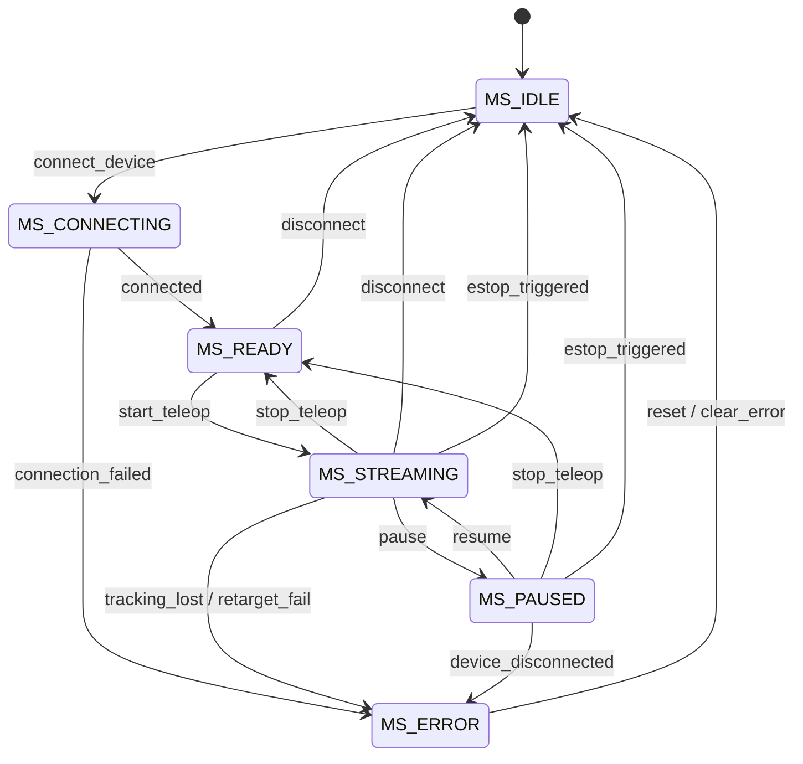
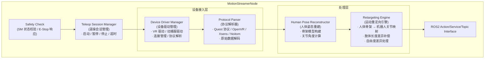
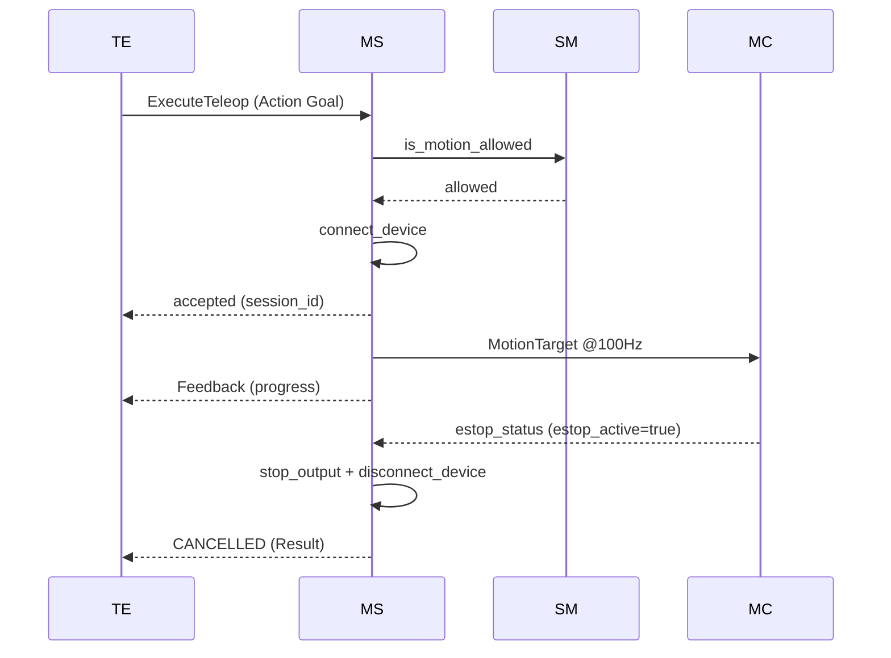

# Motion Streamer 模块设计

## 1. 模块概述与定位

**模块名称**：Motion Streamer（运动流）

**定位**：MS 是端侧软件系统中 **VR/动捕服数据接入与人体→机器人运动重定向模块**，位于运动层。它通过内置设备驱动直接连接 VR 设备（如 Meta Quest、HTC Vive）或动捕服（如 Xsens、Noitom），将人体姿态/动作数据转换为机器人关节目标，通过运动重定向（Motion Retargeting）算法生成连续的动作流，下发给 MC（Motion Control）。

MS 是机器人"遥操作"（Teleoperation）的核心数据通路——操作员穿戴 VR 设备或动捕服，实时控制机器人复现人体动作。

**核心职责**：

1. **设备接入管理**：内置 VR 设备/动捕服驱动，支持 USB/蓝牙/WiFi 直连
2. **协议解析**：解析设备原始数据流（关节角度、IMU、手柄按钮/摇杆等）
3. **人体姿态重建**：从设备数据重建人体骨架姿态
4. **运动重定向（Retargeting）**：将人体骨架姿态映射到机器人关节空间，处理肢体长度差异、关节自由度差异
5. **关节目标输出**：将重定向后的关节目标以固定频率（如 100Hz）下发给 MC
6. **遥操会话管理**：启动/暂停/停止遥操会话，管理设备连接生命周期
7. **设备状态监控**：上报设备连接状态、电池电量、跟踪质量、丢包率

**与相邻模块的边界**：

| 边界 | MS 负责 | 对方负责 |
|------|--------|---------|
| MS ↔ VR/动捕设备 | 设备驱动、协议解析、数据读取 | 原始数据采集、传感器硬件 |
| MS ↔ MC | 重定向后的关节目标流 | 底层关节控制、力矩伺服、轨迹平滑、安全限速 |
| MS ↔ TE | 接收遥操任务启动/停止/暂停指令 | 任务调度、遥操任务生命周期管理 |
| MS ↔ SM | 遥操执行前查询 is_motion_allowed、周期性状态校验 | 全局状态机、运动许可 |
| MS ↔ MC | 订阅急停信号、输出关节目标 | 急停发布、底层运动控制 |
| MS ↔ HDS | 上报设备异常、跟踪丢失、连接超时 | 故障诊断与定级 |
| MS ↔ Setting | 读取设备配置、重定向参数 | 参数持久化 |
| MS ↔ Gateway | 遥操状态/设备状态上报（Gateway 转发至云端） | 云端/APP 通信唯一出口 |

---

## 2. 职责边界

**MS 不做的事情**（红线）：

- **不做动作编排** — 不决定"做什么动作"，只负责"将人体动作映射到机器人"
- **不做轨迹平滑/整形** — 不对关节目标做低通滤波、样条插值，那是 MC 的 UC/LC 插件职责
- **不做安全限速** — 不限制关节速度/加速度，MC 的 Safety Guardian 负责硬保护
- **不做路径规划** — 不计算导航路径，那是 PnC 的职责
- **不直接操作硬件** — 不直接发送 EtherCAT 指令，通过 MC 下发
- **跳过 SM 校验** — 任何运动下发前必须调用 `/sm/is_motion_allowed`
- **不做故障定级** — 只上报原始设备数据给 HDS

**对比：MP vs MS**

| 维度 | MP（Motion Player） | MS（Motion Streamer） |
|------|-------------------|----------------------|
| 数据来源 | 预录动作文件（磁盘） | VR/动捕设备（实时） |
| 输入格式 | 关节角度序列 | 人体骨架姿态 |
| 核心算法 | 插值、时间同步 | 运动重定向（Retargeting） |
| 触发方式 | TE 调用 Action | 设备数据驱动或 TE 启动会话 |
| 输出 | 关节目标（给 MC） | 关节目标（给 MC） |
| 控制频率 | 30-60Hz | 100Hz |

---

## 3. 状态机设计

### 3.1 遥操状态枚举

| 状态 | 值 | 说明 |
|------|-----|------|
| `MS_IDLE` | 0 | 空闲，无设备连接 |
| `MS_CONNECTING` | 1 | 正在连接设备 |
| `MS_READY` | 2 | 设备已连接，等待遥操启动 |
| `MS_STREAMING` | 3 | 正在接收并重定向动作流 |
| `MS_PAUSED` | 4 | 遥操暂停（设备保持连接） |
| `MS_ERROR` | 5 | 设备故障、跟踪丢失或重定向失败 |

### 3.2 状态转换图



### 3.3 状态转换表

| 当前状态 | 目标状态 | 触发条件 | 优先级 | 说明 |
|----------|----------|----------|--------|------|
| IDLE | CONNECTING | TE 请求连接设备 | 60 | 开始设备连接 |
| CONNECTING | READY | 设备握手成功、跟踪正常 | 60 | 准备遥操 |
| CONNECTING | ERROR | 设备未响应/协议不匹配 | 70 | 连接失败 |
| READY | STREAMING | TE 发送 start_teleop | 60 | 开始遥操 |
| READY | IDLE | TE 取消 / 断开设备 | 50 | 取消连接 |
| STREAMING | PAUSED | TE 发送 pause | 80 | 暂停遥操 |
| STREAMING | READY | TE 发送 stop_teleop | 60 | 停止遥操 |
| STREAMING | ERROR | 跟踪丢失>500ms / 重定向失败 | 80 | 故障 |
| PAUSED | STREAMING | TE 发送 resume | 80 | 恢复遥操 |
| PAUSED | READY | TE 发送 stop_teleop | 60 | 从暂停停止 |
| ERROR | IDLE | 人工复位或 clear_error Service | 60 | 故障复位 |
| STREAMING | IDLE | 收到急停信号 (estop_triggered) | 100 | 最高优先级急停 |
| PAUSED | IDLE | 收到急停信号 (estop_triggered) | 100 | 最高优先级急停 |

### 3.4 状态转换约束

1. **E-Stop 立即响应**：收到 `/mc/estop_status`（或等效急停信号 Topic）的 `estop_active=true` 时，**立即断开设备连接、停止 MotionTarget 输出、转入 IDLE**。E-Stop 响应使用独立 CallbackGroup，不阻塞设备数据循环
2. **连接超时**：CONNECTING 状态超过 10s 未就绪 → 自动转入 ERROR，并上报 HDS
3. **跟踪丢失**：STREAMING 状态下跟踪丢失 >500ms → 转入 ERROR 并上报 HDS
4. **重定向失败**：人体骨架与机器人 URDF 不匹配导致 retargeting 失败 → 转入 ERROR
5. **状态变更时**发布 `/ms/teleop_state` Topic
6. **ERROR 恢复**：MS_ERROR 状态的恢复必须经人工确认（TE 或 Gateway 显式调用 `clear_error`），禁止自动恢复

---

## 4. ROS2 接口定义

### 4.1 消息定义 (msg)

```
# ms_msgs/msg/TeleopState.msg
# 遥操会话状态广播

uint8 state                 # 当前状态
uint8 prev_state
builtin_interfaces/Time state_changed_at
string device_id            # 设备标识
string device_type          # 设备类型 ("vr_quest", "xsens", "noitom" 等)
bool device_connected       # 设备是否连接
float32 tracking_quality    # 跟踪质量 (0.0-1.0)
uint32 frame_count          # 已处理帧数
float32 stream_frequency    # 实际输出频率 (Hz)
```

```
# ms_msgs/msg/DeviceState.msg
# 设备硬件状态广播

builtin_interfaces/Time stamp
string device_id
string device_type
bool connected              # 连接状态
float32 battery_percent     # 电池电量 (0.0-1.0, -1=不支持)
uint8 tracking_state        # 0=LOST, 1=SEARCHING, 2=TRACKING
float32 tracking_quality    # 跟踪质量
uint32 dropped_frames       # 累计丢帧数
float32 latency_ms          # 设备到 MS 的延迟 (ms)
string[] active_trackers    # 活跃追踪器列表
```

```
# mc_msgs/msg/MotionTarget.msg
# 直接关节目标（MS → MC，定义见 mc_design.md §4.1）
# MS 输出时 source_id="ms"，控制类型由 RetargetingConfig 决定

builtin_interfaces/Time stamp
string source_id             # 来源标识: "ms"
string[] joint_names         # 目标关节名称列表
float64[] positions          # 关节目标位置 [rad]
float64[] velocities         # 关节目标速度 [rad/s]
float64[] accelerations      # 关节目标加速度 [rad/s^2]
float64[] efforts            # 关节目标力矩 [Nm]
uint8 control_type           # 0=位置优先, 1=速度优先, 2=力矩优先
```

> **说明**：MS 不使用独立的 `ms_msgs/MotionTarget`。运动目标统一使用 `mc_msgs/MotionTarget`，确保 MS → MC 消息类型兼容。MS 的设备元数据（device_id、source_type 如 VR/MOCAP）通过 `/ms/teleop_state` 和 `/ms/device_state` 并行发布，MC 按需订阅。

```
# ms_msgs/msg/RetargetingConfig.msg
# 重定向配置（用于启动遥操时传递参数）

string urdf_hash            # 目标机器人 URDF 的 SHA256 前 8 位（用于校验 MS 与目标机器人模型一致）
float32[] limb_scale_factors # 肢体缩放因子 [臂长, 腿长, 躯干]
bool mirror_mode            # 镜像模式（左右翻转）
float32 position_gain       # 位置映射增益
string[] enabled_joints     # 启用的关节列表（空=全部）
```

```
# ms_msgs/msg/Heartbeat.msg
# MS 心跳（遵循 interface_standards.md 统一模板）

builtin_interfaces/Time stamp
string node_name
uint8 node_state              # 模块运行状态: 0=INIT, 1=IDLE, 2=RUNNING, 3=ERROR
bool healthy
string status_message
float32 output_frequency      # 实际输出频率 (Hz)
```

### 4.2 Action 定义 (action)

```
# ms_msgs/action/ExecuteTeleop.action
# 执行遥操会话（长耗时操作）

# Goal
string device_id            # 设备标识
string device_type          # 设备类型
RetargetingConfig config    # 重定向配置
int32 timeout_sec           # 会话超时（秒）

---
# Result
bool success
uint16 error_code
string message
builtin_interfaces/Time actual_duration

---
# Feedback
uint8 state                 # 当前遥操状态
float32 progress_percent    # 进度 0.0-100.0
float32 tracking_quality    # 跟踪质量
uint32 frames_processed
string current_phase        # 当前阶段描述
```

### 4.3 服务定义 (srv)

```
# ms_msgs/srv/StartTeleop.srv
# 启动遥操会话

string device_id
string device_type
RetargetingConfig config
int32 timeout_sec
---
bool success
uint16 error_code
string message
string session_id
```

```
# ms_msgs/srv/StopTeleop.srv
# 停止遥操会话

string session_id
bool emergency              # true=立即停止并断开设备
---
bool stopped
uint16 error_code
string message
```

```
# ms_msgs/srv/PauseTeleop.srv
# 暂停/恢复遥操

string session_id
bool pause                  # true=暂停, false=恢复
---
bool success
uint16 error_code
string message
uint8 state                 # 暂停/恢复后的状态
```

```
# ms_msgs/srv/GetDeviceStatus.srv
# 查询设备状态

string device_id            # 空=查询所有设备
---
bool success
DeviceState[] devices
uint32 count
```

```
# ms_msgs/srv/GetHealthStatus.srv

# Request（空）
---
bool success
string node_name
builtin_interfaces/Time uptime_since
uint8 state
bool healthy
string message
```

### 4.4 接口汇总表

#### Topics（输出）

| 名称 | 类型 | 方向 | QoS | 频率 | 说明 |
|------|------|------|-----|------|------|
| `/ms/motion_target` | `mc_msgs/msg/MotionTarget` | MS → MC | **Best Effort** + Volatile + Depth 1 | 100 Hz | 重定向后的关节目标（实时控制流，丢帧用最新帧替代） |
| `/ms/teleop_state` | `ms_msgs/msg/TeleopState` | MS → ALL | Reliable + Transient Local + Depth 1 | 事件驱动 | 遥操状态广播 |
| `/ms/device_state` | `ms_msgs/msg/DeviceState` | MS → EM/HDS | Reliable + Volatile + Depth 1 | 10 Hz | 设备状态 |
| `/ms/heartbeat` | `ms_msgs/msg/Heartbeat` | MS → EM/HDS | Reliable + Volatile + Depth 1 | 1 Hz | 心跳 |

#### Actions

| 名称 | 类型 | 调用方 | 说明 |
|------|------|--------|------|
| `/ms/execute_teleop` | `ms_msgs/action/ExecuteTeleop` | **TE**（主路径） | 长耗时遥操会话（含进度反馈） |

#### Services

| 名称 | 类型 | 调用方 | 说明 |
|------|------|--------|------|
| `/ms/start_teleop` | `ms_msgs/srv/StartTeleop` | TE（DEBUG 模式直接调用） | 启动遥操会话 |
| `/ms/stop_teleop` | `ms_msgs/srv/StopTeleop` | TE（DEBUG 模式直接调用） | 停止遥操 |
| `/ms/pause_teleop` | `ms_msgs/srv/PauseTeleop` | TE（DEBUG 模式直接调用） | 暂停/恢复遥操 |
| `/ms/get_device_status` | `ms_msgs/srv/GetDeviceStatus` | TE, HDS | 查询设备状态 |
| `/ms/get_health_status` | `ms_msgs/srv/GetHealthStatus` | EM, HDS | 健康查询 |

> **控制路径统一原则**：正常模式下，Gateway 的遥操请求通过 TE 调度（Gateway → TE → MS Action）。Service 接口仅用于 DEBUG/紧急绕过场景，生产环境由 TE 独占 Action 调用权。
>
> **并发互斥**：MS 内部维护 `session_mutex`，Start/Stop/Pause Service 与 ExecuteTeleop Action 共享同一会话状态。同一时刻仅允许一个活跃遥操会话，后到达的请求返回 `ERR_ALREADY_STREAMING`。

#### MC 订阅的 Topics

| 名称 | 类型 | 说明 |
|------|------|------|
| `/ms/motion_target` | `mc_msgs/msg/MotionTarget` | 重定向后的关节目标（MC 做平滑/限速后下发） |

---

## 5. 内部设计

### 5.1 节点架构



### 5.2 关键设计决策

1. **设备驱动插件化**：每种 VR/动捕设备实现统一的 `DeviceDriver` 接口，支持热插拔和动态加载
2. **重定向算法可配置**：支持多种 retargeting 策略（基于 IK 的末端匹配、基于关节角度直接映射、混合模式）
3. **URDF 基准**：重定向以机器人 URDF 为基准，人体骨架做比例缩放适配
4. **左右镜像模式**：支持操作员面向机器人时的左右镜像映射
5. **部分身体遥操**：可配置只映射上半身（手臂）或下半身（行走），未映射关节保持当前状态

### 5.3 关键流程

#### 5.3.1 遥操会话启动流程

```
TE 发送 StartTeleop Service 请求
  → MS 接收请求
  → Safety Check:
      1. 调用 /sm/is_motion_allowed 查询当前状态
         → 不允许 → 拒绝，返回 ERR_MOTION_NOT_ALLOWED
      2. 检查 device_type 是否支持
         → 不支持 → 返回 ERR_DEVICE_NOT_SUPPORTED
  → Device Driver Manager:
      1. 加载对应设备驱动
      2. 初始化设备连接
      3. 等待设备握手（超时 10s）
         → 超时 → 返回 ERR_DEVICE_TIMEOUT
  → 状态变为 READY
  → Protocol Parser 开始接收数据
  → Human Pose Reconstructor 开始重建姿态
  → Retargeting Engine 开始映射
  → STREAMING 状态下每周期 SM 校验：
      检查本地缓存的 SM 状态（来自 /sm/robot_state 订阅）
      → 状态 != ACTIVE → 跳过输出，连续 3 次后转入 IDLE
  → 输出 MotionTarget 到 /ms/motion_target
  → 发布 /ms/teleop_state (STREAMING)
```

#### 5.3.2 E-Stop 响应流程

```
MC 发布 /mc/estop_status (estop_active=true)
  → MS 订阅收到（独立 CallbackGroup，不阻塞）
  → 立即停止 Retargeting Engine 输出
  → 清空 MotionTarget 输出缓冲区
  → 断开设备连接（强制，非可选）
  → 状态变为 IDLE
  → 发布 /ms/teleop_state (IDLE)
  → 若当前有 ExecuteTeleop Action 进行中，终止 Action（发送 CANCELLED Result）
```

**关键设计决策**：
- E-Stop 信号由 MC 发布，MS 直接订阅，不经过 SM（SM 在急停时保持 ACTIVE 不变）
- 急停响应时间目标：从收到信号到停止输出的处理延迟 < 1ms（独立回调线程，不依赖 ROS2 executor 调度）
- 端到端延迟（设备触发急停 → MC 处理 → MS 收到信号）单独预算，不含在上述 1ms 内

#### 5.3.3 运动重定向流程

```
设备原始数据（关节角度/IMU/位置）
  → Protocol Parser 解码
  → Human Pose Reconstructor 构建人体骨架姿态
  → Retargeting Engine:
      1. 肢体长度缩放：根据目标机器人 URDF 调整映射比例（URDF 通过 `/robot_description` 获取）
      2. 自由度映射：将人体关节映射到机器人关节
         → 人体 DOF > 机器人 DOF：取主自由度，丢弃次要自由度
         → 人体 DOF < 机器人 DOF：使用 IK 补全
      3. 镜像变换（如 mirror_mode=true）
      4. 关节限位预检（软检查，超限告警但不裁剪——裁剪由 MC 做）
  → 封装为 MotionTarget
  → 发布到 /ms/motion_target
```

---

## 6. 与其他模块的交互

### 6.1 交互矩阵

| 模块 | 方向 | 接口 | 说明 |
|------|------|------|------|
| VR/动捕设备 | 设备 → MS | 专有协议（USB/蓝牙/WiFi） | 原始传感器数据 |
| TE | TE → MS | `/ms/execute_teleop` (Action) | 启动/停止/取消遥操会话（主控制路径） |
| TE | TE → MS | `/ms/start_teleop` (Service) | DEBUG 模式下直接启动 |
| TE | TE → MS | `/ms/stop_teleop` (Service) | DEBUG 模式下直接停止 |
| TE | TE → MS | `/ms/pause_teleop` (Service) | DEBUG 模式下暂停/恢复 |
| MC | MS → MC | `/ms/motion_target` (Topic) | 重定向后的关节目标（`mc_msgs/MotionTarget`） |
| SM | MS → SM | `/sm/is_motion_allowed` (Service) | 启动前状态校验 |
| SM | SM → MS | `/sm/robot_state` (Topic) | 订阅状态，周期性校验 + FAULT 响应 |
| MC | MC → MS | `/mc/estop_status` (Topic) | 急停信号订阅（独立 CallbackGroup） |
| HDS | MS → HDS | `/hds/report_diagnosis` (Service) | 上报设备异常、跟踪丢失、连接超时 |
| Setting | MS → Setting | `/setting/get_parameter` (Service) | 读取设备配置、重定向参数 |
| Gateway | Gateway → TE | 任务请求 | APP 遥操请求由 TE 调度后转发给 MS |
| EM | EM → MS | `/ms/get_health_status` (Service) | 健康检查 |

### 6.2 关键交互时序

#### 时序：遥操启动与急停



---

## 7. 关键参数与配置

| 参数名 | 类型 | 默认值 | 说明 |
|--------|------|--------|------|
| `output_frequency_hz` | float | 100.0 | 关节目标输出频率（Hz） |
| `device_connect_timeout_sec` | float | 10.0 | 设备连接超时（秒） |
| `tracking_lost_threshold_ms` | int | 500 | 跟踪丢失判定阈值（ms） |
| `default_limb_scale_arm` | float | 1.0 | 默认臂长缩放因子 |
| `default_limb_scale_leg` | float | 1.0 | 默认腿长缩放因子 |
| `default_position_gain` | float | 1.0 | 默认位置映射增益 |
| `enable_mirror_mode` | bool | false | 默认是否启用镜像 |
| `retargeting_algorithm` | string | "ik_based" | 重定向算法（ik_based/direct_mapping/hybrid） |
| `max_joint_velocity_warn` | float | 5.0 | 关节速度告警阈值（rad/s），超限上报但不裁剪 |
| `device_heartbeat_timeout_ms` | int | 1000 | 设备心跳超时（ms） |

---

## 8. 错误码定义

```
# ms_msgs/msg/ErrorCode.msg
uint16 OK                           = 0
uint16 ERR_MOTION_NOT_ALLOWED       = 8001   # SM 不允许运动
uint16 ERR_DEVICE_NOT_SUPPORTED     = 8002   # 不支持的设备类型
uint16 ERR_DEVICE_TIMEOUT           = 8003   # 设备连接超时
uint16 ERR_DEVICE_DISCONNECTED      = 8004   # 设备断开连接
uint16 ERR_TRACKING_LOST            = 8005   # 跟踪丢失
uint16 ERR_RETARGETING_FAILED       = 8006   # 运动重定向失败
uint16 ERR_INVALID_CONFIG           = 8007   # 配置参数无效
uint16 ERR_SESSION_NOT_FOUND        = 8008   # 会话不存在
uint16 ERR_ALREADY_STREAMING        = 8009   # 已有遥操会话进行中
uint16 ERR_DEVICE_BUSY              = 8010   # 设备被其他进程占用
uint16 ERR_PROTOCOL_MISMATCH        = 8011   # 协议版本不匹配
uint16 ERR_JOINT_MISMATCH           = 8012   # 人体关节与机器人关节无法映射
uint16 ERR_CONCURRENT_OPERATION     = 8013   # 并发操作冲突（已有会话进行中）
```

| 错误码 | 常量名 | 说明 | 严重级别 |
|--------|--------|------|----------|
| 0 | OK | 成功 | — |
| 8001 | ERR_MOTION_NOT_ALLOWED | SM 不允许运动 | HIGH |
| 8002 | ERR_DEVICE_NOT_SUPPORTED | 不支持的设备类型 | MEDIUM |
| 8003 | ERR_DEVICE_TIMEOUT | 设备连接超时 | MEDIUM |
| 8004 | ERR_DEVICE_DISCONNECTED | 设备断开连接 | HIGH |
| 8005 | ERR_TRACKING_LOST | 跟踪丢失 | HIGH |
| 8006 | ERR_RETARGETING_FAILED | 运动重定向失败 | HIGH |
| 8007 | ERR_INVALID_CONFIG | 配置参数无效 | LOW |
| 8008 | ERR_SESSION_NOT_FOUND | 会话不存在 | LOW |
| 8009 | ERR_ALREADY_STREAMING | 已有遥操会话进行中 | LOW |
| 8010 | ERR_DEVICE_BUSY | 设备被占用 | MEDIUM |
| 8011 | ERR_PROTOCOL_MISMATCH | 协议版本不匹配 | MEDIUM |
| 8012 | ERR_JOINT_MISMATCH | 关节映射失败 | HIGH |
| 8013 | ERR_CONCURRENT_OPERATION | 并发操作冲突 | LOW |

---

## 9. 安全约束

1. **SM 校验强制**：遥操会话启动前必须查询 `/sm/is_motion_allowed`，不允许则拒绝启动；STREAMING 状态下每周期检查本地缓存的 SM 状态
2. **E-Stop 独立回调组**：订阅 `/mc/estop_status` 使用独立 CallbackGroup，确保急停响应不被设备数据循环阻塞
3. **急停后强制断开**：E-Stop 触发后，MS 必须**立即断开设备连接**、清空 MotionTarget 缓冲区、状态变为 IDLE
4. **跟踪丢失保护**：跟踪丢失超过阈值时自动停止遥操输出，避免机器人执行无效动作
5. **关节限位预检**：重定向结果超出关节物理限位时，MS 上报 WARNING 但不裁剪——裁剪由 MC 的 Safety Guardian 执行
6. **设备心跳监控**：设备超过心跳超时未响应 → 标记设备断开并停止输出，上报 HDS
7. **速度告警**：重定向生成的关节速度超过 `max_joint_velocity_warn` 时上报 HDS（不裁剪）
8. **遥操区域限制**（实验性功能，默认关闭）：结合 VSLAM/Perception 数据，MS 可拒绝导致机器人移出安全区域的遥操指令

---

## 10. 包结构

```
ms_msgs/                # 消息定义包
- msg/
    - TeleopState.msg
    - DeviceState.msg
    - RetargetingConfig.msg
    - Heartbeat.msg
- srv/
    - StartTeleop.srv
    - StopTeleop.srv
    - PauseTeleop.srv
    - GetDeviceStatus.srv
    - GetHealthStatus.srv
- action/
    - ExecuteTeleop.action
- CMakeLists.txt
- package.xml

ms/                     # 节点实现包
- include/ms/
    - ms_node.hpp
    - device_driver_manager.hpp
    - device_driver_interface.hpp
    - protocol_parser.hpp
    - human_pose_reconstructor.hpp
    - retargeting_engine.hpp
    - teleop_session_manager.hpp
- src/
    - ms_node.cpp
    - device_driver_manager.cpp
    - protocol_parser.cpp
    - human_pose_reconstructor.cpp
    - retargeting_engine.cpp
    - teleop_session_manager.cpp
    - main.cpp
- test/
    - test_retargeting_engine.cpp
    - test_teleop_session.cpp
    - test_device_driver.cpp
    - test_integration.cpp
- config/
    - ms_params.yaml
- launch/
    - ms.launch.py
- CMakeLists.txt
- package.xml

# 外部依赖消息包
mc_msgs/                # MC 定义的消息（MS 订阅/发布）
- msg/
    - MotionTarget.msg   # MS 输出到 /ms/motion_target 的消息类型
```

---

## 11. 关键性能指标 (KPI)

| 指标 | 目标值 | 说明 |
|------|--------|------|
| 设备连接时间 | < 3s | 从请求连接到 READY |
| 端到端延迟 | < 30ms | 设备数据到 MC 收到 MotionTarget |
| 输出频率 | 100 ± 2 Hz | 关节目标发布频率 |
| 重定向计算耗时 | < 5ms | 单帧人体姿态 → 机器人关节 |
| 跟踪丢失检测时间 | < 100ms | 从实际丢失到 MS 停止输出 |
| E-Stop 处理延迟 | < 1ms | MS 收到急停信号到停止输出（独立线程，不含 ROS2 传输延迟） |
| 支持的设备类型 | ≥ 3 | Quest/Xsens/Noitom 等 |
| 内存占用 | < 128MB | 含设备缓冲和骨架模型 |
| 关节映射精度 | < 0.01 rad | 人体动作复现到机器人的精度 |
| 丢包率容忍 | < 5% | 正常遥操的丢包上限 |

---

## 12. 设计审查记录

> **审查日期**：2026-05-18
> **修复日期**：2026-05-18
> **审查模块**：Motion Streamer (MS)
> **总体判决**：NEEDS_REVISION → **APPROVED_WITH_CONDITIONS**（已修复，待实现验证）

### 12.1 审查概况

本次审查由 `safety-validator`（安全审查）和 `architecture-advisor`（架构审查）并行执行，依据：
- `CLAUDE.md` 系统架构原则
- `sm_design.md` 全局状态机设计（含 E-Stop 解耦原则）
- `mc_design.md` 运动控制协调器接口定义
- `te_design.md` 任务引擎交互矩阵

### 12.2 关键问题汇总（按优先级排序）

#### P0 — 阻塞实现（Critical / High）

| # | 问题 | 类别 | 位置 | 影响 |
|---|------|------|------|------|
| P0-1 | E-Stop 路径与 SM 最新设计脱节 | 安全+架构 | §3.2, §3.3, §3.4, §5.3.2 | SM 已删除 `ACTIVE_E_STOP`，MS 仍通过 `/sm/robot_state` 感知急停，实际无法触发 |
| P0-2 | E-Stop 后"可选"保持设备连接 | 安全 | §3.3, §3.4, §5.3.2 | 急停后保留设备连接存在误恢复风险，必须强制断开 |
| P0-3 | TE→MS 双重控制路径（Action + Service） | 架构 | §4.2, §4.3, §4.4 | TE 设计仅使用 Action，MS 额外开放 Service 导致状态机竞争 |
| P0-4 | MotionTarget 消息类型与 MC 不兼容 | 架构 | §4.1 | MS 和 MC 定义了不同字段集的 MotionTarget，Topic 类型不匹配 |
| P0-5 | STREAMING 状态缺少周期性 SM 校验 | 安全 | §5.3.1, §5.3.3 | 仅启动时校验一次，SM 后续变为 FAULT 时 MS 继续输出运动指令 |

#### P1 — 必须修复

| # | 问题 | 类别 | 位置 |
|---|------|------|------|
| P1-1 | ERROR → IDLE 允许"自动恢复" | 安全 | §3.3, §3.2 | 自动恢复违反故障人工确认原则 |
| P1-2 | Action cancel / E-Stop Result 方向描述错误 | 安全+架构 | §5.3.2 | MS 是 Action Server，E-Stop 时应终止 Action 而非"发送 Cancel 给 TE" |
| P1-3 | Service 并发调用安全未定义 | 安全 | §4.3, §5.3.1 | Start/Stop/Pause Service 可被并行调用，缺少互斥机制 |
| P1-4 | 急停响应 <10ms 缺乏技术保证 | 安全 | §11 | 依赖 ROS2 Topic 回调难以保证硬实时，需定义独立线程/信号路径 |
| P1-5 | `/ms/motion_target` QoS 应为 Best Effort | 架构 | §4.4 | 100Hz 实时控制流使用 Reliable 会导致回压延迟 |
| P1-6 | Gateway 不应直接调用 MS Service | 架构 | §1, §4.4, §6.1 | 绕过 TE 调度导致任务状态不一致，应走 Gateway → TE → MS |

#### P2 — 建议修复

| # | 问题 | 类别 | 位置 |
|---|------|------|------|
| P2-1 | CONNECTING 超时未上报 HDS | 安全 | §3.3, §3.4 | 设备连接超时是硬件故障信号，应上报 HDS |
| P2-2 | Heartbeat `state` 字段语义模糊 | 架构 | §4.1 | `state` 是遥操会话状态还是模块健康状态？建议拆分 |
| P2-3 | `RetargetingConfig.urdf_reference` 语义不明 | 架构 | §4.1 | 未说明是路径、URI 还是标识符 |
| P2-4 | 遥操区域限制缺少实现路径 | 安全 | §9 | 依赖 VSLAM/Perception 但未定义订阅接口 |

### 12.3 修复建议详细说明

#### R1: E-Stop 路径重构（P0-1, P0-2, P1-4）

SM 设计已明确：急停不经过 SM，SM 保持 `ACTIVE` 不变。MS 的 E-Stop 响应必须改为：

```
MC 急停触发
  → MC 发布 /mc/estop_status (estop_active=true)
  → MS 订阅 /mc/estop_status（独立 CallbackGroup）
  → MS 立即停止 MotionTarget 输出
  → MS 断开设备连接（强制，非可选）
  → MS 状态变为 IDLE
  → MS 终止当前 ExecuteTeleop Action（发送 CANCELLED Result）
```

同时保留 SM 状态校验路径（用于非急停的状态变化，如 SM → FAULT）。

#### R2: 统一 TE→MS 控制接口（P0-3）

**推荐方案**：删除 `/ms/start_teleop`、`/ms/stop_teleop`、`/ms/pause_teleop` 三个 Service，仅保留 `/ms/execute_teleop` Action。

控制路径统一为：
```
Gateway / APP → TE → MS Action
```

Gateway 的紧急控制需求通过 TE 的紧急任务中断机制实现，不直接操作 MS。

若必须保留调试/紧急 Service，应在文档中明确标注为"DEBUG 模式，TE 调度器不参与"，并增加互锁逻辑。

#### R3: 统一 MotionTarget 消息类型（P0-4）

MS 应直接使用 `mc_msgs/MotionTarget` 作为输出消息类型，删除 `ms_msgs/MotionTarget`。

MS 专属信息（`device_id`, `source_type`）可通过以下方式处理：
- 方案 A：作为 `mc_msgs/MotionTarget` 的扩展字段（修改 mc_msgs）
- 方案 B：通过独立 Topic `/ms/teleop_metadata` 并行发布

#### R4: STREAMING 周期性 SM 校验（P0-5）

在 STREAMING 状态下，每周期（或至少每 100ms）检查本地缓存的 SM 状态：
- 缓存来源：MS 订阅 `/sm/robot_state`，由回调更新本地原子变量
- 检查点：在 `on_device_poll()` 发布 MotionTarget **之前**检查
- 若 `sm_state != ACTIVE`：跳过本次输出，连续 3 次异常后转入 IDLE

```cpp
// 伪代码
void on_device_poll() {
  if (cached_sm_state_ != SM_ACTIVE) {
    sm_violation_count_++;
    if (sm_violation_count_ >= 3) {
      transition_to(State::IDLE);
    }
    return;
  }
  sm_violation_count_ = 0;
  auto target = retarget_human_pose();
  motion_target_pub_->publish(target);
}
```

#### R5: ERROR 恢复改为人工确认（P1-1）

删除"自动恢复"选项。MS_ERROR 恢复路径：
1. 设备断开/跟踪丢失：由 TE/Gateway 显式调用 `ResetError` Service（新增）
2. 配置错误：操作员修正配置后手动复位
3. SM 处于 FAULT：MS 拒绝所有恢复请求，等待 SM FAULT 解除

#### R6: Service 并发互斥（P1-3）

增加 `session_mutex_`：任何状态变更操作必须获取互斥锁。
- Action 和 Service 共享同一会话状态
- 后到达的 start 请求返回 `ERR_ALREADY_STREAMING`
- 定义 `ERR_CONCURRENT_OPERATION` 错误码处理竞态

#### R7: MotionTarget QoS 改为 Best Effort（P1-5）

```
/ms/motion_target: Best Effort + Volatile + Depth 1
```

实时控制流丢弃旧帧优于阻塞等待确认。可靠性由 MS 持续发布 + MC 始终取最新帧保证。

### 12.4 修复后复审检查清单

- [x] 删除 MS 文档中所有对 `ACTIVE_E_STOP` 的引用
- [x] 明确 MS E-Stop 订阅 Topic（`/mc/estop_status`）
- [x] E-Stop 流程中"保持设备连接"改为"强制断开"
- [x] Service 标注为 DEBUG 模式，主路径统一为 Action
- [x] 统一使用 `mc_msgs/MotionTarget`，删除 `ms_msgs/MotionTarget`
- [x] 增加 STREAMING 周期性 SM 校验设计
- [x] ERROR 恢复改为人工确认，删除"自动恢复"
- [x] 增加 Service/Action 并发互斥设计（`session_mutex` + `ERR_CONCURRENT_OPERATION`）
- [x] 急停响应时间定义改为"收到信号后的处理延迟 <1ms"
- [x] MotionTarget QoS 改为 Best Effort
- [x] Gateway 调用路径改为 Gateway → TE → MS
- [x] Heartbeat `state` 改为 `node_state`，语义为模块运行状态
- [x] `RetargetingConfig.urdf_reference` 改为 `urdf_hash`，语义明确
- [x] CONNECTING 超时增加上报 HDS 要求
- [x] 遥操区域限制标注为实验性功能（默认关闭）

### 12.5 审查结论

MS 设计文档在**职责边界**和**基本架构方向**上正确（VR/动捕数据接入 + 运动重定向，不做整形/限速），但存在 **4 个 Critical** 和 **6 个 High** 级别问题，主要集中在：

1. **E-Stop 路径与最新 SM/MC 架构不匹配**（最严重）
2. **TE→MS 控制接口存在双重路径**
3. **MS→MC 消息类型不兼容**
4. **STREAMING 状态缺少持续安全校验**

**修复状态**：上述 Critical 和 High 级别问题已于 2026-05-18 全部修复。主要变更：

1. E-Stop 路径从 `/sm/robot_state` 改为 `/mc/estop_status`（与 SM 急停解耦设计一致）
2. TE→MS 控制路径统一为 Action，Service 标注为 DEBUG 模式
3. MotionTarget 统一使用 `mc_msgs/MotionTarget`，MS 不再定义独立消息类型
4. STREAMING 增加周期性 SM 校验和急停响应处理延迟 <1ms 目标
5. ERROR 恢复改为人工确认，增加 `ERR_CONCURRENT_OPERATION` 错误码
6. Gateway 调用路径改为 Gateway → TE → MS

**遗留条件（实现阶段需验证）**：
- `mc_msgs/MotionTarget.msg` 需与 mc_design.md §4.1 保持一致并实际创建
- `/mc/estop_status` Topic 需由 MC 实现并发布
- `session_mutex` 并发互斥需在单元测试中覆盖（`test_teleop_session.cpp`）
- E-Stop 独立回调组的延迟需在实际硬件上测量验证
