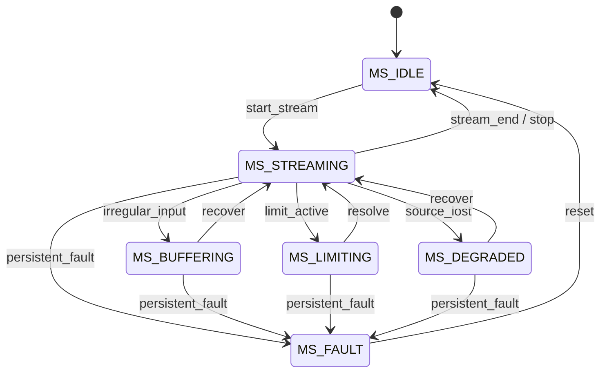
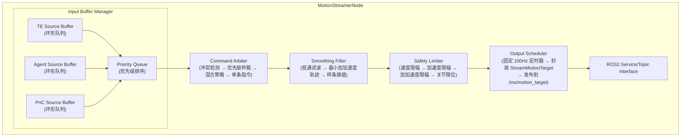
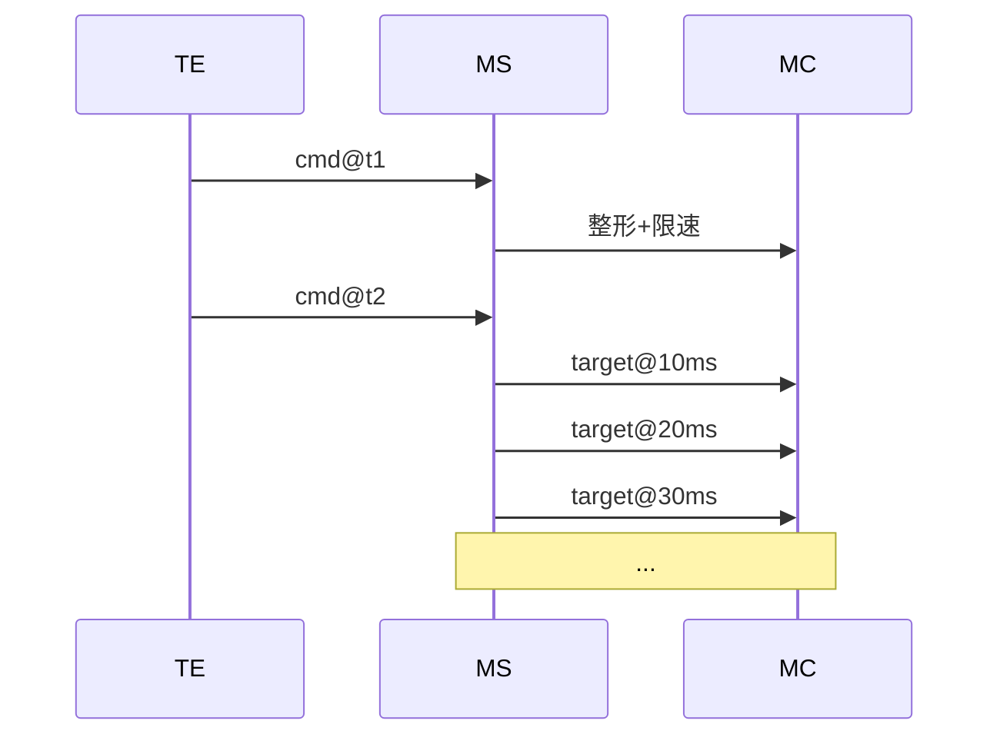

# Motion Streamer 模块设计

## 1. 模块概述与定位

**模块名称**：Motion Streamer（动作流）

**定位**：MS 是端侧软件系统中的**运动指令流式整形与调度中心**，位于运动层。它接收来自 TE（任务引擎）或 Agent（自主决策）的连续运动指令流（如目标姿态、目标速度、目标轨迹点），对指令进行平滑整形、冲突检测、安全限速，然后以固定频率（如 100Hz）将整形后的运动指令流下发给 MC（Motion Control）。MS 是运动指令的"音频 DAC"——将离散/不规则的指令流转换为平滑、连续、高频率的控制信号。

**核心职责**：

1. **指令流接收**：接收来自 TE/Agent 的运动指令流（姿态、速度、力矩、步态参数）
2. **指令整形**：对离散指令进行平滑滤波（低通滤波、最小加加速度轨迹），消除抖动
3. **安全限速**：限制关节速度、加速度、加加速度（jerk），确保物理可行性
4. **冲突仲裁**：多个来源同时发送指令时，按优先级和混合策略仲裁
5. **固定频率输出**：以 100Hz 稳定频率向 MC 输出整形后的运动指令
6. **指令缓冲**：维护指令环形缓冲区，处理上游不规则到达的指令
7. **插值与预测**：在指令稀疏时进行插值，指令密集时进行平滑

**与相邻模块的边界**：

| 边界 | MS 负责 | 对方负责 |
|------|--------|---------|
| MS ↔ TE | 接收任务级运动指令流 | 任务调度、运动策略决策 |
| MS ↔ Agent | 接收自主决策的实时运动指令 | VLA 决策、技能执行 |
| MS ↔ MC | 下发整形后的高频运动指令流 | 底层关节控制、力矩伺服 |
| MS ↔ SM | 指令流下发前查询 is_motion_allowed | 全局状态机、运动许可 |
| MS ↔ HDS | 上报指令异常（超限、冲突） | 故障诊断与定级 |
| MS ↔ Setting | 读取限速参数、滤波参数 | 参数持久化 |

---

## 2. 职责边界

**MS 不做的事情**（红线）：

- **不做运动策略决策** — 不决定"做什么动作"，只负责"如何平滑传递"
- **不做底层伺服控制** — 不直接计算电机力矩，通过 MC 下发
- **不做路径规划** — 不计算导航路径，那是 PnC 的职责
- **不做感知处理** — 不根据环境感知调整指令（上游已考虑）
- **不直接操作硬件** — 不直接发送 EtherCAT 指令
- **跳过 SM 校验** — 任何指令下发前必须调用 `/sm/is_motion_allowed`

---

## 3. 状态机设计

### 3.1 流状态枚举

| 状态 | 值 | 说明 |
|------|-----|------|
| `MS_IDLE` | 0 | 空闲，无指令流 |
| `MS_STREAMING` | 1 | 正常流式传输中 |
| `MS_BUFFERING` | 2 | 指令缓冲中（上游不规律，正在平滑） |
| `MS_LIMITING` | 3 | 安全限速生效（指令被裁剪） |
| `MS_DEGRADED` | 4 | 降级（单源输入或降低频率） |
| `MS_FAULT` | 5 | 故障（缓冲区溢出或持续超限） |

### 3.2 状态转换图



### 3.3 状态转换表

| 当前状态 | 目标状态 | 触发条件 | 优先级 | 说明 |
|----------|----------|----------|--------|------|
| IDLE | STREAMING | 收到第一个有效指令 | 60 | 开始流式传输 |
| STREAMING | IDLE | 指令流结束或停止信号 | 60 | 流结束 |
| STREAMING | BUFFERING | 输入间隔不规则（方差 > 阈值） | 50 | 进入缓冲平滑 |
| BUFFERING | STREAMING | 输入恢复规律 | 50 | 恢复直接传输 |
| STREAMING | LIMITING | 指令触发安全限速 | 70 | 限速生效 |
| LIMITING | STREAMING | 输入回到安全范围 | 70 | 解除限速 |
| STREAMING | DEGRADED | 多源输入中某源断开 | 50 | 降级运行 |
| DEGRADED | STREAMING | 断开源恢复 | 50 | 恢复全功能 |
| LIMITING | FAULT | 持续限速超过 10s | 80 | 故障 |
| BUFFERING | FAULT | 缓冲区溢出 | 80 | 故障 |
| FAULT | IDLE | 人工复位或自动恢复 | 60 | 故障复位 |
| * | IDLE | SM 状态变为非运动允许 / E-Stop | 100 | 最高优先级急停 |

### 3.4 状态转换约束

1. **E-Stop 立即响应**：收到 `/sm/robot_state` 变为非运动允许状态时，立即转入 IDLE，清空缓冲区
2. **缓冲区溢出**：环形缓冲区满时丢弃最旧帧，标记 BUFFERING → FAULT
3. **限速持续告警**：LIMITING 状态超过 10s 自动上报 HDS
4. **输出频率稳定**：无论输入频率如何变化，输出频率保持 100Hz ± 1%
5. **状态变更时**发布 `/ms/motion_streamer_state` Topic

---

## 4. ROS2 接口定义

### 4.1 消息定义 (msg)

```
# ms_msgs/msg/MotionStreamerState.msg
# 流状态广播

uint8 state                 # 当前状态
uint8 prev_state
builtin_interfaces/Time state_changed_at
float32 output_frequency    # 实际输出频率（Hz）
float32 buffer_usage        # 缓冲区使用率（0.0-1.0）
uint32 active_sources       # 活跃输入源数量
bool limiting_active        # 是否正在限速
```

```
# ms_msgs/msg/MotionCommand.msg
# 上游运动指令（输入）

string source_id            # 指令来源标识（"te", "agent", "pnc"）
uint8 priority              # 优先级（0-255，越大越高）
float64[] target_positions  # 目标关节位置（rad，可选）
float64[] target_velocities # 目标关节速度（rad/s，可选）
float64[] target_efforts    # 目标关节力矩（Nm，可选）
geometry_msgs/Pose base_target_pose   # 基座目标位姿（可选）
geometry_msgs/Twist base_target_twist # 基座目标速度（可选）
builtin_interfaces/Time command_time  # 指令生效时间
float32 transition_time     # 过渡到该指令的时间（s）
string[] active_joints      # 该指令控制的关节列表
```

```
# ms_msgs/msg/StreamMotionTarget.msg
# 流式整形后的运动目标（输出给 MC）

builtin_interfaces/Time stamp
float64[] positions         # 关节目标位置（rad）
float64[] velocities        # 关节目标速度（rad/s）
float64[] accelerations     # 关节目标加速度（rad/s²）
float64[] efforts           # 关节目标力矩（Nm）
string[] joint_names
uint8 interpolation_type    # 插值类型
uint8 INTERP_NONE      = 0
uint8 INTERP_LINEAR    = 1
uint8 INTERP_CUBIC     = 2
uint8 INTERP_MIN_JERK  = 3
```

```
# ms_msgs/msg/StreamStatistics.msg
# 流统计信息

builtin_interfaces/Time stamp
float32 input_frequency     # 输入指令频率（Hz）
float32 output_frequency    # 输出频率（Hz）
float32 latency_ms          # 端到端延迟（ms）
float32 drop_rate           # 丢帧率
float32 limit_rate          # 限速触发率
uint32 buffer_depth         # 当前缓冲深度
```

```
# ms_msgs/msg/Heartbeat.msg
# MS 心跳

builtin_interfaces/Time stamp
string node_name
uint8 state
bool healthy
string status_message
float32 output_frequency
```

### 4.2 服务定义 (srv)

```
# ms_msgs/srv/GetHealthStatus.srv

# Request（空）
---
# Response
bool success
string node_name
builtin_interfaces/Time uptime_since
uint8 state
bool healthy
string message
float32 avg_output_frequency
float32 avg_latency_ms
```

```
# ms_msgs/srv/SetStreamParameters.srv
# 动态调整流参数

float32 output_frequency    # 输出频率（Hz），0=不改变
float32 max_velocity        # 最大关节速度（rad/s），0=不改变
float32 max_acceleration    # 最大关节加速度（rad/s²），0=不改变
float32 max_jerk            # 最大加加速度（rad/s³），0=不改变
---
# Response
bool success
uint16 error_code
string message
```

```
# ms_msgs/srv/StopStream.srv
# 停止指令流

bool emergency              # true=立即停止，false=减速停止
---
# Response
bool stopped
uint16 error_code
string message
```

### 4.3 接口汇总表

#### Topics（输入）

| 名称 | 类型 | 来源 | 说明 |
|------|------|------|------|
| `/ms/motion_command` | `ms_msgs/msg/MotionCommand` | TE, Agent, PnC | 运动指令输入 |

#### Topics（输出）

| 名称 | 类型 | 方向 | QoS | 频率 | 说明 |
|------|------|------|-----|------|------|
| `/ms/motion_target` | `ms_msgs/msg/StreamMotionTarget` | MS → MC | Reliable + Volatile + Depth 1 | 100 Hz | 整形后的运动目标 |
| `/ms/motion_streamer_state` | `ms_msgs/msg/MotionStreamerState` | MS → ALL | Reliable + Transient Local + Depth 1 | 事件驱动 | 流状态广播 |
| `/ms/stream_statistics` | `ms_msgs/msg/StreamStatistics` | MS → EM/HDS | Reliable + Volatile + Depth 1 | 1 Hz | 流统计 |
| `/ms/heartbeat` | `ms_msgs/msg/Heartbeat` | MS → EM/HDS | Reliable + Volatile + Depth 1 | 1 Hz | 心跳 |

#### Services

| 名称 | 类型 | 调用方 | 说明 |
|------|------|--------|------|
| `/ms/get_health_status` | `ms_msgs/srv/GetHealthStatus` | EM, HDS | 健康查询 |
| `/ms/set_stream_parameters` | `ms_msgs/srv/SetStreamParameters` | TE, Setting | 动态调整参数 |
| `/ms/stop_stream` | `ms_msgs/srv/StopStream` | TE, SM(E-Stop) | 停止流 |

---

## 5. 内部设计

### 5.1 节点架构



### 5.2 关键设计决策

1. **多源仲裁策略**：
   - 相同关节冲突 → 高优先级覆盖低优先级
   - 不同关节 → 指令合并（如 TE 控制手臂，PnC 控制基座）
   - 同优先级冲突 → 时间戳最新者获胜
2. **最小加加速度轨迹**：使用 jerk-limited trajectory 生成器，确保输出平滑且物理可行
3. **双缓冲设计**：输入缓冲区和输出调度器分离，输入抖动不影响输出稳定性
4. **自适应滤波**：输入频率高时轻量滤波，输入频率低时增强插值平滑
5. **紧急覆盖**：E-Stop 信号直接写入最高优先级槽位，覆盖所有其他指令

### 5.3 关键流程

#### 5.3.1 指令流处理流程

```
TE/Agent/PnC 发布 MotionCommand 到 /ms/motion_command
  → Input Buffer Manager:
      → 按 source_id 放入对应环形缓冲区
      → 检查缓冲区使用率，超过 80% 标记 BUFFERING
  → Command Arbiter（每 10ms 执行一次）:
      → 从各缓冲区取出最新指令
      → 检查关节冲突
      → 按优先级仲裁
      → 合并非冲突关节指令
  → Smoothing Filter:
      → 对仲裁后的指令进行低通滤波
      → 生成最小加加速度轨迹
      → 若输入稀疏则进行样条插值
  → Safety Limiter:
      → 速度限制：|v| ≤ max_velocity
      → 加速度限制：|a| ≤ max_acceleration
      → 加加速度限制：|jerk| ≤ max_jerk
      → 关节限位：position ∈ [min, max]
      → 任一被触发 → 标记 LIMITING
  → Output Scheduler:
      → 100Hz 定时器触发
      → 取当前时刻的插值结果
      → 封装为 MotionTarget
      → 发布到 /ms/motion_target
```

#### 5.3.2 E-Stop 响应流程

```
SM 发布 /sm/robot_state (ACTIVE_E_STOP)
  → MS 订阅收到（独立回调组）
  → 立即停止 Output Scheduler
  → 清空所有 Input Buffer
  → 向 MC 发送全零速度指令（各关节速度设为 0）
  → 状态变为 IDLE
  → 发布 /ms/motion_streamer_state
```

#### 5.3.3 多源混合流程

```
TE 发送手臂运动指令（控制关节 1-10）
  PnC 同时发送基座运动指令（控制关节 11-20）
  → Command Arbiter 检测到关节无重叠
  → 两条指令合并为一条
  → Smoothing Filter 分别平滑
  → Safety Limiter 分别限幅
  → Output Scheduler 输出合并后的 MotionTarget
```

---

## 6. 与其他模块的交互

### 6.1 交互矩阵

| 模块 | 方向 | 接口 | 说明 |
|------|------|------|------|
| TE | TE → MS | `/ms/motion_command` (Topic) | 任务级运动指令 |
| Agent | Agent → MS | `/ms/motion_command` (Topic) | 自主决策运动指令 |
| PnC | PnC → MS | `/ms/motion_command` (Topic) | 导航级运动指令 |
| MC | MS → MC | `/ms/motion_target` (Topic) | 整形后的高频运动目标 |
| SM | MS → SM | `/sm/is_motion_allowed` (Service) | 运动前状态校验 |
| SM | SM → MS | `/sm/robot_state` (Topic) | 订阅状态，E-Stop 响应 |
| HDS | MS → HDS | `/hds/report_diagnosis` (Service) | 上报流异常 |
| Setting | MS → Setting | `/setting/get_parameter` (Service) | 读取限速参数 |
| EM | EM → MS | `/ms/get_health_status` (Service) | 健康检查 |

### 6.2 关键交互时序

#### 时序：指令流处理



---

## 7. 关键参数与配置

| 参数名 | 类型 | 默认值 | 说明 |
|--------|------|--------|------|
| `output_frequency` | float | 100.0 | 输出频率（Hz） |
| `buffer_size` | int | 1024 | 环形缓冲区大小（帧数） |
| `max_velocity` | float | 3.0 | 最大关节速度（rad/s） |
| `max_acceleration` | float | 10.0 | 最大关节加速度（rad/s²） |
| `max_jerk` | float | 50.0 | 最大加加速度（rad/s³） |
| `lowpass_cutoff_hz` | float | 20.0 | 低通滤波截止频率（Hz） |
| `interpolation_type` | string | "min_jerk" | 插值类型 |
| `source_timeout_ms` | int | 200 | 源超时时间（ms），超时后标记源失效 |
| `emergency_deceleration` | float | 50.0 | 急停减速度（rad/s²） |

---

## 8. 错误码定义

```
# ms_msgs/msg/ErrorCode.msg
uint16 OK                        = 0
uint16 ERR_MOTION_NOT_ALLOWED    = 8001   # SM 不允许运动
uint16 ERR_BUFFER_OVERFLOW       = 8002   # 缓冲区溢出
uint16 ERR_SOURCE_TIMEOUT        = 8003   # 输入源超时
uint16 ERR_JOINT_LIMIT_EXCEEDED  = 8004   # 超出关节限位
uint16 ERR_VELOCITY_EXCEEDED     = 8005   # 超出速度限制
uint16 ERR_ACCELERATION_EXCEEDED = 8006   # 超出加速度限制
uint16 ERR_JERK_EXCEEDED         = 8007   # 超出加加速度限制
uint16 ERR_INVALID_COMMAND       = 8008   # 非法指令格式
uint16 ERR_CONFLICT_UNRESOLVED   = 8009   # 冲突无法仲裁
uint16 ERR_OUTPUT_FREQUENCY_LOW  = 8010   # 输出频率过低
uint16 ERR_INTERPOLATION_FAILED  = 8011   # 插值失败
uint16 ERR_SOURCE_INVALID        = 8012   # 非法输入源
```

| 错误码 | 常量名 | 说明 | 严重级别 |
|--------|--------|------|----------|
| 0 | OK | 成功 | — |
| 8001 | ERR_MOTION_NOT_ALLOWED | SM 不允许运动 | HIGH |
| 8002 | ERR_BUFFER_OVERFLOW | 缓冲区溢出 | HIGH |
| 8003 | ERR_SOURCE_TIMEOUT | 输入源超时 | MEDIUM |
| 8004 | ERR_JOINT_LIMIT_EXCEEDED | 超出关节限位 | HIGH |
| 8005 | ERR_VELOCITY_EXCEEDED | 超出速度限制 | HIGH |
| 8006 | ERR_ACCELERATION_EXCEEDED | 超出加速度限制 | HIGH |
| 8007 | ERR_JERK_EXCEEDED | 超出加加速度限制 | MEDIUM |
| 8008 | ERR_INVALID_COMMAND | 非法指令格式 | LOW |
| 8009 | ERR_CONFLICT_UNRESOLVED | 冲突无法仲裁 | MEDIUM |
| 8010 | ERR_OUTPUT_FREQUENCY_LOW | 输出频率过低 | HIGH |
| 8011 | ERR_INTERPOLATION_FAILED | 插值失败 | MEDIUM |
| 8012 | ERR_SOURCE_INVALID | 非法输入源 | LOW |

---

## 9. 安全约束

1. **SM 校验强制**：首次收到指令流时查询 `/sm/is_motion_allowed`，不允许后拒绝所有输入
2. **速度/加速度/加加速度三级限制**：所有输出必须经过三级限速，任何一级超限必须裁剪
3. **关节限位硬保护**：输出位置必须在关节物理限位内，超限则裁剪到最近限位
4. **E-Stop 独立回调组**：订阅 `/sm/robot_state` 使用独立 CallbackGroup，确保不被主循环阻塞
5. **急停减速**：E-Stop 时发送零速度指令，由 MC 执行紧急减速制动
6. **缓冲区溢出保护**：缓冲区使用率超过 95% 时丢弃最旧帧并上报 HDS
7. **输出频率监控**：输出频率低于 90Hz 持续 100ms → 标记 FAULT

---

## 10. 包结构

```
ms_msgs/                # 消息定义包
- msg/
    - MotionStreamerState.msg
    - MotionCommand.msg
    - MotionTarget.msg
    - StreamStatistics.msg
    - Heartbeat.msg
- srv/
    - GetHealthStatus.srv
    - SetStreamParameters.srv
    - StopStream.srv
- CMakeLists.txt
- package.xml

ms/                     # 节点实现包
- include/ms/
    - ms_node.hpp
    - input_buffer_manager.hpp
    - command_arbiter.hpp
    - smoothing_filter.hpp
    - safety_limiter.hpp
    - output_scheduler.hpp
- src/
    - ms_node.cpp
    - input_buffer_manager.cpp
    - command_arbiter.cpp
    - smoothing_filter.cpp
    - safety_limiter.cpp
    - output_scheduler.cpp
    - main.cpp
- test/
    - test_smoothing_filter.cpp
    - test_safety_limiter.cpp
    - test_command_arbiter.cpp
    - test_integration.cpp
- config/
    - ms_params.yaml
- launch/
    - ms.launch.py
- CMakeLists.txt
- package.xml
```

---

## 11. 关键性能指标 (KPI)

| 指标 | 目标值 | 说明 |
|------|--------|------|
| 输出频率稳定性 | 100 ± 1 Hz | 实际输出频率 |
| 端到端延迟 | < 20ms | 指令输入到 MC 收到 |
| 抖动消除率 | > 95% | 输入抖动被平滑的比例 |
| E-Stop 响应时间 | < 10ms | 收到 E-Stop 到停止输出 |
| 关节限位命中率 | 100% | 所有输出帧必须在限位内 |
| 限速触发检测率 | 100% | 所有超限指令必须被拦截 |
| 多源仲裁成功率 | > 99.9% | 无冲突未解决的帧 |
| 缓冲区溢出率 | < 0.01% | 正常运行时 |
| CPU 占用 | < 1 核 | 100Hz 输出时 |
| 内存占用 | < 128MB | 含缓冲区 |
