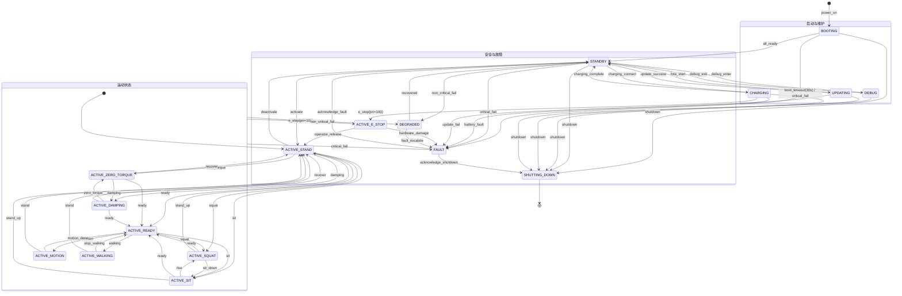
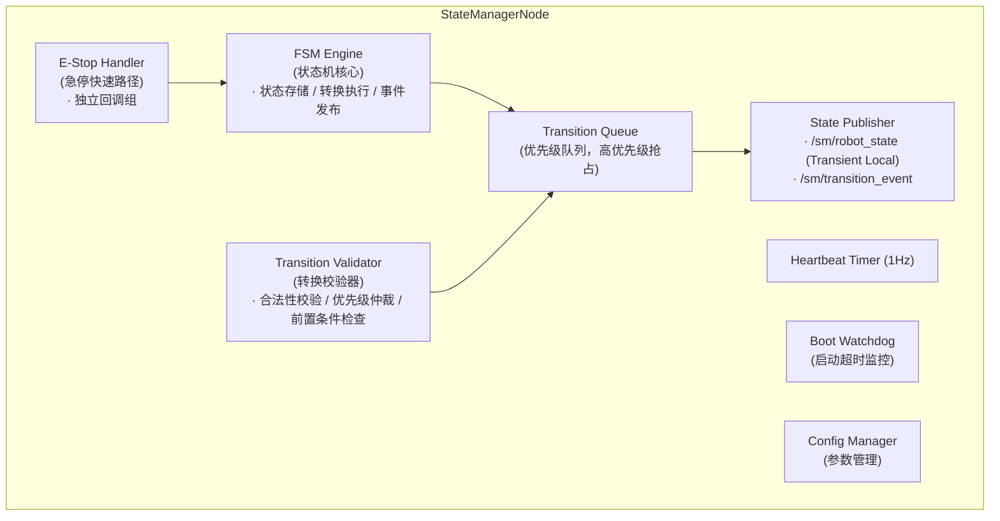
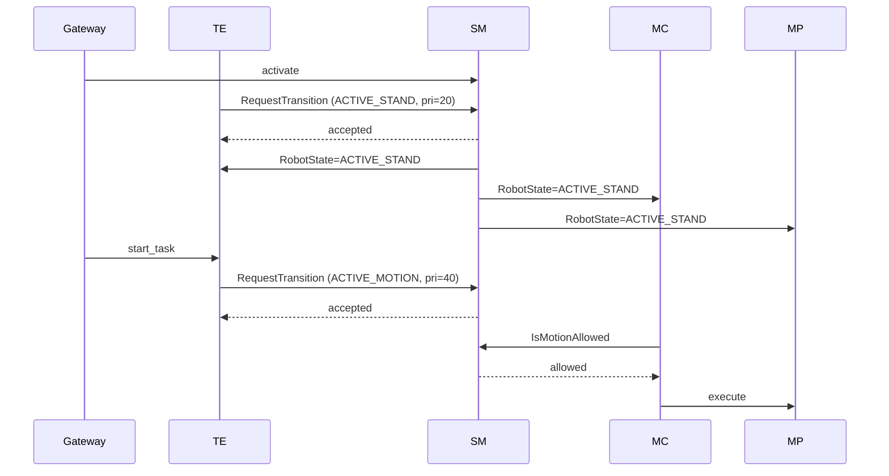

---

# State Manager 模块设计

## 1. 模块概述

**模块名称**：State Manager（SM）

**定位**：SM 是端侧软件系统中的**全局状态权威**，位于中间件层。它维护机器人唯一的生命周期有限状态机（FSM），对外广播当前状态，对内校验所有状态转换请求的合法性。任何涉及运动控制的操作都必须经过 SM 状态校验，SM 是安全链的最后一道软件闸门。

**核心职责**：
1. 维护机器人全局生命周期 FSM（唯一状态源）
2. 接收并校验状态转换请求，按优先级仲裁冲突
3. 广播状态变更事件，供所有模块订阅
4. 提供急停（E-Stop）快速路径，优先级最高（priority=100）
5. 为运动类模块提供状态查询接口，阻断非法运动指令

**与相邻模块的边界**：

| 边界 | SM 负责 | 对方负责 |
|------|---------|---------|
| SM ↔ EM | 状态转换决策，广播状态 | 进程生命周期管理，启停模块 |
| SM ↔ HDS | 接受 HDS 的降级/故障转换请求 | 故障诊断与定级，不直接改状态 |
| SM ↔ MC/MS/MP | 提供状态查询，拒绝非法状态下的运动 | 运动执行，调用前校验状态 |
| SM ↔ Gateway | 接受用户侧操作指令（解除急停等） | 云端通信，转发用户操作 |
| SM ↔ TE | 接受任务引擎的状态转换请求 | 任务调度与编排 |
| SM ↔ Voice 子系统 | 接受语音 KWS_RT 触发的急停请求 | 关键词识别与 E-Stop 信号化（独立 systemd 服务） |

**相关文档**：
- [Voice Interaction Subsystem](../../subsystem/voice_interaction_subsystem.md) — 语音交互子系统软硬件方案，定义独立 KWS_RT → SM 急停通道（参见该文 §6 与本文 §3.2 / §8.5）

---

## 2. 状态机设计

### 2.1 状态枚举

| 状态 | 值 | 说明 |
|------|-----|------|
| `BOOTING` | 0 | 系统启动中，等待关键模块就绪 |
| `STANDBY` | 1 | 待机，所有关键模块就绪，可接受任务 |
| `CHARGING` | 2 | 充电中，关节锁定，运动受限 |
| `UPDATING` | 3 | 固件升级中，系统受限，禁止运动 |
| `DEBUG` | 4 | 调试模式，研发专用，可绕过部分安全校验 |
| `ACTIVE_STAND` | 5 | 站立模式，双脚站立维持平衡（默认姿态） |
| `ACTIVE_READY` | 6 | 预备模式，关节上电预紧，准备执行动作 |
| `ACTIVE_SQUAT` | 7 | 下蹲模式，降低重心 |
| `ACTIVE_SIT` | 8 | 落座模式，坐下/蹲下，重心最低 |
| `ACTIVE_MOTION` | 9 | 运动模式，执行特定动作/任务 |
| `ACTIVE_WALKING` | 10 | 持续走路模式，连续步态移动 |
| `ACTIVE_ZERO_TORQUE` | 11 | 零力矩模式，关节零力矩输出，可被动推动 |
| `ACTIVE_DAMPING` | 12 | 阻尼模式，关节提供阻尼力，缓冲外力冲击 |
| `ACTIVE_E_STOP` | 13 | 急停激活，运动已锁定，需人工解除 |
| `DEGRADED` | 14 | 降级运行，部分模块不可用但系统可控 |
| `FAULT` | 15 | 严重故障，需人工确认才能恢复 |
| `SHUTTING_DOWN` | 16 | 正在关机 |

### 2.2 状态机图



### 2.3 状态转换表

| 当前状态 | 目标状态 | 触发条件 | 触发者 | 优先级 |
|----------|----------|----------|--------|--------|
| `BOOTING` | `STANDBY` | 所有 P0/P1 模块就绪 | EM | 60 |
| `BOOTING` | `FAULT` | 启动超时（30s）或关键模块失败 | SM 内部 / EM | 80 |
| `BOOTING` | `SHUTTING_DOWN` | 启动过程中收到关机指令 | Gateway | 60 |
| `STANDBY` | `ACTIVE_STAND` | 激活运动控制（站立姿态） | TE / Gateway | 40 |
| `STANDBY` | `CHARGING` | 检测到充电连接 | HDS | 60 |
| `STANDBY` | `UPDATING` | FOTA 升级开始 | FOTA | 60 |
| `STANDBY` | `DEBUG` | 研发人员进入调试模式 | Gateway（operator） | 20 |
| `STANDBY` | `SHUTTING_DOWN` | 关机指令 | Gateway / TE | 60 |
| `STANDBY` | `FAULT` | 关键模块故障 | HDS | 80 |
| `STANDBY` | `DEGRADED` | 非关键模块故障 | HDS | 80 |
| `CHARGING` | `STANDBY` | 充电完成 / 拔出充电桩 | HDS | 60 |
| `CHARGING` | `FAULT` | 充电中电池故障/过热 | HDS | 80 |
| `CHARGING` | `SHUTTING_DOWN` | 充电中关机 | Gateway | 60 |
| `UPDATING` | `STANDBY` | 升级成功重启完成 | FOTA | 60 |
| `UPDATING` | `FAULT` | 升级失败 | FOTA | 80 |
| `UPDATING` | `SHUTTING_DOWN` | 升级中强制关机 | Gateway | 60 |
| `DEBUG` | `STANDBY` | 退出调试模式 | Gateway（operator） | 20 |
| `DEBUG` | `SHUTTING_DOWN` | 调试中关机 | Gateway | 60 |
| `ACTIVE_STAND` | `ACTIVE_READY` | 预备（关节上电预紧） | TE / MC | 40 |
| `ACTIVE_STAND` | `ACTIVE_SQUAT` | 下蹲指令 | TE / Gateway | 40 |
| `ACTIVE_STAND` | `ACTIVE_SIT` | 坐下指令 | TE / Gateway | 40 |
| `ACTIVE_STAND` | `ACTIVE_ZERO_TORQUE` | 进入零力矩模式 | Gateway（operator） | 20 |
| `ACTIVE_STAND` | `ACTIVE_DAMPING` | 进入阻尼模式 | Gateway（operator） | 20 |
| `ACTIVE_STAND` | `STANDBY` | 去激活运动控制 | TE / Gateway | 40 |
| `ACTIVE_STAND` | `ACTIVE_E_STOP` | 急停触发 | MC, EM, HDS, Gateway, hardware_estop, voice_kws_rt | 100 |
| `ACTIVE_STAND` | `FAULT` | 关键故障 | HDS | 80 |
| `ACTIVE_STAND` | `DEGRADED` | 非关键模块故障 | HDS | 80 |
| `ACTIVE_READY` | `ACTIVE_STAND` | 回到站立 | TE / MC | 40 |
| `ACTIVE_READY` | `ACTIVE_MOTION` | 开始执行动作/任务 | TE | 40 |
| `ACTIVE_READY` | `ACTIVE_WALKING` | 开始持续走路 | TE / PnC | 40 |
| `ACTIVE_READY` | `ACTIVE_SQUAT` | 下蹲指令 | TE / Gateway | 40 |
| `ACTIVE_READY` | `ACTIVE_SIT` | 坐下指令 | TE / Gateway | 40 |
| `ACTIVE_READY` | `ACTIVE_E_STOP` | 急停触发 | MC, EM, HDS, Gateway, hardware_estop, voice_kws_rt | 100 |
| `ACTIVE_READY` | `FAULT` | 关键故障 | HDS | 80 |
| `ACTIVE_READY` | `DEGRADED` | 非关键模块故障 | HDS | 80 |
| `ACTIVE_MOTION` | `ACTIVE_READY` | 动作完成 / 取消 | TE | 40 |
| `ACTIVE_MOTION` | `ACTIVE_STAND` | 回到站立 | TE / MC | 40 |
| `ACTIVE_MOTION` | `ACTIVE_E_STOP` | 急停触发 | MC, EM, HDS, Gateway, hardware_estop, voice_kws_rt | 100 |
| `ACTIVE_MOTION` | `FAULT` | 关键故障 | HDS | 80 |
| `ACTIVE_MOTION` | `DEGRADED` | 非关键模块故障 | HDS | 80 |
| `ACTIVE_WALKING` | `ACTIVE_READY` | 停止走路 | TE / PnC | 40 |
| `ACTIVE_WALKING` | `ACTIVE_STAND` | 回到站立 | TE / PnC | 40 |
| `ACTIVE_WALKING` | `ACTIVE_E_STOP` | 急停触发 | MC, EM, HDS, Gateway, hardware_estop, voice_kws_rt | 100 |
| `ACTIVE_WALKING` | `FAULT` | 关键故障 | HDS | 80 |
| `ACTIVE_WALKING` | `DEGRADED` | 非关键模块故障 | HDS | 80 |
| `ACTIVE_SQUAT` | `ACTIVE_STAND` | 起立 | TE / Gateway | 40 |
| `ACTIVE_SQUAT` | `ACTIVE_SIT` | 继续坐下 | TE / Gateway | 40 |
| `ACTIVE_SQUAT` | `ACTIVE_READY` | 预备 | TE / MC | 40 |
| `ACTIVE_SQUAT` | `ACTIVE_E_STOP` | 急停触发 | MC, EM, HDS, Gateway, hardware_estop, voice_kws_rt | 100 |
| `ACTIVE_SQUAT` | `FAULT` | 关键故障 | HDS | 80 |
| `ACTIVE_SQUAT` | `DEGRADED` | 非关键模块故障 | HDS | 80 |
| `ACTIVE_SIT` | `ACTIVE_SQUAT` | 起身（过渡） | TE / Gateway | 40 |
| `ACTIVE_SIT` | `ACTIVE_STAND` | 直接起立 | TE / Gateway | 40 |
| `ACTIVE_SIT` | `ACTIVE_READY` | 预备 | TE / MC | 40 |
| `ACTIVE_SIT` | `ACTIVE_E_STOP` | 急停触发 | MC, EM, HDS, Gateway, hardware_estop, voice_kws_rt | 100 |
| `ACTIVE_SIT` | `FAULT` | 关键故障 | HDS | 80 |
| `ACTIVE_SIT` | `DEGRADED` | 非关键模块故障 | HDS | 80 |
| `ACTIVE_ZERO_TORQUE` | `ACTIVE_STAND` | 恢复控制 | Gateway（operator） | 20 |
| `ACTIVE_ZERO_TORQUE` | `ACTIVE_DAMPING` | 切换阻尼模式 | Gateway（operator） | 20 |
| `ACTIVE_ZERO_TORQUE` | `ACTIVE_READY` | 恢复预备 | Gateway（operator） | 20 |
| `ACTIVE_ZERO_TORQUE` | `ACTIVE_E_STOP` | 急停触发 | MC, EM, HDS, Gateway, hardware_estop, voice_kws_rt | 100 |
| `ACTIVE_ZERO_TORQUE` | `FAULT` | 关键故障 | HDS | 80 |
| `ACTIVE_DAMPING` | `ACTIVE_STAND` | 恢复控制 | Gateway（operator） | 20 |
| `ACTIVE_DAMPING` | `ACTIVE_ZERO_TORQUE` | 切换零力矩模式 | Gateway（operator） | 20 |
| `ACTIVE_DAMPING` | `ACTIVE_READY` | 恢复预备 | Gateway（operator） | 20 |
| `ACTIVE_DAMPING` | `ACTIVE_E_STOP` | 急停触发 | MC, EM, HDS, Gateway, hardware_estop, voice_kws_rt | 100 |
| `ACTIVE_DAMPING` | `FAULT` | 关键故障 | HDS | 80 |
| `ACTIVE_E_STOP` | `ACTIVE_STAND` | 人工确认解除急停 | Gateway（operator） | 20 |
| `ACTIVE_E_STOP` | `FAULT` | 急停后检测到硬件损坏 | HDS | 80 |
| `DEGRADED` | `STANDBY` | 故障模块恢复 | HDS / EM | 60 |
| `DEGRADED` | `FAULT` | 故障升级 | HDS | 80 |
| `FAULT` | `STANDBY` | 人工确认故障 + 恢复前检查通过 | Gateway（operator） | 20 |
| `FAULT` | `SHUTTING_DOWN` | 人工选择关机 | Gateway（operator） | 20 |

### 2.4 状态转换约束

1. **E-Stop 不可被软件自动解除** — `ACTIVE_E_STOP → ACTIVE_STAND` 必须由人工通过 Gateway 确认，需提供 `operator_id`
2. **FAULT 不可自动恢复** — 必须经过 `AcknowledgeFault` Service，需提供 `operator_id`
3. **BOOTING 超时必须进 FAULT** — 不允许超时后进入 `STANDBY`
4. **E-Stop 优先级最高** — priority=100，任何 ACTIVE_* 状态（除 ACTIVE_E_STOP 自身）及 CHARGING 状态下收到 E-Stop 请求立即响应；UPDATING/DEBUG 状态下 E-Stop 转为 FAULT
5. **SHUTTING_DOWN 是终态** — 任意状态（含 BOOTING）均可转换至 SHUTTING_DOWN；进入后不可回退，只能等待 EM 关闭所有进程
6. **CHARGING 禁止主动运动** — CHARGING 状态下 `IsMotionAllowed` 固定返回 `allowed=false`
7. **UPDATING 禁止所有运动** — UPDATING 状态下 `IsMotionAllowed` 固定返回 `allowed=false`
8. **DEBUG 模式运动需特殊授权** — DEBUG 状态下运动指令需附加 `debug_token`，否则拒绝

---

## 3. ROS2 接口定义

### 3.1 消息定义（msg）

```
# sm_msgs/msg/RobotState.msg
# 机器人全局状态广播消息

# 状态枚举
uint8 BOOTING            = 0
uint8 STANDBY            = 1
uint8 CHARGING           = 2
uint8 UPDATING           = 3
uint8 DEBUG              = 4
uint8 ACTIVE_STAND       = 5
uint8 ACTIVE_READY       = 6
uint8 ACTIVE_SQUAT       = 7
uint8 ACTIVE_SIT         = 8
uint8 ACTIVE_MOTION      = 9
uint8 ACTIVE_WALKING     = 10
uint8 ACTIVE_ZERO_TORQUE = 11
uint8 ACTIVE_DAMPING     = 12
uint8 ACTIVE_E_STOP      = 13
uint8 DEGRADED           = 14
uint8 FAULT              = 15
uint8 SHUTTING_DOWN      = 16

# 辅助字段（便于订阅者快速判断，不用解析 state）
bool is_active                     # 当前是否处于某种 ACTIVE_* 模式（除 ACTIVE_E_STOP）
bool is_motion_allowed             # 当前是否允许运动指令（所有 ACTIVE_* 除 E_STOP 为 true）

uint8 state                        # 当前主状态
uint8 previous_state               # 上一个状态
builtin_interfaces/Time entered_at # 进入当前状态的时间戳
uint32 transition_count            # 累计转换次数
string active_task_id              # 当前正在执行的任务 ID（ACTIVE_MOTION / ACTIVE_WALKING 时有值）
string last_transition_requester   # 最近一次转换的请求者节点名
string last_transition_reason      # 最近一次转换原因
```

```
# sm_msgs/msg/TransitionEvent.msg
# 状态转换事件（详细记录）

uint8 from_state                   # 转换前状态
uint8 to_state                     # 转换后状态
builtin_interfaces/Time stamp      # 转换发生时间
string requester_node              # 请求者节点名称
string reason                      # 转换原因描述
int32 priority                     # 请求优先级
bool accepted                      # 是否被接受
string reject_reason               # 拒绝原因（accepted=false 时有值）
```

```
# sm_msgs/msg/Heartbeat.msg
# SM 模块心跳消息

builtin_interfaces/Time stamp
string node_name                   # 节点名称（固定 "state_manager"）
uint8 state                        # 当前机器人状态
bool healthy                       # FSM 引擎是否正常
string status_message              # 状态描述
uint32 pending_requests            # 排队中的转换请求数
```

```
# sm_msgs/msg/ErrorCode.msg
# SM 模块错误码定义（原名 SmErrorCode.msg，应改为 ErrorCode.msg）

# 错误码枚举
uint16 OK                               = 0
uint16 ERR_SM_INVALID_TRANSITION        = 1001   # 状态转换不合法（FSM 不允许）
uint16 ERR_SM_PRIORITY_TOO_LOW          = 1002   # 请求优先级低于当前锁定优先级
uint16 ERR_SM_ESTOP_ACTIVE              = 1003   # 急停状态下拒绝运动相关转换
uint16 ERR_SM_FAULT_UNACKNOWLEDGED      = 1004   # FAULT 状态未经人工确认
uint16 ERR_SM_OPERATOR_ID_REQUIRED      = 1005   # 需要操作者 ID（解除急停/确认故障）
uint16 ERR_SM_PRECONDITION_FAILED       = 1006   # 前置条件不满足（恢复前检查失败）
uint16 ERR_SM_ALREADY_IN_STATE          = 1007   # 已经处于目标状态
uint16 ERR_SM_SHUTTING_DOWN             = 1008   # 系统正在关机，拒绝所有请求
uint16 ERR_SM_BOOT_TIMEOUT              = 1009   # 启动超时
uint16 ERR_SM_CONCURRENT_TRANSITION     = 1010   # 正在处理另一个转换请求
uint16 ERR_SM_CHARGING                  = 1011   # 当前处于充电状态，禁止运动
uint16 ERR_SM_UPDATING                  = 1012   # 当前处于升级状态，禁止运动
uint16 ERR_SM_DEBUG_MODE                = 1013   # 当前处于调试模式，运动需特殊授权
uint16 ERR_SM_ZERO_TORQUE_MODE          = 1014   # 当前处于零力矩模式，拒绝主动运动指令
uint16 ERR_SM_DAMPING_MODE              = 1015   # 当前处于阻尼模式，拒绝主动运动指令

uint16 error_code                       # 错误码
string message                          # 可读错误描述
```

### 3.2 服务定义（srv）

```
# sm_msgs/srv/RequestTransition.srv
# 请求状态转换

# Request
uint8 target_state                  # 目标状态（使用 RobotState 枚举）
int32 priority                      # 请求优先级（参见优先级规范）
string requester_node               # 请求者节点名称
string reason                       # 转换原因
string task_id                      # 关联的任务 ID（可选）
---
# Response
bool accepted                       # 是否被接受
uint16 error_code                   # 错误码（ErrorCode 枚举）
string message                      # 可读结果描述
uint8 current_state                 # 当前实际状态
```

```
# sm_msgs/srv/GetState.srv
# 查询当前状态

# Request（空）
---
# Response
uint8 state                         # 当前主状态
builtin_interfaces/Time entered_at  # 进入当前状态的时间戳
uint32 transition_count             # 累计转换次数
string active_task_id               # 当前任务 ID
```

```
# sm_msgs/srv/TriggerEStop.srv
# 触发急停（优先级固定 100，不可覆盖）

# Request
string requester_node               # 请求者节点名称
string reason                       # 急停原因
---
# Response
bool accepted                       # 是否被接受（仅 SHUTTING_DOWN 时拒绝）
uint16 error_code                   # 错误码
string message                      # 结果描述
```

```
# sm_msgs/srv/VoiceEStop.srv
# 语音 KWS_RT 触发急停（专用通道，仅 estop_voice_service 调用）
# 与 TriggerEStop 等价的安全效果，但携带语音审计字段
# priority 在 SM 内部硬编码为 100，调用方无需提供

# Request
uint8 keyword_id                    # 关键词 ID（"stop"=1, "halt"=2, "停止"=3, "别动"=4, "danger"=5, "危险"=6, "help"=7, "救命"=8）
float32 score                       # KWS 置信度 [0.0, 1.0]
builtin_interfaces/Time detected_at # DSP 检测到关键词的时间戳（边沿对齐）
string source                       # 固定填 "voice_kws_rt"，便于审计区分
---
# Response
bool accepted                       # 是否被接受（仅 SHUTTING_DOWN 时拒绝）
uint8 prev_state                    # 触发前状态（审计用）
builtin_interfaces/Time acted_at    # SM 完成状态切换的时间戳
uint16 error_code                   # 错误码
string message                      # 结果描述
```

```
# sm_msgs/srv/ReleaseEStop.srv
# 解除急停（必须人工操作）

# Request
string operator_id                  # 操作者 ID（必填）
string reason                       # 解除原因
---
# Response
bool accepted                       # 是否被接受
uint16 error_code                   # 错误码
string message                      # 结果描述
uint8 current_state                 # 解除后的当前状态
```

```
# sm_msgs/srv/AcknowledgeFault.srv
# 确认故障（从 FAULT 恢复）

# Request
string operator_id                  # 操作者 ID（必填）
bool shutdown_instead               # true = 关机而非恢复
---
# Response
bool accepted                       # 是否被接受
uint16 error_code                   # 错误码
string message                      # 结果描述（含恢复前检查结果）
uint8 current_state                 # 确认后的当前状态
```

```
# sm_msgs/srv/IsMotionAllowed.srv
# 运动模块调用：查询当前是否允许运动指令
# 允许：ACTIVE_STAND / ACTIVE_READY / ACTIVE_SQUAT / ACTIVE_SIT / ACTIVE_MOTION / ACTIVE_WALKING / ACTIVE_ZERO_TORQUE / ACTIVE_DAMPING
# 拒绝：其他所有状态（含 ACTIVE_E_STOP）

# Request（空）
---
# Response
bool allowed                        # 是否允许
uint8 current_state                 # 当前状态
uint16 error_code                   # 不允许时的错误码
string message                      # 不允许时的原因
```

```
# sm_msgs/srv/GetHealthStatus.srv
# SM 模块健康状态查询

---
bool success
string node_name
builtin_interfaces/Time uptime_since
uint8 state
bool healthy
string message
uint32 total_transitions            # 总转换次数
uint32 rejected_transitions         # 拒绝的转换次数
```

### 3.3 接口汇总表

#### Topics

| 名称 | 类型 | 方向 | QoS | 频率 | 说明 |
|------|------|------|-----|------|------|
| `/sm/robot_state` | `sm_msgs/msg/RobotState` | SM → ALL | Reliable + Transient Local + Depth 1 | 事件驱动（状态变更时发布） | 机器人全局状态广播 |
| `/sm/transition_event` | `sm_msgs/msg/TransitionEvent` | SM → ALL | Reliable + Volatile + Depth 50 | 事件驱动 | 状态转换事件日志 |
| `/sm/heartbeat` | `sm_msgs/msg/Heartbeat` | SM → EM/HDS | Reliable + Volatile + Depth 1 | 1 Hz | SM 心跳 |

#### Services

| 名称 | 类型 | 调用方 | 说明 |
|------|------|--------|------|
| `/sm/request_transition` | `sm_msgs/srv/RequestTransition` | EM, HDS, TE, Gateway | 请求状态转换 |
| `/sm/get_state` | `sm_msgs/srv/GetState` | 任意模块 | 查询当前状态 |
| `/sm/trigger_estop` | `sm_msgs/srv/TriggerEStop` | 任意模块 | 触发急停（priority=100） |
| `/sm/voice_estop` | `sm_msgs/srv/VoiceEStop` | estop_voice_service（语音子系统专用） | 语音 KWS_RT 急停通道（priority=100，独立审计字段） |
| `/sm/release_estop` | `sm_msgs/srv/ReleaseEStop` | Gateway（人工） | 解除急停 |
| `/sm/acknowledge_fault` | `sm_msgs/srv/AcknowledgeFault` | Gateway（人工） | 确认故障 |
| `/sm/is_motion_allowed` | `sm_msgs/srv/IsMotionAllowed` | MC, MS, MP, PnC | 运动前状态校验 |
| `/sm/get_health_status` | `sm_msgs/srv/GetHealthStatus` | EM, HDS | SM 健康查询 |

---

## 4. 内部设计

### 4.1 节点架构



### 4.2 关键设计决策

1. **E-Stop 独立回调组**：`TriggerEStop` Service 使用独立的 `MutuallyExclusive` CallbackGroup，确保即使其他 Service 正在执行，E-Stop 请求也能被立即处理
2. **优先级队列**：多个转换请求同时到达时，按 priority 降序处理；同优先级按到达时间
3. **原子性转换**：状态转换在单次回调中完成（先校验、再切换、最后发布），无中间态暴露

### 4.3 关键流程

#### 4.3.1 系统启动流程

```
EM 启动 SM 进程
  → SM 初始化，状态设为 BOOTING
  → 发布 /sm/robot_state (BOOTING)
  → 启动 Boot Watchdog 定时器（30s）
  → 等待 EM 通过 /sm/request_transition 通知 all_ready
  → Validator 检查转换合法性（BOOTING → STANDBY）
  → FSM 执行转换，发布新状态
  → 取消 Boot Watchdog
  → 若 30s 超时仍未收到 → 自动转入 FAULT
```

#### 4.3.2 E-Stop 触发流程

```
触发源：
  - 白名单 ROS2 模块（MC, EM, HDS, Gateway）→ /sm/trigger_estop
  - hardware_estop（硬件按钮 GPIO IRQ → estop_hardware_service）→ /sm/trigger_estop
  - voice_kws_rt（语音 KWS_RT → estop_voice_service，systemd RT prio 90）→ /sm/voice_estop
  → E-Stop Handler 收到请求（独立回调组，所有 E-Stop 入口共用）
  → priority 在 SM 内部硬编码为 100，请求侧无法降级
  → 检查当前状态：
      - ACTIVE_STAND / ACTIVE_READY / ACTIVE_SQUAT / ACTIVE_SIT / ACTIVE_MOTION / ACTIVE_WALKING / ACTIVE_ZERO_TORQUE / ACTIVE_DAMPING / DEGRADED → 立即转为 ACTIVE_E_STOP
      - ACTIVE_E_STOP → 已是急停，返回 accepted=true，记录新审计源
      - CHARGING → 断开充电回路，转为 ACTIVE_E_STOP
      - FAULT / SHUTTING_DOWN → 返回 accepted=false (已在更高级别保护)
      - BOOTING / STANDBY / UPDATING / DEBUG → 转为 FAULT（无运动上下文或不宜中断）
  → 发布 /sm/robot_state (ACTIVE_E_STOP)
  → 发布 /sm/transition_event（记录完整审计日志，VoiceEStop 还会记录 keyword_id/score/source="voice_kws_rt"）
  → MC/MS/MP 订阅 /sm/robot_state，收到后立即锁定运动
```

> **同时多源触发**：见 §8.5「E-Stop 来源仲裁」。多个触发源同时到达时，状态变更只发生一次（幂等），但所有源都会记录到 transition_event，便于事后定责。

#### 4.3.3 故障恢复流程

```
操作者通过 Gateway 调用 /sm/acknowledge_fault
  → Validator 校验：
      1. 当前状态必须是 FAULT
      2. operator_id 不为空
      3. shutdown_instead 决定恢复路径
  → 若 shutdown_instead=true → FAULT → SHUTTING_DOWN
  → 若 shutdown_instead=false：
      → SM 调用 EM /em/get_process_status 检查关键进程状态
      → SM 调用 HDS 检查硬件健康
      → 全部通过 → FAULT → STANDBY
      → 检查失败 → 返回 accepted=false, ERR_PRECONDITION_FAILED
```

#### 4.3.4 状态转换通用流程

```
调用者 → /sm/request_transition(target_state, priority, requester, reason)
  → Transition Validator:
      1. 当前是否为 SHUTTING_DOWN → 拒绝 (ERR_SHUTTING_DOWN)
      2. 是否正在处理另一个转换 → 比较优先级，高优先级抢占
      3. FSM 转换表是否允许 from→to → 不允许则拒绝 (ERR_INVALID_TRANSITION)
      4. 特殊约束检查（E-Stop 解除需 operator_id 等）
  → FSM Engine 执行转换
  → State Publisher 发布 /sm/robot_state + /sm/transition_event
  → 返回 accepted=true
```

---

## 5. 与其他模块的交互

### 5.1 交互矩阵

| 模块 | 方向 | 接口 | 说明 |
|------|------|------|------|
| EM | EM → SM | `/sm/request_transition` (Service) | EM 通知模块就绪（BOOTING→STANDBY）、模块崩溃触发降级/故障 |
| EM | SM → EM | `/sm/robot_state` (Topic) | EM 订阅状态，按状态调整进程组（如 STANDBY 时启动 perception/control） |
| HDS | HDS → SM | `/sm/request_transition` (Service) | HDS 请求降级（→DEGRADED）或故障（→FAULT） |
| HDS | SM → HDS | `/sm/robot_state` (Topic) | HDS 订阅状态用于健康聚合 |
| Gateway | Gateway → SM | `/sm/request_transition` (Service) | 转发用户激活/待机指令 |
| Gateway | Gateway → SM | `/sm/release_estop` (Service) | 转发人工解除急停 |
| Gateway | Gateway → SM | `/sm/acknowledge_fault` (Service) | 转发人工确认故障 |
| Gateway | SM → Gateway | `/sm/robot_state` (Topic) | Gateway 将状态同步到云端/APP |
| TE | TE → SM | `/sm/request_transition` (Service) | 任务开始（→ACTIVE_MOTION/ACTIVE_WALKING）、任务结束（→ACTIVE_READY/ACTIVE_STAND） |
| MC | MC → SM | `/sm/is_motion_allowed` (Service) | 运动指令执行前校验 |
| MC | SM → MC | `/sm/robot_state` (Topic) | MC 订阅状态，E-Stop 时锁定关节 |
| MS | MS → SM | `/sm/is_motion_allowed` (Service) | 运动流指令执行前校验 |
| MS | SM → MS | `/sm/robot_state` (Topic) | MS 订阅状态 |
| MP | MP → SM | `/sm/is_motion_allowed` (Service) | 动作播放前校验 |
| MP | SM → MP | `/sm/robot_state` (Topic) | MP 订阅状态 |
| PnC | PnC → SM | `/sm/is_motion_allowed` (Service) | 导航规划前校验 |
| PnC | SM → PnC | `/sm/robot_state` (Topic) | PnC 订阅状态 |
| DR | SM → DR | `/sm/transition_event` (Topic) | DR 记录所有状态转换事件用于回放分析 |
| FOTA | FOTA → SM | `/sm/request_transition` (Service) | OTA 升级前请求进入 STANDBY |

### 5.2 关键交互时序

#### 正常任务执行时序



---

## 6. 关键参数与配置

```yaml
# sm/config/sm_params.yaml

state_manager:
  ros__parameters:
    # 启动超时（秒），超时则进入 FAULT
    boot_timeout_sec: 30.0

    # 心跳发布频率（Hz）
    heartbeat_rate_hz: 1.0

    # 状态广播 QoS 深度
    state_qos_depth: 1

    # 转换事件 QoS 深度
    transition_event_qos_depth: 50

    # E-Stop 优先级（固定值，不可修改）
    estop_priority: 100

    # 转换请求超时（秒），超时自动丢弃排队请求
    transition_request_timeout_sec: 5.0

    # 最大排队转换请求数
    max_pending_requests: 10

    # 恢复前检查超时（秒）
    recovery_check_timeout_sec: 10.0

    # 转换事件日志保留条数（内存中）
    transition_history_size: 1000

    # 是否启用详细转换日志
    verbose_transition_log: true
```

---

## 7. 错误码定义

| 错误码 | 常量名 | 说明 |
|--------|--------|------|
| 0 | `OK` | 成功 |
| 1001 | `ERR_SM_INVALID_TRANSITION` | FSM 转换表中不存在该转换路径 |
| 1002 | `ERR_SM_PRIORITY_TOO_LOW` | 请求优先级低于正在执行的转换 |
| 1003 | `ERR_SM_ESTOP_ACTIVE` | 当前处于急停状态，拒绝运动相关操作 |
| 1004 | `ERR_SM_FAULT_UNACKNOWLEDGED` | 当前处于 FAULT 状态，需人工确认 |
| 1005 | `ERR_SM_OPERATOR_ID_REQUIRED` | 解除急停/确认故障需提供 operator_id |
| 1006 | `ERR_SM_PRECONDITION_FAILED` | 恢复前置条件不满足（硬件/进程异常） |
| 1007 | `ERR_SM_ALREADY_IN_STATE` | 已处于目标状态，无需转换 |
| 1008 | `ERR_SM_SHUTTING_DOWN` | 系统正在关机，拒绝所有请求 |
| 1009 | `ERR_SM_BOOT_TIMEOUT` | 启动超时，已自动进入 FAULT |
| 1010 | `ERR_SM_CONCURRENT_TRANSITION` | 正在处理另一个转换，且优先级不足以抢占 |
| 1011 | `ERR_SM_CHARGING` | 当前处于充电状态，禁止运动 |
| 1012 | `ERR_SM_UPDATING` | 当前处于升级状态，禁止运动 |
| 1013 | `ERR_SM_DEBUG_MODE` | 当前处于调试模式，运动需特殊授权 |
| 1014 | `ERR_SM_ZERO_TORQUE_MODE` | 当前处于零力矩模式，拒绝主动运动指令 |
| 1015 | `ERR_SM_DAMPING_MODE` | 当前处于阻尼模式，拒绝主动运动指令 |

---

## 8. 安全约束

### 8.1 E-Stop 快速路径

- `/sm/trigger_estop` 使用独立 CallbackGroup，不与其他 Service 共享线程
- E-Stop 请求处理延迟目标 < 5ms（纯状态切换，无外部调用）
- E-Stop priority 固定为 100，硬编码，不可通过参数修改
- E-Stop 可从所有 `ACTIVE_*` 状态（除 `ACTIVE_E_STOP`）、`CHARGING`、`DEGRADED` 触发

### 8.2 FAULT 状态行为

- 进入 FAULT 后，`/sm/is_motion_allowed` 固定返回 `allowed=false`
- FAULT 状态只能通过 `AcknowledgeFault` Service 退出
- 退出 FAULT 前必须执行恢复前检查（查询 EM 进程状态 + HDS 硬件状态）
- FAULT 期间，SM 继续发布心跳和状态广播，不自行退出

### 8.3 ACTIVE_E_STOP 状态行为

- 所有运动指令被拒绝（`IsMotionAllowed` 返回 false + `ERR_ESTOP_ACTIVE`）
- 不允许软件自动解除：超时不解除、任务完成不解除
- 解除必须通过 `/sm/release_estop`，且 `operator_id` 不为空
- 解除后进入 `ACTIVE_STAND`（非 `ACTIVE_READY`），需要重新预备才能执行动作或走路

### 8.4 审计日志

- 所有转换请求（无论接受/拒绝）都记录到 `/sm/transition_event`
- 记录字段：时间戳、请求者节点、原因、优先级、接受/拒绝、拒绝原因
- 通过 `/sm/voice_estop` 触发的急停额外记录 `keyword_id` / `score` / `source="voice_kws_rt"` 到 `reason` 字段（JSON 形式）
- DR 模块订阅该 Topic 持久化存储

### 8.5 E-Stop 来源仲裁

E-Stop 的"是否触发"由 priority=100 决定，所有合法源等价；但当多个源在极短窗口（≤ 100ms）内同时到达时，需要确定**谁是"官方触发源"**用于：
1. `transition_event.requester_node` 的归属（事后定责）
2. 解除急停时的恢复策略选择（如硬件 E-Stop 必须人工到现场目视检查）
3. HDS 故障定级时的根因分析

#### 仲裁优先级表

| 排序 | 来源 | requester_node | 触发通道 | 解除策略 |
|------|------|---------------|----------|----------|
| 1（最高）| 硬件急停按钮 | `hardware_estop` | GPIO IRQ → estop_hardware_service → `/sm/trigger_estop` | 必须人工到现场，目视检查后通过 Gateway 解除 |
| 2 | 触觉急停（皮肤碰撞/夹手） | `touch_estop` | HAL_Sensor → `/sm/trigger_estop` | 必须人工确认无受困物，Gateway 解除 |
| 3 | 语音急停（KWS_RT）| `voice_kws_rt` | DSP → estop_voice_service → `/sm/voice_estop` | 可由现场操作人员经 Gateway 解除（≤ 5min 等待期） |
| 4 | Gateway/APP 主动急停 | `gateway_estop` | APP/云端 → Gateway → `/sm/trigger_estop` | 远程操作员可经 Gateway 解除 |
| 5 | 软件内部触发（HDS/MC/EM）| `hds_estop` / `mc_estop` / `em_estop` | 模块内部检测 → `/sm/trigger_estop` | 视故障类型，可能要求 HDS 复检通过 |

#### 仲裁规则

1. **第一到达优先**：第一个到达 SM E-Stop Handler 的请求执行状态切换，`requester_node` 记录该源
2. **后续到达旁记**：状态已是 `ACTIVE_E_STOP` 时，后续 E-Stop 请求返回 `accepted=true` 但仅追加到 `/sm/transition_event` 的"补充触发源"字段（不再切换状态）
3. **100ms 仲裁窗口**：状态切换完成后 100ms 内到达的所有 E-Stop 源都视为"同源触发组"，写入同一审计记录
4. **解除时按最高源决定策略**：解除急停时检查同源触发组中排序最高的源，按其策略要求 operator_id 与现场检查级别（见 `/sm/release_estop` 的扩展字段）
5. **Voice E-Stop 不可单独解除硬件 E-Stop**：若同源触发组包含 `hardware_estop` / `touch_estop`，必须严格按硬件级解除流程（不允许仅凭 voice 判定为"误触发"自动解除）

#### 不允许的仲裁逻辑

- **禁止丢弃语音 E-Stop**：即使 KWS 置信度 < 阈值，到达 SM 的请求也必须执行（语音子系统应在 KWS_RT 内做置信度过滤，不依赖 SM 二次过滤）
- **禁止超时自动解除**：任何来源的 E-Stop 都不允许"X 秒后自动解除"
- **禁止 voice_kws_rt 直连 release**：`/sm/release_estop` 仍然只允许 Gateway（人工）调用，语音不在解除路径上

---

## 9. 包结构

```
sm_msgs/
    msg/
        RobotState.msg              # 机器人全局状态
        TransitionEvent.msg         # 状态转换事件
        Heartbeat.msg               # SM 心跳
        ErrorCode.msg               # 错误码定义（原名 SmErrorCode.msg）
    srv/
        RequestTransition.srv       # 请求状态转换
        GetState.srv                # 查询当前状态
        TriggerEStop.srv            # 触发急停
        VoiceEStop.srv              # 语音 KWS_RT 急停专用通道（含审计字段）
        ReleaseEStop.srv            # 解除急停
        AcknowledgeFault.srv        # 确认故障
        IsMotionAllowed.srv         # 运动前校验
        GetHealthStatus.srv         # 健康状态查询
    CMakeLists.txt
    package.xml

sm/
    include/sm/
        state_manager_node.hpp      # 主节点类
        fsm_engine.hpp              # FSM 引擎（状态存储 + 转换执行）
        transition_validator.hpp    # 转换校验器（合法性 + 优先级 + 前置条件）
        estop_handler.hpp           # 急停快速路径处理
        boot_watchdog.hpp           # 启动超时监控
    src/
        state_manager_node.cpp
        fsm_engine.cpp
        transition_validator.cpp
        estop_handler.cpp
        boot_watchdog.cpp
    test/
        test_fsm_engine.cpp         # FSM 转换表单元测试
        test_transition_validator.cpp # 校验器单元测试
        test_estop_handler.cpp      # E-Stop 路径测试
        test_integration.cpp        # 集成测试（多模块交互）
    config/
        sm_params.yaml              # 参数配置
    launch/
        sm.launch.py                # Launch 文件
    CMakeLists.txt
    package.xml
```

---

## 10. 关键性能指标（KPI）

| 指标 | 目标值 |
|------|--------|
| E-Stop 请求处理延迟 | < 5ms |
| 普通状态转换处理延迟 | < 10ms |
| `/sm/is_motion_allowed` 响应延迟 | < 1ms |
| `/sm/robot_state` 发布延迟（转换完成到发布） | < 1ms |
| SM 心跳抖动 | < 50ms |
| SM 自身 CPU 占用 | < 0.5% |
| SM 自身内存占用 | < 30MB |
| 系统启动到 STANDBY 状态 | < 30s（由 boot_timeout_sec 约束） |

---

## 11. 设计审查记录

### 11.1 综合审查报告（2026-05-07）

**模块**：SM（State Manager）
**审查范围**：本次纳入 VoiceEStop.srv 与 E-Stop 来源仲裁机制的增量设计
**审查方式**：safety-validator + architecture-advisor 并行审查
**总体判决**：**APPROVED_WITH_CONDITIONS**

> 两位评审独立判定为 *有条件通过*：当前设计在功能层面闭环，但在**安全攻击面**与**跨模块治理边界**上存在 8 项高优先级未决项，需在合入实现前补齐。

---

### 11.2 安全审查结果（safety-validator）

**红线核查**（全部通过）：
- ✅ `ACTIVE_E_STOP` / `FAULT` 状态拒绝运动指令（§4.4 `is_motion_allowed`）
- ✅ E-Stop 解除必须人工（`ReleaseEStop.srv` 强制 `operator_id`，§3.2 / §4.3.3）
- ✅ E-Stop 优先级硬编码 100，调用方不可覆盖（§3.2 / §4.3.2 / §8.5）
- ✅ `BOOTING` 超时进入 `FAULT`（§2.3 转换矩阵 + §7 错误码 `ERR_SM_BOOT_TIMEOUT`）
- ✅ 只有 SM 修改全局状态（§1.1 设计原则 1）

**HIGH 项（必须修复）**：

| # | 风险点 | 描述 | 建议修复 |
|---|--------|------|---------|
| **S-H1** | `keyword_id` 白名单未在 SM 端二次校验 | VoiceEStop.srv 的 `keyword_id` 由 `estop_voice_service` 解析后传入，SM 当前仅审计、不重新校验。若 KWS 服务被劫持/误升级，SM 会无条件接受任何 `keyword_id` 并触发急停 | 在 `estop_handler.cpp` 中新增 `is_valid_voice_keyword(uint8 id)` 二次校验函数，仅放行 §3.2 列出的 1–8 ID；非法 ID 拒绝并记 `ERR_SM_INVALID_KEYWORD` |
| **S-H2** | ROS2 service 调用方身份在默认 DDS 下不可强制 | §3.3 注明 `/sm/voice_estop` 仅 `estop_voice_service` 调用、`/sm/trigger_estop` 排除 voice 节点，但默认 DDS 无 ACL，任何节点均可调用 | （a）启用 DDS Security（governance.xml + permissions.xml 限定 service ACL）；或（b）通过 systemd socket 单元 + Unix domain socket 隔离 estop_voice_service 通道；二选一并在 §8.5 文档化 |
| **S-H3** | 100ms 仲裁窗口对"解除策略"覆盖不全 | §8.5 仲裁规则只规定**触发**期间的去重，未规定**解除阶段**多源 `ReleaseEStop` 并发的处理。若 hardware 急停未解除而 voice 通道收到误解除指令，可能产生半解除态 | 明确 §8.5 增补："Release 不接受多源仲裁，必须所有触发源都被显式确认（hardware estop 引脚 + 软触发审计列表均清空）才允许 `ACTIVE_E_STOP → ACTIVE_IDLE`" |
| **S-H4** | "voice E-Stop 不允许丢弃" + "SM 无二次过滤" 组合 → DoS 面 | §8.5 规则 4 规定 voice 急停"不允许丢弃"，且无频率/速率限制；如果 KWS 因模型漂移误识别频繁触发，SM 将不断 `ACTIVE_IDLE ↔ ACTIVE_E_STOP` 抖动 | 在 `estop_handler` 中加入"重复触发抑制"：同一 `source` 在 `ACTIVE_E_STOP` 已激活时直接返回 `accepted=true, prev_state=ACTIVE_E_STOP` 而不重入转换；并把 KWS 误触率作为 §10 KPI 的监控项 |

**MEDIUM 项**：
- M-1：§8.4 audit log 未规定保留期与轮转策略，可能在长时间运行后写满磁盘
- M-2：§4.3.2 多源同时到达时"first-arrival wins"未明确 SM 内部如何打时间戳（接收时间还是 header 时间），影响审计因果链可信度
- M-3：`VoiceEStop.srv` 的 `score` 字段未规定低分阈值；KWS 输出 0.0–0.3 之间的"勉强识别"是否应该触发？建议在 `estop_voice_service` 侧加置信度门槛，SM 端不重复判断

**LOW 项**：
- L-1：§7 错误码缺 `ERR_SM_INVALID_KEYWORD`（配合 S-H1 修复）
- L-2：`VoiceEStop.srv` 字段命名 `detected_at` 与 ROS2 通行 `stamp` 风格不一致（不阻塞，未来统一）

---

### 11.3 架构审查结果（architecture-advisor）

**架构原则核查**（部分通过）：
- ✅ 单一状态源（SM 是唯一状态写入者）
- ✅ 云端入口唯一（VoiceEStop 不涉及云端）
- ⚠️ **进程治理中枢唯一性受冲击**：`estop_voice_service` / `estop_hardware_service` 由 systemd 直接拉起，绕过 EM —— 当前未在 EM / SM 设计中正式声明这一例外
- ✅ 接口风格一致（VoiceEStop 字段命名遵守 snake_case，错误码沿用 ErrorCode.msg）

**HIGH 项（必须修复）**：

| # | 问题 | 描述 | 建议修复 |
|---|------|------|---------|
| **A-H1** | EM 进程治理 vs Tier-0 安全旁路冲突未文档化 | `estop_voice_service` 与（未来的）`estop_hardware_service` 走 systemd RT 服务，独立于 EM 编排，但 CLAUDE.md "禁止非 EM 启停其他进程" 与之矛盾。当前未在 em_design_v2.md / sm_design.md 显式声明 Tier-0 例外 | （a）在 em_design_v2.md 新增 §"Tier-0 安全旁路服务"小节，列举允许 systemd 直管的服务清单（estop_voice / estop_hardware）；（b）在 CLAUDE.md "已知错误"段补"非 EM 启停进程"的 Tier-0 例外条件 |
| **A-H2** | 缺 `estop_hardware_design.md` | §8.5 与 §4.3.2 多次引用 hardware E-Stop 通道（GPIO IRQ + UART），但此组件无独立设计文档；硬件 E-Stop 电路、断电保持、自检机制无技术归口 | 新增 `design/layer_07_hal_infra/estop_hardware_design.md`，覆盖：硬件链路、IRQ 路径、上电自检、与 SM `/sm/trigger_estop`（source=`hardware_estop`）的契约、失效安全（fail-safe）行为 |
| **A-H3** | `keyword_id` 枚举的版本管理策略缺失 | VoiceEStop.srv 的 `keyword_id` 1–8 是与 KWS 模型耦合的硬编码合约。模型升级（新增"急救"等关键词）时，msg/srv 与 KWS 模型必须同步，但当前无版本号或兼容矩阵 | 在 `voice_interaction_subsystem.md` 与 sm_design.md §3.2 同步加入 `keyword_id_version` 字段（uint8，初值 1）；KWS 模型每次新增关键词时该版本号递增；SM 端只接受当前 SDK 已知版本 |
| **A-H4** | `estop_voice_service` 自身可观测性缺位 | 该服务一旦异常（崩溃 / 高 CPU / 关键词识别延迟）将直接削弱整条语音急停链；当前无心跳、无 HDS 上报路径 | 要求 estop_voice_service 同样按 `Heartbeat.msg` 上报（即便它不归 EM 管，但 HDS 必须能看到它）；HDS 设计补充对 systemd 服务的健康观测路径 |

**MEDIUM 项**：
- M-A1：sm_design.md §1 模块边界表已有"SM ↔ Voice 子系统"行，但 voice 子系统反向引用未在 voice_interaction_subsystem.md 落实
- M-A2：fota_design.md 升级流程未声明 systemd Tier-0 服务在 FOTA 期间的处置策略（是否随系统升级？升级期间 voice 急停链路是否仍然有效？）
- M-A3：§8.5 仲裁优先级表中 "Gateway/APP" 与 "internal（HDS/EM）" 优先级孰高未给出仲裁依据，仅"先到先得"无法解释多源同时到达时的确定性

**LOW 项**：
- L-A1：§9 包结构里 `estop_handler.hpp` 未拆分 voice / hardware 分支处理，建议在实现期再评估是否拆为两文件
- L-A2：综合建议文档化"E-Stop 路径"作为本仓库的 *关键路径* 标签，便于代码审查时识别

---

### 11.4 跨模块联动清单

本次审查发现下列文档需配套更新（按优先级）：

| 优先级 | 文档 | 待办 |
|--------|------|------|
| P0 | `design/layer_07_hal_infra/estop_hardware_design.md`（**新建**） | 硬件急停链路、自检、与 SM 契约（A-H2） |
| P0 | `design/layer_06_middleware/em_design_v2.md` | 增补 Tier-0 安全旁路服务清单与例外说明（A-H1） |
| P0 | `CLAUDE.md` | "已知错误"段补 Tier-0 例外条件（A-H1） |
| P1 | `subsystem/voice_interaction_subsystem.md` | 反向引用 sm_design §3.2；同步 `keyword_id_version` 字段（A-H3 / M-A1） |
| P1 | `design/layer_06_middleware/hds_design.md` | 增补 systemd 服务健康观测路径（A-H4） |
| P2 | `design/layer_03_application/fota_design.md` | FOTA 期间 Tier-0 服务处置策略（M-A2） |

---

### 11.5 综合修复建议（按优先级排序）

**HIGH（合入实现前必须完成，8 项）**：
1. [S-H1] `estop_handler` 增加 `keyword_id` 二次白名单校验（→ §3.2 / §7 / 实现）
2. [S-H2] 选定 ACL 强制机制（DDS Security 或 systemd socket）并在 §8.5 文档化
3. [S-H3] §8.5 增补 Release 阶段多源处理规则
4. [S-H4] 实现重复触发抑制 + KWS 误触率纳入 KPI（→ §4.3.2 / §10）
5. [A-H1] em_design_v2.md + CLAUDE.md 补 Tier-0 例外
6. [A-H2] 新建 estop_hardware_design.md
7. [A-H3] 引入 `keyword_id_version` 字段并跨文档同步
8. [A-H4] estop_voice_service 心跳与 HDS 观测路径

**MEDIUM（建议在下一次设计 review 前闭环，6 项）**：
- M-1：audit log 保留期与轮转策略
- M-2：审计时间戳来源规则
- M-3：KWS score 阈值职责划分
- M-A1：voice 子系统反向引用
- M-A2：FOTA 与 Tier-0 服务交互
- M-A3：仲裁优先级补充确定性规则

**LOW（不阻塞，可在实现期或下次重构合并）**：
- L-1：补 `ERR_SM_INVALID_KEYWORD`
- L-2：`detected_at` 字段命名一致性
- L-A1：`estop_handler` 文件拆分
- L-A2：标记 *关键路径* 标签

---

### 11.6 审查结论

设计层面闭环，但**安全攻击面（S-H1/H2/H4）**与**进程治理边界（A-H1/H2）**两类高优先级问题构成合入门槛。建议：

> 在 8 项 HIGH 修复完成、且新增 `estop_hardware_design.md` 落盘后，再进入实现阶段。MEDIUM 项可与实现并行推进。

