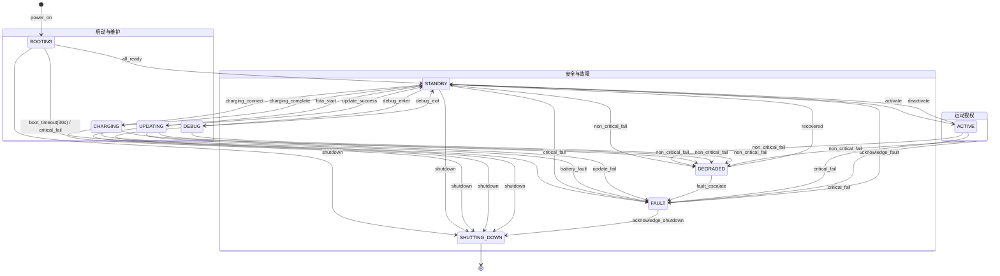
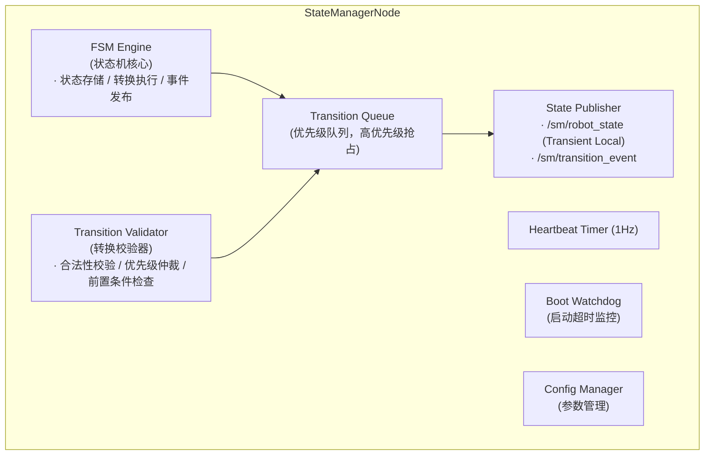
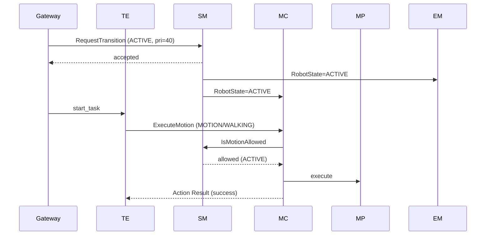
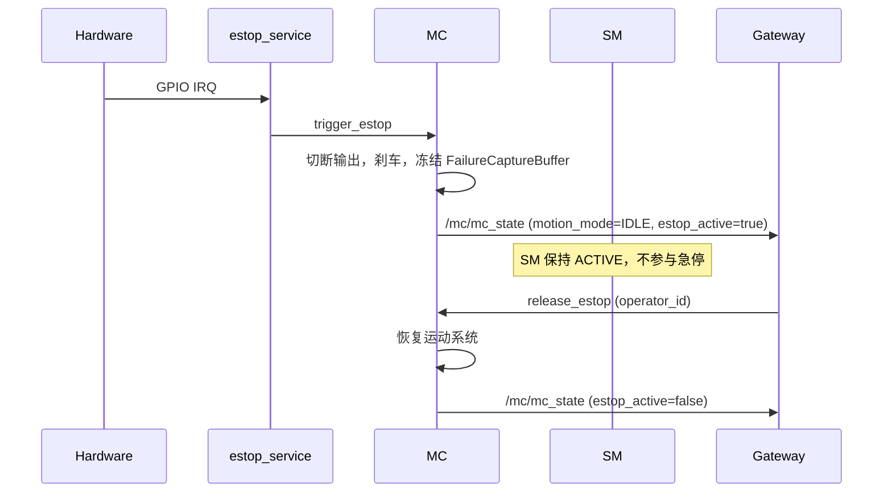

# State Manager 模块设计

## 1. 模块概述与定位

**模块名称**：State Manager（SM）

**定位**：SM 是端侧软件系统中的**系统生命周期权威**，位于中间件层。它维护机器人唯一的系统级生命周期有限状态机（FSM），不涉入运动控制语义，只回答"系统当前处于什么生命周期阶段"和"运动系统是否被授权上线"。SM 是运动授权的**第一层闸门**，急停等运动安全事件由 MC 独立处理。

**核心职责**：
1. 维护系统级生命周期 FSM（唯一状态源）
2. 接收并校验状态转换请求，按优先级仲裁冲突
3. 广播状态变更事件，供依赖系统生命周期的模块订阅
4. 提供运动授权查询：`IsMotionAllowed` 只在 `ACTIVE` 状态下返回 true
5. **不**管理急停状态、运动模式、运动姿态——这些属于 MC 域

**与相邻模块的边界**：

| 边界 | SM 负责 | 对方负责 |
|------|---------|---------|
| SM ↔ EM | 状态转换决策，广播状态；授权 EM 启动/停止运动相关进程 | 进程生命周期管理，启停模块；通知 SM 模块就绪/崩溃 |
| SM ↔ HDS | 接受 HDS 的降级/故障转换请求 | 故障诊断与定级 |
| SM ↔ MC | 授权运动系统上线（`STANDBY → ACTIVE`）| 运动控制执行；急停处理；运动模式管理 |
| SM ↔ Gateway | 接受用户侧系统级指令（激活/待机/调试/故障确认）| 云端通信，转发用户操作 |
| SM ↔ TE | 接受任务引擎的系统级状态转换请求（激活/待机）| 任务调度与编排（任务内的运动模式切换直接调用 MC）|
| SM ↔ FOTA | 接受升级请求（`STANDBY → UPDATING`）| 固件升级执行 |

**相关文档**：
- [MC 设计](../layer_05_motion/mc_design.md) — 运动模式状态机、急停路径、插件管理
- [EM 设计](../layer_06_middleware/em_design_v2.md) — 进程生命周期治理、模块启停编排

---

## 2. 状态机设计

### 2.1 状态枚举

| 状态 | 值 | 说明 |
|------|-----|------|
| `BOOTING` | 0 | 系统启动中，等待关键模块就绪 |
| `STANDBY` | 1 | 待机，所有关键模块就绪，可接受激活请求 |
| `ACTIVE` | 2 | 运动系统已授权上线，MC 可接收运动指令 |
| `CHARGING` | 3 | 充电中，关节锁定，禁止运动 |
| `UPDATING` | 4 | 固件升级中，系统受限，禁止运动 |
| `DEBUG` | 5 | 调试模式，研发专用，可绕过部分安全校验 |
| `DEGRADED` | 6 | 降级运行，部分非关键模块不可用但系统可控 |
| `FAULT` | 7 | 严重故障，需人工确认才能恢复 |
| `SHUTTING_DOWN` | 8 | 正在关机，拒绝所有请求 |

> **设计原则**：SM 状态机的职责边界是**系统生命周期**，不包含任何运动语义（站立/走路/下蹲/零力矩/阻尼等）。运动模式由 MC 独立管理，模块需要运动上下文时直接订阅 MC 发布的 Topic（`/mc/mc_state`）。

### 2.2 状态机图



### 2.3 状态转换表

| 当前状态 | 目标状态 | 触发条件 | 触发者 | 优先级 |
|----------|----------|----------|--------|--------|
| `BOOTING` | `STANDBY` | 所有 P0/P1 模块就绪 | EM | 60 |
| `BOOTING` | `FAULT` | 启动超时（30s）或关键模块失败 | SM 内部 / EM | 80 |
| `BOOTING` | `SHUTTING_DOWN` | 启动过程中收到关机指令 | Gateway | 60 |
| `STANDBY` | `ACTIVE` | 激活运动控制 | TE / Gateway | 40 |
| `STANDBY` | `CHARGING` | 检测到充电连接 | HDS | 60 |
| `STANDBY` | `UPDATING` | FOTA 升级开始 | FOTA | 60 |
| `STANDBY` | `DEBUG` | 研发人员进入调试模式 | Gateway（operator） | 20 |
| `STANDBY` | `SHUTTING_DOWN` | 关机指令 | Gateway / TE | 60 |
| `STANDBY` | `FAULT` | 关键模块故障 | HDS | 80 |
| `STANDBY` | `DEGRADED` | 非关键模块故障 | HDS | 80 |
| `ACTIVE` | `STANDBY` | 去激活运动控制 | TE / Gateway | 40 |
| `ACTIVE` | `FAULT` | 关键模块故障 | HDS | 80 |
| `ACTIVE` | `DEGRADED` | 非关键模块故障 | HDS | 80 |
| `ACTIVE` | `SHUTTING_DOWN` | 关机指令 | Gateway / TE | 60 |
| `CHARGING` | `STANDBY` | 充电完成 / 拔出充电桩 | HDS | 60 |
| `CHARGING` | `FAULT` | 充电中电池故障/过热 | HDS | 80 |
| `CHARGING` | `SHUTTING_DOWN` | 充电中关机 | Gateway | 60 |
| `UPDATING` | `STANDBY` | 升级成功重启完成 | FOTA | 60 |
| `UPDATING` | `FAULT` | 升级失败 | FOTA | 80 |
| `UPDATING` | `SHUTTING_DOWN` | 升级中强制关机 | Gateway | 60 |
| `DEBUG` | `STANDBY` | 退出调试模式 | Gateway（operator） | 20 |
| `DEBUG` | `SHUTTING_DOWN` | 调试中关机 | Gateway | 60 |
| `DEGRADED` | `STANDBY` | 故障模块恢复 | HDS / EM | 60 |
| `DEGRADED` | `FAULT` | 故障升级 | HDS | 80 |
| `FAULT` | `STANDBY` | 人工确认故障 + 恢复前检查通过 | Gateway（operator） | 20 |
| `FAULT` | `SHUTTING_DOWN` | 人工选择关机 | Gateway（operator） | 20 |

### 2.4 状态转换约束

1. **BOOTING 超时必须进 FAULT** — 不允许超时后进入 `STANDBY`
2. **FAULT 不可自动恢复** — 必须经过 `AcknowledgeFault` Service，需提供 `operator_id`
3. **SHUTTING_DOWN 是终态** — 任意状态均可转换至 `SHUTTING_DOWN`；进入后不可回退，只能等待 EM 关闭所有进程
4. **CHARGING 禁止运动** — `CHARGING` 状态下 `IsMotionAllowed` 固定返回 `allowed=false`
5. **UPDATING 禁止运动** — `UPDATING` 状态下 `IsMotionAllowed` 固定返回 `allowed=false`
6. **DEBUG 模式运动需特殊授权** — `DEBUG` 状态下运动指令需附加 `debug_token`，否则拒绝（由 MC 校验 debug_token）
7. **ACTIVE 状态下允许运动** — `IsMotionAllowed` 返回 `allowed=true`，MC 内部再做更细粒度的校验（急停、插件健康、形态限制等）

---

## 3. ROS2 接口定义

### 3.1 消息定义（msg）

```
# sm_msgs/msg/RobotState.msg
# 系统生命周期状态广播消息

# 状态枚举
uint8 BOOTING            = 0
uint8 STANDBY            = 1
uint8 ACTIVE             = 2
uint8 CHARGING           = 3
uint8 UPDATING           = 4
uint8 DEBUG              = 5
uint8 DEGRADED           = 6
uint8 FAULT              = 7
uint8 SHUTTING_DOWN      = 8

# 辅助字段
bool is_active                     # state == ACTIVE
bool is_motion_allowed             # state == ACTIVE

uint8 state                        # 当前系统生命周期状态
uint8 previous_state               # 上一个状态
builtin_interfaces/Time entered_at # 进入当前状态的时间戳
uint32 transition_count            # 累计转换次数
string last_transition_requester   # 最近一次转换的请求者节点名
string last_transition_reason      # 最近一次转换原因
```

> **设计说明**：`RobotState.msg` 不再包含任何运动语义（走路/站立/下蹲等）。需要运动上下文的模块直接订阅 MC 的 `/mc/mc_state`。

```
# sm_msgs/msg/TransitionEvent.msg
# 状态转换事件（详细记录）

uint8 from_state                   # 转换前状态
uint8 to_state                     # 转换后状态
builtin_interfaces/Time stamp      # 转换发生时间
string requester_node              # 请求者节点名称
string reason                      # 转换原因描述
int32 priority                     # 请求优先级
bool accepted                      # 是否被接受
string reject_reason               # 拒绝原因（accepted=false 时有值）
```

```
# sm_msgs/msg/Heartbeat.msg
# SM 模块心跳消息

builtin_interfaces/Time stamp
string node_name                   # 节点名称（固定 "state_manager"）
uint8 state                        # 当前系统状态
bool healthy                       # FSM 引擎是否正常
string status_message              # 状态描述
uint32 pending_requests            # 排队中的转换请求数
```

```
# sm_msgs/msg/ErrorCode.msg
# SM 模块错误码定义

# 错误码枚举
uint16 OK                               = 0
uint16 ERR_SM_INVALID_TRANSITION        = 1001   # 状态转换不合法（FSM 不允许）
uint16 ERR_SM_PRIORITY_TOO_LOW          = 1002   # 请求优先级低于当前锁定优先级
uint16 ERR_SM_FAULT_UNACKNOWLEDGED      = 1003   # FAULT 状态未经人工确认
uint16 ERR_SM_OPERATOR_ID_REQUIRED      = 1004   # 需要操作者 ID（确认故障）
uint16 ERR_SM_PRECONDITION_FAILED       = 1005   # 前置条件不满足（恢复前检查失败）
uint16 ERR_SM_ALREADY_IN_STATE          = 1006   # 已经处于目标状态
uint16 ERR_SM_SHUTTING_DOWN             = 1007   # 系统正在关机，拒绝所有请求
uint16 ERR_SM_BOOT_TIMEOUT              = 1008   # 启动超时
uint16 ERR_SM_CONCURRENT_TRANSITION     = 1009   # 正在处理另一个转换请求
uint16 ERR_SM_CHARGING                  = 1010   # 当前处于充电状态，禁止运动
uint16 ERR_SM_UPDATING                  = 1011   # 当前处于升级状态，禁止运动
uint16 ERR_SM_DEBUG_MODE                = 1012   # 当前处于调试模式，运动需特殊授权

uint16 error_code                       # 错误码
string message                          # 可读错误描述
```

### 3.2 服务定义（srv）

```
# sm_msgs/srv/RequestTransition.srv
# 请求状态转换

# Request
uint8 target_state                  # 目标状态（使用 RobotState 枚举）
int32 priority                      # 请求优先级（参见优先级规范）
string requester_node               # 请求者节点名称
string reason                       # 转换原因
string task_id                      # 关联的任务 ID（可选）
---
# Response
bool accepted                       # 是否被接受
uint16 error_code                   # 错误码（ErrorCode 枚举）
string message                      # 可读结果描述
uint8 current_state                 # 当前实际状态
```

```
# sm_msgs/srv/GetState.srv
# 查询当前状态

# Request（空）
---
# Response
uint8 state                         # 当前系统状态
builtin_interfaces/Time entered_at  # 进入当前状态的时间戳
uint32 transition_count             # 累计转换次数
string last_transition_requester    # 最近一次转换请求者
```

```
# sm_msgs/srv/AcknowledgeFault.srv
# 确认故障（从 FAULT 恢复）

# Request
string operator_id                  # 操作者 ID（必填）
bool shutdown_instead               # true = 关机而非恢复
---
# Response
bool accepted                       # 是否被接受
uint16 error_code                   # 错误码
string message                      # 结果描述（含恢复前检查结果）
uint8 current_state                 # 确认后的当前状态
```

```
# sm_msgs/srv/IsMotionAllowed.srv
# 运动模块调用：查询当前是否允许运动指令
# 允许：ACTIVE
# 拒绝：其他所有状态

# Request（空）
---
# Response
bool allowed                        # 是否允许
uint8 current_state                 # 当前状态
uint16 error_code                   # 不允许时的错误码
string message                      # 不允许时的原因
```

```
# sm_msgs/srv/GetHealthStatus.srv
# SM 模块健康状态查询

---
bool success
string node_name
builtin_interfaces/Time uptime_since
uint8 state
bool healthy
string message
uint32 total_transitions            # 总转换次数
uint32 rejected_transitions         # 拒绝的转换次数
```

### 3.3 接口汇总表

#### Topics

| 名称 | 类型 | 方向 | QoS | 频率 | 说明 |
|------|------|------|-----|------|------|
| `/sm/robot_state` | `sm_msgs/msg/RobotState` | SM → ALL | Reliable + Transient Local + Depth 1 | 事件驱动（状态变更时发布） | 系统生命周期状态广播 |
| `/sm/transition_event` | `sm_msgs/msg/TransitionEvent` | SM → ALL | Reliable + Volatile + Depth 50 | 事件驱动 | 状态转换事件日志 |
| `/sm/heartbeat` | `sm_msgs/msg/Heartbeat` | SM → EM/HDS | Reliable + Volatile + Depth 1 | 1 Hz | SM 心跳 |

#### Services

| 名称 | 类型 | 调用方 | 说明 |
|------|------|--------|------|
| `/sm/request_transition` | `sm_msgs/srv/RequestTransition` | EM, HDS, TE, Gateway, FOTA | 请求状态转换 |
| `/sm/get_state` | `sm_msgs/srv/GetState` | 任意模块 | 查询当前状态 |
| `/sm/acknowledge_fault` | `sm_msgs/srv/AcknowledgeFault` | Gateway（人工） | 确认故障 |
| `/sm/is_motion_allowed` | `sm_msgs/srv/IsMotionAllowed` | MC, MS, MP, PnC | 运动前状态校验（仅校验 ACTIVE） |
| `/sm/get_health_status` | `sm_msgs/srv/GetHealthStatus` | EM, HDS | SM 健康查询 |

> **急停路径变更说明**：急停触发和解除不再通过 SM。硬件急停、Gateway 急停直接路由到 MC（详见 [MC 设计](../layer_05_motion/mc_design.md) §8.5）。SM 在 `ACTIVE` 状态下不感知急停，急停期间 SM 保持 `ACTIVE`，MC 自行拒绝所有运动指令。

---

## 4. 内部设计

### 4.1 节点架构



> **架构变化**：删除原设计中的 E-Stop Handler（急停处理完全下沉到 MC）。SM 不再使用独立回调组处理急停请求。

### 4.2 关键设计决策

1. **优先级队列**：多个转换请求同时到达时，按 priority 降序处理；同优先级按到达时间
2. **原子性转换**：状态转换在单次回调中完成（先校验、再切换、最后发布），无中间态暴露
3. **不代理运动模式**：SM 不订阅 `/mc/mc_state`，`RobotState.msg` 中不包含运动模式字段。需要运动上下文的消费者直接订阅 MC
4. **急停与 SM 解耦**：急停触发不影响 SM 状态。MC 急停期间保持 `ACTIVE`，MC 内部拒绝运动指令。急停解除后 SM 无需参与恢复流程

### 4.3 关键流程

#### 4.3.1 系统启动流程

```
EM 启动 SM 进程
  → SM 初始化，状态设为 BOOTING
  → 发布 /sm/robot_state (BOOTING)
  → 启动 Boot Watchdog 定时器（30s）
  → 等待 EM 通过 /sm/request_transition 通知 all_ready
  → Validator 检查转换合法性（BOOTING → STANDBY）
  → FSM 执行转换，发布新状态
  → 取消 Boot Watchdog
  → 若 30s 超时仍未收到 → 自动转入 FAULT
```

#### 4.3.2 运动系统激活流程

```
TE / Gateway 调用 /sm/request_transition (ACTIVE, pri=40)
  → Validator 检查：
      1. 当前状态必须是 STANDBY（或 DEGRADED 降级恢复路径）
      2. 无更高优先级请求在排队
      3. 非 SHUTTING_DOWN
  → FSM 执行 STANDBY → ACTIVE
  → 发布 /sm/robot_state (ACTIVE)
  → EM 订阅后启动/保持 MC 等运动层进程运行
  → MC 收到 ACTIVE 后加载插件，进入 MC_MODE_IDLE
  → 返回 accepted=true
```

#### 4.3.3 故障恢复流程

```
操作者通过 Gateway 调用 /sm/acknowledge_fault
  → Validator 校验：
      1. 当前状态必须是 FAULT
      2. operator_id 不为空
      3. shutdown_instead 决定恢复路径
  → 若 shutdown_instead=true → FAULT → SHUTTING_DOWN
  → 若 shutdown_instead=false：
      → SM 调用 EM /em/get_process_status 检查关键进程状态
      → SM 调用 HDS 检查硬件健康
      → 全部通过 → FAULT → STANDBY
      → 检查失败 → 返回 accepted=false, ERR_PRECONDITION_FAILED
```

#### 4.3.4 状态转换通用流程

```
调用者 → /sm/request_transition(target_state, priority, requester, reason)
  → Transition Validator:
      1. 当前是否为 SHUTTING_DOWN → 拒绝 (ERR_SHUTTING_DOWN)
      2. 是否正在处理另一个转换 → 比较优先级，高优先级抢占
      3. FSM 转换表是否允许 from→to → 不允许则拒绝 (ERR_INVALID_TRANSITION)
      4. 特殊约束检查（FAULT 恢复需 operator_id 等）
  → FSM Engine 执行转换
  → State Publisher 发布 /sm/robot_state + /sm/transition_event
  → 返回 accepted=true
```

---

## 5. 与其他模块的交互

### 5.1 交互矩阵

| 模块 | 方向 | 接口 | 说明 |
|------|------|------|------|
| EM | EM → SM | `/sm/request_transition` (Service) | EM 通知模块就绪（BOOTING→STANDBY）、模块崩溃触发降级/故障 |
| EM | SM → EM | `/sm/robot_state` (Topic) | EM 订阅状态，按状态调整进程组（如 ACTIVE 时保持 MC 运行） |
| HDS | HDS → SM | `/sm/request_transition` (Service) | HDS 请求降级（→DEGRADED）或故障（→FAULT） |
| HDS | SM → HDS | `/sm/robot_state` (Topic) | HDS 订阅状态用于健康聚合 |
| Gateway | Gateway → SM | `/sm/request_transition` (Service) | 转发用户激活/待机指令 |
| Gateway | Gateway → SM | `/sm/acknowledge_fault` (Service) | 转发人工确认故障 |
| Gateway | SM → Gateway | `/sm/robot_state` (Topic) | Gateway 将系统生命周期状态同步到云端/APP |
| Gateway | Gateway → MC | `/mc/trigger_estop` (Service) | 用户急停指令直接路由到 MC（不经过 SM） |
| TE | TE → SM | `/sm/request_transition` (Service) | 请求系统激活（STANDBY→ACTIVE）或待机（ACTIVE→STANDBY） |
| TE | TE → MC | `/mc/set_motion_mode`, `/mc/execute_motion` | 任务内的运动模式切换直接调用 MC |
| MC | MC → SM | `/sm/is_motion_allowed` (Service) | 运动指令执行前校验系统是否 ACTIVE |
| MC | SM → MC | `/sm/robot_state` (Topic) | MC 订阅系统生命周期状态，ACTIVE 时才允许运动模式切换 |
| MS | MS → SM | `/sm/is_motion_allowed` (Service) | 运动流指令执行前校验 |
| MP | MP → SM | `/sm/is_motion_allowed` (Service) | 动作播放前校验 |
| PnC | PnC → SM | `/sm/is_motion_allowed` (Service) | 导航规划前校验 |
| DR | SM → DR | `/sm/transition_event` (Topic) | DR 记录所有状态转换事件用于回放分析 |
| FOTA | FOTA → SM | `/sm/request_transition` (Service) | OTA 升级前请求进入 STANDBY |

> **状态消费指南**：需要运动模式（走路/站立/下蹲）的模块订阅 MC 的 `/mc/mc_state`。需要系统生命周期（待机/激活/故障）的模块订阅 SM 的 `/sm/robot_state`。

### 5.2 关键交互时序

#### 正常任务执行时序



#### 急停时序（SM 不参与）



---

## 6. 关键参数与配置

```yaml
# sm/config/sm_params.yaml

state_manager:
  ros__parameters:
    # 启动超时（秒），超时则进入 FAULT
    boot_timeout_sec: 30.0

    # 心跳发布频率（Hz）
    heartbeat_rate_hz: 1.0

    # 状态广播 QoS 深度
    state_qos_depth: 1

    # 转换事件 QoS 深度
    transition_event_qos_depth: 50

    # 转换请求超时（秒），超时自动丢弃排队请求
    transition_request_timeout_sec: 5.0

    # 最大排队转换请求数
    max_pending_requests: 10

    # 恢复前检查超时（秒）
    recovery_check_timeout_sec: 10.0

    # 转换事件日志保留条数（内存中）
    transition_history_size: 1000

    # 是否启用详细转换日志
    verbose_transition_log: true
```

---

## 7. 错误码定义

| 错误码 | 常量名 | 说明 | 严重级别 |
|--------|--------|------|---------|
| 0 | `OK` | 成功 | — |
| 1001 | `ERR_SM_INVALID_TRANSITION` | FSM 转换表中不存在该转换路径 | MEDIUM |
| 1002 | `ERR_SM_PRIORITY_TOO_LOW` | 请求优先级低于正在执行的转换 | MEDIUM |
| 1003 | `ERR_SM_FAULT_UNACKNOWLEDGED` | FAULT 状态未经人工确认 | HIGH |
| 1004 | `ERR_SM_OPERATOR_ID_REQUIRED` | 确认故障需提供 operator_id | HIGH |
| 1005 | `ERR_SM_PRECONDITION_FAILED` | 恢复前置条件不满足（硬件/进程异常）| HIGH |
| 1006 | `ERR_SM_ALREADY_IN_STATE` | 已处于目标状态，无需转换 | LOW |
| 1007 | `ERR_SM_SHUTTING_DOWN` | 系统正在关机，拒绝所有请求 | MEDIUM |
| 1008 | `ERR_SM_BOOT_TIMEOUT` | 启动超时 | CRITICAL |
| 1009 | `ERR_SM_CONCURRENT_TRANSITION` | 正在处理另一个转换，且优先级不足以抢占 | MEDIUM |
| 1010 | `ERR_SM_CHARGING` | 当前处于充电状态，禁止运动 | MEDIUM |
| 1011 | `ERR_SM_UPDATING` | 当前处于升级状态，禁止运动 | MEDIUM |
| 1012 | `ERR_SM_DEBUG_MODE` | 当前处于调试模式，运动需特殊授权 | LOW |

---

## 8. 安全约束

### 8.1 FAULT 状态行为

- 进入 FAULT 后，`/sm/is_motion_allowed` 固定返回 `allowed=false`
- FAULT 状态只能通过 `AcknowledgeFault` Service 退出
- 退出 FAULT 前必须执行恢复前检查（查询 EM 进程状态 + HDS 硬件状态）
- FAULT 期间，SM 继续发布心跳和状态广播，不自行退出

### 8.2 ACTIVE 状态行为

- `IsMotionAllowed` 返回 `allowed=true`
- 但这只是**第一层授权**——MC 收到运动请求后还需校验：
  - 自身是否处于急停状态
  - 插件是否健康
  - 关节限位是否满足
  - 形态是否支持目标模式
- ACTIVE 状态下 SM **不**阻止状态转换请求（除非更高优先级请求在排队）

### 8.3 审计日志

- 所有转换请求（无论接受/拒绝）都记录到 `/sm/transition_event`
- 记录字段：时间戳、请求者节点、原因、优先级、接受/拒绝、拒绝原因
- DR 模块订阅该 Topic 持久化存储

### 8.4 急停与 SM 的边界

- **SM 不管理急停状态**。急停是运动安全事件，由 MC 全权处理。
- 急停触发时：
  - MC 直接切断输出、刹车、冻结失效数据
  - SM 状态保持为 `ACTIVE`（或当前状态）
  - Gateway/APP 通过订阅 `/mc/mc_state` 获知急停状态
- 急停解除时：
  - 用户通过 Gateway 调用 MC 的急停解除接口
  - MC 恢复运动系统
  - SM 无需参与

> **安全原则**：急停路径必须最短、最少中间环节。移除 SM 作为急停中转站，减少单点故障风险。MC 收到急停信号后直接作用于硬件，不等待 SM 状态变更。

---

## 9. 包结构

```
sm_msgs/
    msg/
        RobotState.msg              # 系统生命周期状态
        TransitionEvent.msg         # 状态转换事件
        Heartbeat.msg               # SM 心跳
        ErrorCode.msg               # 错误码定义
    srv/
        RequestTransition.srv       # 请求状态转换
        GetState.srv                # 查询当前状态
        AcknowledgeFault.srv        # 确认故障
        IsMotionAllowed.srv         # 运动前校验（仅检查 ACTIVE）
        GetHealthStatus.srv         # 健康状态查询
    CMakeLists.txt
    package.xml

sm/
    include/sm/
        state_manager_node.hpp      # 主节点类
        fsm_engine.hpp              # FSM 引擎（状态存储 + 转换执行）
        transition_validator.hpp    # 转换校验器（合法性 + 优先级 + 前置条件）
        boot_watchdog.hpp           # 启动超时监控
    src/
        state_manager_node.cpp
        fsm_engine.cpp
        transition_validator.cpp
        boot_watchdog.cpp
    test/
        test_fsm_engine.cpp         # FSM 转换表单元测试
        test_transition_validator.cpp # 校验器单元测试
        test_integration.cpp        # 集成测试（多模块交互）
    config/
        sm_params.yaml              # 参数配置
    launch/
        sm.launch.py                # Launch 文件
    CMakeLists.txt
    package.xml
```

> **包结构变化**：删除原设计中的 `estop_handler.hpp/cpp`（急停处理下沉到 MC）。

---

## 10. 关键性能指标（KPI）

| 指标 | 目标值 |
|------|--------|
| 普通状态转换处理延迟 | < 10ms |
| `/sm/is_motion_allowed` 响应延迟 | < 1ms |
| `/sm/robot_state` 发布延迟（转换完成到发布） | < 1ms |
| SM 心跳抖动 | < 50ms |
| SM 自身 CPU 占用 | < 0.3% |
| SM 自身内存占用 | < 20MB |
| 系统启动到 STANDBY 状态 | < 30s（由 boot_timeout_sec 约束） |

---

## 11. 设计审查记录

### 11.1 状态精简审查（2026-05-17）

**背景**：原 SM 设计包含 17 个状态（9 个 `ACTIVE_*` + `ACTIVE_E_STOP`），与 MC 运动模式高度冗余。经分析确认以下重构决策：

**决策记录**：

| # | 决策 | 理由 |
|---|------|------|
| 1 | 删除全部 `ACTIVE_*` 子状态 | 运动模式属于 MC 域，SM 不应理解"下蹲"与"落座"的语义差异 |
| 2 | 删除 `ACTIVE_E_STOP` | 急停是运动安全事件，应由 MC 直接处理，减少中间环节 |
| 3 | SM 不代理 MC 运动模式 | 需要运动上下文的模块直接订阅 `/mc/mc_state`，SM 保持纯净 |
| 4 | 保留单一 `ACTIVE` 状态 | SM 仍需授权"运动系统是否可上线"，这是系统级决策 |
| 5 | `IsMotionAllowed` 简化为 ACTIVE 判断 | 细粒度运动校验（急停/插件/限位）由 MC 内部完成 |

**迁移影响**：

| 模块 | 影响 | 迁移动作 |
|------|------|---------|
| Gateway | 需同时订阅 SM + MC | 状态显示拼接 `/sm/robot_state` + `/mc/mc_state` |
| TE | 任务编排多一步 | 先调 SM 激活系统，再调 MC 切换运动模式 |
| HDS | 故障定级需运动上下文 | 同时订阅 `/mc/mc_state` 获取运动模式 |
| DR | 状态记录多一条时间线 | 同时记录 SM 转换事件 + MC 运动模式变更 |
| estop_hardware_service | 路由目标变更 | 直接调用 MC 急停接口，不再经过 SM |

**审查结论**：架构层面通过。SM 从 17 状态精简到 9 状态，状态转换表从 209 行降到 26 行，SM 回归系统生命周期管理本职，运动语义完全下沉到 MC。
