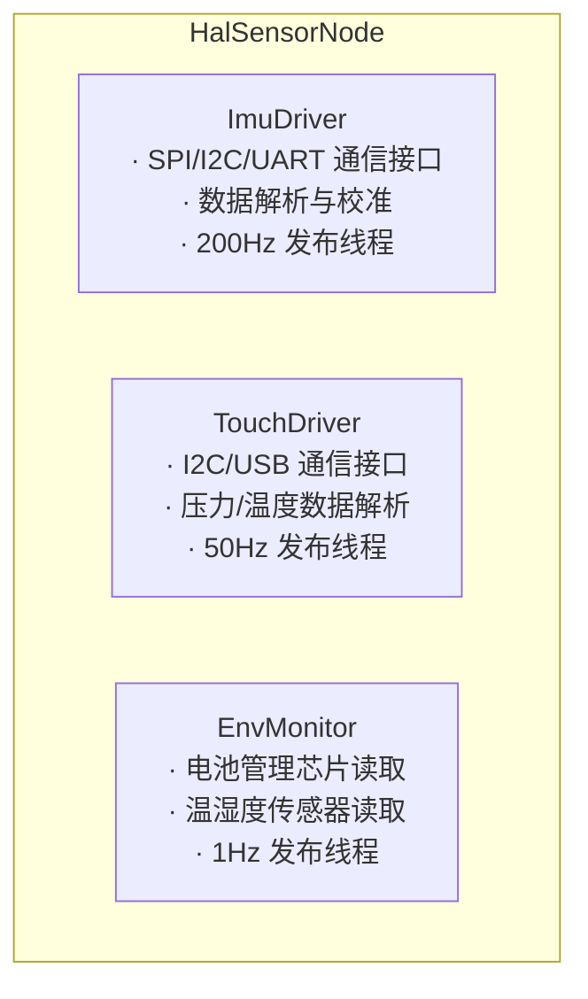

# HAL Sensor 模块详细设计

## 1. 模块概述与定位

HAL Sensor 是机器人非 EtherCAT、非视觉、非 Lidar 传感器的统一硬件抽象层，负责 IMU、触觉传感器和环境传感器的数据采集与管理。

**所处层次**：HAL & Infra 层

**核心职责**：
- 管理 IMU（惯性测量单元）数据采集与发布
- 管理夹爪触觉传感器（Touch）数据采集与发布
- 管理环境传感器（温度、湿度、电池状态）
- 统一设备心跳和健康状态上报

## 2. 职责边界

| 边界 | HAL Sensor 负责 | 对方负责 |
|------|----------------|---------|
| HAL Sensor ↔ MC | 发布 IMU 数据 | 运动控制中的状态估计 |
| HAL Sensor ↔ Perception | 发布 Touch 数据 | 多模态感知融合 |
| HAL Sensor ↔ HDS | 上报设备健康状态 | 故障定级与告警 |
| HAL Sensor ↔ EM | 进程心跳、故障上报 | 进程生命周期管理 |
| HAL Sensor ↔ HAL_Audio | 独立运行，无直接交互 | - |
| HAL Sensor ↔ HAL_Camera | 独立运行，无直接交互 | - |

## 3. 状态机设计

```
[IDLE] --初始化--> [INITIALIZING] --成功--> [READY]
                                    --失败--> [FAULT]

[READY] --正常运行--> [READY]
       --故障--> [FAULT]

[FAULT] --恢复成功--> [READY]
        --恢复失败--> [FAULT]
```

| 状态 | 值 | 说明 |
|------|-----|------|
| IDLE | 0 | 初始状态 |
| INITIALIZING | 1 | 正在初始化 IMU/Touch 设备 |
| READY | 2 | 所有设备正常运行 |
| FAULT | 3 | 至少一个设备故障 |

## 4. ROS2 接口定义

### 4.1 消息定义（msg）

```
# hal_sensor_msgs/msg/SensorHubState.msg
# 传感器集线器状态

uint8 HUB_IDLE       = 0
uint8 HUB_INITIALIZING = 1
uint8 HUB_READY        = 2
uint8 HUB_FAULT        = 3

uint8 state
bool imu_healthy
bool touch_healthy
bool env_healthy
builtin_interfaces/Time stamp
```

```
# hal_sensor_msgs/msg/TouchData.msg
# 触觉传感器数据

string sensor_id             # 传感器标识（"gripper_left", "gripper_right"）
float32[] pressures          # 各触觉点压力值（N）
float32[] temperatures       # 各点温度（C）
geometry_msgs/Point[] contact_positions  # 接触点位置（本地坐标系）
bool[] contact_detected      # 是否检测到接触
uint32 contact_count         # 当前接触点数
builtin_interfaces/Time stamp
```

```
# hal_sensor_msgs/msg/EnvData.msg
# 环境传感器数据

float32 temperature_c          # 环境温度
float32 humidity_percent     # 湿度
float32 battery_voltage      # 主电池电压
float32 battery_current      # 主电池电流
float32 battery_soc          # 电池电量百分比
uint8   power_status         # 供电状态
builtin_interfaces/Time stamp
```

```
# hal_sensor_msgs/msg/Heartbeat.msg
# HAL Sensor 心跳

builtin_interfaces/Time stamp
string node_name
uint8 state
bool healthy
string status_message
bool imu_healthy
bool touch_healthy
```

```
# hal_sensor_msgs/msg/ErrorCode.msg
# 错误码定义（原名 HalSensorErrorCode.msg，应改为 ErrorCode.msg）

uint16 OK                              = 0
uint16 ERR_SENSOR_IMU_NOT_FOUND        = 20041   # IMU 设备未找到
uint16 ERR_SENSOR_IMU_INIT_FAILED      = 20042   # IMU 初始化失败
uint16 ERR_SENSOR_TOUCH_NOT_FOUND      = 20043   # Touch 设备未找到
uint16 ERR_SENSOR_TOUCH_INIT_FAILED    = 20044   # Touch 初始化失败
uint16 ERR_SENSOR_IMU_DATA_STALE       = 20045   # IMU 数据过旧
uint16 ERR_SENSOR_TOUCH_DATA_STALE     = 20046   # Touch 数据过旧

uint16 error_code
string message
```

### 4.2 服务定义（srv）

```
# hal_sensor_msgs/srv/GetHealthStatus.srv

---
bool success
string node_name
builtin_interfaces/Time uptime_since
uint8 state
bool healthy
string message
bool imu_healthy
bool touch_healthy
```

```
# hal_sensor_msgs/srv/SetImuRate.srv
# 设置 IMU 采样率

uint16 rate_hz
---
bool success
uint16 error_code
string message
```

```
# hal_sensor_msgs/srv/SetTouchSensitivity.srv
# 设置触觉灵敏度

string sensor_id
float32 sensitivity          # 0.0~1.0
---
bool success
uint16 error_code
string message
```

### 4.3 接口汇总表

#### Topics（发布）

| 名称 | 类型 | 方向 | QoS | 频率 | 说明 |
|------|------|------|-----|------|------|
| `/sensor/imu/data` | `sensor_msgs/Imu` | Sensor → MC/Perception | Best Effort + Volatile + Depth 1 | 200Hz | IMU 数据 |
| `/sensor/imu/temp` | `sensor_msgs/Temperature` | Sensor → HDS | Best Effort + Volatile + Depth 1 | 1Hz | IMU 温度 |
| `/sensor/touch/data` | `hal_sensor_msgs/TouchData` | Sensor → Perception/MC | Best Effort + Volatile + Depth 1 | 50Hz | 触觉数据 |
| `/sensor/env/data` | `hal_sensor_msgs/EnvData` | Sensor → ALL | Reliable + Transient Local + Depth 1 | 1Hz | 环境数据 |
| `/sensor/hub_state` | `hal_sensor_msgs/SensorHubState` | Sensor → ALL | Reliable + Transient Local + Depth 1 | 1Hz | 集线器状态 |
| `/sensor/heartbeat` | `hal_sensor_msgs/Heartbeat` | Sensor → HDS/EM | Reliable + Volatile + Depth 1 | 1Hz | 心跳 |

#### Services

| 名称 | 类型 | 说明 |
|------|------|------|
| `/sensor/get_health_status` | `GetHealthStatus` | 健康状态查询 |
| `/sensor/set_imu_rate` | `SetImuRate` | 设置 IMU 采样率 |
| `/sensor/set_touch_sensitivity` | `SetTouchSensitivity` | 设置触觉灵敏度 |

## 5. 内部设计

### 5.1 节点架构



### 5.2 关键设计决策

1. **独立线程 per 传感器类型**：IMU 200Hz、Touch 50Hz、Env 1Hz，各自独立线程避免互相干扰
2. **IMU 数据优先**：IMU 是运动控制的关键输入，线程优先级设为最高
3. **Touch 坐标系**：Touch 数据在夹爪本地坐标系下发布，由 TF 提供到全局坐标系的变换
4. **电池管理**：电池状态通过 I2C/SMBus 读取 BMS 芯片数据

### 5.3 关键流程

#### 5.3.1 系统启动流程

1. 初始化 IMU 设备（SPI/I2C/UART 打开）
2. 初始化 Touch 设备（I2C/USB 打开）
3. 初始化环境传感器（I2C 打开）
4. 启动各传感器的采集线程
5. 发布设备状态 + 心跳

#### 5.3.2 IMU 数据异常处理流程

1. 检测到 IMU 数据超出合理范围（如加速度 > 20g）
2. 标记该帧为无效，发布时置 covariance 为极大值
3. 连续 10 帧异常则上报 FAULT 状态
4. 尝试重新初始化 IMU 设备

## 6. 与其他模块的交互

### 6.1 交互矩阵

| 模块 | 交互内容 | 接口类型 |
|------|----------|----------|
| MC | 订阅 `/sensor/imu/data` | Topic |
| Perception | 订阅 `/sensor/touch/data` | Topic |
| HDS | 订阅 `/sensor/heartbeat` + `/sensor/hub_state` | Topic |
| EM | 接收进程状态、重启指令 | Service |

### 6.2 关键交互时序

```
[HalSensorNode] --200Hz Imu--> [MC]
[HalSensorNode] --50Hz Touch--> [Perception]
[HalSensorNode] --1Hz Env--> [HDS/ALL]
```

## 7. 关键参数与配置

| 参数名 | 类型 | 默认值 | 说明 |
|--------|------|--------|------|
| `imu.enabled` | bool | true | 是否启用 IMU |
| `imu.interface` | string | "i2c" | 通信接口（i2c/spi/uart） |
| `imu.device_path` | string | "/dev/i2c-1" | 设备路径 |
| `imu.rate_hz` | int | 200 | IMU 采样率 |
| `imu.frame_id` | string | "imu_frame" | IMU 坐标系 |
| `touch.enabled` | bool | true | 是否启用 Touch |
| `touch.interface` | string | "i2c" | 通信接口 |
| `touch.device_path` | string | "/dev/i2c-2" | 设备路径 |
| `touch.rate_hz` | int | 50 | Touch 采样率 |
| `touch.sensor_count` | int | 2 | 触觉传感器数量 |
| `env.enabled` | bool | true | 是否启用环境传感器 |
| `env.rate_hz` | int | 1 | 环境数据采样率 |
| `heartbeat_rate_hz` | double | 1.0 | 心跳频率 |

## 8. 错误码定义

| 错误码 | 值 | 说明 | 严重程度 |
|--------|-----|------|----------|
| OK | 0 | 正常 | - |
| ERR_SENSOR_IMU_NOT_FOUND | 20041 | IMU 设备未找到 | Critical |
| ERR_SENSOR_IMU_INIT_FAILED | 20042 | IMU 初始化失败 | Critical |
| ERR_SENSOR_TOUCH_NOT_FOUND | 20043 | Touch 设备未找到 | Major |
| ERR_SENSOR_TOUCH_INIT_FAILED | 20044 | Touch 初始化失败 | Major |
| ERR_SENSOR_IMU_DATA_STALE | 20045 | IMU 数据过旧 | Minor |
| ERR_SENSOR_TOUCH_DATA_STALE | 20046 | Touch 数据过旧 | Minor |

## 9. 安全约束

1. **IMU 数据有效性检查**：发布前校验加速度/角速度是否在合理范围内
2. **数据超时保护**：IMU 超过 50ms 无新数据则标记为 stale
3. **Touch 防抖**：接触检测需连续 3 帧以上确认，避免误触发
4. **电池低电量告警**：SOC < 20% 时发布 WARNING 级别告警

## 10. 包结构

```
hal_sensor_msgs/
    msg/
        SensorHubState.msg
        TouchData.msg
        EnvData.msg
        Heartbeat.msg
        ErrorCode.msg               # 错误码（原名 HalSensorErrorCode.msg）
    srv/
        GetHealthStatus.srv
        SetImuRate.srv
        SetTouchSensitivity.srv
    CMakeLists.txt
    package.xml

hal_sensor/
    include/hal_sensor/
        hal_sensor_node.hpp
    src/
        hal_sensor_node.cpp
    config/
        hal_sensor_params.yaml
    launch/
        hal_sensor.launch.py
    CMakeLists.txt
    package.xml
```

## 11. 关键性能指标（KPI）

| 指标 | 目标值 | 说明 |
|------|--------|------|
| IMU 发布延迟 | < 5ms | 从采集到发布 |
| IMU 频率稳定性 | ±1% | 200Hz 抖动 |
| Touch 发布延迟 | < 10ms | 从采集到发布 |
| Env 发布延迟 | < 100ms | 从采集到发布 |
| 数据丢失率 | < 0.1% | 正常运行时 |
| CPU 占用 | < 5% (RK3588) | 所有传感器同时运行 |
| 内存占用 | < 100MB | 含驱动缓冲 |
