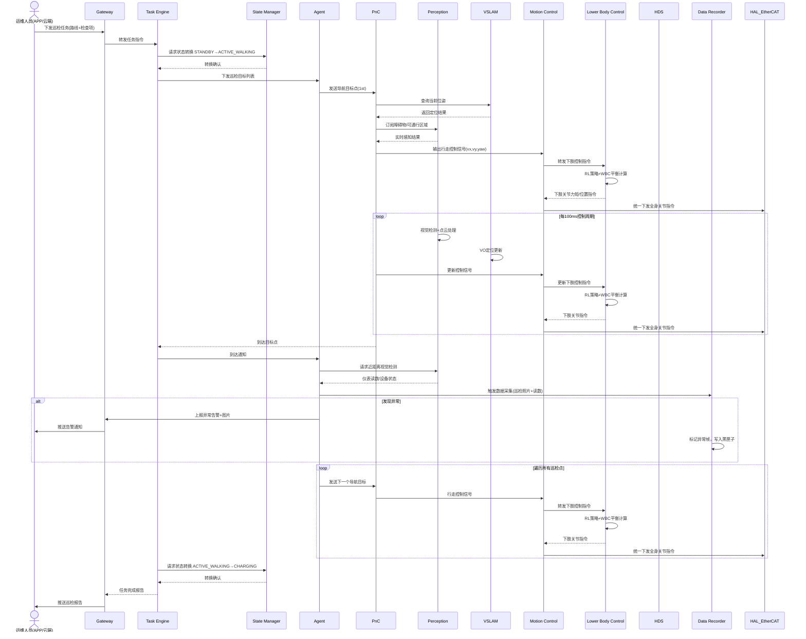

# UC-01: 工业设施巡检

## 1. 场景概述

**业务背景**：电力变电站、石化厂区、数据中心等大型工业设施需要定期巡检，检查设备运行状态、仪表读数、异常温升、泄漏等。传统人工巡检存在效率低、危险环境人员风险、漏检等问题。

**参考企业**：宇树科技 H1/G1 在电力/石化行业的巡检方案

**价值主张**：
- 7×24 小时不间断巡检，消除人工巡检间隔盲区
- 进入高温、高噪、有毒等危险区域，替代人工
- AI 视觉自动读表、识别异常，数据自动归档

**典型任务流**：
1. 接收云端下发的巡检路线与检查项
2. 自主导航至各巡检点
3. 到达后调整姿态，视觉识别仪表/设备状态
4. 发现异常时近距拍照并上报
5. 完成全部点位后返回充电桩

---

## 2. 时序图



---

## 3. 模块协作矩阵

| 模块 | 本场景中的职责 | 协作对象 |
|------|--------------|----------|
| **Gateway** | 接收云端巡检任务，转发至 TE；上报巡检进度与异常告警 | TE, Agent, HDS |
| **TE** | 管理巡检任务生命周期，调度导航子任务与检测子任务 | Gateway, SM, Agent, PnC, DR |
| **SM** | 状态转换仲裁：STANDBY→ACTIVE_WALKING→CHARGING；校验运动许可 | TE, PnC, MC, HDS |
| **Agent** | 解析巡检目标列表，决策检测策略（何时停、看什么、怎么拍） | TE, Perception, Gateway, PnC |
| **PnC** | 全局路径规划（巡检路线），局部轨迹跟踪，动态避障 | TE, VSLAM, Lidar-SLAM, Perception, MC, MapManager |
| **Perception** | 实时障碍物检测（导航用）；近距离视觉识别（仪表读数、设备状态） | PnC, Agent, HAL_Sensor, VSLAM |
| **VSLAM** | 提供机器人在厂区地图中的实时位姿 | PnC, Perception |
| **Lidar-SLAM** | 补充定位，提供点云地图用于长期导航一致性 | PnC, MapManager |
| **MC** | 运动控制协调器：加载 LC 插件，聚合关节指令，统一下发 EtherCAT | PnC, LC, SM, HAL_EtherCAT |
| **LC** | 下肢控制插件（足式）：执行行走步态、RL 策略、WBC 平衡计算 | MC, HAL_EtherCAT |
| **HDS** | 监控巡检过程中各模块健康状态；传感器异常时请求降级 | 全部模块, SM |
| **DR** | 记录巡检过程传感器数据（VLA训练素材）与异常黑匣子 | TE, Agent, Perception |
| **MapManager** | 提供厂区地图；支持巡检路线持久化 | PnC, VSLAM, Lidar-SLAM |
| **HAL_EtherCAT** | 驱动电机执行行走指令；回传关节状态 | MC, LC |
| **HAL_Sensor** | 提供 Camera/Lidar/IMU 原始数据 | Perception, VSLAM, Lidar-SLAM |
| **EM** | 确保巡检所需模块进程（PnC、Perception 等）全部就绪 | SM, 各节点进程 |
| **RC** | 收集巡检过程性能指标（CPU、内存、推理延迟） | 全部模块 |

---

## 4. 数据流向

### Topic 流向

| Topic | 发布者 | 订阅者 | 说明 |
|-------|--------|--------|------|
| `/sm/robot_state` | SM | PnC, MC, Agent, TE | 全局状态广播 |
| `/pnc/cmd_vel` | PnC | MC | 行走控制信号 (vx, vy, yaw_rate) |
| `/perception/obstacles` | Perception | PnC | 障碍物列表 |
| `/perception/inspection_result` | Perception | Agent | 视觉检测结果（读数/异常） |
| `/vslam/pose` | VSLAM | PnC, Perception | 视觉定位位姿 |
| `/lidar_slam/pose` | Lidar-SLAM | PnC | 激光定位位姿 |
| `/joint_states` | HAL_EtherCAT | MC, LC, Perception | 关节状态 |
| `/hds/health_status` | HDS | Gateway | 健康状态上报 |

### Service 调用

| Service | 调用方 | 提供方 | 说明 |
|---------|--------|--------|------|
| `/sm/request_transition` | TE | SM | 状态转换请求 |
| `/sm/is_motion_allowed` | PnC, MC | SM | 运动许可查询 |
| `/map_manager/get_map` | PnC | MapManager | 查询厂区地图 |
| `/perception/detect_target` | Agent | Perception | 近距离目标检测请求 |
| `/dr/start_recording` | TE | DR | 启动数据采集 |

### Action 调用

| Action | 调用方 | 提供方 | 说明 |
|--------|--------|--------|------|
| `/pnc/navigate_to` | TE/Agent | PnC | 导航至巡检点（含进度反馈） |
| `/mc/change_mode` | TE | MC | 切换运动模式（站立→行走） |

---

## 5. 安全约束

### E-Stop 路径

```
Operator(APP) → Gateway → SM → E_STOP触发
                              ↓
                     MC/PNC/MP/MS 立即锁止
                              ↓
                         HAL_EtherCAT 电机刹车
```

- SM 的 E-Stop CallbackGroup 为独立高优先级线程，不与其他回调共享 Executor
- 巡检过程中任何模块检测到急停信号（如碰撞、人员侵入），直接上报 SM，SM 立即切至 `ACTIVE_E_STOP`

### SM 状态校验

| 操作 | 要求状态 | 禁止状态 |
|------|----------|----------|
| 启动行走 | `ACTIVE_WALKING` | `FAULT`, `ACTIVE_E_STOP`, `CHARGING` |
| 视觉检测 | `ACTIVE_STAND` 或 `ACTIVE_WALKING` | `FAULT`, `ACTIVE_E_STOP` |
| 数据采集 | `ACTIVE_WALKING` 或 `ACTIVE_STAND` | `FAULT`, `ACTIVE_E_STOP` |

### 故障处理

| 故障场景 | 检测模块 | 响应模块 | 处理动作 |
|----------|----------|----------|----------|
| 摄像头掉线 | Perception | HDS→SM | 请求 `DEGRADED`，切换至 Lidar 主导导航 |
| 定位丢失 | VSLAM | HDS→SM | 请求 `DEGRADED`，PnC 降速或原地站立等待 |
| 电机过温 | HAL_EtherCAT | HDS→SM | 请求 `FAULT`，停止运动，等待人工确认 |
| 网络断开 | Gateway | HDS | 本地缓存巡检数据，网络恢复后补报 |

---

## 6. 关键参数

| 参数 | 默认值 | 说明 |
|------|--------|------|
| `inspection.nav_speed` | 0.5 m/s | 巡检行走速度（安全优先） |
| `inspection.stop_duration` | 5.0 s | 每个巡检点停留时间 |
| `inspection.detection_confidence` | 0.85 | 视觉检测置信度阈值 |
| `inspection.max_deviation` | 0.3 m | 到达目标点允许的最大偏差 |
| `pnc.obstacle_clearance` | 0.5 m | 障碍物安全距离 |
| `dr.inspection_segment_size` | 500 MB | 单次巡检数据分片大小 |

---

## 7. 故障模式

### 场景：巡检中定位突然丢失

1. **VSLAM** 检测到特征点不足，发布 `localization_quality: POOR`
2. **PnC** 接收到定位质量下降，减速至 `0.1 m/s`
3. **HDS** 聚合 VSLAM + PnC 数据，定级为 `DEGRADED`
4. **HDS** 请求 SM 状态转换至 `DEGRADED`
5. **SM** 批准转换，广播状态变更
6. **PnC** 收到 `DEGRADED`，触发原地站立保安全
7. **TE** 暂停巡检任务，等待定位恢复（超时 30s 后放弃）
8. **Agent** 向 Gateway 上报"定位丢失，暂停巡检"
9. 若 30s 内 Lidar-SLAM 恢复定位，HDS 请求恢复 `ACTIVE_WALKING`，TE 继续任务
10. 若超时，TE 请求 SM 切换至 `STANDBY`，任务标记为 `FAILED`
