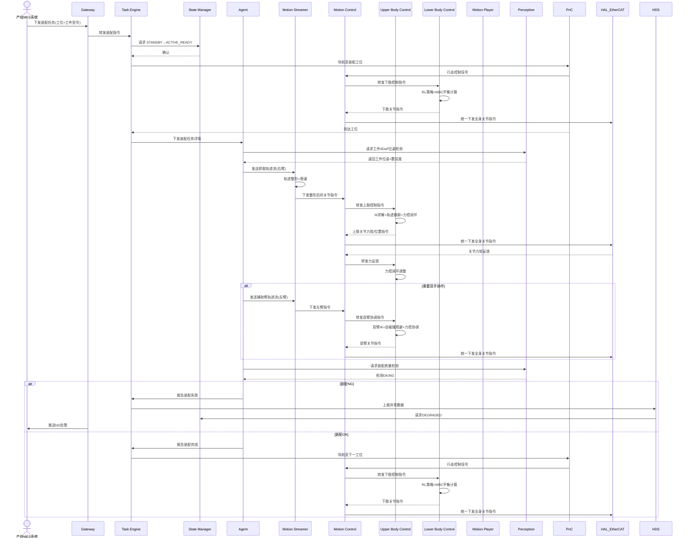

# UC-02: 工厂柔性装配

## 1. 场景概述

**业务背景**：3C 电子、汽车零部件等制造场景中存在大量柔性装配任务（螺丝锁付、插件、贴合），传统工业机器人需预设程序、换线成本高。人形机器人可像人类工人一样，通过视觉引导和力控，在多条产线间灵活切换。

**参考企业**：智元机器人远征系列在 3C/汽车工厂的装配场景

**价值主张**：
- 无需改造产线，直接部署到现有工位
- 通过 VLA 能力，快速学习新装配动作（零样本/少样本）
- 双臂协作，完成单臂机器人无法实现的复杂装配

**典型任务流**：
1. 移动至装配工位
2. 视觉识别工件位置和姿态
3. 规划抓取路径，执行力控抓取
4. 将工件对准装配位置，力控插入/锁付
5. 视觉确认装配质量
6. 移动到下一个工位

---

## 2. 时序图



---

## 3. 模块协作矩阵

| 模块 | 本场景中的职责 | 协作对象 |
|------|--------------|----------|
| **Gateway** | 接收 MES 系统装配指令；上报产线状态与质量数据 | TE, HDS, Operator |
| **TE** | 编排装配全流程：移动→定位→抓取→装配→质检→移动 | Gateway, SM, Agent, PnC, MP, MS |
| **SM** | 管理 `ACTIVE_READY`→`ACTIVE_MOTION`→`ACTIVE_STAND` 状态流转 | TE, MC, MS, MP, HDS |
| **Agent** | 视觉引导的抓取/装配策略决策；双臂协调规划 | TE, Perception, MS, MP, Setting |
| **MS** | 将 Agent 生成的连续运动意图整形为平滑轨迹，100Hz 下发 | Agent, MC, SM |
| **MC** | 运动控制协调器：加载 UC/LC 插件，聚合全身关节指令，统一下发 EtherCAT | UC, LC, MS, MP, SM, HAL_EtherCAT, PnC |
| **UC** | 上肢控制插件：执行双臂 IK、轨迹跟踪、末端力控、自碰撞规避 | MC, HAL_EtherCAT |
| **LC** | 下肢控制插件（足式）：执行站立/行走步态、RL 策略、WBC 平衡计算 | MC, PnC, HAL_EtherCAT |
| **MP** | 播放预录的装配辅助动作（如从固定位置取料的标准动作） | TE, MC, SM |
| **Perception** | 工件 6DoF 位姿估计；装配质量视觉检测 | Agent, UC, HAL_Sensor, TF |
| **PnC** | 工位间短距移动（几米范围）；避障 | TE, MC, Perception, VSLAM |
| **HAL_EtherCAT** | 驱动双臂/下肢电机；回传力矩/位置传感器数据 | MC, UC, LC |
| **HDS** | 监控力控异常（过力、滑移）；定级故障 | MC, UC, HAL_EtherCAT, SM |
| **TF** | 提供相机-手臂标定变换；工件坐标系管理 | Perception, Agent, UC |
| **Setting** | 存储不同工件型号的装配参数（力阈值、速度等） | Agent, MP, MS |

---

## 4. 数据流向

### Topic 流向

| Topic | 发布者 | 订阅者 | 说明 |
|-------|--------|--------|------|
| `/sm/robot_state` | SM | MC, MS, MP, PnC | 全局状态 |
| `/ms/cmd_stream` | MS | MC | 整形后的运动指令流 |
| `/mc/joint_cmd` | MC | HAL_EtherCAT | 聚合后的全身关节力矩/位置指令 |
| `/perception/object_pose` | Perception | Agent | 工件 6DoF 位姿 |
| `/perception/quality_result` | Perception | Agent | 装配质量检测结果 |
| `/ethercat/ft_sensor` | HAL_EtherCAT | MC, UC | 六维力传感器数据 |
| `/pnc/cmd_vel` | PnC | MC | 工位间移动控制信号 |

### Service 调用

| Service | 调用方 | 提供方 | 说明 |
|---------|--------|--------|------|
| `/sm/is_motion_allowed` | MS, MP, MC | SM | 每次运动前校验 |
| `/perception/detect_object` | Agent | Perception | 请求工件位姿检测 |
| `/setting/get_param` | Agent, MS | Setting | 读取工件装配参数 |
| `/hds/query_health` | TE | HDS | 装配前健康检查 |

### Action 调用

| Action | 调用方 | 提供方 | 说明 |
|--------|--------|--------|------|
| `/te/execute_task` | Gateway | TE | 装配任务执行（含进度） |
| `/mp/play_motion` | TE | MP | 播放标准取料动作 |
| `/pnc/navigate_to` | TE | PnC | 工位间导航 |

---

## 5. 安全约束

### E-Stop 路径

```
力传感器超限 / 安全围栏触发 → HAL_EtherCAT → SM → ACTIVE_E_STOP
                                    ↓
                              MC 零力矩模式 + 电机刹车
```

- 力控装配中，任何关节力矩超过安全阈值（如 50N·m），UC 立即上报 HDS，HDS 请求 SM 切至 `ACTIVE_E_STOP`
- 双臂协作时，两臂间碰撞检测由 UC 的自碰撞规避负责，检测到自碰撞时立即阻尼制动

### SM 状态校验

| 操作 | 要求状态 | 禁止状态 |
|------|----------|----------|
| 力控抓取 | `ACTIVE_MOTION` 或 `ACTIVE_READY` | `FAULT`, `ACTIVE_E_STOP` |
| 双臂协作 | `ACTIVE_MOTION` | 全部非运动状态 |
| 工位间移动 | `ACTIVE_WALKING` | `FAULT`, `ACTIVE_E_STOP` |

### 力控安全

- 接触力上限由 Setting 按工件型号配置（如 10N 精密件 vs 50N 结构件）
- UC 的力控任务优先级高于轨迹跟踪任务
- 力传感器数据异常（噪声/掉线）时，UC 拒绝力控模式，请求位控模式

---

## 6. 关键参数

| 参数 | 默认值 | 说明 |
|------|--------|------|
| `assembly.force_limit` | 20 N | 装配接触力上限 |
| `assembly.approach_speed` | 0.02 m/s | 接近工件速度（防止碰撞） |
| `assembly.align_tolerance` | 0.5 mm | 装配对准精度 |
| `ms.arm_stream_rate` | 100 Hz | 手臂指令流输出频率 |
| `uc.force_priority` | 1 | 力控任务优先级（最高） |
| `perception.pose_confidence` | 0.90 | 位姿检测最低置信度 |

---

## 7. 故障模式

### 场景：装配过程中力传感器突然掉线

1. **HAL_EtherCAT** 检测到力传感器数据超时（>100ms 无更新）
2. **UC** 发现力反馈缺失，力控任务失效，切换为纯位控模式
3. **UC** 上报 MC/HDS："力传感器掉线，已切换位控"
4. **HDS** 定级为 `DEGRADED`（力控装配降级为位控装配，精度下降）
5. **HDS** 请求 SM 状态转换至 `DEGRADED`
6. **Agent** 收到降级通知，评估当前装配阶段：
   - 若尚未接触工件：请求人工确认是否继续（位控风险高）
   - 若已接触但未完成：降低装配速度，继续位控完成
7. **TE** 记录故障事件，任务状态标记为 `COMPLETED_WITH_DEGRADATION`
