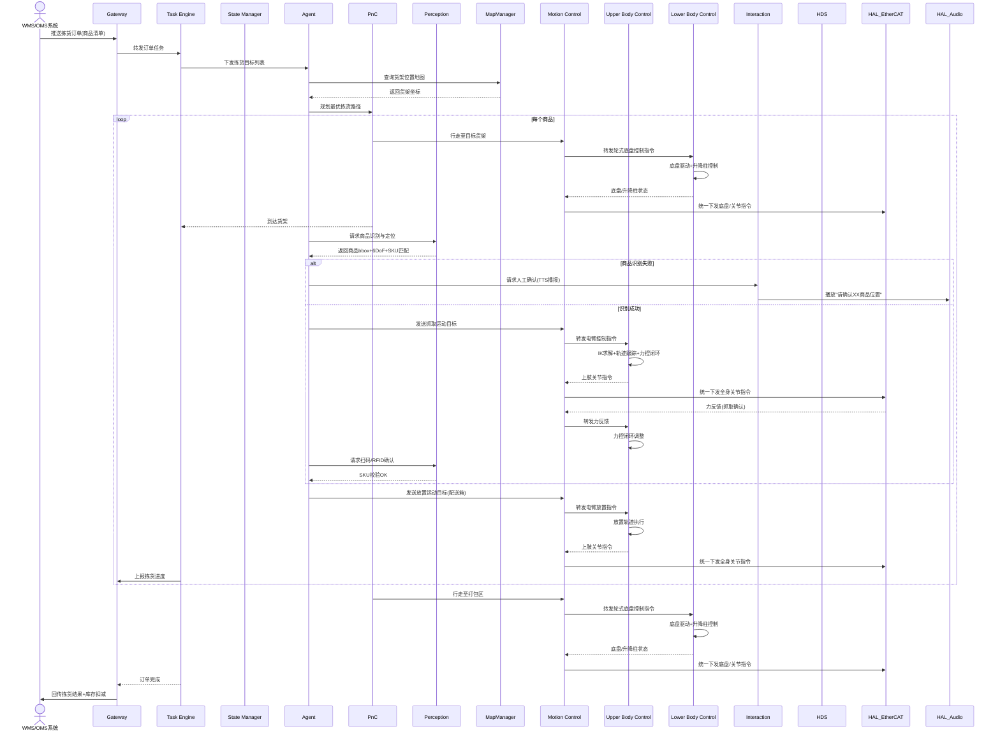

# UC-03: 商超零售拣货

## 1. 场景概述

**业务背景**：商超、便利店面临拣货效率低、夜间无人、订单波动大等挑战。轮式双臂人形机器人可在货架间穿梭，根据订单自动拣选商品，放入配送箱。

**参考企业**：银河通用轮式双臂机器人在零售/商超场景

**价值主张**：
- 夜间闭店后自动补货/拣货，提升仓库利用率
- 多 SKU 商品识别，适应包装变化
- 与 WMS/OMS 系统对接，实现库存实时同步

**典型任务流**：
1. 接收订单（商品列表 + 数量）
2. 规划拣货路径（最少移动、货架顺序优化）
3. 导航至目标货架
4. 视觉识别目标商品（在相似商品中区分）
5. 双臂协作抓取（一手扶货架，一手取货）
6. 放入配送箱，扫码/RFID 确认
7. 重复直到订单完成，送至打包区

---

## 2. 时序图



---

## 3. 模块协作矩阵

| 模块 | 本场景中的职责 | 协作对象 |
|------|--------------|----------|
| **Gateway** | 接收 WMS 订单，回传拣货结果与库存状态 | TE, WMS, HDS |
| **TE** | 管理订单级任务，编排"移动→识别→抓取→放置"循环 | Gateway, SM, Agent, PnC, MC |
| **SM** | 状态管理：`ACTIVE_WALKING`（货架间）↔ `ACTIVE_MOTION`（抓取时） | TE, PnC, MC |
| **Agent** | 路径规划优化、商品识别策略、抓取姿态生成 | TE, Perception, PnC, MapManager, MC |
| **PnC** | 商超环境导航（窄通道、人流/货架动态障碍） | TE, MC, Perception, VSLAM, MapManager |
| **Perception** | SKU 商品识别（在相似包装中区分目标）；扫码/RFID | Agent, HAL_Sensor, TF |
| **MapManager** | 提供货架布局地图、商品位置索引 | Agent, PnC, VSLAM |
| **MC** | 运动控制协调器：加载 UC/LC 插件，聚合全身关节指令，统一下发 EtherCAT | UC, LC, PnC, HAL_EtherCAT |
| **UC** | 上肢控制插件：执行双臂 IK、轨迹跟踪、末端力控、自碰撞规避 | MC, HAL_EtherCAT |
| **LC** | 下肢控制插件（轮式）：轮式底盘驱动、升降柱控制 | MC, PnC, HAL_EtherCAT |
| **Interaction** | 商品识别失败时语音求助；拣货进度语音播报 | Agent, HAL_Audio |
| **HAL_Audio** | TTS 播报；环境声音采集（听取人工指令） | Interaction |
| **HDS** | 监控拣货准确率、抓取失败率；异常定级 | 全部模块 |
| **VSLAM** | 商超环境视觉定位（重复纹理、光照变化挑战） | PnC, Perception |

---

## 4. 数据流向

### Topic 流向

| Topic | 发布者 | 订阅者 | 说明 |
|-------|--------|--------|------|
| `/sm/robot_state` | SM | PnC, MC | 全局状态 |
| `/pnc/cmd_vel` | PnC | MC | 轮式底盘控制 |
| `/perception/sku_detection` | Perception | Agent | SKU 识别结果（含置信度） |
| `/perception/barcode_scan` | Perception | Agent | 扫码/RFID 结果 |
| `/interaction/tts_request` | Interaction | HAL_Audio | TTS 播报请求 |
| `/hds/health_status` | HDS | Gateway | 健康状态 |

### Service 调用

| Service | 调用方 | 提供方 | 说明 |
|---------|--------|--------|------|
| `/map_manager/query_shelf` | Agent | MapManager | 查询货架坐标 |
| `/perception/recognize_sku` | Agent | Perception | SKU 商品识别 |
| `/sm/request_transition` | TE | SM | 状态切换（行走↔抓取） |

### Action 调用

| Action | 调用方 | 提供方 | 说明 |
|--------|--------|--------|------|
| `/te/execute_order` | Gateway | TE | 订单级拣货任务 |
| `/pnc/navigate_to` | TE | PnC | 导航至货架/打包区 |

---

## 5. 安全约束

### E-Stop 路径

```
人员靠近(红外/视觉检测) / 货架碰撞 → Perception → SM → ACTIVE_E_STOP
                                                   ↓
                                            MC 立即停止，保持当前姿态
```

- 商超环境人员安全优先：检测到人员进入 0.5m 安全区时，PnC 立即减速至 0；进入 0.2m 时触发 E-Stop
- 货架碰撞检测：手臂力控中检测到异常反力（非商品重力），UC 立即回退

### SM 状态校验

| 操作 | 要求状态 | 禁止状态 |
|------|----------|----------|
| 货架间行走 | `ACTIVE_WALKING` | `FAULT`, `ACTIVE_E_STOP` |
| 商品抓取 | `ACTIVE_MOTION` | 全部非运动状态 |
| 语音交互 | `ACTIVE_STAND` 或 `ACTIVE_MOTION` | `ACTIVE_E_STOP` |

---

## 6. 关键参数

| 参数 | 默认值 | 说明 |
|------|--------|------|
| `retail.max_speed` | 0.8 m/s | 商超内最大行走速度 |
| `retail.safety_distance_human` | 0.5 m | 人员安全距离 |
| `retail.grasp_retry` | 2 | 单次商品抓取失败重试次数 |
| `perception.sku_confidence` | 0.88 | SKU 识别最低置信度 |
| `uc.grasp_force` | 5 N | 轻拿轻放抓取力（易碎商品） |
| `pnc.aisle_width` | 1.2 m | 通道最小宽度约束 |

---

## 7. 故障模式

### 场景：商品被其他顾客拿走后识别不到

1. **Agent** 请求 Perception 识别目标 SKU，返回 `not_found`
2. **Agent** 扩大搜索范围（相邻货架、上下层）
3. 仍找不到 → Agent 请求 Interaction 语音播报："该商品暂时缺货"
4. **Agent** 向 TE 报告 `ITEM_UNAVAILABLE`
5. **TE** 标记该商品缺货，继续下一商品
6. **Gateway** 向 WMS 上报缺货信息，触发库存修正
7. 订单完成后，TE 标记订单为 `COMPLETED_WITH_EXCEPTION`
