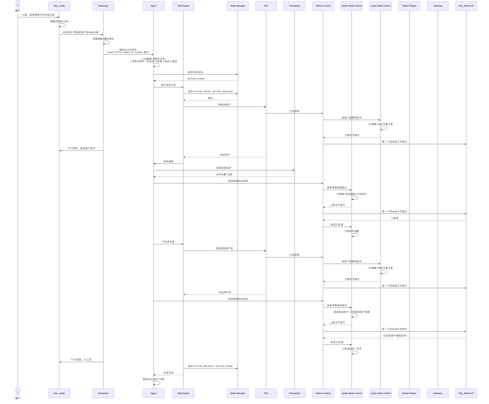

# UC-04: 语音家庭助手

## 1. 场景概述

**业务背景**：人形机器人作为家庭场景的智能助手，通过自然语言与用户交互，执行日常任务（取物、开关电器、陪伴聊天、提醒事项）。VLA 能力使机器人能够理解模糊指令并在家庭环境中自主执行。

**参考企业**：通用家庭服务场景（智元、宇树等均有布局）

**价值主张**：
- 自然语言交互，降低使用门槛（老人/儿童友好）
- 物理世界操作（取水杯、递物品），超越智能音箱
- 长期记忆用户偏好，个性化服务

**典型任务流**：
1. 用户语音唤醒（"小智，帮我把客厅的水拿过来"）
2. ASR 转文本 → Interaction 意图理解 → Agent 推理规划
3. Agent 拆解为子任务：导航到客厅→视觉搜索水杯→抓取→导航到用户处→递送
4. TE 调度子任务执行
5. 执行中语音反馈（"我正在找水杯"）
6. 完成后语音报告（"给您，小心烫"）

---

## 2. 时序图

---

## 3. 模块协作矩阵

| 模块 | 本场景中的职责 | 协作对象 |
|------|--------------|----------|
| **HAL_Audio** | 唤醒词检测、ASR 转写、TTS 合成播放 | Interaction |
| **Interaction** | 语音意图理解、对话状态管理、多轮交互仲裁、TTS 请求下发 | HAL_Audio, Agent, TE, MP |
| **Agent** | 自然语言理解 → 任务拆解 → 环境感知查询 → 抓取策略生成 | Interaction, TE, Perception, SM, MC |
| **TE** | 调度"导航→找物→抓取→返回→递送"子任务链 | Agent, SM, PnC, MP, MC |
| **SM** | 管理站立/行走/抓取状态切换 | TE, PnC, MC |
| **PnC** | 家庭环境导航（窄门、家具避让） | TE, MC, Perception, VSLAM |
| **Perception** | 家庭物品检测与位姿估计（水杯、遥控器、药瓶等） | Agent, PnC, HAL_Sensor |
| **MC** | 运动控制协调器：加载 UC/LC 插件，聚合全身关节指令，统一下发 EtherCAT | UC, LC, PnC, HAL_EtherCAT |
| **UC** | 上肢控制插件：执行双臂 IK、轨迹跟踪、末端力控（递送时感知用户接取） | MC, HAL_EtherCAT |
| **LC** | 下肢控制插件（足式）：执行站立/行走步态、RL 策略、WBC 平衡计算 | MC, PnC, HAL_EtherCAT |
| **MP** | 播放社交动作（点头、挥手）增强交互感 | Interaction, MC |
| **VSLAM** | 家庭环境视觉定位（光照变化大、动态物体多） | PnC |
| **Gateway** | 云端 LLM 调用（复杂推理时 fallback）；远程监控 | Agent, HDS |
| **HDS** | 监控交互响应延迟、ASR 准确率等健康指标 | 全部模块 |

---

## 4. 数据流向

### Topic 流向

| Topic | 发布者 | 订阅者 | 说明 |
|-------|--------|--------|------|
| `/hal_audio/asr_text` | HAL_Audio | Interaction | ASR 识别文本 |
| `/hal_audio/vad_event` | HAL_Audio | Interaction | 语音活动检测事件 |
| `/interaction/tts_request` | Interaction | HAL_Audio | TTS 播报请求 |
| `/interaction/interaction_event` | Interaction | Agent | 结构化交互事件 |
| `/agent/task_plan` | Agent | TE | 任务计划提交 |
| `/perception/object_detection` | Perception | Agent | 物品检测结果 |
| `/sm/robot_state` | SM | TE, PnC, MC | 全局状态 |
| `/pnc/cmd_vel` | PnC | MC | 家庭环境导航 |

### Service 调用

| Service | 调用方 | 提供方 | 说明 |
|---------|--------|--------|------|
| `/sm/query_state` | Agent | SM | 查询当前机器人状态 |
| `/sm/request_transition` | TE | SM | 状态转换请求 |
| `/perception/detect_object` | Agent | Perception | 请求检测特定物品 |
| `/interaction/get_dialog_context` | Agent | Interaction | 获取对话上下文 |

### Action 调用

| Action | 调用方 | 提供方 | 说明 |
|--------|--------|--------|------|
| `/te/execute_task` | Agent | TE | 家庭任务执行 |
| `/pnc/navigate_to` | TE | PnC | 房间间导航 |
| `/mp/play_motion` | Interaction | MP | 播放社交动作 |

---

## 5. 安全约束

### 安全约束

- Interaction 识别到"停止"、"别动"、"危险"等紧急词汇时，通过 Interaction → Gateway 或本地安全策略处理，不走 LLM 推理（避免 LLM 延迟）
- 递送物品时，UC 力控检测用户是否接过物品（力突变），未检测到时保持递送姿态不松手

### SM 状态校验

| 操作 | 要求状态 | 禁止状态 |
|------|----------|----------|
| 响应语音指令 | `ACTIVE` | `FAULT`, `SHUTTING_DOWN` |
| 室内行走 | `ACTIVE`（MC 运动模式由 MC 自行管理）| `FAULT`, `CHARGING`, `SHUTTING_DOWN` |
| 抓取物品 | `ACTIVE`（MC 运动模式由 MC 自行管理）| `FAULT`, `SHUTTING_DOWN` |
| 递送物品 | `ACTIVE`（MC 运动模式由 MC 自行管理）| 全部非 `ACTIVE` 状态 |

### 隐私安全

- 家庭语音数据本地 ASR 优先，仅复杂语义理解时通过 Gateway 调用云端 LLM
- Gateway 对语音数据做端到端加密传输
- DR 录制家庭环境数据前需用户明确授权（语音确认"开始记录"）

---

## 6. 关键参数

| 参数 | 默认值 | 说明 |
|------|--------|------|
| `home.nav_speed` | 0.3 m/s | 室内行走速度（安全优先） |
| `home.wake_word` | "小智" | 唤醒词 |
| `home.vad_timeout` | 3.0 s | 语音输入超时（静音判定） |
| `home.max_grasp_weight` | 1.0 kg | 家庭场景最大抓取重量 |
| `interaction.emergency_words` | ["停止","别动","危险"] | 紧急词汇列表 |
| `agent.plan_timeout` | 10.0 s | LLM 推理超时 |

---

## 7. 故障模式

### 场景：用户指令模糊（"帮我拿那个"）

1. **Interaction** 解析出意图 `FETCH`，但 `object` 槽位为 `null`
2. **Interaction** 构建追问事件，通过 HAL_Audio TTS："您指的是哪个？桌上的水杯还是沙发上的遥控器？"
3. **User** 回答："水杯"
4. **Interaction** 补充槽位，重新提交给 Agent
5. **Agent** 确认目标后生成任务计划
6. 正常执行后续流程

### 场景：物品被遮挡找不到

1. **Agent** 请求 Perception 检测水杯，返回 `occluded`
2. **Agent** 规划调整视角（侧身、蹲下、换角度）
3. **MC/UC** 执行视角调整动作
4. 重新检测仍找不到 → Agent 向 Interaction 请求语音反馈："找不到水杯，可能被人拿走了"
5. **TE** 标记子任务失败，向用户确认是否继续
