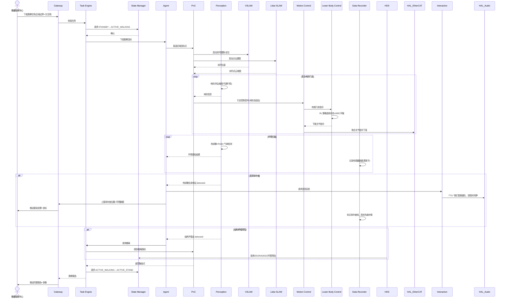

# UC-05: 应急救援勘察

## 1. 场景概述

**业务背景**：地震、火灾、化学泄漏等灾害现场环境恶劣（高温、有毒、结构不稳），人员进入风险极高。足式人形机器人可进入废墟、楼梯、狭窄空间，携带传感器勘察环境，搜索幸存者，回传现场数据。

**参考企业**：宇树科技 H1 在应急/消防领域的探索

**价值主张**：
- 进入人类无法生存的危险环境（高温、浓烟、辐射）
- 足式设计可跨越废墟、攀爬楼梯，轮式机器人无法到达
- 实时回传视频、气体浓度、温度等数据，辅助决策

**典型任务流**：
1. 接收救援指挥中心的勘察任务（区域+关注项）
2. 自主导航至目标区域（可能无地图，需实时建图）
3. 复杂地形行走（碎石、楼梯、斜坡）
4. 环境感知：热成像搜索生命体征、气体检测、结构扫描
5. 发现幸存者时，语音安抚并精确定位回传
6. 完成任务后返回集结点

---

## 2. 时序图



---

## 3. 模块协作矩阵

| 模块 | 本场景中的职责 | 协作对象 |
|------|--------------|----------|
| **Gateway** | 接收救援任务；实时回传视频/感知数据；幸存者告警 | TE, Command, HDS |
| **TE** | 管理勘察任务；协调导航、扫描、告警子任务 | Gateway, SM, Agent, PnC, DR |
| **SM** | 状态管理；高优先级 E-Stop 响应（环境突变） | TE, PnC, MC, HDS |
| **Agent** | 环境理解、幸存者识别策略、风险决策（是否继续/撤离） | TE, Perception, Gateway, PnC |
| **PnC** | 无地图/半地图环境下的探索导航；地形自适应 foothold 规划 | TE, MC, Perception, VSLAM, Lidar-SLAM |
| **MC** | 运动控制协调器：加载LC插件，聚合关节指令，统一下发EtherCAT | PnC, LC, HAL_EtherCAT |
| **LC** | 下肢控制插件：执行复杂地形 RL 步态（碎石、楼梯、斜坡）；WBC全身平衡 | MC, HAL_EtherCAT, Perception |
| **Perception** | 多光谱感知：热成像（生命探测）、RGB（视觉）、气体传感器 | Agent, PnC, HAL_Sensor |
| **VSLAM** | 废墟环境视觉 SLAM（低光照、动态遮挡挑战） | PnC, Perception |
| **Lidar-SLAM** | 点云建图（结构扫描、空间测量） | PnC, MapManager |
| **DR** | 高可靠数据记录（黑匣子），网络中断时本地缓存 | TE, Agent, Perception |
| **HDS** | 环境风险监控（高温、有毒、辐射超标）；紧急定级 | 全部传感器, SM |
| **MapManager** | 实时地图拼接与持久化（勘察区域地图生成） | VSLAM, Lidar-SLAM, PnC |
| **Interaction** | 幸存者语音安抚；环境声音采集（呼救声识别） | Agent, HAL_Audio |
| **HAL_EtherCAT** | 高可靠电机驱动（恶劣环境下的通信鲁棒性） | MC |

---

## 4. 数据流向

### Topic 流向

| Topic | 发布者 | 订阅者 | 说明 |
|-------|--------|--------|------|
| `/sm/robot_state` | SM | PnC, MC, TE | 全局状态 |
| `/pnc/cmd_vel` | PnC | MC | 行走控制（地形自适应） |
| `/perception/thermal_image` | Perception | Agent | 热成像数据 |
| `/perception/life_sign` | Perception | Agent | 生命体征检测结果 |
| `/perception/gas_concentration` | Perception | HDS | 气体浓度数据 |
| `/vslam/pose` | VSLAM | PnC | 视觉定位 |
| `/lidar_slam/map` | Lidar-SLAM | MapManager | 点云地图 |
| `/dr/segment_status` | DR | TE | 数据记录状态 |

### Service 调用

| Service | 调用方 | 提供方 | 说明 |
|---------|--------|--------|------|
| `/map_manager/save_map` | Agent | MapManager | 保存勘察地图 |
| `/perception/scan_area` | Agent | Perception | 请求区域扫描 |
| `/hds/query_environment_risk` | TE | HDS | 查询环境风险等级 |

### Action 调用

| Action | 调用方 | 提供方 | 说明 |
|--------|--------|--------|------|
| `/pnc/explore_area` | TE | PnC | 区域探索导航 |
| `/te/execute_rescue` | Gateway | TE | 勘察任务执行 |

---

## 5. 安全约束

### E-Stop 路径

```
环境传感器超限(高温/有毒气体) → Perception → HDS → SM → ACTIVE_E_STOP
                                               ↓
                                         LC 执行原地阻尼制动
                                               ↓
                                        等待人工确认（远程或现场）
```

- **环境触发 E-Stop**：温度 >60°C、CO 浓度 >50ppm、辐射超标时，HDS 自动请求 E-Stop
- **远程 E-Stop**：指挥中心可通过 Gateway 随时触发 E-Stop
- 网络中断时，HDS 的本地自主 E-Stop 不依赖云端

### SM 状态校验

| 操作 | 要求状态 | 禁止状态 |
|------|----------|----------|
| 废墟行走 | `ACTIVE_WALKING` | `FAULT`, `ACTIVE_E_STOP` |
| 环境扫描 | `ACTIVE_WALKING` 或 `ACTIVE_STAND` | `ACTIVE_E_STOP` |
| 语音安抚 | `ACTIVE_STAND` | `ACTIVE_E_STOP` |

### 鲁棒性设计

- 网络中断时：DR 本地缓存全部数据，网络恢复后批量上传
- GPS 拒止环境：VSLAM + Lidar-SLAM 主导定位，不依赖 GNSS
- 低光照：热成像主导，RGB 辅助

---

## 6. 关键参数

| 参数 | 默认值 | 说明 |
|------|--------|------|
| `rescue.max_temp` | 60 °C | 环境温度上限 |
| `rescue.max_co_ppm` | 50 ppm | CO 浓度上限 |
| `rescue.thermal_threshold` | 35 °C | 生命体征热成像阈值 |
| `pnc.terrain_adaptation` | true | 地形自适应 foothold 开关 |
| `mc.rugged_gait_mode` | "robust" | 崎岖地形步态模式 |
| `dr.local_buffer_size` | 10 GB | 本地黑匣子缓存大小 |
| `gateway.offline_cache` | true | 离线数据缓存开关 |

---

## 7. 故障模式

### 场景：网络中断导致无法回传数据

1. **Gateway** 检测到网络断开，上报 HDS
2. **HDS** 定级为 `DEGRADED`（通信降级，但本地功能正常）
3. **TE** 继续执行勘察任务（任务不依赖实时云端）
4. **DR** 切换至高可靠性本地存储模式，数据写入本地 SSD
5. **Agent** 调整策略：减少实时上报频率，增加本地决策自主性
6. 网络恢复后，Gateway 自动批量补传缓存数据
7. 若任务完成后网络仍未恢复，DR 数据可通过物理导出方式回收

### 场景：一只脚陷入碎石缝

1. **LC** 通过关节力矩反馈检测到单腿异常负载（触地力不对称）
2. **LC** 的 RL 策略切换至"脱困步态"，增大摆动腿抬升高度
3. **PnC** 暂停前进，原地协调脱困
4. 若 10s 内无法脱困 → Agent 评估风险，可能请求 TE 放弃当前路径
5. **TE** 规划替代路线，绕开该区域
