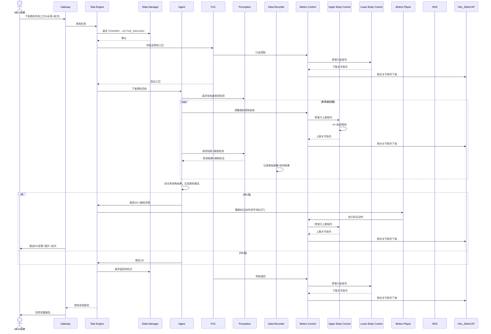

# UC-06: 产线质量检测

## 1. 场景概述

**业务背景**：制造业产线末端或关键工序后需要质量检测（外观缺陷、尺寸偏差、装配完整性）。人形机器人可像质检员一样，移动到不同工位，多角度视觉检测，甚至使用简单量具。

**参考企业**：智元机器人远征系列在 3C/汽车质检场景

**价值主张**：
- 一台机器人可覆盖多个工位，替代多名质检员
- 多角度、多光照检测，消除人工漏检
- AI 缺陷分类，数据自动关联 MES 批次

**典型任务流**：
1. 接收质检任务（工位 + 检测标准 + 批次号）
2. 移动至质检工位
3. 调整姿态和视角，多角度拍照
4. AI 视觉检测缺陷（划痕、色差、异物、缺件）
5. 生成质检报告（OK/NG + 缺陷位置 + 置信度）
6. NG 品标记或隔离
7. 数据回传 MES，关联批次追溯

---

## 2. 时序图



---

## 3. 模块协作矩阵

| 模块 | 本场景中的职责 | 协作对象 |
|------|--------------|----------|
| **Gateway** | 接收 MES 质检任务；回传质检报告与缺陷图片 | TE, MES, HDS |
| **TE** | 编排质检全流程：移动→检测→报告→返回 | Gateway, SM, Agent, PnC, MP |
| **SM** | 状态切换：`ACTIVE_WALKING`→`ACTIVE_STAND`（检测时静止） | TE, PnC, MC |
| **Agent** | 检测策略决策（看哪里、怎么看、判定标准） | TE, Perception, MC, Setting |
| **PnC** | 工位间移动；检测时的精确位姿保持 | TE, MC, Perception, VSLAM |
| **Perception** | 高精度视觉检测：缺陷识别、尺寸测量、OCR 读码 | Agent, HAL_Sensor, TF |
| **DR** | 质检数据记录（原始图像+检测结果+批次关联） | TE, Agent, Perception |
| **MC** | 运动控制协调器：加载UC/LC插件，聚合关节指令，统一下发EtherCAT | UC, LC, PnC, HAL_EtherCAT |
| **UC** | 上肢控制插件：执行相机视角姿态调整、标记动作（举手/指示灯） | MC, MP |
| **LC** | 下肢控制插件：执行工位间轮式底盘移动 | MC, PnC, HAL_EtherCAT |
| **MP** | NG 品标记动作（如举手、LED 指示灯变化） | TE, MC |
| **TF** | 相机标定变换；工件坐标系精确管理 | Perception, Agent |
| **Setting** | 存储不同产品型号的检测参数（光照、角度、阈值） | Agent, Perception |
| **HDS** | 检测准确率监控；相机/光源异常检测 | Perception, SM |
| **VSLAM** | 工位精确定位（亚厘米级） | PnC |

---

## 4. 数据流向

### Topic 流向

| Topic | 发布者 | 订阅者 | 说明 |
|-------|--------|--------|------|
| `/sm/robot_state` | SM | PnC, MC | 全局状态 |
| `/pnc/cmd_vel` | PnC | MC | 工位间移动 |
| `/perception/defect_detection` | Perception | Agent | 缺陷检测结果 |
| `/perception/dimension_measure` | Perception | Agent | 尺寸测量结果 |
| `/perception/ocr_result` | Perception | Agent | OCR 读码结果 |
| `/dr/inspection_frame` | DR | - | 质检帧记录 |

### Service 调用

| Service | 调用方 | 提供方 | 说明 |
|---------|--------|--------|------|
| `/perpection/inspect_target` | Agent | Perception | 请求多角度检测 |
| `/setting/get_inspection_params` | Agent | Setting | 读取产品检测参数 |
| `/sm/is_motion_allowed` | PnC | SM | 运动前校验 |

### Action 调用

| Action | 调用方 | 提供方 | 说明 |
|--------|--------|--------|------|
| `/te/execute_task` | Gateway | TE | 质检任务执行 |
| `/pnc/navigate_to` | TE | PnC | 工位导航 |
| `/mp/play_motion` | TE | MP | NG 标记动作 |

---

## 5. 安全约束

### E-Stop 路径

```
产线急停按钮 / 安全光幕触发 → 外部IO → HAL_EtherCAT → SM → ACTIVE_E_STOP
                                                         ↓
                                                   LC 立即停止底盘移动，UC 保持上肢当前姿态
```

- 质检工位通常与产线联动：产线 E-Stop 信号通过 HAL_EtherCAT 数字输入接入 SM
- 检测过程中机器人保持静止，E-Stop 主要防止意外移动碰撞产线

### SM 状态校验

| 操作 | 要求状态 | 禁止状态 |
|------|----------|----------|
| 工位间移动 | `ACTIVE_WALKING` | `FAULT`, `ACTIVE_E_STOP` |
| 视觉检测 | `ACTIVE_STAND` | 全部非站立状态 |
| 姿态调整 | `ACTIVE_STAND` | `FAULT`, `ACTIVE_E_STOP` |

### 检测精度保障

- 检测时 SM 必须处于 `ACTIVE_STAND`，UC 执行主动振动抑制（上肢防抖）
- 相机曝光期间（>10ms），UC 暂停轨迹更新，避免运动模糊
- 多视角检测结果由 Agent 做时空一致性校验（同一缺陷在不同视角中应可对应）

---

## 6. 关键参数

| 参数 | 默认值 | 说明 |
|------|--------|------|
| `inspection.camera_exposure` | 10 ms | 相机曝光时间 |
| `inspection.vibration_damping` | true | 检测时振动抑制开关 |
| `inspection.multi_angle_count` | 3 | 多视角检测数量 |
| `inspection.defect_confidence` | 0.92 | 缺陷判定置信度阈值 |
| `inspection.dimension_tolerance` | 0.1 mm | 尺寸测量公差 |
| `pnc.position_accuracy` | 0.02 m | 工位定位精度 |

---

## 7. 故障模式

### 场景：光源闪烁导致检测误判

1. **Perception** 检测到疑似缺陷，但置信度在阈值边缘（0.90 vs 阈值 0.92）
2. **Agent** 请求重新检测（换角度或等待光源稳定）
3. **Perception** 第二次检测，置信度 0.95，确认缺陷
4. **Agent** 综合两次结果，生成 NG 报告
5. **DR** 记录两次检测的原始图像，供事后追溯

### 场景：产品型号切换但参数未更新

1. **Agent** 从 Setting 读取检测参数，发现批次号与参数不匹配
2. **Agent** 向 TE 报告 `PARAM_MISMATCH`
3. **TE** 暂停任务，通过 Gateway 向 MES 请求确认产品型号
4. MES 确认型号后，Setting 更新参数
5. **TE** 恢复任务，Agent 使用正确参数执行检测
