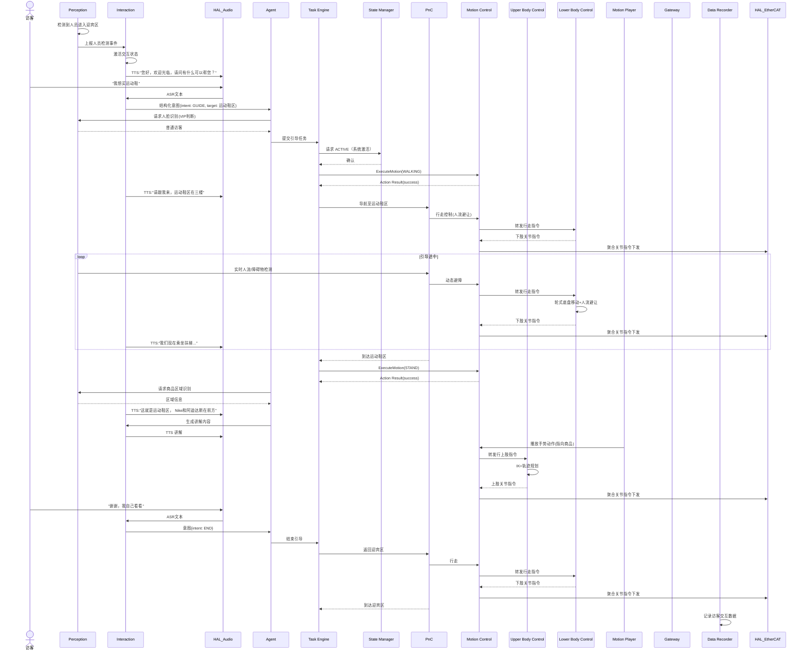
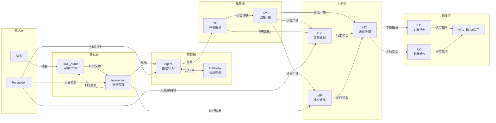
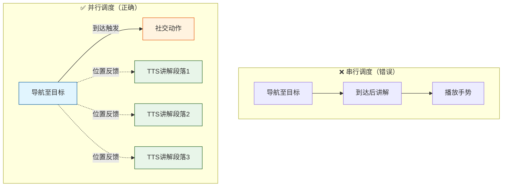
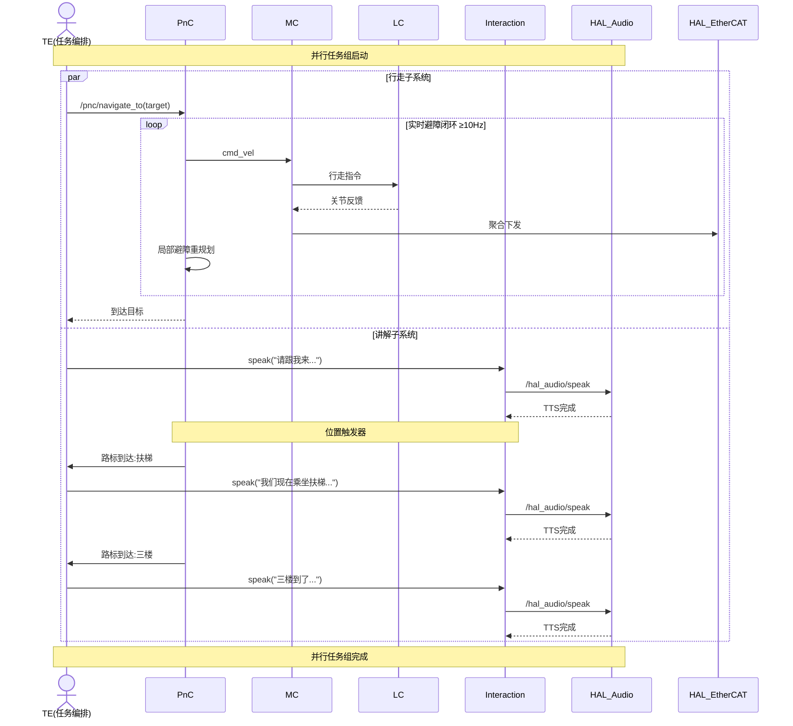
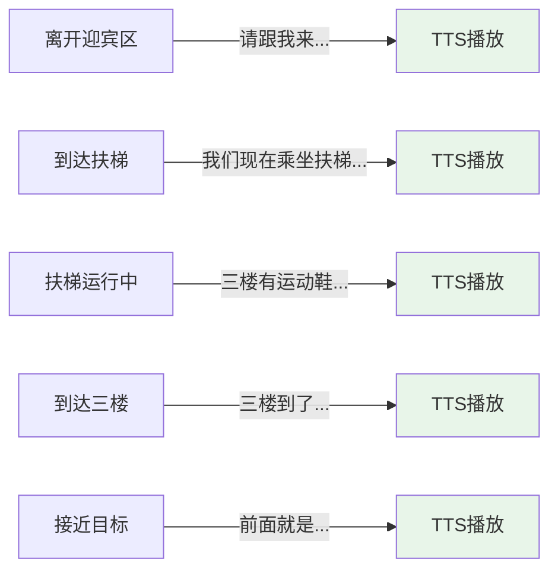
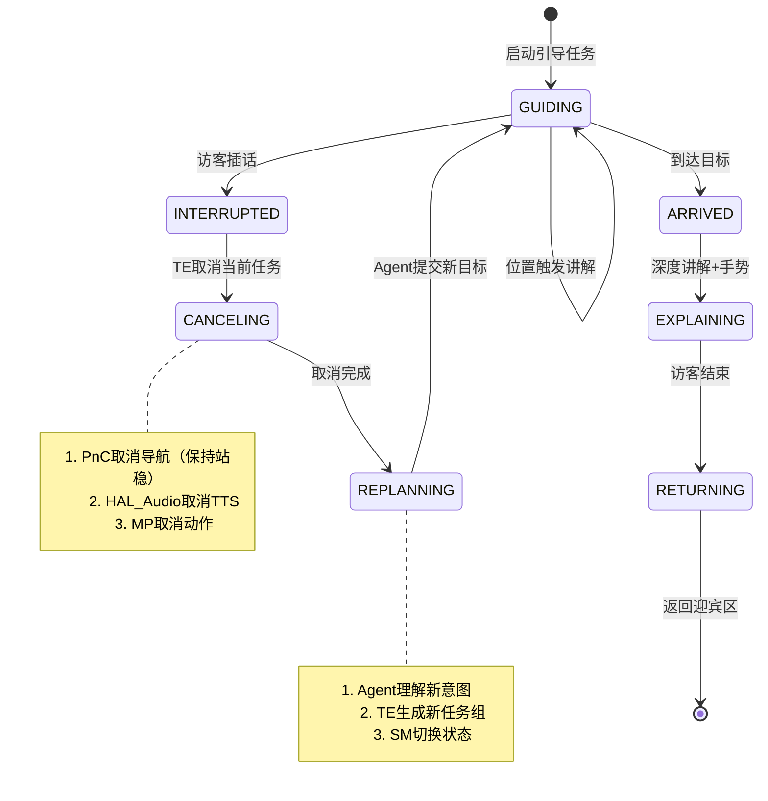
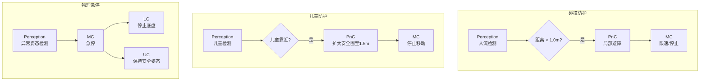

# UC-07: 商超导览接待

## 1. 场景概述

**业务背景**：商场、展厅、政务大厅等场所需要迎宾、引导、讲解服务。人形机器人可主动识别访客，语音问候，引导至目标区域，并沿途讲解。

**参考企业**：智元机器人远征系列在展厅/商超的接待场景

**价值主张**：
- 7×24 小时迎宾，无疲劳、无情绪波动
- 人脸识别记住 VIP 客户，个性化问候
- 多语言支持，服务国际访客
- 收集访客行为数据，优化空间布局

**典型任务流**：
1. 检测到访客进入迎宾区
2. 主动上前问候，询问需求
3. 理解访客意图（"我想买运动鞋"/"卫生间在哪"）
4. 引导访客至目标区域（行走+语音讲解）
5. 到达后介绍商品/设施
6. 询问是否还有其他需要
7. 返回迎宾区继续等待

---

## 2. 时序图



---

## 3. 模块协作矩阵

| 模块 | 本场景中的职责 | 协作对象 |
|------|--------------|----------|
| **Perception** | 人员检测（迎宾区监控）；人脸识别（VIP识别）；人流检测（导航避障） | Interaction, PnC, Agent, HAL_Sensor |
| **Interaction** | 语音对话管理；意图理解；多轮交互状态；TTS调度 | HAL_Audio, Agent, TE, MP |
| **HAL_Audio** | ASR 转写；TTS 合成播放；唤醒词检测 | Interaction |
| **Agent** | 访客意图推理；引导策略；讲解内容生成 | Interaction, TE, Perception, PnC |
| **TE** | 编排引导任务：问候→引导→讲解→返回 | Agent, SM, PnC, MP, DR |
| **SM** | 系统生命周期：授权运动系统上线（ACTIVE） | TE, PnC, MC, MP |
| **MC** | 运动模式切换：STAND ↔ WALKING | TE, PnC, LC |
| **PnC** | 商超人流环境导航；扶梯/电梯乘坐路径规划 | TE, MC, Perception, VSLAM |
| **MC** | 运动控制协调器：加载UC/LC插件，聚合关节指令，统一下发EtherCAT | UC, LC, PnC, MP, HAL_EtherCAT |
| **UC** | 上肢控制插件：执行社交动作（挥手、指向、鞠躬） | MC, MP |
| **LC** | 下肢控制插件：执行轮式底盘行走；人流中的安全距离保持 | MC, PnC, HAL_EtherCAT |
| **MP** | 社交动作播放（挥手、指向、鞠躬） | Interaction, MC, SM |
| **VSLAM** | 商超环境定位（重复纹理、光照变化） | PnC |
| **Gateway** | 云端 LLM 调用（讲解内容生成）；访客数据上报 | Agent, DR |
| **DR** | 记录访客交互日志（用于优化服务） | TE, Interaction |
| **HDS** | 交互响应延迟监控；TTS/ASR 故障检测 | HAL_Audio, Interaction |

---

## 4. 数据流向

### Topic 流向

| Topic | 发布者 | 订阅者 | 说明 |
|-------|--------|--------|------|
| `/perception/person_detected` | Perception | Interaction | 人员检测事件 |
| `/perception/face_recognition` | Perception | Agent | 人脸识别结果 |
| `/interaction/dialog_state` | Interaction | Agent | 对话状态 |
| `/agent/guide_plan` | Agent | TE | 引导计划 |
| `/sm/robot_state` | SM | PnC, MC, MP | 全局状态 |
| `/pnc/cmd_vel` | PnC | MC | 引导行走控制 |
| `/mp/motion_feedback` | MP | TE | 动作播放进度 |

### Service 调用

| Service | 调用方 | 提供方 | 说明 |
|---------|--------|--------|------|
| `/interaction/get_intent` | Agent | Interaction | 获取当前访客意图 |
| `/perception/recognize_face` | Agent | Perception | 请求人脸识别 |
| `/sm/request_transition` | TE | SM | 状态切换 |

### Action 调用

| Action | 调用方 | 提供方 | 说明 |
|--------|--------|--------|------|
| `/te/guide_visitor` | Agent | TE | 访客引导任务 |
| `/pnc/navigate_to` | TE | PnC | 区域导航 |
| `/mp/play_motion` | Interaction | MP | 社交动作 |

---

## 5. 安全约束

### E-Stop 路径

```
访客摔倒/碰撞 / 儿童触摸 → Perception → Interaction → MC → 急停
                                                    ↓
                                              LC 停止底盘移动，UC 保持安全姿态
```

- **人流安全**：PnC 保持 1.0m 人员安全距离；儿童检测时距离扩大至 1.5m
- **扶梯安全**：乘扶梯时 LC 切换至"扶手模式"，一手扶扶手，降低重心
- **语音停止**：访客说"别跟着我"时，Interaction 识别后通过 TE 暂停引导

### SM 状态校验

| 操作 | 要求状态 | 禁止状态 |
|------|----------|----------|
| 主动迎宾 | `ACTIVE` | `FAULT` |
| 引导行走 | `ACTIVE` | `FAULT` |
| 语音讲解 | `ACTIVE` | `FAULT` |
| 社交动作 | `ACTIVE` | `FAULT` |

---

## 6. 关键参数

| 参数 | 默认值 | 说明 |
|------|--------|------|
| `guide.human_distance` | 1.0 m | 引导时与访客距离 |
| `guide.child_distance` | 1.5 m | 儿童安全距离 |
| `guide.speak_interval` | 5.0 s | 讲解语音间隔（避免连续播报） |
| `guide.max_wait_time` | 30.0 s | 访客无响应后返回迎宾区超时 |
| `pnc.crowd_mode` | true | 人流密集模式（更保守避障） |
| `interaction.language` | "zh-CN" | 默认语言 |

---

## 7. 故障模式

### 场景：访客说话带有浓重方言，ASR 识别失败

1. **HAL_Audio** ASR 置信度低（<0.6），返回 `uncertain_text`
2. **Interaction** 检测到低置信度，不直接转发 Agent
3. **Interaction** TTS："抱歉，我没听清楚，您能再说一遍吗？"
4. 访客重复后仍失败 → Interaction 切换策略：
   - 提供选项："您是想去运动区、服装区还是餐饮区？"
   - 访客只需说关键词（"运动"）即可识别
5. 若仍无法识别，Interaction 请求 Gateway 调用云端大模型 ASR（更强方言能力）

### 场景：引导过程中访客改变主意

1. **Visitor**："等等，我想先去买杯咖啡"
2. **HAL_Audio** → Interaction → Agent 识别到新意图 `{intent: GUIDE, target: 咖啡厅}`
3. **Agent** 向 TE 提交新引导目标
4. **TE** 评估当前状态：若已在导航中，请求 PnC 重新规划路径
5. **PnC** 动态更新目标点至咖啡厅
6. **Interaction** TTS："好的，我们改去咖啡厅"


---

## 8. 边走边讲解功能深度分析

### 8.1 核心难点概述

"边走边讲解"不是单一模块的能力展示，而是**多模态并行任务的时序编排**。三个核心难点：

1. **并行执行**：行走（PnC/LC）与语音（HAL_Audio）必须并发，TE不能按串行队列调度
2. **时空同步**：讲解内容必须与当前位置匹配，"走到哪讲到哪"
3. **中断恢复**：访客随时可能插话，系统需优雅取消当前任务并重新规划

---

### 8.2 模块协作关系



---

### 8.3 TE任务编排：串行 vs 并行

传统串行调度的问题：等导航完成再讲解，变成"走到再说"。TE必须支持**并行任务组**。



**TE的`ParallelTaskGroup`语义**：
- 任务组内子任务并发执行
- 每个子任务独立报告完成/失败
- 任务组完成条件：`ALL_COMPLETED`（全部完成）或 `LEADER_COMPLETED`（主任务完成）

---

### 8.4 边 walk 边 talk 并行执行时序



---

### 8.5 位置触发讲解机制

讲解内容不是按时间触发，而是按**位置节点**触发。PnC实时汇报路标到达，TE查询映射表触发对应TTS。



**位置触发器配置示例**：

| 路标ID | 触发条件 | 讲解内容 | 优先级 |
|--------|---------|---------|--------|
| `gate_out` | 离开迎宾区5m | "请跟我来，运动鞋区在三楼" | high |
| `escalator_entry` | 到达扶梯入口 | "我们现在乘坐扶梯，请扶好" | high |
| `escalator_ride` | 扶梯运行中 | "三楼有运动鞋、篮球鞋..." | normal |
| `floor_3_arrive` | 到达三楼出口 | "三楼到了，运动区在前方50米" | high |
| `target_approach` | 距离目标10m | "前面就是运动鞋区..." | high |

---

### 8.6 中断-恢复机制

访客插话时，系统需优雅地**取消当前任务**并**重新规划**，而非粗暴终止。



**TE的Cancel语义要求**：
- `/pnc/navigate_to` Action支持`cancel_goal`，停止导航但保持底盘站稳
- `/hal_audio/speak` Action支持`cancel_goal`，停止当前TTS
- `/mp/play_motion` Action支持`cancel_goal`，停止动作并恢复安全姿态
- 取消后MC运动模式保持当前静止姿态，新任务启动后由TE调用MC切换运动模式

---

### 8.7 关键时序约束

| 环节 | 延迟要求 | 负责模块 | 超限风险 |
|------|---------|---------|---------|
| 人员检测 → 主动问候 | ≤ 2s | Perception + Interaction | 误检导致频繁问候 |
| ASR转写 → 意图理解 | ≤ 500ms | HAL_Audio + Interaction | 方言/噪音识别失败 |
| 意图确认 → TE任务启动 | ≤ 200ms | Agent + TE | Agent推理过慢 |
| 导航指令 → 底盘响应 | ≤ 50ms | PnC + MC + LC | 实时性不足导致碰撞 |
| 位置触发 → TTS播放 | ≤ 300ms | PnC + TE + HAL_Audio | 位置汇报延迟导致"讲晚了" |
| TTS播放 → 手势执行 | ≤ 200ms | HAL_Audio + MP + UC | 动作与语音不同步 |

---

### 8.8 安全约束防护链



---

### 8.9 实现检查清单

| 检查项 | 负责模块 | 验收标准 |
|--------|---------|---------|
| TE支持并行任务组 | TE | 行走+讲解并发执行，TTS不等待导航完成 |
| PnC位置触发上报 | PnC | 每到达一个路标，向TE发送位置事件 |
| HAL_Audio支持Cancel | HAL_Audio | `/hal_audio/speak` Action支持cancel_goal |
| PnC支持Cancel | PnC | `/pnc/navigate_to` Action支持cancel_goal |
| MP支持Cancel | MP | `/mp/play_motion` Action支持cancel_goal |
| SM状态校验 | SM | `ACTIVE`状态下允许运动，社交动作和运动模式由MC内部校验 |
| 讲解-手势同步 | Interaction + MP | TTS播放指向语句时，UC在200ms内执行指向动作 |
| 人流安全距离 | PnC | crowd_mode=true时，保持1.0m安全距离 |
| 儿童检测 | Perception | 检测到儿童时自动扩大安全圈至1.5m |
| 云端LLM降级 | Agent + Gateway | 弱网时自动切换本地模板讲解 |
