# UC-07: 商超导览接待

## 1. 场景概述

**业务背景**：商场、展厅、政务大厅等场所需要迎宾、引导、讲解服务。人形机器人可主动识别访客，语音问候，引导至目标区域，并沿途讲解。

**参考企业**：智元机器人远征系列在展厅/商超的接待场景

**价值主张**：
- 7×24 小时迎宾，无疲劳、无情绪波动
- 人脸识别记住 VIP 客户，个性化问候
- 多语言支持，服务国际访客
- 收集访客行为数据，优化空间布局

**典型任务流**：
1. 检测到访客进入迎宾区
2. 主动上前问候，询问需求
3. 理解访客意图（"我想买运动鞋"/"卫生间在哪"）
4. 引导访客至目标区域（行走+语音讲解）
5. 到达后介绍商品/设施
6. 询问是否还有其他需要
7. 返回迎宾区继续等待

---

## 2. 时序图

```mermaid
sequenceDiagram
    actor Visitor as 访客
    participant Perception as Perception
    participant Interaction as Interaction
    participant HAL_Audio
    participant Agent as Agent
    participant TE as Task Engine
    participant SM as State Manager
    participant PnC as PnC
    participant MC as Motion Control
    participant UC as Upper Body Control
    participant LC as Lower Body Control
    participant MP as Motion Player
    participant Gateway
    participant DR as Data Recorder

    Perception->>Perception: 检测到人员进入迎宾区
    Perception->>Interaction: 上报人员检测事件
    Interaction->>Interaction: 激活交互状态
    Interaction->>HAL_Audio: TTS:"您好，欢迎光临，请问有什么可以帮您？"

    Visitor->>HAL_Audio: "我想买运动鞋"
    HAL_Audio->>Interaction: ASR文本
    Interaction->>Agent: 结构化意图{intent: GUIDE, target: 运动鞋区}

    Agent->>Perception: 请求人脸识别(VIP判断)
    Perception-->>Agent: 普通访客
    Agent->>TE: 提交引导任务
    TE->>SM: 请求 ACTIVE_STAND→ACTIVE_WALKING
    SM-->>TE: 确认

    Interaction->>HAL_Audio: TTS:"请跟我来，运动鞋区在三楼"
    TE->>PnC: 导航至运动鞋区
    PnC->>MC: 行走控制(人流避让)
    MC->>LC: 转发行走指令
    LC-->>MC: 下肢关节指令
    MC->>HAL_EtherCAT: 聚合关节指令下发

    loop 引导途中
        Perception->>PnC: 实时人流/障碍物检测
        PnC->>MC: 动态避障
        MC->>LC: 转发行走指令
        LC->>LC: 轮式底盘移动+人流避让
        LC-->>MC: 下肢关节指令
        MC->>HAL_EtherCAT: 聚合关节指令下发
        Interaction->>HAL_Audio: TTS:"我们现在乘坐扶梯..."
    end

    PnC-->>TE: 到达运动鞋区
    TE->>SM: 请求 ACTIVE_WALKING→ACTIVE_STAND
    Agent->>Perception: 请求商品区域识别
    Perception-->>Agent: 区域信息

    Interaction->>HAL_Audio: TTS:"这就是运动鞋区， Nike和阿迪达斯在前方"
    Agent->>Interaction: 生成讲解内容
    Interaction->>HAL_Audio: TTS 讲解
    MP->>MC: 播放手势动作(指向商品)
    MC->>UC: 转发行上肢指令
    UC->>UC: IK+轨迹规划
    UC-->>MC: 上肢关节指令
    MC->>HAL_EtherCAT: 聚合关节指令下发

    Visitor->>HAL_Audio: "谢谢，我自己看看"
    HAL_Audio->>Interaction: ASR文本
    Interaction->>Agent: 意图{intent: END}
    Agent->>TE: 结束引导

    TE->>PnC: 返回迎宾区
    PnC->>MC: 行走
    MC->>LC: 转发行走指令
    LC-->>MC: 下肢关节指令
    MC->>HAL_EtherCAT: 聚合关节指令下发
    PnC-->>TE: 到达迎宾区
    DR->>DR: 记录访客交互数据
```



---

## 3. 模块协作矩阵

| 模块 | 本场景中的职责 | 协作对象 |
|------|--------------|----------|
| **Perception** | 人员检测（迎宾区监控）；人脸识别（VIP识别）；人流检测（导航避障） | Interaction, PnC, Agent, HAL_Sensor |
| **Interaction** | 语音对话管理；意图理解；多轮交互状态；TTS调度 | HAL_Audio, Agent, TE, MP |
| **HAL_Audio** | ASR 转写；TTS 合成播放；唤醒词检测 | Interaction |
| **Agent** | 访客意图推理；引导策略；讲解内容生成 | Interaction, TE, Perception, PnC |
| **TE** | 编排引导任务：问候→引导→讲解→返回 | Agent, SM, PnC, MP, DR |
| **SM** | 状态切换：`ACTIVE_STAND`（交互）↔ `ACTIVE_WALKING`（引导） | TE, PnC, MC, MP |
| **PnC** | 商超人流环境导航；扶梯/电梯乘坐路径规划 | TE, MC, Perception, VSLAM |
| **MC** | 运动控制协调器：加载UC/LC插件，聚合关节指令，统一下发EtherCAT | UC, LC, PnC, MP, HAL_EtherCAT |
| **UC** | 上肢控制插件：执行社交动作（挥手、指向、鞠躬） | MC, MP |
| **LC** | 下肢控制插件：执行轮式底盘行走；人流中的安全距离保持 | MC, PnC, HAL_EtherCAT |
| **MP** | 社交动作播放（挥手、指向、鞠躬） | Interaction, MC, SM |
| **VSLAM** | 商超环境定位（重复纹理、光照变化） | PnC |
| **Gateway** | 云端 LLM 调用（讲解内容生成）；访客数据上报 | Agent, DR |
| **DR** | 记录访客交互日志（用于优化服务） | TE, Interaction |
| **HDS** | 交互响应延迟监控；TTS/ASR 故障检测 | HAL_Audio, Interaction |

---

## 4. 数据流向

### Topic 流向

| Topic | 发布者 | 订阅者 | 说明 |
|-------|--------|--------|------|
| `/perception/person_detected` | Perception | Interaction | 人员检测事件 |
| `/perception/face_recognition` | Perception | Agent | 人脸识别结果 |
| `/interaction/dialog_state` | Interaction | Agent | 对话状态 |
| `/agent/guide_plan` | Agent | TE | 引导计划 |
| `/sm/robot_state` | SM | PnC, MC, MP | 全局状态 |
| `/pnc/cmd_vel` | PnC | MC | 引导行走控制 |
| `/mp/motion_feedback` | MP | TE | 动作播放进度 |

### Service 调用

| Service | 调用方 | 提供方 | 说明 |
|---------|--------|--------|------|
| `/interaction/get_intent` | Agent | Interaction | 获取当前访客意图 |
| `/perception/recognize_face` | Agent | Perception | 请求人脸识别 |
| `/sm/request_transition` | TE | SM | 状态切换 |

### Action 调用

| Action | 调用方 | 提供方 | 说明 |
|--------|--------|--------|------|
| `/te/guide_visitor` | Agent | TE | 访客引导任务 |
| `/pnc/navigate_to` | TE | PnC | 区域导航 |
| `/mp/play_motion` | Interaction | MP | 社交动作 |

---

## 5. 安全约束

### E-Stop 路径

```
访客摔倒/碰撞 / 儿童触摸 → Perception → Interaction → SM → ACTIVE_E_STOP
                                                    ↓
                                              LC 停止底盘移动，UC 保持安全姿态
```

- **人流安全**：PnC 保持 1.0m 人员安全距离；儿童检测时距离扩大至 1.5m
- **扶梯安全**：乘扶梯时 LC 切换至"扶手模式"，一手扶扶手，降低重心
- **语音紧急停止**：访客说"别跟着我"时，Interaction 识别后暂停引导

### SM 状态校验

| 操作 | 要求状态 | 禁止状态 |
|------|----------|----------|
| 主动迎宾 | `ACTIVE_STAND` | `ACTIVE_E_STOP` |
| 引导行走 | `ACTIVE_WALKING` | `FAULT`, `ACTIVE_E_STOP` |
| 语音讲解 | `ACTIVE_STAND` 或 `ACTIVE_WALKING` | `ACTIVE_E_STOP` |
| 社交动作 | `ACTIVE_STAND` | `FAULT`, `ACTIVE_E_STOP` |

---

## 6. 关键参数

| 参数 | 默认值 | 说明 |
|------|--------|------|
| `guide.human_distance` | 1.0 m | 引导时与访客距离 |
| `guide.child_distance` | 1.5 m | 儿童安全距离 |
| `guide.speak_interval` | 5.0 s | 讲解语音间隔（避免连续播报） |
| `guide.max_wait_time` | 30.0 s | 访客无响应后返回迎宾区超时 |
| `pnc.crowd_mode` | true | 人流密集模式（更保守避障） |
| `interaction.language` | "zh-CN" | 默认语言 |

---

## 7. 故障模式

### 场景：访客说话带有浓重方言，ASR 识别失败

1. **HAL_Audio** ASR 置信度低（<0.6），返回 `uncertain_text`
2. **Interaction** 检测到低置信度，不直接转发 Agent
3. **Interaction** TTS："抱歉，我没听清楚，您能再说一遍吗？"
4. 访客重复后仍失败 → Interaction 切换策略：
   - 提供选项："您是想去运动区、服装区还是餐饮区？"
   - 访客只需说关键词（"运动"）即可识别
5. 若仍无法识别，Interaction 请求 Gateway 调用云端大模型 ASR（更强方言能力）

### 场景：引导过程中访客改变主意

1. **Visitor**："等等，我想先去买杯咖啡"
2. **HAL_Audio** → Interaction → Agent 识别到新意图 `{intent: GUIDE, target: 咖啡厅}`
3. **Agent** 向 TE 提交新引导目标
4. **TE** 评估当前状态：若已在导航中，请求 PnC 重新规划路径
5. **PnC** 动态更新目标点至咖啡厅
6. **Interaction** TTS："好的，我们改去咖啡厅"
