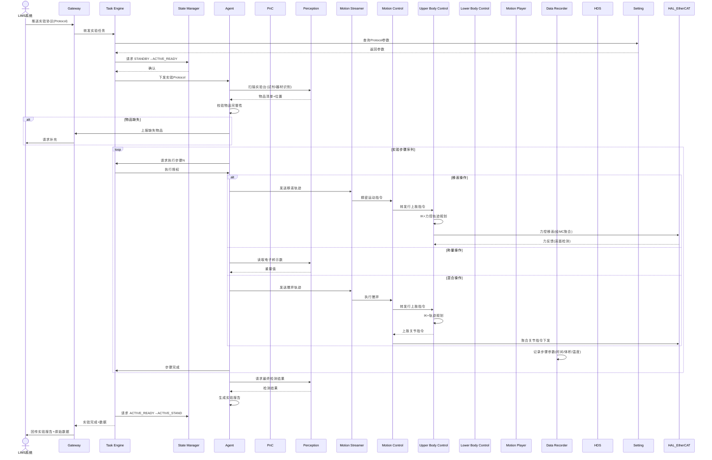

# UC-08: 实验室自动化

## 1. 场景概述

**业务背景**：生物、化学、材料等实验室存在大量重复性操作（移液、称量、混合、培养皿转移），实验员长时间操作易疲劳出错。轮式双臂人形机器人可在实验台间执行标准化实验流程。

**参考企业**：银河通用轮式双臂机器人在实验室场景

**价值主张**：
- 7×24 小时执行实验，加速研发迭代
- 消除人为操作误差，提升实验可重复性
- 处理有毒/放射性试剂，保护实验员安全
- 自动记录实验数据，直接对接 LIMS

**典型任务流**：
1. 接收实验协议（Protocol）from LIMS
2. 根据 Protocol 准备试剂和器材
3. 执行标准化操作序列（移液→混合→加热→检测）
4. 每个步骤记录时间、温度、体积等参数
5. 实验完成，清洁台面，数据回传 LIMS

---

## 2. 时序图



---

## 3. 模块协作矩阵

| 模块 | 本场景中的职责 | 协作对象 |
|------|--------------|----------|
| **Gateway** | 接收 LIMS Protocol；回传实验数据与报告 | TE, LIMS, HDS |
| **TE** | 管理实验任务；按 Protocol 顺序调度各步骤 | Gateway, SM, Agent, PnC, DR |
| **SM** | 状态管理：`ACTIVE_READY`（操作准备）↔ `ACTIVE_MOTION`（执行） | TE, MC, MS, HDS |
| **Agent** | 解析 Protocol；实验策略决策；误差补偿（如液面检测失败重试） | TE, Perception, MS, Setting |
| **PnC** | 实验台间短距移动（轮式底盘） | TE, MC, Perception, VSLAM |
| **Perception** | 试剂/器材识别与定位；仪器读数识别（秤、温度计、pH计）；液面检测 | Agent, HAL_Sensor, TF |
| **MS** | 精密操作轨迹整形（移液、搅拌、开盖），亚毫米级精度 | Agent, MC |
| **MC** | 运动控制协调器：加载UC/LC插件，聚合关节指令，统一下发EtherCAT | UC, LC, PnC, MS, HAL_EtherCAT |
| **UC** | 上肢控制插件：执行双臂精密力控（移液、搅拌）；碰撞检测；末端力控 | MC, MS, HAL_EtherCAT, Perception |
| **LC** | 下肢控制插件：执行实验台间轮式底盘短距移动 | MC, PnC, HAL_EtherCAT |
| **MP** | 播放标准化操作动作（如固定取试管姿势） | TE, MC, SM |
| **DR** | 实验全过程数据记录（时间戳、参数、视频），符合 GLP 规范 | TE, Agent, Perception |
| **Setting** | 存储实验 Protocol 参数（体积、温度、时间、顺序） | TE, Agent, MS |
| **HDS** | 监控实验偏差（体积误差、温度漂移）；污染/泄漏检测 | Perception, MC, HAL_EtherCAT |
| **TF** | 工具坐标系管理（移液器、夹具、试管架） | Perception, Agent, MC |
| **HAL_EtherCAT** | 高精度电机控制；力传感器数据采集 | MC |

---

## 4. 数据流向

### Topic 流向

| Topic | 发布者 | 订阅者 | 说明 |
|-------|--------|--------|------|
| `/sm/robot_state` | SM | MC, MS, PnC | 全局状态 |
| `/ms/precision_stream` | MS | MC | 精密操作指令流 |
| `/mc/force_feedback` | HAL_EtherCAT | MC | 力传感器反馈 |
| `/perception/instrument_reading` | Perception | Agent | 仪器读数 |
| `/perception/liquid_level` | Perception | Agent | 液面检测结果 |
| `/dr/experiment_log` | DR | Gateway | 实验日志 |
| `/hds/safety_alert` | HDS | Gateway | 安全告警 |

### Service 调用

| Service | 调用方 | 提供方 | 说明 |
|---------|--------|--------|------|
| `/setting/get_protocol` | TE | Setting | 读取实验 Protocol |
| `/perception/read_instrument` | Agent | Perception | 读取仪器示数 |
| `/perception/detect_liquid` | Agent | Perception | 液面检测 |
| `/sm/is_motion_allowed` | MS | SM | 操作前校验 |

### Action 调用

| Action | 调用方 | 提供方 | 说明 |
|--------|--------|--------|------|
| `/te/execute_protocol` | Gateway | TE | 实验 Protocol 执行 |
| `/ms/precision_op` | Agent | MS | 精密操作（移液等） |
| `/pnc/navigate_to` | TE | PnC | 实验台间移动 |

---

## 5. 安全约束

### E-Stop 路径

```
化学泄漏传感器 / 生物安全柜气流异常 → HAL_Sensor → HDS → SM → ACTIVE_E_STOP
                                                    ↓
                                              UC 停止双臂运动，保持当前姿态
                                                    ↓
                                              等待生物安全柜净化
```

- **生物安全**：BSL-2 及以上实验室中，机器人操作必须在生物安全柜内
- **化学安全**：挥发性/腐蚀性试剂操作时，HDS 监控环境传感器，超标立即 E-Stop
- **交叉污染**：不同 Protocol 间，Agent 强制插入"清洁步骤"（换吸头、擦拭）

### SM 状态校验

| 操作 | 要求状态 | 禁止状态 |
|------|----------|----------|
| 精密移液 | `ACTIVE_MOTION` 或 `ACTIVE_READY` | `FAULT`, `ACTIVE_E_STOP` |
| 台间移动 | `ACTIVE_WALKING` | `FAULT`, `ACTIVE_E_STOP` |
| 仪器读数 | `ACTIVE_STAND` 或 `ACTIVE_MOTION` | `ACTIVE_E_STOP` |

### 合规性约束

- DR 记录的数据必须包含时间戳、操作员（机器人ID）、环境参数，满足 FDA 21 CFR Part 11
- 任何步骤偏差（体积误差 >5%）必须记录并由 Agent 决策是否继续
- Protocol 修改需通过 Gateway 由 LIMS 管理员审批，本地不可擅自更改

---

## 6. 关键参数

| 参数 | 默认值 | 说明 |
|------|--------|------|
| `lab.pipette_accuracy` | 1% | 移液精度要求 |
| `lab.force_threshold` | 2 N | 移液器触液面力阈值 |
| `lab.motion_speed` | 0.01 m/s | 精密操作速度 |
| `lab.cross_contamination_check` | true | 交叉污染检测开关 |
| `hds.chemical_ppm_limit` | 10 ppm | 化学泄漏报警阈值 |
| `dr.glp_compliance` | true | GLP 合规记录模式 |

---

## 7. 故障模式

### 场景：移液器吸头堵塞

1. **UC** 执行移液，力反馈显示吸取阻力异常大（>阈值 2N）
2. **Agent** 检测到异常，判定为吸头堵塞
3. **Agent** 向 TE 报告 `PIPETTE_BLOCKED`
4. **TE** 暂停 Protocol，请求 Agent 执行恢复流程：
   - 缓慢排出液体，尝试疏通
   - 若失败，丢弃当前吸头，更换新吸头
5. **Perception** 视觉确认吸头更换成功
6. **TE** 恢复 Protocol，从当前步骤重试
7. **DR** 记录故障事件与恢复动作

### 场景：试剂瓶标签模糊导致识别错误

1. **Perception** OCR 识别试剂标签，置信度 0.55（<阈值 0.85）
2. **Agent** 不直接使用该结果，请求二次确认：
   - 调整相机角度重新拍摄
   - 读取试剂瓶 RFID 标签（如有）
3. 若 RFID 与 OCR 不一致 → Agent 向 TE 报告 `REAGENT_MISMATCH`
4. **TE** 暂停实验，通过 Gateway 向 LIMS 请求人工确认
5. 人工确认后，TE 恢复实验
