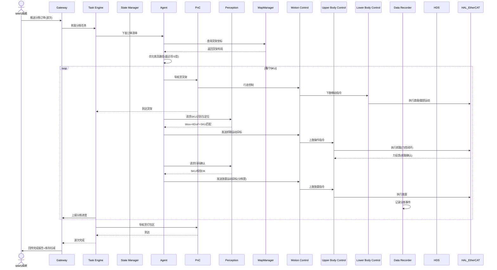

# UC-09: 仓储物流分拣

## 1. 场景概述

**业务背景**：电商仓储、快递分拣中心面临订单波动大、人力成本高、夜间作业等挑战。人形机器人（足式或轮式双臂）可在货架与打包台之间搬运货物，按订单分拣 SKU，辅助码垛。

**参考企业**：银河通用（轮式双臂仓储场景）、智元远征（分拣搬运）

**价值主张**：
- 大促期间快速扩容，缓解人力短缺
- 7×24 小时不间断分拣，提升仓内利用率
- 多 SKU 自适应识别，无需预先录入
- 与 WMS/TMS 系统实时对接，库存准确

**典型任务流**：
1. 接收分拣任务（订单 + 货架位置 + 数量）
2. 导航至源货架
3. 视觉识别目标 SKU（在相似包装中区分）
4. 双臂抓取（一手稳定货架，一手取货）
5. 放入分拣筐/托盘
6. 扫码确认 SKU
7. 重复直到订单完成，送至打包区

---

## 2. 时序图



---

## 3. 模块协作矩阵

| 模块 | 本场景中的职责 | 协作对象 |
|------|--------------|----------|
| **Gateway** | 接收 WMS 波次任务；回传分拣结果与库存状态 | TE, WMS, HDS |
| **TE** | 管理分拣波次；调度"移动→识别→抓取→放置→确认"循环 | Gateway, SM, Agent, PnC, DR |
| **SM** | 状态切换：`ACTIVE_WALKING`（货架间）↔ `ACTIVE_MOTION`（抓取） | TE, PnC, MC |
| **Agent** | 分拣路径优化；SKU 识别策略；抓取姿态规划 | TE, Perception, MapManager, MC |
| **PnC** | 仓储大规模导航（高货架、窄通道、叉车共行） | TE, MC, Perception, VSLAM, MapManager |
| **Perception** | SKU 商品识别（在相似包装中区分目标）；扫码/RFID | Agent, HAL_Sensor, TF |
| **MapManager** | 仓储货架地图；动态更新货架占用状态 | Agent, PnC, VSLAM |
| **MC** | 运动控制协调器：加载 UC/LC 插件，聚合关节指令，统一下发 EtherCAT | PnC, UC, LC, HAL_EtherCAT |
| **UC** | 上肢控制插件：执行双臂操作、力控、夹爪控制 | MC, HAL_EtherCAT |
| **LC** | 下肢控制插件：执行底盘移动/足式行走 | MC, HAL_EtherCAT |
| **DR** | 分拣过程数据记录（用于复核与优化） | TE, Agent, Perception |
| **HDS** | 分拣准确率监控；抓取失败率统计 | Perception, MC, TE |
| **VSLAM** | 仓储环境视觉定位（高货架、弱光照挑战） | PnC, Perception |
| **HAL_EtherCAT** | 电机驱动；力传感器数据采集 | UC, LC, MC |

---

## 4. 数据流向

### Topic 流向

| Topic | 发布者 | 订阅者 | 说明 |
|-------|--------|--------|------|
| `/sm/robot_state` | SM | PnC, MC | 全局状态 |
| `/pnc/cmd_vel` | PnC | MC | 行走控制 |
| `/perception/sku_detection` | Perception | Agent | SKU 识别结果 |
| `/perception/barcode_scan` | Perception | Agent | 扫码结果 |
| `/dr/sort_event` | DR | Gateway | 分拣事件记录 |
| `/hds/health_status` | HDS | Gateway | 健康状态 |

### Service 调用

| Service | 调用方 | 提供方 | 说明 |
|---------|--------|--------|------|
| `/map_manager/query_shelf` | Agent | MapManager | 查询货架坐标与占用 |
| `/perception/recognize_sku` | Agent | Perception | SKU 商品识别 |
| `/sm/request_transition` | TE | SM | 状态切换（行走↔抓取） |

### Action 调用

| Action | 调用方 | 提供方 | 说明 |
|--------|--------|--------|------|
| `/te/execute_sort_wave` | Gateway | TE | 分拣波次执行 |
| `/pnc/navigate_to` | TE | PnC | 货架间导航 |

---

## 5. 安全约束

### E-Stop 路径

```
叉车靠近(视觉/雷达检测) / 人员进入作业区 → Perception → SM → ACTIVE_E_STOP
                                                  ↓
                                            MC 立即停止
                                                  ↓
                                           等待安全确认
```

- **人车共行安全**：仓储环境中叉车与机器人共行，PnC 必须保持 2.0m 以上叉车安全距离
- **高货架安全**：抓取高处货物时，UC 稳定上肢重心，MC 协调全身平衡，防止倾倒
- **夜间作业**：弱光环境下 VSLAM + Lidar-SLAM 主导定位，视觉识别依赖补光

### SM 状态校验

| 操作 | 要求状态 | 禁止状态 |
|------|----------|----------|
| 货架间行走 | `ACTIVE_WALKING` | `FAULT`, `ACTIVE_E_STOP` |
| 商品抓取 | `ACTIVE_MOTION` | 全部非运动状态 |
| 扫码确认 | `ACTIVE_STAND` 或 `ACTIVE_MOTION` | `ACTIVE_E_STOP` |

---

## 6. 关键参数

| 参数 | 默认值 | 说明 |
|------|--------|------|
| `warehouse.max_speed` | 1.0 m/s | 仓内最大行走速度 |
| `warehouse.forklift_distance` | 2.0 m | 叉车安全距离 |
| `warehouse.grasp_retry` | 2 | 抓取失败重试次数 |
| `warehouse.max_payload` | 5.0 kg | 单件最大抓取重量 |
| `perception.sku_confidence` | 0.88 | SKU 识别最低置信度 |
| `pnc.aisle_width` | 1.5 m | 通道最小宽度 |

---

## 7. 故障模式

### 场景：目标 SKU 被其他分拣员拿走后识别不到

1. **Agent** 请求 Perception 识别目标 SKU，返回 `not_found`
2. **Agent** 扩大搜索范围（相邻货位、上下层）
3. 仍找不到 → Agent 向 TE 报告 `SKU_NOT_FOUND`
4. **TE** 通过 Gateway 向 WMS 上报缺货
5. WMS 确认库存后，可能：
   - 从其他货架调拨：TE 更新目标位置，继续执行
   - 确认缺货：TE 标记该 SKU 缺货，继续下一 SKU
6. 波次完成后，TE 报告 `COMPLETED_WITH_EXCEPTION`

### 场景：分拣筐已满

1. **Agent** 检测到分拣筐剩余空间不足（通过 Perception 视觉估计）
2. **Agent** 向 TE 报告 `BIN_FULL`
3. **TE** 暂停当前波次，请求 PnC 导航至空筐区
4. 更换空筐后，TE 恢复波次执行
