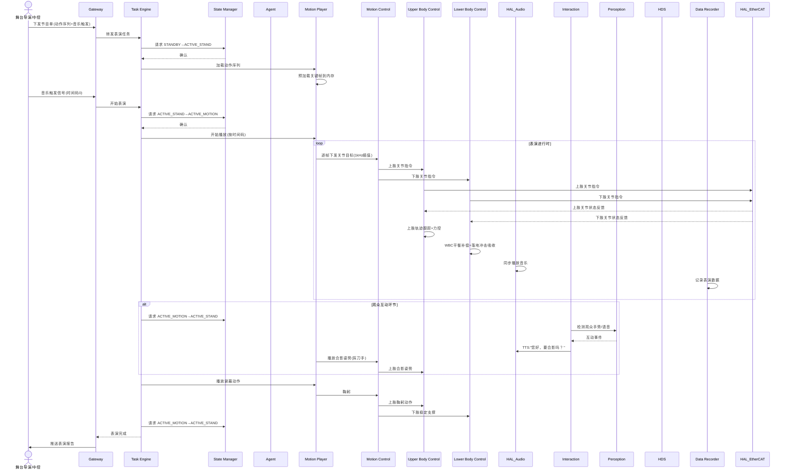

# UC-10: 娱乐表演展示

## 1. 场景概述

**业务背景**：人形机器人在展会、发布会、春晚等场合进行舞蹈、武术、互动表演，展示机器人运动能力，吸引公众关注。这是人形机器人最"出圈"的应用场景之一。

**参考企业**：宇树科技 G1/H1（舞蹈/武术/后空翻表演）、特斯拉 Optimus 展示

**价值主张**：
- 展示机器人运动控制技术的前沿水平
- 吸引眼球，提升品牌知名度
- 验证机器人在高动态、高协调运动下的可靠性

**典型任务流**：
1. 接收表演节目单（动作序列 + 音乐时间码）
2. 上台就位，等待音乐触发
3. 按时间码逐帧播放动作（舞蹈/武术/特技）
4. 音乐同步：动作与节拍对齐
5. 交互环节：与观众握手、合影、简单对话
6. 表演结束，谢幕退场

---

## 2. 时序图



---

## 3. 模块协作矩阵

| 模块 | 本场景中的职责 | 协作对象 |
|------|--------------|----------|
| **Gateway** | 接收导演指令；接收音乐触发信号；上报表演状态 | TE, Director, HDS |
| **TE** | 管理表演节目单；编排动作播放与交互环节 | Gateway, SM, MP, Agent, Interaction |
| **SM** | 状态切换：`ACTIVE_STAND`（候场）→`ACTIVE_MOTION`（表演） | TE, MP, MC, HDS |
| **MP** | 核心模块：按时间码逐帧播放预录动作（舞蹈/武术） | TE, MC, SM, Setting |
| **MC** | 运动控制协调器：加载 UC/LC 插件，聚合关节指令，统一下发 EtherCAT | MP, UC, LC, HAL_EtherCAT, SM |
| **UC** | 上肢控制插件：执行手臂舞蹈动作、力控、末端姿态 | MC, HAL_EtherCAT |
| **LC** | 下肢控制插件：执行高动态步态/WBC平衡/落地冲击吸收 | MC, HAL_EtherCAT |
| **Agent** | 观众互动策略（何时互动、说什么、做什么动作） | TE, Interaction, Perception |
| **Interaction** | 观众语音/手势交互；TTS 播报 | HAL_Audio, Agent, Perception, MP |
| **HAL_Audio** | 音乐播放；TTS 播报 | Interaction, TE |
| **Perception** | 观众检测（合影定位）；手势识别 | Interaction, Agent |
| **HDS** | 监控表演中关节温度、电流、振动；过热预警 | MC, HAL_EtherCAT, SM |
| **DR** | 记录表演全过程数据（用于动作优化与故障复盘） | TE, MP, MC |
| **Setting** | 存储动作库路径、音乐文件路径、表演参数 | MP, TE, HAL_Audio |
| **HAL_EtherCAT** | 高频率关节驱动（1kHz）；状态回传 | MC |

---

## 4. 数据流向

### Topic 流向

| Topic | 发布者 | 订阅者 | 说明 |
|-------|--------|--------|------|
| `/sm/robot_state` | SM | MP, MC | 全局状态 |
| `/mp/motion_frame` | MP | MC | 动作帧（关节目标+时间戳） |
| `/mc/joint_cmd` | MC | HAL_EtherCAT | 关节指令 |
| `/hal_audio/music_sync` | HAL_Audio | MP | 音乐时间码同步 |
| `/interaction/crowd_event` | Interaction | Agent | 观众互动事件 |
| `/hds/joint_health` | HDS | Gateway | 关节健康状态 |

### Service 调用

| Service | 调用方 | 提供方 | 说明 |
|---------|--------|--------|------|
| `/mp/load_motion` | TE | MP | 加载动作序列 |
| `/setting/get_motion_params` | MP | Setting | 读取动作参数 |
| `/sm/is_motion_allowed` | MP | SM | 播放前校验 |

### Action 调用

| Action | 调用方 | 提供方 | 说明 |
|--------|--------|--------|------|
| `/te/execute_show` | Gateway | TE | 表演节目执行 |
| `/mp/play_motion` | TE | MP | 动作播放（含进度反馈） |

---

## 5. 安全约束

### E-Stop 路径

```
舞台安全员紧急按钮 / 观众闯入舞台 → 外部IO → SM → ACTIVE_E_STOP
                                           ↓
                                     MC 立即阻尼制动
                                           ↓
                                    MP 停止播放，保持当前姿态
```

- **舞台安全**：表演区域设置安全围栏+激光扫描，人员闯入立即 E-Stop
- **高动态动作安全**：后空翻、跳跃等特技动作前，MC 协调 UC/LC 插件自检关节状态（温度、电流），异常则跳过该动作
- **音乐同步容错**：音乐播放延迟 >50ms 时，MP 按本地时间码继续，不同步则暂停等待

### SM 状态校验

| 操作 | 要求状态 | 禁止状态 |
|------|----------|----------|
| 动作播放 | `ACTIVE_MOTION` | 全部非运动状态 |
| 观众互动 | `ACTIVE_STAND` | `FAULT`, `ACTIVE_E_STOP` |
| 音乐播放 | `ACTIVE_MOTION` 或 `ACTIVE_STAND` | `ACTIVE_E_STOP` |
| 谢幕退场 | `ACTIVE_WALKING` | `FAULT`, `ACTIVE_E_STOP` |

### 表演可靠性

- 关键动作（跳跃、后空翻）前，MC 协调 UC/LC 插件执行关节自检，温度 >70°C 或电流 >额定 80% 时跳过该动作
- MP 维护动作"安全降级版本"：高动态动作可降级为低动态替代版本
- 表演前 TE 请求 HDS 执行全系统健康检查，任何模块 `WARNING` 级以上故障禁止开始表演

---

## 6. 关键参数

| 参数 | 默认值 | 说明 |
|------|--------|------|
| `show.motion_fps` | 60 Hz | 动作播放帧率 |
| `show.music_sync_tolerance` | 50 ms | 音乐同步容差 |
| `show.safety_zone_radius` | 3.0 m | 舞台安全区半径 |
| `mc.joint_temp_limit` | 70 °C | 关节温度上限 |
| `mc.current_limit_ratio` | 0.8 | 电流限制比例（额定值的80%） |
| `mp.fallback_motion` | true | 安全降级动作开关 |

---

## 7. 故障模式

### 场景：表演中某关节过热

1. **HAL_EtherCAT** 检测到关节温度 72°C（>阈值 70°C）
2. **HAL_EtherCAT** 检测到关节温度 72°C（>阈值 70°C），**MC** 协调 UC/LC 插件向 HDS 上报
3. **HDS** 定级为 `WARNING`，但不请求 E-Stop（表演中不宜中断）
4. **Agent** 收到告警，决策：
   - 跳过下一个高动态动作（后空翻），替换为低动态替代版本
   - 通知 MP 加载降级动作序列
5. **MP** 无缝切换至降级版本，观众无感知
6. 表演结束后，HDS 请求 `DEGRADED`，等待关节冷却

### 场景：观众突然冲上舞台

1. **Perception** 检测到人员闯入安全区
2. **SM** 立即触发 `ACTIVE_E_STOP`（最高优先级）
3. **MC** 协调 UC/LC 插件阻尼制动，MP 停止播放
4. **Interaction** TTS："请回到观众席，谢谢配合"
5. 安全员确认后，SM 解除 E-Stop
6. **TE** 评估是否从中断处恢复，或从头开始
