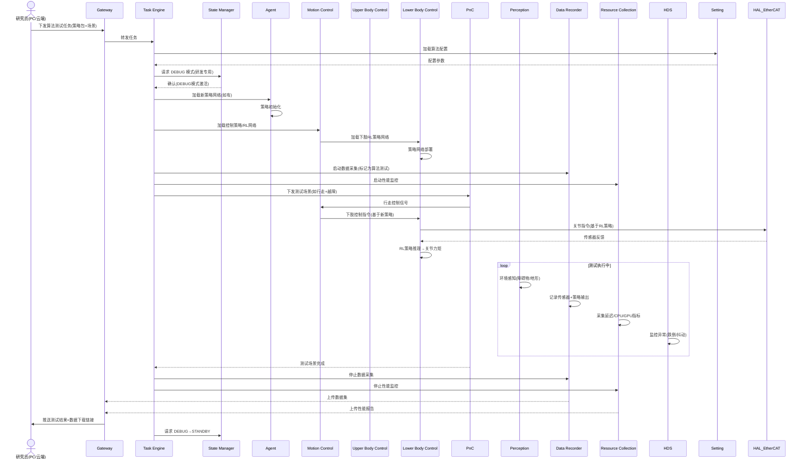

# UC-11: 科研算法验证

## 1. 场景概述

**业务背景**：高校、研究所、企业研发团队使用人形机器人平台验证强化学习（RL）、模仿学习（IL）、VLA 等新算法。机器人作为"活体实验平台"，需要支持快速迭代、数据采集、算法部署与对比测试。

**参考企业**：宇树科技 H1/G1（学术界最广泛使用的开源人形平台）

**价值主张**：
- 开源 SDK + 仿真环境，降低算法验证门槛
- 真实硬件验证，弥合 sim-to-real 鸿沟
- 自动数据采集，生成训练数据集
- 支持快速算法切换（A/B 测试）

**典型任务流**：
1. 研究员通过 SDK/API 下发算法任务（如"测试新步态策略"）
2. TE 加载对应算法配置
3. Agent/LC 加载新策略网络
4. 执行测试任务（如行走 10 米、跨越障碍）
5. DR 记录传感器数据与策略输出
6. RC 收集性能指标（延迟、功耗、稳定性）
7. 数据回传研究员，支持对比分析

---

## 2. 时序图



---

## 3. 模块协作矩阵

| 模块 | 本场景中的职责 | 协作对象 |
|------|--------------|----------|
| **Gateway** | 接收研究员算法任务；回传数据集与性能报告 | TE, Researcher, DR, RC |
| **TE** | 管理算法测试任务；编排"加载→执行→记录→上传"流程 | Gateway, SM, Agent, MC, PnC, DR, RC |
| **SM** | 切换至 `DEBUG` 模式（研发专用，可绕过部分安全校验） | TE, MC, HDS |
| **Agent** | 加载新策略网络；执行 VLA 算法测试 | TE, Perception, Gateway |
| **MC** | 运动控制协调器：加载 UC/LC 插件，聚合关节指令，统一下发 EtherCAT | TE, UC, LC, HAL_EtherCAT, SM |
| **UC** | 上肢控制插件：执行双臂操作算法（如有上肢策略测试） | MC, HAL_EtherCAT |
| **LC** | 下肢控制插件：加载并运行 RL/IL 步态策略；WBC平衡；回传策略执行数据 | MC, HAL_EtherCAT, Perception, DR |
| **PnC** | 提供测试场景导航（直线行走、绕障、上下坡） | TE, MC, Perception, VSLAM |
| **Perception** | 提供环境感知数据（供策略输入）；地形评估 | LC, Agent, PnC, HAL_Sensor |
| **DR** | 高精度数据采集（策略输入/输出、传感器原始数据） | TE, MC, Perception, Agent |
| **RC** | 性能监控（推理延迟、CPU/GPU 利用率、内存占用） | TE, 全部模块 |
| **HDS** | 算法异常监控（策略发散、抖动、跌倒风险预警） | LC, Perception, SM |
| **Setting** | 存储算法参数、测试场景配置 | TE, Agent, MC, PnC |
| **HAL_EtherCAT** | 高频率传感器采集；关节控制 | UC, LC, MC |

---

## 4. 数据流向

### Topic 流向

| Topic | 发布者 | 订阅者 | 说明 |
|-------|--------|--------|------|
| `/sm/robot_state` | SM | MC, PnC, TE | 全局状态（DEBUG模式） |
| `/lc/policy_output` | LC | DR | 策略网络输出（下肢关节力矩） |
| `/lc/observation` | LC | DR | 策略输入（IMU+下肢关节状态） |
| `/perception/terrain` | Perception | LC, DR | 地形信息（RL策略输入） |
| `/dr/data_segment` | DR | Gateway | 数据分片上传 |
| `/rc/metrics` | RC | Gateway | 性能指标 |
| `/hds/algorithm_alert` | HDS | Gateway | 算法异常告警 |

### Service 调用

| Service | 调用方 | 提供方 | 说明 |
|---------|--------|--------|------|
| `/sm/request_transition` | TE | SM | 请求 DEBUG 模式 |
| `/setting/load_algorithm_config` | TE | Setting | 加载算法配置 |
| `/dr/start_recording` | TE | DR | 启动数据采集 |
| `/rc/start_collection` | TE | RC | 启动性能监控 |

### Action 调用

| Action | 调用方 | 提供方 | 说明 |
|--------|--------|--------|------|
| `/te/run_algorithm_test` | Gateway | TE | 算法测试任务执行 |
| `/pnc/run_test_scenario` | TE | PnC | 测试场景导航 |

---

## 5. 安全约束

### E-Stop 路径

```
研究员远程急停 / 机器人跌倒检测 → MC/SM → ACTIVE_E_STOP
                                      ↓
                                MC 阻尼制动
                                      ↓
                                研究员现场检查
```

- **DEBUG 模式**：`DEBUG` 状态下可绕过部分安全校验（如允许更高速度），但 E-Stop 和力限保护不可绕过
- **跌倒检测**：LC 插件实时检测质心偏移，预测跌倒风险 >80% 时主动上报 HDS，HDS 请求 E-Stop
- **远程急停**：研究员通过 Gateway 可随时触发 E-Stop，延迟 <100ms

### SM 状态校验

| 操作 | 要求状态 | 禁止状态 |
|------|----------|----------|
| 算法测试 | `DEBUG` | `ACTIVE_E_STOP`, `FAULT` |
| 策略加载 | `DEBUG` 或 `STANDBY` | `ACTIVE_E_STOP` |
| 数据采集 | `DEBUG` 或任意 ACTIVE 状态 | `ACTIVE_E_STOP` |

### 研发安全

- DEBUG 模式下，最大关节速度可提升至 120% 额定值，但电流限制保持 90%
- 新策略网络首次运行前，TE 强制要求在仿真环境预验证（仿真通过标记）
- 算法测试区域设置软围栏，机器人超出范围时 PnC 自动减速并返回

---

## 6. 关键参数

| 参数 | 默认值 | 说明 |
|------|--------|------|
| `debug.max_velocity_ratio` | 1.2 | DEBUG 模式最大速度比例 |
| `debug.current_limit_ratio` | 0.9 | DEBUG 模式电流限制比例 |
| `research.sim_validation_required` | true | 仿真预验证强制开关 |
| `dr.sample_rate` | 1000 Hz | 传感器数据采集频率 |
| `rc.metrics_interval` | 1.0 s | 性能指标采集间隔 |
| `mc.fall_prediction_threshold` | 0.8 | 跌倒预测阈值 |

---

## 7. 故障模式

### 场景：新 RL 策略在真实机器人上发散（sim-to-real 失败）

1. **LC** 插件执行新策略，发现关节指令剧烈抖动（速度变化 >阈值）
2. **HDS** 检测到抖动模式，定级为 `WARNING`
3. **HDS** 向 SM 请求 `DEGRADED`，LC 插件切换至保守备份策略
4. **TE** 暂停算法测试，标记为 `FAILED`
5. **DR** 记录发散前后的完整数据（供研究员分析 sim-to-real 差距）
6. **RC** 生成性能报告（策略推理延迟、资源占用）
7. **Gateway** 向研究员推送失败报告 + 数据下载链接
8. 研究员基于数据优化策略，重新提交测试

### 场景：数据采集过程中存储空间不足

1. **DR** 检测到存储空间 <5%
2. **DR** 向 TE 上报 `STORAGE_LOW`
3. **TE** 决策：
   - 若测试已进行 >80%，提前结束并标记 `COMPLETED_WITH_DEGRADATION`
   - 若测试刚开始，暂停测试，请求 Gateway 上传已有数据后释放空间
4. **Gateway** 上传数据至云端/研究员服务器
5. 空间释放后，TE 恢复测试
