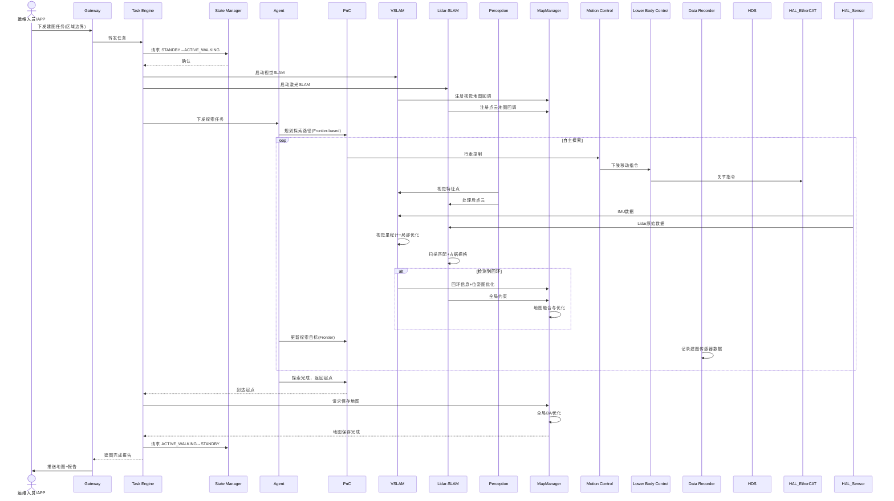

# UC-12: 自主建图与地图更新

## 1. 场景概述

**业务背景**：人形机器人在新环境部署时，需要自主探索并构建环境地图（SLAM）。同时，环境可能随时间变化（家具移动、新障碍物），需要定期更新地图。这是几乎所有自主导航场景的前置依赖。

**参考企业**：通用场景（所有需要自主导航的人形机器人）

**价值主张**：
- 零配置部署，机器人自主探索新环境
- 多传感器融合建图（视觉 + Lidar + IMU），提升鲁棒性
- 地图增量更新，适应环境变化
- 地图持久化管理，支持多楼层/多区域

**典型任务流**：
1. 接收建图任务（区域边界或"全屋探索"）
2. 启动 SLAM 算法（VSLAM + Lidar-SLAM 融合）
3. 自主探索：规划探索路径，覆盖未知区域
4. 实时构建与优化地图（局部 + 全局）
5. 回环检测，消除累积误差
6. 地图完成后保存，发布给导航模块使用
7. 定期重访，检测环境变化并更新地图

---

## 2. 时序图



---

## 3. 模块协作矩阵

| 模块 | 本场景中的职责 | 协作对象 |
|------|--------------|----------|
| **Gateway** | 接收建图任务；回传地图文件与建图报告 | TE, Operator, HDS |
| **TE** | 管理建图任务生命周期；协调探索、SLAM、保存流程 | Gateway, SM, Agent, PnC, MapManager |
| **SM** | 状态管理：`ACTIVE_WALKING`（探索中） | TE, PnC, MC, HDS |
| **Agent** | 探索策略决策（Frontier 检测、探索优先级、重访策略） | TE, PnC, MapManager, Perception |
| **PnC** | 探索路径规划（Frontier-based 或 Coverage-based） | TE, MC, Perception, VSLAM, Lidar-SLAM |
| **VSLAM** | 视觉 SLAM：特征提取、视觉里程计、回环检测、全局 BA | Perception, HAL_Sensor, MapManager, PnC |
| **Lidar-SLAM** | 激光 SLAM：扫描匹配、占据栅格、闭环校正 | HAL_Sensor, MapManager, PnC |
| **Perception** | 为 VSLAM 提供视觉特征；为 Lidar-SLAM 提供处理后的点云 | VSLAM, Lidar-SLAM, HAL_Sensor |
| **MapManager** | 地图融合（视觉 + 激光）；地图保存/加载/版本管理；增量更新 | VSLAM, Lidar-SLAM, Agent, PnC |
| **MC** | 运动控制协调器：加载 LC 插件，聚合关节指令，统一下发 EtherCAT | PnC, LC, HAL_EtherCAT |
| **LC** | 下肢控制插件：执行探索行走；复杂地形下的稳定行走/WBC平衡 | MC, HAL_EtherCAT, Perception |
| **DR** | 记录建图全过程原始数据（用于算法优化与故障复盘） | TE, VSLAM, Lidar-SLAM |
| **HDS** | 监控 SLAM 质量（定位漂移、回环失败）；传感器异常 | VSLAM, Lidar-SLAM, HAL_Sensor, SM |
| **HAL_Sensor** | 提供 Camera、Lidar、IMU 原始数据 | Perception, VSLAM, Lidar-SLAM |
| **HAL_EtherCAT** | 电机驱动；关节状态回传（用于里程计辅助） | LC, MC |

---

## 4. 数据流向

### Topic 流向

| Topic | 发布者 | 订阅者 | 说明 |
|-------|--------|--------|------|
| `/sm/robot_state` | SM | PnC, MC | 全局状态 |
| `/pnc/cmd_vel` | PnC | MC | 探索行走控制 |
| `/vslam/pose` | VSLAM | PnC, MapManager | 视觉定位位姿 |
| `/vslam/feature_points` | VSLAM | MapManager | 视觉特征点地图 |
| `/lidar_slam/occupancy_grid` | Lidar-SLAM | MapManager, PnC | 占据栅格地图 |
| `/lidar_slam/pointcloud_map` | Lidar-SLAM | MapManager | 点云地图 |
| `/perception/processed_cloud` | Perception | Lidar-SLAM | 处理后点云 |
| `/map_manager/map_update` | MapManager | PnC, Agent | 地图更新事件 |
| `/dr/mapping_log` | DR | Gateway | 建图日志 |

### Service 调用

| Service | 调用方 | 提供方 | 说明 |
|---------|--------|--------|------|
| `/map_manager/save_map` | TE | MapManager | 保存地图 |
| `/map_manager/load_map` | PnC | MapManager | 加载已有地图 |
| `/vslam/get_quality` | HDS | VSLAM | 查询视觉 SLAM 质量 |
| `/lidar_slam/get_quality` | HDS | Lidar-SLAM | 查询激光 SLAM 质量 |

### Action 调用

| Action | 调用方 | 提供方 | 说明 |
|--------|--------|--------|------|
| `/te/execute_mapping` | Gateway | TE | 建图任务执行 |
| `/pnc/explore_area` | TE | PnC | 区域探索导航 |

---

## 5. 安全约束

### E-Stop 路径

```
探索中遇到不可通行地形(深坑/悬崖) → Perception → PnC → 停止前进
                                      ↓
                               HDS 评估风险 → SM → ACTIVE_E_STOP(必要时)
```

- **地形安全**：探索过程中 Perception 实时评估地形可通行性，检测到悬崖/深坑时 PnC 立即停止
- **定位丢失**：VSLAM 或 Lidar-SLAM 定位丢失时，PnC 停止前进，原地等待恢复（超时则放弃）
- **回环失败**：长时间未检测到回环，HDS 评估定位漂移风险，可能请求 `DEGRADED`

### SM 状态校验

| 操作 | 要求状态 | 禁止状态 |
|------|----------|----------|
| 自主探索 | `ACTIVE_WALKING` | `FAULT`, `ACTIVE_E_STOP` |
| 地图保存 | `ACTIVE_STAND` 或 `ACTIVE_WALKING` | `ACTIVE_E_STOP` |

### 建图质量保障

- 探索路径必须覆盖所有可到达区域（Coverage >95%）
- 回环检测成功率 >90%，否则 Agent 规划重访路径
- 视觉 + 激光地图不一致时，MapManager 按置信度加权融合

---

## 6. 关键参数

| 参数 | 默认值 | 说明 |
|------|--------|------|
| `mapping.exploration_speed` | 0.3 m/s | 探索行走速度（稳定优先） |
| `mapping.coverage_threshold` | 0.95 | 覆盖率阈值 |
| `mapping.loop_closure_rate` | 0.9 | 回环检测成功率阈值 |
| `vslam.feature_min_matches` | 50 | 最小特征匹配数 |
| `lidar_slam.resolution` | 0.05 m | 占据栅格分辨率 |
| `map_manager.max_maps` | 10 | 最大保存地图数量 |
| `dr.mapping_segment_size` | 2 GB | 建图数据分片大小 |

---

## 7. 故障模式

### 场景：长走廊中视觉 SLAM 漂移

1. **VSLAM** 在长走廊中特征点稀少，定位逐渐漂移
2. **HDS** 监控到 VSLAM 定位不确定性持续增长
3. **HDS** 定级为 `WARNING`，但不请求 E-Stop（漂移可控）
4. **Agent** 收到告警，调整探索策略：
   - 优先寻找有丰富纹理的区域（如房间）进行回环
   - 降低探索速度，增加 Lidar-SLAM 权重
5. **MapManager** 检测到 VSLAM 与 Lidar-SLAM 位姿偏差 >阈值，触发局部重优化
6. 若进入房间后成功回环，VSLAM 漂移被修正，HDS 恢复 `HEALTHY`
7. 若长时间无法回环，HDS 请求 `DEGRADED`，Agent 终止探索，保存当前地图

### 场景：环境变化导致地图过时

1. **Agent** 日常导航中发现与地图不一致（如新障碍物）
2. **Agent** 向 TE 报告 `MAP_OUTDATED`
3. **TE** 触发增量更新任务
4. **MapManager** 加载已有地图，标记变化区域
5. **Agent** 规划重访路径，重点扫描变化区域
6. **VSLAM + Lidar-SLAM** 对变化区域重新建图
7. **MapManager** 融合新旧地图，更新占用状态
8. 更新完成后，PnC 恢复使用新地图导航
