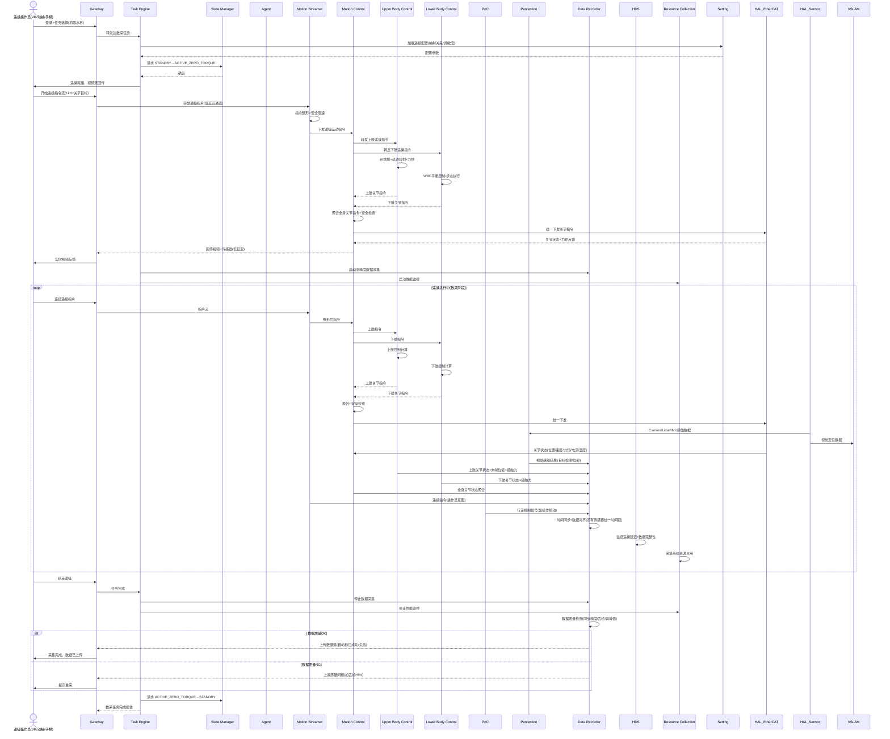

# UC-13: 遥操真机数采

## 1. 场景概述

**业务背景**：高质量真机数据是训练人形机器人 VLA 模型、模仿学习（IL）策略和 RL 初始化策略的核心燃料。仿真到真实（sim-to-real）存在显著差距，通过在真实机器人上执行遥操作（Teleoperation）采集专家演示数据，是目前业界验证最有效的数据获取方式。

**参考企业**：智元机器人（AgiBot）、宇树科技（Unitree）、Figure AI、特斯拉 Optimus、1X Technologies 等均大规模建设遥操数采体系

**价值主张**：

- 获取带物理交互真值的数据（接触力、摩擦、形变等仿真难以建模）
- 人类专家直觉体现在动作序列中（IL / BC 训练素材）
- 任务成功/失败自动标注，降低人工标注成本
- 支持异地专家远程操作，突破地域限制
- 数据闭环：采集 → 训练 → 部署 → 再采集

**典型任务流**：

1. 操作员通过 VR 头显 / 动捕服 / 手柄 / 同构遥操臂连接机器人
2. 机器人进入遥操就绪状态（零力矩 / 阻尼模式）
3. 操作员远程控制机器人执行任务（抓取、行走、装配、开门等）
4. DR 同步记录全量传感器数据 + 操作员指令 + 任务标签
5. 数据质量自动检查（时间同步、丢帧、异常值）
6. 数据自动上传数据中心，触发训练流水线
7. 操作员评估采集效果，决定重采或下一任务

---

## 2. 时序图




---

## 3. 模块协作矩阵


| 模块               | 本场景中的职责                                                     | 协作对象                               |
| ---------------- | ----------------------------------------------------------- | ---------------------------------- |
| **Gateway**      | 低延迟遥操指令传输（WebRTC/RTC）；视频/传感器回传；操作员认证与授权                     | Operator, MS, TE, DR, HDS          |
| **TE**           | 管理数采任务生命周期：配置加载→遥操就绪→采集→质检→上传                               | Gateway, SM, DR, RC, Agent         |
| **SM**           | 遥操模式状态管理：`ACTIVE_ZERO_TORQUE`（就绪）→遥操执行→恢复；E-Stop 响应         | TE, MS, MC, HDS                    |
| **Agent**        | 数采策略决策：任务选择、数据标注策略（成功/失败判定）、数据质量评估                          | TE, DR, Perception, Setting        |
| **MS**           | **核心模块**：遥操指令整形（死区消除、平滑滤波）、安全限速、冲突仲裁                        | Gateway, MC, SM, HDS               |
| **MC**           | 运动控制协调器：加载UC/LC插件，聚合关节指令，统一下发EtherCAT；全身状态估计；安全校验           | MS, UC, LC, HAL_EtherCAT, PnC, DR  |
| **UC**           | 上肢控制插件：执行双臂遥操指令、IK求解、末端力控、夹爪控制、自碰撞检测                        | MC, HAL_EtherCAT, DR               |
| **LC**           | 下肢控制插件：执行行走步态/WBC平衡控制（足式）或底盘移动/升降柱控制（轮式）                    | MC, PnC, HAL_EtherCAT, DR          |
| **PnC**          | 遥操行走时的底层平衡与 foothold 控制（操作员给出高层移动意图，PnC 处理细节）               | LC, Perception, VSLAM              |
| **Perception**   | 视觉数据录制；目标检测与位姿估计（用于数据自动标注）；场景理解                             | Agent, DR, HAL_Sensor, TF          |
| **DR**           | **核心模块**：全量传感器数据同步记录（Camera/Lidar/IMU/关节/力矩/遥操指令）；时间对齐；质量检查 | TE, Agent, Perception, MC, MS, PnC |
| **HDS**          | 遥操链路健康监控（延迟、丢包、抖动）；数据完整性监控；异常时请求降级                          | Gateway, MS, SM, DR                |
| **RC**           | 采集系统性能监控（带宽、CPU/GPU、存储 I/O），防止采集本身影响遥操延迟                    | TE, 全部模块                           |
| **Setting**      | 遥操配置：映射关系（操作员动作→机器人关节）、灵敏度曲线、死区、限速参数                        | MS, TE, Agent                      |
| **HAL_EtherCAT** | 1kHz 关节指令下发；关节状态+力矩高频回传                                     | MC, DR                             |
| **HAL_Sensor**   | Camera/Lidar/IMU 原始数据高频采集                                   | Perception, VSLAM, Lidar-SLAM, DR  |
| **VSLAM**        | 提供遥操过程中的机器人位姿（数据标注用）                                        | PnC, DR                            |
| **Interaction**  | 操作员语音通信（如"开始"/"停止"指令，减少手柄操作负担）                              | HAL_Audio, TE                      |


---

## 4. 数据流向

### Topic 流向


| Topic                      | 发布者          | 订阅者            | 说明                   |
| -------------------------- | ------------ | -------------- | -------------------- |
| `/gateway/teleop_cmd`      | Gateway      | MS             | 遥操指令流（关节目标/末端位姿）     |
| `/gateway/video_stream`    | Gateway      | Operator       | 机器人第一视角视频回传          |
| `/ms/cmd_stream`           | MS           | MC             | 整形后的遥操运动指令           |
| `/mc/joint_states`         | HAL_EtherCAT | MC, DR         | 关节状态（位置/速度/力矩/电流/温度） |
| `/uc/ee_pose`              | UC           | DR             | 末端执行器位姿              |
| `/perception/object_poses` | Perception   | DR, Agent      | 场景中物体位姿（自动标注用）       |
| `/perception/rgb_image`    | HAL_Sensor   | Perception, DR | RGB 图像流              |
| `/perception/depth_image`  | HAL_Sensor   | Perception, DR | 深度图像流                |
| `/pnc/cmd_vel`             | PnC          | LC             | 遥操行走控制信号             |
| `/dr/data_frame`           | DR           | Gateway        | 同步后的数据帧（用于上传）        |
| `/hds/teleop_latency`      | HDS          | Gateway, TE    | 遥操链路延迟监控             |
| `/rc/system_metrics`       | RC           | Gateway        | 系统性能指标               |


### Service 调用


| Service                      | 调用方     | 提供方     | 说明         |
| ---------------------------- | ------- | ------- | ---------- |
| `/sm/request_transition`     | TE      | SM      | 请求遥操模式状态转换 |
| `/sm/query_state`            | Gateway | SM      | 查询当前机器人状态  |
| `/setting/get_teleop_config` | TE      | Setting | 读取遥操配置     |
| `/dr/start_recording`        | TE      | DR      | 启动数据采集     |
| `/dr/check_quality`          | TE      | DR      | 数据质量检查     |
| `/hds/get_teleop_health`     | TE      | HDS     | 查询遥操链路健康状态 |


### Action 调用


| Action                        | 调用方     | 提供方 | 说明            |
| ----------------------------- | ------- | --- | ------------- |
| `/te/execute_data_collection` | Gateway | TE  | 数采任务执行（含进度反馈） |
| `/ms/teleop_stream`           | Gateway | MS  | 遥操指令流式处理      |


---

## 5. 安全约束

### E-Stop 路径

```
操作员急停按钮 / 本地安全员按钮 / 异常力矩检测
         ↓
   Gateway(远程) 或 HAL_EtherCAT(本地IO) → SM → ACTIVE_E_STOP
                                              ↓
                                        MC 通知 UC/LC 切换零力矩模式 + 电机刹车
                                              ↓
                                        操作员确认后解除
```

- **双重 E-Stop**：远程操作员可通过 Gateway 触发 E-Stop；现场安全员通过 HAL_EtherCAT 硬线 IO 触发，两者独立
- **本地自主保护**：网络中断 >500ms 时，MC 自动切换至阻尼模式（不依赖云端），等待连接恢复
- **力矩超限保护**：任何关节力矩 >安全阈值时，MC 立即上报 HDS，HDS 请求 SM 切至 `ACTIVE_E_STOP`

### SM 状态校验


| 操作   | 要求状态                                   | 禁止状态                                 |
| ---- | -------------------------------------- | ------------------------------------ |
| 遥操就绪 | `ACTIVE_ZERO_TORQUE`                   | 全部非就绪状态                              |
| 遥操执行 | `ACTIVE_ZERO_TORQUE` 或 `ACTIVE_MOTION` | `FAULT`, `ACTIVE_E_STOP`, `CHARGING` |
| 数据采集 | `ACTIVE_ZERO_TORQUE` 或 `ACTIVE_MOTION` | `ACTIVE_E_STOP`                      |
| 数据上传 | `ACTIVE_STAND` 或 `ACTIVE_ZERO_TORQUE`  | `ACTIVE_E_STOP`                      |


### 遥操链路安全

- **延迟上限**：遥操指令端到端延迟 <100ms（VR 场景）或 <50ms（精细操作场景），超过时 HDS 告警并建议降速
- **丢包处理**：指令流丢包 <1%，MC 的指令缓冲区可平滑补偿；丢包 >5% 时 TE 暂停采集
- **指令限幅**：MS 对遥操指令执行硬限幅（关节角度/速度/力矩），防止操作员误操作导致损坏
- **碰撞检测**：UC 插件实时检测上肢自碰撞和外部碰撞，LC 插件实时检测下肢碰撞；预测碰撞时 MC 拒绝聚合并下发指令

### 人身安全

- 遥操区域设置物理围栏，人员进入时 Perception 检测并告警
- 操作员必须通过 Gateway 安全培训认证后才能获得遥操权限
- 首次遥操新任务前，TE 强制要求执行 `SAFETY_CHECK`（关节范围、力矩基线校准）

---

## 6. 关键参数


| 参数                                      | 默认值       | 说明               |
| --------------------------------------- | --------- | ---------------- |
| `teleop.max_latency_ms`                 | 100 ms    | 遥操最大允许延迟         |
| `teleop.cmd_rate`                       | 1000 Hz   | 遥操指令输入频率         |
| `teleop.dead_zone`                      | 0.05      | 遥操死区（消除微小抖动）     |
| `teleop.sensitivity`                    | 1.0       | 遥操作灵敏度（1.0=线性映射） |
| `teleop.max_joint_speed`                | 3.0 rad/s | 遥操关节速度上限         |
| `teleop.max_joint_torque`               | 40 N·m    | 遥操关节力矩上限         |
| `teleop.network_timeout`                | 500 ms    | 网络中断自动保护超时       |
| `dr.sync_tolerance_us`                  | 100 μs    | 多传感器时间同步精度       |
| `dr.quality_check.frame_drop_threshold` | 0.05      | 丢帧率阈值（>5% 判定为NG） |


---

## 7. 故障模式

### 场景：遥操过程中网络延迟突增

1. **Gateway** 检测到遥操指令 RTT 从 50ms 突增至 200ms
2. **HDS** 收到延迟告警，定级为 `WARNING`
3. **HDS** 建议 TE 降速：MS 将速度限幅从 100% 降至 50%
4. **Operator** 感知到操作迟滞，系统 TTS 提示："网络延迟升高，已自动降速"
5. 若延迟持续 >300ms 超过 5s：
  - HDS 请求 SM 切至 `DEGRADED`
  - MC 通知 UC/LC 切换阻尼模式，停止响应遥操指令
  - TE 暂停 DR 采集，标记当前片段为 `INTERRUPTED`
6. 网络恢复后（延迟 <100ms 持续 3s），HDS 请求恢复，TE 提示操作员继续

### 场景：操作员误操作导致机器人手臂快速挥动

1. **Operator** 大幅度快速移动手柄，生成高速遥操指令
2. **MS** 检测到指令速度 >`max_joint_speed`（3.0 rad/s），触发硬限幅
3. **MS** 将超限指令裁剪至安全范围，同时向 HDS 上报 `CMD_LIMITED`
4. **MC** 将限幅后的安全指令分发给 UC/LC 插件执行，避免快速挥动
5. **HDS** 记录事件，若限幅频繁触发，向 Operator 提示："请减小操作幅度"
6. DR 记录完整事件链（原始指令+限幅后指令+执行结果），用于后续分析操作员行为模式

### 场景：数采数据时间戳不同步

1. **DR** 数据质量检查发现 Camera 与关节状态时间戳偏差 >`sync_tolerance_us`（100μs）
2. **DR** 标记该数据片段为 `SYNC_ISSUE`
3. **DR** 尝试通过硬件时间戳（PTP/gPTP）重新对齐
4. 若对齐失败，DR 丢弃该片段，向 TE 请求重采
5. **TE** 通知 Operator："数据同步异常，请重新执行该任务"
6. **RC** 检查是否为系统负载过高导致，若是则建议降低采集分辨率或帧率

