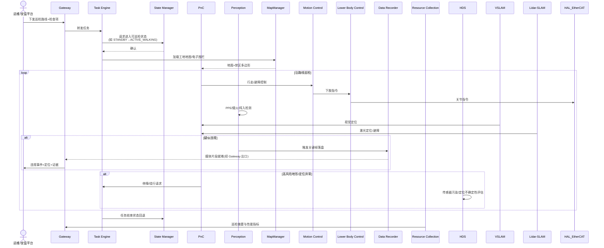

# UC-14: 建筑工地安全巡检

## 1. 场景概述

**业务背景**：在在建工地、隧道口、钢结构安装区等高风险作业现场，人形机器人按固定路线或任务驱动执行安全巡检：识别未佩戴安全帽/反光背心、禁区闯入、明火烟雾、临边防护缺失等，并将证据与位置回传监管平台。现场存在扬尘、光照剧变、临时障碍物与非结构化地面，对定位与感知鲁棒性要求高。

**参考企业**：通用场景（建筑总包、智慧工地平台厂商；人形机器人厂商在 B 端试点）

**价值主张**：

- 7×24 可重复巡检，降低安全员徒步盲区
- 视觉 + Lidar 融合，在粉尘与弱纹理环境下仍能保持可用定位
- 结构化上报（时间、地点、截图/短视频、违规类型），便于追责与整改闭环
- 与既有工地门禁/电子围栏策略对齐，减少误报

**典型任务流**：

1. 运维通过 APP/云端下发当日巡检路线与检查项（PPE、禁烟区、临边围挡）
2. TE 拉起任务，SM 进入可行走状态；PnC 沿路线导航，Perception 运行检测模型
3. 发现疑似违规 → DR 缓存关键帧；Gateway 经唯一出口上传事件与媒体
4. 遇不可通行或高风险区域（深坑、未封闭洞口）→ PnC 停障，必要时请求人工确认
5. 任务结束 → RC 汇总日志，HDS 输出当次健康与传感器污染提示

---

## 2. 时序图




---

## 3. 模块协作矩阵


| 模块                                      | 本场景中的职责                                             | 协作对象                                          |
| --------------------------------------- | --------------------------------------------------- | --------------------------------------------- |
| **Gateway**                             | 接收巡检任务配置；向安监平台上报违规事件与媒体；不绕过出口直连公网                   | TE, DR, RC, HDS                               |
| **TE**                                  | 巡检任务编排：路线、重试、超时、与人工确认节点                             | Gateway, SM, PnC, Perception                  |
| **SM**                                  | 全局状态闸门：行走/停障/急停；禁止在 `FAULT` / `ACTIVE_E_STOP` 下继续运动 | TE, PnC, MC                                   |
| **PnC**                                 | 工地导航与局部避障；结合 MapManager 禁区与临时障碍                     | MC, Perception, VSLAM, Lidar-SLAM, MapManager |
| **Perception**                          | 安全相关检测（PPE、烟火、区域闯入、部分结构件异常）；提供停障所需障碍物               | TE, DR, PnC, HAL_Camera                       |
| **VSLAM**                               | 弱纹理/光照变化下的视觉定位辅助                                    | Perception, PnC, HDS                          |
| **Lidar-SLAM**                          | 粉尘环境下更稳定的距离感知与定位补充                                  | HAL_Lidar, PnC, MapManager                    |
| **MapManager**                          | 加载/更新工地地图；电子围栏与楼层切换                                 | PnC, TE                                       |
| **MC**                                  | 聚合 LC（及必要时 UC 扭头观察）关节指令，统一下发                        | PnC, LC, HAL_EtherCAT                         |
| **LC**                                  | 非平整地面步态与平衡；停障时稳定站立                                  | MC, HAL_EtherCAT                              |
| **DR**                                  | 违规证据与传感器片段落盘；满足取证链字段（时间戳、位姿）                        | Perception, Gateway, TE                       |
| **RC**                                  | 聚合节点日志与资源占用，便于工地侧运维                                 | 各模块                                           |
| **HDS**                                 | 定级：相机污染、定位跳变、通信中断；**不替代业务判责**                       | Perception, VSLAM, Lidar-SLAM, SM             |
| **HAL_Camera / HAL_Lidar / HAL_Sensor** | 提供原始传感；扬尘下需关注镜头污染告警                                 | Perception, VSLAM, Lidar-SLAM                 |
| **HAL_EtherCAT**                        | 驱动执行；急停硬件链路配合 SM                                    | MC, LC                                        |
| **Interaction**                         | （可选）现场语音播报“请佩戴安全帽”；紧急词汇转 SM                         | HAL_Audio, SM                                 |
| **Agent**                               | （可选）复杂语义任务：“重点检查 3 号楼东侧”→ 子路线生成                     | TE, PnC                                       |


---

## 4. 数据流向

### Topic 流向


| Topic                         | 发布者        | 订阅者             | 说明                  |
| ----------------------------- | ---------- | --------------- | ------------------- |
| `/sm/robot_state`             | SM         | PnC, MC, TE     | 全局状态                |
| `/perception/safety_alert`    | Perception | TE, DR, Gateway | 安全类检测结果             |
| `/pnc/cmd_vel`                | PnC        | MC              | 巡检路径跟踪              |
| `/map_manager/zone_violation` | MapManager | PnC, TE         | 电子围栏越界事件            |
| `/dr/segment_ready`           | DR         | Gateway         | 证据片段可上传             |
| `/hds/diagnosis`              | HDS        | Gateway, TE     | 健康与定级结果（原始+结论由 HDS） |
| `/vslam/pose`                 | VSLAM      | PnC             | 视觉定位                |
| `/lidar_slam/pose`            | Lidar-SLAM | PnC             | 激光定位                |


### Service 调用


| Service                 | 调用方     | 提供方        | 说明          |
| ----------------------- | ------- | ---------- | ----------- |
| `/sm/is_motion_allowed` | PnC, MC | SM         | 运动前校验       |
| `/map_manager/load_map` | TE      | MapManager | 加载工地地图      |
| `/perception/set_roi`   | TE      | Perception | 按标段设置检测 ROI |


### Action 调用


| Action                | 调用方     | 提供方 | 说明     |
| --------------------- | ------- | --- | ------ |
| `/te/execute_task`    | Gateway | TE  | 巡检任务执行 |
| `/pnc/navigate_route` | TE      | PnC | 多点路线导航 |


---

## 5. 安全约束

### E-Stop 路径

```
现场急停按钮/遥控急停 → HAL_Sensor 或 Gateway → SM → ACTIVE_E_STOP
                              ↓
                         MC 立即停止运动
```

- **人员近距离**：Perception 检测到与未识别目标过近时，PnC 降速或停障；是否升急停由 SM 策略与 HDS 定级共同约束
- **定位失效**：VSLAM 与 Lidar-SLAM 同时不可用超过阈值时，PnC **禁止**盲走，原地等待或请求人工接管

### SM 状态校验


| 操作      | 要求状态                         | 禁止状态                     |
| ------- | ---------------------------- | ------------------------ |
| 工地行走巡检  | `ACTIVE_WALKING`（或策略允许的等效状态） | `FAULT`, `ACTIVE_E_STOP` |
| 上传违规证据  | 任意健康可通信状态                    | 无（由 Gateway 队列缓存）        |
| 继续靠近危险源 | 需显式授权状态                      | 默认禁止自动靠近明火核心区            |


### 合规与误报控制

- 违规判定阈值与模型版本由 Setting 统一下发，变更需留痕（RC 日志）
- 上报内容经 Gateway 脱敏（人脸模糊可选），符合工地与本地法规要求

---

## 6. 关键参数


| 参数                              | 默认值      | 说明             |
| ------------------------------- | -------- | -------------- |
| `site.patrol_speed`             | 0.35 m/s | 工地巡检速度（稳定、易取证） |
| `site.ppe_confidence`           | 0.75     | PPE 漏检/误报折中    |
| `site.stop_obstacle_range`      | 1.2 m    | 停障距离（随场景标定）    |
| `site.localization_timeout`     | 3.0 s    | 定位丢失后允许等待时间    |
| `perception.dust_exposure_gain` | 场景相关     | 扬尘下曝光/增益策略     |
| `dr.evidence_clip_sec`          | 8 s      | 单条违规关联视频长度     |


---

## 7. 故障模式

### 场景：扬尘导致相机可用性下降

1. **Perception** 检测置信度整体下降，**HDS** 收到图像质量特征（过曝、对比度低）
2. **HDS** 定级 `WARNING`，建议降速；**PnC** 自动切换更保守避障模式
3. **TE** 提示运维“建议清洁镜头或切换备用路线”
4. 若 **Lidar-SLAM** 仍健康，巡检可降级为“激光为主、视觉为辅”继续；否则 **TE** 暂停任务并上报

### 场景：临时占道（吊车支腿、堆料）

1. **PnC** 局部规划失败，向 **TE** 报告 `ROUTE_BLOCKED`
2. **TE** 触发绕行子任务或等待窗口（与 Gateway 下发策略一致）
3. 超时仍不可达 → **Gateway** 通知平台调整路线；**DR** 保留现场图像供复盘

