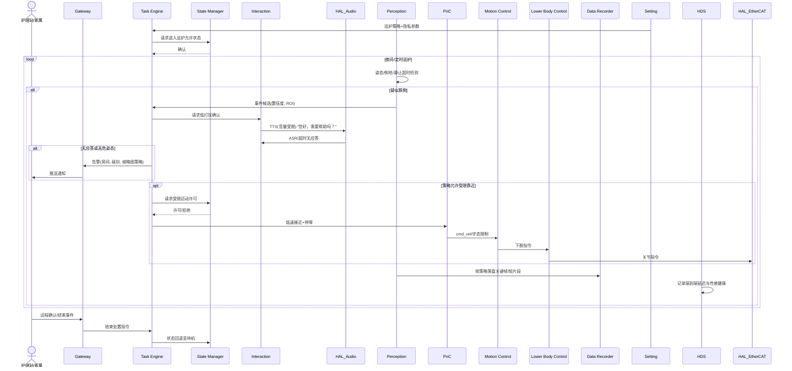

# UC-15: 康养跌倒响应与夜间巡护

## 1. 场景概述

**业务背景**：在养老机构、社区日照中心或居家适老化改造环境中，人形机器人承担定时巡房、夜间静音巡护与跌倒等异常事件的**辅助响应**：发现疑似跌倒后，先在本地做保守确认，再通过 Gateway 按协议通知护理站/家属 APP，并在授权范围内执行简单辅助（语音安抚、取递应急按钮附近的物品、引导避让障碍物），**不替代**专业医疗处置。

**参考企业**：通用康养场景（服务机器人厂商 + 康养机构信息化供应商联合方案）

**价值主张**：

- 多模态融合（视觉姿态 + 毫米波/地板振动等传感器可选）降低误报
- 全流程留痕：时间线、房间号、视频片段策略性留存，满足隐私与审计
- 与 SM 状态机严格绑定，避免在不当状态下移动造成二次伤害
- 语音交互由 Interaction 统一仲裁，敏感话术本地模板优先

**典型任务流**：

1. Setting 下发巡护时刻表与房间顺序；TE 在允许时间段内启动静默巡护
2. Perception 运行跌倒/长时间倒地/离床过久等模型；异常分数超阈 → 进入确认态
3. Interaction 低音量询问（若环境允许）；无应答则升级告警 → Gateway  outbound 通知
4. 若策略允许且 SM 许可“受限移动”，PnC 以低速靠近可视确认，**不搬动**长者身体
5. DR 按隐私策略录制最短必要片段；HDS 记录链路延迟与设备健康
6. 事件结束 → SM 回到安全待机；RC 输出事件报告供机构质控

---

## 2. 时序图




---

## 3. 模块协作矩阵


| 模块              | 本场景中的职责                             | 协作对象                                 |
| --------------- | ----------------------------------- | ------------------------------------ |
| **Setting**     | 巡护时段、房间顺序、音量上限、影像留存时长、告警联系人         | TE, Interaction, DR                  |
| **TE**          | 巡护任务编排；异常状态机（确认→升级→结束）；**不**做医疗诊断决策 | SM, Perception, Interaction, Gateway |
| **SM**          | 强约束：夜间模式下的运动许可；`ACTIVE_E_STOP` 立即冻结 | TE, PnC, MC                          |
| **Interaction** | 语音确认与安抚；紧急词汇直达 SM；对话与告警仲裁           | HAL_Audio, TE, Agent(可选)             |
| **HAL_Audio**   | 拾音、ASR、TTS；夜间音量曲线与波束可选              | Interaction                          |
| **Perception**  | 跌倒/姿态异常/离床检测；提供保守置信度与不确定性           | TE, DR, HDS                          |
| **PnC**         | 低速、短距离、停障严格的移动；默认“不动优于误动”           | MC, MapManager(若建图房间)                |
| **MC**          | 聚合 LC 指令；任何运动前查询 SM                 | LC, HAL_EtherCAT                     |
| **LC**          | 平稳步态；受限速度/加速度包络                     | MC                                   |
| **Gateway**     | **唯一**对外通知出口；对接护理平台/家属 APP；证书与重试    | TE, DR, HDS                          |
| **DR**          | 最小必要采集；加密存储；保留期到达自动清理               | Perception, Gateway                  |
| **HDS**         | 传感器掉线、麦克风失败、告警发送失败等定级               | HAL_Audio, Perception, Gateway       |
| **Agent**       | （可选）复杂自然语言“去厨房拿药”类任务；**不得**绕过 SM    | TE, Interaction                      |
| **MapManager**  | （可选）多层养老机构地图与房间拓扑                   | PnC                                  |
| **RC**          | 事件日志与指标上报                           | 全部模块                                 |
| **HAL_Sensor**  | （可选）环境传感器、雷达、紧急拉绳状态接入               | Perception, HDS                      |


---

## 4. 数据流向

### Topic 流向


| Topic                        | 发布者        | 订阅者                 | 说明        |
| ---------------------------- | ---------- | ------------------- | --------- |
| `/sm/robot_state`            | SM         | TE, PnC, MC         | 全局状态      |
| `/perception/fall_candidate` | Perception | TE, HDS             | 跌倒候选事件    |
| `/hal_audio/asr_text`        | HAL_Audio  | Interaction         | 用户应答（若启用） |
| `/te/care_event`             | TE         | Gateway, DR         | 康养事件状态机输出 |
| `/setting/care_policy`       | Setting    | TE, Interaction, DR | 策略热更新     |


### Service 调用


| Service                  | 调用方     | 提供方     | 说明              |
| ------------------------ | ------- | ------- | --------------- |
| `/sm/is_motion_allowed`  | PnC, MC | SM      | 任意移动前校验         |
| `/sm/request_transition` | TE      | SM      | 巡护开始/结束、受限移动许可  |
| `/gateway/send_alert`    | TE      | Gateway | 结构化告警（实现名以设计为准） |


### Action 调用


| Action             | 调用方            | 提供方 | 说明         |
| ------------------ | -------------- | --- | ---------- |
| `/te/execute_task` | Gateway / 本地定时 | TE  | 巡护任务       |
| `/pnc/navigate_to` | TE             | PnC | 受限靠近（低速短距） |


---

## 5. 安全约束

### E-Stop 路径

```
长者或工作人员喊"停止"/拉绳急停 → HAL_Audio / HAL_Sensor → Interaction 或直送 SM → ACTIVE_E_STOP
                                                      ↓
                                                MC 立即停止运动
```

- **禁止机械臂搬抬人体**：本 UC 默认不包含抬人、翻身等高风险动作；若未来扩展必须在独立任务类型与 SM 专用状态下启用
- **软件不得自动解除急停**：解除须走 Gateway 人工确认流程（与系统级约束一致）

### SM 状态校验


| 操作     | 要求状态           | 禁止状态                     |
| ------ | -------------- | ------------------------ |
| 启动巡护   | 机构策略允许的待机/站立状态 | `FAULT`, `ACTIVE_E_STOP` |
| 低速靠近确认 | 显式“受限运动”许可     | `ACTIVE_E_STOP`, 未授权运动状态 |
| 语音播报   | 非静默维护窗口外       | 由 Setting 约束             |


### 隐私与伦理

- 视频默认**不上传**全量流；仅事件相关片段经 Gateway 加密外传，且可配置模糊处理
- 误报事件同样记录脱敏日志，供模型与阈值迭代

---

## 6. 关键参数


| 参数                          | 默认值     | 说明         |
| --------------------------- | ------- | ---------- |
| `care.night_max_speed`      | 0.2 m/s | 夜间靠近速度上限   |
| `care.fall_score_threshold` | 场景标定    | 跌倒候选触发阈    |
| `care.confirmation_timeout` | 15 s    | 语音确认等待     |
| `care.tts_night_db_cap`     | 场景标定    | 夜间音量上限     |
| `dr.care_retention_days`    | 7       | 事件媒体默认保留天数 |
| `gateway.alert_retry`       | 3       | 告警发送重试次数   |


---

## 7. 故障模式

### 场景：跌倒误报（蹲姿整理床铺）

1. **Perception** 输出中等置信度跌倒候选
2. **TE** 进入确认态，**Interaction** 低音量询问
3. 用户应答“我在整理床单”→ **Interaction** 解析为**取消升级**意图
4. **TE** 记录负样本元数据（可选经审批用于训练）；**Gateway** 不发告警
5. **HDS** 标记一次“高置信度否定”，供后续阈值自适应（仅上报事实，决策在云端/运维）

### 场景：网络中断导致告警未达

1. **Gateway** 发送失败，向 **HDS** 上报原始失败原因
2. **HDS** 定级 `CRITICAL`（通信类），**本地**触发声光提示（若硬件具备）并由 **Interaction** 最大允许音量重复求助语
3. 网络恢复后 **Gateway** 重放队列；**Staff** 在 APP 上看到延迟告警与时间线

