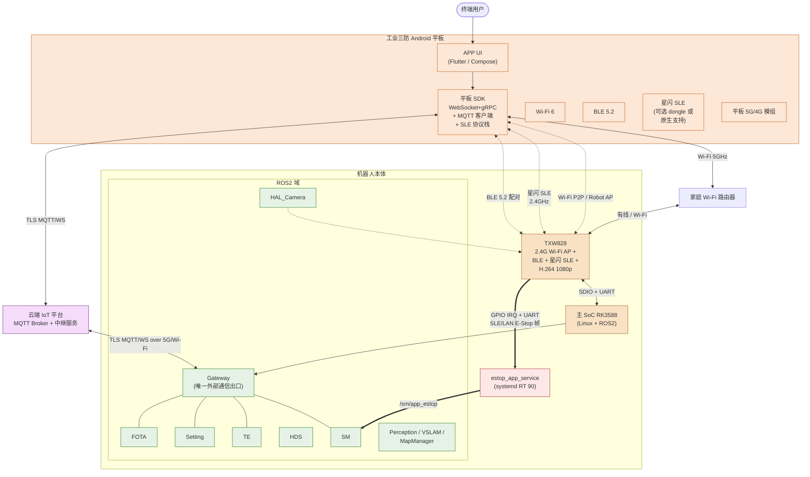
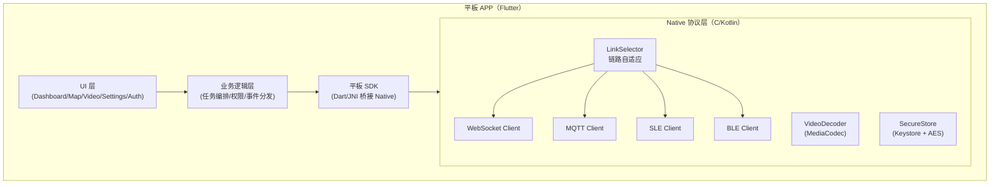
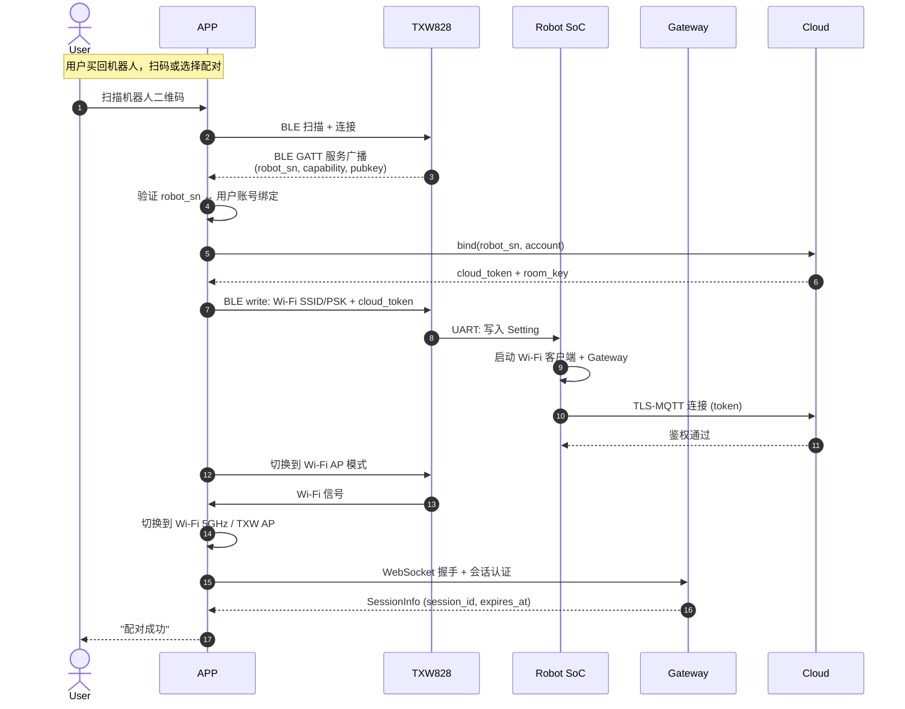
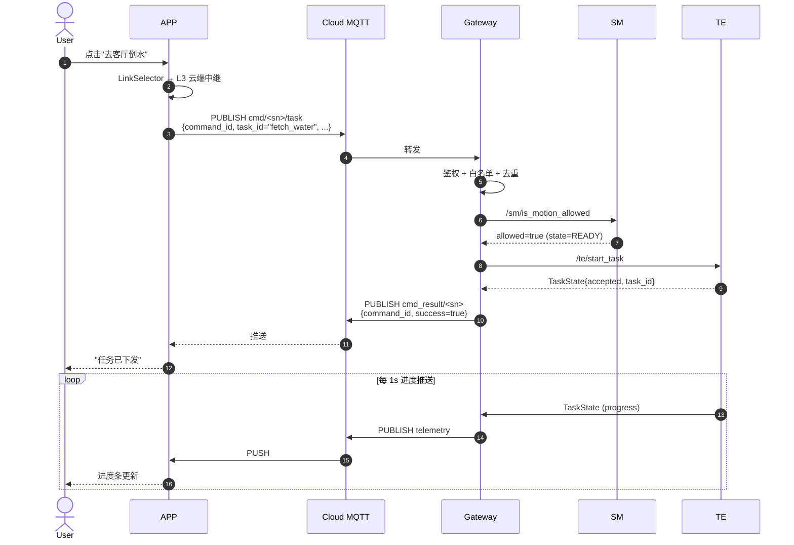
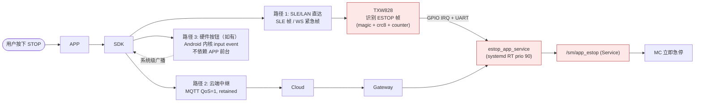

# 平板客户端控制子系统软硬件详细方案

> 版本：v1.0
> 日期：2026-05-08
> 范围：从终端用户 APP 到机器人本体的完整命令/监控/视频/紧急控制链路
> 子系统类型：横切型（Cross-cutting subsystem），跨越 HAL/中间件/应用/AI 四层
> 目标场景：终端用户（家庭/商用客户）通过工业三防 Android 平板远程或本地控制机器人

---

## 0. 文档定位与阅读指引

### 0.1 子系统视角 vs 模块视角

| 文档类型 | 关注点 | 示例 |
|---------|--------|------|
| 模块设计文档（`design/.../*_design.md`） | 单模块"做什么/怎么做" | `gateway_design.md` |
| **子系统方案**（本文档） | **端到端体验链"用什么硬件 + 怎样串起来"** | 本文档 |
| 用例文档（`design/use_cases/*.md`） | 业务场景"用户故事" | 远程任务下发用例 |

本文档**不重复**各模块文档已经定义的接口与内部实现，只补全模块文档之间的"接缝"：

- 平板侧软硬件方案（模块文档完全未涉及）
- 机器人侧 APP 专属无线协处理器（**TXW828**）选型与角色
- 端到端时延预算如何分配给各模块/链路
- APP E-Stop 这条横切硬实时安全通道
- 本地 LAN / 星闪 SLE / 云端中继三链路分流策略
- 部署拓扑、配对流程、断网降级

### 0.2 涉及模块

| 模块 | 在子系统中的角色 | 详细设计 |
|------|----------------|---------|
| **Gateway** | 唯一云端/APP 通信出口；TLS、Token、会话管理 | [gateway_design.md](../design/layer_06_middleware/gateway_design.md) |
| **SM** | 状态校验 + APP E-Stop 仲裁 | [sm_design.md](../design/layer_06_middleware/sm_design.md) |
| **TE** | 接收 APP 任务下发，调度执行 | [te_design.md](../design/layer_01_ai/te_design.md) |
| **Setting** | APP 修改参数的写入与 Schema 校验 | [setting_design.md](../design/layer_03_application/setting_design.md) |
| **HDS** | 上报 APP 链路质量与故障 | [hds_design.md](../design/layer_06_middleware/hds_design.md) |
| **FOTA** | APP 触发的固件升级 | [fota_design.md](../design/layer_03_application/fota_design.md) |
| **Perception / VSLAM / MapManager** | 提供地图、位姿、相机帧给 APP 显示 | 见 layer_04 各文档 |
| **HAL_Camera** | 提供原始 RGB 帧给视频回传链 | [hal_camera_design.md](../design/layer_07_hal_infra/hal_camera_design.md) |
| **MP / Interaction** | 接收 APP 触发的预录动作或交互意图 | mp / interaction 文档 |

### 0.3 与语音子系统的边界

| 维度 | 平板控制子系统 | 语音交互子系统 |
|------|-------------|--------------|
| 主要输入 | 触屏点选、文本、摇杆 | 自然语言语音 |
| 主要输出 | 屏幕图文 + 触觉反馈 + 视频流 | 扬声器语音 + 屏幕 LED |
| 控制粒度 | 任务级、参数级、必要时关节级（教学） | 任务级、对话级 |
| 紧急停止通道 | APP E-Stop 按钮 → SLE/UDP RT 通道 | 关键词 KWS_RT → GPIO 通道 |
| 出口模块 | Gateway（唯一） | Gateway（云端 LLM 时） |

两个子系统在 SM E-Stop 仲裁、Gateway 鉴权、HDS 上报等基础设施上**共享**，业务流程**正交**。

---

## 1. 子系统概述与定位

### 1.1 任务陈述

为终端用户提供一个**远近通用、视频可视、可降级、隐私可控**的平板控制子系统：

- **远程**：用户出门在外，通过 4G/5G/家庭 WiFi 经由云端中继下发任务并查看机器人状态。
- **本地**：用户在家与机器人在同一 WiFi 网络下，享受低时延视频回传（≤ 200ms）和低时延控制（≤ 50ms）。
- **离线弱网**：弱网/断网时，APP 仍可在与机器人同 LAN 下完成全部本地操作（不依赖云端）。
- **紧急停止**：APP 的红色 STOP 按钮在任何链路下都必须可靠送达 SM。

### 1.2 核心能力

| 能力 | 说明 |
|------|------|
| 任务下发 | 自然语言或预设按钮触发 TE 任务，含参数、目标点、约束 |
| 实时状态总览 | 电量、工况、姿态、当前任务、健康分级 |
| 视频回传 | 头部 D435 1080p@30fps 实时预览（H.264，硬编码） |
| 地图与定位 | 显示 SLAM 地图 + 当前位姿 + 历史轨迹；可点选去往点 |
| 远程教学 | 触屏轨迹/手势 → 录制为 MP 动作；为 VLA 数据采集服务 |
| 参数调整 | 通过 Setting 修改对外可见参数（不可改硬实时安全参数） |
| FOTA 控制 | 查看可用固件、用户授权升级 |
| APP 紧急停止 | 红色"立即停止"按钮，本地 ≤ 100ms / 云端 ≤ 600ms |
| 隐私模式 | 一键禁用云端、关闭视频上传、仅本地 LAN 操作 |
| 多设备会话 | 支持家庭多账户、多平板，权限分级 |

### 1.3 设计原则

- **链路自适应**：APP 自动选择本地 LAN / 星闪 SLE / 云端中继之一，对用户透明。
- **控制与视频解耦**：控制走 Gateway 走 ROS2 标准通路；视频走 TXW828 硬编码旁路，互不阻塞。
- **安全旁路**：E-Stop 通道独立于 Gateway 主链，主链异常不阻塞 E-Stop。
- **接口规范化**：APP ↔ Gateway 走 WebSocket+gRPC；其余跨模块走 ROS2 标准接口。
- **分层授权**：Owner / Member / Viewer 三级，Viewer 不可下发运动指令。
- **隐私优先**：默认本地处理，云端中继需明确开启；视频上传需用户每次显式授权。

---

## 2. 设计目标与非功能需求

### 2.1 功能性需求

| ID | 需求 | 验收标准 |
|----|------|---------|
| F-1 | APP 能在本地 LAN 与机器人配对并显示在线状态 | 首次配对 ≤ 60s；后续重连 ≤ 5s |
| F-2 | APP 能下发预定义任务并接收进度反馈 | 端到端 task_id 一致，反馈丢失率 ≤ 0.1% |
| F-3 | APP 能查看 1080p@30fps 视频流（本地 LAN 下） | 卡顿率 ≤ 1%，首帧 ≤ 1s |
| F-4 | APP 能在云端中继下查看 720p@15fps 视频流 | 卡顿率 ≤ 5%，首帧 ≤ 3s |
| F-5 | APP 能显示 SLAM 地图并支持点选去往 | 点选位置精度 ≤ 0.2m |
| F-6 | APP E-Stop：本地 LAN 下 ≤ 100ms 触达 SM | 见 §6 |
| F-7 | APP E-Stop：云端中继下 ≤ 600ms 触达 SM | 见 §6 |
| F-8 | 弱网 / 100% 丢包 30s 后 APP 显示离线、所有控制按钮置灰 | 自动化网络抖动测试 |
| F-9 | 隐私模式：一键关闭云端通信，状态推送和视频回传仅走 LAN | 抓包审计 |
| F-10 | 多平板登录：同账户下任一平板均可控制，控制权由 SM 仲裁单一活动控制者 | 切换 ≤ 1s |

### 2.2 非功能性需求

| ID | 维度 | 目标 |
|----|------|------|
| NF-1 | LAN 命令端到端延迟（点击到 SM 收到） | ≤ 50ms（P95） |
| NF-2 | 云端中继命令端到端延迟 | ≤ 500ms（P95，国内同区域） |
| NF-3 | LAN 视频端到端延迟（采集 → 显示） | ≤ 200ms（P95） |
| NF-4 | 云端视频端到端延迟 | ≤ 800ms（P95） |
| NF-5 | TXW828 占用主 SoC SDIO 带宽 | ≤ 100Mbps（视频高峰） |
| NF-6 | TXW828 待机功耗（仅广播 BLE） | ≤ 30mW |
| NF-7 | TXW828 工作功耗（视频 1080p + Wi-Fi AP） | ≤ 1.2W |
| NF-8 | APP 后台保活心跳 | 30s/次，4G/5G 下不被系统杀进程 |
| NF-9 | 平板侧 CPU 占用（视频解码 + UI） | ≤ 25%（八核中端 SoC） |
| NF-10 | 平板续航（持续控制使用） | ≥ 8 小时 |

---

## 3. 端到端架构总览

### 3.1 系统总览图



### 3.2 三链路说明

| 链路 | 物理介质 | 适用场景 | 时延 | 带宽 |
|------|---------|---------|------|------|
| **L1 本地 LAN** | 家庭路由器 + Wi-Fi 5GHz | 同家用户、低时延控制、视频回传 | 30–50ms | ≥ 50 Mbps |
| **L2 星闪 SLE** | 2.4GHz SLE | 紧邻使用、E-Stop、教学示教 | **1–10ms** | ≤ 12 Mbps |
| **L3 云端中继** | 5G/4G/家庭外网 → 云 MQTT | 离家远程 | 200–500ms | 2–10 Mbps |
| **L4 BLE 配对** | BLE 5.2 GATT | 首次配对、密钥交换 | 50–200ms | 仅控制面 |

APP 的"链路自适应器"按以下优先级选择：

```
优先级 = 满足任务要求的链路中，时延最低且功耗较低者

任务类型 → 链路偏好顺序
─────────────────────────────────
配对/密钥交换    → L4 → L1
E-Stop          → L2 → L1 → L3
普通命令         → L1 → L2 → L3
视频回传         → L1 → L3（L3 自动降到 720p@15fps）
任务下发         → L1 → L3
状态拉取         → L1 → L3
FOTA 触发        → L1 → L3
```

### 3.3 数据通路与所有权

| 段 | 数据 | 速率 | 物理介质 | 所有者 |
|----|------|------|---------|--------|
| ① 平板触屏/陀螺仪 | 控制事件 | 30–60 Hz | — | 平板 OS |
| ② 平板 → 路由器/直连 | WS / MQTT 帧 | 突发 | Wi-Fi | SDK |
| ③ 平板 → TXW828 | SLE 帧 / Wi-Fi 帧 | 突发 | 2.4GHz | SDK + TXW 固件 |
| ④ TXW828 → 主 SoC | SDIO + UART | 100Mbps + 1Mbps | SDIO/UART | TXW 驱动 |
| ⑤ SoC ↔ Gateway | ROS2 Topic/Service | 事件驱动 | DDS 共享内存 | Gateway |
| ⑥ HAL_Camera → TXW828 | RGB 帧 / NV12 | 1080p × 30fps | DMA / V4L2 | HAL_Camera + TXW 驱动 |
| ⑦ TXW828 → 平板（视频） | H.264 NAL 包 | 4–10 Mbps | Wi-Fi / SLE | TXW 固件 |
| ⑧ 云端 ↔ Gateway | TLS MQTT/WS | 事件驱动 | 5G/Wi-Fi WAN | Gateway |
| ⑨ TXW828 → estop_app_service | GPIO IRQ + UART 帧 | 事件 | GPIO/UART | TXW 固件 |

`★ Insight ─────────────────────────────────────`
- 通路 ⑥+⑦ 是本方案的关键架构：HAL_Camera 的相机帧不进 ROS2 域转发给 APP（ROS2 DDS 跨网络效率低、无硬编码），而是经 V4L2 直送 TXW828 内部 ISP→H.264 编码器→Wi-Fi/SLE 链路。这把视频与控制完全解耦，避免视频突发流量挤占 ROS2 控制 Topic。
- 通路 ⑨ 与语音 KWS_RT 通道形成对偶：两者都通过 GPIO+UART 把"硬实时安全输入"独立汇入一个 systemd RT 服务，再统一上 SM。SM 的 E-Stop 仲裁器只关心来源标签，不关心物理通道。
- 链路 L2 星闪 SLE 是 TXW828 的差异化卖点：宣称延迟为蓝牙 1/30~1/10，对教学示教和临场操作非常关键；缺点是当前消费级平板原生支持有限，需 dongle 或选用支持星闪的工程机。
`─────────────────────────────────────────────────`

---

## 4. 硬件方案

### 4.1 平板侧硬件

#### 4.1.1 形态与防护

| 参数 | 选择 | 理由 |
|------|------|------|
| 屏幕 | 10.1" 1920×1200 IPS，500 nits，支持手套触控 | 户外可读，操作精度足够 |
| 防护等级 | IP54（防尘防溅）+ 1.2m 跌落 | 终端用户家用环境足够 |
| 重量 | ≤ 700g（含电池） | 单手长时握持不疲劳 |
| 电池 | 8000 mAh + Type-C PD 30W 快充 | ≥ 8h 续航 |
| 物理按钮 | 电源 + 音量 + **可定制硬实体 STOP 按钮（红色）** | 软件 STOP 失败时的最后一道防线 |

#### 4.1.2 SoC 与无线

| 模块 | 选择 | 备注 |
|------|------|------|
| 主 SoC | 高通 QCM6490 / 联发科 G99 同级 | 8 核，AI 算力 ≥ 4 TOPS（用于 APP 内本地推理） |
| 内存 / 存储 | 8GB LPDDR4X / 128GB UFS 2.2 | 支持视频缓冲与本地缓存地图 |
| Wi-Fi | Wi-Fi 6（802.11ax 2×2 MIMO） | 与 TXW828 的 2.4GHz Wi-Fi 兼容；优选 5GHz 走家庭路由器 |
| 蓝牙 | BLE 5.2 | 与 TXW828 配对 |
| 蜂窝 | 5G NR Sub-6 + 4G LTE Cat.12 | 远程中继 |
| 星闪 SLE | **可选**：内嵌或外接 USB Type-C 星闪 dongle | 当前消费级平板原生星闪支持有限，工程机预装；2026+ 旗舰款可期内置 |
| GNSS | GPS+北斗+伽利略 | 用于"找到我的机器人"反向查找 |
| 传感器 | 陀螺仪、加速度计、磁力计、光感 | 摇杆/姿态控制可用 |
| 摄像头 | 前 5MP / 后 13MP | 后置摄像头给"AR 标注示教"备用 |

#### 4.1.3 物理 STOP 按钮（硬件）

- 平板背部独立红色按钮，**直连 SoC GPIO**（不经 Android 应用层）
- 按下后 Android 内核层 input event → 平板 SDK 守护进程 → 同时通过所有可达链路发送 E-Stop 帧
- 按钮带机械锁定（按下后旋转复位），防止误触误恢复
- 按钮按下事件**不依赖 APP 是否在前台**

### 4.2 机器人侧通信子板（TXW828 SoM）

#### 4.2.1 模组定位

TXW828 在机器人内部充当 **APP 专属无线协处理器**，与 Gateway 形成**前后台分工**：

| 角色 | TXW828 | Gateway |
|------|--------|---------|
| 物理接入面 | 本地 Wi-Fi AP / BLE / 星闪 SLE | 5G/家庭 WAN 出口（MQTT/WS） |
| 主要协议 | WebSocket（LAN）+ SLE 自定协议 + BLE GATT | TLS-MQTT / TLS-WS |
| 视频处理 | **硬件 H.264/MJPEG 1080p@30fps 编码器** | 不参与视频流 |
| CPU 占用 | 几乎零（卸载到 TXW） | 主 SoC 软件协议栈 |
| 功耗特性 | 待机 ≤ 30mW（仅 BLE 广播） | 受 5G 模组功耗主导 |
| 故障域 | 与主 SoC 解耦（独立电源 + 看门狗） | 跟随主 SoC ROS2 进程 |

#### 4.2.2 TXW828 关键规格（依官方公开资料）

| 维度 | 规格 |
|------|------|
| 工艺 | 22nm 集成工艺 |
| 无线 | 2.4GHz Wi-Fi (5/10/20/40 MHz BW，最高 150 Mbps) + BLE + 星闪 SLE |
| 视频 | 内置 ISP + H.264 / MJPEG 双编码引擎，1080p@30fps |
| 接口 | SDIO 3.0、UART × 2、SPI、I²C、GPIO |
| 功耗 | 待机 BLE：≤ 30mW；满载视频 + Wi-Fi：≤ 1.2W |
| 适用 | 家用 A/V、商用监控、IoT 控制 |

> 选型理由：单芯片同时覆盖 (1) Wi-Fi 接入面、(2) 低时延 SLE 控制通道、(3) 视频硬编码三件事，省掉传统方案中的"Wi-Fi 模组 + BLE 模组 + 视频编码器"三芯片组合，降低 BOM 与板上空间。

#### 4.2.3 TXW828 子板拓扑

```mermaid
flowchart LR
    subgraph SoM["TXW828 子板（独立屏蔽罩）"]
        TXW["TXW828 SoC"]
        Flash["8MB SPI Flash<br/>(固件 + 配置)"]
        PSRAM["8MB PSRAM<br/>(视频帧缓冲)"]
        TCXO["26MHz TCXO"]
        PMU["独立 LDO + 看门狗"]
    end

    Cam["HAL_Camera<br/>D435 输出"] -->|MIPI/USB → V4L2| SoCMain["主 SoC RK3588"]
    SoCMain -->|SDIO 3.0<br/>(NV12 帧)| TXW
    SoCMain <-->|UART2 控制面| TXW
    SoCMain -->|GPIO 复位/IRQ| TXW
    TXW --- Flash
    TXW --- PSRAM
    TXW --- TCXO
    PMU --> TXW

    Ant1([2.4G PCB Antenna<br/>主天线]) --- TXW
    Ant2([2.4G PCB Antenna<br/>分集天线]) --- TXW

    Tablet([Tablet]) -.->|Wi-Fi / SLE / BLE| Ant1

    classDef soc fill:#f9e2c4,stroke:#a05c1c
    classDef per fill:#e6f2e6,stroke:#2a7d2a
    class TXW soc
    class Flash,PSRAM,TCXO,PMU per
```

#### 4.2.4 安装与机械约束

| 约束 | 要求 |
|------|------|
| 天线位置 | 机器人头顶或胸前外露塑料窗口，避开金属外壳遮挡，与主 5G 天线距离 ≥ 100mm |
| 屏蔽 | TXW828 子板独立屏蔽罩，远离电机驱动 ≥ 80mm |
| 散热 | 视频满载时 TXW828 表面 ≤ 75°C（被动散热垫片即可） |
| 电源 | 独立 5V → 3.3V LDO，机器人主电断电时仍由副电池维持 BLE 30s（用于 E-Stop 兜底） |
| 时钟 | 独立 26MHz TCXO，不与主 SoC 共用 |
| 复位/调试 | UART 调试口预留，FOTA 升级走主 SoC SDIO |

### 4.3 网络与天线

| 项 | 说明 |
|----|------|
| 主 5GHz Wi-Fi（机器人出口） | 由主 SoC 内置 Wi-Fi 6 模组承载，跑 Gateway↔Cloud 的 MQTT/WS（与 TXW828 不同频段，互不干扰） |
| 2.4GHz（TXW828） | 跑 APP↔机器人的 Wi-Fi AP / SLE / BLE |
| 5G/4G | 主 SoC 侧 5G 模组（如 Quectel RM500Q-GL 或同级），仅 Gateway 使用 |
| 同频干扰 | TXW828 的 SLE 与 BLE 共占 2.4GHz，需固件做 TDM 复用；Wi-Fi AP 与 SLE 错峰 |

---

## 5. 软件方案

### 5.1 平板 APP 软件栈

#### 5.1.1 技术选型

| 层 | 选择 | 理由 |
|----|------|------|
| UI 框架 | **Flutter 3.x（首选）** / Jetpack Compose 备选 | 一码多端（含 Web 控制台）、动画流畅、社区活跃 |
| 视频解码 | Android MediaCodec（硬解 H.264） | 主流芯片硬解 1080p@30fps 成熟稳定 |
| 网络栈 | OkHttp + grpc-java + Paho MQTT + 自研 SLE Client | 标准 + 可拓展 |
| 状态管理 | Riverpod / BLoC | 适配链路自适应、多会话并发 |
| 本地存储 | SQLite + 加密 SharedPreferences | 缓存地图瓦片、近期任务、Token |
| 后台保活 | Foreground Service + WorkManager 心跳 | 应对 Android 后台限制 |
| 推送 | 厂商推送（FCM/华为/小米）+ MQTT 长连接双通道 | 锁屏唤起 |

#### 5.1.2 APP 模块划分



#### 5.1.3 主要页面

| 页面 | 功能 | 数据来源 |
|------|------|---------|
| Dashboard | 状态卡片、电量、当前任务、健康 | `RobotState` + `HealthReport` |
| Map | SLAM 地图 + 位姿 + 历史轨迹 + 点选去往 | `MapManager` + `PnC` |
| Video | 头部相机预览 + 切换前后摄像头 + 录制 | TXW828 H.264 流 |
| Tasks | 预设任务库 + 任务历史 + 任务编辑 | `TE` |
| Teach | 触屏轨迹示教（用于 VLA 数据采集） | `MP` + `DR` |
| Settings | 偏好、提醒、隐私模式、家庭成员 | `Setting` |
| Account | 多设备会话、登录、密钥管理 | `Gateway/AuthenticateSession` |

### 5.2 机器人侧 ROS2 模块协作矩阵

| 模块 | 在平板控制子系统中的输入 | 输出 | 关键接口 |
|------|----------------------|------|---------|
| **Gateway** | TXW828 / 云端 / APP 命令帧 | `CommandResult`、`TelemetryBatch` | `/gateway/connection_state`、`/gateway/forward_command` |
| **TXW828 驱动**（主 SoC 用户态） | 来自 TXW SDIO 数据 | 转发为 `CommandEnvelope` 投递给 Gateway | 内部 IPC（不上 ROS2 总线） |
| **SM** | APP 状态控制 + APP E-Stop | `RobotState` | `/sm/request_transition`、`/sm/app_estop`（新增） |
| **TE** | APP 任务下发 | `TaskState` | `/te/start_task`、`/te/cancel_task` |
| **Setting** | APP 修改参数 | `ParameterUpdate` | `/setting/set_parameter` |
| **HAL_Camera** | 相机原始流 | NV12 帧给 TXW828 | `/hal_camera/stream_to_txw`（V4L2 旁路） |
| **HDS** | TXW828 链路质量 + APP 会话事件 | 故障定级 | `/hds/health_report` |
| **DR** | APP 触发的录制启停 + 教学轨迹 | 数据集 | `/dr/start_recording` |
| **MP** | APP 触发的预录动作播放 | 关节动作 | `/mp/play_motion` |

### 5.3 端到端数据流

#### 5.3.1 流程 A：APP 首次配对（BLE → Wi-Fi 握手）



#### 5.3.2 流程 B：远程任务下发（云端中继）



#### 5.3.3 流程 C：本地 LAN 视频回传

```
HAL_Camera → V4L2 → SoC SDIO → TXW828 ISP → H.264 Encoder
                                 → Wi-Fi AP (低 jitter，本机直发)
                                 → 平板 MediaCodec 硬解 → Surface 显示
延迟分解：
  采集 30ms + V4L2 队列 5ms + SDIO 传输 5ms + H.264 编码 30ms +
  Wi-Fi 链路 10ms + 解码 30ms + 显示 60ms ≈ 170ms
```

#### 5.3.4 流程 D：链路自适应切换（家 → 外出）

| 时刻 | 状态 | 动作 |
|------|------|------|
| t0 | 家中 LAN | APP 走 L1 WS，视频 1080p |
| t1 | 用户出门，Wi-Fi 信号弱 | LinkSelector 检测 RTT > 200ms 持续 5s |
| t2 | 决定切换 | 触发 SDK 重连：建立 L3 云端 MQTT 长连接 |
| t3 | 平滑切换 | UI 通知"已切换到云端"；视频自动降级到 720p@15fps |
| t4 | 用户回家 | RTT 恢复，自动回切 L1 |

### 5.4 协议设计

#### 5.4.1 协议矩阵

| 链路 | 应用层协议 | 传输层 | 编码 | 用途 |
|------|----------|-------|------|------|
| L1 LAN | **WebSocket（控制）** + RTSP/RTP（视频） | TCP / UDP | Protobuf（控制）+ H.264 ES（视频） | 命令、状态、视频 |
| L1 LAN（高频） | gRPC streaming | TCP HTTP/2 | Protobuf | 高频遥测、教学示教 |
| L2 SLE | 自定义 SLE 帧（紧凑二进制） | SLE LLC | 自定义 TLV | 低时延控制、E-Stop |
| L3 云端 | MQTT over TLS（控制）+ WebRTC over TURN（视频） | TCP / UDP | Protobuf / SDP | 命令、状态、视频 |
| L4 BLE | BLE GATT 自定义服务 | L2CAP | TLV | 配对、密钥交换 |

> 注：所有应用层协议**都映射到 Gateway 的统一 `CommandEnvelope` / `CommandResult` / `TelemetryBatch` 语义**，平板 SDK 与 Gateway 共享 .proto 定义，链路只是搬运工。

#### 5.4.2 Protobuf 顶层信封（共享给 SDK 与 Gateway）

```proto
// tablet_msgs/proto/envelope.proto

syntax = "proto3";
package striding.tablet.v1;

message Envelope {
  string command_id = 1;          // UUID
  string session_id = 2;          // Gateway 颁发
  Source source = 3;              // APP / SDK_HEARTBEAT / ESTOP
  oneof payload {
    Command command = 10;
    Result result = 11;
    Telemetry telemetry = 12;
    Heartbeat hb = 13;
    EStop estop = 14;
  }
  fixed64 stamp_ns = 30;          // 平板单调时钟
}

enum Source { APP = 0; SDK_HEARTBEAT = 1; ESTOP = 2; }

message Command {
  string target_module = 1;       // "sm" | "te" | "setting" | "fota" | "dr" | "mp"
  string command_type = 2;
  bytes payload = 3;              // 内层 Protobuf bytes，按 target_module 解析
  uint32 priority = 4;            // 0..255
  uint32 timeout_ms = 5;
}

message Result {
  string command_id = 1;          // 对应的 Command
  bool success = 2;
  uint32 error_code = 3;
  string message = 4;
  bytes payload = 5;
}

message Telemetry {
  string category = 1;
  string item_name = 2;
  bytes value = 3;
}

message Heartbeat {
  string client_version = 1;
  uint32 link_rtt_ms = 2;
  uint32 battery_percent = 3;
}

message EStop {
  uint32 reason_code = 1;         // 1=user_btn, 2=app_button, 3=link_lost
  fixed64 detected_at_ns = 2;
}
```

#### 5.4.3 ROS2 接口（新增）

新增 `tablet_msgs` ROS2 接口包，作为 Gateway 与下层模块之间的桥（仍由 Gateway 统一对外）：

```
# tablet_msgs/msg/AppSessionEvent.msg
string session_id
string client_type           # "android" | "ios" | "web"
string client_version
uint8 link_type              # 1=L1_LAN, 2=L2_SLE, 3=L3_CLOUD
string user_role             # "owner" | "member" | "viewer"
builtin_interfaces/Time stamp
```

```
# tablet_msgs/srv/RegisterTablet.srv
# 由 Gateway 内部 TXW828 驱动调用，把刚配对的平板登记进 SM 控制者列表
string session_id
string device_fingerprint
string user_role
---
bool accepted
string reason
```

```
# sm_msgs/srv/AppEStop.srv
# 由 estop_app_service 调用，请求 SM 立即转入 ACTIVE_E_STOP

uint8 reason_code            # 1=user_btn 2=app_button 3=link_lost
string source                # "app_lan" | "app_sle" | "app_cloud" | "tablet_hw_btn"
string session_id
builtin_interfaces/Time detected_at
---
bool accepted
uint8 prev_state
builtin_interfaces/Time acted_at
```

#### 5.4.4 不允许跨过的接口（红线）

- ❌ APP 直接发布 `/sm/robot_state`：必须只读订阅，不可写
- ❌ APP 直接调用 `/mc/*`、`/ms/*` 关节级接口：教学示教也必须经 MP / TE
- ❌ APP 跨过 Gateway 直连云端 LLM：和语音子系统同规则
- ❌ TXW828 旁路视频帧不允许进入 ROS2 Topic（避免 DDS 流量风暴）
- ❌ Viewer 角色不可下发 `target_module ∈ {sm, te, mp, mc}` 的 Command

### 5.5 视频通路与降级策略

| 情形 | 视频参数 | 备注 |
|------|---------|------|
| L1 LAN 良好 | 1080p@30fps，4–6 Mbps，CBR | TXW828 直推 |
| L1 LAN 拥塞 | 720p@30fps，2 Mbps | TXW 自适应码率 |
| L3 云端中继（5G 信号好） | 720p@15fps，1.5 Mbps，WebRTC | 经 STUN/TURN |
| L3 云端中继（弱网） | 480p@10fps，500 kbps | 平板 SDK 主动降级 |
| 隐私模式 | 视频不上传到云，仅 LAN 显示；远程时显示静止占位 | 用户体验明确告知 |

---

## 6. APP 紧急控制安全通道（独立硬实时设计）

### 6.1 为什么要独立通道？

主控制链 `APP → 链路 → Gateway → ROS2 → SM` 抖动可达数百毫秒，受云端中继、Wi-Fi 重传、Gateway 鉴权、ROS2 调度多段累积。**APP STOP 按钮必须在任何情况下可靠触达 SM**：链路不可用时也要有兜底。

### 6.2 双通道并发设计



**关键设计**：

1. **三路同发**：APP STOP 按钮按下后，SDK 同时通过 SLE/LAN/云端三条路径发送同一 `command_id` 的 EStop 帧；任一最先到达即触发，重复到达通过 command_id 去重。
2. **TXW828 识别**：SLE 与 LAN 路径下，TXW828 固件直接识别 EStop magic（不走主 SoC 协议栈），通过 GPIO IRQ + UART 直送 `estop_app_service`，绕过 Gateway 主流程。
3. **云端路径**：MQTT 走 `topic = robot/<sn>/estop/+`，Gateway 收到后**不走鉴权全流程**（仅校验 JWT 签名），直接调 `estop_app_service`。
4. **链路丢失即触发**：APP 1Hz 心跳，连续 3 次未达**且** SDK 重连失败 5s，本地自动触发 EStop（reason_code=3）。
5. **平板硬件 STOP 按钮**：Android 内核 input event → SDK 后台守护，即使 APP 在后台/锁屏也能触发。

### 6.3 时间预算

| 路径 | 总目标 | 段落分解（典型） |
|------|--------|----------------|
| **L2 SLE** | **≤ 100ms** | 平板触屏 30 + SLE 链路 5 + TXW 识别 5 + GPIO IRQ + estop svc 10 + SM 调用 20 + MC 25 = 95ms |
| **L1 LAN WS** | **≤ 150ms** | 平板触屏 30 + Wi-Fi 帧 15 + TXW 识别 5 + GPIO 5 + estop svc 10 + SM 20 + MC 25 = 110ms（典型，含 Wi-Fi 重传抖动） |
| **L3 云端 MQTT** | **≤ 600ms** | 平板触屏 30 + 5G/Wi-Fi 出网 80 + 云端转发 200 + 入站 80 + Gateway 30 + estop svc 10 + SM 20 + MC 25 + 余量 = 475ms 典型 |

### 6.4 防误触机制

| 风险 | 缓解 |
|------|------|
| 误点 STOP | 二次确认弹窗（在非紧急按钮时）；红色物理按钮独立无确认（紧急情境下不能再加迟延） |
| 网络抖动导致重复触发 | command_id 去重，60s 内同 ID 只接受一次 |
| 中间人重放 | 帧含 nonce + 单调 counter + JWT 签名，TXW 校验后丢弃过期帧 |
| 攻击者远程触发 | 同账号多设备登录时，SM E-Stop 仲裁器审计来源；无效 session 的 EStop 仍接受（安全优先），但记录审计日志 |
| TXW828 死机 | 主 SoC 看门狗 5s 检测 TXW 心跳，连续丢失则把 TXW 隔离并降级到 Gateway 路径 |

### 6.5 与语音 E-Stop / 触觉 E-Stop 的仲裁

SM 的 E-Stop 仲裁器以来源标签维护优先级与统计：

```
来源       优先级    去抖动窗口    备注
触觉      最高(100)  即时         物理硬件，绝对可信
语音 KWS   高(90)    1 帧         本地物理麦阵
APP STOP   高(85)    即时         本地（LAN/SLE）
APP STOP   中(70)    100ms        云端中继（防抖动重传）
SM 内部    中(60)    依业务       异常自触发
```

任意来源触发 → SM 立即转 `ACTIVE_E_STOP`，并把所有触发源记入 `RobotState.last_estop_sources` 供审计。

---

## 7. 端到端延迟预算（自顶向下分解）

### 7.1 KPI 与分配

| 场景 | 总目标 | 段落分解（典型） |
|------|--------|----------------|
| LAN 命令端到端（点击 → SM 收到） | **50ms** | UI 5 + LinkSelector 1 + Wi-Fi 10 + TXW 转发 3 + Gateway 鉴权 10 + ROS2 5 + SM 16 |
| 云端命令端到端 | **500ms** | UI 5 + 网络出 80 + 云转发 200 + 入站 80 + Gateway 50 + ROS2 + SM 85 |
| LAN 视频端到端 | **200ms** | 见 §5.3.3，约 170ms |
| 云端视频端到端 | **800ms** | 720p@15fps，含 jitter buffer 200ms + WebRTC 250ms + STUN/TURN 中转 |
| APP E-Stop（LAN/SLE） | **100ms** | 见 §6.3 |
| APP E-Stop（云端） | **600ms** | 见 §6.3 |
| 配对（首次） | **60s** | BLE 扫描 5 + GATT 写 2 + Wi-Fi 加入 10 + Gateway 认证 5 + 云端绑定 30 |
| 重连（已配对） | **5s** | 链路探测 + WS 握手 + Gateway 认证 |

### 7.2 抖动控制要求

- TXW828 固件中 SLE 与 BLE 共占 2.4G，需 TDM 调度，控制队列优先级 > 视频
- Gateway 进程 CPU 亲和性绑定到主 SoC 大核，与 ROS2 executor 隔离
- estop_app_service 为 SCHED_FIFO 优先级 90（与 estop_voice_service 同级）
- 视频帧 SDIO 传输与控制 UART 物理隔离（不同 DMA 通道）

### 7.3 核心 KPI 监测点

| KPI | 上报模块 | 频率 |
|-----|---------|------|
| L1/L2/L3 链路 RTT P50/P95 | 平板 SDK → Gateway → HDS | 每 10s |
| TXW828 视频编码 fps 与丢帧 | TXW 驱动 → HDS | 每 1s |
| Gateway 命令转发延迟 P50/P95 | Gateway → HDS | 每命令 |
| APP 心跳丢失次数 | Gateway → HDS | 每 1 分钟 |
| E-Stop 端到端延迟（仿真） | 自动化巡检 → HDS | 每日 |
| 链路切换次数 | 平板 SDK → HDS | 每事件 |

---

## 8. 部署与配置

### 8.1 进程拓扑（机器人侧）

```
systemd
├── striding-em.service                  # 编排器
│   └── 拉起以下 ROS2 节点：
│       ├── striding-gateway.service
│       ├── striding-sm.service
│       ├── striding-te.service
│       └── ...（其他业务模块）
├── striding-txw828d.service              # TXW828 驱动 daemon（用户态）
│   └── 维护 SDIO/UART、健康监控、固件升级桥接
├── striding-estop-app.service            # 独立 RT 服务，prio 90
│   └── 监听 GPIO + UART + Gateway 调用
└── striding-tablet-pair.service          # 配对状态机（BLE 服务端）
```

**启动顺序约束**：

- `estop-app` 必须**先于** TE 启动后激活，避免任务下发后无法急停
- `txw828d` 在 Gateway 之前启动（TXW 早期可承载配对流程）
- BLE 服务端在出厂模式下默认开启；首次配对完成后转入仅响应 RSSI > 阈值的近场广播

### 8.2 平板 APP 部署

| 渠道 | 说明 |
|------|------|
| Google Play / 国内主流应用市场 | 公开发行版本 |
| 厂商定制 OTA | 工业三防机预装；OEM 渠道签名 |
| 企业 MDM | 商用客户企业内部分发 |
| 开发版 | 内测，多家庭账号、多固件版本切换 |

### 8.3 关键参数（聚合视图）

```yaml
# tablet_subsystem.yaml （聚合视图，实际分散在 Setting / Gateway / TXW 配置）
tablet_subsystem:
  pairing:
    ble_advertise_window_sec: 60
    pairing_pin_length: 6
  link_selection:
    lan_rtt_threshold_ms: 200
    cloud_fallback_after_lan_fail_sec: 5
    sle_enable: true
  video:
    lan_default_resolution: "1080p30"
    lan_max_bitrate_kbps: 6000
    cloud_default_resolution: "720p15"
    cloud_max_bitrate_kbps: 1500
  estop:
    sle_path_enable: true
    cloud_path_enable: true
    heartbeat_interval_sec: 1
    heartbeat_loss_trigger_count: 3
    heartbeat_loss_reconnect_grace_sec: 5
  privacy:
    default_mode: "normal"           # normal / privacy
    cloud_video_default_off: true     # 第一次启用需用户确认
  multi_device:
    max_concurrent_owners: 1
    max_concurrent_viewers: 4
    role_switch_grace_sec: 1
```

### 8.4 OTA 与版本对齐

- TXW828 固件、平板 APP、机器人主软件三方版本各自独立但保持兼容矩阵；FOTA 升级前 Gateway 校验 `compatibility_matrix.yaml`
- TXW828 固件升级走主 SoC SDIO，固件签名校验失败一律拒绝（防恶意篡改 E-Stop 路径）

---

## 9. 安全与隐私

### 9.1 身份与权限

| 角色 | 权限 | 备注 |
|------|------|------|
| Owner | 所有命令 + 设置 + 添加成员 + FOTA | 通常是机器人购买者 |
| Member | 任务下发 + 查看 + 触发 E-Stop | 家庭成员 |
| Viewer | 仅状态查看 + E-Stop | 临时访客 |
| Service | OEM 服务工程师，限时令牌 | 上门维护 |

权限存储：Setting + 云端账户系统双向同步；离线时以本地缓存为准（Owner 可离线管理）。

### 9.2 安全约束

- **TLS**：APP↔Cloud 强制 mTLS；APP↔TXW828（LAN）强制 TLS 1.3，证书由出厂时机器人独立私钥签发
- **令牌**：JWT，短生命周期（15 分钟），refresh token 30 天；过期后自动重认证
- **白名单**：Gateway 维护 `target_module × command_type` 白名单，未在白名单内的 Command 直接拒绝
- **防重放**：所有命令含 nonce + counter + 服务端 60s 滑窗
- **审计**：每条 Command 命中或拒绝都写入本地审计日志，云端按需求拉取
- **密钥存储**：平板侧 Android Keystore；机器人侧 TPM/secure store；私钥不出芯片

### 9.3 隐私保护

| 数据 | 默认位置 | 加密 | 上传策略 |
|------|---------|------|---------|
| 视频流（本地预览） | 平板内存（仅显示） | TLS 传输 | 不持久化、不上传 |
| 视频回放（用户主动录制） | 平板本地分区 | AES-256 | 用户授权后可上传 |
| SLAM 地图缩略图 | 平板缓存 | AES-256 | 不上传到云（含家庭布局信息） |
| 任务历史 | Setting + 云账户 | AES-256 | 用户授权后同步 |
| 设备列表 / 会话 | 云账户 | TLS | 上传（账户可控） |
| 平板物理位置 | 不采集 | — | 不上传 |
| 平板麦克风/摄像头 | APP 仅在用户主动开启时使用 | — | 不上传 |

### 9.4 隐私模式具体策略

| 策略 | 状态 |
|------|------|
| Gateway 不上传任何视频帧 | 强制 LAN |
| Gateway 不上传遥测明细，仅心跳与 OTA 状态 | 已实施 |
| 云端任务历史仅记录 task_id，不记录参数 | 用户配置 |
| TXW828 关闭 SLE 广播仅响应已配对设备 | 默认 |
| 启用 LED + 屏幕提示 | "已进入隐私模式" |

### 9.5 滥用防御

- APP 必须只能通过 Gateway 调用 SM；不允许直接调度 MC/MS/MP
- 远程 Service 角色令牌一次性（用一次失效）
- TXW828 SLE 广播包含设备指纹，不广播 owner 身份
- 频繁误触 E-Stop（10 分钟 ≥ 5 次）触发限流并告警

---

## 10. 测试与验证

### 10.1 单元测试

| 模块 | 重点 |
|------|------|
| 平板 SDK LinkSelector | 三链路切换决策表覆盖 |
| 平板 SDK SLE 客户端 | 帧 CRC、counter、丢包重传 |
| TXW828 驱动 | SDIO 吞吐、UART 帧解析、心跳异常处理 |
| Gateway tablet 适配器 | Envelope 解码、白名单、签名校验 |
| estop_app_service | UART 帧 CRC、白名单 reason_code、Service 超时降级 |
| APP UI | 视频降级 UI 一致性、E-Stop 二次确认逻辑 |

### 10.2 集成测试场景

| 编号 | 场景 | 验收 |
|------|------|------|
| IT-T1 | LAN 命令延迟（连续 1000 次） | P95 ≤ 50ms |
| IT-T2 | 云端命令延迟（连续 1000 次） | P95 ≤ 500ms |
| IT-T3 | 1080p 视频连续 1 小时 | 卡顿率 ≤ 1%，无内存泄漏 |
| IT-T4 | 链路切换：家中 → 出门 → 回家 | 无控制中断 ≥ 1s 的事件 |
| IT-T5 | E-Stop（LAN）端到端 | P99 ≤ 100ms |
| IT-T6 | E-Stop（云端）端到端 | P99 ≤ 600ms |
| IT-T7 | E-Stop（链路丢失自动触发） | 心跳丢 3 次 + 重连 5s 内必触 |
| IT-T8 | 多平板登录与控制权切换 | 切换 ≤ 1s，不出现两端同时下发 |
| IT-T9 | 隐私模式审计 | 抓包确认无视频 + 无遥测明细上传 |
| IT-T10 | TXW828 死机仿真 | 5s 内主 SoC 看门狗隔离 + 降级到 Gateway 路径 |
| IT-T11 | 配对全流程（首次到上线） | ≤ 60s |
| IT-T12 | 平板硬件 STOP 按钮 | APP 后台 / 锁屏均能触发 E-Stop |
| IT-T13 | 弱网（带宽 100 kbps，丢包 30%） | 命令通路可用，视频自动降至 480p10fps 或暂停 |
| IT-T14 | 攻击仿真：重放、伪造 token、伪造 SLE 帧 | 全部拒绝并写审计日志 |

### 10.3 性能基准

- LAN 命令延迟基准：使用专用测试 APP，每 100ms 下发一条 ping，统计 P50/P95/P99
- 视频质量基准：MOS 主观评分 N=10 + VMAF 客观指标
- E-Stop 延迟基准：在仿真平台触发 STOP，量测主 SoC 时间戳到 SM 状态变更

### 10.4 安全测试

- mTLS 证书吊销测试：吊销后 60s 内拒绝
- 越权测试：Viewer 调 SM/TE 命令 → 必须拒绝
- 限流测试：单平板 1 分钟超过 200 命令 → 限流告警
- TXW828 固件签名测试：加载未签名固件必须被拒绝

---

## 11. 风险与开放问题

| 风险/问题 | 影响 | 缓解 / 后续工作 |
|----------|------|---------------|
| 消费级平板原生星闪支持有限，L2 SLE 链路初期可能仅在工程机生效 | 中 | 提供 Type-C 星闪 dongle 作为过渡；2026+ 旗舰机型逐步原生支持 |
| TXW828 仅 2.4GHz，与家庭 BLE/WiFi/微波炉同频干扰风险 | 中 | 双天线分集 + 自适应跳频；提供"信道扫描"工具帮用户选最佳信道 |
| 云端中继 600ms E-Stop 在高速运动场景下偏慢 | 中 | 仅允许 LAN/SLE 下放权高速运动；远程模式下 SM 强制限速；用户协议明示 |
| 多平板控制权切换的网络分区场景 | 中 | 控制权由 SM 单点仲裁，离线方自动降级为 Viewer；仲裁日志全量审计 |
| Android 后台限制可能杀掉 APP 心跳 | 中 | Foreground Service + 厂商推送双通道；锁屏告知用户需在系统设置加白 |
| TXW828 视频硬编码受限 1080p@30fps，若需 4K 需下一代芯片 | 低 | 当前覆盖主流端用户场景；未来可叠加 RK3588 NPU 软编做 4K 兜底 |
| 隐私模式下用户体验下降（无远程视频） | 低 | UI 明示降级原因；提供"仅本帧抓拍"作为部分能力替代 |
| 与语音子系统的麦克风同时使用 | 低 | APP 与机器人本体麦克风物理隔离；APP 视频通话在 §13 备选 |
| TXW828 与机器人主板的 EMC 兼容（强电机干扰） | 中 | 屏蔽罩 + 电源隔离 + 板级测试 |

### 11.1 后续工作清单

- [ ] 实现平板 SDK LinkSelector 的链路质量探测细节（RTT EWMA、抖动测量）
- [ ] TXW828 固件 SLE+Wi-Fi+BLE TDM 调度的实测吞吐
- [ ] Gateway 的 tablet 命令白名单与 .proto 定义对齐
- [ ] APP UI 的"链路状态/可用功能"动态可视化设计
- [ ] estop_app_service 与 estop_voice_service 共用同一 SM 仲裁器的代码评审
- [ ] 多平板控制权切换的法务条款与产品文案
- [ ] 视频通路 WebRTC 自建 STUN/TURN 还是用云厂商 SaaS 的成本评估
- [ ] 出厂联测：TXW828 SoM 在不同机器人型号外壳下的天线方向图

---

## 12. 引用文档

### 12.1 项目内部文档

- 架构总览：[system_architecture.md](../design/system_architecture.md)
- Gateway：[gateway_design.md](../design/layer_06_middleware/gateway_design.md)
- SM：[sm_design.md](../design/layer_06_middleware/sm_design.md)
- TE：[te_design.md](../design/layer_01_ai/te_design.md)
- Setting：[setting_design.md](../design/layer_03_application/setting_design.md)
- HDS：[hds_design.md](../design/layer_06_middleware/hds_design.md)
- FOTA：[fota_design.md](../design/layer_03_application/fota_design.md)
- HAL_Camera：[hal_camera_design.md](../design/layer_07_hal_infra/hal_camera_design.md)
- 语音子系统：[voice_interaction_subsystem.md](./voice_interaction_subsystem.md)（紧急停止仲裁约定与本子系统共享）

### 12.2 外部技术参考

- 珠海泰芯半导体 TXW828 数据手册（2.4GHz Wi-Fi + BLE + 星闪 SLE + H.264 编码 SoC）
- 星闪联盟 SLE（SparkLink Low Energy）协议规范
- WebRTC over MQTT TURN 部署最佳实践
- Android Foreground Service 后台保活规范
- Bluetooth Core 5.2 specification
- ROS2 Real-Time Working Group — RT executor 实践

---

## 附录 A：链路自适应决策表（速查）

| 场景 | L1 LAN | L2 SLE | L3 云端 | L4 BLE |
|------|--------|--------|---------|--------|
| 首次配对 | ❌ | ❌ | ❌ | ✅ |
| 普通命令 | ✅ 首选 | 备选 | 备选 | ❌ |
| 高频遥测/教学 | ✅ 首选 | ✅ | ❌（带宽不够） | ❌ |
| 视频回传 | ✅ 首选 | 备选（小尺寸） | 备选（降级） | ❌ |
| E-Stop | ✅ | ✅ 首选（最低延迟） | ✅ 兜底 | ❌（带宽够但典型不挂） |
| FOTA 触发 | ✅ | ❌ | ✅ | ❌ |
| 心跳 | ✅ | ✅ | ✅（推送通道） | ❌ |

## 附录 B：与语音子系统的对偶表

| 维度 | 平板 E-Stop | 语音 E-Stop |
|------|-----------|-----------|
| 输入侧 | APP 按钮 / 平板硬件按钮 | KWS_RT 关键词 |
| 物理通路 | SLE/Wi-Fi/MQTT 三通道并发 | DSP → GPIO + UART |
| 主 SoC 入口 | `estop_app_service` | `estop_voice_service` |
| ROS2 入口 | `/sm/app_estop` | `/sm/voice_estop` |
| 仲裁者 | SM E-Stop 仲裁器 | SM E-Stop 仲裁器（同一） |
| 优先级 | 85（LAN/SLE）/ 70（云端） | 90 |
| 延迟目标 | 100ms（LAN/SLE）/ 600ms（云端） | 200ms |

## 附录 C：变更记录

| 日期 | 版本 | 变更 |
|------|------|------|
| 2026-05-08 | v1.0 | 初版：含 TXW828 选型 + 三链路自适应 + APP E-Stop 双通道 |
