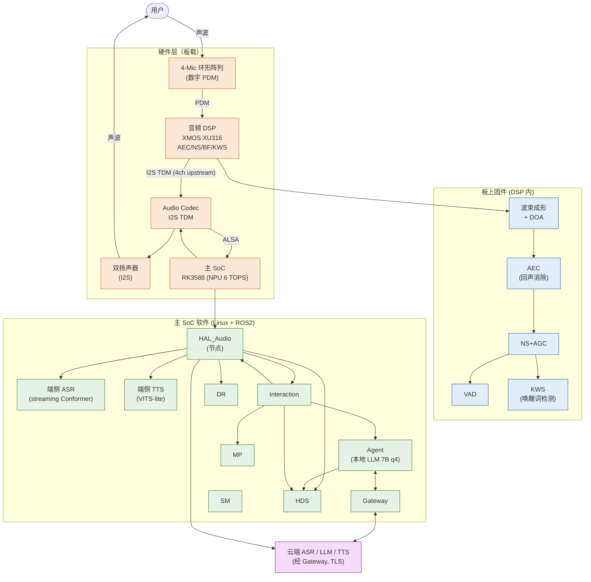
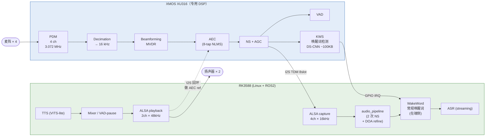
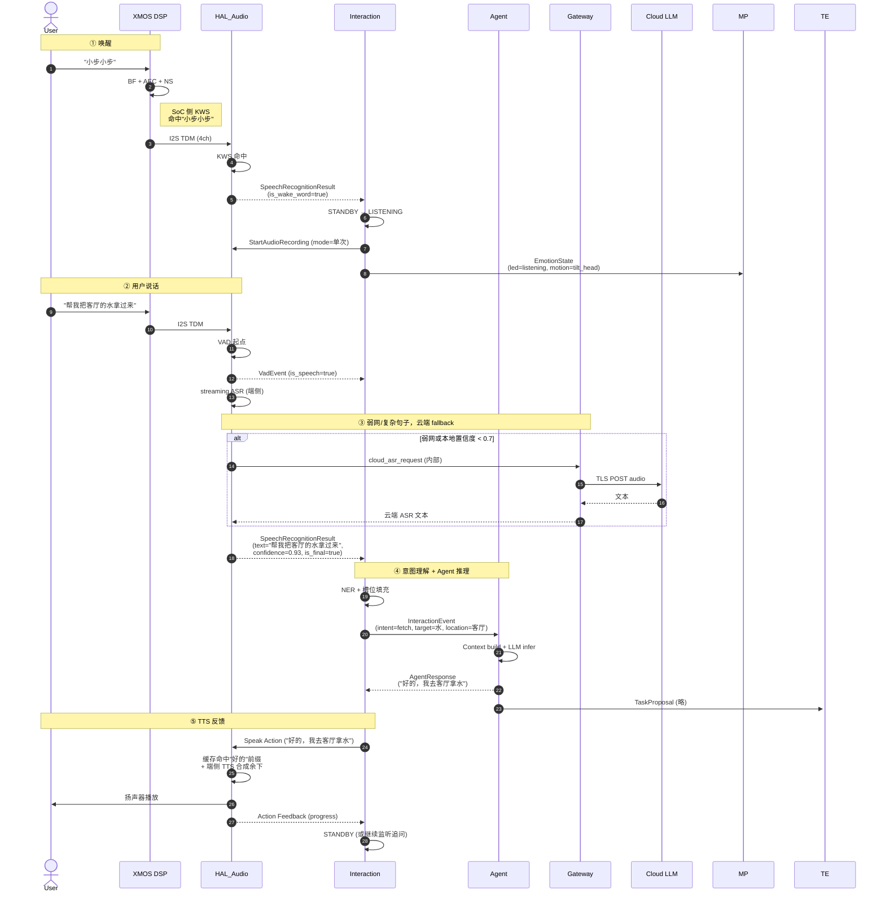
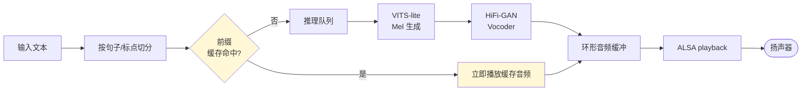

# 语音交互子系统软硬件详细方案

> 版本：v1.0
> 日期：2026-05-07
> 范围：从声学前端到 LLM 决策再到语音/动作反馈的完整端到端语音交互链路
> 子系统类型：横切型（Cross-cutting subsystem），跨越 HAL/中间件/交互/AI 四层

---

## 0. 文档定位与阅读指引

### 0.1 子系统视角 vs 模块视角

| 文档类型 | 关注点 | 示例 |
|---------|--------|------|
| 模块设计文档（`design/.../*_design.md`） | 单模块"做什么/怎么做" | `hal_audio_design.md` |
| **子系统方案**（本文档） | **端到端体验链"用什么硬件 + 怎样串起来"** | 本文档 |
| 用例文档（`design/use_cases/*.md`） | 业务场景"用户故事" | `use_case_04_voice_assistant.md` |

本文档**不重复**各模块文档已经定义的接口和内部实现，只补全模块文档之间的"接缝"：
- 声学/电气硬件方案（模块文档中均未涉及）
- 端到端延迟预算如何分配给各模块
- 端云分流策略与模型选型决策
- 部署拓扑与冷/热启动顺序

### 0.2 涉及模块

| 模块 | 在子系统中的角色 | 详细设计 |
|------|----------------|---------|
| **HAL_Audio** | 声学前端 + 端侧 ASR/TTS + 唤醒词 | [hal_audio_design.md](../design/layer_07_hal_infra/hal_audio_design.md) |
| **Interaction** | 多模态意图融合 + 对话状态机 + TTS 编排 | [interaction_design.md](../design/layer_02_interaction/interaction_design.md) |
| **Agent** | LLM 推理 + 技能调用 + 长期记忆 | [agent_design.md](../design/layer_01_ai/agent_design.md) |
| **Gateway** | 云端 ASR/TTS/LLM fallback 出口 | [gateway_design.md](../design/layer_06_middleware/gateway_design.md) |
| **MP** | 交互伴随动作（点头/挥手/表情） | [mp_design.md](../design/layer_05_motion/mp_design.md) |
| **SM** | 状态校验 | [sm_design.md](../design/layer_06_middleware/sm_design.md) |
| **HDS** | ASR/TTS 健康监测 + 故障定级 | [hds_design.md](../design/layer_06_middleware/hds_design.md) |
| **DR** | 交互数据采集（VLA 训练数据） | [dr_design.md](../design/layer_03_application/dr_design.md) |

---

## 1. 子系统概述与定位

### 1.1 任务陈述

提供一个**低延迟、抗噪、隐私可控、可降级**的端到端语音交互子系统：从用户说出唤醒词到机器人完成"理解 + 反馈"的全过程，在嘈杂家庭/工厂环境下保持可用性，并在弱网或无网时仍能完成核心交互。

### 1.2 核心能力

| 能力 | 说明 |
|------|------|
| 唤醒词检测（KWS） | 端侧、离线、低功耗，支持自定义唤醒词 |
| 流式 ASR | 端侧轻量 + 云端高精度双模，弱网自动降级 |
| 多模态意图融合 | 语音 + 视觉 + 触觉 + 消息四模态时间窗融合 |
| LLM 推理与规划 | 端侧 LLM 优先（< 500ms），云端 LLM 作为复杂场景 fallback |
| 流式 TTS | 端侧轻量合成 + 云端高保真，缓存命中常用回复 |
| 多人识别 | 声纹 + 人脸交叉验证（与 Perception/Interaction 协同） |
| 隐私保护 | 一键本地模式，禁用云端，原始音频不外传 |

### 1.3 设计原则

- **分层可降级**：每一层都有 fallback（云端→端侧→缓存→静默）
- **接口规范化**：所有跨模块通信走 ROS2 标准接口（Topic/Service/Action）
- **隐私优先**：默认本地处理，云端调用需明确 fallback 触发条件

---

## 2. 设计目标与非功能需求

### 2.1 功能性需求

| ID | 需求 | 验收标准 |
|----|------|---------|
| F-1 | 在 1m 距离、SNR ≥ 10dB 环境下唤醒成功率 ≥ 95% | 自动化测试集 100 条 |
| F-2 | 命令词识别准确率 ≥ 95%（25 条预定义命令） | 安静环境 |
| F-3 | 自由对话识别字错率（CER） ≤ 8% | 普通话，云端 ASR |
| F-4 | TTS MOS ≥ 4.0（自然度） | 主观评分 N=20 |
| F-5 | 多模态融合：语音 + 手势同时下达"拿那个"，识别为单一组合意图 | 融合窗口 500ms |
| F-6 | 弱网/断网时端侧仍可完成唤醒 + 命令词识别 + 常用回复 TTS | 网络断开自动测试 |
| F-7 | 隐私模式：一键关闭云端，所有数据本地处理且不写入持久化 | Privacy 模式审计 |

### 2.2 非功能性需求

| ID | 维度 | 目标 |
|----|------|------|
| NF-1 | 端到端首响应延迟（"小步" → "我在"） | ≤ 800ms |
| NF-2 | 自由对话端到端延迟（用户停说 → TTS 起播） | ≤ 1.5s（端侧 LLM） / ≤ 3.0s（云端 LLM） |
| NF-3 | RK3588 主核 CPU 占用（同时 ASR + TTS） | ≤ 15% |
| NF-4 | 内存占用（含模型 + 缓冲区） | ≤ 600MB |
| NF-5 | 音频 DSP 功耗（待机） | ≤ 50mW |
| NF-6 | 主 SoC 功耗（待机时仅 KWS 工作） | ≤ 1.5W |
| NF-7 | 连续对话稳定性 | 24 小时无内存泄漏 |
| NF-8 | 唤醒误触发率 | ≤ 0.5 次/24小时（典型家庭噪声） |

---

## 3. 端到端架构总览

### 3.1 系统总览图



### 3.2 数据通路与所有权

| 段 | 数据 | 速率 | 物理介质 | 所有者 |
|----|------|------|---------|--------|
| ① 麦阵 → DSP | PDM × 4 | 3.072 MHz × 4 | PDM 总线 | 硬件 |
| ② DSP → Codec | I2S TDM 8-slot | 1.024 MHz BCLK | I2S | DSP 固件 |
| ③ Codec → SoC | I2S/ALSA | 16 kHz × 4ch × 16-bit | I2S（CPU DMA） | 内核驱动 |
| ④ SoC 内 ASR/TTS | RAM | — | — | HAL_Audio |
| ⑤ HAL_Audio → 上层 | ROS2 Topic/Action | 事件驱动 | 共享内存（DDS） | ROS2 |
| ⑥ Gateway → 云 | MQTT/WebSocket over TLS | 突发 | WiFi/5G | Gateway |
| ⑦ SoC → Codec → 扬声器 | I2S | 48 kHz × 2ch | I2S | HAL_Audio |

`★ Insight ─────────────────────────────────────`
- 通路 ③ 是 4 通道上行（不仅是单声道），保留通道独立性给上层后续可能的回声消除二次处理或声源定位（DOA）使用。
- ASR 和 TTS 的本地推理模型尽量走 RK3588 NPU（RKNN runtime），把 CPU 留给 ROS2 调度。
`─────────────────────────────────────────────────`

---

## 4. 硬件方案（中等深度：选型 + 拓扑，不出 BOM）

### 4.1 声学拓扑

#### 4.1.1 麦克风阵列

| 参数 | 选择 | 理由 |
|------|------|------|
| 阵列形态 | 4-Mic 环形阵列（直径 60–80mm） | 均衡 360° 拾音，DOA 精度 ≤ ±15° |
| 麦克风类型 | 数字 MEMS（PDM 输出） | 低噪声（AOP ≥ 130 dB SPL）、抗 EMI、布线简单 |
| 候选型号 | Knowles SPH0641LU4H-1 / TDK ICS-41351 | 主流方案，SNR ≥ 65 dB(A) |
| 安装位置 | 头部顶端 / 颈部环形开槽，与服务对话方向无遮挡 | 避免被肩部/手臂遮挡 |

**拓扑图（俯视）**：

```
       Mic0 (front)
          |
          |
   Mic3 — + — Mic1
          |
          |
       Mic2 (rear)

   阵列直径 D = 70mm
   工作频率：300 Hz – 7 kHz（语音带宽）
   设计远场拾取距离：≤ 3m（日常室内）
```

#### 4.1.2 扬声器

| 参数 | 选择 |
|------|------|
| 通道数 | 立体声（左右各 1） |
| 类型 | 全频小型动圈（Φ40mm 左右） |
| 功率 | 2 × 3W RMS |
| 安装 | 胸口对称两侧，朝向用户方向，避免对着麦阵直射 |
| 频响 | 200 Hz – 18 kHz ±3dB |

#### 4.1.3 关键声学指标

| 指标 | 目标 | 方法 |
|------|------|------|
| 麦阵 SNR | ≥ 65 dB | Pink Noise @ 1Pa |
| AEC ERLE | ≥ 30 dB | 双工对话播放 80dB SPL |
| 拾音距离 | 3 m @ 65 dB SPL | 静谧办公室 |
| 唤醒 SNR 下限 | -5 dB | 干扰为 65dB SPL 噪声 |
| 自体振动隔离 | ≥ 20 dB（机械隔振） | 步行中机械噪声衰减 |

### 4.2 关键芯片选型

#### 4.2.1 音频 DSP（专用，前端预处理 + KWS）

| 候选 | 优势 | 劣势 | 推荐 |
|------|------|------|------|
| **XMOS XU316** | 16 核 xCORE.AI，1024 MIPS，支持 PDM-4，自带 AEC/BF 库 | 生态相对小，需 xC 编程 | ⭐⭐⭐ 主推 |
| TI TLV320ADC5140 + DSP | 成熟方案 | KWS 需外接 MCU | ⭐⭐ |
| Espressif ESP32-S3 | 便宜 | 算力不足以同时 KWS+AEC | ⭐ 不推荐 |

**XMOS 职责**：
- PDM 解调（4 麦 → I2S TDM）
- 自适应波束成形（GSC/MVDR）
- AEC（远端 reference 来自 SoC I2S 回环）
- 噪声抑制 + AGC
- 双 VAD 输出（一个给 ASR，一个给 KWS）
- **KWS**：常驻关键词检测器，用于唤醒词检测

#### 4.2.2 主 SoC（NPU 推理 + ROS2）

- **Rockchip RK3588**：Cortex-A76 × 4 + A55 × 4 + Mali-G610 + 6 TOPS NPU
- **NPU 用途**：
  - 端侧 ASR（streaming Conformer，~120MB INT8）
  - 端侧 TTS（VITS-lite，~80MB FP16）
  - 端侧 LLM（Qwen2.5-1.5B 或 Phi-3-mini，q4_0 量化，≤ 2.5GB）
  - 部分模型可与 Agent 共享 NPU 时间片（通过 RKNN runtime 多任务调度）
- **CPU 用途**：
  - ROS2 节点（HAL_Audio、Interaction、Agent、Gateway）
  - 音频流水线胶水代码（ALSA/PortAudio → ring buffer）

#### 4.2.3 Audio Codec / Bridge

- **TI TLV320AIC3204** 或同等：连接 DSP 输出 I2S TDM 到 SoC，处理扬声器 DAC
- 采样率：上行 16 kHz × 4ch（语音），下行 48 kHz × 2ch（TTS/媒体）

### 4.3 信号流水线（DSP 与 SoC 分工）



**关键决策说明**：

1. **AEC 在 DSP 内做**：避免 SoC 上 ROS2 调度抖动导致的 reference 信号延迟漂移（通常 SoC 侧 AEC 难以稳定 ≤ 10ms）
2. **唤醒词在 SoC NPU 上做**：常规唤醒词（"小步小步"）在 SoC NPU 上做，可热更新
3. **VAD 也分两层**：DSP 给 KWS 用（轻量），SoC 给 ASR 用（更精确含尾点检测）

### 4.4 安装与机械约束

| 约束 | 要求 |
|------|------|
| 麦阵顶部覆盖 | 防尘防泼网布（开孔率 ≥ 30%，避免高频损失） |
| 隔振 | 麦阵 PCB 用硅胶圈隔振，与机械骨架不直接刚性连接，衰减步行/电机振动 |
| 风噪 | 户外可选海绵风罩（开关装拆） |
| 扬声器声学腔 | 后腔密封，防止漏声反馈到麦阵 |
| 电气隔离 | DSP 模拟电源 LDO 独立，与电机 PWM 走线分层 |
| 屏蔽 | DSP 与 Codec 放金属屏蔽罩，远离无线模组（WiFi/5G）≥ 50mm |

### 4.5 电源与时钟

| 信号 | 来源 | 备注 |
|------|------|------|
| MCLK 12.288 MHz | 板载 TCXO（独立晶振） | 不与 SoC 复用，避免抖动 |
| BCLK / LRCLK | DSP 内部分频 | I2S 主时钟 |
| DSP VDD 3.3V | LDO 独立 | 隔离主板电源噪声 |
| 待机功耗 | DSP（仅 KWS）≤ 50mW；SoC 大核休眠 | 整机待机 < 2W |

---

## 5. 软件方案

### 5.1 模块协作矩阵

| 模块 | 在语音子系统中的输入 | 在语音子系统中的输出 | 关键接口 |
|------|--------------------|--------------------|---------|
| **HAL_Audio** | DSP TDM 流（4ch 16kHz）+ Interaction TTS 请求 | `SpeechRecognitionResult`、`VadEvent`、TTS 播放 | `/hal_audio/speech_recognition_result`、`/hal_audio/speak`（Action） |
| **Interaction** | ASR 文本、视觉/触觉意图 | `VoiceIntent`、`InteractionEvent`、TTS 请求 | `/interaction/interaction_event` → Agent |
| **Agent** | `InteractionEvent` | `AgentResponse`、`TaskProposal` | `/agent/agent_response` → Interaction |
| **Gateway** | Agent 云端推理请求、HAL_Audio 云端 ASR/TTS 请求 | 云端响应 | 内部 Service（不上 ROS2 总线） |
| **SM** | 各模块状态 | `RobotState` | `/sm/robot_state` |
| **MP** | `EmotionState` 中的 motion_hint | 关节动作 | `/mp/play_motion`（Action） |
| **HDS** | 各模块心跳、ASR/TTS 时延、KWS 误触统计 | 故障定级 | `/hds/health_report` |
| **DR** | `SpeechRecognitionResult`、`InteractionEvent` | 训练数据集 | 录制按需采样 |

### 5.2 端到端数据流（一轮典型对话）



### 5.3 关键流程

#### 5.3.1 流程 A：冷启动 → 唤醒就绪

| 步骤 | 时间 | 动作 |
|------|------|------|
| 0 | 0 ms | EM 启动 HAL_Audio 节点 |
| 1 | +200 ms | HAL_Audio 打开 ALSA 设备，DSP 初始化（XMOS 已 boot） |
| 2 | +800 ms | RKNN runtime 加载 KWS / ASR / TTS 模型到 NPU |
| 3 | +900 ms | TTS 缓存预加载（"好的"、"我在"、"请稍等"、"已完成" × 4 模型） |
| 4 | +1000 ms | 进入 READY，开始 KWS 监听（DSP 已经一直在 KWS，主 SoC KWS 此时启动） |
| 5 | — | Interaction 收到 `audio_device_state`（READY） |

#### 5.3.2 流程 B：流式 TTS（首包优先）



**首包延迟优化**：
- 文本预处理（数字 → 中文、英文 → 拼音）必须 ≤ 50ms
- 第一句先用缓存或更小的模型快速合成"先开口"，剩余部分异步流出

#### 5.3.3 流程 C：弱网/无网降级链

```
正常路径：              SoC ASR → 置信度 ≥ 0.85 → Interaction
                              ↓ 置信度 < 0.85
云端增强：              Gateway → Cloud ASR (timeout 3s) → Interaction
                              ↓ 超时/失败
强降级：                沿用 SoC 结果，置信度标 LOW，Interaction 进入 AWAITING_CONFIRM 反问

完全离线：              仅 KWS + 命令词识别（25 词集）+ 缓存 TTS
```

#### 5.3.4 流程 D：隐私模式

| 策略 | 状态 |
|------|------|
| Gateway 不上传任何音频 | 强制本地 ASR |
| TTS 不调云端 | 本地 VITS-lite |
| Agent 不调云端 LLM | 强制本地 Qwen2.5-1.5B |
| DR 不录制音频 | InteractionEvent 仍可记录但脱敏 |
| 启用 LED + TTS 提示 | "已进入隐私模式" |

### 5.4 ROS2 接口汇总（聚合视图，详情见各模块文档）

#### 5.4.1 Topic（仅列与语音子系统直接相关者）

| Topic | Pub | Sub | 用途 |
|------|-----|-----|------|
| `/hal_audio/audio_device_state` | HAL_Audio | EM/HDS/Interaction | 音频硬件状态 |
| `/hal_audio/vad_event` | HAL_Audio | Interaction、DR | VAD 起止点 |
| `/hal_audio/speech_recognition_result` | HAL_Audio | Interaction、DR | ASR 文本（含 wake_word 标记） |
| `/interaction/voice_intent` | Interaction | Agent | 细粒度语音意图 |
| `/interaction/interaction_event` | Interaction | Agent、TE | 标准化交互事件 |
| `/interaction/emotion_state` | Interaction | MP、LED | 情感反馈 |
| `/agent/agent_response` | Agent | Interaction、Gateway | LLM 响应文本 |
| `/sm/robot_state` | SM | HAL_Audio、Interaction、Agent | 状态广播（FAULT 时静默） |
| `/hal_audio/heartbeat`、`/interaction/heartbeat`、`/agent/heartbeat` | 各自 | EM/HDS | 1 Hz 心跳 |

#### 5.4.2 Service / Action

| 名称 | 类型 | 调用方向 |
|------|------|---------|
| `/hal_audio/start_recording` | Service | Interaction → HAL_Audio |
| `/hal_audio/stop_recording` | Service | Interaction → HAL_Audio |
| `/hal_audio/speak` | Action | Interaction → HAL_Audio |
| `/hal_audio/set_audio_parameters` | Service | Setting → HAL_Audio |
| `/interaction/set_interaction_mode` | Service | Setting → Interaction |

#### 5.4.3 不允许跨过的接口（红线）

- ❌ Agent 直接订阅 `/hal_audio/speech_recognition_result`：必须经 Interaction 标准化
- ❌ HAL_Audio 直接发布 `/sm/robot_state`：必须经 SM
- ❌ 其他模块直接调用云端 ASR/TTS：必须经 Gateway
- ❌ Interaction 直接下发关节指令：交互动作走 MP

### 5.5 模型选型与端云策略

| 任务 | 端侧模型（首选） | 云端模型（fallback） | 切换触发 |
|------|---------------|------------------|---------|
| **唤醒词** | Sherpa-onnx KWS（"小步小步"） | — | 永远本地 |
| **ASR** | Sherpa-onnx Streaming Conformer-Tiny（中文 30MB INT8） | 火山/阿里实时 ASR | 置信度 < 0.85 或音频时长 > 5s |
| **TTS** | VITS-lite + HiFi-GAN（80MB） | 火山 TTS | 高保真音色需求 / OOV 复杂文本 |
| **LLM** | Qwen2.5-1.5B-Instruct q4_0（≤ 2.5GB，RKNN） | Qwen2.5-72B / GPT-4o-mini | 上下文 > 4k token / 复杂规划 |
| **声纹** | ECAPA-TDNN tiny（10MB） | — | 永远本地（隐私） |

**端云分流策略代码层**：
- 决策点在 HAL_Audio（ASR）和 Agent（LLM），不在 Interaction
- Interaction 不感知"这是端还是云的结果"，只看 confidence + latency 元数据
- 切换决策记录在 `/hds/health_report`，便于事后回溯调优

`★ Insight ─────────────────────────────────────`
- 模型选型有三个潜在的"非显然"决策：(1) ASR 用 streaming Conformer 而不是 Whisper，因 Whisper 是非流式延迟高；(2) TTS 用 VITS 而非 Tacotron2，因前者推理速度更快、单次合成；(3) 端侧 LLM q4_0 量化是为了在 RK3588 NPU 上能 ≥ 10 token/s。
- 端云分流的 confidence 阈值 0.85 不是拍脑袋——这是端侧 ASR 在标注集上的 P95 准确率分位点；低于这个阈值的样本才有"上云改善"的统计意义。
`─────────────────────────────────────────────────`

---

## 7. 端到端延迟预算（自顶向下分解）

### 7.1 KPI 与分配

| 场景 | 总目标 | 段落分解（典型） |
|------|--------|----------------|
| 唤醒响应（"小步" → "我在"） | **800 ms** | DSP 80 + SoC KWS 50 + Interaction 状态切 30 + TTS 缓存命中 100 + ALSA 缓冲 + 扬声器 = 800 ms |
| 一轮简单对话（端侧 LLM） | **1.5 s** | ASR 300 + 意图 50 + Agent 500 + TTS 首包 300 + 播放 350 |
| 一轮复杂对话（云端 LLM） | **3.0 s** | ASR 300 + 意图 50 + Gateway 50 + Cloud LLM 1500 + TTS 首包 300 + 播放 800 |
| TTS 首包 | **300 ms** | 缓存命中 ≤ 50ms；冷推理 250ms |

### 7.2 抖动控制要求

- HAL_Audio 节点：CallbackGroup 至少分 4 组（采集线程 / ASR / TTS / Heartbeat），ASR 推理不阻塞 TTS
- 采集线程为 SCHED_FIFO 优先级 80
- TTS 推理使用独立 thread pool，不进入 ROS2 executor 默认线程

### 7.3 核心 KPI 监测点

| KPI | 上报模块 | 上报频率 |
|-----|---------|---------|
| ASR 首字延迟 P50/P95 | HAL_Audio → HDS | 每次识别 |
| TTS 首包延迟 P50/P95 | HAL_Audio → HDS | 每次合成 |
| Agent LLM 推理延迟 | Agent → HDS | 每次推理 |
| KWS 误触发计数 | HAL_Audio → HDS | 1 分钟一次 |
| 端云切换次数 | HAL_Audio → HDS | 1 分钟一次 |
| AEC ERLE | HAL_Audio → HDS | 30s 移动平均 |

---

## 8. 部署与配置

### 8.1 进程拓扑

```
systemd
├── striding-em.service                # 编排器，最先启动
│   └── 拉起以下 ROS2 节点：
│       ├── striding-hal-audio.service  (拉起 HAL_Audio)
│       ├── striding-interaction.service
│       ├── striding-agent.service
│       └── striding-gateway.service
└── striding-rkllm-service.service      # NPU LLM 推理后端，HAL_Audio + Agent 共享
```

**启动顺序约束**：
- `hal-audio` 在 `tf` + `hal-ethercat` 后启动（依赖音频时钟可用）
- LLM 模型加载到 NPU 是阻塞操作，HAL_Audio 启动前需异步预热

### 8.2 模型存放

```
/opt/striding/models/voice/
├── kws_wakeword.onnx              # 唤醒词（SoC 端）
├── asr_streaming_zh.onnx          # 端侧 ASR
├── tts_vits_lite.onnx             # 端侧 TTS
├── tts_vocoder_hifigan.onnx
├── tts_cache/                      # 预合成缓存
│   ├── 好的.wav
│   ├── 我在.wav
│   └── ...
├── speaker_id_ecapa.onnx          # 声纹
└── llm/
    └── qwen2.5_1.5b_q4_0.rkllm    # NPU 部署格式

/opt/striding/firmware/dsp/
├── xmos_xu316_v1.2.3.bin          # DSP 固件
└── kws_keywords_v1.0.bin          # KWS 关键词模型（签名）
```

模型升级走 FOTA。DSP 固件升级需断电重新启动（设计为可滚回）。

### 8.3 关键参数（聚合视图）

完整参数见各模块 `*_params.yaml`，此处只列子系统级 cross-cut 配置：

```yaml
# voice_subsystem.yaml （聚合视图，实际分散在各模块）
voice_subsystem:
  wake_word: "你好小步"
  asr:
    cloud_fallback_threshold_confidence: 0.85
    cloud_fallback_max_audio_sec: 5.0
    cloud_timeout_ms: 3000
  tts:
    enable_cache: true
    preload_phrases: ["好的", "我在", "请稍等", "已完成"]
  privacy:
    default_mode: "normal"     # normal / privacy
    auto_enter_privacy_after_idle_min: 0   # 0=禁用
```

---

## 9. 安全与隐私

### 9.1 安全约束（运动相关）

- HAL_Audio **不允许**直接调用 MC/MS/MP 接口（必须经 Interaction → Agent → TE）
- 任何"停止类"关键词由常规 ASR 检出，经 Interaction → Agent → TE 路径处理；SM 是唯一状态权威
- `FAULT` 状态下：
  - HAL_Audio 停止 ASR 推理（保留 KWS 一直运行）
  - Interaction 停止 TTS 请求生成（除安全提示音）
  - Agent 暂停推理循环

### 9.2 隐私保护

| 数据 | 默认位置 | 加密 | 上传策略 |
|------|---------|------|---------|
| 原始音频帧（PCM） | 内存（环形缓冲） | — | 不持久化、不上传（DEBUG 模式除外） |
| ASR 文本 | 短期内存（Interaction 上下文） | — | 默认本地；隐私模式禁用云端 |
| 用户 profile（声纹/偏好） | 本地 SQLite | AES-256（密钥来自 TPM/secure-store） | 不上传 |
| 长期对话历史 | 本地 + Agent 长期记忆 | AES-256 | 不上传；用户可一键清除 |
| 训练数据（DR 录制） | 本地分区 | AES-256 | 仅在用户授权后上传，且脱敏 |

### 9.3 滥用防御

- TTS 不允许通过外部接口任意触发（仅 Interaction Action 入口，且 Interaction 校验来源）
- Agent 的危险指令检测在 LLM 之前先做关键词预过滤
- 远程 APP 推送的 TTS 文本必须经 Gateway 签名 + Interaction 二次审查

---

## 10. 测试与验证

### 10.1 单元测试

| 模块 | 重点 |
|------|------|
| HAL_Audio | KWS 命中率、ASR 流式接口、TTS 缓存命中、AEC ERLE 实测 |
| Interaction | 多模态融合时序、状态机转换、隐私模式切换 |
| Agent | 工具调用 schema 校验、上下文截断 |

### 10.2 集成测试场景

| 编号 | 场景 | 验收 |
|------|------|------|
| IT-V1 | 安静环境唤醒 + 命令词 | 100 条 → ≥ 95% 成功 |
| IT-V2 | 65 dB 噪声 + TTS 同时播放 + 用户说话 | AEC 后 ASR ≥ 90% |
| IT-V3 | 弱网（带宽限至 64 kbps）连续对话 10 轮 | 无卡死，自动降级到端侧 |
| IT-V4 | 完全断网 30 分钟 | 唤醒 + 命令词正常 |
| IT-V5 | 隐私模式审计 | 抓包确认 Gateway 无音频上传 |
| IT-V6 | KWS 误触发率 | 24 小时家庭噪声 ≤ 0.5 次 |

### 10.3 性能基准

- ASR 测试集：AISHELL-1 dev（中文）
- TTS 评测：DiffSinger LJSpeech 标注 + MOS 主观评分
- 唤醒测试集：自建 1000 条远场录音（不同距离/SNR/角度）

### 10.4 安全测试

- DSP 固件签名测试：尝试加载未签名 KWS 关键词包，必须被拒绝
- 滥用测试：构造非 Interaction 来源的伪 TTS 请求，验证被拒

---

## 11. 风险与开放问题

| 风险/问题 | 影响 | 缓解 / 后续工作 |
|----------|------|---------------|
| RK3588 NPU 同时跑 ASR+TTS+LLM 是否真能保证 SLA | 中 | 设置 NPU 时间片优先级，LLM 推理可降级到 CPU；POC 阶段实测 |
| XMOS XU316 中文 KWS 模型生态不如 ESP-S3 | 低 | 自训 + DS-CNN 量化；保留 TI 替代方案 |
| 流式 TTS 首包延迟在长句开头依然可能 > 300ms | 中 | "先开口"策略（先合成短前缀），后续部分流式追加 |
| 多人同声场景下声纹不稳定 | 中 | 需 Perception 提供视觉对齐（人脸 + lip sync） |
| 隐私模式下 LLM 能力受限（端侧 1.5B 较弱） | 中 | 能力公示给用户，可由用户主动切回标准模式 |
| 自体 TTS 唤醒抑制窗（100ms）是否足够 | 中 | 与 AEC 收敛时间联动；TTS 播放期间将 KWS 阈值临时上调 0.05 |

### 11.1 后续工作清单

- [ ] DSP 固件 KWS 关键词集合的语料采集与训练
- [ ] RKNN 化端侧 LLM 的 batch=1 推理速度实测
- [ ] 端侧 ASR 在 24 通道高混响办公室的字错率测试
- [ ] 与 Perception 联动的"看着我说话"姿态/凝视加权 KWS 触发实验

---

## 12. 引用文档

### 12.1 项目内部文档

- 架构总览：[system_architecture.md](../design/system_architecture.md)
- HAL_Audio：[hal_audio_design.md](../design/layer_07_hal_infra/hal_audio_design.md)
- Interaction：[interaction_design.md](../design/layer_02_interaction/interaction_design.md)
- Agent：[agent_design.md](../design/layer_01_ai/agent_design.md)
- Gateway：[gateway_design.md](../design/layer_06_middleware/gateway_design.md)
- SM：[sm_design.md](../design/layer_06_middleware/sm_design.md)
- HDS：[hds_design.md](../design/layer_06_middleware/hds_design.md)
- 用例 04：[use_case_04_voice_assistant.md](../design/use_cases/use_case_04_voice_assistant.md)

### 12.2 外部技术参考

- XMOS xCORE.AI Audio Reference Designs
- Rockchip RKNN Toolkit 2 — RK3588 NPU 部署
- Sherpa-onnx — 端侧 ASR/KWS 推理框架
- VITS / HiFi-GAN — TTS 模型
- ROS2 Real-Time Working Group — RT executor 实践

---

## 附录 A：与 use_case_04 的对应关系

| use_case_04 步骤 | 本子系统涉及组件 |
|-----------------|----------------|
| "用户语音唤醒" | §3 |
| "ASR 转文本" | §5.4 ASR + §5.5 端云策略 |
| "Interaction 意图理解" | §5.1 + Interaction 模块文档 |
| "Agent 推理规划" | §5.5 LLM + Agent 模块文档 |
| "TTS 反馈" | §5.3.2 流式 TTS |

## 附录 B：变更记录

| 日期 | 版本 | 变更 |
|------|------|------|
| 2026-05-07 | v1.0 | 初版：含中等深度硬件方案 |
